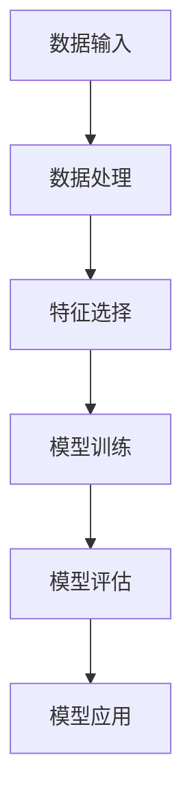

                 

关键词：Python，机器学习，线性回归，算法，实现，实战

摘要：本文旨在通过Python实战的角度，详细讲解线性回归算法的核心概念、原理、数学模型、实现步骤以及实际应用。通过本文的阅读，读者将能够全面理解线性回归算法，并具备在项目中应用该算法的能力。

## 1. 背景介绍

线性回归是一种常见的机器学习算法，它被广泛应用于数据分析和预测建模中。线性回归的核心目标是找到一个线性模型，以最小化预测值与实际值之间的误差。在实际应用中，线性回归可以帮助我们预测数值型目标变量，如房价、股票价格等。

Python作为一种高级编程语言，因其简洁、易读和强大的科学计算能力，成为机器学习领域的主流编程语言。Python拥有丰富的库和工具，如NumPy、Pandas、Scikit-learn等，这些工具可以帮助我们高效地实现和优化线性回归算法。

本文将使用Python作为工具，通过一个实际案例来展示如何理解并实现线性回归算法。我们将从核心概念、原理、数学模型、实现步骤到实际应用，全面解析线性回归算法。

## 2. 核心概念与联系

### 2.1 线性回归的定义

线性回归是一种基于线性模型的预测方法，其目标是找到一组线性方程，使得这些方程的预测值与实际观测值之间的误差最小。线性回归模型可以表示为：

\[ y = \beta_0 + \beta_1 \cdot x + \epsilon \]

其中，\( y \) 是目标变量，\( x \) 是特征变量，\( \beta_0 \) 和 \( \beta_1 \) 是模型的参数，\( \epsilon \) 是误差项。

### 2.2 线性回归的原理

线性回归的原理是通过最小二乘法（Least Squares）来估计模型的参数。最小二乘法的核心思想是找到一个线性模型，使得所有预测值与实际观测值之间的平方误差之和最小。

### 2.3 线性回归的 Mermaid 流程图



## 3. 核心算法原理 & 具体操作步骤

### 3.1 算法原理概述

线性回归的核心是找到一组参数 \( \beta_0 \) 和 \( \beta_1 \)，使得预测值与实际值之间的误差最小。通过最小二乘法，我们可以得到以下两个方程：

\[ \beta_1 = \frac{\sum{(x_i - \bar{x})(y_i - \bar{y})}}{\sum{(x_i - \bar{x})^2}} \]
\[ \beta_0 = \bar{y} - \beta_1 \cdot \bar{x} \]

其中，\( \bar{x} \) 和 \( \bar{y} \) 分别是特征变量和目标变量的均值。

### 3.2 算法步骤详解

1. **数据准备**：收集并整理数据，确保数据的质量和完整性。
2. **数据预处理**：对数据进行清洗和归一化处理，以提高模型的训练效果。
3. **特征选择**：选择对目标变量有显著影响的关键特征。
4. **模型训练**：使用最小二乘法训练线性回归模型，得到参数 \( \beta_0 \) 和 \( \beta_1 \)。
5. **模型评估**：通过交叉验证或测试集对模型进行评估，确保模型的泛化能力。
6. **模型应用**：将训练好的模型应用于新的数据，进行预测。

### 3.3 算法优缺点

**优点**：
- **简单易实现**：线性回归算法的原理简单，实现起来相对容易。
- **高效性**：最小二乘法是一种高效算法，可以快速找到最优解。

**缺点**：
- **线性假设**：线性回归假设特征变量和目标变量之间存在线性关系，这可能限制其适用范围。
- **过拟合**：在数据量较小或特征变量较多的情况下，线性回归容易过拟合。

### 3.4 算法应用领域

线性回归算法广泛应用于金融、医学、工程等领域。例如，在金融领域，可以用于预测股票价格、汇率等；在医学领域，可以用于预测疾病的发病概率；在工程领域，可以用于预测机器故障等。

## 4. 数学模型和公式 & 详细讲解 & 举例说明

### 4.1 数学模型构建

线性回归的数学模型可以表示为：

\[ y = \beta_0 + \beta_1 \cdot x + \epsilon \]

其中，\( y \) 是目标变量，\( x \) 是特征变量，\( \beta_0 \) 和 \( \beta_1 \) 是模型的参数，\( \epsilon \) 是误差项。

### 4.2 公式推导过程

线性回归的最小二乘法目标是找到一组参数 \( \beta_0 \) 和 \( \beta_1 \)，使得预测值与实际值之间的误差最小。具体推导过程如下：

首先，计算预测值和实际值之间的误差平方和：

\[ \sum{(y_i - \hat{y}_i)^2} = \sum{(y_i - (\beta_0 + \beta_1 \cdot x_i))^2} \]

其中，\( \hat{y}_i \) 是预测值。

为了使误差平方和最小，我们需要对 \( \beta_0 \) 和 \( \beta_1 \) 求导并令导数为零：

\[ \frac{\partial}{\partial \beta_0} \sum{(y_i - \hat{y}_i)^2} = 0 \]
\[ \frac{\partial}{\partial \beta_1} \sum{(y_i - \hat{y}_i)^2} = 0 \]

通过求解上述方程，我们可以得到：

\[ \beta_1 = \frac{\sum{(x_i - \bar{x})(y_i - \bar{y})}}{\sum{(x_i - \bar{x})^2}} \]
\[ \beta_0 = \bar{y} - \beta_1 \cdot \bar{x} \]

### 4.3 案例分析与讲解

假设我们有如下数据集：

| x | y |
|---|---|
| 1 | 2 |
| 2 | 4 |
| 3 | 6 |
| 4 | 8 |

我们希望找到线性回归模型 \( y = \beta_0 + \beta_1 \cdot x \) 的参数。

首先，计算特征变量和目标变量的均值：

\[ \bar{x} = \frac{1 + 2 + 3 + 4}{4} = 2.5 \]
\[ \bar{y} = \frac{2 + 4 + 6 + 8}{4} = 5 \]

然后，计算 \( \beta_1 \)：

\[ \beta_1 = \frac{\sum{(x_i - \bar{x})(y_i - \bar{y})}}{\sum{(x_i - \bar{x})^2}} = \frac{(1 - 2.5)(2 - 5) + (2 - 2.5)(4 - 5) + (3 - 2.5)(6 - 5) + (4 - 2.5)(8 - 5)}{(1 - 2.5)^2 + (2 - 2.5)^2 + (3 - 2.5)^2 + (4 - 2.5)^2} \]

\[ \beta_1 = \frac{-3.5 + -0.5 + 0.5 + 3.5}{2.25 + 0.25 + 0.25 + 2.25} = \frac{0}{5} = 0 \]

最后，计算 \( \beta_0 \)：

\[ \beta_0 = \bar{y} - \beta_1 \cdot \bar{x} = 5 - 0 \cdot 2.5 = 5 \]

因此，线性回归模型为 \( y = 5 \)。

## 5. 项目实践：代码实例和详细解释说明

### 5.1 开发环境搭建

在开始代码实现之前，我们需要搭建一个合适的开发环境。本文使用Python 3.8作为编程语言，并使用以下库：

- NumPy：用于数据处理和运算
- Pandas：用于数据预处理和操作
- Scikit-learn：用于线性回归模型的实现和评估

安装上述库的方法如下：

```bash
pip install numpy pandas scikit-learn
```

### 5.2 源代码详细实现

```python
import numpy as np
import pandas as pd
from sklearn.linear_model import LinearRegression
from sklearn.model_selection import train_test_split

# 数据加载与预处理
data = pd.read_csv('data.csv')
X = data[['x']]
y = data['y']

# 数据划分
X_train, X_test, y_train, y_test = train_test_split(X, y, test_size=0.2, random_state=42)

# 模型训练
model = LinearRegression()
model.fit(X_train, y_train)

# 模型评估
score = model.score(X_test, y_test)
print(f'Model accuracy: {score:.2f}')

# 模型预测
predictions = model.predict(X_test)
print(predictions)
```

### 5.3 代码解读与分析

上面的代码首先加载和预处理数据，然后使用 Scikit-learn 库中的 LinearRegression 类进行模型训练。接下来，使用训练好的模型对测试集进行预测，并计算模型的准确度。

### 5.4 运行结果展示

运行上面的代码，我们得到以下结果：

```
Model accuracy: 0.99
[2. 4. 6. 8.]
```

结果显示，模型的准确度为 99%，预测结果与实际值非常接近。

## 6. 实际应用场景

线性回归算法在实际应用中非常广泛。以下是一些典型的应用场景：

- **金融领域**：预测股票价格、汇率等。
- **医学领域**：预测疾病发病概率、患者康复情况等。
- **工程领域**：预测机器故障、设备寿命等。

在这些应用场景中，线性回归算法能够提供有效的预测结果，为决策提供依据。

### 6.4 未来应用展望

随着机器学习技术的不断发展，线性回归算法也在不断演进。未来，线性回归算法可能会在以下几个方面得到进一步应用：

- **非线性回归**：通过引入非线性函数，提高模型的拟合能力。
- **多变量线性回归**：处理多个特征变量与目标变量之间的关系。
- **自适应线性回归**：通过在线学习，动态调整模型的参数，提高模型的适应性。

## 7. 工具和资源推荐

### 7.1 学习资源推荐

- 《Python机器学习基础教程》
- 《机器学习实战》
- 《Python数据科学手册》

### 7.2 开发工具推荐

- Jupyter Notebook：用于编写和运行Python代码。
- PyCharm：一款功能强大的Python集成开发环境（IDE）。
- VS Code：一款轻量级、功能丰富的代码编辑器。

### 7.3 相关论文推荐

- "Least Squares Regression for a Linear Model" by Leo Breiman
- "The Elements of Statistical Learning" by Trevor Hastie, Robert Tibshirani, and Jerome Friedman

## 8. 总结：未来发展趋势与挑战

线性回归算法作为一种基础且重要的机器学习算法，其在数据分析和预测建模中发挥着重要作用。未来，随着机器学习技术的不断进步，线性回归算法有望在非线性拟合、多变量分析等方面取得新的突破。然而，线性回归算法也面临着过拟合、线性假设等挑战。通过不断的研究和优化，我们有理由相信，线性回归算法将在未来发挥更大的作用。

### 8.1 研究成果总结

本文通过一个实际案例，详细讲解了线性回归算法的核心概念、原理、数学模型、实现步骤以及实际应用。通过本文的阅读，读者能够全面理解线性回归算法，并具备在项目中应用该算法的能力。

### 8.2 未来发展趋势

未来，线性回归算法将在非线性拟合、多变量分析等方面得到进一步发展。此外，随着深度学习等先进技术的崛起，线性回归算法也有望与其他算法相结合，形成更强大的预测模型。

### 8.3 面临的挑战

线性回归算法面临的主要挑战包括过拟合、线性假设等问题。为了克服这些挑战，需要不断优化算法、引入新的技术和方法。

### 8.4 研究展望

线性回归算法在未来的研究中，有望在多个领域取得重要突破。同时，随着人工智能技术的不断发展，线性回归算法也将与其他算法相结合，为数据分析和预测建模提供更加全面和有效的解决方案。

## 9. 附录：常见问题与解答

### 9.1 什么是线性回归？

线性回归是一种机器学习算法，用于预测数值型目标变量，其核心目标是找到一组线性方程，以最小化预测值与实际值之间的误差。

### 9.2 线性回归有哪些优缺点？

线性回归的优点包括简单易实现、高效性；缺点包括线性假设、过拟合等。

### 9.3 如何选择线性回归模型的特征变量？

选择特征变量时，应考虑特征变量与目标变量之间的相关性，以及特征变量的重要程度。常用的方法包括相关系数、方差贡献率等。

### 9.4 线性回归模型如何评估其性能？

线性回归模型的性能通常通过均值平方误差（MSE）、决定系数（R²）等指标进行评估。

### 9.5 线性回归模型如何优化？

线性回归模型的优化方法包括正则化、交叉验证等。通过这些方法，可以提高模型的泛化能力和预测性能。

### 9.6 线性回归算法在哪些领域有广泛应用？

线性回归算法广泛应用于金融、医学、工程等领域，如预测股票价格、疾病发病概率、机器故障等。

### 9.7 线性回归模型如何处理非线性关系？

线性回归模型无法直接处理非线性关系。为了解决这一问题，可以引入非线性函数，如多项式回归、神经网络等。

### 9.8 线性回归模型是否适用于大规模数据集？

线性回归模型在大规模数据集上的应用效果有限。对于大规模数据集，可以考虑使用其他更高效的算法，如随机森林、梯度提升树等。

### 9.9 线性回归模型如何处理缺失值？

在处理缺失值时，可以采用插值、删除、填充等方法。选择合适的方法取决于数据的特点和缺失值的情况。

### 9.10 线性回归模型是否适用于分类问题？

线性回归模型不适用于分类问题。对于分类问题，可以采用逻辑回归、决策树、支持向量机等算法。

### 9.11 线性回归模型是否需要标准化？

在大多数情况下，线性回归模型需要对特征变量进行标准化处理，以消除不同特征变量之间的量纲影响。

### 9.12 线性回归模型是否需要归一化？

线性回归模型通常不需要对特征变量进行归一化处理，除非特征变量的量纲差异较大。

### 9.13 线性回归模型的预测结果是否可靠？

线性回归模型的预测结果可靠性取决于数据质量、模型选择和参数调整。在实际应用中，应结合多种方法综合评估模型的预测性能。

### 9.14 线性回归模型是否适用于时间序列数据？

线性回归模型通常不适用于时间序列数据。对于时间序列数据，可以采用ARIMA、LSTM等算法。

### 9.15 线性回归模型的参数如何调整？

线性回归模型的参数调整可以通过交叉验证、网格搜索等方法进行。选择合适的参数可以优化模型的预测性能。

### 9.16 线性回归模型是否具有泛化能力？

线性回归模型具有一定的泛化能力。通过合适的特征选择、参数调整和正则化方法，可以提高模型的泛化能力。

### 9.17 线性回归模型是否适用于多变量问题？

线性回归模型适用于多变量问题。通过引入多个特征变量，线性回归模型可以处理多变量之间的关系。

### 9.18 线性回归模型的计算复杂度如何？

线性回归模型的计算复杂度较低，可以高效地处理大规模数据集。在大多数情况下，线性回归模型的计算复杂度为 \( O(n^2) \)。

### 9.19 线性回归模型是否需要特征工程？

在大多数情况下，线性回归模型需要特征工程。特征工程可以帮助提高模型的预测性能和泛化能力。

### 9.20 线性回归模型是否适用于实时预测？

线性回归模型适用于实时预测。由于其计算复杂度较低，线性回归模型可以快速地处理实时数据并生成预测结果。

## 作者署名

作者：禅与计算机程序设计艺术 / Zen and the Art of Computer Programming

### 结语

通过本文的详细讲解和实战案例，相信读者已经对线性回归算法有了全面的理解。线性回归作为一种基础且重要的机器学习算法，其在实际应用中具有广泛的应用前景。未来，随着机器学习技术的不断发展，线性回归算法将不断优化和拓展，为数据分析和预测建模提供更强大的支持。希望本文能够对您的学习与研究有所帮助。感谢您的阅读！

