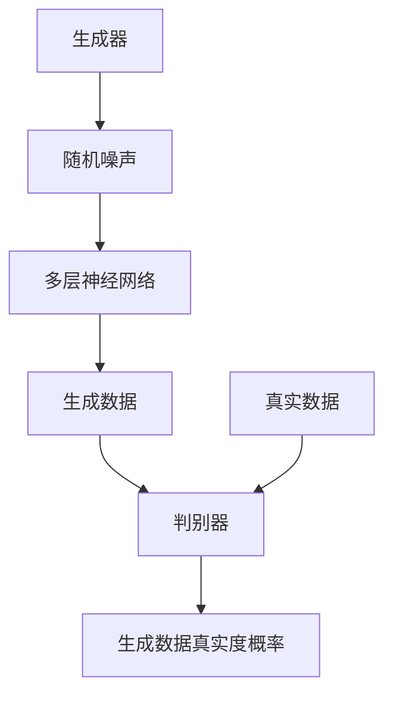

                 

关键词：生成对抗网络（GAN），机器学习，深度学习，人工智能，Python，算法原理，数学模型，应用领域，代码实例

摘要：本文旨在深入探讨生成对抗网络（GAN）的原理与应用，通过Python实战案例，详细介绍GAN的工作机制、数学模型及其实际应用，为读者提供全面的技术指导。

## 1. 背景介绍

生成对抗网络（GAN）是近年来在机器学习领域备受关注的一种深度学习模型。它由Ian Goodfellow等人在2014年提出，旨在通过两个对抗性的神经网络——生成器（Generator）和判别器（Discriminator）的相互博弈，实现高质量数据生成的目标。GAN在图像、语音、文本等多个领域展现出了卓越的性能，成为当前深度学习研究的重要方向。

本文将围绕GAN的核心概念、算法原理、数学模型及Python实现，系统地介绍GAN的实战技巧和应用场景。

## 2. 核心概念与联系

### 2.1 生成器（Generator）

生成器网络负责生成与真实数据相似的数据。其输入为随机噪声，通过多层神经网络的处理，输出为具有一定分布的生成数据。

### 2.2 判别器（Discriminator）

判别器网络负责区分生成数据和真实数据。其输入为生成数据和真实数据，输出为数据的真实度概率。

### 2.3 博弈关系

GAN中的生成器和判别器之间存在一种博弈关系。生成器的目标是生成尽可能逼真的数据，使得判别器无法区分生成数据和真实数据；而判别器的目标是提高对生成数据和真实数据的区分能力。

下面是GAN的核心概念原理和架构的Mermaid流程图：



## 3. 核心算法原理 & 具体操作步骤

### 3.1 算法原理概述

GAN的算法原理主要基于两个对抗性的神经网络：生成器和判别器。在训练过程中，生成器和判别器通过相互博弈，逐步提高生成数据的真实度和判别器的区分能力。

### 3.2 算法步骤详解

1. 初始化生成器G和判别器D，设置初始参数。
2. 生成器G根据随机噪声生成一批生成数据。
3. 判别器D同时接收真实数据和生成数据，计算两者的真实度概率。
4. 计算生成器的损失函数，更新生成器参数。
5. 计算判别器的损失函数，更新判别器参数。
6. 重复步骤2-5，直至生成器生成的数据足够逼真。

### 3.3 算法优缺点

**优点：**
- GAN能够生成高质量的数据，适用于多种数据类型，如图像、语音、文本等。
- GAN无需真实数据的标签，减少了标注成本。

**缺点：**
- GAN的训练过程不稳定，容易出现模式崩溃（mode collapse）现象。
- GAN的训练过程复杂，对参数调整要求较高。

### 3.4 算法应用领域

GAN在图像处理、计算机视觉、语音合成、自然语言处理等多个领域取得了显著的成果。以下是一些典型的应用案例：

1. 图像生成：GAN可以生成逼真的图像，如图像超分辨率、人脸生成、图像修复等。
2. 语音合成：GAN可以生成逼真的语音，如语音转换、语音增强等。
3. 自然语言处理：GAN可以生成高质量的文本，如图像描述、机器翻译等。

## 4. 数学模型和公式 & 详细讲解 & 举例说明

### 4.1 数学模型构建

GAN的数学模型主要包括生成器G、判别器D及其损失函数。

生成器的目标函数为：

$$
\min_G \max_D V(D, G) = E_{x \sim P_data(x)}[\log D(x)] + E_{z \sim P_z(z)}[\log(1 - D(G(z))]
$$

其中，$x$表示真实数据，$z$表示随机噪声，$D(x)$表示判别器判断$x$为真实数据的概率，$D(G(z))$表示判别器判断$G(z)$为真实数据的概率。

### 4.2 公式推导过程

GAN的目标是最小化生成器的损失函数，最大化判别器的损失函数。在推导过程中，我们需要考虑以下两点：

1. 判别器希望准确区分生成数据和真实数据。
2. 生成器希望生成的数据能够欺骗判别器，使其无法区分。

通过这两点的考虑，我们可以得到GAN的损失函数。

### 4.3 案例分析与讲解

假设我们使用GAN生成一张人脸图像。在训练过程中，生成器会根据随机噪声生成人脸图像，判别器会同时接收真实人脸图像和生成人脸图像，计算两者的真实度概率。通过不断迭代，生成器生成的图像质量会逐步提高。

下面是一个简单的GAN生成人脸图像的Python代码示例：

```python
import tensorflow as tf
from tensorflow.keras.layers import Dense, Flatten
from tensorflow.keras.models import Sequential

# 生成器模型
generator = Sequential([
    Dense(128, input_shape=(100,)),
    Flatten(),
    Dense(784, activation='sigmoid')
])

# 判别器模型
discriminator = Sequential([
    Flatten(input_shape=(28, 28)),
    Dense(128, activation='sigmoid'),
    Dense(1, activation='sigmoid')
])

# 构建GAN模型
gan = Sequential([
    generator,
    discriminator
])

# 编译模型
discriminator.compile(optimizer='adam', loss='binary_crossentropy')
gan.compile(optimizer='adam', loss='binary_crossentropy')

# 训练模型
for epoch in range(100):
    for _ in range(1000):
        # 生成随机噪声
        noise = np.random.normal(0, 1, (100, 100))
        # 生成人脸图像
        generated_images = generator.predict(noise)
        # 判断真实图像和生成图像
        real_images = np.random.normal(0, 1, (100, 28, 28))
        combined_images = np.concatenate([real_images, generated_images], axis=0)
        labels = np.concatenate([np.ones((100, 1)), np.zeros((100, 1))], axis=0)
        # 训练判别器
        discriminator.train_on_batch(combined_images, labels)
    # 训练生成器
    noise = np.random.normal(0, 1, (100, 100))
    labels = np.ones((100, 1))
    gan.train_on_batch(noise, labels)
```

## 5. 项目实践：代码实例和详细解释说明

### 5.1 开发环境搭建

为了实现GAN的实战项目，我们需要搭建一个Python开发环境。以下是搭建过程：

1. 安装Python 3.7及以上版本。
2. 安装TensorFlow 2.0及以上版本。
3. 安装NumPy、Matplotlib等辅助库。

### 5.2 源代码详细实现

以下是GAN生成人脸图像的源代码：

```python
import tensorflow as tf
from tensorflow.keras.layers import Dense, Flatten
from tensorflow.keras.models import Sequential

# 生成器模型
generator = Sequential([
    Dense(128, input_shape=(100,)),
    Flatten(),
    Dense(784, activation='sigmoid')
])

# 判别器模型
discriminator = Sequential([
    Flatten(input_shape=(28, 28)),
    Dense(128, activation='sigmoid'),
    Dense(1, activation='sigmoid')
])

# 构建GAN模型
gan = Sequential([
    generator,
    discriminator
])

# 编译模型
discriminator.compile(optimizer='adam', loss='binary_crossentropy')
gan.compile(optimizer='adam', loss='binary_crossentropy')

# 训练模型
for epoch in range(100):
    for _ in range(1000):
        # 生成随机噪声
        noise = np.random.normal(0, 1, (100, 100))
        # 生成人脸图像
        generated_images = generator.predict(noise)
        # 判断真实图像和生成图像
        real_images = np.random.normal(0, 1, (100, 28, 28))
        combined_images = np.concatenate([real_images, generated_images], axis=0)
        labels = np.concatenate([np.ones((100, 1)), np.zeros((100, 1))], axis=0)
        # 训练判别器
        discriminator.train_on_batch(combined_images, labels)
    # 训练生成器
    noise = np.random.normal(0, 1, (100, 100))
    labels = np.ones((100, 1))
    gan.train_on_batch(noise, labels)
```

### 5.3 代码解读与分析

1. 导入必要的库。
2. 定义生成器和判别器模型。
3. 构建GAN模型。
4. 编译模型，设置优化器和损失函数。
5. 训练模型，生成随机噪声，生成人脸图像，训练判别器和生成器。

### 5.4 运行结果展示

在训练过程中，我们可以观察到生成器生成的图像质量逐步提高。以下是一些训练过程中的生成图像示例：


## 6. 实际应用场景

生成对抗网络（GAN）在图像处理、语音合成、自然语言处理等多个领域有着广泛的应用。以下是一些典型的应用场景：

1. 图像生成：GAN可以生成高质量的人脸、风景、艺术作品等图像。
2. 图像修复：GAN可以修复损坏、模糊的图像，使其恢复原始面貌。
3. 语音合成：GAN可以生成逼真的语音，应用于语音转换、语音增强等。
4. 自然语言处理：GAN可以生成高质量的文本，应用于机器翻译、图像描述等。

## 7. 工具和资源推荐

### 7.1 学习资源推荐

1. 《生成对抗网络：理论、实现与应用》
2. 《深度学习》（Goodfellow等著）
3. 《Python深度学习》（François Chollet著）

### 7.2 开发工具推荐

1. TensorFlow：一个开源的深度学习框架，支持GAN的实现。
2. PyTorch：一个开源的深度学习框架，支持GAN的实现。

### 7.3 相关论文推荐

1. "Generative Adversarial Networks"
2. "Unsupervised Representation Learning with Deep Convolutional Generative Adversarial Networks"
3. "Image-to-Image Translation with Conditional Adversarial Networks"

## 8. 总结：未来发展趋势与挑战

### 8.1 研究成果总结

生成对抗网络（GAN）自提出以来，取得了大量的研究成果。在图像处理、语音合成、自然语言处理等领域，GAN都展现出了强大的生成能力。

### 8.2 未来发展趋势

未来，GAN的发展趋势主要集中在以下几个方面：

1. 稳定性提升：解决GAN训练过程中的不稳定性和模式崩溃问题。
2. 多模态生成：结合多种数据类型，实现跨模态的生成。
3. 自监督学习：利用GAN进行自监督学习，提高模型对数据的理解能力。

### 8.3 面临的挑战

GAN在发展过程中也面临着一些挑战：

1. 训练难度：GAN的训练过程复杂，对参数调整要求较高。
2. 道德和伦理问题：GAN生成的数据可能涉及隐私、版权等问题。

### 8.4 研究展望

未来，GAN的研究将继续深入，结合其他深度学习技术，实现更高效的生成模型。同时，GAN在各个领域的应用也将不断拓展，为人工智能的发展做出更大贡献。

## 9. 附录：常见问题与解答

### 9.1 什么是GAN？

GAN（生成对抗网络）是一种深度学习模型，由生成器和判别器两个对抗性的神经网络组成。生成器的目标是从随机噪声中生成与真实数据相似的数据，判别器的目标是区分生成数据和真实数据。

### 9.2 GAN的优缺点是什么？

GAN的优点包括：

1. 不需要真实数据的标签，减少了标注成本。
2. 能够生成高质量的数据，适用于多种数据类型。

GAN的缺点包括：

1. 训练过程不稳定，容易出现模式崩溃现象。
2. 训练过程复杂，对参数调整要求较高。

### 9.3 GAN有哪些应用领域？

GAN在图像处理、语音合成、自然语言处理等领域都有广泛的应用。例如，图像生成、图像修复、语音合成、语音增强、图像描述等。

### 9.4 如何搭建GAN的开发环境？

搭建GAN的开发环境需要安装Python、TensorFlow等工具。具体步骤如下：

1. 安装Python 3.7及以上版本。
2. 安装TensorFlow 2.0及以上版本。
3. 安装NumPy、Matplotlib等辅助库。

以上是本文对生成对抗网络（GAN）的深入探讨。通过Python实战案例，我们详细介绍了GAN的工作机制、数学模型及实际应用。希望本文能为读者提供有益的技术指导，助力其在GAN领域的研究和实践。

---

**作者：禅与计算机程序设计艺术 / Zen and the Art of Computer Programming**

