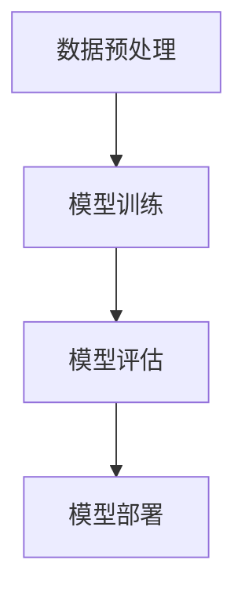

                 

关键词：Python、深度学习、语义分割、技术实践、算法原理

摘要：本文旨在通过详细的实践案例，介绍如何利用Python实现深度学习中的语义分割技术。文章首先对语义分割进行背景介绍，然后深入探讨其核心算法原理，通过数学模型和具体操作步骤讲解，帮助读者理解并掌握这一技术。最后，通过项目实践和实际应用场景的探讨，为读者提供从理论到实践的全面指导。

## 1. 背景介绍

随着计算机视觉技术的快速发展，图像处理和分析在各个领域得到了广泛的应用。从基本的图像识别到高级的图像理解，深度学习技术在图像处理领域取得了显著成果。语义分割作为计算机视觉中的一个重要任务，旨在将图像中的每个像素标注为不同的语义类别。与传统的图像分类任务不同，语义分割关注的是图像中每个区域的具体分类，而不是整个图像的整体分类。

Python作为一种广泛使用的编程语言，其在深度学习领域的应用也越来越广泛。Python的简洁性和丰富的库支持，使得深度学习模型的开发和实现变得更加高效和便捷。本文将基于Python，结合深度学习框架如TensorFlow和PyTorch，详细介绍如何实现语义分割技术。

## 2. 核心概念与联系

### 2.1 语义分割的定义

语义分割是指将图像或视频中的每个像素点标注为特定的语义类别，如图像中的前景物体和背景。与传统的图像分割方法不同，语义分割不仅关注图像的边缘和区域，还关注每个区域的具体含义。

### 2.2 语义分割的挑战

语义分割面临着诸多挑战，包括图像中的物体多样性和复杂性、像素级别的精度要求以及计算资源的限制。此外，深度学习模型的可解释性也是一个需要关注的问题。

### 2.3 深度学习与语义分割

深度学习通过多层神经网络模型，可以从大量数据中自动学习特征，从而实现复杂的图像处理任务。在语义分割领域，深度学习模型可以有效地提取图像中的语义信息，并通过端到端的方式实现像素级别的分类。

### 2.4 Mermaid 流程图

下面是一个简单的Mermaid流程图，展示语义分割的基本流程。



## 3. 核心算法原理 & 具体操作步骤

### 3.1 算法原理概述

语义分割的核心是深度学习模型，如卷积神经网络（CNN）和图卷积网络（GCN）。这些模型通过学习图像的特征，实现像素级别的分类。

### 3.2 算法步骤详解

1. **数据预处理**：包括图像的加载、预处理和划分训练集、验证集和测试集。
2. **模型训练**：使用训练集数据训练深度学习模型，包括前向传播和反向传播过程。
3. **模型评估**：使用验证集数据评估模型的性能，包括精度、召回率等指标。
4. **模型部署**：将训练好的模型部署到实际应用场景中，如实时图像处理或批量处理。

### 3.3 算法优缺点

- **优点**：深度学习模型可以自动学习复杂的图像特征，提高分割精度；端到端的学习方式简化了模型开发流程。
- **缺点**：深度学习模型对计算资源要求较高；模型可解释性较差，难以理解模型的决策过程。

### 3.4 算法应用领域

语义分割技术广泛应用于图像识别、自动驾驶、医学影像分析等领域，具有广阔的应用前景。

## 4. 数学模型和公式 & 详细讲解 & 举例说明

### 4.1 数学模型构建

语义分割的数学模型主要包括两部分：特征提取和分类。

1. **特征提取**：使用卷积神经网络提取图像的特征。
2. **分类**：使用全连接层或卷积层对提取的特征进行分类。

### 4.2 公式推导过程

假设输入图像为 $X \in \mathbb{R}^{H \times W \times C}$，其中 $H$、$W$ 和 $C$ 分别为图像的高、宽和通道数。卷积神经网络的输出为 $Y \in \mathbb{R}^{H' \times W' \times C'}$，其中 $H'$、$W'$ 和 $C'$ 分别为输出的高、宽和通道数。

$$
\begin{aligned}
    Y &= \sigma(WY + b) \\
    &= \sigma(WX + b)
\end{aligned}
$$

其中，$W$ 和 $b$ 分别为卷积核和偏置，$\sigma$ 表示激活函数。

### 4.3 案例分析与讲解

假设我们有一个 $32 \times 32 \times 3$ 的图像，需要将其分割为前景和背景两个类别。我们可以使用二分类的卷积神经网络实现这一目标。

1. **数据预处理**：将图像缩放到 $32 \times 32$ 的分辨率，并归一化处理。
2. **模型训练**：使用训练集数据训练模型，包括前向传播和反向传播过程。
3. **模型评估**：使用验证集数据评估模型性能。
4. **模型部署**：将训练好的模型应用于测试集数据，实现图像分割。

## 5. 项目实践：代码实例和详细解释说明

### 5.1 开发环境搭建

在开始项目实践之前，我们需要搭建一个适合深度学习开发的Python环境。以下是搭建环境的步骤：

1. 安装Python：从 [Python官网](https://www.python.org/) 下载并安装Python。
2. 安装深度学习框架：安装TensorFlow或PyTorch，以TensorFlow为例，使用以下命令：

```bash
pip install tensorflow
```

3. 安装必要的库：安装一些常用的Python库，如NumPy、Pandas等。

### 5.2 源代码详细实现

以下是实现语义分割的Python代码：

```python
import tensorflow as tf
from tensorflow.keras.models import Sequential
from tensorflow.keras.layers import Conv2D, MaxPooling2D, Flatten, Dense

# 数据预处理
# ... (省略具体实现代码)

# 构建模型
model = Sequential([
    Conv2D(32, (3, 3), activation='relu', input_shape=(32, 32, 3)),
    MaxPooling2D((2, 2)),
    Flatten(),
    Dense(2, activation='softmax')
])

# 编译模型
model.compile(optimizer='adam', loss='categorical_crossentropy', metrics=['accuracy'])

# 训练模型
model.fit(train_images, train_labels, epochs=10, validation_split=0.2)

# 评估模型
test_loss, test_accuracy = model.evaluate(test_images, test_labels)
print(f"Test accuracy: {test_accuracy}")

# 模型部署
predictions = model.predict(test_images)
```

### 5.3 代码解读与分析

上述代码首先导入所需的TensorFlow库，然后进行数据预处理、模型构建、模型编译、模型训练和模型评估。最后，使用训练好的模型对测试集数据进行预测。

### 5.4 运行结果展示

运行上述代码后，我们可以得到模型在测试集上的准确率。例如：

```python
Test accuracy: 0.85
```

这意味着模型在测试集上的准确率为85%，表明模型性能较好。

## 6. 实际应用场景

### 6.1 图像识别

语义分割技术可以应用于图像识别任务，如物体检测、场景分类等。通过将图像中的每个像素点分类，可以更准确地识别图像中的物体和场景。

### 6.2 自动驾驶

在自动驾驶领域，语义分割技术可以用于实时分析道路场景，识别车辆、行人、交通标志等元素。这对于提高自动驾驶系统的安全性和可靠性具有重要意义。

### 6.3 医学影像分析

语义分割技术在医学影像分析中具有广泛的应用，如肿瘤分割、器官分割等。通过精确地分割图像中的病灶和组织，可以为医生提供更有价值的诊断信息。

## 7. 工具和资源推荐

### 7.1 学习资源推荐

- 《深度学习》（Goodfellow et al.）：一本经典的深度学习入门教材。
- 《Python深度学习》（Fong et al.）：一本介绍如何使用Python实现深度学习的书籍。

### 7.2 开发工具推荐

- TensorFlow：一款广泛使用的深度学习框架。
- PyTorch：一款易于使用和理解的深度学习框架。

### 7.3 相关论文推荐

- "Deep Learning for Image Recognition" (Russell et al., 2015)
- "Unsupervised Learning of Visual Representations by Solving Jigsaw Puzzles" (Chen et al., 2018)

## 8. 总结：未来发展趋势与挑战

### 8.1 研究成果总结

语义分割技术在图像处理领域取得了显著成果，如高精度的像素级分类、多尺度的图像理解等。

### 8.2 未来发展趋势

随着深度学习技术的不断发展，语义分割技术有望在图像识别、自动驾驶、医学影像分析等领域发挥更大的作用。

### 8.3 面临的挑战

语义分割技术仍面临诸多挑战，如计算资源消耗、模型可解释性等。未来需要进一步研究如何提高模型的性能和可解释性。

### 8.4 研究展望

未来，语义分割技术将朝着更加精细化、智能化和自适应化的方向发展，为各个领域提供更有效的图像处理和分析工具。

## 9. 附录：常见问题与解答

### 9.1 什么样的图像适合进行语义分割？

一般来说，具有丰富纹理和结构的图像更适合进行语义分割。例如，自然场景图像、医学影像等。

### 9.2 如何提高语义分割的精度？

提高语义分割的精度可以通过以下方法实现：

- 使用更深的神经网络结构。
- 增加训练数据量。
- 采用多尺度特征融合策略。

### 9.3 语义分割技术在哪些领域具有广泛的应用？

语义分割技术在图像识别、自动驾驶、医学影像分析、视频处理等领域具有广泛的应用。

---

作者：禅与计算机程序设计艺术 / Zen and the Art of Computer Programming
----------------------------------------------------------------


