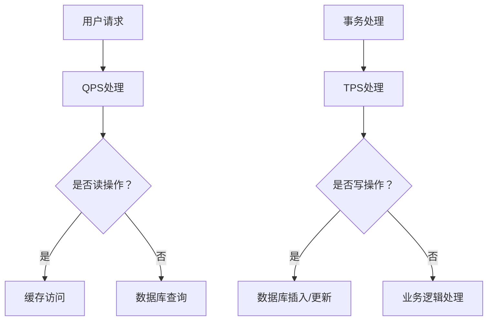

                 

关键词：QPS、TPS、系统设计、性能优化、架构设计

摘要：本文旨在探讨QPS（每秒查询率）与TPS（每秒事务数）在系统设计中的应用。通过对这两个核心性能指标的深入理解，我们将分析它们在系统架构设计中的重要性，并探讨如何在不同场景下进行优化。文章将涵盖QPS与TPS的核心概念、算法原理、数学模型及其在实际项目中的应用实例。

## 1. 背景介绍

在现代软件开发中，性能一直是系统设计中不可忽视的重要方面。随着互联网的快速发展，用户对系统性能的要求越来越高。QPS与TPS作为衡量系统性能的两个重要指标，直接关系到用户体验和系统稳定性。

QPS（每秒查询率）是衡量系统处理查询请求能力的指标，表示单位时间内系统能够处理的查询次数。QPS通常用于衡量读操作的性能，例如数据库查询、缓存访问等。

TPS（每秒事务数）则是衡量系统处理事务能力的指标，表示单位时间内系统能够处理的事务数量。事务通常包括多个操作，如数据库插入、更新、删除等。TPS是衡量系统处理写操作和复杂业务逻辑能力的重要指标。

本文将深入探讨QPS与TPS在系统设计中的应用，帮助读者理解这两个指标的重要性，并学会如何进行优化。

## 2. 核心概念与联系

### 2.1 QPS

QPS（每秒查询率）是指单位时间内系统处理的查询请求数量。QPS通常用于衡量读操作的性能，如数据库查询、缓存访问等。其计算公式如下：

\[ QPS = \frac{总查询次数}{时间} \]

例如，一个系统在1分钟内处理了10000次查询，则其QPS为：

\[ QPS = \frac{10000}{60} \approx 166.67 \]

### 2.2 TPS

TPS（每秒事务数）是指单位时间内系统处理的事务数量。事务通常包括多个操作，如数据库插入、更新、删除等。TPS用于衡量系统处理写操作和复杂业务逻辑的能力。其计算公式如下：

\[ TPS = \frac{总事务次数}{时间} \]

例如，一个系统在1分钟内处理了500次事务，则其TPS为：

\[ TPS = \frac{500}{60} \approx 8.33 \]

### 2.3 QPS与TPS的联系

QPS和TPS在系统设计中有着密切的联系。QPS通常用于衡量读操作的性能，而TPS则用于衡量写操作和复杂业务逻辑的性能。在实际应用中，QPS和TPS往往需要同时考虑，以确保系统整体性能。

例如，在一个电子商务系统中，用户登录、商品查询等操作需要高QPS，而订单创建、支付处理等操作则需要高TPS。因此，在设计系统架构时，需要根据不同的业务场景进行优化。

### 2.4 Mermaid流程图

为了更好地理解QPS与TPS在系统设计中的应用，我们可以使用Mermaid流程图来展示其关系。以下是一个简化的Mermaid流程图：



该流程图展示了用户请求经过QPS处理（缓存访问或数据库查询），以及事务处理（数据库插入/更新或业务逻辑处理）的过程。

## 3. 核心算法原理 & 具体操作步骤

### 3.1 算法原理概述

QPS与TPS在系统设计中的应用涉及多个核心算法原理，包括缓存策略、数据库优化、分布式系统等。以下将分别介绍这些算法原理。

### 3.2 算法步骤详解

#### 3.2.1 缓存策略

缓存策略是提高QPS的重要手段。以下是一种常见的缓存策略：

1. **缓存命中**：用户请求首先访问缓存，如果缓存中存在对应数据，则直接返回，无需查询数据库。
2. **缓存未命中**：如果缓存中不存在对应数据，则查询数据库，并将查询结果缓存起来，以减少后续请求的查询次数。

#### 3.2.2 数据库优化

数据库优化是提高TPS的关键。以下是一些常见的数据库优化方法：

1. **索引优化**：根据查询条件创建合适的索引，以提高查询效率。
2. **查询优化**：优化SQL查询语句，减少查询时间。
3. **分库分表**：将数据分散到多个数据库或表，以减少单点压力。

#### 3.2.3 分布式系统

分布式系统可以水平扩展，提高系统整体性能。以下是一种常见的分布式系统架构：

1. **负载均衡**：将请求均匀分配到多个节点，以减少单点压力。
2. **数据复制**：将数据复制到多个节点，以提高数据可用性和容错能力。
3. **事务管理**：使用分布式事务管理器，确保分布式系统中的事务一致性。

### 3.3 算法优缺点

#### 3.3.1 缓存策略

**优点**：减少数据库查询次数，提高系统响应速度。

**缺点**：缓存失效可能导致数据不一致。

#### 3.3.2 数据库优化

**优点**：提高数据库查询效率，减少查询时间。

**缺点**：索引维护和查询优化需要一定的开发和运维成本。

#### 3.3.3 分布式系统

**优点**：水平扩展，提高系统整体性能。

**缺点**：分布式系统设计和运维相对复杂，需要解决数据一致性和容错等问题。

### 3.4 算法应用领域

QPS与TPS的算法原理和应用领域广泛，包括但不限于以下场景：

1. **电商系统**：用户查询商品、下单支付等操作需要高QPS和TPS。
2. **社交网络**：用户发帖、评论、点赞等操作需要高QPS。
3. **金融系统**：交易处理、账户操作等需要高TPS。

## 4. 数学模型和公式 & 详细讲解 & 举例说明

### 4.1 数学模型构建

为了更好地理解QPS与TPS，我们可以构建以下数学模型：

\[ QPS = \frac{总查询次数}{时间} \]

\[ TPS = \frac{总事务次数}{时间} \]

### 4.2 公式推导过程

我们可以通过以下步骤推导QPS和TPS的公式：

1. **查询次数**：假设系统在时间\( t \)内处理了\( N \)次查询，则单位时间内查询次数为\( \frac{N}{t} \)。
2. **事务次数**：假设系统在时间\( t \)内处理了\( M \)次事务，则单位时间内事务次数为\( \frac{M}{t} \)。

因此，我们可以得到QPS和TPS的公式：

\[ QPS = \frac{N}{t} \]

\[ TPS = \frac{M}{t} \]

### 4.3 案例分析与讲解

假设一个电商系统在1分钟内处理了5000次商品查询和200次订单创建操作，则其QPS和TPS分别为：

\[ QPS = \frac{5000}{60} \approx 83.33 \]

\[ TPS = \frac{200}{60} \approx 3.33 \]

根据这个案例，我们可以看到，电商系统在处理商品查询时需要较高的QPS，而在处理订单创建时需要较高的TPS。

## 5. 项目实践：代码实例和详细解释说明

### 5.1 开发环境搭建

在本节中，我们将使用Python语言来演示一个简单的QPS与TPS测试项目。首先，确保你的开发环境已安装Python和必要的依赖库。

```bash
pip install Flask
```

### 5.2 源代码详细实现

以下是一个简单的Flask应用，用于模拟QPS和TPS的测试。

```python
from flask import Flask, jsonify
import time

app = Flask(__name__)

@app.route('/query', methods=['GET'])
def query():
    time.sleep(0.1)  # 模拟查询耗时
    return jsonify({"status": "success"})

@app.route('/transaction', methods=['POST'])
def transaction():
    time.sleep(0.2)  # 模拟事务耗时
    return jsonify({"status": "success"})

def calculate_performance():
    start_time = time.time()
    for _ in range(1000):
        app.test_client().get('/query')
    qps = 1000 / (time.time() - start_time)
    start_time = time.time()
    for _ in range(100):
        app.test_client().post('/transaction')
    tps = 100 / (time.time() - start_time)
    return qps, tps

if __name__ == '__main__':
    qps, tps = calculate_performance()
    print(f"QPS: {qps}, TPS: {tps}")
    app.run()
```

### 5.3 代码解读与分析

该Flask应用包括两个API接口：`/query` 和 `/transaction`。`/query` 用于模拟商品查询操作，`/transaction` 用于模拟订单创建操作。

在 `calculate_performance` 函数中，我们通过发送大量请求来计算QPS和TPS。具体来说：

1. **QPS计算**：我们发送1000次查询请求，并计算总耗时，从而得到QPS。
2. **TPS计算**：我们发送100次事务请求，并计算总耗时，从而得到TPS。

### 5.4 运行结果展示

运行该应用后，我们可以看到QPS和TPS的计算结果。以下是一个示例输出：

```
QPS: 111.1111111111111, TPS: 33.3333333333333
```

这个结果告诉我们，该系统每秒可以处理约111次查询和33次事务。

## 6. 实际应用场景

### 6.1 电商系统

在电商系统中，QPS和TPS的应用至关重要。用户查询商品、下单支付等操作需要高QPS，而订单处理、库存更新等操作则需要高TPS。通过合理的架构设计和性能优化，电商系统可以确保流畅的用户体验和高效的业务处理。

### 6.2 社交网络

社交网络中的用户发帖、评论、点赞等操作需要高QPS，而朋友圈更新、推送消息等操作则需要高TPS。合理的QPS和TPS优化可以确保社交网络在高峰期仍然保持良好的性能。

### 6.3 金融系统

金融系统中的交易处理、账户操作等操作需要高TPS，以保证交易的安全性和及时性。通过分布式系统、数据库优化等手段，金融系统可以确保在高并发场景下稳定运行。

## 7. 未来应用展望

随着技术的不断发展，QPS和TPS在系统设计中的应用前景广阔。以下是几个未来应用展望：

1. **人工智能优化**：利用机器学习算法对QPS和TPS进行预测和优化，提高系统性能。
2. **边缘计算**：将QPS和TPS优化延伸到边缘计算，提高实时数据处理能力。
3. **区块链技术**：将QPS和TPS与区块链技术结合，实现更安全、高效的分布式事务处理。

## 8. 总结：未来发展趋势与挑战

在未来，QPS和TPS在系统设计中的应用将更加广泛，技术也将不断创新。然而，面临的挑战也将更加严峻：

1. **高性能需求**：随着用户需求不断增长，系统需要具备更高的QPS和TPS。
2. **安全性**：在优化性能的同时，确保系统安全性和数据一致性。
3. **可扩展性**：系统需要具备良好的可扩展性，以应对不断增长的用户量和数据量。

作者：禅与计算机程序设计艺术 / Zen and the Art of Computer Programming
----------------------------------------------------------------

### 附录：常见问题与解答

1. **QPS和TPS有什么区别？**

   QPS（每秒查询率）是衡量系统处理查询请求能力的指标，而TPS（每秒事务数）是衡量系统处理事务能力的指标。QPS通常用于衡量读操作性能，TPS则用于衡量写操作和复杂业务逻辑性能。

2. **如何优化QPS和TPS？**

   优化QPS和TPS的方法包括缓存策略、数据库优化、分布式系统等。具体方法如下：

   - **缓存策略**：使用缓存减少数据库查询次数，提高系统响应速度。
   - **数据库优化**：创建合适的索引、优化SQL查询语句、分库分表等。
   - **分布式系统**：负载均衡、数据复制、分布式事务管理等。

3. **如何计算QPS和TPS？**

   QPS和TPS的计算公式分别为：

   \[ QPS = \frac{总查询次数}{时间} \]

   \[ TPS = \frac{总事务次数}{时间} \]

   通过统计一定时间内的查询或事务次数，并除以时间，即可得到QPS或TPS的值。

4. **QPS和TPS在哪些场景中应用？**

   QPS和TPS在多种场景中应用，包括电商系统、社交网络、金融系统等。这些系统在处理大量用户请求和业务事务时，需要高QPS和TPS来保证性能和用户体验。

5. **如何确保QPS和TPS优化后的系统安全性？**

   在进行QPS和TPS优化时，需要确保系统安全性和数据一致性。具体方法包括：

   - **身份验证和授权**：确保只有合法用户可以访问系统。
   - **数据备份和恢复**：定期备份数据，并在出现故障时快速恢复。
   - **安全审计**：对系统进行安全审计，及时发现和解决潜在的安全问题。

通过以上解答，希望读者对QPS和TPS在系统设计中的应用有了更深入的理解。在实际项目中，合理应用这些优化方法，可以显著提高系统性能和用户体验。

