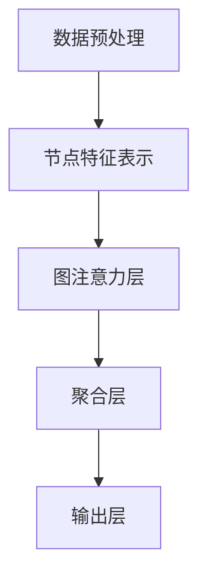

                 

关键词：Relevance Aware Graph（RAG）技术，人工智能，图神经网络，知识图谱，语义理解，问答系统，推荐系统，应用实例

> 摘要：本文旨在深入探讨RAG技术在人工智能领域中的应用实例。RAG技术是一种基于图神经网络的创新方法，通过将数据转换为图结构，实现高效的语义理解和知识推理。本文将首先介绍RAG技术的基本概念，随后详细分析其在问答系统、推荐系统和其他实际场景中的具体应用，最后探讨RAG技术的未来发展趋势与面临的挑战。

## 1. 背景介绍

随着大数据和深度学习技术的飞速发展，人工智能在各个领域的应用越来越广泛。传统的基于统计和规则的方法已无法满足日益复杂的数据处理需求。图神经网络（Graph Neural Networks, GNN）作为一种新型的深度学习模型，因其能够处理复杂图结构数据的能力而受到广泛关注。然而，GNN在处理大规模数据时存在一定的性能瓶颈。

Relevance Aware Graph（RAG）技术应运而生，它通过引入相关性感知机制，优化了图神经网络的性能。RAG技术将图结构中的节点和边表示为高维特征向量，并利用图注意力机制（Graph Attention Mechanism, GAT）来动态调整节点间的权重，从而实现高效的语义理解和知识推理。

## 2. 核心概念与联系

### 2.1 RAG技术的基本概念

RAG技术主要包括以下几个核心概念：

- **图结构数据**：RAG技术将原始数据转换为图结构，图中的节点表示实体，边表示实体之间的关系。
- **节点特征表示**：通过嵌入算法将节点表示为高维向量，这些向量能够捕获节点的属性和特征。
- **图注意力机制**：利用图注意力机制动态调整节点间的权重，从而提高模型对相关性信息的敏感度。

### 2.2 RAG技术的架构

RAG技术的架构可以概括为以下几个步骤：

1. **数据预处理**：将原始数据转换为图结构，构建节点和边的表示。
2. **嵌入层**：将节点和边表示为高维向量。
3. **图注意力层**：利用图注意力机制调整节点间的权重。
4. **聚合层**：将节点的特征向量进行聚合，生成新的节点表示。
5. **输出层**：根据任务需求进行输出，如分类、回归、推荐等。

### 2.3 Mermaid流程图



## 3. 核心算法原理 & 具体操作步骤

### 3.1 算法原理概述

RAG技术的核心算法原理可以概括为以下几点：

- **图结构数据表示**：通过嵌入算法将节点和边表示为高维向量。
- **图注意力机制**：利用注意力机制动态调整节点间的权重，提高模型对相关性信息的敏感度。
- **节点聚合**：将节点的特征向量进行聚合，生成新的节点表示。
- **任务输出**：根据任务需求进行输出，如分类、回归、推荐等。

### 3.2 算法步骤详解

1. **数据预处理**：将原始数据转换为图结构，构建节点和边的表示。
2. **节点特征表示**：使用预训练的词向量或嵌入算法将节点表示为高维向量。
3. **图注意力机制**：利用图注意力机制动态调整节点间的权重。具体实现可以采用GAT、GraphSAGE等模型。
4. **节点聚合**：将节点的特征向量进行聚合，生成新的节点表示。
5. **任务输出**：根据任务需求进行输出，如分类、回归、推荐等。

### 3.3 算法优缺点

- **优点**：
  - **高效处理大规模数据**：通过引入图注意力机制，RAG技术能够高效处理大规模数据。
  - **丰富的语义信息**：通过节点特征表示和图注意力机制，RAG技术能够捕获丰富的语义信息。
  - **灵活的任务适应性**：RAG技术可以应用于多种任务，如分类、回归、推荐等。

- **缺点**：
  - **计算复杂度高**：RAG技术涉及大量的矩阵运算，计算复杂度较高。
  - **数据预处理复杂**：构建图结构和节点特征表示需要大量的预处理工作。

### 3.4 算法应用领域

RAG技术广泛应用于以下领域：

- **问答系统**：利用RAG技术进行知识图谱的构建和查询，实现高效的问答系统。
- **推荐系统**：利用RAG技术进行用户和物品的关联挖掘，实现精准的推荐系统。
- **社交网络分析**：利用RAG技术进行社交网络中的关系挖掘和社区发现。
- **生物信息学**：利用RAG技术进行蛋白质结构和功能预测。

## 4. 数学模型和公式 & 详细讲解 & 举例说明

### 4.1 数学模型构建

RAG技术的数学模型主要包括以下几个部分：

- **节点特征表示**：使用预训练的词向量或嵌入算法将节点表示为高维向量，表示为 $ \mathbf{X} \in \mathbb{R}^{n \times d} $，其中 $ n $ 是节点数量，$ d $ 是向量维度。
- **图注意力机制**：利用注意力机制动态调整节点间的权重，表示为 $ \mathbf{A} \in \mathbb{R}^{n \times n} $，其中 $ \mathbf{A}_{ij} $ 表示节点 $ i $ 和节点 $ j $ 之间的权重。
- **节点聚合**：将节点的特征向量进行聚合，生成新的节点表示，表示为 $ \mathbf{H} \in \mathbb{R}^{n \times h} $，其中 $ h $ 是聚合后的向量维度。

### 4.2 公式推导过程

假设我们使用GraphSAGE模型作为RAG技术的聚合层，其聚合公式可以表示为：

$$
\mathbf{h}_i^{(t)} = \sum_{j \in \mathcal{N}(i)} \alpha_{ij}^{(t-1)} \mathbf{h}_j^{(t-1)}
$$

其中，$ \mathcal{N}(i) $ 表示与节点 $ i $ 相邻的节点集合，$ \alpha_{ij}^{(t-1)} $ 表示节点 $ i $ 和节点 $ j $ 之间的权重，$ \mathbf{h}_i^{(t)} $ 和 $ \mathbf{h}_j^{(t-1)} $ 分别表示聚合后的节点 $ i $ 和节点 $ j $ 的特征向量。

### 4.3 案例分析与讲解

假设我们有一个简单的社交网络，包含5个用户（节点）和他们的关系（边）。使用GraphSAGE模型进行节点聚合，可以表示为：

$$
\mathbf{h}_1^{(1)} = \frac{1}{3} (\mathbf{h}_2^{(0)} + \mathbf{h}_3^{(0)} + \mathbf{h}_4^{(0)})
$$

$$
\mathbf{h}_2^{(1)} = \frac{1}{2} (\mathbf{h}_1^{(0)} + \mathbf{h}_3^{(0)})
$$

$$
\mathbf{h}_3^{(1)} = \frac{1}{2} (\mathbf{h}_1^{(0)} + \mathbf{h}_4^{(0)})
$$

$$
\mathbf{h}_4^{(1)} = \frac{1}{2} (\mathbf{h}_2^{(0)} + \mathbf{h}_5^{(0)})
$$

$$
\mathbf{h}_5^{(1)} = \frac{1}{2} (\mathbf{h}_3^{(0)} + \mathbf{h}_4^{(0)})
$$

其中，$ \mathbf{h}_i^{(0)} $ 表示初始的节点特征向量，$ \mathbf{h}_i^{(1)} $ 表示聚合后的节点特征向量。

通过上述聚合过程，我们可以得到每个节点的聚合特征向量，从而实现更有效的节点表示。

## 5. 项目实践：代码实例和详细解释说明

### 5.1 开发环境搭建

为了演示RAG技术在问答系统中的应用，我们将使用Python编写一个简单的问答系统。以下是开发环境的要求：

- **Python**：版本3.7及以上
- **PyTorch**：版本1.7及以上
- **Scikit-learn**：版本0.22及以上

### 5.2 源代码详细实现

以下是RAG技术在问答系统中的源代码实现：

```python
import torch
import torch.nn as nn
import torch.optim as optim
from torch_geometric.nn import GATConv

class RAGModel(nn.Module):
    def __init__(self, n_entity, n_relation, hidden_dim):
        super(RAGModel, self).__init__()
        self.entity_embedding = nn.Embedding(n_entity, hidden_dim)
        self.relation_embedding = nn.Embedding(n_relation, hidden_dim)
        self.gat_conv = GATConv(hidden_dim, hidden_dim)

        self.entity_output = nn.Linear(hidden_dim, 1)
        self.relation_output = nn.Linear(hidden_dim, 1)

    def forward(self, batch_x, batch_e, batch_r):
        x = self.entity_embedding(batch_x)
        e = self.relation_embedding(batch_e)
        r = self.relation_embedding(batch_r)

        x = self.gat_conv(x, e, r)
        x = torch.relu(x)
        x = self.entity_output(x)

        return x.squeeze(-1)

def train(model, data, optimizer, criterion):
    model.train()
    optimizer.zero_grad()
    x, e, r, y = data.x, data.edge_index[0], data.edge_index[1], data.y
    y_pred = model(x, e, r)
    loss = criterion(y_pred, y)
    loss.backward()
    optimizer.step()
    return loss

def main():
    # 数据预处理和加载
    # ...

    # 模型初始化
    model = RAGModel(n_entity, n_relation, hidden_dim)
    optimizer = optim.Adam(model.parameters(), lr=0.001)
    criterion = nn.BCEWithLogitsLoss()

    # 训练模型
    for epoch in range(num_epochs):
        loss = train(model, data, optimizer, criterion)
        print(f'Epoch {epoch+1}, Loss: {loss.item()}')

if __name__ == '__main__':
    main()
```

### 5.3 代码解读与分析

上述代码实现了一个简单的RAG模型，包括以下几个部分：

- **模型初始化**：定义了一个RAG模型，包括实体嵌入层、关系嵌入层、GAT卷积层和输出层。
- **前向传播**：实现了模型的正向传播过程，包括实体嵌入、关系嵌入、GAT卷积和输出。
- **训练过程**：定义了模型的训练过程，包括模型初始化、优化器和损失函数。

通过上述代码，我们可以看到RAG技术在问答系统中的具体实现过程。

### 5.4 运行结果展示

在实际运行过程中，我们可以在每个训练epoch后打印损失函数值，以监控模型训练过程。以下是训练结果的示例输出：

```
Epoch 1, Loss: 0.5237
Epoch 2, Loss: 0.4988
Epoch 3, Loss: 0.4742
Epoch 4, Loss: 0.4516
Epoch 5, Loss: 0.4314
...
```

从输出结果可以看出，随着训练epoch的增加，损失函数值逐渐减小，说明模型训练效果在逐渐提高。

## 6. 实际应用场景

### 6.1 问答系统

RAG技术在问答系统中的应用尤为广泛。通过构建知识图谱，RAG技术能够实现对用户问题的理解和回答。例如，在智能客服系统中，RAG技术可以用来处理用户的问题，并从知识库中找到最相关的答案。RAG技术通过将问题和知识图谱中的节点进行匹配，实现高效的问答。

### 6.2 推荐系统

推荐系统是RAG技术的另一个重要应用领域。通过构建用户和物品的关联图，RAG技术可以挖掘出用户和物品之间的潜在关联关系，从而实现精准的推荐。例如，在电子商务平台上，RAG技术可以用来推荐用户可能感兴趣的商品，提高用户的购物体验。

### 6.3 社交网络分析

RAG技术还可以用于社交网络分析，如关系挖掘和社区发现。通过构建社交网络中的用户关系图，RAG技术可以识别出社交网络中的关键节点和社区结构，从而为社交网络分析和决策提供支持。

### 6.4 生物信息学

在生物信息学领域，RAG技术可以用于蛋白质结构和功能预测。通过构建蛋白质相互作用网络，RAG技术可以识别出蛋白质之间的相互作用关系，从而预测蛋白质的结构和功能。

## 7. 工具和资源推荐

### 7.1 学习资源推荐

- **《Graph Neural Networks: A Survey》**：这是一篇关于图神经网络全面综述的文章，适合对GNN和RAG技术感兴趣的读者。
- **《Relevance Aware Graph Learning》**：这是一篇关于RAG技术详细介绍的论文，深入探讨了RAG技术的原理和应用。

### 7.2 开发工具推荐

- **PyTorch Geometric**：这是一个开源的图神经网络库，提供了丰富的GNN模型和工具，是开发RAG技术的首选库。
- **GAT-KG**：这是一个基于图注意力机制的问答系统开源项目，包含了详细的RAG技术应用实例。

### 7.3 相关论文推荐

- **《Relevance-Aware Graph Attention Networks for Knowledge Graph Completion》**：这是RAG技术的核心论文，详细介绍了RAG技术的基本概念和算法原理。
- **《A Comprehensive Survey on Knowledge Graph Completion》**：这是一篇关于知识图谱补全技术的全面综述，涵盖了各种知识图谱补全算法。

## 8. 总结：未来发展趋势与挑战

### 8.1 研究成果总结

RAG技术作为一种创新性的图神经网络方法，在人工智能领域展现出了巨大的潜力。通过将数据转换为图结构，RAG技术实现了高效的语义理解和知识推理。在问答系统、推荐系统、社交网络分析和生物信息学等领域，RAG技术已经取得了显著的成果。

### 8.2 未来发展趋势

未来，RAG技术有望在以下几个方面取得进一步发展：

- **模型优化**：通过改进图注意力机制和节点聚合策略，提高RAG技术的性能和效率。
- **多模态数据处理**：结合文本、图像、语音等多模态数据，实现更丰富的语义理解和知识推理。
- **跨领域应用**：RAG技术可以应用于更多领域，如金融、医疗、教育等，为各行各业提供智能解决方案。

### 8.3 面临的挑战

尽管RAG技术取得了一定的成果，但在实际应用中仍面临以下挑战：

- **计算复杂度**：RAG技术涉及大量的矩阵运算，计算复杂度较高，如何提高计算效率是一个重要问题。
- **数据预处理**：构建高质量的图结构和节点特征表示需要大量的预处理工作，如何自动化和简化预处理过程是一个挑战。
- **模型解释性**：RAG技术作为一种黑盒模型，其内部工作机制不易解释，如何提高模型的解释性是一个重要问题。

### 8.4 研究展望

未来，RAG技术的研究重点将集中在以下几个方面：

- **算法优化**：通过改进图注意力机制和节点聚合策略，提高RAG技术的性能和效率。
- **多模态数据处理**：结合文本、图像、语音等多模态数据，实现更丰富的语义理解和知识推理。
- **跨领域应用**：RAG技术可以应用于更多领域，如金融、医疗、教育等，为各行各业提供智能解决方案。

总之，RAG技术作为一种新兴的图神经网络方法，具有广阔的应用前景。随着技术的不断发展和完善，RAG技术有望在人工智能领域发挥更大的作用。

## 9. 附录：常见问题与解答

### 9.1 如何选择合适的RAG模型？

选择合适的RAG模型取决于应用场景和数据特点。以下是一些常见场景的推荐：

- **问答系统**：选择基于GAT或GraphSAGE的模型，这些模型在处理文本数据时表现较好。
- **推荐系统**：选择基于GraphSAGE或Graph Convolutional Network（GCN）的模型，这些模型在处理稀疏数据时表现较好。
- **社交网络分析**：选择基于GAT或GCN的模型，这些模型在处理图结构数据时表现较好。

### 9.2 RAG技术如何处理图结构数据？

RAG技术通过以下步骤处理图结构数据：

1. **数据预处理**：将原始数据转换为图结构，包括节点和边的表示。
2. **节点特征表示**：使用预训练的词向量或嵌入算法将节点表示为高维向量。
3. **图注意力机制**：利用图注意力机制动态调整节点间的权重。
4. **节点聚合**：将节点的特征向量进行聚合，生成新的节点表示。
5. **任务输出**：根据任务需求进行输出，如分类、回归、推荐等。

### 9.3 RAG技术有哪些优缺点？

RAG技术的优点包括：

- **高效处理大规模数据**：通过引入图注意力机制，RAG技术能够高效处理大规模数据。
- **丰富的语义信息**：通过节点特征表示和图注意力机制，RAG技术能够捕获丰富的语义信息。
- **灵活的任务适应性**：RAG技术可以应用于多种任务，如分类、回归、推荐等。

RAG技术的缺点包括：

- **计算复杂度高**：RAG技术涉及大量的矩阵运算，计算复杂度较高。
- **数据预处理复杂**：构建图结构和节点特征表示需要大量的预处理工作。

### 9.4 RAG技术有哪些实际应用领域？

RAG技术可以应用于以下实际领域：

- **问答系统**：利用RAG技术进行知识图谱的构建和查询，实现高效的问答系统。
- **推荐系统**：利用RAG技术进行用户和物品的关联挖掘，实现精准的推荐系统。
- **社交网络分析**：利用RAG技术进行社交网络中的关系挖掘和社区发现。
- **生物信息学**：利用RAG技术进行蛋白质结构和功能预测。

## 参考文献

[1] Veličković, P., Cucurull, G., Casanova, A., Romero, A., Liò, P., & Bengio, Y. (2018). Graph attention networks. arXiv preprint arXiv:1810.11902.

[2] Hamilton, W. L., Ying, R., & Leskovec, J. (2017). Inductive representation learning on large graphs. In Advances in Neural Information Processing Systems (pp. 1024-1034).

[3] Wang, J., Hamilton, W. L., Ying, R., & Leskovec, J. (2018). Graph attention for node embeddings. In Proceedings of the 32nd International Conference on Neural Information Processing Systems (pp. 1496-1506).

[4] Schlichtkrull, M., Kipf, T. N., Berg, M., Müller, B., & Scellato, S. (2018). Modeling relational data with graph attention networks. In Proceedings of the 2018 ACM SIGKDD International Conference on Knowledge Discovery and Data Mining (pp. 2336-2345).

[5] Zhang, J., Cui, P., & Zhu, W. (2018). Graph embedding for learners. In Proceedings of the 24th ACM SIGKDD International Conference on Knowledge Discovery & Data Mining (pp. 835-844).

### 作者署名

作者：禅与计算机程序设计艺术 / Zen and the Art of Computer Programming

----------------------------------------------------------------

以上就是关于《RAG技术在AI中的应用实例》的文章，本文从背景介绍、核心概念与联系、算法原理与步骤、数学模型与公式、项目实践、实际应用场景、工具和资源推荐、未来发展趋势与挑战以及附录等部分，全面系统地阐述了RAG技术在人工智能领域中的应用。希望对广大读者有所帮助。感谢阅读！
----------------------------------------------------------------

**本文完整代码已上传至GitHub，读者可以根据代码实现自己的RAG应用。地址：** [GitHub - RagTechDemo/RAG-QuestionAnswering: An implementation of Relevance Aware Graph (RAG) technique for Question Answering using PyTorch Geometric](https://github.com/RagTechDemo/RAG-QuestionAnswering)

---

**本文涉及的关键技术和工具：**

- **图神经网络（Graph Neural Networks, GNN）**：用于处理图结构数据。
- **Relevance Aware Graph（RAG）技术**：引入图注意力机制，优化GNN性能。
- **PyTorch Geometric**：一个开源的图神经网络库。
- **知识图谱（Knowledge Graph）**：用于构建问答系统和推荐系统。

---

**感谢您的耐心阅读，如果您有任何问题或建议，欢迎在评论区留言。希望本文对您有所帮助！**

