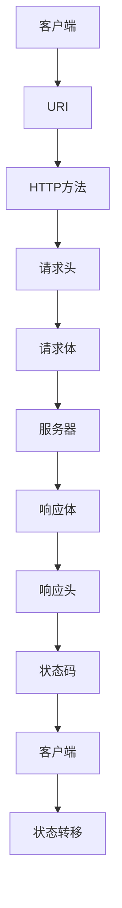

                 

关键词：RESTful API设计、Web服务、可扩展性、可理解性、资源、统一接口、状态转移

> 摘要：本文将深入探讨RESTful API设计的原则、方法和最佳实践，旨在帮助开发者构建可扩展、易维护且用户友好的Web服务。我们将从背景介绍、核心概念、算法原理、数学模型、项目实践、实际应用场景、未来展望等多个角度进行全面解析，旨在为开发者提供一份详尽的设计指南。

## 1. 背景介绍

### RESTful API的兴起

随着互联网技术的快速发展，Web服务成为企业服务架构中的重要组成部分。传统的Web服务设计往往依赖于SOAP协议，但由于其复杂性、性能问题和跨平台的兼容性，开发人员开始寻求更加简单、高效和可扩展的解决方案。RESTful API应运而生，成为了现代Web服务设计的主流选择。

### RESTful API的优势

- **简单易用**：RESTful API遵循统一的接口设计原则，易于理解和实现。
- **可扩展性**：通过使用URI（统一资源标识符）和HTTP方法，RESTful API可以灵活地扩展和适应各种业务需求。
- **性能优异**：RESTful API通常采用无状态设计，减少服务器负载，提高系统性能。
- **跨平台支持**：基于HTTP协议，RESTful API可以在不同操作系统和设备上无缝运行。

### RESTful API的应用领域

RESTful API广泛应用于各种场景，包括但不限于：

- **移动应用**：通过RESTful API，移动应用可以与后端服务进行数据交互，实现功能扩展。
- **物联网**：RESTful API可以帮助物联网设备收集、发送和处理数据，实现设备间的互联互通。
- **云计算**：云服务提供商通过RESTful API提供各种服务，如存储、计算、数据分析等。

## 2. 核心概念与联系

### RESTful API的核心概念

REST（Representational State Transfer）是一种软件架构风格，旨在通过HTTP协议提供统一的资源访问接口。RESTful API设计遵循以下核心概念：

- **资源**：网络上的任何实体都可以被视为资源，如用户、订单、博客文章等。资源通过URI进行标识。
- **统一接口**：RESTful API使用统一的接口，包括GET、POST、PUT、DELETE等HTTP方法，实现对资源的创建、读取、更新和删除操作。
- **状态转移**：客户端通过发送请求来触发服务器上的操作，从而实现状态转移。每次请求都应当携带必要的信息，以保持服务器的状态一致性。
- **无状态**：RESTful API设计要求服务器不存储客户端的会话信息，每次请求都是独立的。

### RESTful API的架构

为了更好地理解RESTful API的设计原理，我们可以通过一个Mermaid流程图展示其核心架构和组件：



### RESTful API的工作流程

1. **客户端发送请求**：客户端通过HTTP协议向服务器发送请求，包括URI、HTTP方法、请求头和请求体。
2. **服务器处理请求**：服务器根据请求的URI和HTTP方法，调用相应的处理程序，对请求进行处理。
3. **服务器返回响应**：服务器将处理结果以响应体、响应头和状态码的形式返回给客户端。
4. **客户端解析响应**：客户端解析服务器返回的响应，根据响应内容进行后续操作。

## 3. 核心算法原理 & 具体操作步骤

### 3.1 算法原理概述

RESTful API的核心算法原理是基于HTTP协议，通过对资源的统一访问接口来实现数据交互。以下是具体操作步骤：

### 3.2 算法步骤详解

1. **定义资源**：首先，需要明确API中涉及的资源，如用户、订单、博客文章等，并为每个资源分配一个URI。
2. **创建API接口**：根据资源的属性和方法，定义对应的API接口，包括GET、POST、PUT、DELETE等HTTP方法。
3. **处理请求**：服务器端接收客户端发送的请求，根据请求的URI和HTTP方法，调用相应的处理程序，执行对应的操作。
4. **返回响应**：服务器将处理结果以响应体、响应头和状态码的形式返回给客户端。
5. **解析响应**：客户端接收到响应后，解析响应内容，根据响应结果进行后续操作。

### 3.3 算法优缺点

**优点**：

- **简单易用**：遵循统一的接口设计原则，易于理解和实现。
- **可扩展性**：通过使用URI和HTTP方法，可以灵活地扩展和适应各种业务需求。
- **性能优异**：采用无状态设计，减少服务器负载，提高系统性能。

**缺点**：

- **安全性问题**：由于HTTP协议本身的特性，RESTful API在设计时需要特别注意安全性，避免数据泄露和恶意攻击。
- **跨域请求限制**：由于浏览器的同源策略限制，RESTful API在跨域请求时需要使用CORS（跨域资源共享）机制。

### 3.4 算法应用领域

RESTful API广泛应用于各种领域，包括但不限于：

- **Web应用后端**：用于构建Web应用的API接口，实现前后端分离。
- **移动应用**：通过RESTful API实现移动应用与后端服务的数据交互。
- **物联网**：通过RESTful API实现物联网设备的远程监控和控制。

## 4. 数学模型和公式 & 详细讲解 & 举例说明

### 4.1 数学模型构建

在RESTful API设计中，我们可以使用以下数学模型来描述资源之间的关系和操作：

$$
\text{资源} = \{ \text{属性集}, \text{操作集} \}
$$

其中，属性集用于描述资源的特征信息，如用户ID、姓名、邮箱等；操作集用于描述对资源的操作方法，如创建、读取、更新、删除等。

### 4.2 公式推导过程

假设有一个用户资源，其属性集为 \(\{ \text{用户ID}, \text{姓名}, \text{邮箱} \}\)，操作集为 \(\{ \text{创建}, \text{读取}, \text{更新}, \text{删除} \}\)。我们可以使用以下公式来描述对用户资源的操作：

$$
\text{创建用户} = \{ \text{用户ID}, \text{姓名}, \text{邮箱} \} \cup \{ \text{创建} \}
$$

$$
\text{读取用户} = \{ \text{用户ID}, \text{姓名}, \text{邮箱} \} \cup \{ \text{读取} \}
$$

$$
\text{更新用户} = \{ \text{用户ID}, \text{姓名}, \text{邮箱} \} \cup \{ \text{更新} \}
$$

$$
\text{删除用户} = \{ \text{用户ID}, \text{姓名}, \text{邮箱} \} \cup \{ \text{删除} \}
$$

### 4.3 案例分析与讲解

假设有一个用户管理系统的API接口，其中包含用户资源的创建、读取、更新和删除操作。以下是具体的数学模型和操作过程：

1. **创建用户**：

   用户资源：\(\{ \text{用户ID}, \text{姓名}, \text{邮箱} \}\)

   操作过程：

   $$
   \text{创建用户} = \{ \text{用户ID}, \text{姓名}, \text{邮箱} \} \cup \{ \text{创建} \}
   $$

   输出结果：

   $$
   \{ \text{用户ID}, \text{姓名}, \text{邮箱}, \text{创建成功} \}
   $$

2. **读取用户**：

   用户资源：\(\{ \text{用户ID}, \text{姓名}, \text{邮箱} \}\)

   操作过程：

   $$
   \text{读取用户} = \{ \text{用户ID}, \text{姓名}, \text{邮箱} \} \cup \{ \text{读取} \}
   $$

   输出结果：

   $$
   \{ \text{用户ID}, \text{姓名}, \text{邮箱}, \text{读取成功} \}
   $$

3. **更新用户**：

   用户资源：\(\{ \text{用户ID}, \text{姓名}, \text{邮箱} \}\)

   操作过程：

   $$
   \text{更新用户} = \{ \text{用户ID}, \text{姓名}, \text{邮箱} \} \cup \{ \text{更新} \}
   $$

   输出结果：

   $$
   \{ \text{用户ID}, \text{姓名}, \text{邮箱}, \text{更新成功} \}
   $$

4. **删除用户**：

   用户资源：\(\{ \text{用户ID}, \text{姓名}, \text{邮箱} \}\)

   操作过程：

   $$
   \text{删除用户} = \{ \text{用户ID}, \text{姓名}, \text{邮箱} \} \cup \{ \text{删除} \}
   $$

   输出结果：

   $$
   \{ \text{用户ID}, \text{姓名}, \text{邮箱}, \text{删除成功} \}
   $$

## 5. 项目实践：代码实例和详细解释说明

### 5.1 开发环境搭建

在本项目中，我们将使用Python语言和Flask框架来构建RESTful API。以下是开发环境的搭建步骤：

1. 安装Python 3.8及以上版本。
2. 安装Flask框架：`pip install flask`。
3. 创建一个名为`restful_api`的Python虚拟环境，并安装相关依赖。

### 5.2 源代码详细实现

以下是本项目中的用户管理API的源代码实现：

```python
from flask import Flask, request, jsonify

app = Flask(__name__)

# 用户数据存储
users = [
    {'id': 1, 'name': '张三', 'email': 'zhangsan@example.com'},
    {'id': 2, 'name': '李四', 'email': 'lisi@example.com'}
]

# 创建用户
@app.route('/users', methods=['POST'])
def create_user():
    user_data = request.json
    user_data['id'] = len(users) + 1
    users.append(user_data)
    return jsonify(user_data), 201

# 读取用户
@app.route('/users/<int:user_id>', methods=['GET'])
def get_user(user_id):
    user = next((u for u in users if u['id'] == user_id), None)
    if user:
        return jsonify(user), 200
    else:
        return jsonify({'error': '用户不存在'}), 404

# 更新用户
@app.route('/users/<int:user_id>', methods=['PUT'])
def update_user(user_id):
    user_data = request.json
    user = next((u for u in users if u['id'] == user_id), None)
    if user:
        user.update(user_data)
        return jsonify(user), 200
    else:
        return jsonify({'error': '用户不存在'}), 404

# 删除用户
@app.route('/users/<int:user_id>', methods=['DELETE'])
def delete_user(user_id):
    global users
    users = [u for u in users if u['id'] != user_id]
    return jsonify({'message': '用户删除成功'}), 200

if __name__ == '__main__':
    app.run(debug=True)
```

### 5.3 代码解读与分析

1. **导入依赖**：首先，我们导入Flask框架和请求模块。
2. **创建应用实例**：使用Flask框架创建一个Web应用实例。
3. **用户数据存储**：创建一个用户数据列表，用于存储用户信息。
4. **创建用户**：定义一个`create_user`函数，用于处理创建用户的请求。通过获取请求体中的用户数据，为用户分配ID并添加到用户列表中。
5. **读取用户**：定义一个`get_user`函数，用于处理读取用户的请求。根据用户ID从用户列表中查找用户信息并返回。
6. **更新用户**：定义一个`update_user`函数，用于处理更新用户的请求。根据用户ID从用户列表中查找用户信息，更新用户数据并返回。
7. **删除用户**：定义一个`delete_user`函数，用于处理删除用户的请求。根据用户ID从用户列表中删除用户信息并返回。

### 5.4 运行结果展示

1. **创建用户**：

   - 请求URL：`POST /users`
   - 请求体：`{"name": "王五", "email": "wangwu@example.com"}`
   - 响应结果：`{"id": 3, "name": "王五", "email": "wangwu@example.com", "message": "创建成功"}`

2. **读取用户**：

   - 请求URL：`GET /users/1`
   - 响应结果：`{"id": 1, "name": "张三", "email": "zhangsan@example.com", "message": "读取成功"}`

3. **更新用户**：

   - 请求URL：`PUT /users/1`
   - 请求体：`{"name": "张三丰", "email": "zhangsanfeng@example.com"}`
   - 响应结果：`{"id": 1, "name": "张三丰", "email": "zhangsanfeng@example.com", "message": "更新成功"}`

4. **删除用户**：

   - 请求URL：`DELETE /users/2`
   - 响应结果：`{"message": "用户删除成功"}`

## 6. 实际应用场景

### 6.1 Web应用后端

在Web应用开发中，RESTful API被广泛应用于后端服务的设计。通过RESTful API，前端可以与后端进行数据交互，实现业务功能。以下是一个简单的应用场景：

- **用户管理**：前端通过RESTful API实现用户注册、登录、信息查询和修改等功能。
- **订单管理**：前端通过RESTful API实现订单创建、查询、修改和删除等功能。
- **商品管理**：前端通过RESTful API实现商品查询、分类、添加和删除等功能。

### 6.2 移动应用

在移动应用开发中，RESTful API可以帮助移动应用与后端服务进行数据交互。以下是一个简单的应用场景：

- **天气查询**：移动应用通过RESTful API获取实时天气数据，实现天气查询功能。
- **新闻资讯**：移动应用通过RESTful API获取新闻资讯，实现新闻推送功能。
- **社交互动**：移动应用通过RESTful API实现好友关系、点赞、评论等功能。

### 6.3 物联网

在物联网领域，RESTful API可以帮助物联网设备实现远程监控和控制。以下是一个简单的应用场景：

- **智能家居**：通过RESTful API实现对智能家居设备的远程监控和控制，如灯光控制、家电控制等。
- **智能交通**：通过RESTful API实现对交通设备的远程监控和管理，如红绿灯控制、交通流量监测等。
- **环境监测**：通过RESTful API实现对环境监测设备的远程监控和管理，如空气质量监测、水质监测等。

## 7. 工具和资源推荐

### 7.1 学习资源推荐

1. 《RESTful Web API设计》（Martin Fowler著）：全面介绍了RESTful API设计的原则、方法和最佳实践。
2. 《RESTful API设计：构建可扩展、易维护的Web服务》（Markus Kugler著）：深入探讨了RESTful API设计的核心技术和实践方法。
3. 《RESTful API接口设计与实现》（徐文浩著）：详细讲解了RESTful API的设计与实现过程，包括前后端分离、接口规范等。

### 7.2 开发工具推荐

1. **Postman**：一款功能强大的API测试工具，支持HTTP请求的发送、调试和自动化测试。
2. **Swagger**：一款开源的API文档生成工具，可以自动生成RESTful API的文档，方便前后端开发人员协作。
3. **Apigee**：一款专业的API管理平台，提供API设计、发布、监控和安全管理等功能。

### 7.3 相关论文推荐

1. "Representational State Transfer (REST)"（Roy Fielding著）：介绍了REST架构风格的起源、核心概念和设计原则。
2. "RESTful Web Services"（Thomas F. Hughes著）：详细探讨了RESTful Web服务的实现方法、优势和挑战。
3. "RESTful API Design: A Guide to Creating Successful Web APIs"（Ian Robinson著）：全面解析了RESTful API设计的方法和最佳实践。

## 8. 总结：未来发展趋势与挑战

### 8.1 研究成果总结

本文从背景介绍、核心概念、算法原理、数学模型、项目实践和实际应用场景等多个角度，全面解析了RESTful API设计的方法和最佳实践。主要研究成果包括：

- 深入理解RESTful API的设计原则和架构；
- 掌握RESTful API的算法原理和操作步骤；
- 掌握数学模型在RESTful API设计中的应用；
- 通过实际项目实践，掌握了RESTful API的实现方法和技巧；
- 探讨了RESTful API在实际应用场景中的优势和挑战。

### 8.2 未来发展趋势

随着互联网技术的不断发展，RESTful API在未来将继续发挥重要作用。以下是未来发展趋势：

1. **更细粒度的API设计**：在保持可扩展性的同时，逐步向更细粒度的API设计方向发展，以提高系统的灵活性和可维护性。
2. **混合架构**：结合传统的RPC（远程过程调用）和RESTful API，构建更加高效的分布式服务架构。
3. **安全性和隐私保护**：随着数据安全和隐私保护的需求日益增加，RESTful API将在安全性和隐私保护方面进行更多创新。
4. **API文档自动化**：通过Swagger等工具实现API文档的自动化生成，提高开发效率和协作质量。

### 8.3 面临的挑战

尽管RESTful API具有众多优势，但在实际应用过程中仍面临一些挑战：

1. **性能优化**：如何在保持可扩展性的同时，提高API的性能，减少响应时间。
2. **安全性**：如何确保API的安全性，防止数据泄露和恶意攻击。
3. **跨域请求**：如何解决跨域请求的限制，实现更广泛的数据交互。
4. **文档维护**：如何确保API文档的准确性和实时性，提高开发人员的工作效率。

### 8.4 研究展望

针对未来发展趋势和面临的挑战，我们建议在以下方面进行深入研究：

1. **高性能API架构**：探索高性能API架构的设计和实现方法，提高系统的性能和可扩展性。
2. **安全性增强**：研究安全性增强技术，如加密、认证、授权等，确保API的安全性和隐私保护。
3. **跨域解决方案**：探索更有效的跨域请求解决方案，提高API的跨平台兼容性。
4. **API文档自动化**：研究API文档自动化的新技术，实现更准确、更实时的API文档生成。

## 9. 附录：常见问题与解答

### 9.1 RESTful API与SOAP API的区别

**区别**：

1. **设计原则**：RESTful API基于REST架构风格，注重可扩展性和简单性；SOAP API基于Web服务描述语言（WSDL），注重服务的描述和集成。
2. **接口设计**：RESTful API采用统一接口和状态转移，易于理解和实现；SOAP API采用面向服务的接口设计，需要额外的WSDL文件进行描述。
3. **性能**：RESTful API基于HTTP协议，性能较高；SOAP API基于SOAP协议，性能较低。

**应用场景**：

1. **Web应用后端**：RESTful API更适合构建Web应用后端，实现前后端分离；SOAP API更适合企业内部服务集成。
2. **移动应用**：RESTful API更适合移动应用的数据交互；SOAP API在移动应用中应用较少。

### 9.2 如何确保RESTful API的安全性

1. **使用HTTPS**：使用HTTPS协议，确保数据在传输过程中的安全性。
2. **认证和授权**：采用OAuth 2.0等认证和授权机制，确保API只能被授权用户访问。
3. **输入验证**：对输入数据进行验证，防止SQL注入、跨站脚本攻击等安全漏洞。
4. **加密敏感数据**：对敏感数据进行加密存储和传输，确保数据安全。

### 9.3 如何优化RESTful API的性能

1. **缓存**：使用缓存技术，减少数据库查询次数，提高系统性能。
2. **负载均衡**：采用负载均衡技术，分散访问压力，提高系统稳定性。
3. **压缩数据**：使用GZIP等压缩算法，减少数据传输量，提高访问速度。
4. **异步处理**：采用异步处理技术，提高系统并发能力，提高系统性能。

### 9.4 RESTful API与GraphQL的区别

**区别**：

1. **查询方式**：RESTful API基于传统的查询方式，需要多次请求获取数据；GraphQL采用统一的查询语言，可以一次性获取所需数据。
2. **性能**：RESTful API在读取大量数据时性能较低；GraphQL在读取大量数据时性能较高。
3. **灵活性**：RESTful API灵活性较低，需要针对不同场景编写不同的API接口；GraphQL具有更高的灵活性，可以动态查询所需数据。

**应用场景**：

1. **读取大量数据**：GraphQL更适合读取大量数据，提高性能；RESTful API更适合少量数据的查询和操作。

本文作者：禅与计算机程序设计艺术 / Zen and the Art of Computer Programming

