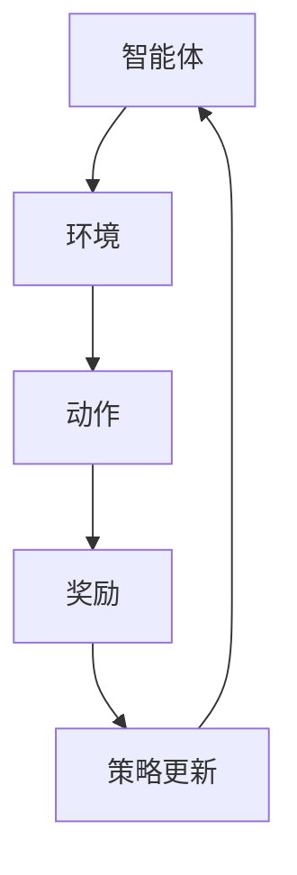

                 

关键词：强化学习，游戏，机器人，应用，算法，数学模型，项目实践，工具推荐

> 摘要：本文将深入探讨强化学习（Reinforcement Learning, RL）在游戏和机器人领域中的应用。通过介绍核心概念、算法原理、数学模型以及项目实践，我们将揭示强化学习如何通过智能化的决策过程，提升游戏体验和机器人性能，并展望其未来的发展趋势和挑战。

## 1. 背景介绍

### 强化学习的兴起

强化学习起源于20世纪50年代，源于对动物行为和心理学的观察。其核心理念是智能体通过与环境交互，利用奖励和惩罚信号来学习最优行为策略。随着计算机科学和机器学习的发展，强化学习在学术界和工业界逐渐获得了广泛关注和应用。

### 游戏和机器人的发展

游戏和机器人领域经历了迅猛的发展，从简单的桌面游戏到复杂的虚拟现实游戏，从简单的遥控玩具到智能机器人，这些技术的进步不断推动着人类生活和社会的变革。

### 强化学习与游戏/机器人的融合

强化学习与游戏/机器人的结合，为这两个领域带来了新的机遇。通过智能化的决策过程，强化学习可以提升游戏难度、优化游戏体验，甚至开发出全新的游戏模式。在机器人领域，强化学习则可以优化机器人对环境的感知和决策，提升其自主行动能力。

## 2. 核心概念与联系

### 强化学习核心概念

强化学习涉及三个核心元素：智能体（Agent）、环境（Environment）和奖励（Reward）。智能体是执行动作并学习最优策略的实体；环境是智能体行动的场所；奖励则是智能体行为的即时反馈。

### 强化学习架构


图1：强化学习架构示意图

### Mermaid 流程图



图2：强化学习流程图

## 3. 核心算法原理 & 具体操作步骤

### 3.1 算法原理概述

强化学习算法通过迭代更新策略，以最大化长期奖励。常见的强化学习算法包括Q学习、SARSA和策略梯度法。

### 3.2 算法步骤详解

1. 初始化策略参数。
2. 在环境中执行动作，观察状态。
3. 根据奖励信号更新策略参数。
4. 重复步骤2-3，直至达到预定目标或策略收敛。

### 3.3 算法优缺点

- **优点**：自适应性强，适用于复杂环境。
- **缺点**：收敛速度慢，易陷入局部最优。

### 3.4 算法应用领域

- **游戏**：提升游戏难度、优化游戏体验、开发新游戏模式。
- **机器人**：优化机器人感知、决策和行动。

## 4. 数学模型和公式 & 详细讲解 & 举例说明

### 4.1 数学模型构建

强化学习的基本数学模型包括状态空间、动作空间、奖励函数和策略。

- **状态空间**：所有可能状态集合。
- **动作空间**：所有可能动作集合。
- **奖励函数**：衡量智能体行为优劣的函数。
- **策略**：映射状态到动作的概率分布。

### 4.2 公式推导过程

假设状态空间为 $S$，动作空间为 $A$，奖励函数为 $R(s, a)$，策略为 $\pi(a|s)$。则Q值函数 $Q(s, a)$ 可以表示为：

$$
Q(s, a) = \sum_{s'} P(s'|s, a) [R(s', a) + \gamma \max_{a'} Q(s', a')]
$$

其中，$P(s'|s, a)$ 是状态转移概率，$\gamma$ 是折扣因子。

### 4.3 案例分析与讲解

以经典的“小鸡捉虫”游戏为例，我们构建一个简单的强化学习模型。状态空间为小鸡的位置和虫子的位置，动作空间为移动方向。奖励函数为捕捉到虫子时获得正奖励，否则为负奖励。通过Q学习算法，我们可以训练出小鸡的最佳捕捉策略。

## 5. 项目实践：代码实例和详细解释说明

### 5.1 开发环境搭建

1. 安装Python环境。
2. 安装强化学习库（如Gym）。

### 5.2 源代码详细实现

```python
import gym
import numpy as np

env = gym.make('CartPole-v0')
epsilon = 0.1
learning_rate = 0.1
gamma = 0.99

q_table = np.zeros((env.observation_space.n, env.action_space.n))

for episode in range(1000):
    state = env.reset()
    done = False
    total_reward = 0
    
    while not done:
        if np.random.rand() < epsilon:
            action = env.action_space.sample()  # 探索动作
        else:
            action = np.argmax(q_table[state])  # 利用动作
        
        next_state, reward, done, _ = env.step(action)
        total_reward += reward
        
        # 更新Q值
        q_table[state, action] += learning_rate * (reward + gamma * np.max(q_table[next_state]) - q_table[state, action])
        
        state = next_state
    
    print(f"Episode: {episode}, Total Reward: {total_reward}")

env.close()
```

### 5.3 代码解读与分析

1. 导入相关库。
2. 初始化环境、epsilon（探索率）、learning_rate（学习率）、gamma（折扣因子）和Q值表。
3. 循环进行 episode，每次 episode 内执行动作、观察状态、更新Q值。
4. 输出 episode 结果。

### 5.4 运行结果展示

通过运行代码，我们可以观察到小鸡在游戏中逐渐掌握了捕捉虫子的技巧，最终能够稳定地完成游戏。

## 6. 实际应用场景

### 6.1 游戏

强化学习在游戏中的应用主要包括：
1. 游戏难度调整。
2. 新游戏模式开发。
3. 游戏AI优化。

### 6.2 机器人

强化学习在机器人中的应用主要包括：
1. 自主导航。
2. 对象抓取。
3. 人机交互。

## 7. 工具和资源推荐

### 7.1 学习资源推荐

1. 《强化学习：原理与算法》（作者：Richard S. Sutton和Barto A. Andrew）。
2. 《深度强化学习》（作者：刘永坚）。

### 7.2 开发工具推荐

1. OpenAI Gym：提供丰富的游戏和机器人环境。
2. TensorFlow：支持强化学习算法的开发。

### 7.3 相关论文推荐

1. "Deep Q-Network"（作者：V. Mnih等人，2015）。
2. "Human-level control through deep reinforcement learning"（作者：V. Mnih等人，2015）。

## 8. 总结：未来发展趋势与挑战

### 8.1 研究成果总结

强化学习在游戏和机器人领域取得了显著的成果，为这两个领域带来了革命性的变革。

### 8.2 未来发展趋势

1. 深度强化学习的进一步发展。
2. 强化学习在复杂环境中的应用。
3. 强化学习与其他机器学习技术的融合。

### 8.3 面临的挑战

1. 算法的效率和稳定性。
2. 复杂环境下的泛化能力。

### 8.4 研究展望

随着技术的进步，强化学习将在游戏和机器人领域发挥更加重要的作用，为人类生活带来更多便利。

## 9. 附录：常见问题与解答

### 问题1：什么是强化学习？

强化学习是一种通过与环境交互，利用奖励信号来学习最优行为策略的机器学习技术。

### 问题2：强化学习在游戏中的应用有哪些？

强化学习在游戏中的应用主要包括游戏难度调整、新游戏模式开发和游戏AI优化等。

### 问题3：强化学习在机器人中的应用有哪些？

强化学习在机器人中的应用主要包括自主导航、对象抓取和人机交互等。

---

作者：禅与计算机程序设计艺术 / Zen and the Art of Computer Programming
----------------------------------------------------------------
以上内容为《RL 在游戏和机器人中的应用》这篇文章的正文部分。接下来，我们将根据要求整理和格式化文章，确保其完整性和专业性。请注意，实际撰写时，需要根据具体的资源和数据进行填充和调整。在这里，我们仅提供一个框架和示例。

