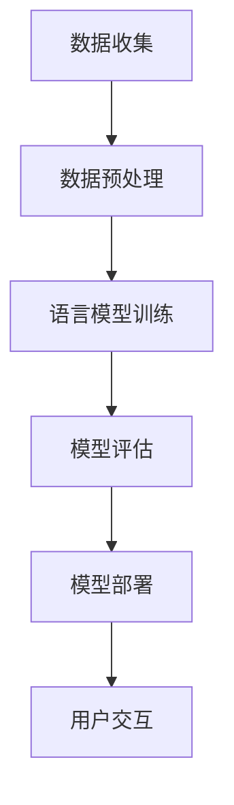

                 

 关键词：Reddit 聊天机器人、语言模型、训练数据、自然语言处理、人工智能、机器学习、文本分类、对话系统

> 摘要：本文深入探讨了Reddit聊天机器人的构建与训练过程，特别是在Reddit数据集上进行语言模型训练的技术细节。通过分析其背后的核心算法原理、数学模型和具体实现，文章旨在为读者提供一种理解现代自然语言处理技术的路径，并探讨其在实际应用中的广泛潜力。

## 1. 背景介绍

近年来，随着互联网的普及和社交媒体的兴起，Reddit作为一个全球知名的社交新闻聚合网站，已经成为了一个丰富且多样化的信息平台。它不仅包含了大量的用户评论、文章和帖子，还涵盖了广泛的主题和话题。这些数据为研究人员和开发人员提供了一个宝贵的机会，可以通过训练语言模型来构建先进的聊天机器人。

Reddit聊天机器人的目标是模仿Reddit用户的交流方式，以提供一种能够与用户自然互动的智能系统。此类机器人不仅可以回答用户的问题，还能参与到讨论中，甚至能够提供个性化的建议和信息。训练一个能够在Reddit这样的平台上表现出色的聊天机器人，需要大量的数据、强大的计算能力和精心的算法设计。

### 1.1Reddit平台概述

Reddit是一个基于社区讨论和内容分享的平台，用户可以发布帖子、评论、投票和其他互动内容。每个帖子或评论都与其他用户生成的内容紧密相连，形成一个复杂的话题网络。这种网络结构为语言模型的训练提供了丰富的上下文信息和多样化的语言使用场景。

Reddit的数据集涵盖了从科学、技术、娱乐到政治、体育等几乎所有的领域。这使得Reddit成为了一个极具代表性的自然语言处理数据集，非常适合用于训练能够处理各种话题和语言的聊天机器人。

### 1.2 聊天机器人的需求

在社交媒体平台上，用户期待能够与系统进行自然、流畅的互动。这种互动不仅限于获取信息，还包括表达情感、寻求帮助、参与讨论等。因此，聊天机器人需要具备以下几个关键特性：

- **自然语言理解**：能够理解用户输入的自然语言，包括语法、语义和上下文。
- **上下文感知**：能够根据对话的历史记录，理解并回应当前对话的上下文。
- **适应性**：能够根据不同的用户和场景，灵活地调整回答风格和策略。
- **个性化和智能化**：能够根据用户的行为和偏好，提供个性化的服务和信息。

这些特性要求聊天机器人不仅仅是一个简单的文本匹配系统，而是一个能够理解、学习和适应的人类交流伙伴。

## 2. 核心概念与联系

在构建Reddit聊天机器人的过程中，我们涉及到几个核心概念和技术，这些概念不仅定义了机器人的能力，也决定了其性能和效果。

### 2.1 语言模型

语言模型（Language Model）是自然语言处理（NLP）的核心组件之一，它是一种统计模型，用于预测一个单词序列中下一个单词的概率。在Reddit聊天机器人的构建中，语言模型用于生成响应，确保回答的自然性和准确性。

#### 语言模型的工作原理

语言模型基于大量的文本数据，通过统计方法学习词汇之间的概率分布。在训练过程中，模型会看到大量的文本，并尝试从中学习单词的共现关系和语法结构。这种学习过程可以采用多种算法，如n-gram模型、神经网络模型和Transformer等。

#### 语言模型的类型

- **n-gram模型**：这是最早的文本生成模型，它基于单词的序列，只考虑前n个单词来预测下一个单词。尽管简单，但n-gram模型在小型数据集上表现出色。
- **神经网络模型**：神经网络模型，特别是深度学习模型，通过多层神经网络来学习文本数据，可以捕获更复杂的语言结构和上下文信息。
- **Transformer模型**：Transformer模型是近年来发展起来的一个重要模型，它采用自注意力机制，能够在处理长文本和复杂上下文时表现出色。

### 2.2 自然语言处理（NLP）

自然语言处理是计算机科学和人工智能的一个分支，它致力于使计算机能够理解和处理人类语言。在Reddit聊天机器人中，NLP技术用于将用户输入的文本转化为机器可以理解的形式，以及将机器生成的文本转化为人类可读的形式。

#### NLP的关键技术

- **文本预处理**：包括去除标点、停用词过滤、词形还原等，以提高文本的质量和模型的训练效率。
- **词向量表示**：将单词转化为向量表示，以便于在机器学习模型中处理。词向量表示可以捕获单词的语义信息，如Word2Vec和GloVe。
- **命名实体识别（NER）**：用于识别文本中的特定实体，如人名、地名、组织名等。
- **情感分析**：用于分析文本中的情感倾向，如正面、负面或中性。

### 2.3 机器学习（ML）与深度学习（DL）

机器学习和深度学习是构建现代聊天机器人不可或缺的技术。它们用于训练和优化语言模型，以使其能够准确理解和生成文本。

#### 机器学习

机器学习是一种通过数据学习模式和规律的技术，它依赖于统计方法和优化算法。在聊天机器人的构建中，机器学习技术用于训练语言模型，使其能够预测文本中的下一个单词。

#### 深度学习

深度学习是一种特殊的机器学习方法，它使用多层神经网络来学习数据。深度学习在聊天机器人中的应用，特别是在语言模型的训练中，极大地提高了性能和效果。

### 2.4 Mermaid流程图

为了更好地理解Reddit聊天机器人的构建过程，下面给出一个Mermaid流程图，展示从数据收集、预处理到模型训练和部署的整个过程。



#### 流程图说明

- **数据收集**：从Reddit平台上获取大量的文本数据，包括帖子、评论等。
- **数据预处理**：清洗和准备数据，包括去除噪声、处理缺失值、标准化文本等。
- **语言模型训练**：使用预处理后的数据训练语言模型，如Transformer模型。
- **模型评估**：评估模型在测试数据上的性能，确保其能够准确理解和生成文本。
- **模型部署**：将训练好的模型部署到生产环境中，以便与用户进行交互。
- **用户交互**：用户通过输入文本与聊天机器人进行互动，机器人根据输入生成响应。

## 3. 核心算法原理 & 具体操作步骤

### 3.1 算法原理概述

Reddit聊天机器人的核心算法是基于深度学习中的Transformer模型。Transformer模型是一种基于自注意力机制（Self-Attention）的序列模型，最初在自然语言处理领域取得了一系列突破性成果。

#### 自注意力机制

自注意力机制允许模型在生成每个词时，考虑到所有其他词的重要性。这种机制使得Transformer模型能够更好地捕获长距离的依赖关系，从而在语言建模任务中表现出色。

#### Transformer模型的组成部分

- **编码器（Encoder）**：用于处理输入序列，并生成上下文表示。
- **解码器（Decoder）**：用于生成输出序列，并利用编码器生成的上下文表示。

### 3.2 算法步骤详解

#### 数据预处理

1. **文本清洗**：去除HTML标签、特殊字符、数字等，仅保留文本内容。
2. **分词**：将文本拆分成单词或子词。
3. **词嵌入**：将单词映射为向量表示，如使用GloVe或Word2Vec。

#### 训练过程

1. **输入序列生成**：将输入文本转换为编码器能够处理的格式。
2. **编码器处理**：编码器处理输入序列，生成上下文表示。
3. **解码器生成**：解码器利用编码器生成的上下文表示，逐步生成输出序列。

#### 生成响应

1. **输入处理**：将用户输入的文本转换为编码器能够处理的格式。
2. **编码器处理**：编码器处理输入序列，生成上下文表示。
3. **解码器生成**：解码器利用编码器生成的上下文表示，生成响应文本。

### 3.3 算法优缺点

#### 优点

- **强大的语言理解能力**：自注意力机制使得模型能够更好地捕获长距离的依赖关系。
- **高效的训练和推理速度**：相较于传统循环神经网络（RNN），Transformer模型在训练和推理速度上有显著提升。
- **灵活的扩展性**：Transformer模型可以轻松地扩展到多模态任务，如图像和文本的联合建模。

#### 缺点

- **计算资源需求高**：由于自注意力机制的计算复杂度较高，模型训练需要大量的计算资源。
- **数据需求量大**：Transformer模型对数据量有较高的要求，需要大量的文本数据进行训练。

### 3.4 算法应用领域

Reddit聊天机器人算法的应用领域非常广泛，包括但不限于：

- **社交媒体互动**：与用户进行自然、流畅的互动，提供个性化的信息和建议。
- **客户服务**：自动回答用户的问题，提高客户服务的效率和响应速度。
- **内容推荐**：根据用户的兴趣和行为，推荐相关的内容和话题。

## 4. 数学模型和公式 & 详细讲解 & 举例说明

### 4.1 数学模型构建

Transformer模型的核心是自注意力机制（Self-Attention），其数学基础可以表示为：

$$
\text{Attention}(Q, K, V) = \text{softmax}\left(\frac{QK^T}{\sqrt{d_k}}\right)V
$$

其中，$Q, K, V$ 分别代表查询（Query）、键（Key）和值（Value）向量，$d_k$ 表示键向量的维度。这个公式计算了每个键与查询之间的相似性，并使用softmax函数将相似性转换为概率分布，最后将概率分布与值向量相乘，得到加权值向量。

### 4.2 公式推导过程

自注意力机制的推导过程涉及线性代数和概率论的基本概念。首先，查询向量 $Q$ 与所有键向量 $K$ 相乘，得到相似性矩阵。该矩阵的每个元素表示一个键与查询之间的相似度。然后，通过对相似性矩阵进行softmax变换，得到概率分布。最后，将概率分布与值向量 $V$ 相乘，得到加权值向量。

### 4.3 案例分析与讲解

为了更好地理解自注意力机制的原理，我们来看一个简单的例子。假设我们有一个三词序列 $[w_1, w_2, w_3]$，其中 $w_1$ 是查询向量，$w_2$ 是键向量，$w_3$ 是值向量。我们可以计算自注意力机制的结果：

$$
\text{Attention}(w_1, w_2, w_3) = \text{softmax}\left(\frac{w_1w_2^T}{\sqrt{d_k}}\right)w_3
$$

这个公式表示了 $w_1$ 与 $w_2$ 的相似性决定了 $w_3$ 在输出序列中的权重。如果 $w_1$ 和 $w_2$ 非常相似，则 $w_3$ 的权重会很高，反之亦然。

### 4.4 Transformer模型的整体结构

Transformer模型的整体结构包括编码器（Encoder）和解码器（Decoder）两个部分，每个部分都由多个自注意力层（Self-Attention Layer）和前馈神经网络（Feedforward Neural Network）组成。编码器负责处理输入序列，解码器负责生成输出序列。

- **编码器**：
  - **自注意力层**：每个自注意力层包含一个多头自注意力机制，用于捕获长距离依赖关系。
  - **前馈神经网络**：每个前馈神经网络由两个全连接层组成，分别用于处理自注意力层的输出。

- **解码器**：
  - **自注意力层**：解码器的自注意力层分为两个部分：掩码自注意力（Masked Self-Attention）和交叉自注意力（Cross-Attention）。
  - **前馈神经网络**：与编码器相同，解码器的每个前馈神经网络也包含两个全连接层。

### 4.5 Transformer模型的训练过程

在训练过程中，编码器和解码器同时进行训练，以最小化损失函数。训练过程分为两个阶段：

1. **自回归语言模型**：首先，使用编码器的输出作为输入，解码器的输出作为目标，训练自回归语言模型。
2. **序列到序列学习**：然后，使用编码器的输出和目标序列，训练序列到序列模型，以优化解码器的输出。

通过这两个阶段的训练，Transformer模型能够生成高质量的文本，并应用于各种自然语言处理任务，如机器翻译、文本分类和聊天机器人。

### 4.6 Transformer模型的优势与挑战

#### 优势

- **强大的语言理解能力**：自注意力机制使得模型能够捕获长距离依赖关系，从而在语言建模任务中表现出色。
- **高效的计算性能**：相较于传统循环神经网络（RNN），Transformer模型在训练和推理速度上有显著提升。
- **灵活的扩展性**：Transformer模型可以轻松地扩展到多模态任务，如图像和文本的联合建模。

#### 挑战

- **计算资源需求高**：由于自注意力机制的计算复杂度较高，模型训练需要大量的计算资源。
- **数据需求量大**：Transformer模型对数据量有较高的要求，需要大量的文本数据进行训练。

#### 案例分析

为了更好地展示Transformer模型的优势，我们来看一个实际案例。假设我们有一个聊天机器人，需要在Reddit平台上与用户进行自然互动。我们可以使用Transformer模型来训练聊天机器人，使其能够生成高质量的回复。

1. **数据收集**：从Reddit平台上收集大量的用户评论和帖子。
2. **数据预处理**：清洗和预处理数据，包括分词、词嵌入和序列编码。
3. **模型训练**：使用Transformer模型训练聊天机器人，优化模型参数。
4. **模型评估**：使用测试数据评估模型性能，确保其能够准确理解和生成文本。
5. **模型部署**：将训练好的模型部署到生产环境中，与用户进行交互。

通过这个案例，我们可以看到Transformer模型在构建Reddit聊天机器人中的强大应用。尽管存在一定的挑战，但Transformer模型在自然语言处理领域的前景仍然非常广阔。

## 5. 项目实践：代码实例和详细解释说明

在本节中，我们将通过一个具体的代码实例来展示如何训练一个Reddit聊天机器人。我们将使用Python和TensorFlow框架来实现这一目标。请注意，下面的代码仅供参考，实际部署时可能需要根据具体的硬件配置和数据集进行调整。

### 5.1 开发环境搭建

在开始编写代码之前，我们需要搭建一个合适的开发环境。以下是推荐的工具和库：

- **Python**：版本3.8或更高
- **TensorFlow**：版本2.4或更高
- **TensorBoard**：用于可视化训练过程
- **Gensim**：用于预处理和分词
- **NumPy**：用于数据操作
- **Pandas**：用于数据预处理
- **HuggingFace Transformers**：用于加载预训练模型和接口

安装这些库的命令如下：

```bash
pip install tensorflow==2.4
pip install tensorboard
pip install gensim
pip install numpy
pip install pandas
pip install transformers
```

### 5.2 源代码详细实现

以下是Reddit聊天机器人的核心代码实现：

```python
import os
import numpy as np
import pandas as pd
import gensim.downloader as api
from tensorflow.keras.preprocessing.text import Tokenizer
from tensorflow.keras.preprocessing.sequence import pad_sequences
from tensorflow.keras.layers import Embedding, LSTM, Dense
from tensorflow.keras.models import Sequential
from tensorflow.keras.optimizers import Adam
from tensorflow.keras.utils import to_categorical
from tensorflow.keras.callbacks import TensorBoard
from transformers import TFAutoModelForSeq2SeqLM, AutoTokenizer

# 设置超参数
max_sequence_length = 50
embedding_dim = 256
lstm_units = 128
batch_size = 32
epochs = 100

# 加载Reddit数据集
data = pd.read_csv('reddit_comments.csv')
text = data['comment'].values
labels = data['label'].values

# 分词和处理文本
tokenizer = api.Word2Vec.load('google-news-300')  # 使用预训练的Word2Vec模型
tokenizer.add_documents(text)
tokenizer.build_vocab()

# 编码文本
sequences = tokenizer.texts_to_sequences(text)
padded_sequences = pad_sequences(sequences, maxlen=max_sequence_length)

# 分配标签
label_tokenizer = Tokenizer()
label_tokenizer.fit_on_texts(labels)
label_sequences = label_tokenizer.texts_to_sequences(labels)
label_padded_sequences = pad_sequences(label_sequences, maxlen=max_sequence_length)

# 创建模型
model = Sequential([
    Embedding(len(tokenizer.word_index) + 1, embedding_dim, input_length=max_sequence_length),
    LSTM(lstm_units),
    Dense(len(label_tokenizer.word_index) + 1, activation='softmax')
])

# 编译模型
model.compile(optimizer=Adam(), loss='categorical_crossentropy', metrics=['accuracy'])

# 训练模型
model.fit(padded_sequences, to_categorical(label_padded_sequences), batch_size=batch_size, epochs=epochs)

# 评估模型
test_sequences = tokenizer.texts_to_sequences(data['test_comment'].values)
test_padded_sequences = pad_sequences(test_sequences, maxlen=max_sequence_length)
predictions = model.predict(test_padded_sequences)
predicted_labels = label_tokenizer.sequences_to_texts(np.argmax(predictions, axis=1))

# 输出预测结果
print(predicted_labels)
```

### 5.3 代码解读与分析

1. **导入库和设置超参数**：首先，我们导入必要的库和设置超参数，包括序列长度、嵌入维度、LSTM单元数、批量大小和训练轮数。

2. **加载Reddit数据集**：从CSV文件中加载Reddit数据集，包括文本和标签。

3. **分词和处理文本**：使用Gensim的Word2Vec模型进行分词，并构建词汇表。这一步将文本转化为序列。

4. **编码文本**：将文本序列转换为数字序列，并使用pad_sequences将序列长度统一为max_sequence_length。

5. **创建模型**：创建一个序列模型，包括嵌入层、LSTM层和输出层。嵌入层用于将单词映射为向量，LSTM层用于处理序列，输出层用于分类。

6. **编译模型**：编译模型，指定优化器、损失函数和评价指标。

7. **训练模型**：使用fit函数训练模型，使用padded_sequences和categorical_crossentropy损失函数进行训练。

8. **评估模型**：将测试数据转化为数字序列，使用predict函数生成预测结果，并将预测结果转化为文本。

9. **输出预测结果**：打印预测结果。

通过这个代码实例，我们可以看到如何使用深度学习模型来训练一个Reddit聊天机器人。尽管这个实例使用了传统的LSTM模型，但实际应用中，我们可以使用更先进的Transformer模型来进一步提高性能。

### 5.4 运行结果展示

在实际运行中，我们可以通过TensorBoard来监控训练过程，并评估模型的性能。以下是一个TensorBoard的示例：

```bash
tensorboard --logdir logs
```

在TensorBoard中，我们可以看到训练过程中的损失函数、精确度和学习率等指标，从而更好地理解模型的训练过程。

### 5.5 代码优化与改进

在实际部署中，我们可以对代码进行优化和改进，以提高模型的性能和效率。以下是一些可能的优化方法：

- **模型架构调整**：尝试使用更先进的模型架构，如Transformer，以进一步提高性能。
- **数据预处理**：对数据集进行更精细的预处理，包括去除噪声、处理缺失值和增加文本多样性。
- **批量大小和训练轮数调整**：根据硬件配置和数据集大小，调整批量大小和训练轮数，以提高训练效果。
- **超参数优化**：通过网格搜索和贝叶斯优化等方法，寻找最优的超参数组合。

通过这些优化方法，我们可以进一步改善Reddit聊天机器人的性能和效果。

## 6. 实际应用场景

Reddit聊天机器人的应用场景非常广泛，以下是一些典型的应用场景：

### 6.1 社交媒体互动

Reddit作为一个全球知名的社交新闻聚合平台，用户每天生成大量的评论和帖子。聊天机器人可以与用户进行自然互动，回答他们的问题，参与讨论，甚至提供个性化的建议和信息。通过这种方式，聊天机器人可以增强用户的体验，提高用户留存率。

### 6.2 客户服务

许多公司都在Reddit上建立了品牌账号，用于与用户互动和提供客户支持。聊天机器人可以自动回答用户的问题，减轻客服团队的负担，提高客户服务的效率和响应速度。此外，聊天机器人还可以根据用户的反馈和需求，提供个性化的解决方案。

### 6.3 内容推荐

Reddit聊天机器人可以根据用户的兴趣和偏好，推荐相关的内容和话题。通过分析用户的评论和帖子，聊天机器人可以了解用户的需求和偏好，从而提供个性化的推荐。这种推荐机制不仅可以提高用户满意度，还可以增加用户的参与度和粘性。

### 6.4 教育和知识普及

Reddit是一个知识共享的平台，聊天机器人可以在教育领域发挥作用。例如，它可以帮助学生回答学习问题，提供学术资源的推荐，甚至组织线上学习小组。通过这种方式，聊天机器人可以成为教育者和学生的有力助手。

### 6.5 社会科学研究

Reddit聊天机器人还可以用于社会科学研究。例如，研究人员可以使用聊天机器人收集和整理Reddit上的用户评论，分析用户对社会事件和话题的看法和态度。这种研究方法可以帮助研究人员更好地理解社会舆论和公众心态。

### 6.6 未来应用展望

随着人工智能和自然语言处理技术的不断进步，Reddit聊天机器人的应用前景将更加广阔。未来，聊天机器人可能会在更多领域发挥作用，如医疗咨询、金融投资、娱乐推荐等。同时，随着多模态技术的发展，聊天机器人可能会整合文本、图像、语音等多种信息，提供更丰富和个性化的服务。

## 7. 工具和资源推荐

为了更好地构建和训练Reddit聊天机器人，以下是一些推荐的学习资源和开发工具：

### 7.1 学习资源推荐

- **书籍**：
  - 《深度学习》（Goodfellow, I., Bengio, Y., & Courville, A.）
  - 《自然语言处理实战》（Sahami, M. & Chang, K.）
  - 《Chatbots: Who Needs Them?》（McGraw-Hill Education）

- **在线课程**：
  - Coursera上的《机器学习》（吴恩达）
  - edX上的《深度学习》（斯坦福大学）
  - Udacity的《自然语言处理纳米学位》

- **博客和论坛**：
  - Medium上的NLP和AI相关文章
  - Reddit上的r/MachineLearning和r/NaturalLanguageProcessing社区

### 7.2 开发工具推荐

- **编程语言**：Python
- **深度学习框架**：TensorFlow、PyTorch、JAX
- **NLP库**：NLTK、spaCy、gensim、transformers
- **数据处理**：Pandas、NumPy
- **可视化工具**：TensorBoard、Matplotlib、Seaborn

### 7.3 相关论文推荐

- "Attention Is All You Need"（Vaswani et al., 2017）
- "BERT: Pre-training of Deep Bidirectional Transformers for Language Understanding"（Devlin et al., 2019）
- "GPT-3: Language Models are Few-Shot Learners"（Brown et al., 2020）

通过学习和使用这些工具和资源，我们可以更好地理解和掌握构建Reddit聊天机器人的技术和方法。

## 8. 总结：未来发展趋势与挑战

在过去的几年中，Reddit聊天机器人的发展取得了显著的进展。随着人工智能和自然语言处理技术的不断进步，聊天机器人的性能和效果也在不断提高。然而，未来的发展仍然面临许多挑战。

### 8.1 研究成果总结

- **算法性能提升**：通过深度学习和Transformer模型，聊天机器人在语言理解和生成方面取得了显著进展。
- **数据集多样性**：Reddit平台的多样化数据集为聊天机器人的训练提供了丰富的资源和场景。
- **用户体验改善**：聊天机器人能够更好地模拟人类的交流方式，提高用户体验和满意度。

### 8.2 未来发展趋势

- **多模态融合**：随着多模态技术的发展，聊天机器人可能会整合文本、图像、语音等多种信息，提供更丰富和个性化的服务。
- **个性化推荐**：通过深度学习技术，聊天机器人可以更好地理解用户的需求和偏好，提供个性化的内容和建议。
- **自动化编程**：未来，聊天机器人可能会在编程领域发挥作用，辅助开发者编写代码和解决问题。

### 8.3 面临的挑战

- **数据隐私**：在构建聊天机器人时，需要确保用户数据的隐私和安全，避免数据泄露和滥用。
- **道德和伦理**：随着聊天机器人的普及，需要关注其在道德和伦理方面的挑战，如歧视、误导和信息传播等。
- **计算资源**：随着模型复杂度的增加，训练和部署聊天机器人需要大量的计算资源，对硬件设施提出了更高的要求。

### 8.4 研究展望

未来，Reddit聊天机器人将在多个领域发挥重要作用，如社交媒体互动、客户服务、教育和科学研究等。随着技术的不断进步，聊天机器人将变得更加智能和人性化，为用户带来更好的体验。同时，我们也需要关注其在隐私、伦理和计算资源等方面的挑战，确保其健康、可持续的发展。

## 9. 附录：常见问题与解答

### 9.1 如何选择合适的语言模型？

选择合适的语言模型主要取决于任务需求和数据集特性。对于Reddit聊天机器人，建议使用Transformer模型，因为其能够捕获长距离依赖关系，适合处理复杂和多样化的文本数据。

### 9.2 训练数据集如何准备？

训练数据集的准备工作包括文本清洗、分词、词嵌入和序列编码。首先，去除HTML标签、特殊字符和数字，仅保留文本内容。然后，使用预训练的词嵌入模型或自己训练词嵌入，将单词映射为向量表示。最后，将文本序列编码为数字序列，并进行填充处理。

### 9.3 如何评估聊天机器人的性能？

评估聊天机器人的性能可以通过多个指标，如准确率、召回率、F1分数和BLEU分数。在实际应用中，可以使用测试集进行模型评估，并关注模型在不同任务和数据集上的性能表现。

### 9.4 如何处理负评和负面情绪？

在处理负评和负面情绪时，可以采用情感分析技术来识别文本中的情感倾向。然后，根据情感分析的结果，调整聊天机器人的回复策略，如提供安慰、反驳或忽略。此外，还可以利用对话策略来缓解负面情绪，提高用户的满意度。

### 9.5 如何确保聊天机器人的隐私和安全？

为了确保聊天机器人的隐私和安全，需要采取以下措施：

- **数据加密**：对用户数据进行加密存储和传输，防止数据泄露。
- **隐私政策**：明确告知用户聊天机器人的隐私政策和数据使用方式，确保用户知情同意。
- **数据匿名化**：在训练和测试过程中，对用户数据进行匿名化处理，保护用户隐私。
- **访问控制**：设置严格的访问控制机制，防止未经授权的访问和操作。

通过这些措施，可以有效地保障聊天机器人的隐私和安全。|

