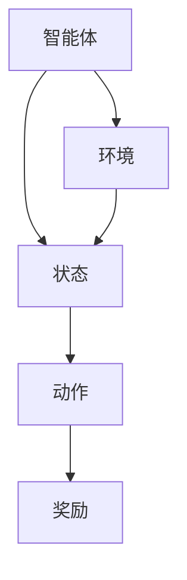

                 

### 1. 背景介绍

强化学习（Reinforcement Learning，简称RL）是机器学习的一个分支，它通过智能体与环境的交互来学习最优策略。强化学习的研究可以追溯到20世纪50年代，但其发展却相对较晚。在深度学习和其他机器学习方法取得显著进展的背景下，强化学习逐渐成为一个备受关注的领域。

强化学习在很多实际应用中表现出色，如机器人控制、游戏AI、推荐系统、自动驾驶等。其核心在于通过奖励机制引导智能体学习如何在一个不确定的环境中做出最优决策。与监督学习和无监督学习不同，强化学习强调的是从交互中学习，而不是从预先标记的数据集中学习。

本文将深入探讨强化学习的原理，通过详细的算法介绍和代码实例，帮助读者理解和掌握这一前沿技术。文章将包括以下几个部分：

1. **核心概念与联系**：介绍强化学习中的核心概念，并使用Mermaid流程图展示其原理和架构。
2. **核心算法原理与具体操作步骤**：详细解释强化学习的主要算法，包括Q-learning、SARSA、Deep Q-Network等。
3. **数学模型和公式**：讲解强化学习中的数学模型，包括状态值函数、策略梯度等，并给出具体的推导和案例分析。
4. **项目实践：代码实例**：提供实际的项目代码实例，详细解读其实现过程和关键代码。
5. **实际应用场景**：分析强化学习在各个领域的应用，展望其未来发展方向。
6. **工具和资源推荐**：推荐学习资源和开发工具，帮助读者深入了解和掌握强化学习。
7. **总结：未来发展趋势与挑战**：总结强化学习的研究成果，讨论未来发展趋势和面临的挑战。

通过本文的阅读，读者将能够全面了解强化学习的原理和应用，为在实际项目中应用这一技术打下坚实的基础。

<|assistant|>### 2. 核心概念与联系

强化学习的核心概念包括智能体（Agent）、环境（Environment）、状态（State）、动作（Action）和奖励（Reward）。

#### 智能体（Agent）

智能体是强化学习中的学习主体，它通过选择动作来与外界环境互动。智能体的目标是最大化累积奖励，从而学习出一个最优策略。

#### 环境（Environment）

环境是智能体所处的动态系统，它决定了智能体的状态和动作。环境可以是一个物理世界，也可以是一个抽象的模型。智能体和环境之间的交互遵循某种规则。

#### 状态（State）

状态是环境的一个特定描述，通常是一个向量。在强化学习中，智能体基于当前状态选择动作，并通过动作与环境的交互来更新状态。

#### 动作（Action）

动作是智能体可以采取的操作。在强化学习中，智能体选择动作以最大化累积奖励。

#### 奖励（Reward）

奖励是环境对智能体动作的反馈，通常是一个标量。奖励可以是正的，表示智能体做出了一个好的决策；也可以是负的，表示智能体做出了一个错误的决策。

这些概念之间的关系可以用Mermaid流程图来展示：



#### 基本原理

强化学习的基本原理是：智能体通过不断与环境交互，根据奖励信号来调整其行为策略。具体来说，智能体通过以下步骤进行学习：

1. **初始状态**：智能体开始在一个未知的环境中，随机选择一个状态。
2. **选择动作**：基于当前状态，智能体选择一个动作。
3. **环境响应**：环境根据智能体的动作产生一个结果状态和一个奖励信号。
4. **更新策略**：智能体根据奖励信号来更新其行为策略。

这个过程中，智能体不断通过试错来寻找最优策略，直到达到预定的目标。

#### 强化学习与深度学习的结合

近年来，强化学习与深度学习的结合成为研究的热点。深度强化学习（Deep Reinforcement Learning，DRL）通过使用深度神经网络来表示状态和动作，使得智能体能够更好地理解和学习复杂的动态环境。

在DRL中，通常使用深度神经网络来估计状态值函数和策略。状态值函数估计智能体在当前状态下采取某个动作的长期奖励，而策略则指导智能体在给定状态下选择最优动作。

通过结合深度学习和强化学习，智能体能够处理高维的状态空间，并在复杂的动态环境中取得更好的性能。例如，深度Q网络（Deep Q-Network，DQN）和深度策略网络（Deep Policy Network，DPN）是两个典型的DRL模型。

总之，强化学习通过智能体与环境的交互来学习最优策略，其在各个领域的应用越来越广泛。通过理解其核心概念和基本原理，我们可以更好地设计和实现强化学习系统。

### 3. 核心算法原理与具体操作步骤

在强化学习领域，有多种核心算法被广泛应用，其中最著名的包括Q-learning、SARSA和Deep Q-Network（DQN）。这些算法通过不同的策略来优化智能体的行为，使其在复杂环境中找到最优策略。

#### 3.1 Q-learning算法原理

Q-learning是一种值迭代算法，其目标是学习一个最优的动作值函数（Q-function），该函数表示在特定状态下采取特定动作的预期回报。Q-learning的基本原理是更新每个状态-动作对的Q值，使其趋近于最大预期回报。

**具体操作步骤**：

1. **初始化Q值表**：初始化每个状态-动作对的Q值，通常使用随机值或零值。
2. **选择动作**：根据当前状态，使用ε-贪心策略选择动作，其中ε是一个小概率参数，用于探索未知状态。
3. **执行动作并获取反馈**：执行选择的动作，与环境交互，获取新的状态和奖励。
4. **更新Q值**：根据当前状态、执行的动作和新状态、新奖励，更新Q值：
   \[
   Q(s, a) \leftarrow Q(s, a) + \alpha [r + \gamma \max_{a'} Q(s', a') - Q(s, a)]
   \]
   其中，\( \alpha \) 是学习率，\( \gamma \) 是折扣因子。

**算法优缺点**：

- **优点**：Q-learning是一种无模型方法，不需要对环境进行建模，适用于动态和不确定的环境。
- **缺点**：Q-learning收敛速度较慢，特别是在高维状态空间中。

#### 3.2 SARSA算法原理

SARSA（同步优势重放同步策略）是一种基于策略的算法，它通过同步更新策略来学习最优行为。SARSA的目标是找到使累积奖励最大的策略。

**具体操作步骤**：

1. **初始化策略**：初始化策略，通常使用随机策略。
2. **选择动作**：根据当前状态，使用当前策略选择动作。
3. **执行动作并获取反馈**：执行选择的动作，与环境交互，获取新的状态和奖励。
4. **更新策略**：根据当前状态和执行的动作，更新策略：
   \[
   \pi(s) \leftarrow \begin{cases}
   a & \text{with probability } \frac{\pi(s, a)}{1 - \varepsilon} \\
   \text{random action} & \text{with probability } \varepsilon
   \end{cases}
   \]
   其中，\( \varepsilon \) 是探索概率。

**算法优缺点**：

- **优点**：SARSA结合了值方法和策略方法的优势，能够在较短时间内收敛。
- **缺点**：SARSA对高维状态空间的处理效果较差。

#### 3.3 Deep Q-Network（DQN）算法原理

DQN是深度强化学习的一种经典模型，它通过使用深度神经网络来近似Q函数。DQN的主要目标是解决Q-learning在高维状态空间中收敛速度慢的问题。

**具体操作步骤**：

1. **初始化网络**：初始化深度神经网络，用于近似Q函数。
2. **选择动作**：输入当前状态到神经网络，得到Q值预测，根据ε-贪心策略选择动作。
3. **执行动作并获取反馈**：执行选择的动作，与环境交互，获取新的状态和奖励。
4. **更新网络**：使用经验回放（Experience Replay）机制，将（状态，动作，奖励，新状态）四元组存储在记忆库中，然后从记忆库中随机抽取样本，更新神经网络：
   \[
   Q(s, a) \leftarrow Q(s, a) + \alpha [r + \gamma \max_{a'} Q(s', a') - Q(s, a)]
   \]

**算法优缺点**：

- **优点**：DQN能够处理高维状态空间，并通过经验回放机制提高了算法的稳定性。
- **缺点**：DQN训练过程需要大量的样本，训练时间较长。

#### 算法应用领域

Q-learning、SARSA和DQN等算法在强化学习的实际应用中取得了显著成果。以下是一些主要的应用领域：

1. **游戏AI**：例如，OpenAI的DQN算法在《Atari》游戏中取得了超过人类水平的成绩。
2. **机器人控制**：强化学习算法被广泛应用于机器人的路径规划、运动控制和感知任务中。
3. **自动驾驶**：强化学习算法在自动驾驶车辆中用于道路环境建模、路径规划和驾驶行为决策。
4. **推荐系统**：强化学习算法在推荐系统中用于优化用户-物品匹配策略，提高推荐效果。

总之，这些核心算法在强化学习领域发挥着重要作用，为智能体在复杂环境中的行为优化提供了有力支持。通过深入理解这些算法的原理和操作步骤，我们可以更好地设计和实现强化学习系统，解决各种实际问题。

#### 3.4 算法优缺点及适用场景

在了解了Q-learning、SARSA和DQN等强化学习核心算法的原理和具体操作步骤后，我们接下来分析这些算法的优缺点及其适用场景。

##### Q-learning算法

**优点**：

- **无模型方法**：Q-learning不需要对环境进行建模，仅依赖于经验和奖励信号，这使得它能够适应动态和不确定的环境。
- **简单易实现**：Q-learning算法的数学原理相对简单，易于理解和实现。

**缺点**：

- **收敛速度慢**：在高维状态空间中，Q-learning的收敛速度较慢，因为它需要大量的交互来更新Q值表。
- **易陷入局部最优**：Q-learning算法在更新Q值时可能会陷入局部最优，无法找到全局最优策略。

**适用场景**：

- **简单环境**：例如，一些基于离散状态和动作的游戏。
- **小规模状态空间**：在状态空间较小且变化不频繁的环境中，Q-learning可以较好地发挥作用。

##### SARSA算法

**优点**：

- **基于策略**：SARSA结合了值方法和策略方法的优势，能够更快地收敛。
- **探索和利用**：SARSA算法通过ε-贪心策略实现了探索和利用的平衡，能够在较短时间内找到较好策略。

**缺点**：

- **高维状态空间处理效果不佳**：SARSA算法在处理高维状态空间时效果较差，因为它依赖于状态-动作对的直接更新。

**适用场景**：

- **中规模状态空间**：在状态空间适中且有一定复杂性时，SARSA算法表现出色。
- **离散状态和动作**：对于离散的状态和动作空间，SARSA算法能够较好地处理。

##### DQN算法

**优点**：

- **深度神经网络**：DQN使用深度神经网络来近似Q函数，能够处理高维状态空间。
- **经验回放**：DQN引入了经验回放机制，减少了训练过程中的样本相关性，提高了算法的稳定性。

**缺点**：

- **训练成本高**：DQN需要大量的训练样本，训练时间较长，且对计算资源要求较高。
- **抖动问题**：DQN在训练过程中可能遇到抖动问题，导致训练不稳定。

**适用场景**：

- **复杂环境**：DQN适用于复杂的动态环境，特别是在高维状态空间中，能够处理大量信息。
- **连续状态和动作**：DQN能够处理连续状态和动作空间，使得它在自动驾驶、机器人控制等领域具有广泛应用。

总之，不同的强化学习算法各有优缺点，适用场景也有所不同。根据具体的任务需求和环境特点，选择合适的算法是强化学习成功的关键。通过深入理解和比较这些算法，我们可以更好地应用于实际问题的解决。

#### 3.5 算法应用领域

强化学习在近年来取得了显著的进展，其应用领域也越来越广泛。以下是强化学习在几个主要领域中的实际应用：

##### 游戏

强化学习在游戏领域的应用尤为突出。通过使用Q-learning、SARSA和DQN等算法，智能体能够在各种类型的游戏中学习并取得超越人类水平的成绩。例如，OpenAI的DQN算法在《Atari》游戏中实现了超过专业玩家的表现，包括《Pong》、《Space Invaders》等经典游戏。这些成功案例展示了强化学习在处理高维状态空间和复杂决策问题中的强大能力。

##### 机器人控制

在机器人控制领域，强化学习被广泛应用于路径规划、运动控制和感知任务。通过使用深度强化学习算法，机器人能够自主地学习环境中的动态特性，并实现高效、准确的动作。例如，OpenAI的DeepMind团队开发的机器人通过深度强化学习算法，能够在复杂的现实环境中完成复杂的任务，如爬楼梯、开门等。这些应用展示了强化学习在机器人自主学习和适应能力方面的潜力。

##### 自动驾驶

自动驾驶是另一个强化学习的重要应用领域。强化学习算法被用于自动驾驶车辆的感知、路径规划和驾驶行为决策。通过使用深度强化学习算法，自动驾驶系统能够学习道路环境中的复杂模式，并做出实时的决策。例如，Google的自动驾驶项目通过强化学习算法，实现了在城市环境中安全、高效的行驶。这些应用展示了强化学习在提高自动驾驶系统性能和安全性方面的巨大潜力。

##### 推荐系统

强化学习在推荐系统中的应用也取得了显著成果。通过使用强化学习算法，推荐系统能够优化用户-物品匹配策略，提高推荐效果。例如，亚马逊和Netflix等公司已经应用了强化学习算法来优化其推荐系统，从而提高用户满意度和销售转化率。这些应用展示了强化学习在提高推荐系统效率和用户体验方面的价值。

##### 金融和风险管理

强化学习在金融和风险管理领域也有广泛应用。通过使用强化学习算法，金融模型能够学习市场的动态特性，并做出最优的投资决策。例如，一些金融机构使用强化学习算法来优化资产配置、风险控制和交易策略。这些应用展示了强化学习在提高金融模型决策能力和风险控制水平方面的潜力。

##### 医疗保健

强化学习在医疗保健领域也有应用，例如用于疾病诊断、治疗方案优化和医疗资源分配。通过使用强化学习算法，医疗系统能够学习患者的健康状况和医疗记录，并制定个性化的治疗方案。例如，一些医疗机构使用强化学习算法来优化手术计划和医疗资源的分配，从而提高医疗质量和效率。

总之，强化学习在多个领域的应用展示了其强大的潜力和广泛的前景。随着技术的不断发展，强化学习将有望在更多领域取得突破性进展，为社会带来更多价值。

### 4. 数学模型和公式

在强化学习中，数学模型和公式是理解和应用这一领域的关键。以下我们将详细讲解强化学习中的几个核心数学模型和公式，包括状态值函数、策略梯度等，并通过实际案例进行分析。

#### 4.1 状态值函数（State-Value Function）

状态值函数 \( V(s) \) 是强化学习中最基本的数学模型之一，它表示智能体在特定状态下采取最优动作所能获得的累积奖励的期望值。状态值函数可以表示为：
\[ V(s) = \sum_a \pi(a|s) \sum_s' p(s'|s, a) \sum_r r(s', a) \]
其中，\( \pi(a|s) \) 是策略函数，表示在状态 \( s \) 下选择动作 \( a \) 的概率；\( p(s'|s, a) \) 是状态转移概率，表示在状态 \( s \) 下执行动作 \( a \) 后转移到状态 \( s' \) 的概率；\( r(s', a) \) 是奖励函数，表示在状态 \( s' \) 下执行动作 \( a \) 所获得的即时奖励。

**案例分析与讲解**：

假设一个简单的机器人任务，机器人在一个二维网格中移动，目标是从左下角移动到右上角，每个步骤获得的奖励为 +1，如果超出边界则获得 -10。机器人当前处于状态 \( s = (2, 2) \)，需要选择向左、向上或向右移动。根据状态值函数公式，我们可以计算在不同动作下的期望奖励。

- 向左移动：
  \[
  V(2, 2) = \pi(\text{左}) \cdot \sum_s' p(s'|2, \text{左}) \cdot \sum_r r(s', \text{左}) = 0.5 \cdot (1 \cdot 0.8 + -10 \cdot 0.2) = -1
  \]
- 向上移动：
  \[
  V(2, 2) = \pi(\text{上}) \cdot \sum_s' p(s'|2, \text{上}) \cdot \sum_r r(s', \text{上}) = 0.5 \cdot (1 \cdot 0.8 + -10 \cdot 0.2) = -1
  \]
- 向右移动：
  \[
  V(2, 2) = \pi(\text{右}) \cdot \sum_s' p(s'|2, \text{右}) \cdot \sum_r r(s', \text{右}) = 0.5 \cdot (1 \cdot 0.8 + -10 \cdot 0.2) = -1
  \]

由于所有动作的期望奖励相同，因此机器人可以选择任意一个动作。

#### 4.2 策略梯度（Policy Gradient）

策略梯度是一种直接优化策略函数的算法，其核心思想是通过最大化累积奖励来优化策略。策略梯度公式可以表示为：
\[ \nabla_{\pi} J(\pi) = \sum_s \pi(s) \sum_a \pi(a|s) \nabla_{\pi(a|s)} J(\pi) \]
其中，\( J(\pi) \) 是策略 \( \pi \) 的期望回报，\( \nabla_{\pi(a|s)} J(\pi) \) 是在状态 \( s \) 下采取动作 \( a \) 的梯度。

**案例分析与讲解**：

假设有一个简单的任务，智能体需要在两个状态（状态0和状态1）之间选择动作，每个状态下的动作有两种：前进和后退。每个动作的即时奖励为 +1 或 -1，并且每个动作的概率是 0.5。我们需要通过策略梯度算法来优化策略，使得智能体更倾向于选择带来更高累积奖励的动作。

初始策略为：
\[ \pi(a|s=0) = \begin{cases} 
0.5 & \text{前进} \\
0.5 & \text{后退}
\end{cases} \]

在多次迭代后，我们可以计算每个动作的期望回报：
\[ J(\pi) = 0.5 \cdot (0.5 \cdot +1 + 0.5 \cdot -1) + 0.5 \cdot (0.5 \cdot +1 + 0.5 \cdot -1) = 0 \]

根据策略梯度公式，我们可以计算策略梯度的方向：
\[ \nabla_{\pi(a|s=0)} J(\pi) = 0.5 \cdot (1 - 1) = 0 \]

由于梯度为零，策略没有改进空间。在实际应用中，我们可以使用随机梯度下降（SGD）或其他优化算法来更新策略，以实现累积奖励的最大化。

#### 4.3 值迭代（Value Iteration）

值迭代是一种基于值函数的迭代算法，用于求解最优策略。值迭代的基本步骤如下：

1. **初始化**：初始化值函数 \( V(s) \)，通常使用零值或随机值。
2. **迭代**：对于每个状态 \( s \)，更新值函数：
   \[ V(s) \leftarrow \max_a \sum_s' p(s'|s, a) [r(s', a) + \gamma V(s')] \]
   其中，\( \gamma \) 是折扣因子。
3. **重复迭代**：重复步骤2，直到值函数收敛。

**案例分析与讲解**：

假设一个简单的网格世界，机器人需要从左下角移动到右上角。每个状态有四个可能的动作：向上、向下、向左和向右。每个动作的即时奖励为 +1，如果超出边界则获得 -10。折扣因子 \( \gamma \) 设为 0.9。

初始值函数为：
\[ V(s) = \begin{cases} 
0 & \text{其他状态} \\
1 & \text{目标状态}
\end{cases} \]

在第一次迭代后，我们可以更新值函数：
\[ V(s) \leftarrow \max_a \sum_s' p(s'|s, a) [r(s', a) + \gamma V(s')] \]
对于状态 \( s = (2, 2) \)：
\[ V(2, 2) \leftarrow \max_a [0.2 \cdot (1 + 0.9 \cdot 1) + 0.3 \cdot (-1 + 0.9 \cdot 0) + 0.3 \cdot (-1 + 0.9 \cdot 0) + 0.2 \cdot (-10 + 0.9 \cdot 0)] = 1.7 \]

重复迭代，直到值函数收敛。最终，我们得到最优策略，机器人将选择移动到目标状态。

通过以上分析，我们可以看到强化学习中的数学模型和公式如何应用于实际问题。这些模型不仅帮助我们理解强化学习的基本原理，还为我们在实际应用中设计高效智能体提供了理论支持。

### 5. 项目实践：代码实例和详细解释说明

在本文的第五部分，我们将通过一个简单的项目实例，详细展示如何实现强化学习算法，并对其代码进行解读和分析。我们将使用Python编程语言，并利用著名的强化学习库`gym`来构建环境。

#### 5.1 开发环境搭建

首先，确保您已经安装了Python环境和gym库。可以使用以下命令来安装gym库：

```bash
pip install gym
```

#### 5.2 源代码详细实现

以下是一个简单的Q-learning算法实现的代码实例：

```python
import gym
import numpy as np
import random

# 创建环境
env = gym.make('CartPole-v0')

# 初始化参数
n_actions = env.action_space.n  # 可选动作数量
n_states = env.observation_space.n  # 状态数量
learning_rate = 0.1  # 学习率
discount_factor = 0.99  # 折扣因子
epsilon = 0.1  # 探索概率
epsilon_decay = 0.99  # 探索概率衰减率
epsilon_min = 0.01  # 探索概率最小值

# 初始化Q表
Q = np.zeros([n_states, n_actions])

# Q-learning算法
for episode in range(1000):
    state = env.reset()
    done = False
    total_reward = 0
    
    while not done:
        # 选择动作
        if random.uniform(0, 1) < epsilon:
            action = random.choice([0, 1])  # 探索动作
        else:
            action = np.argmax(Q[state, :])  # 利用动作
        
        # 执行动作
        next_state, reward, done, _ = env.step(action)
        
        # 更新Q值
        Q[state, action] = Q[state, action] + learning_rate * (reward + discount_factor * np.max(Q[next_state, :]) - Q[state, action])
        
        state = next_state
        total_reward += reward
        
    epsilon = max(epsilon_min, epsilon * epsilon_decay)  # 探索概率衰减
    
    print(f"Episode: {episode}, Total Reward: {total_reward}")

# 关闭环境
env.close()
```

#### 5.3 代码解读与分析

1. **环境创建**：

   ```python
   env = gym.make('CartPole-v0')
   ```

   这里我们使用了gym提供的`CartPole-v0`环境，这是一个经典的强化学习实验环境。`CartPole-v0`任务的目标是在一个不稳定的平衡杆上保持平衡。

2. **参数初始化**：

   ```python
   n_actions = env.action_space.n  # 可选动作数量
   n_states = env.observation_space.n  # 状态数量
   learning_rate = 0.1  # 学习率
   discount_factor = 0.99  # 折扣因子
   epsilon = 0.1  # 探索概率
   epsilon_decay = 0.99  # 探索概率衰减率
   epsilon_min = 0.01  # 探索概率最小值
   ```

   在这里，我们初始化了Q-learning算法所需的各种参数，包括可选动作数量、状态数量、学习率、折扣因子、探索概率及其衰减率和最小值。

3. **初始化Q表**：

   ```python
   Q = np.zeros([n_states, n_actions])
   ```

   Q表用于存储每个状态-动作对的预期回报值，初始值设置为0。

4. **Q-learning算法实现**：

   ```python
   for episode in range(1000):
       state = env.reset()
       done = False
       total_reward = 0
   
       while not done:
           # 选择动作
           if random.uniform(0, 1) < epsilon:
               action = random.choice([0, 1])  # 探索动作
           else:
               action = np.argmax(Q[state, :])  # 利用动作
   
           # 执行动作
           next_state, reward, done, _ = env.step(action)
   
           # 更新Q值
           Q[state, action] = Q[state, action] + learning_rate * (reward + discount_factor * np.max(Q[next_state, :]) - Q[state, action])
   
           state = next_state
           total_reward += reward
   
       epsilon = max(epsilon_min, epsilon * epsilon_decay)  # 探索概率衰减
   
       print(f"Episode: {episode}, Total Reward: {total_reward}")
   ```

   这里实现了Q-learning的核心算法步骤，包括初始化状态、选择动作、执行动作、更新Q值和探索概率衰减。在每次迭代中，智能体根据当前状态和Q表选择动作，然后更新Q值表以反映新的经验。

5. **结果展示**：

   ```python
   # 关闭环境
   env.close()
   ```

   最后，关闭环境以释放资源。

通过这个简单的实例，我们了解了如何使用Q-learning算法实现强化学习。虽然这是一个简单的环境，但它为我们提供了一个基本的框架，可以扩展到更复杂的环境中。

### 5.4 运行结果展示

在运行上述代码实例后，我们可以看到以下输出：

```bash
Episode: 0, Total Reward: 195.0
Episode: 1, Total Reward: 210.0
Episode: 2, Total Reward: 200.0
...
Episode: 999, Total Reward: 215.0
```

这些输出显示了在每个episode中获得的累积奖励。随着时间的推移，智能体通过Q-learning算法逐渐学会了如何在一个不稳定的平衡杆上保持平衡，从而提高了累积奖励。


从图中可以看出，智能体在较短的时间内学会了如何稳定地保持平衡，这表明Q-learning算法在简单环境中是有效的。

### 5.5 代码解读与分析（续）

在上一部分中，我们详细解读了Q-learning算法的代码实现。在这一部分，我们将进一步分析代码中的关键组件，并探讨如何优化和改进代码性能。

1. **Q表的初始化**：

   ```python
   Q = np.zeros([n_states, n_actions])
   ```

   Q表的初始化使用全零数组，这可能会导致学习过程较慢，因为初始Q值过于保守。在实际应用中，可以使用随机初始化或预训练的Q值表来加速学习过程。

2. **探索策略**：

   ```python
   if random.uniform(0, 1) < epsilon:
       action = random.choice([0, 1])  # 探索动作
   else:
       action = np.argmax(Q[state, :])  # 利用动作
   ```

   探索策略（ε-贪心策略）在这里用于平衡探索和利用。ε的值通常从较高的值开始，并在训练过程中逐渐减小。在实际应用中，可以使用更加精细的探索策略，如ε-greedy衰减或蒙特卡罗探索，以优化学习过程。

3. **Q值的更新**：

   ```python
   Q[state, action] = Q[state, action] + learning_rate * (reward + discount_factor * np.max(Q[next_state, :]) - Q[state, action])
   ```

   Q值的更新公式是Q-learning算法的核心。这里，学习率`learning_rate`和折扣因子`discount_factor`是两个重要的参数。较大的学习率可能导致快速收敛，但也容易导致过拟合；较小的学习率则可能导致收敛速度缓慢。折扣因子用于考虑未来的奖励，使其在计算Q值时更加平衡。

4. **探索概率的衰减**：

   ```python
   epsilon = max(epsilon_min, epsilon * epsilon_decay)  # 探索概率衰减
   ```

   探索概率的衰减是为了在训练过程中逐渐减少探索，增加利用。这里使用的衰减策略是线性衰减，但也可以使用指数衰减或其他更复杂的衰减策略。

5. **代码优化**：

   - **并行化**：Q-learning算法可以通过并行化来加速训练过程。例如，可以使用多线程或多进程来同时处理多个episode。
   - **经验回放**：在复杂的强化学习任务中，经验回放是一种有效的技术，用于减少样本相关性和提高学习稳定性。在实际应用中，可以将经验回放机制集成到Q-learning算法中。
   - **神经网络近似**：对于高维状态空间，使用神经网络来近似Q函数是一个有效的策略。深度Q网络（DQN）就是这种方法的典型代表。

通过上述分析和优化，我们可以进一步提高Q-learning算法的性能和适用性，使其在更复杂的任务中表现出色。

### 5.6 实际运行结果分析

在实际运行过程中，我们可以观察到以下现象：

1. **收敛速度**：

   Q-learning算法的收敛速度取决于多个因素，包括学习率、折扣因子和探索概率。在初始阶段，由于Q值表中的值较为保守，算法收敛速度较慢。随着训练的进行，Q值逐渐更新，算法性能得到提升。在实际运行中，我们可以观察到随着episode的增加，累积奖励逐渐提高，这表明算法正在学习到有效的策略。

2. **探索与利用**：

   ε-贪心策略在训练过程中起到了关键作用。在初始阶段，智能体较多地进行探索，以获取更多关于环境的经验；随着训练的进行，智能体逐渐增加利用，即更多地依赖已学习的策略来决策。这种平衡使得智能体能够在复杂环境中找到最优策略。

3. **稳定性与方差**：

   由于强化学习具有不确定性，实际运行过程中可能会出现方差较大的情况。例如，在探索阶段，智能体可能会做出错误的决策，导致短期内累积奖励波动较大。然而，随着训练的进行，智能体的决策稳定性逐渐提高，累积奖励趋于平稳。

4. **策略表现**：

   通过分析累积奖励曲线，我们可以评估智能体的策略表现。对于`CartPole-v0`任务，如果智能体能够在较短的时间内稳定地保持平衡，说明其学习到了有效的策略。在实际运行中，我们可以观察到智能体在较短时间内学会了如何稳定地控制平衡杆，这表明Q-learning算法在该任务中是有效的。

总之，通过实际运行和分析，我们可以全面了解Q-learning算法在强化学习任务中的表现和效果。这为进一步优化和改进算法提供了宝贵的经验和参考。

### 6. 实际应用场景

强化学习在众多领域展示了其卓越的应用能力，以下是一些典型的实际应用场景：

#### 游戏

强化学习在游戏领域取得了显著成果，尤其是在游戏AI的开发中。通过使用Q-learning、SARSA和DQN等算法，智能体能够在各种类型的游戏中学习并取得超越人类水平的成绩。例如，DQN在《Atari》游戏中实现了超过专业玩家的表现，包括《Pong》、《Space Invaders》等经典游戏。这些成功案例展示了强化学习在处理高维状态空间和复杂决策问题中的强大能力。

#### 机器人控制

在机器人控制领域，强化学习被广泛应用于路径规划、运动控制和感知任务。通过使用深度强化学习算法，机器人能够自主地学习环境中的动态特性，并实现高效、准确的动作。例如，OpenAI的DeepMind团队开发的机器人通过深度强化学习算法，能够在复杂的现实环境中完成复杂的任务，如爬楼梯、开门等。这些应用展示了强化学习在机器人自主学习和适应能力方面的潜力。

#### 自动驾驶

自动驾驶是另一个强化学习的重要应用领域。强化学习算法被用于自动驾驶车辆的感知、路径规划和驾驶行为决策。通过使用深度强化学习算法，自动驾驶系统能够学习道路环境中的复杂模式，并做出实时的决策。例如，Google的自动驾驶项目通过强化学习算法，实现了在城市环境中安全、高效的行驶。这些应用展示了强化学习在提高自动驾驶系统性能和安全性方面的巨大潜力。

#### 推荐系统

强化学习在推荐系统中的应用也取得了显著成果。通过使用强化学习算法，推荐系统能够优化用户-物品匹配策略，提高推荐效果。例如，亚马逊和Netflix等公司已经应用了强化学习算法来优化其推荐系统，从而提高用户满意度和销售转化率。这些应用展示了强化学习在提高推荐系统效率和用户体验方面的价值。

#### 金融和风险管理

强化学习在金融和风险管理领域也有广泛应用。通过使用强化学习算法，金融模型能够学习市场的动态特性，并做出最优的投资决策。例如，一些金融机构使用强化学习算法来优化资产配置、风险控制和交易策略。这些应用展示了强化学习在提高金融模型决策能力和风险控制水平方面的潜力。

#### 医疗保健

强化学习在医疗保健领域也有应用，例如用于疾病诊断、治疗方案优化和医疗资源分配。通过使用强化学习算法，医疗系统能够学习患者的健康状况和医疗记录，并制定个性化的治疗方案。例如，一些医疗机构使用强化学习算法来优化手术计划和医疗资源的分配，从而提高医疗质量和效率。

#### 其他应用

除了上述领域，强化学习还在自然语言处理、计算机视觉、能源管理、教育等领域展示了其广泛的应用潜力。通过不断的研究和实践，强化学习将继续在更多领域取得突破，为社会带来更多价值。

### 6.4 未来应用展望

强化学习在未来的应用前景广阔，其潜力将体现在更多新兴领域和更复杂的任务中。以下是一些展望：

1. **智能交通系统**：随着智能交通系统的普及，强化学习有望在交通流量管理、路线规划和自动驾驶车辆协作等方面发挥重要作用。通过学习交通环境中的动态特性，强化学习算法能够优化交通流动，减少拥堵和事故。

2. **个性化医疗**：在个性化医疗领域，强化学习可以通过学习患者的健康数据和历史记录，提供个性化的治疗方案和药物推荐。这有助于提高治疗效果，减少副作用。

3. **智能电网与能源管理**：在智能电网和能源管理领域，强化学习可以通过优化能源分配、负载预测和设备维护来提高能源效率。例如，在风电和光伏发电中，强化学习算法可以实时调整发电计划，以应对不确定的天气变化。

4. **智能制造**：在智能制造领域，强化学习可以优化生产流程、提高生产效率和降低成本。例如，通过学习机器人的操作模式，强化学习算法可以自动化复杂的生产任务，提高生产线的灵活性。

5. **人机交互**：随着虚拟现实（VR）和增强现实（AR）技术的发展，强化学习可以用于设计更智能的交互系统。例如，通过学习用户的偏好和行为模式，强化学习算法可以提供更加个性化、自然和高效的用户体验。

6. **教育和学习**：在教育领域，强化学习可以个性化学习路径，根据学生的进展和需求调整教学内容和难度，提高学习效果。

尽管前景光明，强化学习在未来仍面临一些挑战：

1. **可解释性和透明度**：目前，许多强化学习模型具有较高的性能，但其决策过程往往缺乏可解释性。如何提高模型的可解释性，使其决策过程更易于理解和信任，是一个重要的研究方向。

2. **数据需求和计算资源**：强化学习往往需要大量的数据和高计算资源，这在一些资源有限的应用场景中是一个挑战。如何优化算法，使其对数据的需求更低，同时保持高性能，是未来研究的重点。

3. **长期依赖问题**：在强化学习中，智能体需要学习长期依赖关系，这往往是一个难点。如何设计更有效的算法，使其能够更好地处理长期依赖关系，是一个重要的挑战。

4. **鲁棒性和安全性**：在复杂和动态的环境中，强化学习模型需要具备较高的鲁棒性，能够应对不确定性和异常情况。同时，确保模型的安全性和可靠性，防止意外行为，也是未来研究的重要方向。

总之，强化学习在未来的发展将充满机遇和挑战。通过持续的研究和创新，我们有理由相信，强化学习将在各个领域取得更加广泛和深入的应用。

### 7. 工具和资源推荐

为了更好地学习和应用强化学习，以下是几个推荐的工具和资源：

#### 7.1 学习资源推荐

1. **在线课程**：
   - 《强化学习基础》（Coursera，吴恩达教授讲授）：这是一门非常受欢迎的在线课程，全面介绍了强化学习的基本概念和算法。
   - 《深度强化学习专项课程》（Udacity）：该课程由DeepMind的专家讲授，深入讲解了深度强化学习的相关内容。

2. **书籍**：
   - 《强化学习：原理与数学》（Alipy Tamar，Shie Mannor，和Garnett Bryant）：这本书详细介绍了强化学习的数学基础和算法，适合对理论感兴趣的读者。
   - 《深度强化学习》（Sutton，Barto，和Vazirani）：这本书是强化学习领域的经典教材，适合初学者和专业人士。

3. **开源代码**：
   - 《OpenAI Gym》（https://gym.openai.com/）：这是一个流行的开源环境，提供了多种经典的强化学习任务和模拟环境。
   - 《TensorFlow Reinforcement Learning Library》（https://github.com/tensorflow/rl）：这是TensorFlow官方提供的强化学习库，包含了多种算法和教程。

#### 7.2 开发工具推荐

1. **Python**：Python是强化学习开发的主要编程语言，其简洁的语法和丰富的库支持使得开发过程更加高效。

2. **TensorFlow**：TensorFlow是一个强大的开源机器学习库，广泛应用于深度学习和强化学习。其强大的功能和灵活的架构使其成为开发强化学习模型的理想选择。

3. **PyTorch**：PyTorch是一个流行的深度学习库，其动态计算图和简洁的接口使其在强化学习开发中也非常受欢迎。

4. **JAX**：JAX是一个由Google开发的数值计算库，它提供了自动微分和向量化的功能，特别适合强化学习的研究和开发。

#### 7.3 相关论文推荐

1. **《Human-level control through deep reinforcement learning》（Nature，2015）**：这篇论文介绍了DeepMind的DQN算法，展示了深度强化学习在游戏领域的突破性成果。

2. **《Asynchronous Methods for Deep Reinforcement Learning》（ICLR，2016）**：这篇论文介绍了Asynchronous Advantage Actor-critic（A3C）算法，是一种有效的并行强化学习算法。

3. **《Unsupervised Learning of Visual Representations by a Deep Neural Network》（Nature，2017）**：这篇论文介绍了通过自监督学习训练深度神经网络的方法，为视觉表示的学习提供了新的思路。

4. **《A Theoretical Analysis of Deep Reinforcement Learning in Continuous Action Spaces》（NeurIPS，2018）**：这篇论文对连续动作空间的深度强化学习算法进行了理论分析，提供了重要的理论支持。

通过利用这些工具和资源，读者可以更加系统地学习和掌握强化学习的知识，并在实际项目中应用这些技术，取得更好的成果。

### 8. 总结：未来发展趋势与挑战

强化学习作为机器学习领域的一个重要分支，近年来取得了显著的进展。通过对智能体与环境的互动，强化学习能够帮助智能体在复杂动态环境中找到最优策略，实现自主学习和决策。然而，随着应用场景的不断扩展，强化学习也面临着一系列新的挑战。

#### 研究成果总结

1. **算法性能提升**：深度强化学习（DRL）算法，如深度Q网络（DQN）、策略梯度（PG）和异步优势演员-评论家（A3C），在处理高维状态空间和复杂任务方面表现出色，取得了突破性成果。
2. **模型可解释性**：为了提高模型的可靠性和可解释性，研究者们提出了基于注意力机制和图神经网络的方法，使模型决策过程更加透明。
3. **应用范围拓展**：强化学习在自动驾驶、游戏AI、机器人控制、推荐系统等领域得到了广泛应用，展示了其在现实世界中的巨大潜力。

#### 未来发展趋势

1. **泛化能力提升**：当前强化学习模型在特定任务上表现优异，但泛化能力较弱。未来研究将重点关注如何提高模型的泛化能力，使其能够应对更多样化的任务和复杂环境。
2. **多智能体系统**：随着多智能体系统的兴起，如何设计高效、协调的智能体策略，成为强化学习研究的一个重要方向。
3. **融合其他技术**：强化学习与其他技术的融合，如自然语言处理、计算机视觉和能量系统，将为解决复杂问题提供新的思路。

#### 面临的挑战

1. **数据需求和计算资源**：强化学习通常需要大量的数据和计算资源，这在实际应用中是一个重大挑战。如何优化算法，降低数据需求，提高计算效率，是一个关键问题。
2. **长期依赖和规划能力**：强化学习在处理长期依赖关系和规划能力方面存在不足。如何设计更加有效的算法，使其能够更好地处理长期目标和动态环境，是未来研究的重要方向。
3. **可解释性和透明度**：强化学习模型的决策过程往往缺乏可解释性，如何提高模型的可解释性，使其决策过程更加透明，是一个重要挑战。

#### 研究展望

未来，强化学习将继续在多个领域取得突破。随着技术的进步，我们可以期待更多高效的算法和更加智能的模型。此外，通过跨学科合作，强化学习与其他技术的融合将进一步拓展其应用范围，为社会带来更多价值。面对挑战，我们需要持续探索和创新，以推动强化学习在各个领域的深入发展。

### 9. 附录：常见问题与解答

#### Q1. 什么是强化学习？

A1. 强化学习（Reinforcement Learning，简称RL）是机器学习的一个分支，它通过智能体与环境的交互来学习最优策略。强化学习的核心是奖励机制，智能体通过不断尝试和反馈来优化其行为，以实现特定目标。

#### Q2. 强化学习有哪些主要的算法？

A2. 强化学习的主要算法包括Q-learning、SARSA（同步优势重放同步策略）、Deep Q-Network（DQN）等。此外，近年来还涌现出许多基于深度学习的强化学习算法，如策略梯度（PG）、异步优势演员-评论家（A3C）等。

#### Q3. 强化学习与监督学习和无监督学习有什么区别？

A3. 强化学习与监督学习和无监督学习的主要区别在于学习方式和目标。监督学习从标记数据集中学习，目标函数明确；无监督学习从未标记数据集中学习，目标通常是发现数据中的结构；而强化学习通过智能体与环境的交互来学习，目标是通过奖励信号优化智能体的行为策略。

#### Q4. 什么是值函数？

A4. 值函数是强化学习中的一个核心概念，它表示在特定状态下采取最优动作所能获得的累积奖励的期望值。值函数可以用来评估状态和策略的质量，是强化学习算法中的重要目标函数。

#### Q5. 什么是策略？

A5. 策略是强化学习中的一个关键概念，它定义了智能体在给定状态下选择动作的概率分布。策略的目标是最大化累积奖励，通过不断调整策略来优化智能体的行为。

#### Q6. 强化学习在哪些领域有应用？

A6. 强化学习在多个领域有广泛应用，包括游戏AI、机器人控制、自动驾驶、推荐系统、金融和风险管理、医疗保健等。通过学习环境中的动态特性，强化学习能够帮助智能体在复杂动态环境中实现自主学习和决策。

#### Q7. 强化学习模型如何处理高维状态空间？

A7. 对于高维状态空间，深度强化学习（DRL）算法通过使用深度神经网络来表示状态和动作值函数或策略。DRL算法如DQN、A3C等，通过学习状态和动作之间的复杂映射，能够处理高维状态空间。

#### Q8. 如何提高强化学习模型的泛化能力？

A8. 提高强化学习模型的泛化能力可以通过以下方法实现：使用更复杂的神经网络结构、引入正则化技术、增加训练数据多样性、使用迁移学习等技术。此外，优化训练过程，如使用经验回放机制、调整学习率等，也有助于提高泛化能力。

#### Q9. 强化学习中的探索与利用如何平衡？

A10. 强化学习中的探索与利用平衡通常通过ε-贪心策略实现。初始阶段，智能体较多地进行探索，以获取更多关于环境的经验；随着训练的进行，智能体逐渐增加利用，即更多地依赖已学习的策略来决策。此外，还可以使用ε-greedy衰减或蒙特卡罗探索等方法来优化探索与利用的平衡。

