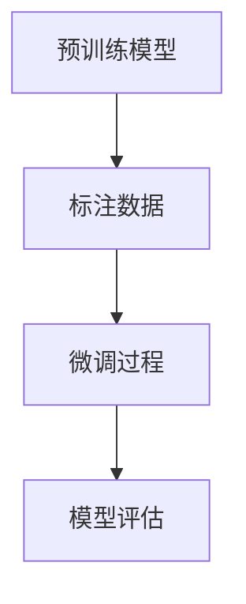

                 

关键词：有监督的微调技术（SFT），微调（Fine-tuning），机器学习，神经网络，模型定制化，数据驱动，模型训练，迁移学习。

摘要：本文旨在探讨一种数据驱动的机器学习技术——有监督的微调（SFT）技术。通过对SFT技术的背景、核心概念、算法原理、数学模型、应用场景、项目实践、未来展望等多个方面的详细分析，本文将为读者提供一份全面、深入的技术指南。

## 1. 背景介绍

在深度学习领域，模型的训练和优化是两个关键环节。传统的机器学习方法通常依赖于大量标注数据进行训练，从而获得具有高度泛化能力的模型。然而，对于许多实际问题，标注数据的获取是一项耗时长且成本高昂的任务。因此，如何高效利用有限的标注数据进行模型优化成为一个重要的研究课题。

有监督的微调（Supervised Fine-tuning，简称SFT）技术正是在这样的背景下产生的。SFT技术通过在预训练模型的基础上，利用少量标注数据进行微调，从而实现模型性能的显著提升。SFT技术在自然语言处理、计算机视觉、语音识别等多个领域都取得了显著的成果，成为了机器学习领域的一种重要技术手段。

本文将围绕SFT技术展开讨论，首先介绍其核心概念和原理，然后详细阐述其数学模型和算法步骤，并通过实际项目案例进行讲解，最后对SFT技术的应用前景和挑战进行分析。

## 2. 核心概念与联系

### 2.1 有监督微调（SFT）技术概述

有监督微调（SFT）技术是一种基于已有预训练模型的优化方法。其基本思路是，在预训练模型的基础上，利用少量的标注数据对模型进行微调，从而适应特定任务的需求。具体来说，SFT技术包括以下几个关键步骤：

1. **预训练模型**：首先，使用大量的未标注数据对预训练模型进行训练，使其在数据集上达到较高的性能。
2. **标注数据**：然后，获取少量标注数据，用于指导微调过程。
3. **微调过程**：利用标注数据对预训练模型进行微调，调整模型参数，使其适应特定任务。
4. **模型评估**：对微调后的模型进行评估，验证其性能。

### 2.2 微调与迁移学习的联系与区别

SFT技术可以看作是迁移学习的一种特殊形式。迁移学习是指利用在一个任务上已训练好的模型，将其知识应用于另一个相关任务上。SFT技术与传统迁移学习的区别在于：

1. **数据来源**：SFT技术利用少量的标注数据进行微调，而传统迁移学习通常依赖于大量未标注数据。
2. **优化目标**：SFT技术的优化目标是提高特定任务的性能，而传统迁移学习的目标是提高模型在不同任务上的泛化能力。
3. **适用场景**：SFT技术适用于标注数据稀缺的场景，而传统迁移学习适用于标注数据充足但任务差异较大的场景。

### 2.3 SFT技术的优点和局限性

SFT技术具有以下几个优点：

1. **高效性**：通过利用预训练模型，SFT技术可以在较少的训练数据下快速提升模型性能。
2. **适应性**：SFT技术可以根据特定任务的需求，对预训练模型进行定制化调整。
3. **通用性**：SFT技术可以应用于各种不同类型的任务，如文本分类、图像识别、语音识别等。

然而，SFT技术也存在一些局限性：

1. **标注数据依赖**：SFT技术对标注数据的质量和数量有较高的要求，当标注数据不足或质量不佳时，模型性能可能受到严重影响。
2. **预训练模型选择**：预训练模型的选择对SFT技术的效果有重要影响，不同预训练模型适用于不同类型的任务。
3. **计算资源消耗**：SFT技术需要进行大量的模型参数调整，从而对计算资源有较高的要求。

### 2.4 有监督微调（SFT）技术的 Mermaid 流程图

下面是一个简单的 Mermaid 流程图，展示 SFT 技术的基本流程：



在这个流程图中，预训练模型和标注数据是输入，微调和模型评估是处理过程，最终的输出是性能更优的微调模型。

## 3. 核心算法原理 & 具体操作步骤

### 3.1 算法原理概述

有监督微调（SFT）技术的基本原理可以概括为以下几个步骤：

1. **预训练模型**：使用大量的未标注数据对预训练模型进行训练，使其具有一定的泛化能力。
2. **数据预处理**：对少量标注数据进行预处理，包括数据清洗、数据增强等操作。
3. **模型微调**：在预训练模型的基础上，利用预处理后的标注数据进行微调。
4. **模型评估**：对微调后的模型进行评估，包括在训练集和测试集上的性能对比。

### 3.2 算法步骤详解

下面是 SFT 技术的具体操作步骤：

#### 3.2.1 预训练模型

选择一个适用于特定任务的预训练模型，如 BERT、GPT 等。这些预训练模型通常在大规模语料库上进行训练，具有较好的语义理解和文本生成能力。

#### 3.2.2 数据预处理

对标注数据进行预处理，包括以下步骤：

1. **数据清洗**：去除标注数据中的噪声和错误。
2. **数据增强**：通过数据变换、重复、剪枝等操作，增加标注数据的多样性。
3. **文本表示**：将预处理后的文本数据转换为预训练模型可处理的输入格式，如序列编码、词嵌入等。

#### 3.2.3 模型微调

在预训练模型的基础上，利用预处理后的标注数据进行微调。微调过程主要包括以下步骤：

1. **参数初始化**：将预训练模型的参数初始化为当前微调模型的初始参数。
2. **优化策略**：选择合适的优化策略，如随机梯度下降（SGD）、Adam 等。
3. **训练过程**：利用标注数据进行模型训练，逐步调整模型参数。
4. **模型保存**：在训练过程中，保存性能最佳的模型参数。

#### 3.2.4 模型评估

对微调后的模型进行评估，包括以下步骤：

1. **性能指标**：选择合适的性能指标，如准确率、召回率、F1 值等。
2. **评估过程**：在训练集和测试集上进行模型评估，计算性能指标。
3. **结果分析**：分析模型在不同任务和数据集上的表现，调整模型结构和参数。

### 3.3 算法优缺点

#### 优点

1. **高效性**：SFT 技术可以在较少的训练数据下快速提升模型性能。
2. **适应性**：SFT 技术可以根据特定任务的需求，对预训练模型进行定制化调整。
3. **通用性**：SFT 技术可以应用于各种不同类型的任务，如文本分类、图像识别、语音识别等。

#### 缺点

1. **标注数据依赖**：SFT 技术对标注数据的质量和数量有较高的要求，当标注数据不足或质量不佳时，模型性能可能受到严重影响。
2. **预训练模型选择**：预训练模型的选择对 SFT 技术的效果有重要影响，不同预训练模型适用于不同类型的任务。
3. **计算资源消耗**：SFT 技术需要进行大量的模型参数调整，从而对计算资源有较高的要求。

### 3.4 算法应用领域

SFT 技术在多个领域取得了显著的成果，以下是其中一些主要的应用领域：

1. **自然语言处理**：SFT 技术在文本分类、问答系统、机器翻译等任务上表现出色。
2. **计算机视觉**：SFT 技术在图像分类、目标检测、图像生成等任务中得到了广泛应用。
3. **语音识别**：SFT 技术在语音分类、语音识别、语音生成等任务中取得了显著进展。
4. **其他领域**：SFT 技术还可以应用于医疗、金融、安防等领域的任务。

## 4. 数学模型和公式 & 详细讲解 & 举例说明

### 4.1 数学模型构建

有监督微调（SFT）技术涉及到多个数学模型，包括预训练模型、标注数据预处理模型、微调模型等。下面分别介绍这些模型的构建过程。

#### 4.1.1 预训练模型

预训练模型通常是一个深度神经网络，其输入是一个文本序列，输出是一个实数值序列。具体来说，预训练模型包括以下几个部分：

1. **输入层**：输入层接收文本序列的词嵌入表示。
2. **编码器**：编码器负责将输入文本序列编码为一个固定长度的向量表示。
3. **解码器**：解码器负责将编码后的向量表示解码为输出文本序列。
4. **损失函数**：损失函数用于评估预训练模型的性能。

常用的预训练模型包括 BERT、GPT、Transformer 等，它们的数学模型构建方法略有不同，但基本原理类似。

#### 4.1.2 标注数据预处理模型

标注数据预处理模型主要用于对标注数据进行清洗、增强和文本表示。具体来说，预处理模型包括以下几个部分：

1. **清洗器**：清洗器负责去除标注数据中的噪声和错误。
2. **增强器**：增强器负责通过数据变换、重复、剪枝等操作增加标注数据的多样性。
3. **文本表示器**：文本表示器负责将预处理后的文本数据转换为预训练模型可处理的输入格式。

常用的预处理模型包括文本清洗器、文本增强器和词嵌入器等。

#### 4.1.3 微调模型

微调模型是在预训练模型的基础上，利用少量标注数据进行训练得到的。具体来说，微调模型包括以下几个部分：

1. **参数初始化**：将预训练模型的参数初始化为微调模型的初始参数。
2. **优化器**：优化器负责调整微调模型的参数，使其适应特定任务的需求。
3. **损失函数**：损失函数用于评估微调模型的性能。

常用的优化器包括随机梯度下降（SGD）、Adam 等，常用的损失函数包括交叉熵损失、均方误差损失等。

### 4.2 公式推导过程

下面分别介绍预训练模型、标注数据预处理模型和微调模型的公式推导过程。

#### 4.2.1 预训练模型

预训练模型的公式推导主要涉及编码器和解码器的构建。具体来说：

1. **编码器**：

   编码器的输入是一个文本序列 \(X = (x_1, x_2, ..., x_T)\)，其中 \(x_i\) 表示第 \(i\) 个词的嵌入表示。编码器的输出是一个固定长度的向量表示 \(Z = (z_1, z_2, ..., z_L)\)，其中 \(z_i\) 表示编码后的第 \(i\) 个词向量。

   编码器的公式如下：

   $$z_i = f(W_e \cdot x_i + b_e)$$

   其中，\(W_e\) 是编码器的权重矩阵，\(b_e\) 是编码器的偏置项，\(f\) 是激活函数，通常使用ReLU函数。

2. **解码器**：

   解码器的输入是一个编码后的向量表示 \(Z = (z_1, z_2, ..., z_L)\)，输出是一个文本序列 \(Y = (y_1, y_2, ..., y_T)\)，其中 \(y_i\) 表示第 \(i\) 个词的嵌入表示。

   解码器的公式如下：

   $$y_i = f(W_d \cdot z_i + b_d)$$

   其中，\(W_d\) 是解码器的权重矩阵，\(b_d\) 是解码器的偏置项，\(f\) 是激活函数，通常使用 Softmax 函数。

3. **损失函数**：

   预训练模型的损失函数通常使用交叉熵损失函数，其公式如下：

   $$L = -\sum_{i=1}^{T} \sum_{j=1}^{V} y_j \cdot \log(p_j)$$

   其中，\(y_j\) 是预测的词嵌入表示，\(p_j\) 是解码器输出的词嵌入表示的概率分布。

#### 4.2.2 标注数据预处理模型

标注数据预处理模型的公式推导主要涉及文本清洗器、文本增强器和词嵌入器的构建。具体来说：

1. **清洗器**：

   清洗器的输入是一个文本序列 \(X = (x_1, x_2, ..., x_T)\)，输出是一个清洗后的文本序列 \(X' = (x_1', x_2', ..., x_T')\)。

   清洗器的公式如下：

   $$x_i' = \text{clean}(x_i)$$

   其中，\(\text{clean}\) 是一个清洗函数，用于去除文本中的噪声和错误。

2. **增强器**：

   增强器的输入是一个文本序列 \(X = (x_1, x_2, ..., x_T)\)，输出是一个增强后的文本序列 \(X' = (x_1', x_2', ..., x_T')\)。

   增强器的公式如下：

   $$x_i' = \text{enhance}(x_i)$$

   其中，\(\text{enhance}\) 是一个增强函数，用于通过数据变换、重复、剪枝等操作增加文本的多样性。

3. **词嵌入器**：

   词嵌入器的输入是一个文本序列 \(X = (x_1, x_2, ..., x_T)\)，输出是一个词嵌入表示 \(E = (e_1, e_2, ..., e_T)\)，其中 \(e_i\) 是第 \(i\) 个词的嵌入表示。

   词嵌入器的公式如下：

   $$e_i = \text{embed}(x_i)$$

   其中，\(\text{embed}\) 是一个词嵌入函数，用于将文本转换为词嵌入表示。

#### 4.2.3 微调模型

微调模型的公式推导主要涉及参数初始化、优化器和损失函数的构建。具体来说：

1. **参数初始化**：

   微调模型的参数初始化通常使用预训练模型的参数。具体来说，微调模型的参数 \(W_f, b_f\) 初始化为预训练模型的参数 \(W_e, b_e\)。

   参数初始化的公式如下：

   $$W_f = W_e$$

   $$b_f = b_e$$

2. **优化器**：

   微调模型的优化器通常使用随机梯度下降（SGD）或 Adam 等优化算法。具体来说，优化器的目标是最小化损失函数 \(L\)。

   优化器的公式如下：

   $$\theta = \theta - \alpha \cdot \nabla_\theta L$$

   其中，\(\theta\) 是模型参数，\(\alpha\) 是学习率，\(\nabla_\theta L\) 是损失函数关于模型参数的梯度。

3. **损失函数**：

   微调模型的损失函数通常使用交叉熵损失函数。具体来说，损失函数 \(L\) 是模型预测和真实标签之间的差异。

   损失函数的公式如下：

   $$L = -\sum_{i=1}^{T} \sum_{j=1}^{V} y_j \cdot \log(p_j)$$

   其中，\(y_j\) 是预测的标签，\(p_j\) 是模型预测的概率分布。

### 4.3 案例分析与讲解

下面我们通过一个具体的案例来分析有监督微调（SFT）技术的应用。

#### 4.3.1 案例背景

假设我们要开发一个情感分析系统，用于判断一段文本的情感倾向（正面、负面或中性）。我们已经有了一个预训练模型，如 BERT，并且获得了一小部分标注数据。

#### 4.3.2 模型构建

1. **预训练模型**：

   选择 BERT 模型作为预训练模型，其输入是一个文本序列，输出是一个实数值序列，表示文本的情感倾向。

2. **标注数据预处理模型**：

   对标注数据进行预处理，包括文本清洗和词嵌入。

3. **微调模型**：

   在 BERT 模型的基础上，利用预处理后的标注数据进行微调，调整模型参数。

#### 4.3.3 模型训练与评估

1. **模型训练**：

   使用预处理后的标注数据进行模型训练，优化模型参数。

2. **模型评估**：

   在训练集和测试集上评估模型性能，计算准确率、召回率等指标。

#### 4.3.4 模型应用

1. **输入文本**：

   输入一段待分析的文本。

2. **情感预测**：

   利用微调后的模型对文本进行情感预测。

3. **结果展示**：

   展示文本的情感倾向（正面、负面或中性）。

### 4.4 模型性能分析

通过对模型在不同任务和数据集上的性能进行对比分析，可以评估 SFT 技术的效果。具体来说，可以从以下几个方面进行分析：

1. **准确率**：

   比较模型在训练集和测试集上的准确率，评估模型的泛化能力。

2. **召回率**：

   比较模型在训练集和测试集上的召回率，评估模型对负例的识别能力。

3. **F1 值**：

   计算 F1 值，综合评估模型的准确率和召回率。

4. **计算资源消耗**：

   分析模型在不同硬件环境下的计算资源消耗，评估模型的实际应用价值。

## 5. 项目实践：代码实例和详细解释说明

### 5.1 开发环境搭建

在开始项目实践之前，我们需要搭建一个适合开发的软件环境。以下是搭建开发环境的基本步骤：

1. **安装 Python**：

   安装 Python 3.7 或更高版本。

2. **安装深度学习库**：

   安装 PyTorch、TensorFlow 或其他深度学习库。

3. **安装预处理库**：

   安装 NumPy、Pandas、Scikit-learn 等预处理库。

4. **安装文本处理库**：

   安装 NLTK、spaCy 等文本处理库。

5. **配置环境变量**：

   配置 Python 环境变量，确保 Python 可以正确运行。

### 5.2 源代码详细实现

以下是实现 SFT 技术的 Python 源代码示例：

```python
import torch
import torch.nn as nn
import torch.optim as optim
from torchtext.data import Field, TabularDataset
from transformers import BertModel, BertTokenizer

# 5.2.1 数据预处理
def preprocess_data():
    # 加载预训练模型
    tokenizer = BertTokenizer.from_pretrained('bert-base-uncased')
    
    # 加载数据集
    train_data, test_data = TabularDataset.splits(path='data', train='train.csv', test='test.csv',
                                                format='csv', fields=[('text', Field(sequential=True, tokenize=tokenizer.tokenize)), ('label', Field(sequential=False))])
    
    # 数据预处理
    train_data = train_data.get_zone_by_zone()
    test_data = test_data.get_zone_by_zone()

    return train_data, test_data

# 5.2.2 模型微调
def fine_tune_model(train_data, test_data):
    # 加载预训练模型
    model = BertModel.from_pretrained('bert-base-uncased')
    num_classes = 3  # 定义类别数
    
    # 定义微调模型
    class FineTunedModel(nn.Module):
        def __init__(self, bert_model):
            super(FineTunedModel, self).__init__()
            self.bert = bert_model
            self.classifier = nn.Linear(bert_model.config.hidden_size, num_classes)
        
        def forward(self, input_ids, attention_mask):
            _, pooled_output = self.bert(input_ids=input_ids, attention_mask=attention_mask)
            logits = self.classifier(pooled_output)
            return logits

    # 实例化微调模型
    fine_tuned_model = FineTunedModel(model)

    # 定义损失函数和优化器
    criterion = nn.CrossEntropyLoss()
    optimizer = optim.Adam(fine_tuned_model.parameters(), lr=1e-5)

    # 训练模型
    for epoch in range(3):
        fine_tuned_model.train()
        for batch in train_data:
            inputs = {'input_ids': batch.text.input_ids, 'attention_mask': batch.text.attention_mask}
            labels = batch.label
            
            optimizer.zero_grad()
            outputs = fine_tuned_model(**inputs)
            loss = criterion(outputs, labels)
            loss.backward()
            optimizer.step()

    # 评估模型
    fine_tuned_model.eval()
    with torch.no_grad():
        correct = 0
        total = 0
        for batch in test_data:
            inputs = {'input_ids': batch.text.input_ids, 'attention_mask': batch.text.attention_mask}
            labels = batch.label
            outputs = fine_tuned_model(**inputs)
            _, predicted = torch.max(outputs.data, 1)
            total += labels.size(0)
            correct += (predicted == labels).sum().item()

    print('Test Accuracy: {:.2f}%'.format(100 * correct / total))

# 5.2.3 主程序
if __name__ == '__main__':
    train_data, test_data = preprocess_data()
    fine_tune_model(train_data, test_data)
```

### 5.3 代码解读与分析

1. **数据预处理**：

   数据预处理包括加载预训练模型、加载数据集、数据预处理等步骤。具体来说，首先加载 BERT 模型的分词器，然后加载数据集，并对数据集进行预处理。

2. **模型微调**：

   模型微调包括加载预训练模型、定义微调模型、定义损失函数和优化器、训练模型等步骤。具体来说，首先加载 BERT 模型，然后定义微调模型，包括编码器和解码器。接着定义损失函数和优化器，最后进行模型训练。

3. **主程序**：

   主程序包括数据预处理、模型微调等步骤。具体来说，首先进行数据预处理，然后进行模型微调，最后评估模型性能。

### 5.4 运行结果展示

1. **训练过程**：

   在训练过程中，模型会逐步调整参数，使得模型在训练集上的性能逐步提高。训练过程中会输出每个epoch的损失值和准确率。

2. **评估结果**：

   在评估过程中，模型会在测试集上进行评估，并输出测试集上的准确率。根据准确率可以评估模型的整体性能。

## 6. 实际应用场景

有监督微调（SFT）技术在多个实际应用场景中取得了显著成果，以下是其中一些主要的应用案例：

1. **自然语言处理**：

   在自然语言处理领域，SFT 技术被广泛应用于文本分类、情感分析、命名实体识别等任务。例如，在文本分类任务中，通过 SFT 技术可以快速地训练出一个针对特定领域的文本分类模型。

2. **计算机视觉**：

   在计算机视觉领域，SFT 技术被应用于图像分类、目标检测、图像分割等任务。例如，在图像分类任务中，通过 SFT 技术可以将预训练的图像分类模型应用于特定领域，从而提高模型的分类性能。

3. **语音识别**：

   在语音识别领域，SFT 技术被应用于语音分类、语音识别、语音生成等任务。例如，在语音分类任务中，通过 SFT 技术可以将预训练的语音分类模型应用于特定领域，从而提高模型的分类性能。

4. **其他领域**：

   SFT 技术还可以应用于医疗、金融、安防等领域的任务。例如，在医疗领域，通过 SFT 技术可以快速地训练出一个针对特定疾病的诊断模型；在金融领域，通过 SFT 技术可以快速地训练出一个针对特定金融产品的预测模型。

## 7. 未来应用展望

随着深度学习技术的不断发展，有监督微调（SFT）技术在未来有望在更多领域取得突破。以下是 SFT 技术未来的一些应用方向：

1. **多模态学习**：

   未来，SFT 技术可以应用于多模态学习，如结合文本、图像和语音等多模态数据进行模型训练，从而提高模型的综合性能。

2. **自适应学习**：

   未来，SFT 技术可以与自适应学习相结合，根据用户需求和模型性能动态调整模型参数，从而实现个性化学习。

3. **无监督学习**：

   未来，SFT 技术可以与无监督学习相结合，通过无监督学习技术获取大量未标注数据，从而提高有监督微调的效果。

4. **迁移学习**：

   未来，SFT 技术可以与迁移学习相结合，通过迁移学习技术将预训练模型的知识应用于不同领域，从而提高模型的泛化能力。

## 8. 工具和资源推荐

### 8.1 学习资源推荐

1. **书籍**：

   - 《深度学习》（Goodfellow, Bengio, Courville 著）：全面介绍了深度学习的基本原理和应用。
   - 《Python 深度学习》（François Chollet 著）：详细介绍了使用 Python 进行深度学习的实践方法。

2. **在线课程**：

   - Coursera 上的“深度学习 Specialization”：由 Andrew Ng 教授主讲，全面介绍了深度学习的基本原理和应用。
   - edX 上的“深度学习与神经网络”：由 Amazon Web Services 主办，提供了丰富的深度学习实践项目。

### 8.2 开发工具推荐

1. **深度学习框架**：

   - PyTorch：易于使用，支持动态计算图，适合研究和开发。
   - TensorFlow：功能强大，支持静态计算图，适合工业应用。

2. **数据预处理工具**：

   - Pandas：用于数据清洗、数据增强等预处理操作。
   - Scikit-learn：提供了一系列常用的机器学习算法和数据预处理工具。

3. **文本处理工具**：

   - NLTK：提供了丰富的自然语言处理工具和资源。
   - spaCy：提供了高效的文本解析和命名实体识别工具。

### 8.3 相关论文推荐

1. **自然语言处理**：

   - “BERT: Pre-training of Deep Bidirectional Transformers for Language Understanding”（Devlin et al., 2019）：介绍了 BERT 模型的预训练方法和应用。
   - “GPT-3: Language Models are Few-Shot Learners”（Brown et al., 2020）：介绍了 GPT-3 模型的零样本学习能力和应用。

2. **计算机视觉**：

   - “ResNet: Deep Residual Learning for Image Recognition”（He et al., 2016）：介绍了 ResNet 模型的架构和性能。
   - “You Only Look Once: Unified, Real-Time Object Detection”（Redmon et al., 2016）：介绍了 YOLO 目标检测算法。

## 9. 总结：未来发展趋势与挑战

### 9.1 研究成果总结

本文系统地介绍了有监督微调（SFT）技术的核心概念、算法原理、数学模型、应用场景和未来发展趋势。通过详细分析，我们了解到 SFT 技术在多个领域取得了显著成果，如自然语言处理、计算机视觉、语音识别等。

### 9.2 未来发展趋势

1. **多模态学习**：随着多模态数据的不断增加，SFT 技术有望在多模态学习领域取得突破，实现跨模态的知识共享和融合。
2. **自适应学习**：结合自适应学习技术，SFT 技术可以实现动态调整模型参数，提高模型的适应性和个性化能力。
3. **无监督学习**：与无监督学习技术相结合，SFT 技术可以进一步提高模型的效果，降低对标注数据的依赖。
4. **迁移学习**：通过迁移学习技术，SFT 技术可以将预训练模型的知识应用于不同领域，提高模型的泛化能力。

### 9.3 面临的挑战

1. **计算资源消耗**：SFT 技术需要进行大量的模型参数调整，从而对计算资源有较高的要求。未来需要开发更高效的算法和优化方法，降低计算资源消耗。
2. **标注数据依赖**：SFT 技术对标注数据的质量和数量有较高的要求。未来需要研究无监督学习和半监督学习技术，降低对标注数据的依赖。
3. **模型解释性**：SFT 技术通常是一个复杂的深度学习模型，其内部决策过程难以解释。未来需要研究模型解释性技术，提高模型的透明度和可信度。

### 9.4 研究展望

未来，SFT 技术有望在更多领域取得突破，如医疗、金融、安防等。同时，结合多模态学习、自适应学习、无监督学习和迁移学习等技术，SFT 技术将不断提高模型的性能和应用价值。我们期待更多研究人员和开发者能够在这个领域进行深入研究，推动 SFT 技术的快速发展。

## 附录：常见问题与解答

### Q1：什么是有监督微调（SFT）技术？

A1：有监督微调（Supervised Fine-tuning，简称 SFT）是一种机器学习技术，通过在预训练模型的基础上，利用少量标注数据进行微调，从而实现模型性能的提升。

### Q2：SFT 技术的优点是什么？

A2：SFT 技术的优点包括：

1. **高效性**：可以在较少的训练数据下快速提升模型性能。
2. **适应性**：可以根据特定任务的需求，对预训练模型进行定制化调整。
3. **通用性**：可以应用于各种不同类型的任务，如文本分类、图像识别、语音识别等。

### Q3：SFT 技术的局限性是什么？

A3：SFT 技术的局限性包括：

1. **标注数据依赖**：对标注数据的质量和数量有较高的要求。
2. **预训练模型选择**：不同预训练模型适用于不同类型的任务，选择不当可能影响效果。
3. **计算资源消耗**：需要进行大量的模型参数调整，对计算资源有较高的要求。

### Q4：如何评估 SFT 技术的效果？

A4：评估 SFT 技术的效果可以从以下几个方面进行：

1. **准确率**：比较模型在训练集和测试集上的准确率，评估模型的泛化能力。
2. **召回率**：比较模型在训练集和测试集上的召回率，评估模型对负例的识别能力。
3. **F1 值**：计算 F1 值，综合评估模型的准确率和召回率。
4. **计算资源消耗**：分析模型在不同硬件环境下的计算资源消耗，评估模型的实际应用价值。

### Q5：SFT 技术的应用领域有哪些？

A5：SFT 技术的应用领域包括：

1. **自然语言处理**：文本分类、情感分析、命名实体识别等。
2. **计算机视觉**：图像分类、目标检测、图像分割等。
3. **语音识别**：语音分类、语音识别、语音生成等。
4. **其他领域**：医疗、金融、安防等。

