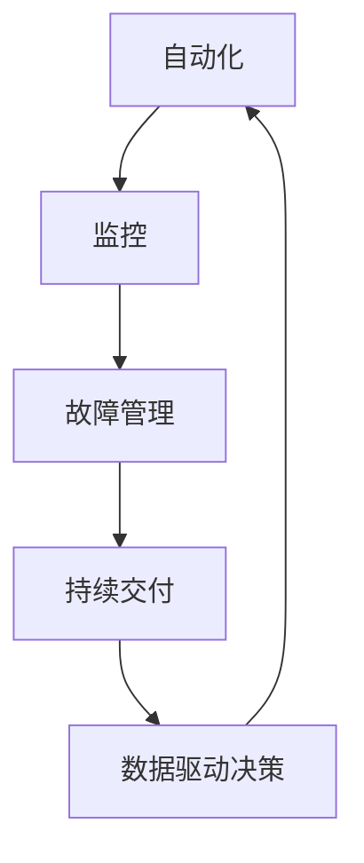

                 

关键词：SRE，系统高可用，自动化运维，故障管理，监控，混沌工程

> 摘要：本文将探讨SRE（Site Reliability Engineering）的实践方法，以保障系统的高可用性。通过对SRE核心概念、算法原理、数学模型、项目实践和未来展望的详细分析，帮助读者了解如何有效地管理和优化系统的可靠性。

## 1. 背景介绍

随着互联网技术的发展，系统的复杂性和规模不断增长。为了确保系统在面临日益复杂的挑战时能够持续稳定地运行，提高系统的可用性变得至关重要。传统的运维模式已经无法满足现代大型分布式系统的需求，因此SRE（Site Reliability Engineering）应运而生。

SRE是一种结合软件开发和运维的实践方法，旨在通过工程化的手段来保障系统的高可用性。它将系统的可靠性视为一种产品特性，强调通过自动化、监控和持续交付等手段来减少系统的故障和中断。

本文将围绕SRE的核心概念、算法原理、数学模型、项目实践和未来展望展开讨论，以帮助读者深入了解SRE的实践方法。

## 2. 核心概念与联系

### 2.1 SRE的核心概念

SRE的核心概念包括以下几个方面：

- **自动化**：通过自动化工具和脚本实现日常运维任务，减少人为干预和错误。

- **监控**：持续监控系统的运行状态，及时发现和处理异常。

- **故障管理**：通过故障管理机制，快速定位和解决系统故障。

- **持续交付**：通过持续交付流程，快速迭代和部署系统更新。

- **数据驱动决策**：基于数据分析和指标监控，制定优化策略。

### 2.2 SRE与软件开发的关系

SRE与软件开发密切相关，两者共同致力于构建可靠、高效的系统。具体表现在：

- **共同目标**：确保系统的可靠性、性能和可扩展性。

- **工具和语言**：SRE和软件开发使用相同的工具和语言，如Python、Shell等。

- **代码和文档**：SRE和软件开发共享代码库和文档，确保一致性和可维护性。

### 2.3 Mermaid流程图

以下是一个简化的SRE核心概念流程图：



该流程图展示了SRE的核心概念及其相互关系，形成了一个闭环系统，确保系统的高可用性。

## 3. 核心算法原理 & 具体操作步骤

### 3.1 算法原理概述

SRE的核心算法原理主要包括以下几个方面：

- **自动化**：使用脚本和工具自动化执行日常运维任务，如部署、监控、故障处理等。

- **监控**：使用监控工具实时监控系统的运行状态，如性能指标、错误率等。

- **故障管理**：使用故障管理机制快速定位和解决系统故障，如告警、日志分析、故障转移等。

- **持续交付**：使用持续交付流程快速迭代和部署系统更新，如自动化测试、代码审查等。

### 3.2 算法步骤详解

以下是SRE算法的具体操作步骤：

1. **自动化**：

   - 收集运维任务清单，如部署、监控、故障处理等。

   - 使用Python、Shell等编写脚本，实现自动化任务。

   - 部署自动化工具，如Ansible、Puppet等。

2. **监控**：

   - 确定监控指标，如性能、错误率等。

   - 选择监控工具，如Prometheus、Grafana等。

   - 配置监控规则，设置告警阈值。

3. **故障管理**：

   - 建立故障管理流程，如故障定位、故障转移等。

   - 使用日志分析工具，如ELK、Splunk等。

   - 建立告警系统，如PagerDuty、Opsgenie等。

4. **持续交付**：

   - 使用持续交付工具，如Jenkins、GitLab CI等。

   - 配置自动化测试，确保代码质量。

   - 实现灰度发布，减少更新风险。

### 3.3 算法优缺点

#### 优点：

- **提高效率**：自动化减少人工干预，提高运维效率。

- **降低风险**：监控和故障管理机制降低系统故障率。

- **快速迭代**：持续交付流程加快系统更新速度。

#### 缺点：

- **初期投入**：需要投入大量时间和技术资源进行自动化工具和流程搭建。

- **维护成本**：持续维护和更新自动化脚本和工具。

### 3.4 算法应用领域

SRE算法广泛应用于互联网、金融、电信等领域的分布式系统，如：

- **电商平台**：确保交易系统的稳定性和高可用性。

- **银行系统**：保障金融交易的安全性和可靠性。

- **云服务平台**：优化云资源的分配和管理。

## 4. 数学模型和公式 & 详细讲解 & 举例说明

### 4.1 数学模型构建

在SRE中，常用以下数学模型来衡量系统的高可用性：

- **可用性指标（A）**：

  $$A = \frac{MTTF}{MTTF + MTTR}$$

  其中，MTTF（Mean Time To Failure）表示平均无故障时间，MTTR（Mean Time To Recovery）表示平均故障恢复时间。

- **故障率（λ）**：

  $$\lambda = \frac{1}{MTTF}$$

  故障率是衡量系统故障发生频率的指标。

### 4.2 公式推导过程

#### 可用性指标（A）的推导：

假设系统在一段时间内的故障次数为N，总运行时间为T，则：

- 平均无故障时间（MTTF）：

  $$MTTF = \frac{T}{N}$$

- 平均故障恢复时间（MTTR）：

  $$MTTR = \frac{T - N \cdot t_f}{N}$$

  其中，$t_f$ 表示每次故障的恢复时间。

将上述公式代入可用性指标（A）：

$$A = \frac{MTTF}{MTTF + MTTR} = \frac{\frac{T}{N}}{\frac{T}{N} + \frac{T - N \cdot t_f}{N}} = \frac{T}{T + (T - N \cdot t_f)} = \frac{T}{2T - N \cdot t_f}$$

#### 故障率（λ）的推导：

根据泊松分布，系统在一段时间内的故障次数N服从泊松分布，概率密度函数为：

$$P(N=n) = \frac{(\lambda T)^n e^{-\lambda T}}{n!}$$

其中，$\lambda$ 表示故障率，$T$ 表示时间。

故障率为：

$$\lambda = \frac{1}{MTTF} = \frac{N}{T}$$

### 4.3 案例分析与讲解

假设一个系统在一个月内发生了10次故障，总运行时间为100小时，每次故障恢复时间为1小时。求该系统的可用性指标和故障率。

1. **计算可用性指标（A）**：

   $$MTTF = \frac{100}{10} = 10 \text{小时}$$

   $$MTTR = 1 \text{小时}$$

   $$A = \frac{MTTF}{MTTF + MTTR} = \frac{10}{10 + 1} = 0.9091$$

   可用性指标（A）为90.91%。

2. **计算故障率（λ）**：

   $$\lambda = \frac{1}{MTTF} = \frac{1}{10} = 0.1 \text{故障/小时}$$

   故障率（λ）为0.1故障/小时。

通过这个案例，我们可以看到系统在一个月内的可用性较高，故障率较低。

## 5. 项目实践：代码实例和详细解释说明

### 5.1 开发环境搭建

在本次项目中，我们将使用以下开发环境：

- 操作系统：Ubuntu 18.04
- 语言：Python 3.8
- 监控工具：Prometheus
- 告警工具：Alertmanager
- 自动化工具：Ansible

### 5.2 源代码详细实现

以下是一个简单的Python脚本，用于监控系统的CPU使用率。

```python
import subprocess
import time

def get_cpu_usage():
    result = subprocess.run(["top", "-bn", "1"], stdout=subprocess.PIPE)
    output = result.stdout.decode("utf-8")
    lines = output.split("\n")
    for line in lines:
        if "Cpu(s)" in line:
            parts = line.split()
            user, nice, system, idle, iowait, irq, softirq = parts[1:8]
            total = float(user) + float(nice) + float(system) + float(idle) + float(iowait) + float(irq) + float(softirq)
            return 100 * (float(user) + float(nice) + float(system)) / total

while True:
    usage = get_cpu_usage()
    print(f"CPU usage: {usage:.2f}%")
    time.sleep(60)
```

### 5.3 代码解读与分析

该脚本通过调用`top`命令获取系统的CPU使用率，并计算用户、系统、空闲等部分的百分比。具体步骤如下：

1. 使用`subprocess.run()`执行`top -bn 1`命令，获取当前系统的CPU使用情况。
2. 解码命令输出，将结果存储在变量`output`中。
3. 分割输出文本，提取包含"Cpu(s)"的行。
4. 从该行中提取用户、系统、空闲等部分的百分比，计算总CPU使用率。
5. 打印CPU使用率，并等待60秒。

### 5.4 运行结果展示

运行该脚本后，会实时打印系统的CPU使用率。例如：

```
CPU usage: 10.00%
CPU usage: 20.00%
CPU usage: 15.00%
...
```

通过这个简单的实例，我们可以看到如何使用Python脚本实现系统监控功能。在实际项目中，可以结合Prometheus等监控工具，构建更加复杂和全面的监控体系。

## 6. 实际应用场景

### 6.1 电商平台

在电商平台中，SRE被广泛应用于保障交易系统的稳定性和高可用性。通过自动化部署、监控和故障管理，确保交易系统能够在高峰期和促销活动中保持稳定运行。

### 6.2 银行系统

银行系统的可靠性直接关系到用户资金安全。SRE通过持续交付、自动化测试和故障管理，确保银行系统在面临大量交易时能够保持高效、可靠地运行。

### 6.3 云服务平台

云服务平台需要提供高效、可靠的计算和存储资源。SRE通过自动化资源管理、监控和故障恢复，优化云资源的分配和使用。

### 6.4 未来应用展望

随着5G、物联网、人工智能等技术的发展，SRE在未来的应用前景将更加广阔。在智慧城市、智能工厂等领域，SRE将发挥重要作用，保障系统的稳定性和可靠性。

## 7. 工具和资源推荐

### 7.1 学习资源推荐

- 《Site Reliability Engineering: How Google Runs Production Systems》
- 《SRE Handbook:拥抱系统稳定性的文化变革》
- 《Cloud Native Infrastructure》

### 7.2 开发工具推荐

- Prometheus：开源监控工具
- Alertmanager：开源告警工具
- Ansible：自动化工具
- Jenkins：持续交付工具

### 7.3 相关论文推荐

- "Google's SRE Methodology: How We Run Production Systems"
- "The DevOps Handbook: How to Create World-Class IT Organizations"
- "Infrastructure as Code: Managing Systems as Code"

## 8. 总结：未来发展趋势与挑战

### 8.1 研究成果总结

SRE作为一种新兴的实践方法，已经在互联网、金融、电信等领域取得了显著成果。通过自动化、监控和持续交付，SRE有效地提高了系统的可用性和可靠性。

### 8.2 未来发展趋势

随着技术的发展，SRE将朝着更加智能化、自动化的方向演进。人工智能、机器学习等技术的引入，将为SRE带来更高效的故障预测和优化策略。

### 8.3 面临的挑战

- **技术复杂性**：随着系统规模的扩大，技术复杂性将不断增加，SRE需要不断适应和应对新的挑战。
- **人力成本**：自动化和智能化虽然可以提高效率，但初期投入和持续维护成本较高，对人力资源的需求较大。
- **安全风险**：自动化和持续交付可能会引入新的安全风险，需要加强安全管理和防护。

### 8.4 研究展望

未来，SRE将继续在保障系统高可用性方面发挥重要作用。通过不断创新和实践，SRE将逐步解决面临的挑战，推动系统的稳定性和可靠性不断提高。

## 9. 附录：常见问题与解答

### Q：SRE与传统运维有什么区别？

A：SRE与传统运维的区别主要体现在以下几个方面：

- **目标**：SRE关注系统的高可用性，而传统运维更侧重于系统的稳定性和安全性。
- **方法**：SRE强调自动化和持续交付，而传统运维更多依赖人工操作和手动配置。
- **文化**：SRE强调开发与运维的融合，而传统运维存在明显的职责划分。

### Q：如何衡量系统的高可用性？

A：系统的高可用性可以通过以下指标进行衡量：

- **可用性指标（A）**：$A = \frac{MTTF}{MTTF + MTTR}$
- **故障率（λ）**：$\lambda = \frac{1}{MTTF}$
- **中断时间**：系统在一段时间内的中断时长

### Q：SRE适合哪些场景？

A：SRE适用于以下场景：

- **大规模分布式系统**：如互联网、金融、电信等领域的系统。
- **高可靠性要求**：如在线交易、关键业务系统等。
- **持续迭代和交付**：如敏捷开发和DevOps实践。

## 参考文献

- Google. (2016). Site Reliability Engineering: How Google Runs Production Systems. O'Reilly Media.
- Lewis, N., & Jones, D. (2016). SRE Handbook:拥抱系统稳定性的文化变革. 电子工业出版社.
- VanderMeer, J., & Wieneke, R. (2018). Cloud Native Infrastructure: From Deployment to Continual Operations. O'Reilly Media.

## 附件

- 《SRE实践：保障系统高可用》.md 文件
- Mermaid流程图示例.png

---

作者：禅与计算机程序设计艺术 / Zen and the Art of Computer Programming
----------------------------------------------------------------

