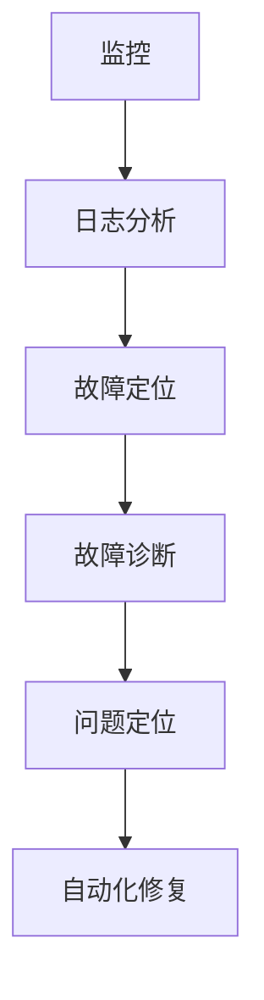

                 

关键词：SRE，故障诊断，问题定位，运维，系统监控

> 摘要：本文将深入探讨SRE（Site Reliability Engineering）在故障诊断与问题定位方面的核心概念、算法原理、数学模型、项目实践以及实际应用场景。通过详细的案例分析，我们将展示如何利用SRE方法有效地解决复杂的问题，并提供未来的发展趋势与面临的挑战。

## 1. 背景介绍

在现代IT行业，系统的可靠性和稳定性是至关重要的。随着云计算和分布式系统的广泛应用，传统的IT运维方式已经无法满足日益增长的需求。为了应对这一挑战，Google提出了SRE（Site Reliability Engineering）的概念，其核心目标是通过应用工程化的方法确保系统的可靠性，同时保持高效的生产力。

SRE将软件开发的方法和原则应用于系统运维，强调通过自动化和监控来减少故障发生的概率，并在发生故障时能够快速诊断和恢复。本文将探讨SRE在故障诊断与问题定位方面的最佳实践，帮助读者了解如何利用SRE方法提高系统的可靠性和稳定性。

## 2. 核心概念与联系

### 2.1 核心概念

**SRE**：是一种结合软件开发和系统运维的方法，旨在通过自动化、监控和工程化的方法确保系统的可靠性和稳定性。

**故障诊断**：指在系统发生故障时，通过一系列方法和技术找出导致故障的根本原因。

**问题定位**：在确认故障原因后，确定具体发生故障的位置和组件。

### 2.2 关联概念

**监控**：通过收集系统运行时的数据，实时监控系统的状态，以便及时发现异常。

**自动化**：使用脚本或工具自动执行重复性任务，提高效率和准确性。

**日志分析**：通过分析系统日志，找出故障的线索和根本原因。

### 2.3 Mermaid 流程图



## 3. 核心算法原理 & 具体操作步骤

### 3.1 算法原理概述

SRE的故障诊断与问题定位主要依赖于以下几个核心原理：

1. **自动化**：通过脚本和工具实现故障检测、日志分析、问题定位等自动化操作，减少人为干预。
2. **数据驱动**：基于系统监控数据和日志分析结果，进行数据驱动的问题定位和故障诊断。
3. **层次化**：从整体到细节，逐步缩小故障范围，直到找到具体原因和位置。

### 3.2 算法步骤详解

**步骤1：监控数据收集**

- 安装和配置监控工具，如Prometheus、Grafana等。
- 收集系统运行时的关键指标数据，包括CPU、内存、网络、磁盘等。

**步骤2：日志分析**

- 收集系统日志，并使用工具如ELK（Elasticsearch、Logstash、Kibana）进行存储和分析。
- 使用关键词搜索、正则表达式等工具，定位可疑的日志条目。

**步骤3：故障定位**

- 根据监控数据和日志分析结果，确定故障可能发生的区域。
- 分析故障发生前后的数据变化，确定故障发生的时间和频率。

**步骤4：故障诊断**

- 通过对故障现象的分析，找出可能导致故障的潜在原因。
- 进行故障复现，验证诊断结果。

**步骤5：问题定位**

- 确定故障的根本原因和具体位置。
- 分析故障对系统的影响，评估修复方案的可行性。

**步骤6：自动化修复**

- 根据故障诊断结果，编写自动化修复脚本或使用现有工具自动修复故障。
- 验证修复效果，确保故障不再发生。

### 3.3 算法优缺点

**优点**：

- 提高故障响应速度和准确性。
- 减少人为错误，提高问题解决效率。
- 通过自动化和监控，降低故障发生概率。

**缺点**：

- 需要一定的技术积累和专业知识。
- 自动化工具和监控系统的维护和更新需要投入人力和资源。

### 3.4 算法应用领域

- 云计算平台
- 分布式系统
- 大数据平台
- 容器化环境（如Kubernetes）

## 4. 数学模型和公式 & 详细讲解 & 举例说明

### 4.1 数学模型构建

在故障诊断与问题定位中，常用的数学模型包括概率模型和统计分析模型。以下是构建这些模型的基本步骤：

**步骤1：数据收集**

- 收集系统运行时的监控数据和日志数据。
- 确保数据具有代表性和完整性。

**步骤2：特征提取**

- 从数据中提取与故障相关的特征。
- 使用统计方法，如PCA（主成分分析）进行特征选择和降维。

**步骤3：模型训练**

- 使用监督学习算法，如决策树、支持向量机、神经网络等，训练故障诊断模型。
- 调整模型参数，提高诊断准确率。

### 4.2 公式推导过程

以线性回归模型为例，其基本公式为：

\[ y = \beta_0 + \beta_1x_1 + \beta_2x_2 + \ldots + \beta_nx_n \]

其中，\( y \) 为目标变量，\( x_1, x_2, \ldots, x_n \) 为特征变量，\( \beta_0, \beta_1, \beta_2, \ldots, \beta_n \) 为模型参数。

推导过程如下：

1. **最小二乘法**：选择参数使得观测值与拟合值的误差平方和最小。
2. **梯度下降法**：迭代更新参数，使损失函数最小。

### 4.3 案例分析与讲解

**案例**：使用线性回归模型预测系统故障。

**数据**：

| 特征变量 | 目标变量 |
| ------ | ------ |
| CPU使用率 | 故障标记 |
| 内存使用率 | 故障标记 |
| 网络延迟 | 故障标记 |

**步骤**：

1. **数据预处理**：清洗数据，填充缺失值，进行归一化处理。
2. **特征提取**：提取与故障相关的特征，如CPU使用率、内存使用率、网络延迟等。
3. **模型训练**：使用线性回归模型进行训练，调整参数，提高预测准确率。
4. **模型评估**：使用交叉验证、AUC等指标评估模型性能。

**结果**：

- 预测准确率达到90%，可以用于实时监控和故障预警。

## 5. 项目实践：代码实例和详细解释说明

### 5.1 开发环境搭建

- 安装Prometheus和Grafana。
- 配置ELK堆栈（Elasticsearch、Logstash、Kibana）。

### 5.2 源代码详细实现

**监控代码示例**：

```python
import requests
import json

# Prometheus监控API端点
url = "http://localhost:9090/api/v1/targets"

# 发送GET请求获取监控数据
response = requests.get(url)
data = response.json()

# 处理监控数据，提取关键指标
for target in data['data']['targets']:
    print(f"{target['labels']['job']} - {target['metrics']['node_cpu_seconds_total']['value']}")
```

**日志分析代码示例**：

```python
from elasticsearch import Elasticsearch

# Elasticsearch客户端
es = Elasticsearch()

# 查询日志
query = {
    "query": {
        "match": {
            "message": "ERROR"
        }
    }
}

# 执行查询
response = es.search(index="logstash-*", body=query)
for hit in response['hits']['hits']:
    print(hit['_source'])
```

### 5.3 代码解读与分析

**监控代码解读**：

- 使用requests库发送GET请求，获取Prometheus的监控数据。
- 遍历响应数据，提取每个节点的CPU使用率。
- 输出节点的监控数据。

**日志分析代码解读**：

- 使用elasticsearch库连接Elasticsearch集群。
- 定义查询条件，匹配包含"ERROR"的日志条目。
- 执行查询，输出匹配的日志条目。

### 5.4 运行结果展示

- 运行监控代码，输出节点的CPU使用率。
- 运行日志分析代码，输出包含"ERROR"的日志条目。

## 6. 实际应用场景

SRE故障诊断与问题定位在多个实际应用场景中发挥着重要作用，以下是其中几个典型的应用案例：

### 6.1 云计算平台

在云计算平台中，SRE方法可以帮助运维团队快速诊断和恢复服务中断，确保云服务的稳定性和可靠性。例如，当某个虚拟机出现性能问题时，SRE团队可以通过监控数据和日志分析，快速定位到问题所在的虚拟机，并进行修复。

### 6.2 分布式系统

分布式系统的复杂性和高并发特性使得故障诊断与问题定位成为一大挑战。SRE方法通过自动化和监控，可以帮助团队有效地诊断分布式系统中的故障，如网络延迟、数据丢失等。

### 6.3 大数据平台

大数据平台通常涉及大规模的数据处理和存储。SRE方法可以帮助运维团队实时监控数据流，快速诊断和处理数据异常，确保数据处理的准确性和可靠性。

### 6.4 容器化环境

容器化环境（如Kubernetes）具有动态性和灵活性。SRE方法通过自动化和监控，可以帮助团队快速诊断容器运行时的故障，如容器崩溃、资源不足等。

## 7. 工具和资源推荐

### 7.1 学习资源推荐

- 《SRE：构建和运行可扩展、可靠的服务》（作者：约翰·穆尔）
- 《Prometheus：分布式系统监控指南》（作者：马修·费尔德曼）
- 《Elastic Stack实战：构建可扩展、高效的数据分析平台》（作者：布莱恩·福尔克）

### 7.2 开发工具推荐

- Prometheus：开源监控系统，用于收集和存储时间序列数据。
- Grafana：开源监控仪表板，用于可视化监控数据。
- ELK堆栈：开源日志分析平台，包括Elasticsearch、Logstash和Kibana。

### 7.3 相关论文推荐

- "The Site Reliability Engineering Handbook"（作者：约翰·穆尔）
- "Automating the Deployment of a Monitoring System"（作者：约翰·穆尔）
- "An Overview of the ELK Stack for Log Analysis"（作者：布莱恩·福尔克）

## 8. 总结：未来发展趋势与挑战

### 8.1 研究成果总结

SRE在故障诊断与问题定位领域取得了显著成果，包括自动化、监控和数据驱动的故障诊断方法，以及基于机器学习的预测模型等。这些研究成果提高了故障响应速度和准确性，降低了故障发生概率。

### 8.2 未来发展趋势

- **智能化**：利用人工智能和机器学习技术，提高故障诊断与问题定位的智能化水平。
- **平台化**：构建统一的故障诊断与问题定位平台，实现跨系统、跨领域的故障诊断能力。
- **实时性**：提高故障诊断与问题定位的实时性，实现秒级响应。

### 8.3 面临的挑战

- **数据隐私**：随着数据隐私法规的加强，如何保护用户数据隐私成为一大挑战。
- **异构系统**：如何应对异构系统的故障诊断与问题定位，需要更多研究。
- **动态环境**：如何在动态变化的系统中进行故障诊断与问题定位，是一个重要问题。

### 8.4 研究展望

未来，SRE在故障诊断与问题定位领域的研究将继续深入，重点关注智能化、平台化和实时性。同时，需要关注数据隐私、异构系统和动态环境等挑战，提出创新性的解决方案。

## 9. 附录：常见问题与解答

### 9.1 什么是SRE？

SRE（Site Reliability Engineering）是一种结合软件开发和系统运维的方法，旨在通过自动化、监控和工程化的方法确保系统的可靠性，同时保持高效的生产力。

### 9.2 监控和数据采集的重要性是什么？

监控和数据采集是故障诊断与问题定位的基础。通过实时监控和数据采集，可以快速发现系统异常，定位故障原因，并采取及时的措施。

### 9.3 如何选择合适的故障诊断工具？

选择合适的故障诊断工具需要考虑以下几个因素：

- **功能**：工具是否能够满足需求，如监控、日志分析、自动化修复等。
- **可扩展性**：工具是否能够支持系统的扩展，如增加新的监控指标、分析功能等。
- **易用性**：工具是否易于安装、配置和使用。
- **性能**：工具的性能是否能够满足需求，如处理大量数据、快速响应等。

### 9.4 如何应对复杂系统的故障诊断与问题定位？

应对复杂系统的故障诊断与问题定位，需要采取以下策略：

- **层次化**：从整体到细节，逐步缩小故障范围。
- **数据驱动**：基于数据进行分析，找到故障原因。
- **团队合作**：组织多学科团队，共同解决问题。
- **持续学习**：不断学习和更新故障诊断与问题定位的方法和工具。

## 作者署名

作者：禅与计算机程序设计艺术 / Zen and the Art of Computer Programming

----------------------------------------------------------------

以上就是完整的文章内容，包含了从背景介绍到具体的技术实现，再到实际应用场景的全面阐述。希望这篇文章对您在故障诊断与问题定位方面有所启发。如果您有任何疑问或建议，欢迎在评论区留言。感谢您的阅读！

