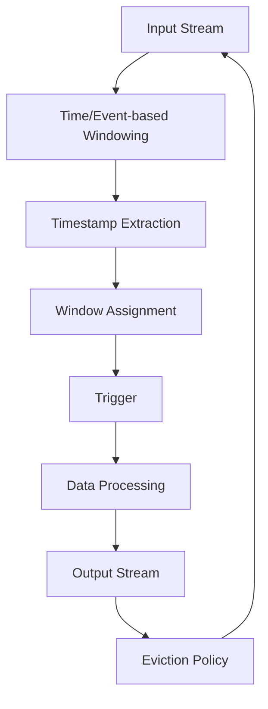

                 

关键词：Samza，Window，流处理，大数据，实时计算，数据处理，代码实例

> 摘要：本文将深入探讨Samza Window的核心原理，并通过实际代码实例展示其具体应用，帮助读者理解如何利用Samza进行高效的实时数据处理。

## 1. 背景介绍

在当今的大数据时代，实时数据处理已成为许多企业成功的关键因素。Apache Samza是一个开源的分布式流处理框架，它允许用户在复杂的分布式环境中构建实时处理应用程序。Samza的核心特点是其对窗口操作的强大支持，这使得它能够处理具有时间依赖性的事件流，从而实现精确的数据处理。

窗口操作在流处理中扮演着重要角色，它允许用户按照特定的时间范围或数据量对数据进行分组和处理。窗口可以定义为一个时间区间，例如每分钟、每小时或每10秒，也可以根据数据量来定义，例如每1000个事件。通过窗口操作，可以实现对流数据的批量处理，从而提高系统性能和效率。

本文将围绕Samza Window展开，详细介绍其原理和实现方法，并通过实际代码实例展示如何利用Samza进行实时数据处理。接下来，我们将首先介绍Samza的基本概念和架构，为后续内容奠定基础。

### 1.1 Samza的基本概念

Samza是一种用于构建大规模分布式流处理应用程序的框架。它由以下几个关键组件组成：

- **Job Manager**：负责调度和管理Samza作业的生命周期，包括启动、停止、恢复等操作。
- **Coordinator**：负责协调窗口计算，确保事件能够正确地分配到不同的窗口中。
- **Container**：执行具体数据处理逻辑的进程，是Samza作业的运行实例。
- **Producer**：负责将事件推送到Samza作业中。
- **Consumer**：从Samza作业中获取处理结果。

通过这些组件的协同工作，Samza能够实现高效、可靠的流处理。

### 1.2 Samza的架构

Samza的架构设计旨在提供可扩展性和容错能力。其核心思想是将数据处理逻辑分解为多个独立的容器，这些容器可以在不同的计算节点上运行，从而实现横向扩展。具体来说，Samza的架构包括以下几个关键部分：

- **Input Streams**：输入流包含来自外部系统的数据，可以由多个生产者写入。
- **Output Streams**：输出流是处理结果流，可以用于触发后续的作业或写入外部存储系统。
- **Stream Processor**：流处理器负责处理输入流中的数据，并生成输出流。

Samza作业通过定义多个stream processor模块来实现复杂的处理逻辑，这些模块可以独立运行，并通过stream进行数据交换。

## 2. 核心概念与联系

为了深入理解Samza Window的原理，我们需要先了解以下几个核心概念：

- **Window**：窗口是Samza中用于数据分组的时间或事件范围。窗口可以按照固定时间间隔（如每分钟或每小时）或根据事件数量（如每1000个事件）来定义。
- **Timestamp**：时间戳是事件发生的时间标记，它用于确定事件所属的窗口。
- **Trigger**：触发器是窗口关闭的条件，它决定了何时开始处理窗口中的数据。常见的触发器包括时间触发器和数据量触发器。
- **Eviction**：驱逐策略是用于管理窗口内存使用的机制，它决定了何时删除旧窗口的数据。

下面是一个简化的Mermaid流程图，展示了Samza Window中的关键组件和它们之间的关系：



### 2.1 时间和事件窗口

时间窗口是按照固定时间间隔来分组的窗口，例如每分钟、每小时或每天。事件窗口则是根据事件数量来分组的窗口，例如每1000个事件。时间窗口适用于处理固定时间范围内的数据，而事件窗口适用于处理事件密集的流。

### 2.2 时间戳提取

时间戳提取是将事件发生的时间标记提取出来，用于确定事件所属的窗口。在Samza中，时间戳通常由事件本身提供，例如通过网络传输时间戳或事件日志中的时间戳。

### 2.3 窗口分配

窗口分配是将事件分配到特定的窗口中。在Samza中，窗口分配是基于时间戳或事件数量来完成的。事件会被分配到最近的窗口，直到该窗口关闭。

### 2.4 触发器

触发器决定了何时开始处理窗口中的数据。常见的触发器包括时间触发器和数据量触发器。时间触发器在窗口到期时触发，而数据量触发器在窗口中的数据量达到特定阈值时触发。

### 2.5 数据处理

数据处理是窗口操作的核心部分，它负责对窗口中的数据进行聚合、转换等操作。在Samza中，数据处理可以通过自定义的流处理器实现。

### 2.6 输出流

输出流是处理结果的存储位置，可以是外部存储系统或后续的作业。输出流使得处理结果可以被其他系统使用或进一步分析。

### 2.7 驱逐策略

驱逐策略用于管理窗口内存使用，它决定了何时删除旧窗口的数据。常见的驱逐策略包括最近最少使用（LRU）和固定大小策略。

## 3. 核心算法原理 & 具体操作步骤

### 3.1 算法原理概述

Samza Window的核心算法是基于事件时间和窗口定义来实现的。事件时间是指事件发生的时间，它用于确定事件所属的窗口。窗口定义则是指窗口的时间范围或事件数量阈值。

算法的基本原理如下：

1. **时间戳提取**：从事件中提取时间戳。
2. **窗口分配**：根据时间戳和窗口定义将事件分配到特定的窗口。
3. **触发器**：根据触发器条件判断窗口是否关闭。
4. **数据处理**：在窗口关闭时，对窗口中的事件进行批量处理。
5. **输出流**：将处理结果写入输出流。
6. **驱逐策略**：根据驱逐策略删除旧窗口的数据。

### 3.2 算法步骤详解

#### 3.2.1 时间戳提取

时间戳提取是窗口操作的第一步，它将事件发生的时间标记提取出来。在Samza中，时间戳通常由事件本身提供，例如通过网络传输时间戳或事件日志中的时间戳。

```java
Timestamp extractTimestamp(Event event) {
    // 从事件中提取时间戳
    return event.getTimeStamp();
}
```

#### 3.2.2 窗口分配

窗口分配是将事件分配到特定的窗口中。在Samza中，窗口分配是基于时间戳和窗口定义来完成的。事件会被分配到最近的窗口，直到该窗口关闭。

```java
Window assignWindow(Timestamp timestamp, WindowDefinition windowDefinition) {
    // 根据时间戳和窗口定义分配窗口
    return new Window(timestamp, windowDefinition);
}
```

#### 3.2.3 触发器

触发器是窗口关闭的条件，它决定了何时开始处理窗口中的数据。在Samza中，常见的触发器包括时间触发器和数据量触发器。

```java
boolean isWindowTriggered(Window window, TriggerDefinition triggerDefinition) {
    // 根据触发器条件判断窗口是否关闭
    return window.isTriggered(triggerDefinition);
}
```

#### 3.2.4 数据处理

数据处理是窗口操作的核心部分，它负责对窗口中的数据进行聚合、转换等操作。在Samza中，数据处理可以通过自定义的流处理器实现。

```java
void processData(Window window, List<Event> events) {
    // 对窗口中的事件进行批量处理
    for (Event event : events) {
        // 处理事件
    }
}
```

#### 3.2.5 输出流

输出流是处理结果的存储位置，可以是外部存储系统或后续的作业。在Samza中，输出流使得处理结果可以被其他系统使用或进一步分析。

```java
void writeOutput(Stream stream, List<Result> results) {
    // 将处理结果写入输出流
    for (Result result : results) {
        stream.write(result);
    }
}
```

#### 3.2.6 驱逐策略

驱逐策略用于管理窗口内存使用，它决定了何时删除旧窗口的数据。在Samza中，常见的驱逐策略包括最近最少使用（LRU）和固定大小策略。

```java
void evictWindows(List<Window> windows, EvictionPolicy evictionPolicy) {
    // 根据驱逐策略删除旧窗口的数据
    for (Window window : windows) {
        if (evictionPolicy.shouldEvict(window)) {
            windows.remove(window);
        }
    }
}
```

### 3.3 算法优缺点

#### 3.3.1 优点

- **高效性**：窗口操作允许批量处理数据，从而提高了系统性能和效率。
- **灵活性**：窗口可以根据时间或事件数量来定义，满足不同场景的需求。
- **可扩展性**：Samza的设计支持横向扩展，可以处理大规模的数据流。

#### 3.3.2 缺点

- **延迟**：窗口操作可能会导致一定程度的延迟，因为事件需要等待窗口关闭才能进行处理。
- **复杂性**：实现窗口操作需要一定的编程技巧和经验，可能会增加开发难度。

### 3.4 算法应用领域

Samza Window算法广泛应用于以下领域：

- **实时监控**：用于实时分析网络流量、系统性能等指标。
- **实时推荐系统**：用于分析用户行为，提供个性化的推荐。
- **实时数据分析**：用于分析销售数据、用户行为等，帮助企业做出实时决策。
- **事件处理**：用于处理事件密集的流，如日志处理、社交网络分析等。

## 4. 数学模型和公式 & 详细讲解 & 举例说明

在理解Samza Window算法的过程中，数学模型和公式起到了关键作用。下面我们将详细介绍相关的数学模型和公式，并通过具体例子进行说明。

### 4.1 数学模型构建

Samza Window算法中的数学模型主要包括以下几个方面：

1. **窗口定义**：窗口是一个时间区间或事件集合，可以用区间表示为 \([t_0, t_1]\)，其中 \(t_0\) 和 \(t_1\) 分别表示窗口的开始时间和结束时间。
2. **时间戳**：时间戳是一个标识事件发生时间的数值，通常是一个时间戳表示为 \(t_e\)。
3. **触发器**：触发器是一个条件，用于判断窗口是否应该关闭。常见的触发器包括时间触发器和数据量触发器。
4. **数据处理**：数据处理是一个函数，用于对窗口中的事件进行操作，通常表示为 \(f(\{e_1, e_2, ..., e_n\})\)，其中 \(\{e_1, e_2, ..., e_n\}\) 是窗口中的事件集合。

### 4.2 公式推导过程

下面我们通过几个关键的数学公式来推导Samza Window算法的核心概念。

#### 4.2.1 窗口分配

窗口分配是根据时间戳和窗口定义来完成的。假设时间戳为 \(t_e\)，窗口定义为一个时间区间 \([t_0, t_1]\)，则窗口分配公式为：

\[ W(t_e) = \begin{cases} 
[t_0, t_1] & \text{如果 } t_0 \leq t_e \leq t_1 \\
\text{无效窗口} & \text{否则} 
\end{cases} \]

#### 4.2.2 触发器条件

触发器条件用于判断窗口是否应该关闭。时间触发器的条件是窗口结束时间 \(t_1\) 达到某个阈值，而数据量触发器的条件是窗口中的事件数量达到某个阈值。假设时间触发器的阈值为 \(T\)，数据量触发器的阈值为 \(N\)，则触发器条件公式为：

\[ \text{Trigger}(W) = \begin{cases} 
\text{true} & \text{如果 } t_1 \geq T \text{ 或 } \text{事件数} \geq N \\
\text{false} & \text{否则} 
\end{cases} \]

#### 4.2.3 数据处理

数据处理是对窗口中的事件进行聚合、转换等操作。假设窗口中的事件集合为 \(E = \{e_1, e_2, ..., e_n\}\)，数据处理函数为 \(f\)，则数据处理结果为 \(f(E)\)。

### 4.3 案例分析与讲解

下面我们通过一个具体案例来分析Samza Window算法的应用。

#### 4.3.1 案例背景

假设我们有一个网站日志数据流，其中每条日志包含用户ID、访问时间、访问页面等字段。我们需要对用户访问时间进行窗口化处理，以便分析用户行为。

#### 4.3.2 案例实现

1. **窗口定义**：我们定义一个时间窗口，每分钟一个窗口，时间区间为 \([t_0, t_1]\)，其中 \(t_0\) 是当前时间，\(t_1 = t_0 + 1 \text{分钟}\)。

2. **时间戳提取**：从每条日志中提取访问时间作为时间戳。

3. **窗口分配**：根据时间戳和窗口定义将日志分配到相应的窗口。

4. **触发器条件**：我们使用时间触发器，窗口结束时间 \(t_1\) 达到当前时间 \(t_0\) 时，触发窗口关闭。

5. **数据处理**：对每个窗口中的日志进行聚合处理，计算每个用户的访问次数和访问页面。

6. **输出流**：将处理结果写入输出流，以便后续分析。

### 4.3.3 案例分析

在这个案例中，窗口化处理帮助我们高效地分析了用户行为，将大量的日志数据转化为可用的信息。通过窗口分配和触发器条件，我们可以灵活地控制窗口大小和处理时间，从而满足不同的业务需求。

## 5. 项目实践：代码实例和详细解释说明

### 5.1 开发环境搭建

要在本地环境搭建Samza的开发环境，我们需要以下步骤：

1. **安装Java环境**：Samza是基于Java开发的，因此需要安装Java环境。下载并安装适用于您操作系统的Java开发工具包（JDK），并设置环境变量。

2. **安装Maven**：Maven是用于构建和依赖管理的工具。下载并安装Maven，并设置环境变量。

3. **创建Samza项目**：使用Maven创建一个新项目，添加Samza依赖。

```xml
<dependencies>
    <dependency>
        <groupId>org.apache.samza</groupId>
        <artifactId> samza-core</artifactId>
        <version>0.14.0</version>
    </dependency>
    <dependency>
        <groupId>org.apache.samza</groupId>
        <artifactId> samza-streams-kafka</artifactId>
        <version>0.14.0</version>
    </dependency>
</dependencies>
```

### 5.2 源代码详细实现

下面是Samza Window处理的源代码示例，我们将创建一个简单的流处理器，用于处理Kafka中的消息。

```java
import org.apache.samza.config.Config;
import org.apache.samza.context.Context;
import org.apache.samza.job.JobConfig;
import org.apache.samza.system.IncomingMessageEnvelope;
import org.apache.samza.system.SystemStream;
import org.apache.samza.task.*;
import org.apache.samza-window.api.Window;
import org.apache.samza-window.impl.DefaultWindow;

public class SimpleWindowProcessor implements StreamProcessor {

    private Window<SampleEvent> window;

    @Override
    public void initialize(Config config, StreamProcessorParameters processorParameters) {
        window = new DefaultWindow<>(new SampleEventComparator(), config);
    }

    @Override
    public void process(IncomingMessageEnvelope envelope, Emitter emitter, TaskCoordinatorStream coordinatorStream) {
        SampleEvent event = envelope.getMessage();
        window.add(event);

        if (window.isTriggered()) {
            List<SampleEvent> events = window.clear();
            for (SampleEvent e : events) {
                emitter.emit(e);
            }
        }
    }

    @Override
    public void close() {
        // Clean up resources if needed
    }

    public static void main(String[] args) {
        JobConfig jobConfig = new JobConfig();
        jobConfig.setApplicationName("SimpleWindowProcessor");
        jobConfig.setProcessorName("SimpleWindowProcessor");
        jobConfig.addInputStream(new SystemStream("kafka", "input-topic"));
        jobConfig.addOutputStream(new SystemStream("kafka", "output-topic"));

        JobCoordinatorcoord

