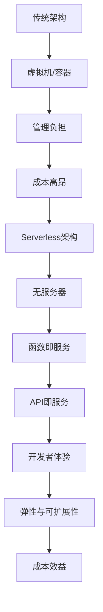

                 

关键词：Serverless架构、无服务器、微服务、云计算、函数即服务、API即服务、FaaS、BaaS、PaaS、开发者体验、成本效益、弹性、可扩展性、安全性。

> 摘要：本文深入探讨了Serverless架构的核心概念、优势、应用领域以及未来发展趋势。通过分析无服务器架构与传统云计算架构的差异，本文旨在帮助读者理解Serverless如何使开发者能够专注于编写代码而无需担心服务器管理，从而提高开发效率和降低成本。

## 1. 背景介绍

### 1.1 传统云计算架构

在传统的云计算架构中，应用程序的部署和管理通常依赖于虚拟机（VM）或容器。开发者需要负责虚拟机的配置、资源分配、监控和维护等任务。这种方法虽然提供了灵活性，但也带来了复杂的运维负担和较高的成本。

### 1.2 Serverless架构的兴起

随着云服务的普及和发展，开发者对高效、灵活和成本效益高的解决方案的需求日益增加。Serverless架构应运而生，它允许开发者将应用程序的功能分解为一系列微小的函数，并通过云服务提供商（CSP）进行部署和管理。

### 1.3 Serverless架构的优势

Serverless架构的主要优势包括：

- **无服务器管理**：开发者无需关心底层基础设施的管理和维护，从而降低了运维成本和复杂性。
- **弹性与可扩展性**：Serverless服务可以根据实际需求自动扩展和缩放，以应对高并发场景。
- **成本效益**：仅按使用量收费，无需为闲置资源支付费用。
- **开发者体验**：简化了开发流程，使开发者能够专注于业务逻辑的实现，而无需担心底层架构。

## 2. 核心概念与联系

### 2.1 无服务器与微服务的关系

无服务器（Serverless）和微服务（Microservices）是两个不同的概念，但它们之间存在紧密的联系。无服务器架构通常用于实现微服务架构中的各个微服务，使开发者能够以更高效、更灵活的方式构建分布式系统。

### 2.2 函数即服务（FaaS）

函数即服务（FaaS）是Serverless架构的核心组成部分，它允许开发者将应用程序的功能划分为独立的函数。这些函数可以通过HTTP请求或其他触发器进行调用，并在云服务提供商的平台上自动执行和管理。

### 2.3 API即服务（APIaaS）

API即服务（APIaaS）是另一种Serverless服务，它允许开发者创建、发布和管理API。APIaaS提供了丰富的API管理功能，如API文档、安全性和监控，从而简化了API开发的复杂度。

### 2.4 Mermaid流程图



## 3. 核心算法原理 & 具体操作步骤

### 3.1 算法原理概述

Serverless架构的核心在于其基于事件驱动的模型。应用程序的各个功能被划分为独立的函数，这些函数可以在触发事件发生时自动执行。事件可以是用户请求、定时任务、数据库变更等。

### 3.2 算法步骤详解

1. **函数定义**：开发者使用提供的函数编程语言（如Node.js、Python、Java等）编写函数。
2. **部署函数**：通过云服务提供商的函数服务部署函数，上传代码并配置触发器。
3. **测试函数**：在部署后，通过API或其他方式测试函数的功能和性能。
4. **监控和优化**：使用云服务提供商提供的监控工具，对函数的运行情况进行监控，并进行性能优化。

### 3.3 算法优缺点

#### 优点：

- **无服务器管理**：简化了运维工作，降低了管理成本。
- **弹性与可扩展性**：自动扩展和缩放，以应对不同负载场景。
- **成本效益**：按使用量计费，无需为闲置资源支付费用。

#### 缺点：

- **依赖性**：高度依赖云服务提供商，迁移成本较高。
- **性能限制**：函数执行时间受限，不适合长时间运行的任务。
- **安全性**：函数之间的隔离性可能导致安全性问题。

### 3.4 算法应用领域

Serverless架构适用于以下领域：

- **Web应用程序**：处理用户请求、提供API接口。
- **移动应用程序**：处理后台任务、实现云端功能。
- **数据处理**：处理大数据分析、实时流处理。
- **自动化任务**：定时任务、数据备份等。

## 4. 数学模型和公式 & 详细讲解 & 举例说明

### 4.1 数学模型构建

在Serverless架构中，成本模型是一个重要的数学模型。成本模型可以根据以下公式进行构建：

$$
成本 = \sum_{i=1}^{n} (函数_{i}的使用量 \times 函数_{i}的计费率)
$$

其中，$n$ 表示应用程序中的函数数量，函数$的使用量$ 表示函数在特定时间段内的调用次数，函数$的计费率$ 表示每个调用所需支付的费用。

### 4.2 公式推导过程

假设有一个应用程序，其中包含三个函数：函数1、函数2和函数3。每个函数的计费率分别为1美元/调用、2美元/调用和3美元/调用。在特定时间段内，函数1的调用次数为1000次，函数2的调用次数为500次，函数3的调用次数为200次。根据上述公式，可以计算得到总成本：

$$
成本 = (1000 \times 1) + (500 \times 2) + (200 \times 3) = 1000 + 1000 + 600 = 2600 美元
$$

### 4.3 案例分析与讲解

假设一个电商网站使用Serverless架构处理用户订单。该应用程序包含以下四个函数：

1. **支付处理函数**：处理用户支付请求，计费率为5美元/调用。
2. **库存更新函数**：更新商品库存信息，计费率为3美元/调用。
3. **订单生成函数**：生成订单信息，计费率为2美元/调用。
4. **订单发送函数**：发送订单确认邮件，计费率为1美元/调用。

在一个月内，支付处理函数的调用次数为10000次，库存更新函数的调用次数为5000次，订单生成函数的调用次数为8000次，订单发送函数的调用次数为6000次。根据上述公式，可以计算得到总成本：

$$
成本 = (10000 \times 5) + (5000 \times 3) + (8000 \times 2) + (6000 \times 1) = 50000 + 15000 + 16000 + 6000 = 86000 美元
$$

## 5. 项目实践：代码实例和详细解释说明

### 5.1 开发环境搭建

为了实现一个简单的Serverless应用程序，我们可以使用云服务提供商提供的开发工具。以下是一个使用AWS Lambda和Amazon API Gateway实现的项目实例：

1. **创建AWS账号**：在AWS管理控制台中创建账号。
2. **配置AWS CLI**：安装并配置AWS CLI，以便在本地计算机上与AWS服务进行通信。
3. **创建AWS Lambda函数**：在AWS管理控制台中创建一个新的Lambda函数，选择适当的运行时（如Node.js）并上传函数代码。
4. **配置API Gateway**：创建一个新的API Gateway，并将其与Lambda函数关联，以便通过HTTP请求调用函数。

### 5.2 源代码详细实现

以下是一个简单的Node.js Lambda函数的示例代码：

```javascript
const lambda = require('aws-lambda');
const axios = require('axios');

exports.handler = async (event) => {
    try {
        const response = await axios.get(event.queryStringParameters.url);
        return {
            statusCode: 200,
            body: JSON.stringify(response.data),
            headers: {
                'Content-Type': 'application/json',
            },
        };
    } catch (error) {
        return {
            statusCode: 500,
            body: JSON.stringify({ error: '内部服务器错误' }),
            headers: {
                'Content-Type': 'application/json',
            },
        };
    }
};
```

### 5.3 代码解读与分析

上述代码实现了一个简单的HTTP端点，用于获取外部API的数据。函数通过API Gateway接收HTTP请求，从请求参数中获取URL，使用axios库向该URL发送GET请求，并将响应数据返回给客户端。

### 5.4 运行结果展示

在配置API Gateway后，可以通过浏览器或其他HTTP客户端访问该端点。例如，访问 `https://api.example.com/data?url=https://jsonplaceholder.typicode.com/todos/1`，将返回一个包含JSON格式的响应数据。

```json
{
    "userId": 1,
    "id": 1,
    "title": "delectus aut autem",
    "completed": false
}
```

## 6. 实际应用场景

### 6.1 数据处理

Serverless架构适用于大数据处理和实时流处理，例如使用AWS Lambda和Kinesis处理实时数据流。

### 6.2 自动化任务

Serverless架构可以帮助自动化重复性的任务，如使用AWS Lambda和Amazon S3进行数据备份或使用AWS Step Functions编排复杂的自动化流程。

### 6.3 Web应用程序

Serverless架构适用于构建Web应用程序，例如使用AWS Lambda和Amazon API Gateway提供RESTful API服务。

### 6.4 移动应用程序

Serverless架构可以帮助构建移动应用程序的后端，例如使用AWS Amplify或Google Firebase提供云功能。

## 7. 未来应用展望

随着Serverless架构的不断发展和完善，它将在更多的应用场景中发挥作用。未来的发展趋势包括：

- **更多服务提供商**：更多的云服务提供商将提供Serverless服务，提高市场竞争和用户体验。
- **更好的开发者体验**：更丰富的开发工具和集成开发环境（IDE）将使开发者更轻松地构建Serverless应用程序。
- **安全性增强**：随着Serverless架构的普及，安全性将得到更多关注，提供更强大的安全防护措施。
- **跨平台兼容性**：Serverless服务将实现更好的跨平台兼容性，简化应用程序的部署和迁移。

## 8. 总结：未来发展趋势与挑战

### 8.1 研究成果总结

Serverless架构在过去的几年中取得了显著的发展，成为云计算领域的重要趋势。研究成果表明，Serverless架构具有无服务器管理、弹性与可扩展性、成本效益等显著优势，适用于多种应用场景。

### 8.2 未来发展趋势

未来，Serverless架构将继续发展，更多服务提供商将提供丰富的Serverless服务，开发者将获得更好的开发工具和体验。安全性、跨平台兼容性和集成性将是未来研究的重要方向。

### 8.3 面临的挑战

尽管Serverless架构具有显著优势，但仍然面临一些挑战，如依赖云服务提供商、性能限制和安全性问题。解决这些挑战需要技术社区的共同努力和不断创新。

### 8.4 研究展望

未来，Serverless架构的研究将继续深入，探索更高效、更安全的架构设计和实现方法。通过技术创新和应用优化，Serverless架构将为开发者提供更强大的开发平台，推动云计算和分布式系统的进一步发展。

## 9. 附录：常见问题与解答

### 9.1 什么是Serverless架构？

Serverless架构是一种云计算架构，允许开发者将应用程序的功能划分为独立的函数，并通过云服务提供商进行部署和管理。开发者无需关心底层基础设施的管理和维护，从而提高开发效率和降低成本。

### 9.2 Serverless架构与传统云计算架构有哪些区别？

Serverless架构与传统云计算架构的主要区别在于：

- **无服务器管理**：Serverless架构无需开发者管理底层基础设施，如虚拟机和容器。
- **弹性与可扩展性**：Serverless服务可以自动扩展和缩放，以应对不同负载场景。
- **成本效益**：Serverless架构仅按使用量计费，无需为闲置资源支付费用。

### 9.3 Serverless架构适用于哪些场景？

Serverless架构适用于以下场景：

- **Web应用程序**：处理用户请求、提供API接口。
- **移动应用程序**：处理后台任务、实现云端功能。
- **数据处理**：处理大数据分析、实时流处理。
- **自动化任务**：定时任务、数据备份等。

### 9.4 Serverless架构是否安全？

Serverless架构的安全性取决于云服务提供商的安全措施和开发者对函数的安全配置。虽然Serverless架构可能引入一些安全风险，但通过合理的配置和监控，可以确保应用程序的安全性。

### 9.5 如何迁移到Serverless架构？

迁移到Serverless架构涉及以下步骤：

1. **评估现有架构**：了解现有架构的功能、性能和成本。
2. **确定迁移策略**：选择合适的Serverless服务提供商和服务。
3. **重构应用程序**：将应用程序的功能划分为独立的函数。
4. **测试和优化**：对迁移后的应用程序进行测试和性能优化。
5. **部署和监控**：部署应用程序并监控其性能和成本。

---

作者：禅与计算机程序设计艺术 / Zen and the Art of Computer Programming


