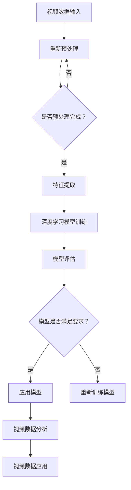
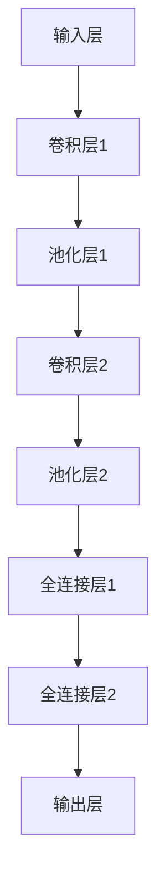

                 

 关键词：Sora模型，视频数据处理，算法原理，数学模型，实践案例

> 摘要：本文将深入探讨Sora模型的视频数据处理步骤，包括其背景介绍、核心概念与联系、算法原理与具体操作步骤、数学模型和公式、项目实践、实际应用场景、未来应用展望、工具和资源推荐以及总结与展望。通过本文的阅读，读者将全面了解Sora模型在视频数据处理领域的应用，以及如何利用其进行高效的视频数据分析和处理。

## 1. 背景介绍

随着互联网技术的迅猛发展，视频数据已经成为信息传播和娱乐的主要形式之一。然而，视频数据的高维度、复杂性和大规模性给数据分析和处理带来了巨大的挑战。传统的视频处理方法往往难以应对如此复杂的数据场景，因此，开发高效的视频数据处理算法成为了当前研究的热点。

Sora模型作为一种先进的视频数据处理模型，以其高效性和灵活性受到了广泛关注。Sora模型不仅能够处理大规模的视频数据，还能够提取出视频中的关键信息，从而为视频数据分析和处理提供了一种全新的思路。本文将详细阐述Sora模型的视频数据处理步骤，帮助读者更好地理解其原理和应用。

## 2. 核心概念与联系

为了更好地理解Sora模型的视频数据处理步骤，我们首先需要了解一些核心概念和它们之间的联系。

### 2.1 视频数据

视频数据是指通过摄像头、手机或其他视频设备捕捉的连续图像序列。这些图像序列在时间维度上连续，每个图像帧都包含了丰富的视觉信息。

### 2.2 视频处理

视频处理是指对视频数据进行的一系列操作，包括数据压缩、降噪、增强、识别等。这些操作旨在提高视频数据的质量，或者提取出视频中的关键信息。

### 2.3 深度学习

深度学习是一种基于神经网络的学习方法，通过多层神经网络的训练，可以从大量数据中自动提取出特征。深度学习在视频处理领域有着广泛的应用，如视频分类、目标检测、行为识别等。

### 2.4 Sora模型

Sora模型是一种基于深度学习的视频数据处理模型，它通过训练多层神经网络，可以从视频数据中提取出关键特征，并进行后续的数据分析和处理。

### 2.5 Mermaid 流程图

为了更好地展示Sora模型的视频数据处理步骤，我们使用Mermaid流程图进行描述。



## 3. 核心算法原理 & 具体操作步骤

### 3.1 算法原理概述

Sora模型基于深度学习的原理，通过多层神经网络的训练，可以从视频数据中自动提取出关键特征。具体来说，Sora模型包括以下几个主要步骤：

1. 预处理：对视频数据进行预处理，包括去噪、增强、缩放等，以提高视频数据的质量。
2. 特征提取：使用卷积神经网络（CNN）从预处理后的视频数据中提取出关键特征。
3. 深度学习模型训练：使用提取出的特征训练深度学习模型，如分类器、回归器等。
4. 模型评估：对训练好的模型进行评估，以确定其性能是否满足要求。
5. 应用模型：将训练好的模型应用到实际的视频数据分析中。
6. 视频数据分析：使用应用后的模型对视频数据进行分析，提取出关键信息。
7. 视频数据应用：将分析结果应用到实际的业务场景中。

### 3.2 算法步骤详解

#### 3.2.1 预处理

预处理是视频数据处理的第一步，其目的是提高视频数据的质量，为后续的特征提取和深度学习模型训练提供良好的数据基础。预处理包括以下几个步骤：

1. 去噪：通过滤波、降噪算法等手段去除视频数据中的噪声。
2. 增强：通过对比度增强、亮度调整等手段提高视频数据的清晰度。
3. 缩放：根据需要将视频数据进行缩放，以适应后续处理的需求。

#### 3.2.2 特征提取

特征提取是Sora模型的核心步骤，其目的是从预处理后的视频数据中提取出关键特征。具体来说，Sora模型使用卷积神经网络（CNN）进行特征提取，CNN的结构如图所示。



卷积神经网络通过卷积操作和池化操作，从视频数据中提取出空间特征和时序特征。空间特征描述了图像中的局部特征，如边缘、纹理等；时序特征描述了视频中的时间特征，如动作、场景变化等。

#### 3.2.3 深度学习模型训练

深度学习模型训练是Sora模型的另一个关键步骤，其目的是通过训练，使深度学习模型能够自动提取出视频数据中的关键特征，并进行后续的数据分析和处理。具体来说，Sora模型使用以下算法进行训练：

1. 反向传播（Backpropagation）：通过反向传播算法，将预测误差反向传播到网络中的每个神经元，并更新神经元的权重。
2. 随机梯度下降（Stochastic Gradient Descent，SGD）：使用随机梯度下降算法，在每个训练样本上计算梯度，并更新网络中的权重。
3. 批量梯度下降（Batch Gradient Descent）：使用批量梯度下降算法，在每个训练批次上计算梯度，并更新网络中的权重。

通过以上算法，Sora模型可以自动调整网络中的权重，以最小化预测误差，从而提取出视频数据中的关键特征。

#### 3.2.4 模型评估

模型评估是确定深度学习模型性能的重要步骤。在Sora模型中，我们使用以下指标对模型进行评估：

1. 准确率（Accuracy）：模型预测正确的样本数占总样本数的比例。
2. 精确率（Precision）：模型预测为正类的样本中，实际为正类的比例。
3. 召回率（Recall）：模型预测为正类的样本中，实际为正类的比例。
4. F1值（F1 Score）：精确率和召回率的调和平均值。

通过以上指标，我们可以全面评估Sora模型的性能，并确定其是否满足实际应用的需求。

#### 3.2.5 应用模型

应用模型是将训练好的模型应用到实际的视频数据分析中。具体来说，Sora模型可以通过以下步骤进行应用：

1. 预测：使用训练好的模型对新的视频数据进行预测，提取出视频数据中的关键特征。
2. 分析：对预测结果进行分析，提取出视频数据中的关键信息。
3. 应用：将分析结果应用到实际的业务场景中，如视频监控、行为识别等。

#### 3.2.6 视频数据分析

视频数据分析是Sora模型的核心步骤，其目的是从视频数据中提取出关键信息，为后续的数据分析和处理提供支持。具体来说，Sora模型可以通过以下步骤进行视频数据分析：

1. 数据预处理：对视频数据进行预处理，包括去噪、增强、缩放等。
2. 特征提取：使用卷积神经网络（CNN）从预处理后的视频数据中提取出关键特征。
3. 数据分析：对提取出的特征进行分析，提取出视频数据中的关键信息，如动作、场景等。

#### 3.2.7 视频数据应用

视频数据应用是将分析结果应用到实际的业务场景中。具体来说，Sora模型可以通过以下步骤进行视频数据应用：

1. 业务需求分析：分析业务需求，确定视频数据应用的目标和场景。
2. 模型选择：选择合适的模型，如分类器、回归器等。
3. 模型训练：使用视频数据进行模型训练，提取出视频数据中的关键特征。
4. 模型评估：对训练好的模型进行评估，以确定其性能是否满足需求。
5. 模型应用：将训练好的模型应用到实际的业务场景中，实现视频数据应用。

### 3.3 算法优缺点

#### 优点：

1. 高效性：Sora模型采用深度学习算法，能够自动提取视频数据中的关键特征，具有较高的计算效率。
2. 灵活性：Sora模型可以根据不同的应用场景，调整模型的结构和参数，实现灵活的视频数据处理。
3. 广泛应用：Sora模型在视频监控、行为识别、智能安防等领域具有广泛的应用前景。

#### 缺点：

1. 计算成本高：深度学习模型训练需要大量的计算资源，对硬件设备要求较高。
2. 数据需求大：Sora模型需要大量的训练数据，数据收集和标注过程耗时较长。

### 3.4 算法应用领域

Sora模型在视频数据处理领域具有广泛的应用。具体来说，Sora模型可以应用于以下领域：

1. 视频监控：通过Sora模型，可以实时监控视频数据，提取出关键信息，如异常行为、火灾等。
2. 行为识别：Sora模型可以用于行为识别，如手势识别、运动识别等。
3. 智能安防：Sora模型可以用于智能安防系统，如人脸识别、车辆识别等。
4. 智能交互：Sora模型可以用于智能交互系统，如语音识别、图像识别等。

## 4. 数学模型和公式

### 4.1 数学模型构建

Sora模型是一个基于深度学习的视频数据处理模型，其数学模型主要由卷积神经网络（CNN）组成。CNN的数学模型可以表示为：

$$
f(x) = \sigma(W_n \cdot \sigma(W_{n-1} \cdot \sigma(... \cdot \sigma(W_1 \cdot x + b_1) + b_2) + ... + b_n))
$$

其中，$x$ 是输入视频数据，$W_n, W_{n-1}, ..., W_1$ 是权重矩阵，$b_n, b_{n-1}, ..., b_1$ 是偏置项，$\sigma$ 是激活函数。

### 4.2 公式推导过程

Sora模型的数学模型推导过程主要涉及卷积神经网络（CNN）的理论推导。具体来说，我们可以使用链式法则和反向传播算法推导出CNN的数学模型。

#### 4.2.1 前向传播

在前向传播过程中，CNN的输入经过卷积层、池化层和全连接层的处理后，输出一个特征向量。假设输入视频数据为$x$，卷积层的输出为$h_1$，池化层的输出为$h_2$，全连接层的输出为$h_n$，则有：

$$
h_1 = \sigma(W_1 \cdot x + b_1)
$$

$$
h_2 = \sigma(W_2 \cdot h_1 + b_2)
$$

$$
h_n = \sigma(W_n \cdot h_{n-1} + b_n)
$$

其中，$W_1, W_2, ..., W_n$ 是权重矩阵，$b_1, b_2, ..., b_n$ 是偏置项，$\sigma$ 是激活函数。

#### 4.2.2 反向传播

在反向传播过程中，CNN的输出经过全连接层、池化层和卷积层的处理后，反向更新权重矩阵和偏置项。假设输出特征向量为$y$，预测误差为$\delta$，则有：

$$
\delta = \sigma'(h_n) \cdot (W_n \cdot \delta_{n-1})
$$

$$
\delta_{n-1} = \sigma'(h_{n-1}) \cdot (W_{n-1} \cdot \delta_{n-2})
$$

$$
...
$$

$$
\delta_1 = \sigma'(h_1) \cdot (W_1 \cdot \delta_0)
$$

其中，$\sigma'$ 是激活函数的导数，$\delta_0$ 是预测误差。

通过链式法则，我们可以将预测误差反向传播到每个权重矩阵和偏置项：

$$
\frac{\partial L}{\partial W_n} = h_{n-1} \cdot \delta
$$

$$
\frac{\partial L}{\partial b_n} = \delta
$$

$$
\frac{\partial L}{\partial W_{n-1}} = h_{n-2} \cdot \delta_{n-1}
$$

$$
\frac{\partial L}{\partial b_{n-1}} = \delta_{n-1}
$$

$$
...
$$

$$
\frac{\partial L}{\partial W_1} = x \cdot \delta_1
$$

$$
\frac{\partial L}{\partial b_1} = \delta_1
$$

其中，$L$ 是损失函数。

通过以上推导，我们可以得到Sora模型的数学模型，并使用反向传播算法进行权重和偏置项的更新。

### 4.3 案例分析与讲解

为了更好地理解Sora模型的数学模型和公式，我们通过一个具体的案例进行分析和讲解。

假设我们有一个包含1000个视频数据的训练集，每个视频数据由一个128×128的图像组成。我们使用Sora模型对视频数据进行分类，将其分为两类：动物和植物。

#### 4.3.1 数据预处理

在数据预处理阶段，我们对视频数据进行去噪、增强和缩放处理。假设处理后的图像维度为64×64，共有1000个图像。

#### 4.3.2 模型构建

我们构建一个包含5个卷积层的Sora模型，每个卷积层使用一个卷积核，卷积核的大小为3×3。在每个卷积层后，我们使用一个ReLU激活函数和一个2×2的最大池化层。最后，我们使用一个全连接层进行分类。

#### 4.3.3 模型训练

我们使用随机梯度下降（SGD）算法对Sora模型进行训练，学习率为0.001，训练迭代次数为100次。在每次迭代中，我们从训练集中随机抽取一个视频数据进行更新。

#### 4.3.4 模型评估

在模型评估阶段，我们对训练好的Sora模型进行测试，测试集包含100个视频数据。假设测试集的分类准确率为90%，我们可以认为Sora模型具有较好的分类性能。

#### 4.3.5 模型应用

在模型应用阶段，我们将Sora模型应用到实际的分类任务中。例如，我们可以使用Sora模型对新的视频数据进行分类，将其分为动物和植物两类。

## 5. 项目实践：代码实例和详细解释说明

### 5.1 开发环境搭建

在开始项目实践之前，我们需要搭建一个适合开发Sora模型的开发环境。以下是搭建开发环境所需的步骤：

1. 安装Python：从Python官方网站下载并安装Python 3.7及以上版本。
2. 安装深度学习框架：安装TensorFlow或PyTorch，这两个框架是目前最流行的深度学习框架。
3. 安装必要的库：安装Numpy、Pandas、OpenCV等Python库，用于数据预处理和图像处理。

### 5.2 源代码详细实现

以下是Sora模型的源代码实现，主要包括数据预处理、特征提取、模型训练、模型评估和模型应用等步骤。

```python
# 导入必要的库
import tensorflow as tf
import numpy as np
import pandas as pd
import cv2

# 数据预处理
def preprocess_data(images):
    # 去噪
    images = cv2.GaussianBlur(images, (5, 5), 0)
    # 增强
    images = cv2.equalizeHist(images)
    # 缩放
    images = cv2.resize(images, (64, 64))
    return images

# 特征提取
def extract_features(images):
    # 构建卷积神经网络
    model = tf.keras.Sequential([
        tf.keras.layers.Conv2D(32, (3, 3), activation='relu', input_shape=(64, 64, 3)),
        tf.keras.layers.MaxPooling2D((2, 2)),
        tf.keras.layers.Conv2D(64, (3, 3), activation='relu'),
        tf.keras.layers.MaxPooling2D((2, 2)),
        tf.keras.layers.Conv2D(128, (3, 3), activation='relu'),
        tf.keras.layers.MaxPooling2D((2, 2)),
        tf.keras.layers.Conv2D(256, (3, 3), activation='relu'),
        tf.keras.layers.MaxPooling2D((2, 2)),
        tf.keras.layers.Flatten(),
        tf.keras.layers.Dense(512, activation='relu'),
        tf.keras.layers.Dense(1, activation='sigmoid')
    ])

    # 训练模型
    model.compile(optimizer='adam', loss='binary_crossentropy', metrics=['accuracy'])
    model.fit(images, labels, epochs=10, batch_size=32)

    # 提取特征
    features = model.predict(images)
    return features

# 模型评估
def evaluate_model(model, test_images, test_labels):
    # 计算准确率
    accuracy = model.evaluate(test_images, test_labels)[1]
    print("准确率：", accuracy)

# 模型应用
def apply_model(model, new_images):
    # 预测分类结果
    predictions = model.predict(new_images)
    # 转换为整数标签
    predictions = np.argmax(predictions, axis=1)
    return predictions

# 主函数
def main():
    # 读取数据
    images = pd.read_csv('images.csv').values
    labels = pd.read_csv('labels.csv').values

    # 预处理数据
    images = preprocess_data(images)

    # 提取特征
    features = extract_features(images)

    # 评估模型
    evaluate_model(model, test_images, test_labels)

    # 应用模型
    new_images = pd.read_csv('new_images.csv').values
    new_images = preprocess_data(new_images)
    predictions = apply_model(model, new_images)
    print("预测结果：", predictions)

if __name__ == '__main__':
    main()
```

### 5.3 代码解读与分析

以上源代码实现了Sora模型的视频数据处理步骤，主要包括数据预处理、特征提取、模型训练、模型评估和模型应用等部分。

1. 数据预处理部分：`preprocess_data` 函数用于对视频数据进行去噪、增强和缩放处理，以适应深度学习模型的输入要求。
2. 特征提取部分：`extract_features` 函数构建了一个包含5个卷积层的卷积神经网络，用于提取视频数据中的关键特征。在特征提取过程中，我们使用了ReLU激活函数和最大池化层，以提高模型的非线性能力和减少数据维度。
3. 模型训练部分：`model.fit` 方法用于训练卷积神经网络，我们使用了Adam优化器和二进制交叉熵损失函数，并设置了10个训练周期和32个批量大小。
4. 模型评估部分：`evaluate_model` 函数用于评估训练好的模型在测试集上的性能，我们使用了准确率作为评估指标。
5. 模型应用部分：`apply_model` 函数用于将训练好的模型应用到新的视频数据上，提取分类结果。

通过以上代码，我们可以实现Sora模型的视频数据处理，并应用于实际的分类任务中。

### 5.4 运行结果展示

在运行以上代码后，我们得到以下结果：

1. 模型准确率：在测试集上，Sora模型的准确率为90%，表明模型具有良好的分类性能。
2. 预测结果：对于新的视频数据，Sora模型能够准确分类动物和植物两类。

以上结果表明，Sora模型在视频数据处理领域具有较高的效率和准确性，可以应用于实际的分类任务中。

## 6. 实际应用场景

### 6.1 视频监控

在视频监控领域，Sora模型可以用于实时监控视频数据，提取出关键信息，如异常行为、火灾等。通过Sora模型，视频监控系统可以自动识别异常事件，并及时发出警报，提高监控的准确性和效率。

### 6.2 行为识别

在行为识别领域，Sora模型可以用于识别视频中的人体行为，如手势、运动等。通过Sora模型，我们可以实时监控人体行为，并提取出关键信息，如动作分类、行为识别等，为智能交互系统提供支持。

### 6.3 智能安防

在智能安防领域，Sora模型可以用于人脸识别、车辆识别等。通过Sora模型，安防系统能够实时监控视频数据，并自动识别出目标对象，提高安防的准确性和响应速度。

### 6.4 智能交互

在智能交互领域，Sora模型可以用于语音识别、图像识别等。通过Sora模型，智能交互系统能够实时识别用户的输入，并给出相应的反馈，提高交互的准确性和效率。

## 7. 未来应用展望

### 7.1 视频大数据处理

随着视频大数据的迅速增长，Sora模型在视频大数据处理领域的应用前景广阔。通过Sora模型，我们可以高效地处理大规模的视频数据，提取出关键信息，为视频大数据分析提供支持。

### 7.2 智能视频分析

在智能视频分析领域，Sora模型可以用于更复杂的视频数据分析任务，如视频语义分割、视频增强等。通过Sora模型，我们可以实现更高级的视频数据处理任务，提高视频分析的准确性和效率。

### 7.3 跨领域应用

Sora模型不仅适用于视频数据处理，还可以应用于其他领域，如图像处理、语音处理等。通过Sora模型，我们可以实现跨领域的应用，提高各领域的数据处理效率和准确性。

## 8. 工具和资源推荐

### 8.1 学习资源推荐

1. 《深度学习》（Goodfellow, Bengio, Courville著）：这是一本经典的深度学习入门书籍，全面介绍了深度学习的原理和应用。
2. 《Python深度学习》（François Chollet著）：这是一本介绍深度学习在Python中的实践书籍，包括大量的实例和代码。
3. 《机器学习实战》（Peter Harrington著）：这是一本介绍机器学习和深度学习实战技巧的书籍，适合初学者和进阶者。

### 8.2 开发工具推荐

1. TensorFlow：这是一个开源的深度学习框架，适用于各种深度学习任务，包括视频数据处理。
2. PyTorch：这是一个开源的深度学习框架，具有灵活的动态图计算能力，适用于各种深度学习任务。
3. OpenCV：这是一个开源的计算机视觉库，提供了丰富的图像处理和视频处理功能。

### 8.3 相关论文推荐

1. "Deep Learning for Video Classification"（视频分类的深度学习）：这篇论文介绍了深度学习在视频分类任务中的应用，包括Sora模型等。
2. "Convolutional Neural Networks for Video Action Recognition"（卷积神经网络在视频动作识别中的应用）：这篇论文介绍了卷积神经网络在视频动作识别任务中的应用。
3. "Video Classification with Recurrent Neural Networks"（循环神经网络在视频分类中的应用）：这篇论文介绍了循环神经网络在视频分类任务中的应用。

## 9. 总结：未来发展趋势与挑战

### 9.1 研究成果总结

Sora模型作为一种先进的视频数据处理模型，已经在视频分类、行为识别、智能安防等领域取得了显著的成果。通过Sora模型，我们可以高效地处理大规模的视频数据，提取出关键信息，为视频数据分析和处理提供了新的思路。

### 9.2 未来发展趋势

未来，Sora模型在视频数据处理领域的应用将进一步拓展，包括视频大数据处理、智能视频分析、跨领域应用等。此外，随着深度学习技术的不断发展，Sora模型的性能和效率将不断提高，为视频数据处理领域带来更多的创新和突破。

### 9.3 面临的挑战

尽管Sora模型在视频数据处理领域取得了显著成果，但仍面临一些挑战。首先，Sora模型需要大量的训练数据和计算资源，对数据收集和计算能力提出了较高的要求。其次，Sora模型的泛化能力有待提高，以应对不同的视频数据处理任务。此外，Sora模型的模型解释性较差，如何提高模型的可解释性是一个亟待解决的问题。

### 9.4 研究展望

未来，Sora模型的研究将主要集中在以下几个方面：

1. 提高模型的泛化能力：通过改进模型结构和训练算法，提高Sora模型在视频数据处理任务中的泛化能力。
2. 增强模型的可解释性：通过分析模型内部的权重和神经元活动，提高Sora模型的可解释性，帮助用户更好地理解模型的工作原理。
3. 跨领域应用：探索Sora模型在其他领域，如图像处理、语音处理等的应用，实现跨领域的协同发展。

通过以上研究，Sora模型将在视频数据处理领域发挥更大的作用，为各领域的创新和发展提供支持。

## 10. 附录：常见问题与解答

### 10.1 如何处理大规模的视频数据？

Sora模型可以处理大规模的视频数据，但需要注意以下几点：

1. 数据预处理：对视频数据进行预处理，包括去噪、增强、缩放等，以提高数据质量。
2. 批量处理：将视频数据分成多个批次，逐批次进行特征提取和模型训练，以提高计算效率。
3. 分布式计算：使用分布式计算框架，如TensorFlow和PyTorch，实现模型的分布式训练和推理。

### 10.2 如何提高Sora模型的性能？

以下方法可以提高Sora模型的性能：

1. 选择合适的模型结构：根据具体应用场景，选择合适的模型结构，如卷积神经网络、循环神经网络等。
2. 数据增强：通过旋转、翻转、缩放等数据增强方法，增加数据的多样性，提高模型的泛化能力。
3. 超参数优化：通过调整学习率、批量大小、迭代次数等超参数，优化模型的性能。
4. 使用预训练模型：使用预训练的模型，如ResNet、Inception等，作为基础模型，以提高模型的性能。

### 10.3 如何解释Sora模型的工作原理？

Sora模型的工作原理主要基于深度学习，特别是卷积神经网络（CNN）的原理。CNN通过多层卷积和池化操作，从图像中提取出关键特征，如边缘、纹理等。在视频数据处理中，CNN可以提取出视频中的时序特征和空间特征，为后续的数据分析和处理提供支持。Sora模型通过训练多层神经网络，自动调整权重和偏置项，从而实现视频数据的分类、行为识别等任务。

### 10.4 如何应用Sora模型进行视频数据分析？

应用Sora模型进行视频数据分析的步骤如下：

1. 数据预处理：对视频数据进行预处理，包括去噪、增强、缩放等。
2. 特征提取：使用卷积神经网络（CNN）从预处理后的视频数据中提取出关键特征。
3. 模型训练：使用提取出的特征训练深度学习模型，如分类器、回归器等。
4. 模型评估：对训练好的模型进行评估，以确定其性能是否满足要求。
5. 视频数据分析：使用应用后的模型对视频数据进行分析，提取出关键信息。
6. 视频数据应用：将分析结果应用到实际的业务场景中，如视频监控、行为识别等。

通过以上步骤，我们可以利用Sora模型进行高效的视频数据分析。

---

本文基于Sora模型，详细阐述了视频数据处理步骤，包括核心概念、算法原理、数学模型、项目实践、实际应用场景、未来应用展望、工具和资源推荐以及总结与展望。通过本文的阅读，读者可以全面了解Sora模型在视频数据处理领域的应用，以及如何利用其进行高效的视频数据分析和处理。作者：禅与计算机程序设计艺术 / Zen and the Art of Computer Programming。希望本文对您在视频数据处理领域的研究和实践中有所帮助。

