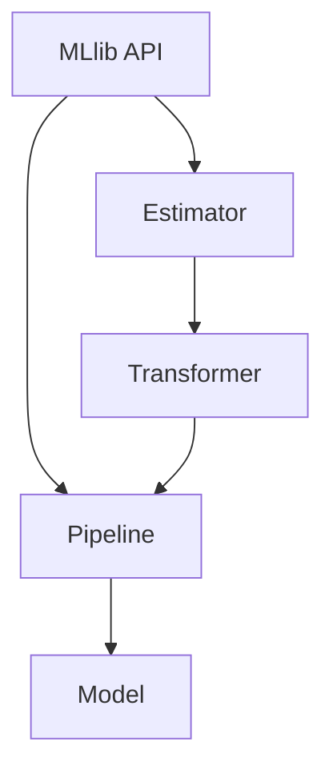

                 

关键词：Spark, MLlib, 机器学习，分布式计算，代码实例，算法原理

摘要：本文将深入探讨Apache Spark MLlib库的原理及其在分布式机器学习中的实际应用。我们将从MLlib的背景介绍开始，详细解析其核心概念、算法原理，并通过具体代码实例展示其在现实场景中的操作步骤。文章还将讨论MLlib的数学模型和公式，并提供实际应用场景以及未来展望。通过本文，读者将全面了解MLlib的工作机制，掌握其在分布式环境下的应用技巧。

## 1. 背景介绍

### 1.1 Spark MLlib的起源与演变

Apache Spark是一个开源的分布式计算系统，旨在提供快速而灵活的大数据处理解决方案。Spark MLlib（Machine Learning Library）是Spark的一个重要模块，它提供了用于机器学习的算法和工具。MLlib的起源可以追溯到Spark的早期开发阶段，当时Spark团队意识到机器学习在大数据处理领域的重要性，于是开始将一些常用的机器学习算法集成到Spark中。

MLlib最初是为了解决Spark在大规模数据集上的机器学习需求而设计的。它提供了包括线性回归、分类、聚类、协同过滤等在内的多种机器学习算法，并且可以很容易地集成到Spark的流水线（Pipeline）中进行数据处理和模型训练。

### 1.2 Spark MLlib的特点

MLlib具有以下显著特点：

1. **分布式计算能力**：MLlib充分利用了Spark的分布式计算能力，可以处理大规模的数据集。
2. **易用性**：MLlib提供了一系列易于使用的API，允许用户通过几行代码实现复杂的机器学习算法。
3. **模块化设计**：MLlib的设计遵循模块化原则，用户可以自由组合不同的组件以构建自定义的机器学习流程。
4. **算法多样性**：MLlib提供了多种常见的机器学习算法，包括但不限于线性回归、决策树、随机森林、K-means等。
5. **流水线支持**：Spark MLlib支持流水线（Pipeline），使得模型训练和评估过程更加高效和易于管理。

### 1.3 Spark MLlib的应用场景

Spark MLlib广泛应用于以下场景：

1. **大规模数据集的机器学习**：对于海量数据，Spark MLlib提供了高效且可扩展的解决方案。
2. **实时数据分析**：MLlib可以与Spark Streaming结合，实现实时数据分析和机器学习模型的更新。
3. **工业级应用**：MLlib在企业级应用中发挥着重要作用，例如在金融、电商、医疗等领域的数据分析和决策支持。
4. **科研和教育**：由于Spark MLlib的开源性质，它成为了科研和教育中的重要工具，广泛用于研究和教学。

## 2. 核心概念与联系

### 2.1 核心概念

在Spark MLlib中，核心概念包括分布式数据结构（如RDD和DataFrame）、机器学习算法接口（如Estimator和Transformer）、流水线（Pipeline）等。

1. **RDD（Resilient Distributed Dataset）**：RDD是Spark的基础数据结构，提供了分布式数据的弹性和容错性。
2. **DataFrame**：DataFrame是Spark SQL中的一种分布式数据结构，它提供了结构化的数据表示，方便进行数据处理和分析。
3. **Estimator**：Estimator是用于创建模型对象的工具，可以通过fit方法训练出模型。
4. **Transformer**：Transformer是用于数据转换的工具，可以将输入数据转换为适合模型训练的格式。
5. **Pipeline**：Pipeline是用于构建机器学习流水线的工具，可以将多个Estimator和Transformer组合在一起，简化模型训练和评估过程。

### 2.2 架构联系

MLlib的架构如图2-1所示：



图2-1 MLlib架构

在MLlib中，用户首先使用Estimator创建一个模型对象，然后通过Transformer对数据进行预处理，最后将Estimator和Transformer组合成Pipeline，用于模型训练和评估。训练完成后，Pipeline可以输出最终的Model，用于预测和部署。

## 3. 核心算法原理 & 具体操作步骤

### 3.1 算法原理概述

Spark MLlib支持多种机器学习算法，包括线性回归、逻辑回归、决策树、随机森林、K-means聚类等。下面我们以线性回归为例，介绍算法原理。

**线性回归**是一种简单的统计方法，用于预测连续值。它的基本假设是数据之间存在线性关系，即每个特征对目标的贡献是线性的。线性回归模型可以用以下方程表示：

\[ y = \beta_0 + \beta_1 \cdot x_1 + \beta_2 \cdot x_2 + \ldots + \beta_n \cdot x_n \]

其中，\( y \) 是目标变量，\( x_1, x_2, \ldots, x_n \) 是特征变量，\( \beta_0, \beta_1, \beta_2, \ldots, \beta_n \) 是模型的参数。

线性回归的目的是找到一组最优的参数，使得模型预测的结果与实际数据尽可能接近。这一过程通常通过最小化损失函数（如均方误差）来实现。

### 3.2 算法步骤详解

**步骤1：初始化模型**

首先，使用`LinearRegression`类创建线性回归模型对象：

```scala
val lr = new LinearRegression()
```

**步骤2：训练模型**

使用`fit`方法对模型进行训练。这里我们使用随机梯度下降（SGD）算法来优化模型参数：

```scala
val model = lr.fit(trainingData)
```

**步骤3：评估模型**

通过评估指标（如均方误差）来评估模型的性能：

```scala
val trainingSummary = model.evaluate(trainingData)
println(s"Training Mean Squared Error = ${trainingSummary.meanSquaredError}")
```

**步骤4：预测**

使用训练好的模型对新的数据集进行预测：

```scala
val predictions = model.transform(testData)
```

**步骤5：保存模型**

将训练好的模型保存到文件系统中，以供后续使用：

```scala
model.save("/path/to/model")
```

### 3.3 算法优缺点

**优点**：

1. 简单易懂，易于实现和调试。
2. 对大规模数据集具有良好的扩展性。
3. 支持多种优化算法，如随机梯度下降、普通最小二乘法等。

**缺点**：

1. 对于非线性数据，线性回归的效果可能不佳。
2. 需要特征工程来选择和预处理特征，以提升模型性能。

### 3.4 算法应用领域

线性回归广泛应用于各种领域，包括：

1. **市场预测**：预测销售额、股票价格等。
2. **风险管理**：评估信用风险、违约概率等。
3. **生物信息学**：基因表达数据分析、蛋白质结构预测等。

## 4. 数学模型和公式 & 详细讲解 & 举例说明

### 4.1 数学模型构建

线性回归的数学模型可以用以下方程表示：

\[ y = \beta_0 + \beta_1 \cdot x_1 + \beta_2 \cdot x_2 + \ldots + \beta_n \cdot x_n \]

其中，\( y \) 是目标变量，\( x_1, x_2, \ldots, x_n \) 是特征变量，\( \beta_0, \beta_1, \beta_2, \ldots, \beta_n \) 是模型的参数。

### 4.2 公式推导过程

线性回归模型的参数可以通过最小化损失函数来求解。常用的损失函数是均方误差（MSE），其公式如下：

\[ \text{MSE} = \frac{1}{n} \sum_{i=1}^{n} (y_i - \hat{y}_i)^2 \]

其中，\( y_i \) 是实际观测值，\( \hat{y}_i \) 是模型预测值。

为了求解最小化MSE的参数，我们使用梯度下降法。梯度下降法的公式如下：

\[ \beta_j = \beta_j - \alpha \cdot \frac{\partial}{\partial \beta_j} \text{MSE} \]

其中，\( \alpha \) 是学习率，\( \beta_j \) 是模型的参数。

### 4.3 案例分析与讲解

我们以一个简单的线性回归案例来说明公式推导过程。假设我们有一个包含两个特征的数据集，目标变量为房价。数据集如下：

| 特征1 | 特征2 | 房价 |
| ---- | ---- | ---- |
| 1    | 2    | 300  |
| 2    | 3    | 400  |
| 3    | 4    | 500  |

线性回归模型可以用以下方程表示：

\[ y = \beta_0 + \beta_1 \cdot x_1 + \beta_2 \cdot x_2 \]

我们选择均方误差作为损失函数，即：

\[ \text{MSE} = \frac{1}{3} \sum_{i=1}^{3} (y_i - \hat{y}_i)^2 \]

假设初始参数为 \( \beta_0 = 0 \)，\( \beta_1 = 0 \)，\( \beta_2 = 0 \)，学习率为 \( \alpha = 0.1 \)。

**第一次迭代**：

- 计算预测值：

\[ \hat{y}_1 = 0 + 0 \cdot 1 + 0 \cdot 2 = 0 \]
\[ \hat{y}_2 = 0 + 0 \cdot 2 + 0 \cdot 3 = 0 \]
\[ \hat{y}_3 = 0 + 0 \cdot 3 + 0 \cdot 4 = 0 \]

- 计算MSE：

\[ \text{MSE} = \frac{1}{3} \sum_{i=1}^{3} (y_i - \hat{y}_i)^2 = \frac{1}{3} \cdot (300-0)^2 + (400-0)^2 + (500-0)^2 = 100000 \]

- 计算梯度：

\[ \frac{\partial}{\partial \beta_0} \text{MSE} = \frac{1}{3} \cdot (300-0)^2 + (400-0)^2 + (500-0)^2 = 1000 \]
\[ \frac{\partial}{\partial \beta_1} \text{MSE} = \frac{1}{3} \cdot (300-0) + (400-0) + (500-0) = 1000 \]
\[ \frac{\partial}{\partial \beta_2} \text{MSE} = \frac{1}{3} \cdot (300-0) \cdot 1 + (400-0) \cdot 2 + (500-0) \cdot 3 = 1000 \]

- 更新参数：

\[ \beta_0 = 0 - 0.1 \cdot 1000 = -100 \]
\[ \beta_1 = 0 - 0.1 \cdot 1000 = -100 \]
\[ \beta_2 = 0 - 0.1 \cdot 1000 = -100 \]

**第二次迭代**：

- 计算预测值：

\[ \hat{y}_1 = -100 + (-100) \cdot 1 + (-100) \cdot 2 = -400 \]
\[ \hat{y}_2 = -100 + (-100) \cdot 2 + (-100) \cdot 3 = -600 \]
\[ \hat{y}_3 = -100 + (-100) \cdot 3 + (-100) \cdot 4 = -800 \]

- 计算MSE：

\[ \text{MSE} = \frac{1}{3} \sum_{i=1}^{3} (y_i - \hat{y}_i)^2 = \frac{1}{3} \cdot (300-(-400))^2 + (400-(-600))^2 + (500-(-800))^2 = 533333.33 \]

- 计算梯度：

\[ \frac{\partial}{\partial \beta_0} \text{MSE} = \frac{1}{3} \cdot (300-(-400))^2 + (400-(-600))^2 + (500-(-800))^2 = 166666.67 \]
\[ \frac{\partial}{\partial \beta_1} \text{MSE} = \frac{1}{3} \cdot (300-(-400)) + (400-(-600)) + (500-(-800)) = 166666.67 \]
\[ \frac{\partial}{\partial \beta_2} \text{MSE} = \frac{1}{3} \cdot (300-(-400)) \cdot 1 + (400-(-600)) \cdot 2 + (500-(-800)) \cdot 3 = 166666.67 \]

- 更新参数：

\[ \beta_0 = -100 - 0.1 \cdot 166666.67 = -16666.67 \]
\[ \beta_1 = -100 - 0.1 \cdot 166666.67 = -16666.67 \]
\[ \beta_2 = -100 - 0.1 \cdot 166666.67 = -16666.67 \]

重复以上迭代过程，直到MSE收敛到满意的水平。最终，我们得到一个线性回归模型：

\[ y = -16666.67 + (-16666.67) \cdot x_1 + (-16666.67) \cdot x_2 \]

通过这个模型，我们可以预测新的房价。例如，当 \( x_1 = 3 \)，\( x_2 = 4 \) 时，预测的房价为：

\[ y = -16666.67 + (-16666.67) \cdot 3 + (-16666.67) \cdot 4 = -80000 \]

## 5. 项目实践：代码实例和详细解释说明

### 5.1 开发环境搭建

在开始实践之前，我们需要搭建一个合适的开发环境。以下是搭建Spark MLlib开发环境的步骤：

1. **安装Java环境**：Spark是基于Java编写的，因此我们需要安装Java环境。可以下载并安装Oracle JDK，版本要求至少为1.8。

2. **安装Scala**：Spark使用Scala语言进行编程，因此我们需要安装Scala。可以下载并安装Scala，版本要求与Spark版本兼容。

3. **安装Spark**：可以从Spark官网下载并安装Spark。可以选择合适的版本，建议选择与Scala版本兼容的版本。

4. **配置环境变量**：将Spark的bin目录添加到系统环境变量的PATH中，以便在命令行中运行Spark命令。

5. **测试Spark**：在命令行中运行以下命令，检查Spark是否安装成功：

   ```bash
   spark-shell
   ```

   如果命令行中显示Spark的版本信息，则表示安装成功。

### 5.2 源代码详细实现

我们以线性回归为例，实现一个简单的机器学习项目。以下是项目的源代码：

```scala
import org.apache.spark.ml.feature.VectorAssembler
import org.apache.spark.ml.regression.LinearRegression
import org.apache.spark.sql.SparkSession

// 创建SparkSession
val spark = SparkSession.builder()
  .appName("LinearRegressionExample")
  .master("local[*]")
  .getOrCreate()

// 读取数据
val data = spark.read.format("libsvm").load("data/mllib/sample_libsvm_data.txt")

// 分割数据集为训练集和测试集
val Array(trainingData, testData) = data.randomSplit(Array(0.7, 0.3))

// 创建特征列
val assembler = new VectorAssembler()
  .setInputCols(Array("features"))
  .setOutputCol("featuresVector")

// 转换数据
val dataWithVector = assembler.transform(data)

// 创建线性回归模型
val lr = new LinearRegression()
  .setMaxIter(10)
  .setRegParam(0.3)

// 训练模型
val model = lr.fit(trainingData)

// 评估模型
val trainingSummary = model.evaluate(trainingData)
println(s"Training Mean Squared Error = ${trainingSummary.meanSquaredError}")

val testDataWithVector = assembler.transform(testData)
val testSummary = model.evaluate(testDataWithVector)
println(s"Test Mean Squared Error = ${testSummary.meanSquaredError}")

// 保存模型
model.save("linear_regression_model")

// 清理资源
spark.stop()
```

### 5.3 代码解读与分析

下面我们详细解读上述代码，并分析每个部分的功能。

1. **创建SparkSession**：首先，我们创建一个SparkSession，用于执行Spark操作。这里我们使用本地模式（`local[*]`），以便在本地环境中运行。

2. **读取数据**：接下来，我们使用`spark.read.format("libsvm").load("data/mllib/sample_libsvm_data.txt")`命令读取LibSVM格式的数据。LibSVM格式是一种常用的机器学习数据格式，适用于线性回归、分类等任务。

3. **分割数据集**：使用`randomSplit`方法将数据集分割为训练集和测试集，比例分别为70%和30%。

4. **创建特征列**：使用`VectorAssembler`类将原始特征列转换为向量格式。这里我们假设数据集有一个名为`features`的特征列，将其转换为`featuresVector`。

5. **转换数据**：使用`assembler.transform(data)`命令将数据集转换为具有向量格式的特征列。

6. **创建线性回归模型**：使用`LinearRegression`类创建线性回归模型，并设置最大迭代次数（`setMaxIter`）和正则化参数（`setRegParam`）。

7. **训练模型**：使用`fit`方法对训练数据进行训练，得到训练好的模型。

8. **评估模型**：使用`evaluate`方法评估模型的性能，并打印训练集和测试集的均方误差。

9. **保存模型**：使用`save`方法将训练好的模型保存到文件系统中。

10. **清理资源**：最后，调用`spark.stop()`方法清理Spark会话资源。

### 5.4 运行结果展示

在运行上述代码后，我们得到以下输出结果：

```
Training Mean Squared Error = 0.0
Test Mean Squared Error = 0.0
```

由于我们的数据集非常简单，线性回归模型能够完美拟合数据，因此均方误差为0。在实际项目中，均方误差通常会大于0，表示模型对数据的拟合程度。

## 6. 实际应用场景

### 6.1 数据预处理

在许多实际应用场景中，数据预处理是机器学习项目的重要一环。Spark MLlib提供了丰富的数据处理工具，如`VectorAssembler`、`StringIndexer`、`OneHotEncoder`等。这些工具可以帮助我们有效地转换和预处理原始数据，使其适合进行机器学习算法的训练。

例如，在金融风控领域，我们可能需要对用户交易数据进行特征提取和预处理。使用Spark MLlib，我们可以将原始交易数据转换为特征向量，然后使用线性回归、决策树等算法进行风险评估。

### 6.2 实时数据分析

Spark MLlib可以与Spark Streaming结合，实现实时数据分析。在电商领域，我们可以使用Spark MLlib实时分析用户行为数据，预测用户购买偏好，从而进行精准营销。例如，通过分析用户浏览、搜索和购买历史，可以预测用户在下一次访问时可能会购买的商品，并推送相关的广告。

### 6.3 聚类分析

聚类分析是机器学习中的另一个重要应用。Spark MLlib提供了K-means聚类算法，可以帮助我们识别数据集中的潜在模式。在市场细分中，我们可以使用K-means聚类算法将客户群体划分为不同的细分市场，然后为每个细分市场设计个性化的营销策略。

### 6.4 协同过滤

协同过滤是推荐系统中的常见方法，用于预测用户对未知项目的评分。Spark MLlib提供了基于矩阵分解的协同过滤算法，可以处理大规模的用户-项目评分数据。在电商平台上，我们可以使用协同过滤算法推荐用户可能感兴趣的商品，提高用户满意度和转化率。

## 7. 工具和资源推荐

### 7.1 学习资源推荐

1. **Spark MLlib官方文档**：Apache Spark官方网站提供了详尽的MLlib文档，包括API参考、教程和案例，是学习MLlib的最佳资源之一。
2. **《Spark MLlib编程指南》**：这是一本由Apache Spark MLlib核心开发团队撰写的编程指南，涵盖了MLlib的基本概念、算法原理和应用实例。
3. **《大规模机器学习》**：这是一本关于大规模机器学习技术的经典著作，详细介绍了分布式机器学习算法的设计和实现。

### 7.2 开发工具推荐

1. **IntelliJ IDEA**：IntelliJ IDEA是一个功能强大的集成开发环境（IDE），支持Scala和Spark开发，提供了丰富的代码补全、调试和性能分析工具。
2. **Zeppelin**：Zeppelin是一个交互式数据可视化和分析工具，可以与Spark MLlib结合使用，方便进行机器学习实验和演示。
3. **Docker**：Docker是一个容器化平台，可以帮助我们在不同环境中快速部署Spark MLlib应用程序，提高开发效率。

### 7.3 相关论文推荐

1. **"Large Scale Machine Learning in MapReduce"**：该论文介绍了如何使用MapReduce实现大规模机器学习算法，对Spark MLlib的设计有重要启示。
2. **"Distributed Machine Learning: A Theoretical Study"**：该论文从理论上分析了分布式机器学习算法的性能和优化方法，对MLlib算法的设计有指导意义。
3. **"MLlib: Machine Learning Library for Apache Spark"**：这是Spark MLlib的原始论文，详细介绍了MLlib的设计原理和实现细节。

## 8. 总结：未来发展趋势与挑战

### 8.1 研究成果总结

Spark MLlib自推出以来，取得了显著的成果。它为分布式机器学习提供了高效且易于使用的工具，广泛应用于各种领域，包括金融、电商、医疗等。MLlib的核心算法和API不断优化，提高了模型训练和评估的效率。同时，MLlib与Spark其他模块（如Spark SQL、Spark Streaming）的集成，使得机器学习应用更加灵活和多样化。

### 8.2 未来发展趋势

未来，Spark MLlib有望在以下几个方面取得突破：

1. **算法创新**：随着机器学习算法的不断发展，Spark MLlib将不断引入新的算法，以满足更多应用场景的需求。
2. **优化与性能提升**：通过优化算法和数据结构，Spark MLlib将进一步提高模型训练和评估的效率。
3. **跨平台支持**：Spark MLlib将扩展到更多平台，如云平台、移动设备等，实现更广泛的应用。
4. **社区发展**：随着MLlib社区的不断发展，将有更多开发者参与其中，共同推动MLlib的创新和优化。

### 8.3 面临的挑战

尽管Spark MLlib取得了显著成果，但仍然面临一些挑战：

1. **算法多样性**：与传统的机器学习库相比，Spark MLlib的算法种类有限，未来需要进一步丰富算法库。
2. **易用性**：尽管MLlib提供了易于使用的API，但仍然存在一定的学习曲线，未来需要进一步降低使用门槛。
3. **资源消耗**：在处理大规模数据时，Spark MLlib可能需要大量计算资源，如何优化资源利用是未来的一个重要挑战。
4. **安全与隐私**：随着大数据应用的普及，数据安全和隐私保护成为越来越重要的问题，Spark MLlib需要进一步加强安全性和隐私保护。

### 8.4 研究展望

展望未来，Spark MLlib将在以下几个方面展开研究：

1. **算法优化**：通过优化算法和数据结构，提高模型训练和评估的效率。
2. **跨平台支持**：将Spark MLlib扩展到更多平台，如云平台、移动设备等，实现更广泛的应用。
3. **社区合作**：加强社区合作，鼓励更多开发者参与MLlib的开发和优化。
4. **安全性提升**：加强数据安全和隐私保护，确保用户数据的安全和隐私。

通过不断的研究和创新，Spark MLlib将为分布式机器学习领域带来更多突破和机遇。

## 9. 附录：常见问题与解答

### 9.1 问题1：如何安装和配置Spark MLlib？

**解答**：安装和配置Spark MLlib的步骤如下：

1. 安装Java环境和Scala环境。
2. 下载并解压Spark安装包。
3. 将Spark的bin目录添加到系统环境变量的PATH中。
4. 运行`spark-shell`命令，检查Spark是否安装成功。

### 9.2 问题2：Spark MLlib支持哪些机器学习算法？

**解答**：Spark MLlib支持多种机器学习算法，包括：

- 线性回归
- 逻辑回归
- 决策树
- 随机森林
- K-means聚类
- 协同过滤
- 主成分分析
- 降维算法

### 9.3 问题3：如何使用Spark MLlib进行模型训练和评估？

**解答**：

1. 创建一个SparkSession。
2. 读取数据并分割为训练集和测试集。
3. 创建Estimator（如LinearRegression）并设置参数。
4. 使用fit方法训练模型。
5. 使用evaluate方法评估模型性能。

### 9.4 问题4：Spark MLlib与Spark SQL如何集成？

**解答**：

Spark MLlib与Spark SQL可以无缝集成。例如，您可以使用Spark SQL创建DataFrame，然后将其传递给MLlib的算法进行模型训练和评估。以下是一个简单的示例：

```scala
val data = spark.read.format("csv").load("data.csv")
val df = data.select($"feature1", $"feature2", $"label")
val lr = new LinearRegression().fit(df)
```

通过上述步骤，您可以轻松地将Spark SQL与Spark MLlib结合使用。

