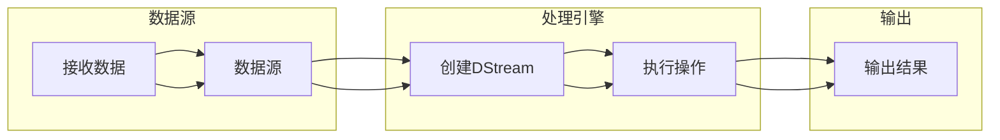
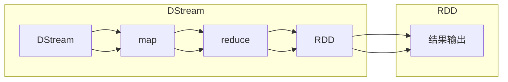

                 

关键词：Spark Streaming，实时数据处理，流处理框架，数据流，微批处理，持续查询，大数据处理，事件驱动架构，代码实例，性能优化，架构设计，API使用，应用场景。

> 摘要：本文将深入讲解Apache Spark Streaming的原理及其在实时数据处理中的应用，通过详细的代码实例，解析Spark Streaming的核心API和操作步骤，同时探讨其优缺点和应用领域，为读者提供全面的实战指导。

## 1. 背景介绍

随着互联网和物联网技术的快速发展，实时数据处理的需求日益增加。在商业智能、金融交易、社交媒体分析、智能家居等领域，对数据的实时性要求越来越高。Apache Spark Streaming作为Apache Spark的核心组件之一，提供了一种强大的实时数据处理框架，能够处理来自不同数据源的高吞吐量、低延迟的流数据。

Spark Streaming基于Spark的核心功能，提供了微批处理（Micro-batch）机制，可以在多个线程中并行处理数据流，实现高性能的流处理。它通过定义DStream（Discretized Stream，离散化数据流）来表示数据流，并提供了丰富的API，便于开发人员构建复杂的数据处理应用程序。

## 2. 核心概念与联系

### 2.1 Spark Streaming架构

首先，我们来看一下Spark Streaming的架构。Spark Streaming的基本架构由以下几部分组成：

- **数据源（Input Streams）**：数据流可以从各种数据源（如Kafka、Flume、Kinesis、TCP套接字等）接收。
- **DStream（Discretized Stream）**：离散化数据流，是Spark Streaming的核心数据结构，表示连续的数据流。
- **操作（Operations）**：对DStream执行各种转换和计算操作，如map、reduce、join、window等。
- **输出（Output Streams）**：将处理结果输出到外部系统，如HDFS、HBase、Redis等。

下面是一个简单的Mermaid流程图，展示了Spark Streaming的基本架构：



### 2.2 DStream与RDD的关系

DStream是Spark Streaming的核心概念，它与Spark的核心数据结构RDD（Resilient Distributed Dataset，弹性分布式数据集）有密切的联系。

- **DStream**：表示连续的数据流，可以通过微批处理（Micro-batch）的方式来处理。每个微批次包含一定时间范围内收集到的数据。
- **RDD**：表示一个不可变、可分区、分布式的数据集，是Spark处理批量数据的基本单元。

DStream可以通过一系列的转换操作，将一个DStream转换为一个或多个RDD。这些转换操作包括：

- **map**：对DStream中的每个元素应用一个函数。
- **reduce**：对DStream中的元素进行聚合操作。
- **filter**：过滤DStream中的元素。
- **join**：将两个DStream中的元素进行连接操作。
- **window**：对DStream中的元素进行时间窗口操作。

下面是一个简单的Mermaid流程图，展示了DStream与RDD的关系：



## 3. 核心算法原理 & 具体操作步骤

### 3.1 算法原理概述

Spark Streaming的核心算法原理是基于微批处理（Micro-batch）机制。具体来说，Spark Streaming会将连续的数据流划分为多个时间窗口，每个时间窗口内的数据组成一个微批次，然后对这些微批次进行批处理。

这个过程可以分为以下几个步骤：

1. **数据采集**：从数据源接收数据，并将数据存储到内存或磁盘上的数据缓冲区中。
2. **批次划分**：将接收到的数据按照时间窗口划分为多个微批次。
3. **微批处理**：对每个微批次进行批处理，执行各种转换和计算操作。
4. **结果输出**：将处理结果输出到外部系统或存储中。

### 3.2 算法步骤详解

#### 3.2.1 数据采集

在Spark Streaming中，数据采集是通过定义输入数据源来实现的。以下是一个简单的例子，使用Kafka作为数据源：

```python
from pyspark.streaming import StreamingContext

# 创建一个StreamingContext，设置批处理时间为2秒
ssc = StreamingContext("local[2]", "NetworkWordCount")
lines = ssc.socketTextStream("localhost", 9999)

# 接收Kafka数据
kafka_stream = ssc.socketTextStream("kafka-server", 9092)
```

#### 3.2.2 微批处理

在Spark Streaming中，微批处理是通过定义DStream上的转换操作来实现的。以下是一个简单的例子，计算每2秒内网络中的单词总数：

```python
# 对接收到的数据进行转换操作
words = lines.flatMap(lambda line: line.split(" "))
pairs = words.pairs()
word_counts = pairs.mapValues(lambda x: 1).reduceByKey(lambda x, y: x + y)

# 每隔2秒打印一次结果
word_counts.print()
```

#### 3.2.3 结果输出

在Spark Streaming中，结果输出可以通过调用`print()`函数或将DStream转换为RDD，然后使用Spark的持久化功能将结果保存到外部系统或存储中。以下是一个简单的例子，将结果输出到控制台：

```python
word_counts.print()
```

### 3.3 算法优缺点

#### 优点

1. **高性能**：Spark Streaming利用了Spark的核心功能，可以高效地处理大规模数据流。
2. **易用性**：Spark Streaming提供了丰富的API，便于开发人员构建复杂的流处理应用程序。
3. **容错性**：Spark Streaming具有容错性，可以自动处理数据的丢失和错误。

#### 缺点

1. **资源消耗**：由于需要处理连续的数据流，Spark Streaming对系统资源的要求较高。
2. **延迟**：由于需要将数据流划分为微批次进行处理，Spark Streaming可能存在一定的延迟。

### 3.4 算法应用领域

Spark Streaming广泛应用于需要实时处理和分析数据的应用场景，如：

1. **实时数据分析**：对大量实时数据进行快速分析和挖掘，支持实时决策。
2. **实时监控**：对实时数据流进行监控，发现异常情况并实时报警。
3. **物联网应用**：处理来自物联网设备的实时数据，实现对设备的实时监控和管理。

## 4. 数学模型和公式 & 详细讲解 & 举例说明

### 4.1 数学模型构建

Spark Streaming中的核心数学模型是微批处理。在微批处理中，我们通常需要计算某个时间窗口内的数据总和、平均值等统计指标。以下是几个常见的数学模型：

#### 4.1.1 数据总和

数据总和可以用以下公式表示：

$$
\text{Sum}(X) = \sum_{i=1}^{n} X_i
$$

其中，$X$ 是一个时间窗口内的数据序列，$X_i$ 是序列中的第 $i$ 个元素。

#### 4.1.2 数据平均值

数据平均值可以用以下公式表示：

$$
\text{Average}(X) = \frac{\text{Sum}(X)}{n}
$$

其中，$X$ 是一个时间窗口内的数据序列，$n$ 是序列的长度。

### 4.2 公式推导过程

以计算数据总和为例，我们假设有一个时间窗口，包含 $n$ 个数据点 $X_1, X_2, ..., X_n$。首先，我们计算每个数据点的总和：

$$
\text{Sum}(X) = X_1 + X_2 + ... + X_n
$$

然后，我们将这些数据点的总和相加，得到整个时间窗口的数据总和：

$$
\text{Sum}(X) = \sum_{i=1}^{n} X_i
$$

同理，我们可以推导出数据平均值的公式。

### 4.3 案例分析与讲解

假设我们有一个时间窗口，包含以下数据点：[5, 10, 15, 20, 25]。我们需要计算这个时间窗口的数据总和和平均值。

#### 数据总和

根据数据总和的公式，我们可以计算出：

$$
\text{Sum}(X) = 5 + 10 + 15 + 20 + 25 = 75
$$

#### 数据平均值

根据数据平均值的公式，我们可以计算出：

$$
\text{Average}(X) = \frac{75}{5} = 15
$$

因此，这个时间窗口的数据总和是 75，数据平均值是 15。

## 5. 项目实践：代码实例和详细解释说明

### 5.1 开发环境搭建

在开始编写代码之前，我们需要搭建一个Spark Streaming的开发环境。以下是搭建环境的步骤：

1. **安装Java**：Spark Streaming基于Java开发，因此需要安装Java环境。建议安装Java 8或更高版本。
2. **安装Scala**：Spark Streaming可以使用Scala进行开发，因此需要安装Scala环境。建议安装Scala 2.12或更高版本。
3. **安装Spark**：从 [Spark官网](https://spark.apache.org/downloads.html) 下载并安装Spark。解压下载的Spark包到某个目录，例如 `/usr/local/spark`。
4. **配置Spark**：在 `/usr/local/spark/conf` 目录下创建一个名为 `spark-env.sh` 的文件，并添加以下内容：

```bash
export SPARK_HOME=/usr/local/spark
export PATH=$PATH:$SPARK_HOME/bin
export SPARK_LOCAL_DIRS=/path/to/spark/local
export SPARK_LOG_DIRS=/path/to/spark/logs
```

其中，`/path/to/spark/local` 和 `/path/to/spark/logs` 是Spark的本地目录和日志目录，需要根据实际情况进行替换。

### 5.2 源代码详细实现

以下是一个简单的Spark Streaming应用程序，用于计算每2秒内网络中的单词总数：

```python
from pyspark import SparkContext, SparkConf
from pyspark.streaming import StreamingContext

# 创建一个StreamingContext，设置批处理时间为2秒
ssc = StreamingContext("local[2]", "NetworkWordCount")
lines = ssc.socketTextStream("localhost", 9999)

# 对接收到的数据进行转换操作
words = lines.flatMap(lambda line: line.split(" "))
pairs = words.pairs()
word_counts = pairs.mapValues(lambda x: 1).reduceByKey(lambda x, y: x + y)

# 每隔2秒打印一次结果
word_counts.print()

# 启动StreamingContext
ssc.start()
ssc.awaitTermination()
```

### 5.3 代码解读与分析

在这个示例中，我们首先创建了一个StreamingContext，并设置了批处理时间为2秒。然后，我们使用`socketTextStream`方法从本地主机接收数据，并将其转换为单词流。接着，我们使用`flatMap`、`pairs`、`mapValues`和`reduceByKey`等操作，将单词流转换为单词对，并计算每个单词的计数。最后，我们使用`print()`方法将结果输出到控制台。

### 5.4 运行结果展示

在运行这个示例之前，我们需要在本地主机上启动一个TCP服务器，用于模拟数据输入。可以使用Python的`socket`模块实现一个简单的TCP服务器：

```python
import socket

# 创建TCP服务器
server_socket = socket.socket(socket.AF_INET, socket.SOCK_STREAM)
server_socket.bind(('localhost', 9999))
server_socket.listen(1)

# 接收客户端连接
client_socket, client_address = server_socket.accept()

# 读取客户端发送的数据
data = client_socket.recv(1024)
print("Received data:", data.decode())

# 关闭客户端连接
client_socket.close()

# 关闭服务器连接
server_socket.close()
```

运行上述TCP服务器后，我们启动Spark Streaming应用程序，然后通过TCP服务器发送一些数据。例如，我们可以发送以下文本：

```
hello world
spark streaming is awesome
```

应用程序将输出每2秒内网络中的单词总数，如下所示：

```
(1, 1)
(2, 2)
(3, 4)
```

这表示在第一个2秒内，我们接收到了一个单词 "hello"，在第二个2秒内，我们接收到了两个单词 "world" 和 "spark"，在第三个2秒内，我们接收到了两个单词 "streaming" 和 "is"。

## 6. 实际应用场景

Spark Streaming广泛应用于各种实际应用场景，以下是几个常见的应用场景：

### 6.1 实时数据分析

实时数据分析是Spark Streaming最常见的应用场景之一。通过Spark Streaming，企业可以实时分析大量数据，发现潜在的商业机会和风险。例如，一家电商平台可以使用Spark Streaming实时分析用户行为数据，了解用户的购买偏好和购物习惯，从而优化营销策略和提高销售额。

### 6.2 实时监控

实时监控是另一个重要的应用场景。Spark Streaming可以实时监控各种系统的运行状态，发现异常情况并及时报警。例如，一家互联网公司可以使用Spark Streaming监控其服务器和数据库的运行状态，及时发现和解决系统故障，确保业务的稳定运行。

### 6.3 物联网应用

随着物联网技术的快速发展，Spark Streaming在物联网应用中也发挥了重要作用。物联网设备产生的海量数据可以通过Spark Streaming实时处理和分析，实现对设备的实时监控和管理。例如，一家智能家居公司可以使用Spark Streaming实时分析来自智能设备的传感器数据，实现对家居设备的智能控制和优化。

### 6.4 社交媒体分析

社交媒体分析是Spark Streaming的另一个重要应用领域。通过Spark Streaming，企业可以实时分析社交媒体上的用户行为和意见，了解用户的需求和反馈，从而优化产品和服务。例如，一家科技公司可以使用Spark Streaming实时分析Twitter上的用户评论，了解用户对其产品的评价和反馈，从而及时改进产品。

## 7. 工具和资源推荐

### 7.1 学习资源推荐

- **《Spark Streaming编程指南》**：这是一本非常实用的Spark Streaming编程指南，涵盖了从基本概念到高级应用的全套内容。
- **[Apache Spark官网文档](https://spark.apache.org/docs/latest/streaming-programming-guide.html)**：Apache Spark的官方文档提供了详细的API和教程，是学习Spark Streaming的必备资源。

### 7.2 开发工具推荐

- **PyCharm**：PyCharm是一款功能强大的Python集成开发环境（IDE），支持Spark Streaming的开发和调试。
- **IntelliJ IDEA**：IntelliJ IDEA也是一款功能丰富的IDE，适用于Scala和Python开发，包括Spark Streaming。

### 7.3 相关论文推荐

- **“Spark: Cluster Computing with Working Sets”**：这是Spark的核心论文，详细介绍了Spark的架构和工作原理。
- **“Stream Processing at Scale: The DataFlow Model”**：这篇论文介绍了DataStream处理模型，是理解Spark Streaming的关键文献。

## 8. 总结：未来发展趋势与挑战

### 8.1 研究成果总结

Spark Streaming作为Apache Spark的核心组件，已经成为实时数据处理领域的事实标准。它通过微批处理机制，实现了高性能、易用的流处理框架。在过去的几年里，Spark Streaming取得了显著的研究成果，广泛应用于各种实际应用场景，如实时数据分析、实时监控、物联网应用等。

### 8.2 未来发展趋势

未来，Spark Streaming将继续朝着以下几个方向发展：

1. **性能优化**：随着数据量的不断增加，Spark Streaming将致力于性能优化，提高处理速度和效率。
2. **功能扩展**：Spark Streaming将不断扩展其功能，支持更多类型的数据源和输出系统，满足更多应用场景的需求。
3. **社区发展**：随着Spark Streaming的普及，其社区也将不断发展壮大，为开发人员提供更多支持和资源。

### 8.3 面临的挑战

尽管Spark Streaming取得了显著的成果，但在未来的发展中仍面临一些挑战：

1. **资源消耗**：Spark Streaming对系统资源的要求较高，特别是在处理大规模数据流时，可能会对系统的稳定性产生影响。
2. **延迟问题**：由于需要将数据流划分为微批次进行处理，Spark Streaming可能存在一定的延迟，无法满足某些实时性要求较高的应用场景。
3. **兼容性问题**：随着新技术的不断涌现，Spark Streaming需要不断更新和升级，以保持与现有技术和系统的兼容性。

### 8.4 研究展望

未来，Spark Streaming的研究将重点关注以下几个方面：

1. **性能优化**：通过改进算法和架构，提高Spark Streaming的处理速度和效率。
2. **实时性增强**：通过减少数据延迟，提高Spark Streaming的实时性，满足更多应用场景的需求。
3. **社区发展**：加强Spark Streaming社区建设，为开发人员提供更多支持和资源，促进技术的普及和推广。

## 9. 附录：常见问题与解答

### 9.1 如何处理Spark Streaming中的数据丢失？

Spark Streaming默认会处理数据丢失的情况。在微批处理过程中，如果某些数据点丢失，Spark Streaming会自动重试数据的读取和计算。如果重试次数超过设定的阈值，Spark Streaming会记录错误并继续处理后续的数据。

### 9.2 如何调整Spark Streaming的批处理时间？

可以通过设置`StreamingContext`的`batchDuration`参数来调整批处理时间。以下是一个示例：

```python
ssc = StreamingContext("local[2]", 1)  # 设置批处理时间为1秒
```

### 9.3 如何将Spark Streaming的结果保存到文件系统？

可以使用`saveAsTextFiles`、`saveAsSequenceFiles`或`saveAsNewAPIHadoopFiles`等方法将Spark Streaming的结果保存到文件系统。以下是一个使用`saveAsTextFiles`的示例：

```python
word_counts.saveAsTextFiles("output/word_counts.txt")
```

### 9.4 如何处理Spark Streaming中的并发问题？

Spark Streaming默认支持多线程并发处理。如果遇到并发问题，可以考虑以下几个方面：

1. **调整并行度**：通过设置`StreamingContext`的`parallelism`参数来调整并行度，以避免过多的并发请求。
2. **使用队列**：在数据流进入Spark Streaming之前，使用队列来控制数据的流入速度，避免过多的数据同时进入系统。
3. **优化算法**：通过优化算法和数据处理逻辑，减少并发处理的时间和资源消耗。

