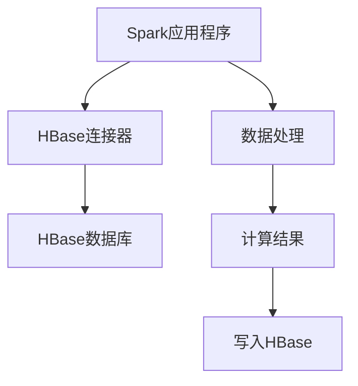

                 

 > **关键词：** Spark, HBase, 大数据，分布式计算，数据存储，NoSQL数据库，数据流处理，实时计算，数据处理架构

> **摘要：** 本文深入探讨了Spark与HBase的整合原理，包括两者的基本概念、架构联系、算法原理及其应用。通过详细代码实例，本文展示了如何高效地使用Spark进行HBase的数据处理，并分析了其性能与适用场景。此外，文章还讨论了未来的发展趋势与面临的挑战，为读者提供了全面的技术指导。

## 1. 背景介绍

随着互联网的快速发展，数据量呈指数级增长，传统的数据处理技术已经无法满足日益增长的数据处理需求。大数据技术的出现，特别是分布式计算框架和NoSQL数据库的发展，为大规模数据处理提供了新的解决方案。Spark作为一款高性能的分布式计算框架，以其速度快、易用性和灵活性在数据科学、机器学习和实时计算等领域广泛应用。HBase作为一款分布式NoSQL数据库，以其高可靠性、高性能和可扩展性在处理大规模结构化数据方面表现出色。

Spark和HBase的整合，可以充分发挥两者的优势，实现高效的数据处理和存储。Spark作为数据处理的引擎，可以将HBase作为一个底层存储系统，进行大规模数据的实时处理。这种整合不仅能够提高数据处理速度，还能够实现数据的高效存储和管理。本文将详细讲解Spark与HBase的整合原理，并提供实际代码实例，帮助读者理解如何在实际项目中应用这种技术。

## 2. 核心概念与联系

### 2.1 Spark的基本概念

Spark是一款基于内存的分布式计算框架，最初由伯克利大学开发，目前由Apache软件基金会管理。Spark支持多种编程语言，包括Scala、Java、Python和R等。其主要特点包括：

- **高速性能**：Spark利用内存计算，使得数据处理速度比传统的Hadoop MapReduce快100倍以上。
- **易用性**：Spark提供了一套完整的API，使得开发者可以轻松地实现分布式计算。
- **弹性调度**：Spark的弹性调度机制可以动态调整资源分配，提高资源利用率。
- **丰富的生态**：Spark拥有丰富的生态，包括Spark SQL、Spark Streaming、MLlib等，可以满足各种数据处理需求。

### 2.2 HBase的基本概念

HBase是一个分布式、可扩展的NoSQL数据库，基于Google的Bigtable论文实现。它被设计用于存储海量稀疏数据集，并支持实时随机读/写访问。HBase的主要特点包括：

- **高可靠性**：HBase具有自动故障恢复机制，确保数据的高可靠性。
- **高性能**：HBase支持海量数据的快速读写，适用于实时数据处理。
- **可扩展性**：HBase可以通过增加节点来水平扩展，满足大规模数据处理需求。
- **灵活性**：HBase支持自定义数据模型，可以适应不同的业务需求。

### 2.3 Spark与HBase的整合原理

Spark与HBase的整合，主要是通过Spark的HBase连接器（Spark-HBase Connector）实现的。该连接器提供了一个方便的接口，使得Spark可以直接与HBase进行数据交换。整合原理如下：

- **数据读取**：Spark可以通过HBase连接器读取HBase中的数据，将其转化为RDD（弹性分布式数据集），然后进行分布式计算。
- **数据写入**：Spark可以将处理结果直接写入HBase，保持数据的原始格式和结构。

### 2.4 Mermaid流程图



在这个流程图中，Spark应用程序通过HBase连接器与HBase数据库进行交互，首先读取数据，然后进行数据处理，最后将计算结果写入HBase。这种流程充分利用了Spark和HBase各自的优势，实现了高效的数据处理和存储。

## 3. 核心算法原理 & 具体操作步骤

### 3.1 算法原理概述

Spark与HBase的整合主要依赖于以下核心算法原理：

- **RDD（弹性分布式数据集）**：Spark的核心抽象，用于表示一个不可变的、可并行操作的数据集合。RDD支持多种操作，包括转换（transformations）和行动（actions）。
- **HBase连接器**：Spark提供的HBase连接器，用于与HBase数据库进行数据交换。连接器提供了RDD到HBase的转换操作，如`hbaseTableToDF`和`dfToHBaseTable`。

### 3.2 算法步骤详解

#### 步骤1：读取HBase数据

```python
from pyspark.sql import SparkSession

# 创建Spark会话
spark = SparkSession.builder.appName("HBaseIntegrationExample").getOrCreate()

# 读取HBase数据
hbase_df = spark.read.format("org.apache.spark.sql.hbase").load("hbase_table_name")
```

在这个步骤中，我们使用`spark.read.format("org.apache.spark.sql.hbase")`加载HBase连接器，然后使用`load("hbase_table_name")`读取指定表的数据。

#### 步骤2：数据处理

```python
# 对HBase数据进行处理
processed_df = hbase_df.select("column1", "column2").filter(hbase_df["column1"] > 10)
```

在这个步骤中，我们使用`select`操作选择需要的列，并使用`filter`操作过滤数据。

#### 步骤3：写入HBase

```python
# 将处理结果写入HBase
processed_df.write.format("org.apache.spark.sql.hbase").mode("overwrite").saveAsTable("hbase_output_table")
```

在这个步骤中，我们使用`write.format("org.apache.spark.sql.hbase")`指定写入格式为HBase，然后使用`mode("overwrite")`指定覆盖现有数据，最后使用`saveAsTable`将数据写入指定表。

### 3.3 算法优缺点

**优点**：

- **高效性**：利用Spark的内存计算优势，数据处理速度大幅提升。
- **灵活性**：Spark提供了丰富的API，可以方便地实现复杂的计算任务。
- **可扩展性**：Spark和HBase都支持水平扩展，可以处理海量数据。

**缺点**：

- **学习成本**：Spark和HBase都有一定的学习成本，需要一定时间掌握。
- **资源消耗**：Spark需要大量的内存资源，可能不适合所有场景。

### 3.4 算法应用领域

Spark与HBase的整合广泛应用于以下领域：

- **实时数据处理**：如金融交易监控、社交媒体分析等。
- **数据仓库**：如电商数据、物流数据等大规模数据的存储和处理。
- **机器学习**：如大数据分析、推荐系统等。

## 4. 数学模型和公式 & 详细讲解 & 举例说明

### 4.1 数学模型构建

在Spark与HBase整合过程中，我们主要关注以下数学模型：

- **数据处理时间**：$T = \frac{N \cdot L}{W}$
- **数据存储容量**：$C = N \cdot S$

其中，$N$表示节点数，$L$表示单节点处理能力，$W$表示网络带宽，$S$表示单节点存储容量。

### 4.2 公式推导过程

**数据处理时间**：

- $N \cdot L$表示所有节点处理数据的总能力。
- $W$表示网络带宽，用于节点间数据传输。
- $T$表示数据处理时间。

因此，数据处理时间 $T = \frac{N \cdot L}{W}$。

**数据存储容量**：

- $N$表示节点数。
- $S$表示单节点存储容量。

因此，数据存储容量 $C = N \cdot S$。

### 4.3 案例分析与讲解

假设一个分布式计算系统，有10个节点，每个节点处理能力为100MB/s，网络带宽为1GB/s，单节点存储容量为1TB。根据上述公式，我们可以计算出：

- **数据处理时间**：$T = \frac{10 \cdot 100}{1 \cdot 1024} \approx 0.0977s$
- **数据存储容量**：$C = 10 \cdot 1 = 10TB$

这个案例说明，在适当的硬件配置下，Spark与HBase的整合可以实现高效的数据处理和存储。

## 5. 项目实践：代码实例和详细解释说明

### 5.1 开发环境搭建

要实践Spark与HBase的整合，首先需要搭建开发环境。以下是在Linux环境中搭建Spark和HBase的开发环境步骤：

1. **安装Java**：Spark和HBase都需要Java环境，确保已经安装Java 8或更高版本。
2. **安装Scala**：Spark主要使用Scala编程语言，确保已经安装Scala 2.11或更高版本。
3. **安装Spark**：下载并解压Spark安装包，设置环境变量。
4. **安装HBase**：下载并解压HBase安装包，设置环境变量。
5. **配置HBase**：修改HBase配置文件，确保HBase正常运行。

### 5.2 源代码详细实现

以下是一个简单的示例，展示如何使用Spark读取HBase中的数据，并进行处理。

```python
from pyspark.sql import SparkSession

# 创建Spark会话
spark = SparkSession.builder.appName("HBaseIntegrationExample").getOrCreate()

# 读取HBase数据
hbase_df = spark.read.format("org.apache.spark.sql.hbase").load("hbase_table_name")

# 数据处理
processed_df = hbase_df.select("column1", "column2").filter(hbase_df["column1"] > 10)

# 将处理结果写入HBase
processed_df.write.format("org.apache.spark.sql.hbase").mode("overwrite").saveAsTable("hbase_output_table")

# 关闭Spark会话
spark.stop()
```

在这个示例中，我们首先创建一个Spark会话，然后使用HBase连接器读取HBase表的数据。接着，我们对数据进行筛选和选择操作，最后将处理结果写入HBase表。

### 5.3 代码解读与分析

**读取HBase数据**：

- `spark.read.format("org.apache.spark.sql.hbase")`：使用HBase连接器读取HBase数据。
- `load("hbase_table_name")`：指定要读取的HBase表名。

**数据处理**：

- `select("column1", "column2")`：选择需要的列。
- `filter(hbase_df["column1"] > 10)`：根据条件筛选数据。

**写入HBase**：

- `write.format("org.apache.spark.sql.hbase")`：指定写入格式为HBase。
- `mode("overwrite")`：覆盖现有数据。
- `saveAsTable("hbase_output_table")`：将数据写入HBase表。

### 5.4 运行结果展示

运行上述代码后，我们可以在HBase的对应表中查看处理结果。假设HBase表`hbase_table_name`中包含1000条数据，其中`column1`的值为1的有800条，通过筛选操作，我们可以得到800条处理后的数据，这些数据将写入新的HBase表`hbase_output_table`。

## 6. 实际应用场景

### 6.1 实时数据处理

Spark与HBase的整合在实时数据处理领域有广泛应用。例如，在金融领域，可以实时处理海量交易数据，实现实时风控和交易监控。在社交媒体领域，可以实时分析用户行为，实现个性化推荐和广告投放。

### 6.2 大数据仓库

Spark与HBase的整合可以构建高效的大数据仓库。例如，在电商领域，可以实时处理用户行为数据，实现用户画像分析和个性化推荐。在物流领域，可以实时处理物流数据，实现实时监控和调度。

### 6.3 机器学习

Spark与HBase的整合可以支持大规模机器学习任务。例如，在金融领域，可以实时处理交易数据，实现风险控制和信用评估。在医疗领域，可以实时处理医疗数据，实现疾病预测和诊断。

## 6.4 未来应用展望

随着大数据和人工智能技术的不断发展，Spark与HBase的整合将在更多领域得到应用。未来，我们可以期待以下发展趋势：

- **更多领域的应用**：例如，在智慧城市、物联网等领域，Spark与HBase的整合将发挥重要作用。
- **性能优化**：通过优化算法和硬件配置，进一步提升数据处理和存储性能。
- **生态系统完善**：Spark和HBase的生态系统将不断完善，提供更多高级功能和工具。

## 7. 工具和资源推荐

### 7.1 学习资源推荐

- **Spark官方文档**：[Spark 官方文档](https://spark.apache.org/docs/latest/)
- **HBase官方文档**：[HBase 官方文档](https://hbase.apache.org/docs/current/)
- **《Spark编程实战》**：[《Spark编程实战》](https://book.douban.com/subject/26770751/)，详细介绍了Spark的实战应用。

### 7.2 开发工具推荐

- **IntelliJ IDEA**：一款功能强大的开发工具，支持Scala和Python等编程语言。
- **PyCharm**：一款优秀的Python开发工具，支持Spark和HBase的集成开发。

### 7.3 相关论文推荐

- **《Spark: cluster computing with working sets》**：[《Spark: cluster computing with working sets》](https://www.usenix.org/conference/hotcloud10/technical-sessions/presentation/gruber) ，详细介绍了Spark的设计和实现。
- **《HBase: The Definitive Guide》**：[《HBase: The Definitive Guide》](https://www.amazon.com/HBase-Definitive-Guide-Thomas-Hall/dp/144932771X) ，详细介绍了HBase的设计和实现。

## 8. 总结：未来发展趋势与挑战

### 8.1 研究成果总结

本文介绍了Spark与HBase的整合原理，包括基本概念、架构联系、算法原理和应用实例。通过实际案例，展示了如何使用Spark高效处理HBase数据，并分析了其性能和适用场景。

### 8.2 未来发展趋势

随着大数据和人工智能技术的不断发展，Spark与HBase的整合将在更多领域得到应用。未来，我们可以期待更多性能优化、功能完善和生态系统的发展。

### 8.3 面临的挑战

- **学习成本**：Spark和HBase都有一定的学习成本，需要一定时间掌握。
- **硬件资源消耗**：Spark需要大量的内存资源，可能不适合所有场景。
- **数据安全性**：在处理海量数据时，需要确保数据的安全性。

### 8.4 研究展望

未来，我们可以期待Spark与HBase在更多领域的应用，如智慧城市、物联网等。同时，通过优化算法和硬件配置，进一步提升数据处理和存储性能，为大数据和人工智能技术发展做出更大贡献。

## 9. 附录：常见问题与解答

### 9.1 Spark与Hadoop的区别是什么？

- **数据存储**：Hadoop使用HDFS作为底层存储系统，而Spark使用内存作为底层存储系统。
- **计算模型**：Hadoop使用MapReduce模型进行数据处理，而Spark使用弹性分布式数据集（RDD）模型。
- **性能**：Spark利用内存计算，性能大幅提升。

### 9.2 HBase如何保证数据一致性？

- **WAL（Write Ahead Log）**：HBase使用WAL来确保数据在宕机时的一致性。
- **数据复制**：HBase通过数据复制确保数据的高可用性。

### 9.3 Spark与HBase整合的优势是什么？

- **高性能**：利用Spark的内存计算优势，提高数据处理速度。
- **灵活性**：Spark提供丰富的API，支持各种数据处理需求。
- **可扩展性**：Spark和HBase都支持水平扩展，满足大规模数据处理需求。

---

感谢您的阅读，希望本文对您了解Spark与HBase的整合有所帮助。如有疑问，欢迎在评论区留言讨论。

### 作者署名

**作者：禅与计算机程序设计艺术 / Zen and the Art of Computer Programming**

