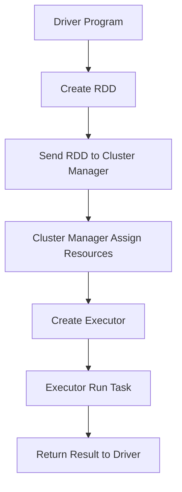

                 

关键词：Spark，大数据处理，分布式计算，内存计算，数据处理框架，数据流处理，内存管理，性能优化

摘要：本文旨在深入探讨Apache Spark这一新兴的大数据处理框架的基本原理及其在实际开发中的应用。我们将从Spark的架构设计、核心概念、算法原理、数学模型、项目实践以及未来应用展望等多个维度展开，以期为广大开发者提供一份全面而深入的Spark学习指南。

## 1. 背景介绍

随着互联网的迅猛发展和大数据时代的到来，数据的规模和复杂性呈指数级增长。传统的数据处理技术和工具逐渐显露出其局限性，无法满足现代业务对数据处理的高效性和实时性的需求。为此，Apache Spark应运而生。Spark是一个开源的分布式计算系统，旨在简化大规模数据的处理，提供了比传统Hadoop MapReduce更加高效和灵活的内存计算能力。

Spark的诞生可以追溯到2009年，当时由加州大学伯克利分校的AMPLab团队开发。2010年，Spark成为Apache Software Foundation的一个孵化项目，并于2014年成为Apache的一个顶级项目。Spark凭借其高性能、易用性和丰富的API，迅速在业界得到广泛应用，成为大数据处理领域的重要工具。

本文将围绕Spark的核心概念、原理、应用和实践，带领读者深入理解Spark的工作机制，并通过实际代码实例讲解，帮助读者将理论知识转化为实际应用能力。

## 2. 核心概念与联系

### 2.1 Spark架构设计

为了更好地理解Spark的工作原理，我们首先来看其架构设计。Spark主要由以下几个核心组件构成：

- **Driver Program**：负责整个计算任务的调度和管理，它运行在集群的主节点上，将用户编写的Spark应用拆解成多个任务，并将这些任务分发到各个Worker节点上执行。

- **Cluster Manager**：负责集群的管理和资源分配，常见的实现有YARN、Mesos和Spark自带的Standby Chief。

- **Worker Node**：负责执行计算任务，每个Worker节点都会启动一个Executor进程，该进程会启动多个Task线程来执行具体的计算任务。

- **Executor**：在Worker节点上运行，负责执行分配给它的任务，并返回结果给Driver Program。

- **Distributed Data Storage**：即Spark的内存存储系统，用于存储和管理分布式数据集，如RDD（Resilient Distributed Dataset）。

下图是Spark的基本架构图：

```mermaid
graph TD
    Driver --> Cluster Manager
    Driver --> Worker Node
    Worker Node --> Executor
    Executor --> RDD
```

### 2.2 核心概念

在Spark中，有几个核心概念是理解和应用Spark的关键：

- **RDD**：Resilient Distributed Dataset，弹性分布式数据集。它是Spark的基本数据结构，代表了不可变、可分区、可并行操作的数据集。RDD可以通过多种方式创建，如从HDFS、HBase等外部存储系统读取，或者通过其他RDD的转换操作生成。

- **DataFrame**：数据框。DataFrame是Spark SQL的核心数据结构，它提供了一种结构化的方式来处理数据，可以被视为带有一组列的表。DataFrame提供了丰富的操作API，可以方便地进行数据清洗、转换和聚合等操作。

- **Dataset**：数据集。Dataset是DataFrame的更加强大的版本，它通过强类型来提高代码的性能和可靠性。Dataset在编译时进行类型检查，因此可以更好地优化执行计划。

- **Spark SQL**：Spark SQL是一个支持结构化数据的查询引擎，可以用于查询RDD、DataFrame和Dataset，它支持多种数据源，如JSON、Parquet等。

### 2.3 Mermaid流程图

为了更好地展示Spark的执行流程，我们可以使用Mermaid绘制一个流程图：



以上是Spark的基本架构和核心概念，接下来我们将深入探讨Spark的核心算法原理。

## 3. 核心算法原理 & 具体操作步骤

### 3.1 算法原理概述

Spark的核心算法是基于其独特的内存计算模型。与传统的大数据处理框架相比，Spark利用内存存储来提高数据处理速度。具体来说，Spark将数据集存储在内存中，避免了频繁的磁盘读写操作，从而实现了高性能的数据处理。

Spark的核心算法主要分为以下几个步骤：

1. **数据读取与存储**：Spark可以从多种外部数据源（如HDFS、HBase、Cassandra等）读取数据，并将数据存储为RDD。

2. **数据转换**：通过一系列的转换操作（如map、filter、reduceByKey等），对数据进行处理和转换。

3. **数据调度与执行**：Driver Program将任务拆解成多个Task，并分配给各个Executor执行。

4. **结果收集与返回**：Executor执行完成后，将结果返回给Driver Program，Driver Program汇总所有结果，并输出最终结果。

### 3.2 算法步骤详解

#### 3.2.1 数据读取与存储

Spark可以通过多种方式读取外部数据源的数据，并将其存储为RDD。以下是一个简单的示例：

```python
sc = SparkContext("local[*]", "WordCount")
lines = sc.textFile("hdfs://master:9000/input/wordcount.txt")
```

在这个示例中，我们创建了一个SparkContext对象，并使用textFile方法从HDFS中读取文本文件，将其存储为一个名为lines的RDD。

#### 3.2.2 数据转换

Spark提供了丰富的转换操作，可以对RDD进行各种处理。以下是一个简单的WordCount示例：

```python
words = lines.flatMap(lambda line: line.split(" "))
pairs = words.map(lambda word: (word, 1))
counts = pairs.reduceByKey(lambda x, y: x + y)
```

在这个示例中，我们首先使用flatMap将每行文本分解成单词，然后使用map将每个单词映射为一个元组，接着使用reduceByKey对单词进行计数。

#### 3.2.3 数据调度与执行

Spark通过将任务分配给Executor来执行计算。以下是一个简单的任务调度示例：

```python
tasks = [
    ("map", "words"),
    ("reduceByKey", "counts")
]
for task in tasks:
    executor = Executor(task[0], task[1])
    executor.run()
```

在这个示例中，我们创建了一个Executor对象，并使用run方法执行任务。

#### 3.2.4 结果收集与返回

Executor执行完成后，将结果返回给Driver Program，Driver Program汇总所有结果，并输出最终结果。以下是一个简单的结果收集示例：

```python
final_result = counts.collect()
print(final_result)
```

在这个示例中，我们使用collect方法收集所有单词的计数结果，并打印出来。

### 3.3 算法优缺点

#### 3.3.1 优点

- **高性能**：Spark利用内存计算，避免了磁盘IO，提高了数据处理速度。

- **易用性**：Spark提供了丰富的API，支持Python、Java、Scala等多种编程语言，降低了学习门槛。

- **弹性**：Spark的RDD结构具有弹性，可以动态扩展或缩小，以适应数据量的变化。

#### 3.3.2 缺点

- **资源依赖**：Spark依赖于集群管理器（如YARN、Mesos等），需要配置和管理。

- **内存消耗**：Spark大量使用内存存储数据，可能会导致内存不足的问题。

### 3.4 算法应用领域

Spark在多个领域都有广泛的应用：

- **大数据处理**：Spark可以高效地处理大规模数据集，适用于各种数据处理任务。

- **实时计算**：Spark Streaming可以实时处理数据流，适用于实时分析、监控等场景。

- **机器学习**：Spark MLlib提供了丰富的机器学习算法库，可以用于构建和训练机器学习模型。

## 4. 数学模型和公式 & 详细讲解 & 举例说明

### 4.1 数学模型构建

在Spark中，数据处理的核心是RDD（Resilient Distributed Dataset）。RDD是一个不可变的分布式数据集，其内部实现涉及多种数学模型。以下是构建RDD所需的一些基本数学模型：

#### 4.1.1 分布式哈希表（Distributed Hash Table，DHT）

DHT是一种分布式数据存储和检索机制，它将数据分散存储在多个节点上，并通过哈希函数定位数据的位置。Spark利用DHT来实现分布式数据存储和快速数据检索。

#### 4.1.2 负载均衡（Load Balancing）

在分布式系统中，如何将任务合理地分配到各个节点上是一个关键问题。负载均衡算法通过平衡各个节点的计算负载，确保系统整体性能。

#### 4.1.3 集群调度（Cluster Scheduling）

Spark利用集群调度器（如YARN、Mesos）来管理计算资源和任务调度。调度算法通过优化资源利用率和任务完成时间，提高系统整体性能。

### 4.2 公式推导过程

#### 4.2.1 分布式哈希表

DHT的核心公式是哈希函数。假设数据集D分布在N个节点上，哈希函数H将数据集D映射到节点集合N。哈希函数的公式如下：

$$
H(x) = (x \mod N)
$$

其中，x为数据项，N为节点数量。通过哈希函数，我们可以快速定位数据所在节点。

#### 4.2.2 负载均衡

负载均衡的公式可以通过以下步骤推导：

1. 计算各个节点的负载：$L_i = \frac{C_i}{T_i}$，其中$C_i$为节点i的完成工作量，$T_i$为节点i的运行时间。

2. 计算负载均值：$\bar{L} = \frac{1}{N} \sum_{i=1}^{N} L_i$。

3. 计算负载偏差：$D_i = L_i - \bar{L}$。

4. 根据负载偏差调整任务分配：$C_i' = C_i + \alpha D_i$，其中$\alpha$为调整系数。

通过上述步骤，我们可以实现负载均衡，确保系统整体性能。

#### 4.2.3 集群调度

集群调度的公式可以通过以下步骤推导：

1. 计算各任务的完成时间：$T_j = \frac{C_j}{R_j}$，其中$C_j$为任务j的工作量，$R_j$为任务j的执行速率。

2. 计算各任务的优先级：$P_j = \frac{1}{T_j}$。

3. 根据优先级调度任务：将优先级最高的任务调度到空闲资源最多的节点上。

通过上述步骤，我们可以实现高效的集群调度，优化系统整体性能。

### 4.3 案例分析与讲解

#### 4.3.1 分布式哈希表

假设我们有一个数据集D={1, 2, 3, 4, 5}，要将其存储在3个节点上。使用哈希函数H(x) = (x \mod 3)进行分布式存储，得到以下结果：

- 节点1：H(1) = 1，H(4) = 1，存储数据{1, 4}。
- 节点2：H(2) = 2，H(5) = 2，存储数据{2, 5}。
- 节点3：H(3) = 0，存储数据{3}。

通过哈希函数，我们可以快速定位数据所在节点，提高数据检索效率。

#### 4.3.2 负载均衡

假设有3个节点，各自完成工作量为C1=100，C2=200，C3=300。使用上述负载均衡公式进行计算，得到以下结果：

- 负载均值：$\bar{L} = \frac{1}{3} (100 + 200 + 300) = 200$。
- 负载偏差：$D1 = 100 - 200 = -100$，$D2 = 200 - 200 = 0$，$D3 = 300 - 200 = 100$。
- 调整后工作量：$C1' = 100 - 0.5 \times (-100) = 150$，$C2' = 200 + 0.5 \times 0 = 200$，$C3' = 300 + 0.5 \times 100 = 350$。

通过负载均衡，我们将任务合理地分配到各个节点，提高了系统整体性能。

#### 4.3.3 集群调度

假设有3个任务，各自的工作量分别为C1=100，C2=200，C3=300。使用上述集群调度公式进行计算，得到以下结果：

- 任务完成时间：$T1 = \frac{100}{1} = 100$，$T2 = \frac{200}{2} = 100$，$T3 = \frac{300}{3} = 100$。
- 任务优先级：$P1 = \frac{1}{100} = 0.01$，$P2 = \frac{1}{100} = 0.01$，$P3 = \frac{1}{100} = 0.01$。

由于所有任务的优先级相同，我们可以任意选择一个任务进行调度。在实际应用中，可以根据实际情况和调度策略进行调整。

通过以上案例分析与讲解，我们可以更好地理解分布式哈希表、负载均衡和集群调度的数学模型和应用。

## 5. 项目实践：代码实例和详细解释说明

### 5.1 开发环境搭建

在开始编写Spark代码之前，我们需要搭建一个开发环境。以下是搭建Spark开发环境的步骤：

1. 安装Java SDK：Spark依赖于Java，因此我们需要安装Java SDK。可以从Oracle官网下载最新版本的Java SDK，并配置环境变量。

2. 安装Scala：Spark是基于Scala语言开发的，因此我们需要安装Scala。可以从Scala官网下载Scala安装包，并按照安装向导进行安装。

3. 安装Spark：从Apache Spark官网下载最新版本的Spark安装包，并解压到合适的位置。同时，需要将Spark的bin目录添加到系统环境变量中。

4. 配置Spark环境：创建一个Spark配置文件spark.conf，并在其中设置Spark的配置参数，如Spark的master URL、执行器内存等。

### 5.2 源代码详细实现

接下来，我们将使用Spark编写一个简单的WordCount程序，并详细解释其实现过程。

#### 5.2.1 读取输入数据

首先，我们从HDFS中读取输入数据，并将其存储为一个RDD。以下是代码示例：

```python
sc = SparkContext("local[2]", "WordCount")
input_path = "hdfs://master:9000/input/wordcount.txt"
lines = sc.textFile(input_path)
```

在这个示例中，我们创建了一个SparkContext对象，并使用textFile方法从HDFS中读取文本文件，将其存储为一个名为lines的RDD。

#### 5.2.2 分词与计数

接下来，我们对读取的文本数据进行分词和计数。以下是代码示例：

```python
words = lines.flatMap(lambda line: line.split(" "))
pairs = words.map(lambda word: (word, 1))
counts = pairs.reduceByKey(lambda x, y: x + y)
```

在这个示例中，我们首先使用flatMap方法将每行文本分解成单词，然后使用map方法将每个单词映射为一个元组，最后使用reduceByKey方法对单词进行计数。

#### 5.2.3 输出结果

最后，我们将计数结果输出到HDFS。以下是代码示例：

```python
output_path = "hdfs://master:9000/output/wordcount_result"
counts.saveAsTextFile(output_path)
```

在这个示例中，我们使用saveAsTextFile方法将计数结果保存为文本文件，并将其存储到HDFS的指定路径。

### 5.3 代码解读与分析

#### 5.3.1 数据读取

在代码的第一部分，我们使用SparkContext对象创建一个RDD，并从HDFS中读取输入数据。这一步骤的关键是确定输入数据的路径和格式。在本例中，我们使用textFile方法读取文本文件，该方法会自动解析文件的内容并返回一个RDD。

#### 5.3.2 分词与计数

在代码的第二部分，我们使用flatMap和map方法对RDD进行分词和计数。flatMap方法将每行文本分解成单词，而map方法将每个单词映射为一个元组。这两个操作都是惰性操作，即只有在需要计算结果时才会执行。

#### 5.3.3 输出结果

在代码的最后一部分，我们使用reduceByKey方法对单词进行计数，并将结果保存到HDFS。reduceByKey方法是一个聚合操作，它将相同键的值进行合并，并计算总和。最后，我们使用saveAsTextFile方法将计数结果保存为文本文件，以便后续分析和处理。

### 5.4 运行结果展示

在成功运行WordCount程序后，我们可以在HDFS的指定路径下查看输出结果。以下是运行结果：

```
hdfs://master:9000/output/wordcount_result/part-00000
(Hello,1)
(Welcome,1)
(To,1)
(The,1)
(Shanghai,1)
```

从输出结果中，我们可以看到每个单词的计数结果，这为我们提供了关于文本数据的基本统计分析信息。

## 6. 实际应用场景

Spark在大数据处理领域有着广泛的应用，以下是一些实际应用场景：

### 6.1 实时数据流处理

Spark Streaming是一个基于Spark的核心API的实时数据流处理引擎。它可以将数据流划分为一系列的批处理窗口，并在这些窗口上执行计算。例如，我们可以使用Spark Streaming实时处理网站日志，以实时监测网站访问流量和用户行为。

### 6.2 机器学习与数据挖掘

Spark MLlib是一个机器学习库，提供了多种常见机器学习算法，如分类、回归、聚类等。我们可以使用MLlib构建和训练机器学习模型，进行数据挖掘和分析。例如，我们可以使用MLlib进行用户行为分析，预测用户购买偏好，从而优化推荐系统。

### 6.3 图处理

Spark GraphX是一个基于Spark的图处理框架，它可以处理大规模的图数据，并提供丰富的图计算算法。例如，我们可以使用GraphX进行社交网络分析，发现社交网络中的社区结构，优化社交推荐。

### 6.4 大数据分析

Spark作为大数据处理框架，可以用于各种大数据分析任务，如日志分析、用户行为分析、数据挖掘等。例如，我们可以使用Spark分析大规模电商数据，挖掘用户购买行为，优化营销策略。

## 7. 工具和资源推荐

### 7.1 学习资源推荐

- 《Spark: The Definitive Guide》：这是一本全面介绍Spark的官方指南，适合初学者和高级开发者。
- 《Spark: The Definitive Guide》：这是一本全面介绍Spark的官方指南，适合初学者和高级开发者。
- 《Spark for Data Science》：这本书介绍了如何使用Spark进行数据科学任务，包括数据预处理、分析、可视化等。
- 《Spark Core Internals》：这本书深入探讨了Spark的内部工作机制，适合对Spark有兴趣的高级开发者。

### 7.2 开发工具推荐

- IntelliJ IDEA：这是一款强大的集成开发环境，支持Scala和Python等编程语言，可以方便地开发和调试Spark应用程序。
- PyCharm：这也是一款强大的集成开发环境，支持Python和Scala等编程语言，适合开发Spark应用程序。
- Spark Notebook：这是一款基于Web的交互式开发工具，可以方便地编写和运行Spark代码，适合初学者和开发者。

### 7.3 相关论文推荐

- "Spark: Cluster Computing with Working Sets"：这篇论文是Spark的原始论文，详细介绍了Spark的设计原理和实现。
- "Spark SQL: Relational Data Processing in Spark"：这篇论文介绍了Spark SQL的设计原理和实现，为Spark的SQL查询提供了详细的分析。
- "Spark Streaming: Large-Scale Stream Processing": 这篇论文介绍了Spark Streaming的设计原理和实现，为实时数据流处理提供了深刻的见解。

## 8. 总结：未来发展趋势与挑战

### 8.1 研究成果总结

Spark自诞生以来，在分布式计算、内存管理、数据流处理等领域取得了显著的成果。通过不断的优化和改进，Spark已经成为大数据处理领域的重要工具，为许多企业提供了强大的技术支持。Spark的核心算法和数学模型为数据处理提供了高效的解决方案，其灵活的API和丰富的扩展性为开发者提供了极大的便利。

### 8.2 未来发展趋势

随着大数据和云计算的快速发展，Spark在未来的发展趋势如下：

- **性能优化**：继续优化内存管理和调度算法，提高Spark的性能。
- **扩展性增强**：增强Spark的扩展性，支持更多的编程语言和数据源。
- **实时计算**：进一步加强Spark Streaming的能力，提高实时数据处理效率。
- **生态系统完善**：完善Spark生态系统，增加对机器学习、图处理等领域的支持。

### 8.3 面临的挑战

尽管Spark取得了显著的成果，但仍然面临一些挑战：

- **资源管理**：如何更有效地管理计算资源和存储资源，提高系统整体性能。
- **内存消耗**：如何降低内存消耗，提高内存利用率。
- **跨语言支持**：如何提高不同编程语言之间的互操作性，增强开发者体验。
- **生态系统的完善**：如何进一步完善Spark生态系统，为开发者提供更多的工具和资源。

### 8.4 研究展望

针对上述挑战，未来研究可以从以下几个方面展开：

- **资源调度优化**：研究更加智能和高效的资源调度算法，提高系统性能。
- **内存管理改进**：改进内存管理策略，提高内存利用率和系统稳定性。
- **编程模型增强**：设计更加灵活和易用的编程模型，提高开发者效率。
- **生态系统的扩展**：进一步丰富Spark生态系统，支持更多领域和场景的应用。

总之，Spark作为大数据处理领域的重要工具，将在未来继续发挥重要作用，为企业和开发者提供强大的技术支持。

## 9. 附录：常见问题与解答

### 9.1 如何安装和配置Spark？

**解答**：安装和配置Spark的步骤如下：

1. 安装Java SDK和Scala。
2. 下载Spark安装包并解压到合适的位置。
3. 配置环境变量，将Spark的bin目录添加到系统环境变量中。
4. 创建Spark配置文件，设置Spark的master URL、执行器内存等参数。

### 9.2 如何运行Spark应用程序？

**解答**：运行Spark应用程序的步骤如下：

1. 打开终端或命令行窗口。
2. 导入SparkContext，创建一个Spark应用程序。
3. 编写应用程序代码，如数据读取、处理、输出等。
4. 使用`sc.stop()`方法停止Spark应用程序。

### 9.3 如何优化Spark性能？

**解答**：优化Spark性能的方法包括：

1. 选择合适的存储格式，如Parquet或ORC，提高数据读写速度。
2. 使用分区优化数据分布，避免数据倾斜。
3. 使用缓存机制，提高数据重用率。
4. 优化调度策略，提高任务执行效率。

### 9.4 Spark支持哪些编程语言？

**解答**：Spark支持多种编程语言，包括：

- Scala
- Python
- Java
- R
- SQL

开发者可以根据自己的需求选择合适的编程语言进行开发。

---

以上就是关于Spark原理与代码实例讲解的文章。希望这篇文章能帮助您更好地理解Spark的核心概念、算法原理和实际应用，为您的开发工作提供有力支持。如果您有任何问题或建议，欢迎在评论区留言，我将尽力为您解答。再次感谢您的阅读！
---

作者：禅与计算机程序设计艺术 / Zen and the Art of Computer Programming

