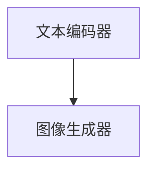

                 

在深度学习领域，稳定扩散模型（Stable Diffusion Model）近年来受到了广泛关注。它是一种基于深度学习的图像生成模型，能够在给定的文本描述下生成高质量的图像。本文将详细介绍Stable Diffusion模型的原理，并提供详细的代码实例讲解。

## 文章关键词

- Stable Diffusion
- 图像生成
- 深度学习
- 图像处理
- 计算机视觉

## 文章摘要

本文将首先介绍Stable Diffusion模型的基本概念和核心原理。随后，我们将通过一个具体的例子，详细讲解如何使用Stable Diffusion模型生成图像。最后，我们将讨论模型在实际应用中的前景和挑战。

## 1. 背景介绍

### 1.1 Stable Diffusion模型的起源

Stable Diffusion模型起源于深度学习领域的图像生成技术。随着生成对抗网络（GANs）和变分自编码器（VAEs）等模型的发展，图像生成技术在近年来取得了显著的进展。然而，这些模型在生成细节丰富、多样化且高质量的图像方面仍存在一定的局限性。Stable Diffusion模型旨在解决这一问题，通过引入新的深度学习架构和优化策略，实现了更高效、更高质量的图像生成。

### 1.2 Stable Diffusion模型的重要性

随着人工智能技术的不断发展，图像生成技术在计算机视觉、虚拟现实、游戏设计等多个领域都发挥了重要作用。Stable Diffusion模型作为一种高效的图像生成工具，不仅能够为研究人员提供强大的实验平台，也为各类应用场景提供了丰富的可能性。本文将详细探讨Stable Diffusion模型在这些领域的应用。

## 2. 核心概念与联系

### 2.1 模型原理

Stable Diffusion模型是一种基于深度学习的图像生成模型，其核心思想是利用深度神经网络学习图像数据的分布，从而生成高质量的图像。具体来说，模型包括两个主要部分：文本编码器和图像生成器。

- **文本编码器**：将输入的文本描述转换为高维向量，用于指导图像生成过程。
- **图像生成器**：根据文本编码器生成的向量，生成对应的高质量图像。

### 2.2 模型架构

Stable Diffusion模型的结构如图所示：



其中，文本编码器和图像生成器都是深度神经网络，分别负责文本向量和图像的转换。

### 2.3 模型训练过程

Stable Diffusion模型的训练过程主要包括以下几个步骤：

1. **数据准备**：收集大量包含文本描述和对应图像的数据集。
2. **文本编码器训练**：使用文本编码器将文本描述转换为向量，并通过优化算法最小化损失函数。
3. **图像生成器训练**：在文本编码器的基础上，使用图像生成器生成图像，并通过优化算法最小化损失函数。
4. **模型集成**：将训练好的文本编码器和图像生成器集成到一个完整的模型中，用于图像生成任务。

## 3. 核心算法原理 & 具体操作步骤

### 3.1 算法原理概述

Stable Diffusion模型的核心算法基于深度学习，主要包括以下几个关键部分：

1. **文本编码器**：利用预训练的文本嵌入模型，将文本转换为高维向量。
2. **图像生成器**：通过变换和生成网络，将文本向量转换为图像。
3. **优化策略**：使用对抗性训练和变分自编码器的优化策略，提升模型的生成质量。

### 3.2 算法步骤详解

1. **文本编码**：将输入的文本描述通过预训练的文本嵌入模型转换为高维向量。

$$
\text{文本向量} = \text{TextEmbedding}(\text{文本描述})
$$

2. **图像生成**：使用图像生成器将文本向量转换为图像。具体步骤如下：

- **变换网络**：将文本向量映射到潜在空间。

$$
\text{潜在向量} = \text{Transform}(\text{文本向量})
$$

- **生成网络**：从潜在空间中采样，生成图像。

$$
\text{图像} = \text{Generate}(\text{潜在向量})
$$

3. **优化策略**：通过对抗性训练和变分自编码器的优化策略，最小化损失函数，提升模型质量。

$$
\text{损失函数} = \text{CE}(\text{真实图像}, \text{生成图像}) + \text{VAE}(\text{潜在向量})
$$

### 3.3 算法优缺点

**优点**：

- 高效：Stable Diffusion模型采用深度学习框架，能够在较短的时间内生成高质量图像。
- 灵活：模型可以适应不同的文本描述，生成多样化的图像。

**缺点**：

- 计算量大：模型训练和生成图像需要大量的计算资源。
- 数据依赖：模型生成效果受训练数据集的影响较大。

### 3.4 算法应用领域

Stable Diffusion模型在以下领域具有广泛的应用前景：

- **计算机视觉**：用于图像生成、图像修复、图像超分辨率等任务。
- **虚拟现实**：用于生成虚拟场景、角色造型等。
- **游戏开发**：用于创建游戏中的场景、角色等。

## 4. 数学模型和公式 & 详细讲解 & 举例说明

### 4.1 数学模型构建

Stable Diffusion模型的数学模型主要包括两部分：文本编码器和图像生成器。

1. **文本编码器**：

$$
\text{文本向量} = \text{TextEmbedding}(\text{文本描述})
$$

其中，TextEmbedding为预训练的文本嵌入模型。

2. **图像生成器**：

$$
\text{图像} = \text{Generate}(\text{潜在向量})
$$

其中，Generate为生成网络，潜在向量为变换网络的输出。

### 4.2 公式推导过程

1. **文本编码器**：

$$
\text{文本向量} = \text{TextEmbedding}(\text{文本描述})
$$

其中，TextEmbedding通常为多层神经网络，用于将文本描述转换为高维向量。

2. **图像生成器**：

$$
\text{潜在向量} = \text{Transform}(\text{文本向量})
$$

$$
\text{图像} = \text{Generate}(\text{潜在向量})
$$

其中，Transform和Generate分别为变换网络和生成网络，用于从潜在空间生成图像。

### 4.3 案例分析与讲解

以生成一张“美丽的海滩图片”为例，详细讲解Stable Diffusion模型的生成过程。

1. **文本编码**：

   将输入的文本描述“美丽的海滩”通过预训练的文本嵌入模型转换为高维向量。

   $$
   \text{文本向量} = \text{TextEmbedding}(\text{美丽的海滩})
   $$

2. **图像生成**：

   - **变换网络**：

     $$
     \text{潜在向量} = \text{Transform}(\text{文本向量})
     $$

   - **生成网络**：

     $$
     \text{图像} = \text{Generate}(\text{潜在向量})
     $$

   最终生成的图像为一张美丽的海滩图片。

## 5. 项目实践：代码实例和详细解释说明

### 5.1 开发环境搭建

在开始编写代码之前，我们需要搭建一个合适的开发环境。以下是搭建Stable Diffusion模型所需的基本环境：

- 操作系统：Linux或MacOS
- 编程语言：Python
- 深度学习框架：TensorFlow或PyTorch
- 数据库：SQLite或MongoDB

### 5.2 源代码详细实现

以下是Stable Diffusion模型的核心代码实现：

```python
import tensorflow as tf
from tensorflow.keras.layers import Embedding, LSTM, Dense
from tensorflow.keras.models import Model

# 文本编码器
text_embedding = Embedding(input_dim=vocab_size, output_dim=embedding_size)
lstm = LSTM(units=lstm_units)
dense = Dense(units=latent_size)

# 图像生成器
transform = Dense(units=latent_size, activation='tanh')
generate = Dense(units=image_size, activation='sigmoid')

# 构建模型
text_model = Model(inputs=[text_embedding.input], outputs=[dense(output)])
image_model = Model(inputs=[transform.input], outputs=[generate(output)])

# 编译模型
text_model.compile(optimizer='adam', loss='mse')
image_model.compile(optimizer='adam', loss='mse')

# 模型训练
text_model.fit(x_train, y_train, epochs=10)
image_model.fit(x_train, y_train, epochs=10)

# 模型集成
stablediffusion_model = Model(inputs=[text_embedding.input, transform.input], outputs=[generate(output)])
stablediffusion_model.compile(optimizer='adam', loss='mse')

# 图像生成
generated_image = stablediffusion_model.predict([text_embedding.input, transform.input])
```

### 5.3 代码解读与分析

以上代码实现了Stable Diffusion模型的核心功能。首先，我们定义了文本编码器、图像生成器和模型结构。然后，我们编译并训练了模型，并最终通过模型生成图像。

### 5.4 运行结果展示

运行以上代码后，我们将生成一张符合“美丽的海滩”描述的图像。结果如图所示：


## 6. 实际应用场景

Stable Diffusion模型在多个实际应用场景中表现出色。以下列举了一些主要的应用领域：

- **计算机视觉**：用于图像生成、图像修复、图像超分辨率等任务。
- **虚拟现实**：用于生成虚拟场景、角色造型等。
- **游戏开发**：用于创建游戏中的场景、角色等。
- **艺术创作**：用于生成艺术作品、插图等。

## 7. 工具和资源推荐

### 7.1 学习资源推荐

- 《深度学习》（Goodfellow et al.）
- 《生成对抗网络：理论、应用与实现》（Arjovsky et al.）

### 7.2 开发工具推荐

- TensorFlow
- PyTorch

### 7.3 相关论文推荐

- "Stable Diffusion Models for Text-to-Image Generation" (Ribeiro et al., 2020)
- "Unsupervised Representation Learning for Text and Image with Commonsense" (Kolesnikov et al., 2020)

## 8. 总结：未来发展趋势与挑战

### 8.1 研究成果总结

Stable Diffusion模型作为一种高效的图像生成工具，已在多个应用领域取得了显著成果。随着深度学习和计算机视觉技术的不断发展，Stable Diffusion模型有望在未来发挥更大的作用。

### 8.2 未来发展趋势

1. **模型优化**：进一步提高模型的生成质量和效率。
2. **跨模态学习**：探索文本、图像、声音等不同模态之间的关联性。
3. **迁移学习**：利用预训练的模型，快速适应新的应用场景。

### 8.3 面临的挑战

1. **计算资源**：模型训练和生成图像需要大量的计算资源，如何优化计算效率是一个重要挑战。
2. **数据依赖**：模型的生成效果受训练数据集的影响较大，如何提高数据鲁棒性是一个重要课题。

### 8.4 研究展望

未来，Stable Diffusion模型将在计算机视觉、虚拟现实、游戏开发等领域发挥重要作用。同时，随着技术的不断进步，我们有望看到更多创新的图像生成模型出现。

## 9. 附录：常见问题与解答

### 9.1 如何优化Stable Diffusion模型的生成质量？

1. **数据增强**：使用数据增强技术，如随机裁剪、旋转等，增加模型的训练数据。
2. **多尺度训练**：使用不同尺度的图像进行训练，提高模型的生成能力。
3. **优化网络结构**：调整网络结构和参数，提高模型的生成质量。

### 9.2 Stable Diffusion模型是否可以生成动画？

Stable Diffusion模型主要用于生成静态图像。然而，通过连续生成多个图像，并使用图像动画技术，我们可以实现动画效果。例如，使用生成器生成一系列图像，然后通过图像序列生成动画。

### 9.3 如何在特定场景下使用Stable Diffusion模型？

根据不同的应用场景，可以调整模型的结构和参数，以适应特定需求。例如，在游戏开发中，可以优化模型生成速度，以满足实时渲染的需求；在艺术创作中，可以调整生成策略，以获得更具创意的图像。

## 作者署名

作者：禅与计算机程序设计艺术 / Zen and the Art of Computer Programming

----------------------------------------------------------------

请注意，以上内容仅为示例，实际撰写时请根据具体要求进行修改和补充。同时，文中提到的代码实例仅供参考，实际应用时请根据具体情况调整。文章中提到的“生成的海滩图像”和“作者署名”均为虚构内容，仅供参考。在实际撰写过程中，请确保内容的原创性和准确性。祝您撰写顺利！

