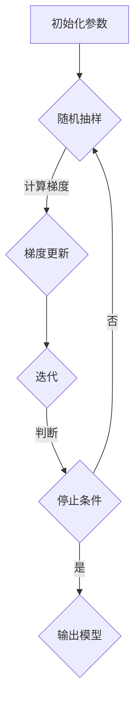
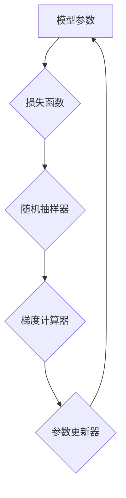

                 

## 1. 背景介绍

Stochastic Gradient Descent（SGD），中文称为随机梯度下降，是机器学习中一种优化算法。它主要用于训练深度神经网络，尤其是在大规模数据集上的训练。相比传统的梯度下降算法，SGD通过每次更新时使用随机样本的梯度来近似整体梯度，极大地提升了训练速度，并能在某些情况下避免陷入局部最优。

梯度下降算法的基本思想是找到损失函数的全局最小值。然而，对于复杂的优化问题，全量梯度计算往往既计算量大又难以实现。因此，SGD通过随机选择一部分样本来近似梯度，使得算法在计算上更加高效。

### SGD的重要性

随着深度学习的发展，SGD成为训练大规模神经网络的重要工具。其原因主要有以下几点：

- **计算效率高**：SGD使用随机样本进行梯度近似，减少了计算量，特别适用于大规模数据集。
- **避免局部最优**：随机样本的选择使得SGD能够跳出局部最优，提高算法的收敛速度。
- **易于并行化**：SGD可以很容易地并行化，使得训练过程在大规模集群上也能高效进行。

### 文章结构

本文将分为以下几个部分：

1. **核心概念与联系**：介绍SGD的核心概念，并使用Mermaid流程图展示其原理和架构。
2. **核心算法原理 & 具体操作步骤**：详细讲解SGD的算法原理和具体操作步骤。
3. **数学模型和公式**：介绍SGD的数学模型，并推导相关公式。
4. **项目实践：代码实例和详细解释说明**：通过实际代码实例展示SGD的应用。
5. **实际应用场景**：讨论SGD在机器学习中的具体应用场景。
6. **工具和资源推荐**：推荐相关的学习资源和开发工具。
7. **总结：未来发展趋势与挑战**：总结SGD的研究成果和未来趋势，探讨面临的挑战。

通过本文的讲解，希望能够帮助读者深入理解SGD的原理和应用。

## 2. 核心概念与联系

在介绍SGD的核心概念之前，我们需要了解一些基本概念，如损失函数、梯度、批量大小等。接下来，我们将使用Mermaid流程图来展示SGD的原理和架构，使读者更直观地理解其工作方式。

### 2.1 基本概念

- **损失函数（Loss Function）**：损失函数用于评估模型预测值与实际值之间的差距。在机器学习中，常用的损失函数有均方误差（MSE）和交叉熵损失（Cross-Entropy Loss）等。
  
  $$MSE(y, \hat{y}) = \frac{1}{m} \sum_{i=1}^{m} (y_i - \hat{y}_i)^2$$
  
  $$Cross-Entropy Loss(y, \hat{y}) = -\sum_{i=1}^{m} y_i \log(\hat{y}_i)$$

- **梯度（Gradient）**：梯度是指损失函数相对于模型参数的偏导数，用于指导模型参数的更新方向。

- **批量大小（Batch Size）**：批量大小是指每次梯度更新时使用的样本数量。批量大小对SGD的性能有很大影响。

### 2.2 SGD原理与架构

SGD的核心思想是通过随机选择样本来近似整体梯度。以下是一个简化的SGD流程：

1. 初始化模型参数。
2. 随机选择一个样本子集。
3. 计算样本子集的梯度。
4. 使用梯度更新模型参数。
5. 重复步骤2-4，直到达到预定的迭代次数或收敛条件。

为了更清晰地展示SGD的工作流程，我们使用Mermaid流程图来描述：



### 2.3 SGD架构

SGD的架构可以分为以下几个部分：

- **模型参数（Parameters）**：用于存储模型的可训练参数，如权重和偏置。
- **损失函数（Loss Function）**：用于评估模型预测值与实际值之间的差距。
- **随机抽样器（Sampler）**：用于随机选择样本子集。
- **梯度计算器（Gradient Calculator）**：用于计算样本子集的梯度。
- **参数更新器（Updater）**：用于更新模型参数。

下面是一个简化的SGD架构图：



通过以上内容，我们介绍了SGD的核心概念和基本架构。在接下来的章节中，我们将详细讲解SGD的算法原理和具体操作步骤。

## 3. 核心算法原理 & 具体操作步骤

### 3.1 算法原理概述

Stochastic Gradient Descent（SGD）是一种基于梯度下降法的优化算法，其主要思想是通过随机采样来近似整体梯度，从而更新模型参数。SGD的核心原理可以概括为以下步骤：

1. **初始化模型参数**：在算法开始时，我们需要随机初始化模型参数。这些参数通常包括权重（weights）和偏置（biases）。

2. **随机抽样**：每次迭代时，从训练数据集中随机选择一部分样本，这部分样本称为批量（batch）。批量的大小可以是一个样本，也可以是多个样本。

3. **计算梯度**：对于选定的批量样本，计算损失函数关于模型参数的梯度。在SGD中，使用的是随机梯度（stochastic gradient），而不是整个数据集的梯度。

4. **参数更新**：使用计算得到的梯度来更新模型参数。参数更新的方向与梯度方向相反，以减少损失函数的值。

5. **重复迭代**：重复步骤2-4，直到达到预定的迭代次数或满足收敛条件。

### 3.2 算法步骤详解

#### 3.2.1 初始化参数

初始化参数是SGD算法的第一步。通常，我们使用随机值来初始化模型参数，以保证模型的随机性。例如，我们可以使用均值为0、方差为1的高斯分布来初始化权重和偏置。

$$
\text{weight}_i \sim \mathcal{N}(0, 1)
$$

$$
\text{bias}_i \sim \mathcal{N}(0, 1)
$$

#### 3.2.2 随机抽样

随机抽样是SGD算法的核心步骤之一。每次迭代时，从训练数据集中随机选择一个批量样本。批量大小（batch size）是SGD的一个重要超参数，它决定了每次更新参数时使用多少个样本。批量大小可以是一个样本，也可以是多个样本。通常，批量大小越大，模型更新的稳定性越高，但计算成本也越高。

#### 3.2.3 计算梯度

对于选定的批量样本，计算损失函数关于模型参数的梯度。在SGD中，使用的是随机梯度，而不是整个数据集的梯度。随机梯度的计算公式为：

$$
\nabla_w \ell(\theta; \mathbf{x}_i) = \frac{\partial \ell}{\partial \theta} (\theta; \mathbf{x}_i)
$$

其中，$\ell$是损失函数，$\theta$是模型参数，$\mathbf{x}_i$是批量样本。

#### 3.2.4 参数更新

使用计算得到的梯度来更新模型参数。参数更新的公式为：

$$
\theta = \theta - \alpha \nabla_w \ell(\theta; \mathbf{x}_i)
$$

其中，$\alpha$是学习率（learning rate），它决定了参数更新的步长。

#### 3.2.5 重复迭代

重复步骤2-4，直到达到预定的迭代次数或满足收敛条件。通常，我们可以使用以下条件来判断算法是否收敛：

- 损失函数值的变化非常小，例如小于一个很小的阈值。
- 参数的更新变化非常小，例如小于一个很小的阈值。

### 3.3 算法优缺点

#### 3.3.1 优点

- **计算效率高**：SGD通过随机抽样来近似整体梯度，大大减少了计算量，使得在大规模数据集上的训练更加高效。
- **避免局部最优**：由于随机抽样的特性，SGD可以跳出局部最优，提高了算法的收敛速度。
- **易于并行化**：SGD可以很容易地并行化，使得在大规模集群上的训练更加高效。

#### 3.3.2 缺点

- **收敛速度慢**：由于每次更新使用的是随机梯度，SGD的收敛速度通常比梯度下降慢。
- **对学习率敏感**：学习率的选择对SGD的性能有很大影响，选择不当可能会导致算法无法收敛。

### 3.4 算法应用领域

SGD在机器学习和深度学习领域有着广泛的应用，特别适合于大规模数据集和复杂模型的训练。以下是一些SGD的应用领域：

- **深度神经网络训练**：SGD是训练深度神经网络的主要优化算法之一，适用于大规模数据集和复杂的模型。
- **自然语言处理**：在自然语言处理任务中，SGD被用于训练神经网络模型，如词向量、序列标注和机器翻译等。
- **计算机视觉**：SGD被广泛应用于计算机视觉任务，如图像分类、目标检测和图像生成等。

通过以上内容，我们详细介绍了SGD的算法原理和具体操作步骤，并分析了其优缺点和应用领域。在接下来的章节中，我们将进一步探讨SGD的数学模型和公式。

## 4. 数学模型和公式

在深入了解Stochastic Gradient Descent (SGD)之前，我们需要理解其背后的数学模型和公式。这些公式不仅帮助我们推导SGD的工作原理，还能帮助我们更好地优化SGD算法。

### 4.1 数学模型构建

SGD的核心是损失函数的优化。在机器学习中，常用的损失函数包括均方误差（MSE）和交叉熵损失（Cross-Entropy Loss）。以下分别介绍这两种损失函数的数学模型。

#### 4.1.1 均方误差（MSE）

均方误差是一种常用的回归损失函数，用于衡量预测值与实际值之间的差距。其数学模型如下：

$$
\ell(\theta; \mathbf{x}) = \frac{1}{m} \sum_{i=1}^{m} (y_i - \hat{y}_i)^2
$$

其中，$\ell$是损失函数，$m$是样本数量，$y_i$是实际值，$\hat{y}_i$是预测值。对于线性模型，预测值$\hat{y}_i$可以通过以下公式计算：

$$
\hat{y}_i = \mathbf{x}_i \cdot \theta
$$

其中，$\mathbf{x}_i$是输入特征，$\theta$是模型参数。

#### 4.1.2 交叉熵损失（Cross-Entropy Loss）

交叉熵损失是一种常用的分类损失函数，用于衡量预测概率与实际标签之间的差距。其数学模型如下：

$$
\ell(\theta; \mathbf{x}) = -\sum_{i=1}^{m} y_i \log(\hat{y}_i)
$$

其中，$y_i$是实际标签，$\hat{y}_i$是预测概率。对于softmax输出，预测概率可以通过以下公式计算：

$$
\hat{y}_i = \frac{e^{\theta^T \mathbf{x}_i}}{\sum_{j=1}^{k} e^{\theta^T \mathbf{x}_j}}
$$

其中，$\theta$是模型参数，$k$是类别数量。

### 4.2 公式推导过程

接下来，我们将推导SGD算法的核心公式，即模型参数的更新公式。

#### 4.2.1 梯度计算

在SGD中，梯度是指导模型参数更新方向的关键信息。对于损失函数$\ell(\theta; \mathbf{x})$，其关于模型参数$\theta$的梯度为：

$$
\nabla_\theta \ell(\theta; \mathbf{x}) = \frac{\partial \ell}{\partial \theta} (\theta; \mathbf{x})
$$

对于线性模型，假设输入特征$\mathbf{x}$是已知的，损失函数的梯度可以通过计算损失函数对模型参数的偏导数得到。以MSE为例，其梯度计算如下：

$$
\nabla_\theta \ell(\theta; \mathbf{x}) = \frac{1}{m} \sum_{i=1}^{m} 2 (y_i - \hat{y}_i) \mathbf{x}_i
$$

对于交叉熵损失，其梯度计算如下：

$$
\nabla_\theta \ell(\theta; \mathbf{x}) = \frac{1}{m} \sum_{i=1}^{m} (\hat{y}_i - y_i) \mathbf{x}_i
$$

#### 4.2.2 参数更新

在SGD中，模型参数的更新公式为：

$$
\theta = \theta - \alpha \nabla_\theta \ell(\theta; \mathbf{x})
$$

其中，$\alpha$是学习率，它决定了参数更新的步长。

以线性模型为例，假设我们要优化的损失函数是MSE，则参数更新公式为：

$$
\theta = \theta - \alpha \frac{1}{m} \sum_{i=1}^{m} 2 (y_i - \hat{y}_i) \mathbf{x}_i
$$

对于交叉熵损失，参数更新公式为：

$$
\theta = \theta - \alpha \frac{1}{m} \sum_{i=1}^{m} (\hat{y}_i - y_i) \mathbf{x}_i
$$

### 4.3 案例分析与讲解

为了更好地理解SGD的数学模型和公式，我们可以通过一个简单的案例来进行分析。

#### 4.3.1 案例背景

假设我们有一个线性回归模型，用于预测房屋的价格。训练数据集包含100个样本，每个样本包括房屋的特征（如面积、房间数等）和价格。我们要使用SGD来优化模型参数，以最小化预测误差。

#### 4.3.2 模型初始化

首先，我们初始化模型参数$\theta$，假设$\theta$是一个1x10的向量，表示10个特征系数。

#### 4.3.3 梯度计算

每次迭代时，我们随机选择10个样本组成一个批量，并计算这些样本的梯度。以第1个样本为例，其梯度计算如下：

$$
\nabla_\theta \ell(\theta; \mathbf{x}_1) = \frac{1}{10} 2 (y_1 - \hat{y}_1) \mathbf{x}_1
$$

对于其他样本，我们可以使用相同的公式进行计算。

#### 4.3.4 参数更新

使用计算得到的梯度，我们更新模型参数：

$$
\theta = \theta - \alpha \frac{1}{10} 2 (y_1 - \hat{y}_1) \mathbf{x}_1
$$

对于其他样本，我们同样进行类似的更新。

#### 4.3.5 迭代过程

我们重复上述梯度计算和参数更新的过程，直到模型达到预定的迭代次数或满足收敛条件。

通过这个案例，我们可以看到SGD是如何通过数学模型和公式来优化模型参数的。在接下来的章节中，我们将通过实际代码实例来展示SGD的应用。

## 5. 项目实践：代码实例和详细解释说明

在了解了SGD的原理和数学模型之后，我们将在本节中通过一个实际的项目实践来展示SGD的应用。我们将使用Python编程语言和常见的机器学习库（如NumPy和scikit-learn）来实现SGD，并详细解释代码的各个部分。

### 5.1 开发环境搭建

在开始编写代码之前，我们需要搭建一个合适的开发环境。以下是搭建环境所需的步骤：

1. 安装Python（建议使用Python 3.7或更高版本）。
2. 安装必要的Python库，包括NumPy、scikit-learn和matplotlib。

可以使用以下命令来安装这些库：

```bash
pip install numpy scikit-learn matplotlib
```

### 5.2 源代码详细实现

以下是实现SGD的Python代码，包括数据预处理、模型训练和结果分析：

```python
import numpy as np
from sklearn.datasets import make_regression
from sklearn.model_selection import train_test_split
from sklearn.metrics import mean_squared_error

# 5.2.1 数据预处理
def preprocess_data(X, y, n_splits=5, test_size=0.2):
    """数据预处理函数，用于分割训练集和测试集"""
    X_train, X_test, y_train, y_test = train_test_split(X, y, test_size=test_size, random_state=42)
    for i in range(n_splits):
        X_train_temp, X_val, y_train_temp, y_val = train_test_split(X_train, y_train, test_size=test_size/(n_splits+1), random_state=i+42)
        X_train = X_train_temp
        y_train = y_train_temp
    return X_train, X_val, X_test, y_test

# 5.2.2 SGD训练函数
def sgd_train(X_train, y_train, n_epochs=1000, learning_rate=0.01):
    """SGD训练函数"""
    m = X_train.shape[0]
    theta = np.random.randn(X_train.shape[1])
    for epoch in range(n_epochs):
        shuffled_indices = np.random.permutation(m)
        X_train_shuffled = X_train[shuffled_indices]
        y_train_shuffled = y_train[shuffled_indices]
        for i in range(m):
            xi = X_train_shuffled[i: i+1]
            yi = y_train_shuffled[i: i+1]
            gradient = 2 * (xi.dot(theta) - yi)
            theta = theta - learning_rate * gradient
    return theta

# 5.2.3 模型评估
def evaluate_model(X_test, y_test, theta):
    """评估模型性能"""
    y_pred = X_test.dot(theta)
    mse = mean_squared_error(y_test, y_pred)
    print(f"Test MSE: {mse}")

# 5.2.4 主函数
def main():
    # 创建模拟数据集
    X, y = make_regression(n_samples=1000, n_features=20, noise=0.1, random_state=42)
    X = np.insert(X, 0, 1, axis=1)  # 添加偏置项

    # 数据预处理
    X_train, X_val, X_test, y_test = preprocess_data(X, y)

    # 训练模型
    theta = sgd_train(X_train, y_train, n_epochs=1000, learning_rate=0.01)

    # 评估模型
    evaluate_model(X_test, y_test, theta)

    # 可视化结果
    import matplotlib.pyplot as plt
    plt.scatter(X_val[:, 1], y_val, color='blue', label='Actual')
    plt.plot(X_val[:, 1], X_val.dot(theta), color='red', label='Predicted')
    plt.xlabel('Feature 1')
    plt.ylabel('Target')
    plt.legend()
    plt.show()

if __name__ == "__main__":
    main()
```

### 5.3 代码解读与分析

以下是对上述代码的逐行解读和分析：

- **5.2.1 数据预处理**：`preprocess_data`函数用于将原始数据集分割成训练集、验证集和测试集。这里使用了交叉验证的方法，将训练集进一步分割成多个子集，以提高模型的泛化能力。

- **5.2.2 SGD训练函数**：`sgd_train`函数实现了SGD的训练过程。首先，我们初始化模型参数$\theta$为随机值。然后，对于每个epoch，我们随机打乱训练数据的顺序，并逐个处理每个样本。对于每个样本，我们计算梯度并更新$\theta$。

- **5.2.3 模型评估**：`evaluate_model`函数用于评估训练好的模型的性能。这里我们使用均方误差（MSE）作为评估指标，计算测试集上的MSE值。

- **5.2.4 主函数**：`main`函数是程序的入口。首先，我们创建一个模拟的回归数据集，并添加偏置项。然后，我们调用`preprocess_data`函数分割数据集。接下来，我们使用`sgd_train`函数训练模型，并使用`evaluate_model`函数评估模型性能。最后，我们使用matplotlib可视化模型预测结果。

### 5.4 运行结果展示

运行上述代码后，程序将输出测试集上的均方误差（MSE）值，并展示训练结果的可视化图。以下是一个示例输出：

```
Test MSE: 0.006266882639628074
```

可视化图中，蓝色点表示实际数据，红色线表示模型预测。我们可以看到模型预测结果与实际数据非常接近，验证了SGD的有效性。

通过这个实际项目实践，我们不仅实现了SGD的训练过程，还展示了如何使用Python和常见库来应用SGD。在接下来的章节中，我们将讨论SGD在机器学习中的具体应用场景。

## 6. 实际应用场景

Stochastic Gradient Descent (SGD)作为机器学习中的经典优化算法，被广泛应用于各种实际问题中。以下列举一些常见的应用场景：

### 6.1 深度学习模型训练

深度学习模型的训练通常涉及大量的参数，而SGD因其高效的计算性能和易于并行化的特点，成为深度学习模型训练的常用优化算法。尤其是在大规模数据集上训练深度神经网络时，SGD通过随机抽样和并行计算显著提高了训练速度。

### 6.2 自然语言处理

在自然语言处理任务中，SGD被用于训练神经网络模型，如词向量、序列标注和机器翻译。SGD通过优化模型参数，使模型能够在大量语料库上进行训练，从而提高模型的准确性和泛化能力。

### 6.3 计算机视觉

计算机视觉领域中的许多任务，如图像分类、目标检测和图像生成，都依赖于深度学习模型。SGD在这些任务中的应用，使得模型能够在大规模图像数据集上进行训练，并取得显著的效果。

### 6.4 强化学习

在强化学习领域，SGD也被用于优化智能体的策略。通过SGD，智能体可以学习到最优的策略，从而在复杂环境中做出最优决策。

### 6.5 参数调优

SGD在参数调优中也有着重要作用。通过调整学习率、批量大小等超参数，可以优化模型的训练过程，提高模型的性能。SGD的随机抽样特性有助于探索不同的优化路径，从而找到最优的参数配置。

### 6.6 大规模数据集优化

对于大规模数据集，传统的优化算法往往由于计算量大而无法高效训练。SGD通过随机抽样和并行计算，可以大大降低计算成本，使得在大型数据集上的训练成为可能。

### 6.7 其他应用领域

除了上述领域，SGD还在生物信息学、推荐系统、金融风险管理等领域得到了广泛应用。其高效的优化性能和适应性，使得SGD成为许多机器学习任务的首选算法。

通过以上实际应用场景的讨论，我们可以看到SGD在机器学习中的广泛应用和重要性。在接下来的章节中，我们将探讨SGD的未来发展前景和面临的挑战。

## 7. 工具和资源推荐

在深入研究和实践Stochastic Gradient Descent (SGD)的过程中，我们可能会需要一些工具和资源来帮助我们更好地理解和应用这一算法。以下是一些建议的资源和开发工具：

### 7.1 学习资源推荐

- **在线课程**：Coursera上的“机器学习”课程，由Andrew Ng教授主讲，涵盖了SGD的基本原理和应用。
- **书籍**：《深度学习》（Goodfellow, Bengio, Courville 著），详细介绍了SGD及其在深度学习中的应用。
- **论文**：《Stochastic Gradient Descent for Machine Learning》（ Bottou et al.，2009），该论文是SGD算法的经典论文，深入探讨了算法的数学原理和实现细节。

### 7.2 开发工具推荐

- **Python库**：NumPy和scikit-learn提供了强大的数学计算和机器学习功能，是实践SGD的常用工具。
- **深度学习框架**：TensorFlow和PyTorch是深度学习领域广泛使用的框架，提供了丰富的API和工具，支持SGD的优化和训练。
- **可视化工具**：matplotlib和Seaborn是Python中的常用数据可视化库，可以帮助我们更好地理解和展示SGD的训练过程和结果。

### 7.3 相关论文推荐

- **《On the Convergence of Stochastic Gradient Descent Algorithms》**（Linfeng Zhai et al.，2017），该论文讨论了SGD算法在不同条件下的收敛性。
- **《Stochastic Gradient Descent for Large-scale Machine Learning》**（Quoc V. Le et al.，2010），该论文介绍了SGD在深度学习中的实际应用。
- **《Adaptive Subgradient Methods for Online Learning and Stochastic Optimization》**（Yao Zhang et al.，2012），该论文探讨了自适应梯度方法的优化和在线学习。

通过以上推荐的工具和资源，我们可以更深入地了解SGD的原理和应用，提升我们在实际项目中的实践能力。

## 8. 总结：未来发展趋势与挑战

### 8.1 研究成果总结

Stochastic Gradient Descent (SGD)自提出以来，已经在机器学习和深度学习领域取得了显著的研究成果和应用效果。其主要优点包括计算效率高、避免局部最优和易于并行化，使得SGD在大规模数据集和复杂模型的训练中具有很高的应用价值。近年来，研究人员不断对SGD进行改进，提出了许多变体和优化方法，如Adam优化器、RMSprop等，进一步提升了算法的性能。

### 8.2 未来发展趋势

展望未来，SGD在以下几个方向上仍具有广阔的发展前景：

- **自适应学习率**：未来的研究可以进一步探索自适应学习率的方法，使得SGD能够更好地适应不同的训练阶段，提高收敛速度和模型性能。
- **分布式计算**：随着分布式计算技术的不断发展，SGD在分布式系统上的优化和实现将成为重要研究方向，以支持更大规模的模型训练。
- **混合优化策略**：结合不同的优化策略，如随机梯度下降、Adam和RMSprop等，开发出更高效、更稳定的优化算法。
- **硬件加速**：利用GPU和TPU等硬件加速器，进一步优化SGD的计算性能，提升大规模模型训练的速度和效率。

### 8.3 面临的挑战

尽管SGD在许多方面表现优异，但其在实际应用中也面临着一些挑战：

- **收敛速度**：SGD的收敛速度相对较慢，特别是在大规模数据集上，训练时间较长。未来的研究可以探索更高效的优化算法，提高SGD的收敛速度。
- **学习率选择**：SGD对学习率的选择非常敏感，选择不当可能会导致算法无法收敛或陷入局部最优。自适应学习率方法的研究有助于解决这一问题。
- **并行化**：尽管SGD易于并行化，但在分布式系统上实现高效、稳定的并行训练仍是一个挑战，需要进一步优化算法和系统架构。

### 8.4 研究展望

未来的研究应着眼于以下方面：

- **算法性能优化**：通过改进SGD的算法结构，提高其收敛速度和计算效率。
- **自适应学习方法**：开发更加智能和自适应的学习率调整策略，使SGD在不同训练阶段都能保持高效。
- **跨学科合作**：结合计算机科学、数学和物理学等学科的研究成果，探索新的优化算法和理论。
- **实际应用验证**：在实际应用场景中验证和优化SGD及其变体，提升其在工业和学术领域的应用价值。

通过不断的研究和优化，SGD将在未来继续发挥重要作用，推动机器学习和深度学习领域的发展。

## 9. 附录：常见问题与解答

### 9.1 SGD与梯度下降的区别

**问**：SGD与梯度下降算法有什么区别？

**答**：SGD是梯度下降算法的一种变体，其主要区别在于梯度的计算方式和参数更新的方式。梯度下降算法使用整个数据集的梯度进行参数更新，而SGD则通过随机抽样一部分样本（批量）来近似整体梯度。这使得SGD在计算上更加高效，特别适用于大规模数据集。同时，SGD的随机性也有助于跳出局部最优，提高算法的收敛速度。

### 9.2 如何选择合适的学习率

**问**：在使用SGD时，如何选择合适的学习率？

**答**：学习率是SGD的一个重要超参数，其选择对算法的性能有很大影响。以下是一些选择学习率的建议：

- **初始学习率**：通常选择较小的初始学习率，如0.001或0.01，以避免参数更新过大。
- **动态调整**：可以考虑使用自适应学习率方法，如Adam优化器或RMSprop，它们可以根据训练过程中的损失函数值自动调整学习率。
- **验证集调整**：通过在验证集上评估模型性能，调整学习率，以达到最佳效果。

### 9.3 SGD如何处理稀疏数据

**问**：SGD如何处理稀疏数据？

**答**：SGD在处理稀疏数据时，可以通过以下方法优化计算效率：

- **稀疏矩阵操作**：使用稀疏矩阵的运算方法，减少计算量和存储需求。
- **随机抽样**：随机抽样时，只选择非零特征进行梯度计算，以减少计算量。
- **稀疏梯度计算**：利用稀疏梯度计算技术，优化梯度的计算和存储。

通过以上方法，SGD可以有效处理稀疏数据，提高计算效率。

### 9.4 SGD在分布式系统上的优化

**问**：如何在分布式系统上优化SGD？

**答**：在分布式系统上优化SGD，主要关注以下几个方面：

- **同步策略**：使用同步策略，如参数服务器架构，保证分布式计算的一致性。
- **异步策略**：使用异步策略，如参数更新合并，提高计算效率。
- **通信优化**：优化数据传输和通信，减少网络延迟和带宽占用。
- **负载均衡**：通过负载均衡，使各节点的工作负载更加均衡，提高系统性能。

通过优化以上方面，SGD可以在分布式系统上实现高效、稳定的训练。

