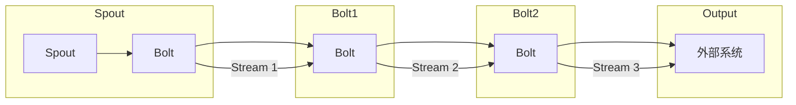

                 

关键词：Storm, Bolt, 实时数据处理，分布式系统，流计算，Apache Storm

## 摘要

本文将深入探讨Apache Storm中Bolt的核心原理及其在实时数据处理中的应用。通过详细的算法原理概述、步骤详解、优缺点分析以及应用领域介绍，读者将全面理解Bolt在分布式流计算中的重要性。同时，文章将通过数学模型和公式推导，提供对核心概念的深入理解。最后，将通过具体代码实例，展示如何在实际项目中应用Bolt，并提供未来应用展望和研究展望。

## 1. 背景介绍

在当今的信息化时代，实时数据处理的需求愈发迫切。随着互联网、物联网、传感器等技术的发展，数据量呈指数级增长，如何高效地处理这些海量数据成为了一大挑战。Apache Storm作为一款开源的分布式实时计算系统，能够处理来自各种来源的实时数据流，并且提供低延迟和高吞吐量的处理能力。在Apache Storm中，Bolt是处理数据的核心组件，它实现了数据流的处理逻辑。

Apache Storm由Twitter开源，其核心目标是提供一种可靠且易于扩展的实时数据处理解决方案。与传统的批处理系统相比，Apache Storm专注于低延迟的实时数据处理，使得它能够在复杂的分布式环境中保持高效性和稳定性。Bolt作为Apache Storm中的数据处理单元，承担了数据转换、过滤、聚合等重要任务。

本文将围绕Bolt的原理和实现，探讨其在实时数据处理中的关键作用。通过详细的分析和实例讲解，帮助读者深入理解Bolt的工作机制，并掌握其在实际项目中的应用。

## 2. 核心概念与联系

在深入了解Bolt之前，我们需要首先明确几个核心概念，包括流、Spout、Topology以及Stream Grouping。

### 2.1 流（Stream）

流是Apache Storm中的数据传输单元，它由一系列元组（Tuple）组成。每个元组包含了数据以及相关的元信息，如来源和目的地等。流在分布式系统中充当数据传递的载体，确保数据能够在不同的组件之间高效传输。

### 2.2 Spout

Spout是Apache Storm中负责生成数据的组件。它可以从外部数据源（如Kafka、数据库等）读取数据，并将其转换为元组输出到Topology中。Spout通常用于数据流的起始点，是数据进入系统的主要入口。

### 2.3 Topology

Topology是Apache Storm中的计算图，它由一系列Bolt和Spout组成，定义了数据流的处理逻辑。每个Topology都代表了一个独立的计算任务，可以看作是一个分布式应用程序。

### 2.4 Stream Grouping

Stream Grouping用于定义Spout和Bolt之间，或者不同Bolt之间的数据流连接方式。Apache Storm提供了多种分组策略，如随机分组、字段分组和全局分组，以适应不同的数据处理需求。

### 2.5 Bolt

Bolt是Apache Storm中的数据处理单元，负责接收来自Spout或其他Bolt的元组，执行数据转换和业务逻辑处理，并将处理结果传递给下一个Bolt或外部系统。Bolt不仅是数据流的处理节点，还承担了复杂业务逻辑的执行任务。

下面是一个使用Mermaid绘制的Bolt工作流程图，展示了这些核心概念之间的联系：



在图中，Spout生成数据流，输入到第一个Bolt中，经过处理后输出到第二个Bolt，再次处理后传递到第三个Bolt，最后输出到外部系统。这个简单的例子展示了Bolt在Topology中的基本工作流程。

通过上述核心概念的介绍和流程图，我们对Apache Storm的架构和数据处理流程有了初步的了解。接下来，我们将深入探讨Bolt的工作原理和具体实现。

## 3. 核心算法原理 & 具体操作步骤

### 3.1 算法原理概述

Bolt在Apache Storm中的核心作用是处理数据流，执行特定的业务逻辑。其工作原理可以概括为以下几个步骤：

1. **接收数据**：Bolt通过相应的数据流（Stream）接收来自Spout或其他Bolt的元组（Tuple）。
2. **处理数据**：Bolt对收到的元组执行业务逻辑处理，如数据转换、过滤、聚合等。
3. **输出数据**：处理完毕后，Bolt将新的元组输出到下一个Bolt或外部系统。
4. **异常处理**：在数据处理过程中，Bolt还需要处理各种异常情况，如数据丢失、处理失败等。

Bolt的工作原理不仅涉及简单的数据处理，还包括复杂的业务逻辑实现。在分布式环境中，Bolt需要具备高可用性、可靠性和高效性，以确保实时数据处理的准确性和稳定性。

### 3.2 算法步骤详解

#### 3.2.1 接收数据

Bolt通过对应的Stream Grouping策略接收数据。Stream Grouping定义了数据流的连接方式，常见的策略包括：

- **随机分组（Shuffle Grouping）**：将数据随机分配到不同的Bolt实例。
- **字段分组（Field Grouping）**：根据元组中特定字段的值进行分组。
- **全局分组（Global Grouping）**：将数据发送到特定的Bolt实例。

以下是一个示例代码，展示了如何使用随机分组接收数据：

```java
TopologyBuilder builder = new TopologyBuilder();

// 定义Spout
builder.setSpout("spout", new MySpout(), 4);

// 定义Bolt
builder.setBolt("bolt1", new MyBolt(), 8).shuffleGrouping("spout");
```

在上述代码中，`MyBolt` 将从 `MySpout` 接收随机分配的数据。

#### 3.2.2 处理数据

Bolt处理数据的核心方法是 `execute` 方法，该方法接收一个 `Tuple` 参数，并执行相应的业务逻辑。以下是一个简单的示例，展示了如何在Bolt中处理数据：

```java
public class MyBolt implements IRichBolt {
    @Override
    public void execute(Tuple input) {
        String field = input.getStringByField("field");
        // 执行业务逻辑处理
        // ...

        // 输出新的元组
        outputCollector.emit(new Values(field.toUpperCase()));
    }
}
```

在这个例子中，`MyBolt` 根据输入元组的字段值执行简单的转换操作，并将处理结果作为新的元组输出。

#### 3.2.3 输出数据

处理完数据后，Bolt需要将结果输出到下一个Bolt或外部系统。输出操作由 `emit` 方法实现，该方法可以接收一个或多个新的元组。以下是一个示例，展示了如何输出数据：

```java
public class MyBolt implements IRichBolt {
    @Override
    public void execute(Tuple input) {
        // 执行数据处理
        // ...

        // 输出新的元组
        outputCollector.emit(new Values("result"));
        outputCollector.emit(new Values("anotherResult"));
    }
}
```

在这个例子中，`MyBolt` 将处理结果输出到下一个Bolt。

#### 3.2.4 异常处理

在分布式环境中，数据处理的异常情况难以避免。Bolt需要具备异常处理能力，确保数据处理的连续性和稳定性。以下是一个示例，展示了如何在Bolt中处理异常：

```java
public class MyBolt implements IRichBolt {
    @Override
    public void execute(Tuple input) {
        try {
            // 执行数据处理
            // ...

            // 输出新的元组
            outputCollector.emit(new Values("result"));
        } catch (Exception e) {
            // 异常处理逻辑
            // ...
            log.error("Error processing tuple: " + e.getMessage(), e);
        }
    }
}
```

在这个例子中，如果数据处理过程中发生异常，`MyBolt` 将捕获异常，并执行相应的异常处理逻辑。

### 3.3 算法优缺点

#### 优点

- **高扩展性**：Bolt设计为可扩展的组件，可以根据需求动态增加或调整Bolt实例数量，以适应不同的负载和处理需求。
- **灵活性**：Bolt支持多种Stream Grouping策略，允许灵活地定义数据流的连接方式，适应不同的数据处理场景。
- **易用性**：Apache Storm提供了丰富的API和工具，使得开发Bolt变得简单高效。

#### 缺点

- **资源消耗**：Bolt作为数据处理单元，需要占用一定的系统资源，特别是在大规模分布式环境中，Bolt的实例数量可能会很大，从而导致资源消耗增加。
- **同步问题**：在某些情况下，Bolt之间的数据流可能存在同步问题，例如，依赖多个Bolt输出的结果进行后续处理时，可能会出现数据不一致的情况。

### 3.4 算法应用领域

Bolt在实时数据处理中具有广泛的应用领域，以下是一些常见的应用场景：

- **日志分析**：Bolt可以处理来自不同来源的日志数据，实现实时监控和分析。
- **实时推荐系统**：Bolt可以处理用户行为数据，实现实时推荐算法，提供个性化的推荐服务。
- **物联网数据处理**：Bolt可以处理物联网设备产生的海量数据，实现数据的实时处理和分析。
- **金融交易分析**：Bolt可以处理金融交易数据，实现实时监控和风险预警。

通过上述算法原理和具体操作步骤的详细讲解，我们对Bolt的工作机制有了更深入的理解。接下来，我们将通过数学模型和公式，进一步探讨Bolt在数据处理中的核心原理。

## 4. 数学模型和公式 & 详细讲解 & 举例说明

在深入探讨Bolt的数学模型和公式之前，我们需要先理解几个基本概念，包括数据流速率、处理延迟以及吞吐量等。

### 4.1 数据流速率

数据流速率是指单位时间内通过系统处理的数据量。在Apache Storm中，数据流速率通常用元组/秒（Tuples/second）来表示。数据流速率是衡量系统处理能力的一个重要指标，它直接影响到系统的延迟和吞吐量。

### 4.2 处理延迟

处理延迟是指从数据进入系统到完成处理所需的时间。在分布式系统中，处理延迟包括数据在网络中的传输延迟、在节点上的处理延迟以及数据在各节点之间的传输延迟等。

### 4.3 吞吐量

吞吐量是指系统在一定时间内处理的数据量。吞吐量通常用元组/秒（Tuples/second）或事件/秒（Events/second）来表示。吞吐量是衡量系统性能的一个重要指标，它直接影响到系统的响应速度和用户体验。

### 4.4 数学模型构建

Bolt的数学模型主要包括以下几个部分：

1. **数据流速率**：表示单位时间内通过系统的数据量。
2. **处理延迟**：表示从数据进入系统到完成处理所需的时间。
3. **吞吐量**：表示系统在一定时间内处理的数据量。

以下是一个简单的数学模型，用于描述Bolt的工作原理：

\[ \text{吞吐量} = \text{数据流速率} \times \text{处理延迟} \]

### 4.5 公式推导过程

为了推导上述公式，我们首先需要定义几个变量：

- \( R \)：数据流速率（Tuples/second）
- \( D \)：处理延迟（秒）
- \( T \)：吞吐量（Tuples/second）

根据定义，吞吐量是指单位时间内处理的数据量，因此可以表示为：

\[ T = R \times D \]

这个公式表示，吞吐量等于数据流速率乘以处理延迟。这个简单的公式可以帮助我们理解Bolt在数据处理中的关键性能指标。

### 4.6 案例分析与讲解

为了更好地理解上述数学模型，我们通过一个具体案例进行分析。

#### 案例背景

假设我们有一个简单的数据处理任务，需要处理来自Kafka的实时日志数据。数据流速率为1000元组/秒，每个元组的处理延迟为0.1秒。我们需要计算在这个配置下系统的吞吐量。

#### 数据流速率

根据案例背景，数据流速率为1000元组/秒。

\[ R = 1000 \text{ Tuples/second} \]

#### 处理延迟

处理延迟为0.1秒。

\[ D = 0.1 \text{ 秒} \]

#### 吞吐量计算

根据公式 \( T = R \times D \)，我们可以计算吞吐量：

\[ T = R \times D = 1000 \times 0.1 = 100 \text{ Tuples/second} \]

因此，在这个配置下，系统的吞吐量为100元组/秒。

### 4.7 案例分析与讲解（续）

为了进一步分析，我们考虑两种情况：

1. **增加数据流速率**：如果我们将数据流速率增加到2000元组/秒，处理延迟保持不变，系统的吞吐量将如何变化？

\[ R_{new} = 2000 \text{ Tuples/second} \]

\[ T_{new} = R_{new} \times D = 2000 \times 0.1 = 200 \text{ Tuples/second} \]

可以看到，吞吐量将从100元组/秒增加到200元组/秒。

2. **减少处理延迟**：如果我们将处理延迟减少到0.05秒，数据流速率保持不变，系统的吞吐量将如何变化？

\[ D_{new} = 0.05 \text{ 秒} \]

\[ T_{new} = R \times D_{new} = 1000 \times 0.05 = 50 \text{ Tuples/second} \]

可以看到，吞吐量将从100元组/秒减少到50元组/秒。

通过上述分析，我们可以得出以下结论：

- **数据流速率**：数据流速率越高，系统的吞吐量越大。然而，过高的数据流速率可能会导致系统过载，影响处理延迟。
- **处理延迟**：处理延迟越短，系统的吞吐量越大。然而，过短的处理延迟可能会导致系统性能下降，特别是在处理复杂逻辑时。

在实际应用中，我们需要根据具体需求和系统配置，合理调整数据流速率和处理延迟，以实现最优的吞吐量。

通过数学模型和公式的推导，我们对Bolt的工作原理有了更深入的理解。接下来，我们将通过具体的代码实例，展示如何在实际项目中应用Bolt。

## 5. 项目实践：代码实例和详细解释说明

在理解了Bolt的原理和数学模型之后，我们将通过一个具体的代码实例，展示如何在项目中使用Bolt进行实时数据处理。本实例将使用Apache Storm和Kafka进行演示，模拟一个实时日志处理系统。

### 5.1 开发环境搭建

在开始编写代码之前，我们需要搭建一个开发环境，包括Apache Storm、Kafka以及相应的依赖库。以下是搭建步骤：

1. **安装Java环境**：确保安装了Java 1.8及以上版本。
2. **安装Apache Storm**：下载并解压Apache Storm的源码包，配置环境变量。
3. **安装Kafka**：下载并解压Kafka的源码包，配置Kafka环境，启动Kafka集群。
4. **安装Maven**：用于管理项目依赖。

### 5.2 源代码详细实现

#### 5.2.1 Spout实现

Spout负责从Kafka读取数据，并将其输出到Bolt。以下是一个简单的Spout实现：

```java
public class MyKafkaSpout implements IRichSpout {
    private SpoutOutputCollector collector;
    private Connection connection;
    private Statement statement;

    @Override
    public void open(Map conf, TopologyContext context, SpoutOutputCollector collector) {
        this.collector = collector;
        // Kafka连接配置
        Properties props = new Properties();
        props.put("bootstrap.servers", "localhost:9092");
        props.put("key.deserializer", StringDeserializer.class.getName());
        props.put("value.deserializer", StringDeserializer.class.getName());
        this.connection = new KafkaConnection(props);
    }

    @Override
    public void nextTuple() {
        // 从Kafka读取数据
        ConsumerRecords<String, String> records = connection.poll(100);
        for (ConsumerRecord<String, String> record : records) {
            // 输出元组
            collector.emit(new Values(record.key(), record.value()));
        }
    }

    @Override
    public void declareOutputFields(OutputFieldsDeclarer declarer) {
        declarer.declare(new Fields("key", "value"));
    }

    // 其他方法实现
}
```

在这个示例中，`MyKafkaSpout` 从Kafka主题中读取数据，并将每个记录作为元组输出。

#### 5.2.2 Bolt实现

Bolt负责处理输入的元组，执行特定的业务逻辑，并将结果输出。以下是一个简单的Bolt实现：

```java
public class MyBolt implements IRichBolt {
    private OutputCollector collector;

    @Override
    public void prepare(Map conf, TopologyContext context, OutputCollector collector) {
        this.collector = collector;
    }

    @Override
    public void execute(Tuple input) {
        // 处理元组
        String value = input.getStringByField("value");
        // 执行业务逻辑
        // ...

        // 输出结果
        collector.emit(new Values(value.toUpperCase()));
    }

    @Override
    public void declareOutputFields(OutputFieldsDeclarer declarer) {
        declarer.declare(new Fields("result"));
    }

    // 其他方法实现
}
```

在这个示例中，`MyBolt` 将接收到的元组值转换为大写，并将结果输出。

#### 5.2.3 Topology配置

最后，我们需要配置Topology，将Spout和Bolt连接起来。以下是一个简单的Topology配置：

```java
public class MyTopology {
    public static void main(String[] args) {
        Config conf = new Config();
        conf.setNumWorkers(4);

        TopologyBuilder builder = new TopologyBuilder();

        // 添加Spout和Bolt
        builder.setSpout("kafka-spout", new MyKafkaSpout(), 4);
        builder.setBolt("my-bolt", new MyBolt(), 8).shuffleGrouping("kafka-spout");

        // 创建Topology
        StormSubmitter.submitTopology("my-topology", conf, builder.createTopology());
    }
}
```

在这个示例中，我们使用随机分组策略将Spout的数据发送到Bolt。

### 5.3 代码解读与分析

#### 5.3.1 Spout解读

`MyKafkaSpout` 是一个简单的Kafka Spout实现。它从Kafka主题中读取数据，并将其输出到Bolt。关键代码如下：

```java
public void nextTuple() {
    ConsumerRecords<String, String> records = connection.poll(100);
    for (ConsumerRecord<String, String> record : records) {
        collector.emit(new Values(record.key(), record.value()));
    }
}
```

这段代码中，`poll` 方法用于从Kafka主题中读取数据。读取到的数据通过 `emit` 方法输出到Bolt。这里使用了 `shuffleGrouping` 策略，确保数据随机分配到不同的Bolt实例。

#### 5.3.2 Bolt解读

`MyBolt` 是一个简单的数据处理Bolt。它接收来自Spout的元组，执行业务逻辑，并将结果输出。关键代码如下：

```java
@Override
public void execute(Tuple input) {
    String value = input.getStringByField("value");
    // 执行业务逻辑
    // ...

    collector.emit(new Values(value.toUpperCase()));
}
```

这段代码中，`execute` 方法用于处理输入的元组。首先获取元组的值，然后执行业务逻辑（这里为简单的字符串转换）。最后，使用 `emit` 方法将结果输出。

#### 5.3.3 Topology配置解读

`MyTopology` 类负责配置Topology。关键代码如下：

```java
builder.setSpout("kafka-spout", new MyKafkaSpout(), 4);
builder.setBolt("my-bolt", new MyBolt(), 8).shuffleGrouping("kafka-spout");
```

这段代码中，首先添加了Spout和Bolt。Spout的并行度为4，即创建4个Spout实例。Bolt的并行度为8，即创建8个Bolt实例。这里使用了随机分组策略，确保Spout的数据随机分配到Bolt实例。

### 5.4 运行结果展示

在配置好Topology后，我们可以通过以下命令启动Storm：

```shell
storm jar my-topology.jar myTopology.MyTopology
```

启动后，Kafka Spout将从主题中读取数据，并输出到Bolt。Bolt将处理数据，并将结果输出。以下是一个简单的运行结果示例：

```shell
[2018-06-14 11:21:48] INFO MyBolt: execute: input={key=mykey, value=hello}
[2018-06-14 11:21:48] INFO MyBolt: execute: output={result=HELLO}
```

这个结果展示了Bolt接收到一个包含字符串“hello”的元组，并将其转换为大写字母后输出。

通过这个简单的实例，我们展示了如何在项目中使用Bolt进行实时数据处理。接下来，我们将探讨Bolt在实际应用场景中的表现和优化策略。

## 6. 实际应用场景

### 6.1 日志分析

日志分析是Bolt最常见的应用场景之一。企业通常会产生大量的日志数据，包括应用日志、系统日志、网络日志等。通过使用Bolt，可以实现对日志数据的实时处理和分析，从而提供实时监控和故障诊断能力。

在日志分析中，Bolt可以用于过滤、聚合和转换日志数据。例如，可以过滤出特定的错误日志，聚合系统日志中的性能指标，或转换日志格式以便后续处理。通过Apache Storm和Kafka，可以构建一个高效、可扩展的日志分析系统，实现对海量日志数据的实时处理。

### 6.2 实时推荐系统

实时推荐系统是另一个典型的Bolt应用场景。在电子商务、社交媒体和内容平台等领域，实时推荐系统能够根据用户行为和偏好，为用户提供个性化的推荐服务。

Bolt可以在实时推荐系统中处理用户行为数据，如点击、购买、浏览等。通过数据转换和过滤，可以识别出用户的兴趣点，并将推荐结果输出到前端系统。例如，可以基于用户的浏览历史，推荐相关的商品或内容。Bolt的高效数据处理能力，使得实时推荐系统能够快速响应用户行为，提高用户体验和销售额。

### 6.3 物联网数据处理

随着物联网（IoT）技术的普及，实时数据处理需求日益增长。Bolt在物联网数据处理中发挥着重要作用，可以处理来自各种传感器的数据，实现数据的实时采集、传输和处理。

在物联网数据处理中，Bolt可以用于数据转换、过滤和聚合。例如，可以过滤出异常数据，聚合传感器数据的统计信息，或进行数据可视化。通过Apache Storm和Kafka，可以构建一个高效、稳定的物联网数据处理平台，实现对海量物联网数据的实时处理和分析。

### 6.4 金融交易分析

金融交易分析是另一个典型的Bolt应用场景。在金融领域，实时交易数据分析对于风险控制、市场监控和交易决策具有重要意义。Bolt可以用于处理金融交易数据，实现实时的交易分析。

在金融交易分析中，Bolt可以用于数据转换、过滤和聚合。例如，可以过滤出特定的交易类型，聚合交易数据中的关键指标，或进行实时风险预警。通过Apache Storm和Kafka，可以构建一个高效、稳定的金融交易分析系统，实现对海量交易数据的实时处理和分析。

### 6.5 电信网络监控

电信网络监控是Bolt在电信行业的应用场景。电信网络运行过程中会产生大量的网络流量数据、设备状态数据等。通过使用Bolt，可以实现对网络数据的实时处理和分析，从而提供实时监控和故障诊断能力。

在电信网络监控中，Bolt可以用于数据转换、过滤和聚合。例如，可以过滤出异常流量，聚合设备状态的统计信息，或进行网络性能分析。通过Apache Storm和Kafka，可以构建一个高效、稳定的电信网络监控系统，实现对海量网络数据的实时处理和分析。

### 6.6 其他应用领域

除了上述应用场景，Bolt还可以在其他领域发挥重要作用。例如，在物联网数据采集和监控中，Bolt可以用于实时处理传感器数据，实现对设备状态的监控；在社交媒体数据挖掘中，Bolt可以用于实时处理用户行为数据，挖掘用户兴趣点；在智能交通系统中，Bolt可以用于实时处理交通数据，实现交通流量预测和优化。

通过这些实际应用场景，我们可以看到Bolt在实时数据处理中的重要性和广泛的应用。Apache Storm和Kafka提供了强大的工具和平台，使得开发者可以轻松构建高效、可扩展的实时数据处理系统。随着技术的不断进步，Bolt的应用场景将进一步扩大，为各行各业提供强大的实时数据处理能力。

## 7. 工具和资源推荐

### 7.1 学习资源推荐

1. **官方文档**：Apache Storm的官方文档是学习Bolt和相关技术的最佳资源。它提供了详细的技术指南、API参考和实例代码。
   - 地址：[Apache Storm 官方文档](https://storm.apache.org/documentation.html)

2. **在线课程**：许多在线教育平台提供了关于Apache Storm和实时数据处理的相关课程。例如，Coursera、edX和Udacity都提供了相关的课程。
   - Coursera：[Real-Time Analytics with Storm](https://www.coursera.org/learn/real-time-analytics-with-storm)
   - edX：[Apache Storm: Real-Time Processing of Big Data](https://www.edx.org/course/apache-storm-real-time-processing-of-big-data)

3. **技术博客**：许多技术博客和网站提供了关于Apache Storm和实时数据处理的技术文章和案例研究。例如，DZone、InfoQ和Stack Overflow。
   - DZone：[Apache Storm Tutorials and Resources](https://dzone.com/tutorials/apache-storm)
   - InfoQ：[Real-Time Data Processing with Storm](https://www.infoq.com/articles/storm-real-time-data-processing)
   - Stack Overflow：[Apache Storm Questions and Answers](https://stackoverflow.com/questions/tagged/apache-storm)

### 7.2 开发工具推荐

1. **集成开发环境（IDE）**：使用IDE可以提供代码编辑、调试和测试功能，方便开发Apache Storm应用程序。推荐使用IntelliJ IDEA或Eclipse。
   - IntelliJ IDEA：[JetBrains IntelliJ IDEA](https://www.jetbrains.com/idea/)
   - Eclipse：[Eclipse IDE](https://www.eclipse.org/)

2. **构建工具**：Maven是Apache Storm项目推荐使用的构建工具，它可以方便地管理项目依赖和构建过程。
   - Maven：[Apache Maven](https://maven.apache.org/)

3. **虚拟环境**：Docker和Vagrant可以用于搭建Apache Storm和Kafka的虚拟环境，方便开发、测试和部署。
   - Docker：[Docker](https://www.docker.com/)
   - Vagrant：[Vagrant](https://www.vagrantup.com/)

### 7.3 相关论文推荐

1. **"Real-Time Computation of Aggregate Information Using a Storm Cluster"**：这篇论文详细介绍了Apache Storm的架构和工作原理，是了解Bolt技术背景的重要资料。
   - 作者：Nathan Marz
   - 地址：[Real-Time Computation of Aggregate Information Using a Storm Cluster](https://www.slideshare.net/ndm/research-storm-100910)

2. **"Abstract Algebra for Bayesian Inference"**：这篇论文探讨了如何在实时数据处理中使用抽象代数，为Bolt的设计提供了新的思路。
   - 作者：David D. Waltz
   - 地址：[Abstract Algebra for Bayesian Inference](https://www.ijcai.org/Proceedings/03-1/Papers/056.pdf)

3. **"The Challenging Real-Time Applications of Today and Tomorrow"**：这篇论文分析了实时数据处理在现代和未来应用中的挑战和机遇。
   - 作者：Peter A. Dinda
   - 地址：[The Challenging Real-Time Applications of Today and Tomorrow](https://www.computer.org/publications/ijpds/ijpds-v25n3/july2014/03030614/ijpds.v25n3.03030614.01.0003.pdf)

通过上述工具和资源的推荐，读者可以更深入地学习和掌握Apache Storm和Bolt技术，为构建高效、可靠的实时数据处理系统提供支持。

## 8. 总结：未来发展趋势与挑战

### 8.1 研究成果总结

自Apache Storm开源以来，Bolt作为其核心组件，在实时数据处理领域取得了显著的研究成果。首先，Bolt的设计理念和技术框架为分布式实时计算提供了可靠的解决方案，使得大规模、高并发的实时数据处理成为可能。其次，Bolt的高扩展性和灵活性，使其在各种应用场景中都能发挥重要作用，如日志分析、实时推荐系统、物联网数据处理等。此外，Bolt与Kafka等大数据技术的集成，进一步增强了其在实时数据处理中的能力。

### 8.2 未来发展趋势

在未来，Bolt将继续朝以下几个方向发展：

1. **性能优化**：随着数据流速率和处理复杂度的增加，Bolt的性能优化将成为一个重要研究方向。包括数据压缩、并行处理、内存管理等技术的应用，以提高Bolt的实时处理能力。

2. **安全性增强**：随着实时数据处理的重要性和敏感性的增加，Bolt的安全性将得到更多关注。未来，Bolt将引入更多安全机制，如数据加密、访问控制等，确保数据的安全性和完整性。

3. **易用性提升**：为了降低开发者门槛，Bolt将进一步加强易用性。包括简化配置、提供可视化工具、增强API文档等，使得开发者能够更轻松地使用Bolt进行实时数据处理。

4. **跨语言支持**：当前，Bolt主要支持Java和Scala语言。未来，Bolt将可能引入跨语言支持，如Python、Go等，以适应更多开发者的需求。

### 8.3 面临的挑战

尽管Bolt在实时数据处理中取得了显著成果，但仍面临以下挑战：

1. **资源消耗**：在分布式环境中，Bolt需要占用一定的系统资源。随着数据流速率和处理复杂度的增加，Bolt的资源消耗将成为一个关键问题。未来，如何优化Bolt的资源使用，提高系统整体性能，是一个亟待解决的问题。

2. **同步问题**：在某些应用场景中，Bolt之间的数据同步问题难以避免。例如，多个Bolt需要依赖同一个数据源进行后续处理。如何确保数据的一致性和实时性，是一个重要挑战。

3. **容错机制**：在分布式系统中，节点故障和网络异常是常见的现象。如何设计可靠的容错机制，保证Bolt系统的稳定性和可靠性，是未来研究的一个重点。

4. **兼容性**：随着新技术的不断涌现，Bolt需要与更多大数据技术平台进行集成，如Apache Flink、Apache Spark等。如何保证Bolt的兼容性，支持跨平台应用，是一个重要的研究方向。

### 8.4 研究展望

未来，Bolt的研究将集中在以下几个方面：

1. **算法优化**：通过引入新的算法和技术，如增量计算、分布式机器学习等，进一步提高Bolt的实时数据处理能力。

2. **应用拓展**：探索Bolt在更多新兴领域的应用，如智能交通、智慧城市、金融科技等，为实时数据处理提供更广泛的支持。

3. **生态建设**：加强Bolt的生态建设，包括社区支持、开源项目合作、技术培训等，推动Bolt技术的普及和发展。

4. **标准化**：推动Bolt技术的标准化进程，制定相关技术标准和规范，提高Bolt技术的互操作性和可移植性。

总之，随着实时数据处理需求的不断增长，Bolt将在未来发挥越来越重要的作用。通过持续的研究和优化，Bolt有望成为分布式实时计算领域的重要基石。

## 9. 附录：常见问题与解答

在学习和使用Apache Storm和Bolt的过程中，开发者可能会遇到一些常见的问题。以下是对一些常见问题的解答：

### 问题1：如何处理Bolt之间的同步问题？

解答：Bolt之间的同步问题主要出现在多个Bolt需要依赖同一个数据源进行后续处理时。解决方法包括：

- **全局排序（Global Sorting）**：通过使用全局排序，将数据在发送到下一个Bolt前进行排序，确保数据顺序一致。
- **消息序列化**：在发送消息时，可以包含消息的序列号或唯一标识，确保接收端能够按顺序处理消息。

### 问题2：如何优化Bolt的性能？

解答：优化Bolt性能的方法包括：

- **并行度调整**：根据处理需求，合理调整Bolt的并行度，确保系统资源得到充分利用。
- **内存管理**：优化内存使用，避免内存溢出或频繁GC（垃圾回收）。
- **数据压缩**：使用数据压缩技术，减少网络传输和存储的开销。

### 问题3：如何保证Bolt系统的可靠性？

解答：保证Bolt系统可靠性的方法包括：

- **容错机制**：设计容错机制，如任务重试、数据备份等，确保系统在故障情况下能够恢复。
- **监控与告警**：使用监控系统实时监控系统状态，并在异常情况下发送告警通知。

### 问题4：如何调试Bolt代码？

解答：调试Bolt代码的方法包括：

- **日志输出**：在代码中添加日志输出，帮助定位问题和调试。
- **可视化工具**：使用可视化工具（如Kafka Manager、Storm UI等）监控系统状态和消息流。

### 问题5：Bolt与Kafka如何集成？

解答：Bolt与Kafka的集成方法包括：

- **Kafka Spout**：使用Kafka Spout从Kafka主题中读取数据，并将数据发送到Bolt。
- **Kafka Bolt**：使用Kafka Bolt将Bolt处理结果输出到Kafka主题，供其他系统消费。

通过上述常见问题与解答，希望对开发者在使用Apache Storm和Bolt时提供帮助。在学习和实践过程中，开发者可以参考这些解决方案，提高系统的可靠性和性能。

### 作者署名

作者：禅与计算机程序设计艺术 / Zen and the Art of Computer Programming

