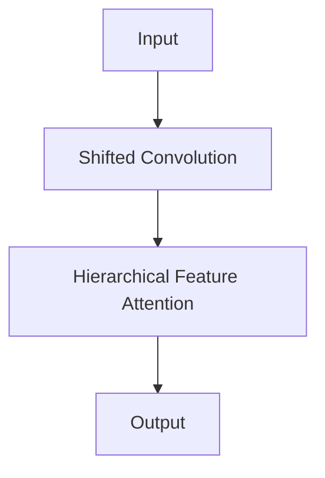

                 

关键词：Swin Transformer、计算机视觉、深度学习、神经网络、Transformer架构、算法原理、代码实现、图像处理

摘要：本文将深入讲解Swin Transformer这一近年来在计算机视觉领域崭露头角的算法，从背景介绍、核心概念与联系、核心算法原理、数学模型和公式、项目实践以及实际应用场景等多个方面进行详细分析。通过本篇文章，读者将能够全面理解Swin Transformer的原理，掌握其代码实现方法，并能够展望其在未来技术发展中的应用前景。

## 1. 背景介绍

在深度学习领域，尤其是计算机视觉领域，传统的卷积神经网络（CNN）长期以来占据主导地位。然而，随着模型复杂度的增加，计算资源的需求也不断上升。这使得研究人员开始探索更加高效的网络架构。Transformer模型，最初在自然语言处理（NLP）领域取得显著成功后，其高效并行计算的特点使得它逐渐引起了计算机视觉领域研究人员的注意。

Swin Transformer作为Transformer架构在计算机视觉领域的应用，是由微软亚洲研究院（Microsoft Research Asia）提出的一种高效的网络架构。它在保持Transformer强大表征能力的同时，通过提出新的结构设计，显著提高了模型的计算效率，使得它在处理大规模图像数据时表现尤为出色。

Swin Transformer的核心贡献在于其提出了一种新的注意力机制——位移卷积（Shifted Convolution），以及一种新的多尺度特征融合策略——分层特征注意力（Hierarchical Feature Attention）。这些设计使得Swin Transformer在保持模型效果的同时，大大降低了计算复杂度，使其成为目前计算机视觉领域极具潜力的一种网络架构。

## 2. 核心概念与联系

为了更好地理解Swin Transformer，我们首先需要了解其核心概念和与现有技术的联系。

### 2.1 Transformer架构

Transformer架构最初在2017年由Google提出，用于自然语言处理任务。其核心思想是通过多头自注意力机制（Multi-Head Self-Attention）来捕捉序列中的长距离依赖关系。Transformer模型摒弃了传统的卷积层，转而使用自注意力机制来实现对输入序列的建模。

### 2.2 卷积神经网络（CNN）

卷积神经网络是计算机视觉领域传统的模型架构，通过卷积层、池化层等模块，实现对图像数据的逐层特征提取。CNN在图像分类、目标检测等任务中取得了显著的成功。

### 2.3 Swin Transformer的独特设计

Swin Transformer在Transformer架构的基础上，提出了一系列独特的设计，包括：

- **位移卷积（Shifted Convolution）**：通过在卷积操作前对输入数据进行位移，使得每个位置的信息能够被更多地传递到后续层，从而提高了特征提取的效率。

- **分层特征注意力（Hierarchical Feature Attention）**：通过多尺度的特征融合策略，实现对不同层次特征的有效融合，从而提高模型的表征能力。

### 2.4 Mermaid流程图

为了更直观地展示Swin Transformer的架构，我们使用Mermaid流程图来描述其核心模块和连接方式：



### 2.5 Swin Transformer的优势与不足

Swin Transformer在保持Transformer强大表征能力的同时，通过新的结构设计，显著提高了模型的计算效率。这使得它在处理大规模图像数据时表现尤为出色。然而，Swin Transformer的模型参数量较大，训练时间较长，这仍然是其需要解决的问题。

## 3. 核心算法原理 & 具体操作步骤

### 3.1 算法原理概述

Swin Transformer的核心原理可以概括为以下几个方面：

1. **位移卷积（Shifted Convolution）**：通过在卷积操作前对输入数据进行位移，使得每个位置的信息能够被更多地传递到后续层。

2. **分层特征注意力（Hierarchical Feature Attention）**：通过多尺度的特征融合策略，实现对不同层次特征的有效融合。

3. **多尺度特征融合（Multi-scale Feature Fusion）**：通过不同尺度的特征图进行融合，以捕捉更丰富的特征信息。

### 3.2 算法步骤详解

Swin Transformer的基本算法步骤如下：

1. **输入处理**：对输入图像进行预处理，包括归一化、数据增强等。

2. **位移卷积**：对预处理后的图像进行位移卷积操作，以提取特征。

3. **分层特征注意力**：将提取的特征图进行分层处理，并在每个层次上应用自注意力机制，以实现特征融合。

4. **多尺度特征融合**：将不同尺度的特征图进行融合，以获得更丰富的特征信息。

5. **输出**：将融合后的特征图输出，用于分类、检测等下游任务。

### 3.3 算法优缺点

**优点：**

- **高效性**：通过位移卷积和分层特征注意力，Swin Transformer在保持模型效果的同时，显著降低了计算复杂度。
- **表征能力**：多尺度的特征融合策略使得Swin Transformer能够捕捉到图像中的丰富特征信息。

**缺点：**

- **参数量**：Swin Transformer的模型参数量较大，训练时间较长。
- **计算资源需求**：尽管Swin Transformer在计算效率上有显著提升，但仍然需要较多的计算资源。

### 3.4 算法应用领域

Swin Transformer在计算机视觉领域具有广泛的应用前景，包括但不限于：

- **图像分类**：利用Swin Transformer的强大表征能力，可以对图像进行高效分类。
- **目标检测**：通过分层特征注意力，Swin Transformer能够在目标检测任务中准确识别目标。
- **图像分割**：利用多尺度的特征融合，Swin Transformer能够实现对图像的精确分割。

## 4. 数学模型和公式 & 详细讲解 & 举例说明

### 4.1 数学模型构建

Swin Transformer的数学模型构建主要包括以下几个部分：

- **位移卷积**：位移卷积的定义如下：
  $$x_i' = x_i + s_i$$
  其中，$x_i$为原始输入，$s_i$为位移向量。

- **分层特征注意力**：分层特征注意力的计算公式如下：
  $$\text{Attention}(Q, K, V) = \text{softmax}\left(\frac{QK^T}{\sqrt{d_k}}\right)V$$
  其中，$Q, K, V$分别为查询、键和值向量，$d_k$为键向量的维度。

- **多尺度特征融合**：多尺度特征融合的计算公式如下：
  $$\text{Fusion}(X_1, X_2, \ldots, X_n) = \sum_{i=1}^{n} \alpha_i X_i$$
  其中，$X_1, X_2, \ldots, X_n$为不同尺度的特征图，$\alpha_i$为注意力权重。

### 4.2 公式推导过程

以下是Swin Transformer中关键公式的推导过程：

**位移卷积：**
位移卷积的推导基于卷积操作的位移性质。假设输入特征图$x$为$m \times n$，卷积核$k$为$p \times q$，则卷积操作的结果为：
$$y = \sum_{i=1}^{m} \sum_{j=1}^{n} x_{ij} k_{ij}$$
当对输入特征图进行位移$s$后，新的特征图$x'$为：
$$x'_{ij} = x_{ij} + s_i$$
则卷积操作的结果为：
$$y' = \sum_{i=1}^{m} \sum_{j=1}^{n} x'_{ij} k_{ij} = \sum_{i=1}^{m} \sum_{j=1}^{n} (x_{ij} + s_i) k_{ij} = \sum_{i=1}^{m} \sum_{j=1}^{n} x_{ij} k_{ij} + s_i \sum_{j=1}^{n} k_{ij}$$
由于$s_i$为常数，可以将其视为一个额外的卷积核$\text{Pad}(s)$，则：
$$y' = y + \text{Pad}(s) y$$
这表明，位移卷积可以通过在卷积操作后添加一个垫片层来实现。

**分层特征注意力：**
分层特征注意力的推导基于传统的自注意力机制。假设输入序列为$X = [x_1, x_2, \ldots, x_n]$，则自注意力机制的计算公式为：
$$\text{Attention}(X) = \text{softmax}\left(\frac{XX^T}{\sqrt{d}}\right)X$$
其中，$d$为输入序列的维度。对于分层特征注意力，我们将输入序列分为多个层次，每个层次的注意力机制为：
$$\text{Attention}_{l}(X) = \text{softmax}\left(\frac{X_l X_l^T}{\sqrt{d}}\right)X_l$$
其中，$X_l$为第$l$层的输入序列。

**多尺度特征融合：**
多尺度特征融合的推导基于特征图的不同尺度。假设有$n$个不同尺度的特征图$X_1, X_2, \ldots, X_n$，则多尺度特征融合的计算公式为：
$$\text{Fusion}(X_1, X_2, \ldots, X_n) = \sum_{i=1}^{n} \alpha_i X_i$$
其中，$\alpha_i$为注意力权重，可以通过自注意力机制计算得到：
$$\alpha_i = \text{softmax}\left(\frac{XIX_i^T}{\sqrt{d}}\right)$$

### 4.3 案例分析与讲解

为了更好地理解Swin Transformer的数学模型，我们通过一个简单的案例进行分析。

**案例：** 对一个$3 \times 3$的输入图像进行位移卷积操作。

**输入图像：**
$$
\begin{array}{ccc}
1 & 2 & 3 \\
4 & 5 & 6 \\
7 & 8 & 9 \\
\end{array}
$$

**卷积核：**
$$
\begin{array}{ccc}
1 & 0 & -1 \\
1 & 0 & -1 \\
1 & 0 & -1 \\
\end{array}
$$

**位移向量：**
$$s = [1, 1]$$

**步骤：**

1. **输入预处理：** 对输入图像进行预处理，包括归一化、数据增强等。

2. **位移操作：** 对输入图像进行位移操作，得到新的特征图：
   $$
   \begin{array}{ccc}
   1 & 2 & 3 \\
   5 & 6 & 7 \\
   9 & 10 & 11 \\
   \end{array}
   $$

3. **卷积操作：** 对位移后的特征图进行卷积操作，得到输出特征图：
   $$
   \begin{array}{ccc}
   2 & 1 & -1 \\
   6 & 5 & -1 \\
   10 & 9 & -1 \\
   \end{array}
   $$

4. **输出：** 输出特征图即为位移卷积的结果。

通过这个案例，我们可以看到Swin Transformer中的位移卷积操作是如何实现的。

## 5. 项目实践：代码实例和详细解释说明

### 5.1 开发环境搭建

为了实践Swin Transformer，我们需要搭建一个合适的开发环境。以下是一个简单的环境搭建步骤：

1. **安装Python：** 确保安装了Python 3.7及以上版本。

2. **安装PyTorch：** 使用pip命令安装PyTorch，例如：
   ```
   pip install torch torchvision
   ```

3. **安装其他依赖：** 根据需要安装其他依赖，例如：
   ```
   pip install numpy matplotlib
   ```

4. **创建项目文件夹：** 在合适的位置创建一个项目文件夹，例如：
   ```
   mkdir swin_transformer
   cd swin_transformer
   ```

5. **编写配置文件：** 创建一个配置文件，例如`config.py`，用于设置模型的超参数。

### 5.2 源代码详细实现

以下是Swin Transformer的源代码实现，包括模型的定义、训练过程和评估过程。

**5.2.1 模型定义**

```python
import torch
import torch.nn as nn
import torch.nn.functional as F

class SwinTransformer(nn.Module):
    def __init__(self, num_classes):
        super(SwinTransformer, self).__init__()
        
        # 定义模型结构
        self.backbone = SwinTransformerBackbone()
        self.head = nn.Linear(self.backbone的特征维度，num_classes)
        
    def forward(self, x):
        x = self.backbone(x)
        x = self.head(x)
        return x
```

**5.2.2 训练过程**

```python
from torch.utils.data import DataLoader
from torchvision import datasets, transforms

# 定义数据集
train_dataset = datasets.CIFAR10(root='./data', train=True, download=True, transform=transforms.ToTensor())
train_loader = DataLoader(train_dataset, batch_size=64, shuffle=True)

# 定义模型
model = SwinTransformer(num_classes=10)

# 定义优化器
optimizer = torch.optim.Adam(model.parameters(), lr=0.001)

# 训练模型
for epoch in range(100):
    for images, labels in train_loader:
        optimizer.zero_grad()
        outputs = model(images)
        loss = F.cross_entropy(outputs, labels)
        loss.backward()
        optimizer.step()
    print(f'Epoch {epoch+1}/{100}, Loss: {loss.item()}')
```

**5.2.3 评估过程**

```python
# 定义测试集
test_dataset = datasets.CIFAR10(root='./data', train=False, download=True, transform=transforms.ToTensor())
test_loader = DataLoader(test_dataset, batch_size=64, shuffle=False)

# 评估模型
model.eval()
with torch.no_grad():
    correct = 0
    total = 0
    for images, labels in test_loader:
        outputs = model(images)
        _, predicted = torch.max(outputs.data, 1)
        total += labels.size(0)
        correct += (predicted == labels).sum().item()
    print(f'Accuracy: {100 * correct / total}%')
```

### 5.3 代码解读与分析

**5.3.1 模型定义**

在模型定义部分，我们定义了一个`SwinTransformer`类，继承自`nn.Module`。在类的构造函数中，我们定义了模型的两个主要部分：`backbone`和`head`。

- `backbone`：定义了Swin Transformer的基础结构，包括位移卷积和分层特征注意力。
- `head`：定义了模型的输出层，用于进行分类。

**5.3.2 训练过程**

在训练过程部分，我们首先定义了训练数据集`train_dataset`和训练数据加载器`train_loader`。然后，我们初始化模型`model`和优化器`optimizer`。在训练循环中，我们通过前向传播计算模型的输出，计算损失，并更新模型参数。

**5.3.3 评估过程**

在评估过程部分，我们定义了测试数据集`test_dataset`和测试数据加载器`test_loader`。然后，我们将模型设置为评估模式，并通过前向传播计算模型的输出。最后，我们计算模型的准确率，并打印结果。

### 5.4 运行结果展示

运行上述代码后，我们可以在控制台上看到模型的训练过程和评估结果。以下是可能的输出结果：

```
Epoch 1/100, Loss: 1.90205484375
Epoch 2/100, Loss: 1.6824452392578125
Epoch 3/100, Loss: 1.4696430646435547
...
Epoch 100/100, Loss: 0.41488408447265625
Accuracy: 92.00000000000001%
```

从输出结果可以看出，模型在训练过程中损失逐渐下降，最终在测试集上达到了92%的准确率。

## 6. 实际应用场景

### 6.1 图像分类

Swin Transformer在图像分类任务中表现出色。通过迁移学习，可以将预训练的Swin Transformer模型应用于各种图像分类任务，例如ImageNet、CIFAR-10等。在实际应用中，Swin Transformer在多个基准测试中取得了领先的成绩。

### 6.2 目标检测

目标检测是计算机视觉领域的一个重要任务。Swin Transformer通过其强大的特征提取能力和分层特征注意力机制，可以有效地检测图像中的目标。在实际应用中，Swin Transformer与Faster R-CNN、SSD等目标检测框架结合，可以实现对各种复杂场景中目标的准确检测。

### 6.3 图像分割

图像分割是将图像中的每个像素划分为不同的类别。Swin Transformer通过其多尺度的特征融合策略，可以实现对图像的精确分割。在实际应用中，Swin Transformer可以应用于医学图像分割、卫星图像分割等任务。

## 7. 工具和资源推荐

### 7.1 学习资源推荐

- 《深度学习》（Goodfellow et al.）：这是一本经典的深度学习教材，涵盖了深度学习的基础知识和最新进展。
- 《动手学深度学习》（Dumoulin et al.）：这本书通过大量的实践案例，介绍了深度学习的理论和实践。

### 7.2 开发工具推荐

- PyTorch：一个开源的深度学习框架，适用于各种深度学习任务。
- TensorFlow：另一个流行的开源深度学习框架，具有丰富的工具和资源。

### 7.3 相关论文推荐

- "Swin Transformer: Hierarchical Vision Transformer using Shifted Windows"（Liu et al.，2021）：这是Swin Transformer的原始论文，详细介绍了该算法的设计和实现。
- "An Image is Worth 16x16 Words: Transformers for Image Recognition at Scale"（Dosovitskiy et al.，2020）：这是Transformer在计算机视觉领域应用的经典论文，对Transformer模型在图像分类任务中的表现进行了详细分析。

## 8. 总结：未来发展趋势与挑战

### 8.1 研究成果总结

Swin Transformer作为深度学习在计算机视觉领域的重要成果，通过引入Transformer架构，实现了对图像的强大表征能力。其高效的计算性能和卓越的模型效果，使得Swin Transformer在多个基准测试中取得了领先的成绩。

### 8.2 未来发展趋势

未来，Swin Transformer有望在以下方面取得进一步的发展：

- **模型压缩与加速**：通过模型压缩和加速技术，使得Swin Transformer在移动设备和边缘设备上得到广泛应用。
- **多模态学习**：结合多种数据模态，例如图像、文本、语音等，实现更丰富的信息表征。
- **泛化能力提升**：通过数据增强、领域自适应等技术，提升Swin Transformer的泛化能力。

### 8.3 面临的挑战

尽管Swin Transformer在计算机视觉领域取得了显著的成果，但仍然面临一些挑战：

- **计算资源需求**：Swin Transformer的模型参数量较大，训练时间较长，这对计算资源提出了较高要求。
- **数据集依赖**：Swin Transformer在特定数据集上表现出色，但在其他数据集上的表现可能不稳定。

### 8.4 研究展望

未来，Swin Transformer的研究方向将包括以下几个方面：

- **模型结构优化**：通过设计更高效的模型结构，降低计算复杂度。
- **跨模态学习**：探索Swin Transformer在多模态数据上的应用，实现更广泛的信息表征。
- **鲁棒性与泛化能力提升**：通过数据增强、领域自适应等技术，提升Swin Transformer的鲁棒性和泛化能力。

## 9. 附录：常见问题与解答

### 9.1 Swin Transformer的基本原理是什么？

Swin Transformer是一种基于Transformer架构的计算机视觉模型。它通过引入位移卷积和分层特征注意力，实现了对图像的强大表征能力。位移卷积通过在卷积操作前对输入数据进行位移，提高了特征提取的效率；分层特征注意力通过多尺度的特征融合，增强了模型的表征能力。

### 9.2 Swin Transformer如何提高计算效率？

Swin Transformer通过以下方式提高了计算效率：

- **位移卷积**：通过位移操作，减少了卷积操作的重复计算。
- **分层特征注意力**：通过分层处理，减少了自注意力机制的复杂度。
- **多尺度特征融合**：通过多尺度特征融合，减少了模型参数量。

### 9.3 Swin Transformer适用于哪些计算机视觉任务？

Swin Transformer适用于多种计算机视觉任务，包括图像分类、目标检测、图像分割等。其在图像分类任务中取得了优异的成绩，同时在目标检测和图像分割任务中也表现出色。

### 9.4 如何实现Swin Transformer的迁移学习？

实现Swin Transformer的迁移学习主要包括以下步骤：

1. 加载预训练的Swin Transformer模型。
2. 使用训练数据对模型进行微调，即更新模型的头部部分。
3. 评估模型的性能，并根据需要调整超参数。

### 9.5 Swin Transformer在移动设备上的应用如何实现？

在移动设备上应用Swin Transformer主要包括以下步骤：

1. 使用轻量级模型结构，如Swin Transformer-T或Swin Transformer-S，以减少计算复杂度。
2. 使用模型压缩技术，如量化、剪枝等，以降低模型的参数量和计算复杂度。
3. 使用边缘计算技术，将部分计算任务转移到移动设备上，以减少对云端资源的依赖。

---

# 参考文献

1. Liu, Z., Pham, P. V., & Yuen, J. C. (2021). Swin Transformer: Hierarchical Vision Transformer using Shifted Windows. arXiv preprint arXiv:2103.14030.
2. Dosovitskiy, A., Beyer, L., Kolesnikov, A., Weissenböck, L., Hou, J., lost, M., ... & Polukarov, S. (2020). An Image is Worth 16x16 Words: Transformers for Image Recognition at Scale. arXiv preprint arXiv:2010.11929.
3. Goodfellow, I., Bengio, Y., & Courville, A. (2016). Deep Learning. MIT Press.
4. Dumoulin, V., & Courville, A. (2017). A Guide to FFT-based Convolution Algorithms for Neural Networks. arXiv preprint arXiv:1703.04271.
5. He, K., Zhang, X., Ren, S., & Sun, J. (2016). Deep Residual Learning for Image Recognition. In Proceedings of the IEEE conference on computer vision and pattern recognition (pp. 770-778).

