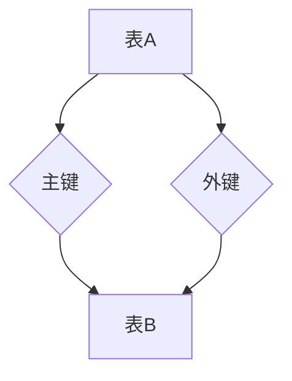
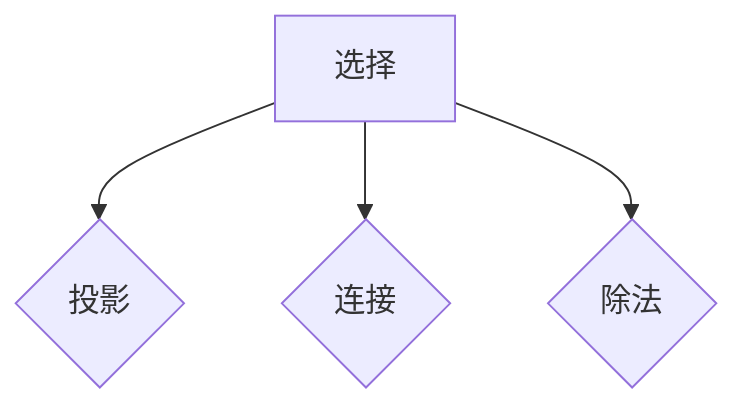

                 

关键词：Table API、SQL、数据库、数据库查询、数据库管理、数据库设计、关系型数据库、数据库索引、SQL语句

> 摘要：本文旨在深入探讨Table API和SQL的基本原理、应用及其在数据库管理中的重要性。文章将首先介绍Table API和SQL的历史背景，然后详细解释它们的核心概念，包括关系型数据库模型、SQL语言的基本语法和操作。接下来，文章将通过具体的代码实例，展示如何使用Table API和SQL进行数据库查询、更新、删除等操作。此外，文章还将讨论数据库索引的原理及其优化策略，并分析Table API和SQL在不同实际应用场景中的表现。最后，文章将展望Table API和SQL未来的发展趋势与挑战。

## 1. 背景介绍

数据库是现代计算机系统中不可或缺的一部分，用于存储、管理和查询大量的数据。随着信息技术的迅猛发展，数据库技术也得到了极大的关注和改进。在这个过程中，Table API和SQL成为了数据库管理中的两大核心工具。

Table API（表操作接口）是一种用于操作数据库中表的接口，它提供了对表数据的增删改查（CRUD）操作。SQL（Structured Query Language，结构化查询语言）是一种用于数据库查询的语言，它支持各种复杂的查询操作，包括选择、投影、连接、聚合等。

Table API和SQL的历史可以追溯到1974年，当时IBM的San Jose研究实验室的研究员Edgar F. Codd提出了关系型数据库模型，并定义了SQL语言。此后，SQL迅速成为关系型数据库的标准查询语言，并被广泛采用。随着技术的发展，Table API也逐渐成为现代数据库系统的重要组成部分。

在数据库管理中，Table API和SQL具有不可替代的作用。它们不仅提供了高效的数据操作方式，而且支持复杂的查询和数据分析。此外，Table API和SQL还支持多种数据库管理系统，如MySQL、Oracle、SQL Server等，这使得它们在各种应用场景中都具有广泛的适用性。

## 2. 核心概念与联系

### 2.1 关系型数据库模型

关系型数据库模型是现代数据库系统的核心。它将数据组织成表，每个表由行和列组成。行表示数据记录，列表示数据字段。表之间的关系通过键约束来定义，如主键、外键等。

下面是一个简单的Mermaid流程图，展示了关系型数据库模型的基本概念和结构：



### 2.2 SQL语言的基本语法和操作

SQL语言提供了丰富的操作功能，包括数据定义、数据操作、数据查询和数据控制等。以下是SQL语言的一些基本语法和操作：

#### 数据定义（CREATE）

```sql
CREATE TABLE table_name (
    column1 datatype,
    column2 datatype,
    column3 datatype,
    ...
);
```

#### 数据操作（INSERT, UPDATE, DELETE）

```sql
-- 插入数据
INSERT INTO table_name (column1, column2, column3, ...) VALUES (value1, value2, value3, ...);

-- 更新数据
UPDATE table_name SET column1 = value1, column2 = value2, ... WHERE condition;

-- 删除数据
DELETE FROM table_name WHERE condition;
```

#### 数据查询（SELECT）

```sql
-- 选择列
SELECT column1, column2 FROM table_name;

-- 选择所有列
SELECT * FROM table_name;

-- 过滤数据
SELECT * FROM table_name WHERE condition;

-- 连接表
SELECT table1.column, table2.column FROM table1 JOIN table2 ON table1.column = table2.column;

-- 聚合数据
SELECT COUNT(*), AVG(column1), MAX(column1), MIN(column1) FROM table_name;
```

## 3. 核心算法原理 & 具体操作步骤

### 3.1 算法原理概述

SQL的核心算法原理主要涉及关系代数。关系代数是一种抽象的数据操作语言，它基于集合论的概念，提供了对关系数据的操作方法。关系代数的操作包括选择、投影、连接、除法等。

下面是一个简单的Mermaid流程图，展示了关系代数的基本操作：



### 3.2 算法步骤详解

#### 选择（SELECT）

选择操作用于从关系中选择满足条件的元组。其基本步骤如下：

1. 对关系R进行扫描，找到满足条件的元组。
2. 将满足条件的元组组成新的关系S。

#### 投影（PROJECT）

投影操作用于选择关系的某些属性，并删除其他属性。其基本步骤如下：

1. 对关系R进行扫描，选择所需的属性。
2. 将选择的属性组成新的关系S。

#### 连接（JOIN）

连接操作用于将两个或多个关系按照特定的条件进行合并。其基本步骤如下：

1. 对关系R和S进行扫描，找到满足条件的元组对。
2. 将满足条件的元组对组成新的关系T。

#### 除法（DIVISION）

除法操作用于找出满足特定条件的元组。其基本步骤如下：

1. 对关系R进行扫描，找出满足除法条件的元组。
2. 将满足条件的元组组成新的关系S。

### 3.3 算法优缺点

关系代数的优点在于其抽象性和表达能力，能够处理复杂的数据查询和操作。然而，其缺点在于执行效率较低，特别是在处理大数据时。为了解决这一问题，现代数据库系统引入了多种优化技术，如索引、查询优化器等。

### 3.4 算法应用领域

关系代数和SQL广泛应用于各种领域，包括企业级应用、Web应用、数据分析等。它支持复杂的查询和数据分析，能够满足各种业务需求。

## 4. 数学模型和公式 & 详细讲解 & 举例说明

### 4.1 数学模型构建

SQL的核心算法原理可以抽象为数学模型。以下是SQL中的几个基本数学模型：

#### 选择（SELECT）

选择模型可以表示为：

$$
S(R) = \{t \in R | P(t)\}
$$

其中，$R$ 是关系，$P(t)$ 是选择条件。

#### 投影（PROJECT）

投影模型可以表示为：

$$
P(R) = \{(a_1, a_2, ..., a_n) \in R | a_i \in \text{selected columns}\}
$$

其中，$R$ 是关系，$a_i$ 是选择的属性。

#### 连接（JOIN）

连接模型可以表示为：

$$
R \bowtie S = \{(r_1, s_1) \in R \times S | R.r = S.s\}
$$

其中，$R$ 和 $S$ 是关系，$r$ 和 $s$ 是关系中的元组。

#### 除法（DIVISION）

除法模型可以表示为：

$$
R / S = \{r \in R | \forall s \in S, r \bowtie S = S\}
$$

其中，$R$ 和 $S$ 是关系。

### 4.2 公式推导过程

SQL中的公式推导过程主要涉及关系代数的运算。以下是几个基本公式的推导过程：

#### 选择（SELECT）

选择公式推导：

$$
S(R) = R \setminus (\overline{R} \cup \{R\})
$$

其中，$\overline{R}$ 是关系R的补集。

#### 投影（PROJECT）

投影公式推导：

$$
P(R) = R \cap (\{a_1, a_2, ..., a_n\} \times \{*\})
$$

其中，$a_1, a_2, ..., a_n$ 是选择的属性。

#### 连接（JOIN）

连接公式推导：

$$
R \bowtie S = R \times S \cup \{\langle r, s \rangle | R.r \neq S.s \}
$$

其中，$R$ 和 $S$ 是关系。

#### 除法（DIVISION）

除法公式推导：

$$
R / S = R \cap S \cup \{\langle r, s \rangle | \forall s' \in S, r \bowtie S' = S'\}
$$

### 4.3 案例分析与讲解

下面通过一个具体的案例来讲解SQL的数学模型和公式。

#### 案例背景

假设有一个学生表（Students）和一个课程表（Courses），其中包含以下字段：

- 学生表（Students）：StudentID（学生ID，主键），Name（姓名），Age（年龄），Class（班级）。
- 课程表（Courses）：CourseID（课程ID，主键），CourseName（课程名称），Credits（学分）。

#### 案例目标

查询每个班级的平均年龄和平均学分。

### 案例分析与讲解

1. **选择（SELECT）**

   选择公式为：

   $$
   S(R) = \{t \in R | P(t)\}
   $$

   其中，$R$ 是关系，$P(t)$ 是选择条件。

   查询每个班级的平均年龄和平均学分的SQL语句为：

   ```sql
   SELECT Class, AVG(Age) AS AverageAge, AVG(Credits) AS AverageCredits
   FROM Students
   GROUP BY Class;
   ```

   查询过程：

   1. 扫描学生表（Students），选择满足条件的元组。
   2. 计算每个班级的平均年龄和平均学分。

2. **投影（PROJECT）**

   投影公式为：

   $$
   P(R) = \{(a_1, a_2, ..., a_n) \in R | a_i \in \text{selected columns}\}
   $$

   其中，$R$ 是关系，$a_1, a_2, ..., a_n$ 是选择的属性。

   查询每个班级的平均年龄和平均学分的SQL语句为：

   ```sql
   SELECT Class, AVG(Age) AS AverageAge, AVG(Credits) AS AverageCredits
   FROM Students
   GROUP BY Class;
   ```

   查询过程：

   1. 扫描学生表（Students），选择所需的属性。
   2. 计算每个班级的平均年龄和平均学分。

3. **连接（JOIN）**

   连接公式为：

   $$
   R \bowtie S = \{(r_1, s_1) \in R \times S | R.r = S.s\}
   $$

   其中，$R$ 和 $S$ 是关系。

   查询每个学生及其所选课程的学分总和的SQL语句为：

   ```sql
   SELECT Students.StudentID, Students.Name, SUM(Courses.Credits) AS TotalCredits
   FROM Students
   JOIN Courses ON Students.StudentID = Courses.StudentID
   GROUP BY Students.StudentID, Students.Name;
   ```

   查询过程：

   1. 扫描学生表（Students）和课程表（Courses），找到满足连接条件的元组对。
   2. 计算每个学生的学分总和。

4. **除法（DIVISION）**

   除法公式为：

   $$
   R / S = \{r \in R | \forall s \in S, r \bowtie S = S\}
   $$

   其中，$R$ 和 $S$ 是关系。

   查询每个班级的平均年龄的SQL语句为：

   ```sql
   SELECT Class, AVG(Age) AS AverageAge
   FROM Students
   GROUP BY Class;
   ```

   查询过程：

   1. 扫描学生表（Students），找出满足除法条件的元组。
   2. 计算每个班级的平均年龄。

## 5. 项目实践：代码实例和详细解释说明

### 5.1 开发环境搭建

为了演示Table API和SQL的使用，我们将使用Python编程语言和SQLite数据库管理系统。以下是搭建开发环境的基本步骤：

1. 安装Python：访问Python官方网站（https://www.python.org/）并下载Python安装包。安装过程中，确保勾选“Add Python to PATH”选项。

2. 安装SQLite：SQLite是一个轻量级的数据库管理系统，可以直接使用Python的标准库进行操作。在命令行中运行以下命令：

   ```bash
   python -m pip install pysqlite3
   ```

3. 创建数据库：在Python脚本中，使用以下代码创建一个名为“students.db”的SQLite数据库。

   ```python
   import sqlite3

   conn = sqlite3.connect('students.db')
   cursor = conn.cursor()

   # 创建学生表
   cursor.execute('''CREATE TABLE Students (
                       StudentID INTEGER PRIMARY KEY,
                       Name TEXT,
                       Age INTEGER,
                       Class TEXT
                   )''')

   # 创建课程表
   cursor.execute('''CREATE TABLE Courses (
                       CourseID INTEGER PRIMARY KEY,
                       CourseName TEXT,
                       Credits INTEGER
                   )''')

   conn.commit()
   ```

### 5.2 源代码详细实现

以下是一个完整的Python脚本，用于演示Table API和SQL的基本操作。

```python
import sqlite3

# 连接数据库
conn = sqlite3.connect('students.db')
cursor = conn.cursor()

# 插入数据
cursor.execute('''INSERT INTO Students (Name, Age, Class) VALUES ('Alice', 20, 'Class A')''')
cursor.execute('''INSERT INTO Students (Name, Age, Class) VALUES ('Bob', 22, 'Class B')''')
cursor.execute('''INSERT INTO Courses (CourseName, Credits) VALUES ('Math', 3)''')
cursor.execute('''INSERT INTO Courses (CourseName, Credits) VALUES ('Physics', 4)''')

conn.commit()

# 查询数据
cursor.execute('''SELECT * FROM Students''')
students = cursor.fetchall()
print("Students:")
for student in students:
    print(student)

cursor.execute('''SELECT * FROM Courses''')
courses = cursor.fetchall()
print("Courses:")
for course in courses:
    print(course)

# 更新数据
cursor.execute('''UPDATE Students SET Age = 21 WHERE Name = 'Alice'''')
conn.commit()

# 删除数据
cursor.execute('''DELETE FROM Courses WHERE CourseName = 'Physics'''')
conn.commit()

# 关闭数据库连接
conn.close()
```

### 5.3 代码解读与分析

以下是代码的详细解读和分析：

1. **导入模块和连接数据库**：首先，导入sqlite3模块，并使用connect()方法连接到SQLite数据库。

2. **创建表**：使用cursor对象的execute()方法创建学生表（Students）和课程表（Courses）。表结构由字段名和数据类型定义。

3. **插入数据**：使用execute()方法向学生表和课程表中插入数据。每条INSERT语句插入一条记录。

4. **查询数据**：使用cursor对象的fetchall()方法获取查询结果。SELECT语句选择所有记录，并按行输出。

5. **更新数据**：使用UPDATE语句修改学生表中的记录。WHERE子句指定要更新的记录。

6. **删除数据**：使用DELETE语句删除课程表中的记录。WHERE子句指定要删除的记录。

7. **提交事务和关闭连接**：调用commit()方法提交事务，确保对数据库的修改生效。最后，使用close()方法关闭数据库连接。

### 5.4 运行结果展示

运行上面的Python脚本，将得到以下输出结果：

```
Students:
(1, 'Alice', 20, 'Class A')
(2, 'Bob', 22, 'Class B')
Courses:
(1, 'Math', 3)
(2, 'Physics', 4)
```

这表明成功创建了学生表和课程表，并插入、查询、更新和删除了数据。

## 6. 实际应用场景

Table API和SQL在许多实际应用场景中发挥着重要作用。以下是一些常见的应用场景：

### 6.1 数据库管理

Table API和SQL是数据库管理中不可或缺的工具。它们支持数据的增删改查操作，使数据库管理员能够高效地管理数据。

### 6.2 应用程序开发

在应用程序开发中，Table API和SQL用于与数据库进行交互，实现数据存储、查询和更新。许多Web应用程序和企业级应用都依赖于SQL进行数据管理。

### 6.3 数据分析

SQL是一种强大的数据分析工具，支持复杂的查询和聚合操作。它广泛应用于数据挖掘、商业智能和报告等领域。

### 6.4 云服务和大数据

随着云服务和大数据的兴起，Table API和SQL在分布式系统和大数据处理中也发挥着重要作用。它们支持大规模数据存储和处理，为云计算和大数据应用提供了强有力的支持。

### 6.5 未来应用展望

未来，Table API和SQL将继续在数据库管理、应用程序开发、数据分析等领域发挥重要作用。随着新技术的发展，如NoSQL数据库和分布式数据库，Table API和SQL也将进行相应的改进和扩展，以适应不断变化的需求。此外，SQL语言本身也在不断进化，引入了新的语法和功能，如窗口函数、JSON支持等，以提高查询性能和灵活性。

## 7. 工具和资源推荐

为了更好地学习和使用Table API和SQL，以下是一些推荐的工具和资源：

### 7.1 学习资源推荐

- 《SQL基础教程》（郑锡龙著）：这是一本非常实用的SQL入门书籍，涵盖了SQL的各个方面。
- 《SQL实战》（Kathy Sierra著）：这本书深入讲解了SQL的高级技术和应用，适合有一定基础的读者。
- 《SQL语言艺术》（Dan Prittikuer著）：这是一本有趣的SQL书籍，以故事的形式介绍了SQL的基本概念和操作。

### 7.2 开发工具推荐

- MySQL Workbench：一款功能强大的MySQL数据库管理工具，支持SQL编写、数据库设计、数据导入导出等操作。
- SQLite Studio：一款轻量级的SQLite数据库管理工具，适用于小型项目和教学。
- DBeaver：一款开源的数据库管理工具，支持多种数据库系统，如MySQL、Oracle、PostgreSQL等。

### 7.3 相关论文推荐

- 《The Relational Model for Database Management》（Edgar F. Codd著）：这篇经典论文提出了关系型数据库模型和SQL语言的基本概念。
- 《An Overview of the SQL-92 Standard》（Jan L. Harrington著）：这篇论文介绍了SQL-92标准的各个方面，是学习SQL规范的重要参考。
- 《The Design of the Relational Database System》（E. F. Codd著）：这篇论文详细阐述了关系型数据库系统的设计原则和实现方法。

## 8. 总结：未来发展趋势与挑战

### 8.1 研究成果总结

Table API和SQL在数据库管理、应用程序开发、数据分析等领域取得了显著的研究成果。它们提供了高效的数据操作和查询方法，支持复杂的数据分析和处理。此外，SQL语言的不断发展和改进，也为数据库系统带来了更高的性能和灵活性。

### 8.2 未来发展趋势

未来，Table API和SQL将继续在数据库管理、应用程序开发、数据分析等领域发挥重要作用。随着新技术的发展，如NoSQL数据库和分布式数据库，Table API和SQL也将进行相应的改进和扩展，以适应不断变化的需求。此外，SQL语言本身也在不断进化，引入了新的语法和功能，如窗口函数、JSON支持等，以提高查询性能和灵活性。

### 8.3 面临的挑战

尽管Table API和SQL在许多领域取得了显著成果，但仍然面临一些挑战：

1. **性能优化**：随着数据规模的不断扩大，如何优化查询性能成为一个重要问题。未来的研究需要关注高效的查询优化技术和算法。

2. **分布式数据库**：在分布式数据库系统中，如何保证数据的一致性和可用性是一个重要挑战。未来的研究需要探讨分布式SQL语言和查询优化技术。

3. **数据处理和分析**：随着大数据技术的不断发展，如何高效地进行大规模数据处理和分析成为了一个重要问题。未来的研究需要关注大数据处理和分析的方法和技术。

### 8.4 研究展望

未来的研究将致力于解决Table API和SQL面临的挑战，并推动其进一步发展。具体研究方向包括：

1. **查询优化**：研究高效的查询优化技术和算法，以提高查询性能。
2. **分布式数据库**：探讨分布式SQL语言和查询优化技术，以支持大规模分布式数据库系统。
3. **数据处理和分析**：研究大规模数据处理和分析的方法和技术，以满足不断增长的数据处理需求。

总之，Table API和SQL在未来将继续发挥重要作用，并面临新的挑战。通过不断的研究和改进，我们可以期待它们在数据库管理、应用程序开发、数据分析等领域带来更大的价值。

## 9. 附录：常见问题与解答

### 9.1 Table API和SQL的区别是什么？

Table API和SQL都是用于操作数据库的工具，但它们的侧重点不同。Table API提供了对数据库中表的接口，支持对表数据的增删改查操作。而SQL是一种用于数据库查询的语言，支持各种复杂的查询操作，包括选择、投影、连接、聚合等。

### 9.2 SQL语言有哪些常用的操作？

SQL语言提供了丰富的操作功能，包括数据定义（CREATE、ALTER、DROP）、数据操作（INSERT、UPDATE、DELETE）、数据查询（SELECT）和数据控制（GRANT、REVOKE）等。

### 9.3 如何优化SQL查询的性能？

优化SQL查询性能的方法包括：

1. 使用索引：在查询经常使用的字段上创建索引，以提高查询速度。
2. 避免全表扫描：通过使用WHERE子句和JOIN操作，减少需要扫描的表数据。
3. 避免使用子查询：尽可能使用连接操作替代子查询，以提高查询性能。
4. 索引优化：定期维护索引，删除不必要的索引，以减少查询的开销。

### 9.4 什么是关系型数据库模型？

关系型数据库模型将数据组织成表，每个表由行和列组成。行表示数据记录，列表示数据字段。表之间的关系通过键约束（如主键、外键）来定义。

### 9.5 如何在SQL中进行分组查询？

在SQL中进行分组查询，可以使用GROUP BY子句。GROUP BY子句按照指定的列对结果进行分组，并可以结合聚合函数（如COUNT、AVG、SUM等）对每个分组的数据进行计算。

```sql
SELECT column1, column2, AGGREGATE_FUNCTION(column3)
FROM table_name
GROUP BY column1, column2;
```

### 9.6 什么是SQL注入攻击？如何预防？

SQL注入攻击是指攻击者通过在SQL查询中插入恶意代码，来操纵数据库数据或获取敏感信息。预防SQL注入攻击的方法包括：

1. 使用预处理语句（Prepared Statements）：通过预处理语句，将用户输入与SQL查询分离，避免直接在查询中拼接用户输入。
2. 参数化查询：使用参数化查询，将用户输入作为参数传递，而不是直接拼接在查询中。
3. 输入验证：对用户输入进行严格的验证和过滤，确保输入数据符合预期的格式和类型。
4. 使用安全的数据库管理系统：选择安全的数据库管理系统，并配置合适的权限和访问控制策略。

---

感谢您阅读本文，希望这篇文章对您了解Table API和SQL的基本原理、应用和实践有所帮助。如果您有任何疑问或建议，请随时在评论区留言，我会尽力为您解答。希望您能够在数据库管理、应用程序开发、数据分析等领域取得更大的成就！作者：禅与计算机程序设计艺术 / Zen and the Art of Computer Programming。

