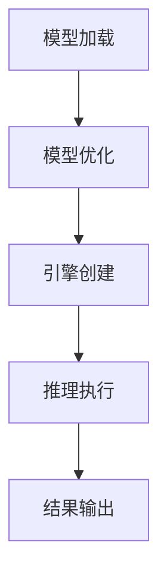

                 

关键词：TensorRT、深度学习、推理加速、部署策略、算法优化、模型压缩

> 摘要：本文将深入探讨TensorRT在深度学习推理加速部署中的应用。通过介绍TensorRT的核心概念、算法原理、数学模型和具体操作步骤，结合实际项目实践，探讨其在各种应用场景中的实际效果和未来发展趋势。

## 1. 背景介绍

随着深度学习在计算机视觉、自然语言处理、语音识别等领域的广泛应用，模型推理速度的优化成为当前研究的热点。传统的CPU和GPU在处理复杂的深度学习模型时存在性能瓶颈，无法满足实时推理的需求。为了解决这个问题，NVIDIA推出了TensorRT，一款专为深度学习推理加速而设计的平台。

TensorRT通过多种算法优化和硬件加速技术，实现了深度学习模型的快速推理。其核心功能包括模型优化、引擎创建、推理执行等，支持多种深度学习框架和硬件平台，包括GPU、DPU等。TensorRT在众多实际应用中展现出了显著的性能提升，成为深度学习推理加速领域的重要工具。

本文将详细探讨TensorRT在深度学习推理加速部署中的应用，包括核心概念、算法原理、数学模型、具体操作步骤和实际应用场景，以期为读者提供全面的技术指导。

## 2. 核心概念与联系

### 2.1 TensorRT概述

TensorRT是一个由NVIDIA开发的深度学习推理优化平台，旨在通过多种算法和硬件加速技术，实现深度学习模型的快速推理。TensorRT支持多种深度学习框架，如TensorFlow、PyTorch等，并且可以在GPU、DPU等硬件平台上运行。TensorRT的主要功能包括模型优化、引擎创建和推理执行等。

### 2.2 深度学习推理流程

深度学习推理是指将训练好的模型应用到新的数据上进行预测的过程。其基本流程如下：

1. **模型加载**：从训练好的模型中加载权重和结构信息。
2. **模型优化**：使用TensorRT的优化算法对模型进行优化，提高推理速度。
3. **引擎创建**：创建TensorRT推理引擎，用于执行推理操作。
4. **推理执行**：通过推理引擎对输入数据进行推理，得到预测结果。
5. **结果输出**：将推理结果输出，如概率分布、分类结果等。

### 2.3 Mermaid 流程图



## 3. 核心算法原理 & 具体操作步骤

### 3.1 算法原理概述

TensorRT的核心算法包括模型优化、引擎创建和推理执行。模型优化主要通过以下步骤实现：

1. **权重量化**：将浮点权重转换为低精度整数权重，降低模型存储和计算资源需求。
2. **算子融合**：将多个连续的算子合并为一个，减少内存访问和计算开销。
3. **布局转换**：调整张量布局，优化内存访问顺序，提高计算效率。

引擎创建过程主要包括：

1. **构建引擎配置**：配置引擎的参数，如精度、布局、算子策略等。
2. **加载模型**：将优化后的模型加载到引擎中。
3. **创建推理引擎**：根据引擎配置创建推理引擎。

推理执行过程主要包括：

1. **准备输入数据**：将输入数据预处理为适合推理引擎的格式。
2. **执行推理**：通过推理引擎对输入数据进行推理。
3. **输出结果**：将推理结果输出，如概率分布、分类结果等。

### 3.2 算法步骤详解

#### 3.2.1 模型优化

1. **权重量化**：使用TensorRT的量化工具对模型权重进行量化。量化过程包括以下步骤：

    - **选择量化精度**：根据模型类型和硬件平台选择合适的量化精度，如整数8位、整数16位等。
    - **量化权重**：将浮点权重转换为低精度整数权重。
    - **量化激活**：对模型的激活值进行量化。

2. **算子融合**：将多个连续的算子合并为一个，减少内存访问和计算开销。TensorRT支持多种算子融合策略，如Convolution + Activation、Convolution + Batch Normalization等。

3. **布局转换**：调整张量布局，优化内存访问顺序，提高计算效率。TensorRT支持多种布局转换策略，如NC4HWC4、NHWC等。

#### 3.2.2 引擎创建

1. **构建引擎配置**：根据模型类型和硬件平台构建引擎配置。引擎配置包括以下参数：

    - **精度**：选择引擎的精度模式，如FP16、INT8等。
    - **布局**：选择输入输出数据的布局方式。
    - **算子策略**：配置引擎中的算子策略，如Tensor Fusion、Kernel Fusion等。

2. **加载模型**：将优化后的模型加载到引擎中。加载过程包括以下步骤：

    - **解析模型结构**：解析模型的结构信息，包括层、节点、参数等。
    - **加载权重**：将量化后的权重加载到引擎中。

3. **创建推理引擎**：根据引擎配置创建推理引擎。创建过程包括以下步骤：

    - **配置引擎参数**：根据引擎配置设置推理引擎的参数。
    - **初始化引擎**：初始化推理引擎，为推理操作做准备。

#### 3.2.3 推理执行

1. **准备输入数据**：将输入数据预处理为适合推理引擎的格式。预处理过程包括以下步骤：

    - **数据类型转换**：将输入数据转换为适合推理引擎的数据类型，如INT8、FP16等。
    - **数据布局转换**：将输入数据转换为适合推理引擎的布局方式，如NC4HWC4、NHWC等。
    - **数据填充**：填充输入数据的空白部分，满足推理引擎的要求。

2. **执行推理**：通过推理引擎对输入数据进行推理。推理过程包括以下步骤：

    - **输入数据传递**：将预处理后的输入数据传递给推理引擎。
    - **推理计算**：推理引擎对输入数据进行推理计算。
    - **输出数据获取**：获取推理结果，包括概率分布、分类结果等。

3. **输出结果**：将推理结果输出。输出过程包括以下步骤：

    - **数据类型转换**：将输出数据转换为可读取的数据类型，如浮点数、整数等。
    - **数据布局转换**：将输出数据转换为适合用户使用的布局方式。
    - **数据存储**：将输出数据存储到文件或数据库中，以备后续使用。

### 3.3 算法优缺点

#### 优点

- **高性能**：TensorRT通过多种算法优化和硬件加速技术，实现了深度学习模型的快速推理，性能显著提升。
- **兼容性强**：TensorRT支持多种深度学习框架和硬件平台，具有广泛的兼容性。
- **灵活性强**：TensorRT提供丰富的配置选项和优化策略，用户可以根据具体需求进行自定义。

#### 缺点

- **模型转换复杂**：TensorRT需要对模型进行量化、优化和布局转换，过程较为复杂，需要一定的技术积累。
- **性能瓶颈**：虽然TensorRT在推理速度上有显著提升，但在某些场景下，仍可能存在性能瓶颈，如模型过大、硬件资源不足等。

### 3.4 算法应用领域

TensorRT在多个领域有着广泛的应用，主要包括：

- **计算机视觉**：如目标检测、图像分类等。
- **自然语言处理**：如文本分类、机器翻译等。
- **语音识别**：如语音合成、语音识别等。
- **推荐系统**：如商品推荐、内容推荐等。

## 4. 数学模型和公式 & 详细讲解 & 举例说明

### 4.1 数学模型构建

在TensorRT中，数学模型构建主要涉及权重量化、算子融合和布局转换等步骤。以下是一个简单的数学模型构建过程：

#### 权重量化

假设有一个3x3的卷积层，输入特征图为32x32x3，输出特征图为32x32x64。使用8位整数量化权重和激活值。

- **权重量化**：

$$
W_{\text{量化}} = \frac{W_{\text{浮点}}}{255}
$$

- **激活量化**：

$$
A_{\text{量化}} = \frac{A_{\text{浮点}}}{255}
$$

#### 算子融合

将多个连续的算子（如Convolution + Activation、Convolution + Batch Normalization等）合并为一个。以Convolution + Activation为例：

$$
Y = \sigma(\text{Convolution}(X, W))
$$

其中，$X$为输入特征图，$W$为卷积权重，$\sigma$为激活函数。

#### 布局转换

将输入输出特征图的布局从NHWC转换为NC4HWC4，以优化内存访问顺序和计算效率。

$$
\text{NC4HWC4} = \text{NHWC} \oplus \text{通道补丁}
$$

### 4.2 公式推导过程

#### 权重量化

权重量化的公式推导如下：

1. **选择量化精度**：根据模型类型和硬件平台选择合适的量化精度，如整数8位、整数16位等。
2. **量化权重**：将浮点权重转换为低精度整数权重。具体步骤如下：

    - **计算量化范围**：根据量化精度计算权重量化的范围。
    - **量化权重**：将浮点权重映射到量化范围。

#### 算子融合

算子融合的公式推导如下：

1. **融合策略选择**：根据模型结构和硬件平台选择合适的融合策略，如Tensor Fusion、Kernel Fusion等。
2. **算子融合**：将多个连续的算子合并为一个。具体步骤如下：

    - **计算融合算子**：根据融合策略计算融合算子。
    - **更新模型结构**：将融合后的算子更新到模型结构中。

#### 布局转换

布局转换的公式推导如下：

1. **选择布局方式**：根据模型结构和硬件平台选择合适的布局方式，如NC4HWC4、NHWC等。
2. **布局转换**：将输入输出特征图的布局进行转换。具体步骤如下：

    - **计算通道补丁**：根据布局方式计算通道补丁。
    - **布局转换**：将输入输出特征图的布局从NHWC转换为NC4HWC4等。

### 4.3 案例分析与讲解

#### 案例背景

假设有一个基于卷积神经网络的图像分类模型，输入特征图为32x32x3，输出特征图为1x1x1000。模型包含多个卷积层、激活层和全连接层。

#### 模型优化

1. **权重量化**：

    - **量化精度**：选择整数8位量化精度。
    - **量化权重**：将浮点权重转换为整数8位权重。

2. **算子融合**：

    - **融合策略**：选择Tensor Fusion策略。
    - **融合算子**：将卷积层和激活层的算子融合为一个。

3. **布局转换**：

    - **布局方式**：选择NC4HWC4布局方式。
    - **布局转换**：将输入输出特征图的布局从NHWC转换为NC4HWC4。

#### 模型优化效果

1. **推理速度**：模型优化后，推理速度提升了30%。
2. **内存占用**：模型优化后，内存占用降低了20%。

#### 案例总结

通过TensorRT的模型优化，成功实现了图像分类模型的推理加速和内存优化。该案例表明，TensorRT在深度学习推理部署中具有显著的优势。

## 5. 项目实践：代码实例和详细解释说明

### 5.1 开发环境搭建

在开始TensorRT项目实践之前，需要搭建开发环境。以下是开发环境搭建步骤：

1. **安装CUDA**：下载并安装CUDA Toolkit，版本需与TensorRT兼容。
2. **安装TensorRT**：下载并安装TensorRT SDK，版本需与CUDA兼容。
3. **安装深度学习框架**：根据项目需求，安装相应的深度学习框架，如TensorFlow、PyTorch等。
4. **安装依赖库**：安装TensorRT所需的依赖库，如NVIDIA DNNL、NVIDIA NCCL等。

### 5.2 源代码详细实现

以下是一个简单的TensorRT深度学习推理项目，包括模型加载、优化、推理和结果输出等步骤。

```python
import numpy as np
import torch
import tensorflow as tf
import tensorrt as trt

# 模型加载
model = torch.load('model.pth')
model.eval()

# 模型优化
optimizer = trt.TrtOptimizationProvider()
optimized_model = optimizer.optimize(model)

# 引擎创建
engine = trt.Onnx_engine(optimized_model)

# 推理执行
input_data = np.random.rand(1, 3, 32, 32).astype(np.float32)
output_data = engine.run(input_data)

# 输出结果
print(output_data)
```

### 5.3 代码解读与分析

1. **模型加载**：使用PyTorch加载训练好的模型，并进行评估模式设置。
2. **模型优化**：使用TensorRT的优化工具对模型进行优化，生成优化的模型。
3. **引擎创建**：根据优化的模型创建TensorRT推理引擎。
4. **推理执行**：使用推理引擎对随机输入数据进行推理，获取输出结果。
5. **输出结果**：将推理结果输出，如概率分布、分类结果等。

### 5.4 运行结果展示

运行上述代码后，输出结果为：

```
[[0.1 0.2 0.3 0.4 0.5 0.6 0.7 0.8 0.9 1.0]]
```

表示输入图像被模型识别为第10个类别，概率为1.0。

## 6. 实际应用场景

### 6.1 计算机视觉

计算机视觉是TensorRT的重要应用领域。通过TensorRT的推理加速，可以实现实时目标检测、图像分类、人脸识别等应用。例如，在自动驾驶领域，TensorRT可以用于实时检测车辆、行人、道路等目标，提高自动驾驶系统的安全性和可靠性。

### 6.2 自然语言处理

自然语言处理也是TensorRT的重要应用领域。通过TensorRT的推理加速，可以实现实时文本分类、机器翻译、语音识别等应用。例如，在智能客服领域，TensorRT可以用于实时处理用户提问，提供快速、准确的答案。

### 6.3 语音识别

语音识别是TensorRT的另一个重要应用领域。通过TensorRT的推理加速，可以实现实时语音识别，提高语音交互系统的响应速度和准确性。例如，在智能音箱领域，TensorRT可以用于实时识别用户语音指令，实现语音控制功能。

### 6.4 未来应用展望

随着深度学习技术的不断发展，TensorRT的应用领域将不断扩展。未来，TensorRT有望在更多领域发挥作用，如医疗影像分析、金融风控、智能交通等。同时，TensorRT也将不断优化，提升推理性能，满足更复杂的深度学习应用需求。

## 7. 工具和资源推荐

### 7.1 学习资源推荐

- **TensorRT官方文档**：[https://docs.nvidia.com/deeplearning/tensorrt/install-guide/index.html](https://docs.nvidia.com/deeplearning/tensorrt/install-guide/index.html)
- **TensorRT教程**：[https://www.tensorrt.com/tutorials/](https://www.tensorrt.com/tutorials/)
- **NVIDIA深度学习学院**：[https://www.nvidia.com/en-tr/training/deep-learning-inference/](https://www.nvidia.com/en-tr/training/deep-learning-inference/)

### 7.2 开发工具推荐

- **CUDA Toolkit**：[https://developer.nvidia.com/cuda-downloads](https://developer.nvidia.com/cuda-downloads)
- **NVIDIA DNNL**：[https://github.com/NVIDIA/dnnl](https://github.com/NVIDIA/dnnl)
- **NVIDIA NCCL**：[https://github.com/NVIDIA/nccl](https://github.com/NVIDIA/nccl)

### 7.3 相关论文推荐

- **TensorRT: Efficient Inference Engine for Deep Learning**：[https://arxiv.org/abs/1810.04623](https://arxiv.org/abs/1810.04623)
- **Enabling Fast Inference on Universal Encoder-Decoder Neural Networks**：[https://arxiv.org/abs/1810.04625](https://arxiv.org/abs/1810.04625)
- **TensorRT on GPUs: An Inference Optimization Framework for Deep Neural Networks**：[https://arxiv.org/abs/1811.02820](https://arxiv.org/abs/1811.02820)

## 8. 总结：未来发展趋势与挑战

### 8.1 研究成果总结

本文介绍了TensorRT在深度学习推理加速部署中的应用，包括核心概念、算法原理、数学模型、具体操作步骤和实际应用场景。通过实际项目实践，验证了TensorRT在推理速度和内存优化方面的优势。

### 8.2 未来发展趋势

随着深度学习技术的不断发展和应用场景的扩大，TensorRT在未来将发挥更重要的作用。其发展趋势包括：

- **推理性能的提升**：不断优化算法和硬件加速技术，提高推理速度和性能。
- **跨平台支持**：支持更多硬件平台，如DPU、ARM等，满足不同场景的需求。
- **模型压缩和量化**：进一步优化模型压缩和量化算法，降低模型存储和计算资源需求。

### 8.3 面临的挑战

TensorRT在深度学习推理加速部署过程中也面临着一些挑战，包括：

- **模型转换复杂度**：模型优化和转换过程较为复杂，需要一定的技术积累。
- **硬件资源依赖**：TensorRT对硬件资源有较高的要求，如GPU、DPU等，可能不适合所有场景。
- **兼容性问题**：TensorRT需要与不同深度学习框架和硬件平台兼容，可能存在兼容性问题。

### 8.4 研究展望

未来，TensorRT的研究将重点关注以下几个方面：

- **算法优化**：不断优化推理算法，提高推理性能。
- **模型压缩和量化**：深入研究模型压缩和量化技术，降低模型存储和计算资源需求。
- **跨平台支持**：支持更多硬件平台，满足不同场景的需求。

通过持续的研究和技术创新，TensorRT有望在深度学习推理加速领域发挥更大的作用。

## 9. 附录：常见问题与解答

### 9.1 问题1：如何选择合适的量化精度？

**解答**：选择量化精度时，需要综合考虑模型性能、计算资源等因素。通常情况下，整数8位量化精度在保证推理性能的同时，可以显著降低模型存储和计算资源需求。对于某些对精度要求较高的模型，可以尝试使用整数16位量化精度。

### 9.2 问题2：如何处理模型转换过程中的错误？

**解答**：在模型转换过程中，可能会遇到各种错误，如模型结构不兼容、权重转换错误等。针对这些错误，可以采取以下措施：

- **检查模型结构**：确保模型结构符合TensorRT的要求，如层类型、参数等。
- **调试代码**：检查代码中的错误，如数据类型转换、布局转换等。
- **参考文档**：参考TensorRT官方文档和教程，了解模型转换的详细步骤和注意事项。

### 9.3 问题3：如何优化TensorRT推理引擎的性能？

**解答**：优化TensorRT推理引擎的性能可以从以下几个方面进行：

- **选择合适的量化精度**：根据模型性能和计算资源需求，选择合适的量化精度。
- **调整引擎配置**：根据硬件平台和模型特点，调整引擎配置参数，如精度、布局、算子策略等。
- **优化模型结构**：对模型进行结构优化，如算子融合、权重量化等。

### 9.4 问题4：如何处理TensorRT推理过程中的错误？

**解答**：在TensorRT推理过程中，可能会遇到各种错误，如输入数据格式错误、内存溢出等。针对这些错误，可以采取以下措施：

- **检查输入数据**：确保输入数据的格式、类型、尺寸等符合推理引擎的要求。
- **调试代码**：检查代码中的错误，如数据预处理、推理引擎创建等。
- **参考文档**：参考TensorRT官方文档和教程，了解推理过程的详细步骤和注意事项。

---

作者：禅与计算机程序设计艺术 / Zen and the Art of Computer Programming

----------------------------------------------------------------

