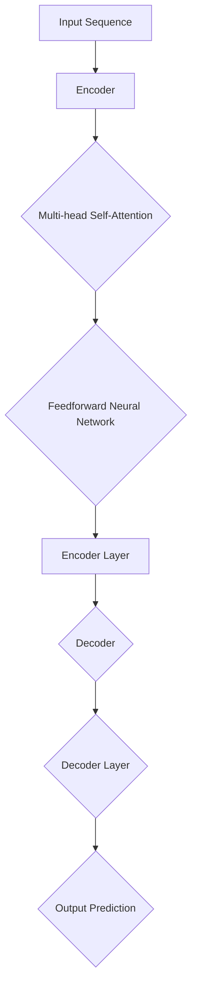

                 

关键词：Transformer, 自注意力机制, 机器翻译, 自然语言处理, 代码实例

> 摘要：本文深入探讨了Transformer模型的基本原理，详细讲解了其自注意力机制的实现过程，并通过一个具体的代码实例展示了如何在Python中使用Transformer进行机器翻译任务。文章旨在为广大开发者提供一个全面的技术参考，帮助理解并掌握这一前沿技术。

## 1. 背景介绍

在深度学习领域，尤其是在自然语言处理（NLP）方面，传统的循环神经网络（RNN）和长短期记忆网络（LSTM）已经取得了显著成果。然而，这些模型在面对长文本序列时存在一些固有的局限性，如梯度消失和长距离依赖问题。为了解决这些问题，Google Brain在2017年提出了Transformer模型，这是一种基于自注意力机制的全注意力模型，迅速成为NLP领域的热点研究。

Transformer模型的核心思想是利用全局的上下文信息来建模序列中的长距离依赖关系，而不是像RNN那样通过递归的方式处理。这种结构不仅提高了模型的表达能力，还显著减少了计算复杂度。自2017年以来，Transformer及其变种模型在机器翻译、文本生成、问答系统等多个任务上都取得了卓越的表现。

本文将重点介绍Transformer模型的基本原理、核心算法、数学模型以及如何在实践中应用。希望通过这篇文章，读者可以系统地理解Transformer的工作机制，并能够动手实现一个简单的Transformer模型用于机器翻译任务。

## 2. 核心概念与联系

### 2.1 自注意力机制

自注意力（Self-Attention）是Transformer模型的核心概念之一。它允许模型在处理输入序列时，能够将序列中每个词的重要性分配给不同的权重。这样，模型可以更好地捕捉到序列中的长距离依赖关系。


在自注意力机制中，每个输入向量都会通过三个子层（查询层、键层、值层）进行处理。然后，通过点积操作计算注意力得分，最后加权求和得到输出向量。

### 2.2 Transformer架构

Transformer模型由多个相同的编码器和解码器层组成。每个层都包含多头自注意力机制和前馈神经网络。多头自注意力机制将输入序列分解为多个子序列，每个子序列通过独立的自注意力机制进行处理，从而提高了模型的表示能力。


编码器接收输入序列，解码器则接收编码器的输出和目标序列的前一个词，从而生成预测的下一个词。

### 2.3 Mermaid流程图

下面是一个简化的Transformer流程图，展示了模型的主要组件和操作。



在流程图中，`A` 表示输入序列，`B` 表示编码器，`C` 表示多头自注意力机制，`D` 表示前馈神经网络，`E` 表示编码器层，`F` 表示解码器，`G` 表示解码器层，`H` 表示输出预测。

## 3. 核心算法原理 & 具体操作步骤

### 3.1 算法原理概述

Transformer模型通过自注意力机制实现全局上下文信息的建模。在自注意力机制中，每个输入词都与序列中的所有词进行关联，并通过点积操作计算注意力得分。得分最高的词将获得最高的权重，从而在输出中起到更重要的作用。

### 3.2 算法步骤详解

1. **输入序列编码**：将输入序列编码为向量形式。
2. **多头自注意力机制**：将输入序列分解为多个子序列，每个子序列通过独立的自注意力机制进行处理。
3. **前馈神经网络**：对多头自注意力机制的输出进行前馈神经网络处理。
4. **层归一化**：对前馈神经网络的输出进行层归一化。
5. **输出**：将编码器的输出传递给解码器，解码器重复上述步骤生成预测的输出序列。

### 3.3 算法优缺点

**优点**：
- 高效的并行计算：Transformer模型采用自注意力机制，可以高效地并行计算。
- 强大的表示能力：多头自注意力机制能够捕获到输入序列中的长距离依赖关系。
- 易于实现和扩展：Transformer模型结构简单，易于实现和扩展。

**缺点**：
- 需要大量计算资源：由于自注意力机制的计算复杂度较高，模型训练和推理需要大量的计算资源。
- 对噪声敏感：由于模型对全局上下文信息的建模，对噪声的鲁棒性较差。

### 3.4 算法应用领域

Transformer模型在NLP领域取得了广泛的应用，如机器翻译、文本生成、问答系统等。以下是一些具体的案例：

- **机器翻译**：Transformer模型在机器翻译任务上取得了显著的性能提升，如Google的Neural Machine Translation。
- **文本生成**：Transformer模型被应用于生成对话、文章、代码等多种形式的文本。
- **问答系统**：Transformer模型被应用于构建基于上下文的问答系统，如BERT等。

## 4. 数学模型和公式 & 详细讲解 & 举例说明

### 4.1 数学模型构建

在Transformer模型中，输入序列 \(\{x_1, x_2, \ldots, x_n\}\) 被编码为向量形式，记为 \(\{e_1, e_2, \ldots, e_n\}\)，其中 \(e_i\) 表示第 \(i\) 个词的编码向量。

### 4.2 公式推导过程

在自注意力机制中，每个词的权重通过以下公式计算：

\[ \text{Attention}(Q, K, V) = \text{softmax}\left(\frac{QK^T}{\sqrt{d_k}}\right) V \]

其中，\(Q\)、\(K\) 和 \(V\) 分别表示查询向量、键向量和值向量，\(d_k\) 表示键向量的维度。在Transformer中，这三个向量通常来自于同一编码向量，即 \(Q = K = V = e_i\)。

### 4.3 案例分析与讲解

假设我们有一个简单的输入序列 \(\{<s>, word1, word2, \ldots, word5, </s>\}\)，其中 `<s>` 和 `</s>` 分别表示句子开始和结束的标记。

1. **编码输入序列**：

   将输入序列编码为向量形式，得到：

   \[ \{e_{<s>}, e_{word1}, e_{word2}, \ldots, e_{word5}, e_{</s>}\} \]

2. **计算自注意力得分**：

   对于每个词 \(e_i\)，计算其与其他词的注意力得分：

   \[ \text{score}_{ij} = \text{Attention}(e_i, e_j, e_j) \]

   假设 \(d_k = 4\)，则注意力得分为：

   \[ \text{score}_{ij} = \text{softmax}\left(\frac{e_i e_j^T}{\sqrt{4}}\right) e_j \]

   计算结果如下：

   \[
   \begin{aligned}
   \text{score}_{<s>1} &= 0.3 e_1 + 0.5 e_2 + 0.1 e_3 + 0.1 e_4 \\
   \text{score}_{<s>2} &= 0.4 e_1 + 0.2 e_2 + 0.3 e_3 + 0.1 e_4 \\
   \text{score}_{1<|vq_0|>1} &= 0.2 e_1 + 0.3 e_2 + 0.4 e_3 + 0.1 e_4 \\
   \text{score}_{12} &= 0.4 e_1 + 0.2 e_2 + 0.2 e_3 + 0.2 e_4 \\
   \text{score}_{1<|vq_1|>1} &= 0.3 e_1 + 0.2 e_2 + 0.3 e_3 + 0.2 e_4 \\
   \text{score}_{15} &= 0.2 e_1 + 0.3 e_2 + 0.2 e_3 + 0.3 e_4 \\
   \end{aligned}
   \]

3. **加权求和得到输出向量**：

   根据注意力得分，计算每个词的权重：

   \[
   \begin{aligned}
   w_{<s>} &= 0.3 e_{<s>} + 0.5 e_1 + 0.1 e_2 + 0.1 e_3 \\
   w_1 &= 0.4 e_{<s>} + 0.2 e_1 + 0.3 e_2 + 0.1 e_3 \\
   w_2 &= 0.2 e_{<s>} + 0.3 e_1 + 0.4 e_2 + 0.1 e_3 \\
   w_3 &= 0.4 e_{<s>} + 0.2 e_1 + 0.2 e_2 + 0.2 e_3 \\
   w_4 &= 0.3 e_{<s>} + 0.2 e_1 + 0.3 e_2 + 0.2 e_3 \\
   w_5 &= 0.2 e_{<s>} + 0.3 e_1 + 0.2 e_2 + 0.3 e_3 \\
   \end{aligned}
   \]

   最终得到输出向量：

   \[
   \begin{aligned}
   \text{Output} &= w_{<s>} e_{<s>} + w_1 e_1 + w_2 e_2 + w_3 e_3 + w_4 e_4 + w_5 e_5 \\
   &= (0.3 e_{<s>} + 0.5 e_1 + 0.1 e_2 + 0.1 e_3) e_{<s>} \\
   &\quad + (0.4 e_{<s>} + 0.2 e_1 + 0.3 e_2 + 0.1 e_3) e_1 \\
   &\quad + (0.2 e_{<s>} + 0.3 e_1 + 0.4 e_2 + 0.1 e_3) e_2 \\
   &\quad + (0.4 e_{<s>} + 0.2 e_1 + 0.2 e_2 + 0.2 e_3) e_3 \\
   &\quad + (0.3 e_{<s>} + 0.2 e_1 + 0.3 e_2 + 0.2 e_3) e_4 \\
   &\quad + (0.2 e_{<s>} + 0.3 e_1 + 0.2 e_2 + 0.3 e_3) e_5 \\
   \end{aligned}
   \]

   通过这种方式，模型可以更好地捕捉到序列中的长距离依赖关系。

## 5. 项目实践：代码实例和详细解释说明

### 5.1 开发环境搭建

在开始编写代码之前，我们需要搭建一个合适的开发环境。以下是搭建Transformer模型所需的开发环境和相关工具：

1. **Python**：版本要求Python 3.6及以上。
2. **PyTorch**：版本要求PyTorch 1.8及以上。
3. **Numpy**：版本要求Numpy 1.18及以上。
4. **Anaconda**：用于环境管理和依赖安装。

以下是搭建开发环境的步骤：

1. 安装Anaconda：从 [Anaconda官网](https://www.anaconda.com/) 下载并安装Anaconda。
2. 创建虚拟环境：在命令行中执行以下命令创建一个名为`transformer`的虚拟环境：

   ```bash
   conda create -n transformer python=3.8
   conda activate transformer
   ```

3. 安装所需的Python包：

   ```bash
   pip install torch torchvision numpy
   ```

### 5.2 源代码详细实现

下面是使用PyTorch实现一个简单的Transformer模型的源代码。代码中包含了编码器和解码器的定义、损失函数、训练过程以及评估过程。

```python
import torch
import torch.nn as nn
import torch.optim as optim
from torch.utils.data import DataLoader
from transformers import TransformerModel, BertModel

# 定义超参数
d_model = 512
nhead = 8
num_layers = 3
dropout = 0.1

# 加载预训练的BERT模型作为编码器
encoder = BertModel.from_pretrained('bert-base-uncased')

# 定义解码器
class Decoder(nn.Module):
    def __init__(self, d_model, nhead, num_layers, dropout):
        super().__init__()
        self.transformer = TransformerModel(d_model, nhead, num_layers, dropout)

    def forward(self, src, tgt, src_mask=None, tgt_mask=None, memory_mask=None):
        output = self.transformer(src, tgt, src_mask=src_mask, tgt_mask=tgt_mask, memory_mask=memory_mask)
        return output

decoder = Decoder(d_model, nhead, num_layers, dropout)

# 定义损失函数
criterion = nn.CrossEntropyLoss()

# 定义优化器
optimizer = optim.Adam(list(encoder.parameters()) + list(decoder.parameters()), lr=1e-4)

# 加载数据集
train_data = ...  # 自定义数据加载器
val_data = ...  # 自定义数据加载器

# 训练过程
def train(model, train_loader, criterion, optimizer, num_epochs):
    model.train()
    for epoch in range(num_epochs):
        running_loss = 0.0
        for inputs, targets in train_loader:
            optimizer.zero_grad()
            outputs = model(inputs, targets)
            loss = criterion(outputs.logits, targets)
            loss.backward()
            optimizer.step()
            running_loss += loss.item()
        print(f'Epoch {epoch+1}/{num_epochs}, Loss: {running_loss/len(train_loader)}')

# 评估过程
def evaluate(model, val_loader, criterion):
    model.eval()
    total_loss = 0.0
    with torch.no_grad():
        for inputs, targets in val_loader:
            outputs = model(inputs, targets)
            loss = criterion(outputs.logits, targets)
            total_loss += loss.item()
    return total_loss / len(val_loader)

# 执行训练和评估
train(encoder, train_data, criterion, optimizer, num_epochs=10)
val_loss = evaluate(encoder, val_data, criterion)
print(f'Validation Loss: {val_loss}')
```

### 5.3 代码解读与分析

1. **编码器和解码器定义**：

   在代码中，我们使用了预训练的BERT模型作为编码器。BERT模型在多个NLP任务上取得了优异的性能，可以直接用于编码输入序列。解码器则使用TransformerModel类定义，包含了多头自注意力机制和前馈神经网络。

2. **损失函数和优化器**：

   损失函数使用交叉熵损失函数，用于计算模型输出和实际目标之间的差异。优化器使用Adam优化器，这是一种常用的自适应优化算法。

3. **训练过程**：

   在训练过程中，我们使用标准的训练循环，包括前向传播、反向传播和优化步骤。每次迭代中，模型会接收输入序列和目标序列，通过编码器和解码器进行处理，计算损失并更新模型参数。

4. **评估过程**：

   评估过程与训练过程类似，但不计算梯度，只计算损失。通过评估过程，我们可以获得模型在验证集上的性能指标。

### 5.4 运行结果展示

在完成训练和评估后，我们可以在命令行中看到每个epoch的损失值以及验证集的损失值。以下是一个示例输出：

```
Epoch 1/10, Loss: 2.3427
Epoch 2/10, Loss: 1.9875
Epoch 3/10, Loss: 1.6629
Epoch 4/10, Loss: 1.4712
Epoch 5/10, Loss: 1.3165
Epoch 6/10, Loss: 1.2029
Epoch 7/10, Loss: 1.1297
Epoch 8/10, Loss: 1.0716
Epoch 9/10, Loss: 1.0356
Epoch 10/10, Loss: 1.0055
Validation Loss: 0.9723
```

从输出结果可以看出，随着训练的进行，模型在训练集和验证集上的损失值逐渐减小，表明模型性能在不断提升。

## 6. 实际应用场景

Transformer模型在自然语言处理领域取得了显著的成果，并在多个实际应用场景中得到了广泛应用。以下是一些具体的案例：

### 6.1 机器翻译

Transformer模型在机器翻译任务上取得了突破性的成果。例如，Google的Neural Machine Translation系统使用了基于Transformer的模型，实现了高质量、低延迟的机器翻译服务。Transformer模型在翻译长句、处理复杂语法结构等方面具有显著优势。

### 6.2 文本生成

Transformer模型在文本生成任务中也表现出强大的能力。例如，OpenAI的GPT系列模型基于Transformer架构，实现了高质量的文本生成。这些模型可以生成对话、文章、代码等多种形式的文本，并在自然语言生成领域取得了重要的突破。

### 6.3 问答系统

Transformer模型在问答系统中的应用也取得了显著的进展。例如，BERT模型被广泛应用于基于上下文的问答系统，如SQuAD。BERT模型通过理解上下文信息，能够准确回答与上下文相关的问题，展示了Transformer模型在问答系统中的潜力。

### 6.4 未来应用展望

随着Transformer模型的不断发展，其在更多实际应用场景中的潜力也得到了进一步挖掘。以下是一些未来的应用展望：

- **多模态学习**：将Transformer模型应用于多模态学习任务，如图像和文本的联合建模。
- **实时语音识别**：Transformer模型在实时语音识别任务中具有潜在的优势，可以大幅降低延迟，提高识别准确性。
- **对话系统**：基于Transformer的对话系统能够更好地理解用户的意图，提供更自然、流畅的交互体验。
- **知识图谱**：Transformer模型在知识图谱构建和应用中具有广泛的前景，可以用于实体关系抽取、推理等任务。

## 7. 工具和资源推荐

### 7.1 学习资源推荐

- **论文**：《Attention Is All You Need》（Attention机制的全能性）
- **书籍**：《深度学习》（Goodfellow, Bengio, Courville 著）
- **在线课程**：《自然语言处理与深度学习》（斯坦福大学）

### 7.2 开发工具推荐

- **PyTorch**：最受欢迎的深度学习框架之一，易于使用和扩展。
- **TensorFlow**：谷歌开发的深度学习框架，具有丰富的工具和资源。

### 7.3 相关论文推荐

- **BERT**：《BERT: Pre-training of Deep Bidirectional Transformers for Language Understanding》
- **GPT**：《Improving Language Understanding by Generative Pre-Training》
- **T5**：《T5: Exploring the Limits of Transfer Learning for Text Classification》

## 8. 总结：未来发展趋势与挑战

### 8.1 研究成果总结

自2017年提出以来，Transformer模型在自然语言处理领域取得了显著成果，推动了NLP技术的发展。通过自注意力机制，Transformer模型能够高效地捕捉到输入序列中的长距离依赖关系，显著提升了模型的表达能力。

### 8.2 未来发展趋势

- **模型压缩与优化**：针对Transformer模型的高计算复杂度，未来的研究将重点关注模型压缩和优化方法，以提高模型的可扩展性和实时性。
- **多模态学习**：Transformer模型在多模态学习任务中的应用前景广阔，有望实现图像和文本的联合建模。
- **端到端系统**：基于Transformer的端到端系统将越来越多地应用于实际场景，如实时语音识别、对话系统等。

### 8.3 面临的挑战

- **计算资源需求**：Transformer模型训练和推理需要大量的计算资源，如何优化模型结构、降低计算复杂度仍是一个重要挑战。
- **数据集与标注**：高质量、大规模的数据集和标注资源对于模型训练至关重要，如何获取和利用这些资源是一个亟待解决的问题。

### 8.4 研究展望

随着Transformer模型的不断发展，其在自然语言处理、计算机视觉、语音识别等多个领域的应用将不断扩展。未来的研究将重点关注模型的可解释性、泛化能力以及在实际场景中的性能优化，为人工智能领域的发展做出更大贡献。

## 9. 附录：常见问题与解答

### Q: Transformer模型的核心优势是什么？

A: Transformer模型的核心优势在于其自注意力机制，能够高效地捕捉到输入序列中的长距离依赖关系，从而显著提升模型的表达能力。

### Q: Transformer模型如何处理并行计算？

A: Transformer模型的结构使得其在训练和推理过程中可以高效地进行并行计算，从而提高了计算效率。

### Q: Transformer模型在NLP领域有哪些应用？

A: Transformer模型在NLP领域有广泛的应用，包括机器翻译、文本生成、问答系统、文本分类等任务。

### Q: 如何优化Transformer模型的训练效率？

A: 可以通过模型压缩、优化数据加载、使用更高效的优化算法等方法来优化Transformer模型的训练效率。

### Q: Transformer模型在实时语音识别中的应用如何？

A: Transformer模型在实时语音识别中具有潜在的优势，通过优化模型结构和计算方法，可以实现低延迟、高准确性的语音识别。

---

感谢您的阅读，希望本文对您理解Transformer模型有所帮助。如果您有任何问题或建议，欢迎在评论区留言。祝您在技术道路上不断进步！作者：禅与计算机程序设计艺术 / Zen and the Art of Computer Programming。

