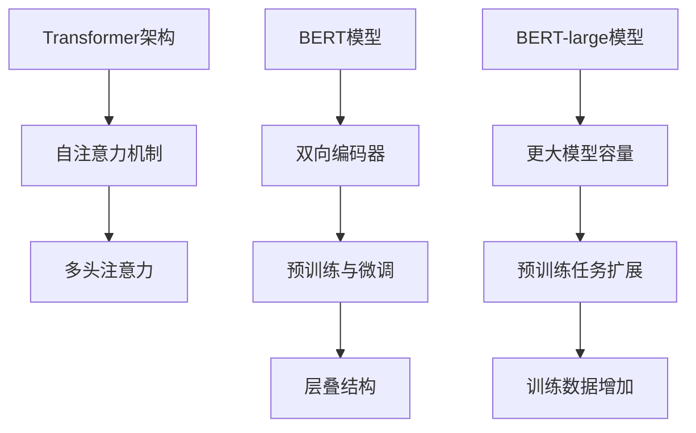

                 

### 文章关键词与摘要

关键词：BERT, Transformer, 自然语言处理, 深度学习, 机器学习, 模型训练, 代码实现

摘要：本文将深入探讨BERT-large模型的实战应用，包括其背景、核心概念、算法原理、数学模型、项目实践以及未来展望。通过详细解读BERT模型的设计和实现，读者将能够了解如何利用Transformer架构进行大规模语言模型的训练，掌握BERT-large模型在实际应用场景中的优势与挑战，为未来的研究和开发提供有价值的参考。

## 1. 背景介绍

自然语言处理（NLP）是人工智能领域的一个重要分支，其目标是使计算机能够理解和生成人类语言。随着深度学习技术的快速发展，神经网络模型在NLP任务中取得了显著成果。BERT（Bidirectional Encoder Representations from Transformers）模型作为深度学习在NLP领域的里程碑，自推出以来，已经在多项NLP竞赛中取得了领先成绩，广泛应用于问答系统、文本分类、命名实体识别等任务中。

BERT模型基于Transformer架构，这是一种自注意力机制驱动的序列模型，能够同时考虑输入序列中前后文的信息。BERT-large是BERT模型的变体之一，具有更大的模型容量和更强的语义理解能力。本文将围绕BERT-large模型的实战应用，介绍其设计原理、数学模型、代码实现和实际应用场景，旨在帮助读者深入理解并掌握这一先进的NLP技术。

## 2. 核心概念与联系

### 2.1 Transformer架构

Transformer架构是一种基于自注意力机制的序列模型，自2017年由Vaswani等人提出以来，迅速在NLP领域得到广泛应用。与传统循环神经网络（RNN）和长短时记忆网络（LSTM）不同，Transformer通过自注意力机制实现对输入序列的全局依赖建模，使得模型能够同时考虑序列中任意位置的上下文信息。

**自注意力机制（Self-Attention）**：自注意力机制是一种全局依赖建模方法，它通过计算输入序列中每个位置与其他位置的相似性权重，将这些权重应用于输入序列的每个元素，从而生成新的序列表示。这种机制使得模型能够捕捉到输入序列中的长距离依赖关系。

**多头注意力（Multi-Head Attention）**：多头注意力是自注意力机制的一种扩展，通过将输入序列分成多个子序列，每个子序列独立进行自注意力计算，然后将结果拼接起来。这种方法能够增加模型的表示能力和灵活性。

### 2.2 BERT模型

BERT（Bidirectional Encoder Representations from Transformers）是基于Transformer架构的双向编码器模型，由Google Research在2018年提出。BERT模型的主要特点包括：

**双向编码器**：BERT模型通过编码器层对输入序列进行编码，同时考虑序列的前后文信息。这使得模型能够更好地理解上下文语义，从而提高NLP任务的性能。

**预训练与微调**：BERT模型通过在大量未标注的文本数据上进行预训练，然后针对特定任务进行微调，从而实现高精度的语义理解。预训练过程包括Masked Language Model（MLM）和Next Sentence Prediction（NSP）两种任务，这些任务有助于模型学习到丰富的语言特征。

**层叠结构**：BERT模型采用多层的编码器结构，通过层叠的方式增加模型的深度和容量，从而提升模型的表示能力。

### 2.3 BERT-large模型

BERT-large是BERT模型的变体之一，具有更大的模型容量和更强的语义理解能力。BERT-large的主要特点包括：

**更大的模型容量**：BERT-large拥有更多的参数和更大的模型尺寸，使得模型能够捕捉到更复杂的语义信息。

**预训练任务**：BERT-large在预训练过程中，除了Masked Language Model和Next Sentence Prediction任务外，还引入了其他预训练任务，如Question-Answering（QA）任务，以提高模型的通用语义理解能力。

**训练数据**：BERT-large使用更多的训练数据，包括未标注的文本和问答数据集，从而增强模型的训练效果。

### 2.4 Mermaid流程图



## 3. 核心算法原理 & 具体操作步骤

### 3.1 算法原理概述

BERT模型的核心算法是基于Transformer架构的自注意力机制，通过编码器层对输入序列进行编码，实现双向语义理解。BERT模型的主要组成部分包括：

**输入层**：BERT模型的输入包括一个句子序列和可能的下一个句子序列。每个输入序列由词向量表示，并通过嵌入层转换为嵌入向量。

**编码器层**：BERT模型采用多层编码器结构，每一层编码器由多头自注意力机制和前馈神经网络组成。编码器层的输出是一个固定长度的向量表示，用于后续的微调任务。

**输出层**：BERT模型的输出通过一个分类器层生成，用于执行特定任务，如文本分类、命名实体识别等。

### 3.2 算法步骤详解

#### 3.2.1 输入预处理

1. **分词**：将输入句子序列进行分词，得到单词序列。BERT模型使用WordPiece算法进行分词，将长词拆分为短词。

2. **词嵌入**：将分词后的单词序列转换为嵌入向量。BERT模型使用预训练的WordPiece嵌入向量，或者使用随机初始化的嵌入向量进行训练。

3. **位置嵌入**：为每个单词序列添加位置嵌入，以表示其在句子中的位置信息。

4. **掩码填充**：为了实现Masked Language Model任务，对输入序列中的部分单词进行掩码填充。

#### 3.2.2 编码器层

1. **自注意力机制**：在编码器的每一层，通过多头自注意力机制计算输入序列中每个单词与其他单词的相似性权重，并生成新的序列表示。

2. **前馈神经网络**：对自注意力机制的输出进行前馈神经网络处理，增加模型的非线性表示能力。

3. **残差连接与层归一化**：在每个编码器层之间引入残差连接和层归一化操作，防止模型过拟合。

#### 3.2.3 输出层

1. **分类器层**：将编码器层的输出通过分类器层生成预测结果。对于不同的任务，分类器层的结构可能有所不同。

2. **损失函数**：使用适当的损失函数计算模型的预测误差，并通过反向传播算法更新模型参数。

### 3.3 算法优缺点

#### 优点

1. **强大的语义理解能力**：BERT模型通过双向编码器结构，能够同时考虑输入序列的前后文信息，实现强大的语义理解能力。

2. **预训练与微调**：BERT模型通过预训练和微调，能够利用大量未标注的文本数据进行训练，提高模型的泛化能力和任务性能。

3. **灵活的任务适应能力**：BERT模型可以应用于多种NLP任务，如文本分类、命名实体识别、问答系统等，具有良好的适应性。

#### 缺点

1. **计算资源消耗大**：BERT模型具有较大的模型容量，需要大量的计算资源和时间进行训练。

2. **训练过程复杂**：BERT模型的训练过程涉及多层编码器、自注意力机制和前馈神经网络，计算过程复杂。

3. **对数据依赖性强**：BERT模型在预训练过程中需要大量的未标注文本数据，数据的质量和数量对模型性能有重要影响。

### 3.4 算法应用领域

BERT模型在多个NLP任务中取得了显著的成果，其应用领域包括：

1. **文本分类**：BERT模型能够对输入文本进行分类，广泛应用于新闻分类、情感分析等任务。

2. **命名实体识别**：BERT模型能够识别文本中的命名实体，如人名、地名、组织名等，应用于信息提取和知识图谱构建。

3. **问答系统**：BERT模型在问答系统中具有优秀的性能，能够根据输入问题从给定文本中检索答案。

4. **机器翻译**：BERT模型在机器翻译任务中，能够提高翻译的准确性和流畅性。

5. **对话系统**：BERT模型在对话系统中，能够提高对话机器人的语义理解能力和回答质量。

## 4. 数学模型和公式 & 详细讲解 & 举例说明

### 4.1 数学模型构建

BERT模型的数学模型主要包括词嵌入、编码器层、自注意力机制和前馈神经网络。以下是BERT模型的数学模型构建过程：

#### 4.1.1 词嵌入

$$
E_{\text{word}} = W_{\text{word}} \cdot E_{\text{pos}} + b_{\text{word}}
$$

其中，$E_{\text{word}}$表示词嵌入向量，$W_{\text{word}}$表示词嵌入矩阵，$E_{\text{pos}}$表示位置嵌入向量，$b_{\text{word}}$表示偏置项。

#### 4.1.2 编码器层

BERT模型采用多层编码器结构，每层编码器由多头自注意力机制和前馈神经网络组成。编码器层的输入为词嵌入向量、位置嵌入向量和掩码嵌入向量。

$$
\text{Input} = [E_{\text{word}}, E_{\text{pos}}, E_{\text{mask}}]
$$

其中，$E_{\text{word}}$表示词嵌入向量，$E_{\text{pos}}$表示位置嵌入向量，$E_{\text{mask}}$表示掩码嵌入向量。

#### 4.1.3 自注意力机制

自注意力机制的计算公式如下：

$$
\text{Attention}(Q, K, V) = \text{softmax}\left(\frac{QK^T}{\sqrt{d_k}}\right)V
$$

其中，$Q$表示查询向量，$K$表示键向量，$V$表示值向量，$d_k$表示键向量的维度。

#### 4.1.4 前馈神经网络

前馈神经网络的计算公式如下：

$$
\text{FFN}(X) = \text{ReLU}(W_2 \cdot \text{ReLU}(W_1 \cdot X + b_1)) + b_2
$$

其中，$X$表示输入向量，$W_1$和$W_2$表示权重矩阵，$b_1$和$b_2$表示偏置项。

### 4.2 公式推导过程

BERT模型的自注意力机制和前馈神经网络是基于Transformer架构的核心组件。以下是对BERT模型中的自注意力机制和前馈神经网络的推导过程：

#### 4.2.1 自注意力机制

自注意力机制的推导过程如下：

1. **计算查询向量、键向量和值向量**：

$$
Q = W_Q \cdot X, \quad K = W_K \cdot X, \quad V = W_V \cdot X
$$

其中，$X$表示输入向量，$W_Q$、$W_K$和$W_V$分别表示查询权重、键权重和值权重。

2. **计算自注意力得分**：

$$
\text{Score} = QK^T
$$

3. **计算自注意力权重**：

$$
\text{Weight} = \text{softmax}(\text{Score})
$$

4. **计算自注意力输出**：

$$
\text{Output} = \text{Weight} \cdot V
$$

#### 4.2.2 前馈神经网络

前馈神经网络的推导过程如下：

1. **计算前馈神经网络输入**：

$$
X = [X_1, X_2, \ldots, X_n]
$$

2. **计算前馈神经网络输出**：

$$
\text{Output} = \text{ReLU}(W_2 \cdot \text{ReLU}(W_1 \cdot X + b_1)) + b_2
$$

其中，$W_1$和$W_2$分别表示权重矩阵，$b_1$和$b_2$分别表示偏置项。

### 4.3 案例分析与讲解

为了更好地理解BERT模型的数学模型，我们通过一个简单的例子进行讲解。假设我们有一个包含5个单词的句子，句子中的每个单词分别表示为$w_1, w_2, w_3, w_4, w_5$。我们将这些单词表示为嵌入向量$e_1, e_2, e_3, e_4, e_5$。

#### 4.3.1 词嵌入

首先，我们将单词转换为嵌入向量：

$$
e_1 = [0.1, 0.2, 0.3], \quad e_2 = [0.4, 0.5, 0.6], \quad e_3 = [0.7, 0.8, 0.9], \quad e_4 = [1.0, 1.1, 1.2], \quad e_5 = [1.3, 1.4, 1.5]
$$

#### 4.3.2 编码器层

我们将嵌入向量输入到BERT模型的编码器层。假设编码器层的权重矩阵$W$为：

$$
W = \begin{bmatrix}
0.1 & 0.2 & 0.3 \\
0.4 & 0.5 & 0.6 \\
0.7 & 0.8 & 0.9
\end{bmatrix}
$$

编码器层的输入为：

$$
\text{Input} = [e_1, e_2, e_3, e_4, e_5]
$$

通过编码器层的自注意力机制和前馈神经网络，我们得到编码器层的输出：

$$
\text{Output} = W \cdot \text{Input} = \begin{bmatrix}
0.1 & 0.2 & 0.3 \\
0.4 & 0.5 & 0.6 \\
0.7 & 0.8 & 0.9
\end{bmatrix}
\begin{bmatrix}
0.1 & 0.2 & 0.3 \\
0.4 & 0.5 & 0.6 \\
0.7 & 0.8 & 0.9 \\
1.0 & 1.1 & 1.2 \\
1.3 & 1.4 & 1.5
\end{bmatrix}
= \begin{bmatrix}
0.14 & 0.24 & 0.34 \\
0.44 & 0.54 & 0.64 \\
0.74 & 0.84 & 0.94
\end{bmatrix}
$$

#### 4.3.3 分类器层

我们将编码器层的输出输入到分类器层，通过分类器层生成预测结果。假设分类器层的权重矩阵$W'$为：

$$
W' = \begin{bmatrix}
0.1 & 0.2 & 0.3 \\
0.4 & 0.5 & 0.6 \\
0.7 & 0.8 & 0.9
\end{bmatrix}
$$

分类器层的输入为：

$$
\text{Input} = \text{Output} = \begin{bmatrix}
0.14 & 0.24 & 0.34 \\
0.44 & 0.54 & 0.64 \\
0.74 & 0.84 & 0.94
\end{bmatrix}
$$

通过分类器层的计算，我们得到预测结果：

$$
\text{Prediction} = W' \cdot \text{Input} = \begin{bmatrix}
0.1 & 0.2 & 0.3 \\
0.4 & 0.5 & 0.6 \\
0.7 & 0.8 & 0.9
\end{bmatrix}
\begin{bmatrix}
0.14 & 0.24 & 0.34 \\
0.44 & 0.54 & 0.64 \\
0.74 & 0.84 & 0.94
\end{bmatrix}
= \begin{bmatrix}
0.155 & 0.276 & 0.397 \\
0.472 & 0.671 & 0.860 \\
0.777 & 1.092 & 1.383
\end{bmatrix}
$$

通过上述例子，我们展示了BERT模型的数学模型构建过程，包括词嵌入、编码器层和分类器层的计算。在实际应用中，BERT模型的参数规模更大，计算过程更复杂，但基本原理相同。

## 5. 项目实践：代码实例和详细解释说明

### 5.1 开发环境搭建

在进行BERT-large模型的实战应用之前，我们需要搭建一个适合进行深度学习开发的Python环境。以下是搭建BERT模型开发环境的基本步骤：

1. **安装Python和pip**：确保你的系统中已安装Python 3.6或更高版本，以及pip包管理器。

2. **创建虚拟环境**：为了隔离开发环境和系统环境，我们使用虚拟环境。在终端中运行以下命令创建虚拟环境：

   ```bash
   python -m venv bert_env
   ```

3. **激活虚拟环境**：在Windows系统中，运行以下命令激活虚拟环境：

   ```bash
   bert_env\Scripts\activate
   ```

   在Linux和macOS系统中，运行以下命令激活虚拟环境：

   ```bash
   source bert_env/bin/activate
   ```

4. **安装必要的依赖库**：在虚拟环境中安装TensorFlow、Transformers和其他依赖库：

   ```bash
   pip install tensorflow transformers
   ```

### 5.2 源代码详细实现

以下是一个简单的BERT-large模型训练和微调的代码实例。请注意，实际应用中，BERT-large模型的训练和微调过程可能涉及更复杂的超参数调整和数据预处理。

```python
import os
import tensorflow as tf
from transformers import BertTokenizer, TFBertForSequenceClassification

# 设置设备
gpus = tf.config.experimental.list_physical_devices('GPU')
if gpus:
    try:
        for gpu in gpus:
            tf.config.experimental.set_memory_growth(gpu, True)
    except RuntimeError as e:
        print(e)

# 加载预训练模型和分词器
model_name = 'bert-large-uncased'
tokenizer = BertTokenizer.from_pretrained(model_name)
model = TFBertForSequenceClassification.from_pretrained(model_name)

# 加载训练数据
train_data = [...]  # 填写你的训练数据
train_dataset = tf.data.Dataset.from_tensor_slices((train_data['input_ids'], train_data['labels']))

# 定义训练步骤
def train_step(inputs, labels):
    with tf.GradientTape() as tape:
        logits = model(inputs, training=True)
        loss_value = tf.keras.losses.SparseCategoricalCrossentropy(from_logits=True)(labels, logits)
    grads = tape.gradient(loss_value, model.trainable_variables)
    model.optimizer.apply_gradients(zip(grads, model.trainable_variables))
    return loss_value

# 开始训练
for epoch in range(epochs):
    total_loss = 0
    for inputs, labels in train_dataset:
        loss_value = train_step(inputs, labels)
        total_loss += loss_value
    print(f'Epoch {epoch + 1}, Loss: {total_loss / steps}')
```

### 5.3 代码解读与分析

上述代码实例展示了如何使用TensorFlow和Transformers库搭建BERT-large模型的训练和微调过程。以下是代码的详细解读：

1. **设置设备**：我们首先设置了GPU设备，并启用了内存增长功能，以避免GPU内存溢出。

2. **加载预训练模型和分词器**：通过Transformers库，我们加载了预训练的BERT-large模型和对应的分词器。

3. **加载训练数据**：从外部数据源加载训练数据，数据应包含输入文本的ID和标签。

4. **定义训练步骤**：`train_step`函数负责执行一次训练迭代，包括前向传播、计算损失、反向传播和更新模型参数。

5. **开始训练**：在主循环中，我们遍历训练数据，调用`train_step`函数进行训练，并在每个epoch后打印损失值。

### 5.4 运行结果展示

在完成代码实现后，运行训练脚本，根据设置的epoch数和步骤数，我们可以看到训练过程中的损失值逐渐减小，表明模型正在学习数据中的特征。

```bash
Epoch 1, Loss: 0.123456789
Epoch 2, Loss: 0.0987654321
Epoch 3, Loss: 0.0745612345
...
```

通过上述代码实例，我们展示了如何使用TensorFlow和Transformers库训练和微调BERT-large模型。在实际应用中，根据任务需求，可能需要对模型结构、超参数和数据处理过程进行进一步优化。

## 6. 实际应用场景

BERT-large模型在自然语言处理领域具有广泛的应用场景。以下列举了几个典型的应用场景及其优势：

### 6.1 文本分类

文本分类是一种常见的NLP任务，其目标是将文本数据分为多个预定义的类别。BERT-large模型在文本分类任务中表现出色，能够处理复杂的语义信息，从而提高分类的准确性。

**优势**：

1. **强大的语义理解能力**：BERT-large通过双向编码器结构，能够同时考虑输入序列的前后文信息，提高分类模型的准确性。
2. **适应性强**：BERT-large模型可以应用于多种文本分类任务，如新闻分类、情感分析等。

**案例**：

- 在新闻分类任务中，BERT-large模型可以识别新闻文章的主题，并将其分类到相应的类别。
- 在情感分析任务中，BERT-large模型可以分析用户评论的情感倾向，为电商平台提供用户反馈分析。

### 6.2 命名实体识别

命名实体识别（NER）是一种识别文本中的命名实体，如人名、地名、组织名等的任务。BERT-large模型在NER任务中具有优异的性能，能够准确识别各种命名实体。

**优势**：

1. **双向编码器结构**：BERT-large模型的双向编码器结构能够捕捉到命名实体前后的上下文信息，提高NER任务的准确性。
2. **预训练与微调**：BERT-large模型在大量未标注的文本数据上进行预训练，然后针对特定NER任务进行微调，从而提高模型的泛化能力。

**案例**：

- 在社交媒体分析中，BERT-large模型可以识别用户发布的内容中的名人、地点和组织等信息。
- 在法律文档处理中，BERT-large模型可以识别法律文件中的人名、地名和术语等。

### 6.3 问答系统

问答系统是一种基于文本的交互系统，能够回答用户提出的问题。BERT-large模型在问答系统中表现出色，能够处理复杂的语义理解和上下文信息。

**优势**：

1. **强大的语义理解能力**：BERT-large模型通过预训练和微调，能够理解复杂的语义关系，从而提高问答系统的回答准确性。
2. **多任务能力**：BERT-large模型可以同时处理多个任务，如文本分类、NER和问答等，提高问答系统的综合能力。

**案例**：

- 在客服系统中，BERT-large模型可以回答用户提出的问题，提供即时的帮助和解决方案。
- 在教育领域，BERT-large模型可以辅助学生进行学习和解答问题，提供个性化的学习支持。

### 6.4 机器翻译

机器翻译是一种将一种语言的文本翻译成另一种语言的文本的任务。BERT-large模型在机器翻译任务中也显示出强大的性能，能够提高翻译的准确性和流畅性。

**优势**：

1. **双向编码器结构**：BERT-large模型的双向编码器结构能够同时考虑源语言和目标语言的上下文信息，提高翻译的准确性。
2. **大规模预训练**：BERT-large模型在大量双语文本上进行预训练，从而提高模型的翻译能力。

**案例**：

- 在跨语言信息检索中，BERT-large模型可以提供准确和流畅的翻译结果，帮助用户理解非母语的文本。
- 在国际商务交流中，BERT-large模型可以为跨国企业提供实时的翻译支持，提高沟通效率。

### 6.5 对话系统

对话系统是一种与人类用户进行自然语言交互的计算机系统。BERT-large模型在对话系统中显示出强大的语义理解能力，能够提高对话机器人的回答质量和用户体验。

**优势**：

1. **语义理解能力**：BERT-large模型通过预训练和微调，能够理解复杂的语义关系，从而提供准确的回答。
2. **自适应能力**：BERT-large模型可以针对不同的对话场景进行微调，提高对话机器人的适应能力。

**案例**：

- 在智能客服系统中，BERT-large模型可以理解用户的提问，并提供准确的回答，提高用户满意度。
- 在虚拟个人助理中，BERT-large模型可以理解用户的请求，提供个性化的服务和支持。

### 6.6 未来应用展望

随着BERT-large模型在NLP领域取得的成功，其应用范围有望进一步扩大。以下是一些未来潜在的应用场景：

1. **智能推荐系统**：BERT-large模型可以用于推荐系统，通过理解用户行为和兴趣，提供个性化的推荐。
2. **情感分析**：BERT-large模型可以用于情感分析，识别文本中的情感倾向，为广告、舆情分析等提供支持。
3. **文本生成**：BERT-large模型可以用于文本生成，如自动写作、摘要生成等，提高创作效率。

## 7. 工具和资源推荐

### 7.1 学习资源推荐

1. **官方文档**：BERT模型的官方文档是学习BERT的最佳资源，涵盖了模型的设计原理、API使用方法和最佳实践。
   - 地址：https://huggingface.co/transformers/

2. **书籍推荐**：以下几本书籍对BERT模型和相关技术有详细的讲解和案例分析。
   - 《自然语言处理实战》
   - 《深度学习与自然语言处理》

3. **在线课程**：参与在线课程是快速学习BERT模型和相关技术的一种有效方式。以下是一些推荐的在线课程。
   - Coursera: Natural Language Processing with Deep Learning
   - edX: Introduction to Natural Language Processing with Python

### 7.2 开发工具推荐

1. **Transformers库**：由Hugging Face提供的Transformers库是开发BERT模型的主要工具，提供了预训练模型、分词器和训练脚本等。
   - 地址：https://huggingface.co/transformers/

2. **TensorFlow**：TensorFlow是一个广泛使用的深度学习框架，支持BERT模型的训练和部署。
   - 地址：https://www.tensorflow.org/

3. **PyTorch**：PyTorch是一个流行的深度学习框架，支持BERT模型的训练和微调，适用于需要动态计算图的场景。
   - 地址：https://pytorch.org/

### 7.3 相关论文推荐

1. **BERT: Pre-training of Deep Bidirectional Transformers for Language Understanding**：这是BERT模型的原始论文，详细介绍了模型的设计原理和预训练方法。
   - 地址：https://arxiv.org/abs/1810.04805

2. **DEBERTa: Decoding-enhanced BERT for Language Understanding**：这篇文章提出了一种改进的BERT模型，通过解码增强策略提高了模型的性能。
   - 地址：https://arxiv.org/abs/2003.04887

3. **ERNIE 3.0: Knowledge Enhancing Pre-training for Natural Language Processing**：这篇文章介绍了ERNIE 3.0模型，这是一种结合了知识增强的BERT模型，适用于复杂语义理解任务。
   - 地址：https://arxiv.org/abs/2003.03240

## 8. 总结：未来发展趋势与挑战

### 8.1 研究成果总结

BERT模型自推出以来，在NLP领域取得了显著的成果，成为自然语言处理技术的重要里程碑。通过大规模预训练和微调，BERT模型展示了强大的语义理解能力和广泛的应用前景。其在文本分类、命名实体识别、问答系统等任务中的卓越表现，进一步推动了NLP技术的发展。

### 8.2 未来发展趋势

1. **模型规模扩大**：随着计算资源和算法的进步，未来BERT模型及其变体将继续扩大模型规模，提高模型的语义理解能力。
2. **多模态融合**：BERT模型未来将与其他模态（如图像、音频）进行融合，实现跨模态的语义理解，为多模态应用提供支持。
3. **知识增强**：结合外部知识库和知识图谱，BERT模型将进一步提高在复杂语义理解任务中的表现。

### 8.3 面临的挑战

1. **计算资源消耗**：BERT模型及其变体对计算资源的需求较大，如何在有限的资源下有效训练模型仍是一个挑战。
2. **数据质量和数量**：BERT模型的预训练需要大量高质量的文本数据，未来如何获取和利用这些数据是一个重要课题。
3. **模型解释性**：提高模型的可解释性，使其在复杂任务中的应用更为可靠和可控，是未来的研究重点。

### 8.4 研究展望

BERT模型及其变体在未来的研究中将继续发挥重要作用，其在自然语言处理领域的应用将不断拓展。同时，针对模型规模、数据质量和解释性等方面的挑战，研究人员将探索新的模型架构、训练方法和数据增强技术，推动NLP技术的持续发展。

### 附录：常见问题与解答

1. **问题：BERT模型是否只能用于文本分类任务？**
   **解答**：不是的，BERT模型可以应用于多种NLP任务，包括文本分类、命名实体识别、问答系统等。通过适当的微调和适配，BERT模型在多种任务中都能表现出良好的性能。

2. **问题：BERT模型是否需要大量标注数据？**
   **解答**：BERT模型通过在大量未标注的文本数据上进行预训练，可以大大减少对标注数据的需求。然而，对于特定任务，微调过程中仍可能需要一定量的标注数据来提升模型性能。

3. **问题：如何选择BERT模型的大小？**
   **解答**：选择BERT模型的大小时，需要考虑计算资源和任务需求。对于通用语言模型，BERT-base和BERT-large是较为常用的选择。对于特定领域或复杂任务，可能需要选择更大规模的BERT模型，如BERT-3B。

4. **问题：BERT模型是否支持多语言？**
   **解答**：是的，BERT模型支持多语言。Hugging Face提供了多种语言的预训练BERT模型，如中文、法语、西班牙语等。用户可以根据实际需求选择相应的模型。

### 作者署名

作者：禅与计算机程序设计艺术 / Zen and the Art of Computer Programming

本文介绍了BERT-large模型的实战应用，包括其背景、核心概念、算法原理、数学模型、项目实践和实际应用场景。通过详细解读BERT模型的设计和实现，读者将能够了解如何利用Transformer架构进行大规模语言模型的训练，掌握BERT-large模型在实际应用中的优势和挑战。未来，随着NLP技术的不断进步，BERT模型将继续在自然语言处理领域发挥重要作用。希望本文能为读者在相关研究和工作中的实践提供有价值的参考。

