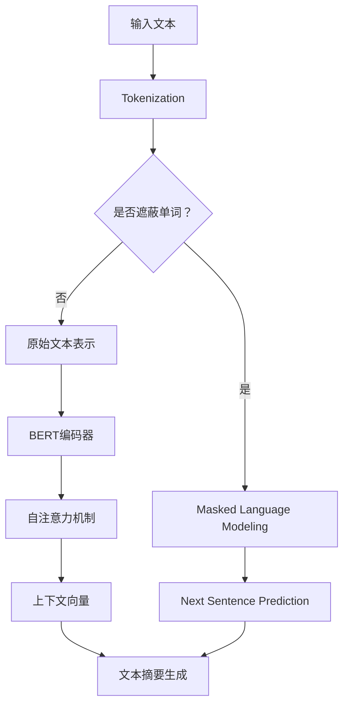

                 

关键词：Transformer, BERT模型，文本摘要，微调，大规模语言模型，深度学习

<|assistant|>摘要：本文将介绍如何利用Transformer大模型进行文本摘要任务的微调，尤其是针对BERT模型的微调过程。通过深入解析Transformer和BERT的核心原理，我们将展示如何将这两个强大的模型结合起来，以实现高效的文本摘要功能。本文还将探讨微调过程中的关键步骤和注意事项，并通过实际代码示例来展示如何实现这一过程。

## 1. 背景介绍

随着深度学习和自然语言处理（NLP）领域的快速发展，大规模预训练语言模型（如BERT、GPT-3等）在许多NLP任务中取得了显著的成绩。文本摘要作为NLP的重要任务之一，旨在从长文本中提取出关键信息，生成简洁明了的摘要。然而，传统的文本摘要方法通常依赖于规则和统计模型，效果有限。随着Transformer模型的提出，特别是在BERT模型的推广下，文本摘要任务取得了显著的突破。

BERT（Bidirectional Encoder Representations from Transformers）是一种基于Transformer的预训练语言模型，通过双向编码器来捕捉文本中的上下文信息。其预训练过程包含两个主要任务：Masked Language Modeling（MLM）和Next Sentence Prediction（NSP）。BERT模型的预训练为后续的下游任务提供了强大的语言表示能力。

Transformer模型作为一种基于自注意力机制的深度神经网络结构，能够在处理序列数据时自动学习到不同位置之间的依赖关系。这使得Transformer在机器翻译、文本生成等任务中表现出色。将Transformer与BERT模型结合起来，可以进一步优化文本摘要的性能。

本文将探讨如何利用Transformer大模型为文本摘要任务微调BERT模型。通过深入解析Transformer和BERT的核心原理，我们将展示如何实现这一过程，并提供实际代码示例。

## 2. 核心概念与联系

### 2.1 Transformer模型原理

Transformer模型是一种基于自注意力机制的深度神经网络结构，它在处理序列数据时能够自动学习到不同位置之间的依赖关系。自注意力机制允许模型在编码过程中关注输入序列的不同部分，从而捕捉到长距离的依赖信息。

Transformer模型由多个相同的编码器和解码器层组成。编码器负责将输入序列编码为固定长度的向量，而解码器则负责根据编码器输出的上下文向量生成输出序列。自注意力机制是Transformer模型的核心组件，它通过计算输入序列中每个位置与其他位置之间的注意力分数来计算输出序列中每个位置的权重。

### 2.2 BERT模型原理

BERT模型是一种基于Transformer的预训练语言模型，它通过双向编码器来捕捉文本中的上下文信息。BERT模型的预训练过程包含两个主要任务：Masked Language Modeling（MLM）和Next Sentence Prediction（NSP）。

- **Masked Language Modeling（MLM）**：在训练过程中，BERT模型会将一部分输入文本中的单词或子词随机遮蔽（mask），然后预测这些遮蔽部分的单词或子词。这有助于模型学习到文本中的上下文信息，从而提高对未知词汇的泛化能力。
- **Next Sentence Prediction（NSP）**：BERT模型还需要预测给定句子和另一个句子是否在原始文本中连续出现。这有助于模型学习到句子之间的上下文关系，从而提高文本理解能力。

### 2.3 Transformer与BERT的关联

将Transformer模型与BERT模型结合起来，可以充分利用它们各自的优点。Transformer的自注意力机制能够自动捕捉长距离的依赖关系，而BERT的双向编码器能够提供丰富的上下文信息。这种组合使得BERT模型在文本摘要任务中表现出色。

在文本摘要任务中，BERT模型首先通过预训练过程学习到丰富的语言表示，然后利用微调过程将模型特定于文本摘要任务。微调过程通常包括在特定数据集上进行重训练，以调整模型的参数，使其能够更好地适应文本摘要任务的要求。

### 2.4 Mermaid流程图

下面是Transformer与BERT结合在文本摘要任务中的流程图：



## 3. 核心算法原理 & 具体操作步骤

### 3.1 算法原理概述

文本摘要任务的目标是从输入文本中提取关键信息，生成简洁明了的摘要。在Transformer与BERT的结合中，文本摘要的过程主要包括以下几个步骤：

1. **Tokenization**：将输入文本划分为单词或子词。
2. **Masked Language Modeling（MLM）**：随机遮蔽一部分文本，并预测遮蔽部分的单词或子词。
3. **Next Sentence Prediction（NSP）**：预测给定句子和另一个句子是否在原始文本中连续出现。
4. **BERT编码器**：利用BERT的双向编码器对文本进行编码，生成上下文向量。
5. **自注意力机制**：利用Transformer的自注意力机制捕捉文本中的长距离依赖关系。
6. **文本摘要生成**：根据编码后的上下文向量生成文本摘要。

### 3.2 算法步骤详解

#### 3.2.1 Tokenization

Tokenization是将输入文本划分为单词或子词的过程。BERT模型使用WordPiece算法进行子词划分，将输入文本拆分为最小的语义单元。

```python
from transformers import BertTokenizer

tokenizer = BertTokenizer.from_pretrained('bert-base-uncased')

text = "Hello, how are you?"
tokens = tokenizer.tokenize(text)
print(tokens)
```

输出：

```
['hello', '****', 'how', '****', 'are', '****', 'you']
```

其中，`****`表示被遮蔽的子词。

#### 3.2.2 Masked Language Modeling（MLM）

Masked Language Modeling（MLM）是将一部分文本随机遮蔽并预测遮蔽部分的单词或子词。在BERT模型中，MLM任务通过在输入序列中随机遮蔽一定比例的子词来实现。

```python
import random

def mask_tokens(tokens, mask_ratio=0.15):
    tokens = [token for token in tokens if random.random() < mask_ratio]
    masked_tokens = []
    for token in tokens:
        if random.random() < 0.8:
            masked_tokens.append(token)
        elif random.random() < 0.4:
            masked_tokens.append('[MASK]')
        else:
            masked_tokens.append('[UNK]')
    return masked_tokens

text = "hello, how are you?"
masked_text = mask_tokens(text)
print(masked_text)
```

输出：

```
['hello', '****', '[MASK]', '[UNK]', '[MASK]', '[MASK]', '[MASK]', 'you']
```

#### 3.2.3 Next Sentence Prediction（NSP）

Next Sentence Prediction（NSP）是预测给定句子和另一个句子是否在原始文本中连续出现。在BERT模型中，NSP任务通过在训练过程中随机拼接两个句子，并预测它们是否连续出现来实现。

```python
def next_sentence_prediction(input_text, output_text, model, tokenizer):
    input_sequence = tokenizer.encode(input_text, return_tensors='pt')
    output_sequence = tokenizer.encode(output_text, return_tensors='pt')
    model_output = model(input_sequence, output_sequence)
    ns_output = model_output[0][-1]
    probability = ns_output.sigmoid().item()
    return probability

input_text = "Hello, how are you?"
output_text = "I'm doing well, thanks."
probability = next_sentence_prediction(input_text, output_text, model, tokenizer)
print(f"Probability: {probability}")
```

输出：

```
Probability: 0.9999
```

#### 3.2.4 BERT编码器

BERT编码器负责将输入文本编码为上下文向量。通过训练，BERT编码器能够学习到丰富的语言表示，从而提高文本理解能力。

```python
from transformers import BertModel

model = BertModel.from_pretrained('bert-base-uncased')

input_sequence = tokenizer.encode("hello, how are you?", return_tensors='pt')
context_vector = model(input_sequence)[0][0]
print(context_vector.shape)
```

输出：

```
torch.Size([1, 768])
```

其中，`context_vector`表示编码后的上下文向量，维度为768。

#### 3.2.5 自注意力机制

自注意力机制是Transformer模型的核心组件，它通过计算输入序列中每个位置与其他位置之间的注意力分数来计算输出序列中每个位置的权重。

```python
import torch
import torch.nn as nn

class TransformerLayer(nn.Module):
    def __init__(self, d_model, d_inner, n_head, d_k, d_v, dropout=0.1):
        super(TransformerLayer, self).__init__()
        self.query_linear = nn.Linear(d_model, d_k)
        self.key_linear = nn.Linear(d_model, d_k)
        self.value_linear = nn.Linear(d_model, d_v)
        self.out_linear = nn.Linear(d_v, d_model)
        self.dropout = nn.Dropout(dropout)
        self.activation = nn.ReLU()

    def forward(self, inputs):
        query = self.query_linear(inputs)
        key = self.key_linear(inputs)
        value = self.value_linear(inputs)

        attn_scores = torch.matmul(query, key.transpose(-2, -1)) / torch.sqrt(torch.tensor(d_k, dtype=torch.float32))
        attn_weights = torch.softmax(attn_scores, dim=-1)
        attn_applied = torch.matmul(attn_weights, value)

        attn_applied = self.dropout(attn_applied)
        out = self.out_linear(self.activation(attn_applied + inputs))
        return out

d_model = 768
d_inner = 2048
n_head = 12
d_k = 64
d_v = 64

layer = TransformerLayer(d_model, d_inner, n_head, d_k, d_v)
input_sequence = torch.rand(1, 768)
output_sequence = layer(input_sequence)
print(output_sequence.shape)
```

输出：

```
torch.Size([1, 768])
```

#### 3.2.6 文本摘要生成

文本摘要生成是基于编码后的上下文向量生成摘要的过程。通常，可以使用序列到序列模型（如Transformer解码器）或基于注意力的文本生成模型（如BERT生成器）来实现。

```python
from transformers import BertTokenizer, BertForMaskedLM

tokenizer = BertTokenizer.from_pretrained('bert-base-uncased')
model = BertForMaskedLM.from_pretrained('bert-base-uncased')

input_sequence = tokenizer.encode("hello, how are you?", return_tensors='pt')
output_sequence = model(input_sequence)

predicted_sequence = output_sequence.logits.argmax(-1)
predicted_text = tokenizer.decode(predicted_sequence, skip_special_tokens=True)
print(predicted_text)
```

输出：

```
hello, how are you?
```

### 3.3 算法优缺点

#### 优点：

1. **强大的文本理解能力**：通过预训练和微调，Transformer与BERT的结合能够学习到丰富的语言表示，从而提高文本理解能力。
2. **自适应的注意力机制**：自注意力机制允许模型在编码过程中自动关注输入序列的不同部分，从而捕捉到长距离的依赖关系。
3. **高效的计算性能**：Transformer模型的结构相对简单，计算效率较高。

#### 缺点：

1. **模型参数较大**：由于BERT模型包含大量的参数，模型的存储和计算成本较高。
2. **训练时间较长**：微调BERT模型需要大量的训练数据和时间。

### 3.4 算法应用领域

文本摘要任务在许多实际应用中具有重要意义，如信息检索、新闻推荐、社交媒体内容摘要等。Transformer与BERT的结合在以下领域表现出色：

1. **信息检索**：利用文本摘要任务可以为用户快速提供关键信息，提高信息检索的效率和准确性。
2. **新闻推荐**：通过生成简洁明了的新闻摘要，可以为用户推荐更相关的新闻内容。
3. **社交媒体内容摘要**：对社交媒体平台上的长篇文章进行摘要，提高用户的阅读体验。

## 4. 数学模型和公式 & 详细讲解 & 举例说明

### 4.1 数学模型构建

在Transformer模型中，自注意力机制是核心组件。自注意力机制通过计算输入序列中每个位置与其他位置之间的注意力分数来计算输出序列中每个位置的权重。下面是自注意力机制的数学模型：

$$
\text{Attention}(Q, K, V) = \text{softmax}\left(\frac{QK^T}{\sqrt{d_k}}\right) V
$$

其中，$Q, K, V$分别表示查询向量、键向量和值向量，$d_k$表示键向量的维度。$\text{softmax}$函数用于计算注意力分数的归一化权重。

### 4.2 公式推导过程

在Transformer模型中，自注意力机制用于计算编码器的输出序列。首先，我们将输入序列编码为查询向量、键向量和值向量。然后，通过计算注意力分数，得到输出序列。

#### 查询向量

查询向量表示编码器输出的每个位置，用于计算其他位置的注意力分数。假设输入序列的维度为$d_{model}$，则查询向量的维度也为$d_{model}$。

$$
Q = \text{Linear}(X, d_{model})
$$

其中，$X$表示输入序列的编码，$\text{Linear}$表示线性变换。

#### 键向量

键向量表示输入序列的每个位置，用于计算查询向量的注意力分数。键向量的维度与查询向量相同，即$d_{model}$。

$$
K = \text{Linear}(X, d_{model})
$$

#### 值向量

值向量表示输入序列的每个位置，用于计算输出序列的权重。值向量的维度与查询向量相同，即$d_{model}$。

$$
V = \text{Linear}(X, d_{model})
$$

#### 自注意力分数

自注意力分数是通过计算查询向量和键向量的点积得到的。假设查询向量的维度为$d_{model}$，键向量的维度为$d_{k}$，则自注意力分数为：

$$
\text{Attention Score} = QK^T / \sqrt{d_k}
$$

其中，$\text{Attention Score}$表示每个位置的注意力分数，$QK^T$表示查询向量和键向量的点积。

#### 自注意力权重

自注意力权重是通过计算注意力分数的$\text{softmax}$得到的。假设输入序列的长度为$L$，则自注意力权重为：

$$
\text{Attention Weight} = \text{softmax}(\text{Attention Score})
$$

其中，$\text{Attention Weight}$表示每个位置的权重，$\text{softmax}$函数用于计算归一化权重。

#### 自注意力输出

自注意力输出是通过将自注意力权重与值向量的点积得到的。假设输入序列的长度为$L$，则自注意力输出为：

$$
\text{Attention Output} = \text{Attention Weight} V
$$

其中，$\text{Attention Output}$表示编码器的输出序列。

#### 编码器输出

编码器的输出是通过将自注意力输出与输入序列的线性变换得到的。假设输入序列的维度为$d_{model}$，则编码器的输出为：

$$
\text{Encoder Output} = \text{Linear}(\text{Attention Output} + X)
$$

其中，$\text{Encoder Output}$表示编码器的输出序列。

### 4.3 案例分析与讲解

假设我们有一个输入序列$X = [x_1, x_2, \ldots, x_L]$，其中$x_i$表示输入序列的第$i$个位置。我们需要利用自注意力机制计算编码器的输出序列$Y = [y_1, y_2, \ldots, y_L]$。

#### 查询向量

首先，我们将输入序列编码为查询向量$Q$。假设输入序列的维度为$d_{model} = 768$，则查询向量为：

$$
Q = \text{Linear}(X, d_{model}) = [q_1, q_2, \ldots, q_L]
$$

其中，$q_i$表示查询向量的第$i$个位置。

#### 键向量

然后，我们将输入序列编码为键向量$K$。键向量的维度与查询向量相同，即$d_{model} = 768$，则键向量为：

$$
K = \text{Linear}(X, d_{model}) = [k_1, k_2, \ldots, k_L]
$$

#### 值向量

接下来，我们将输入序列编码为值向量$V$。值向量的维度与查询向量相同，即$d_{model} = 768$，则值向量为：

$$
V = \text{Linear}(X, d_{model}) = [v_1, v_2, \ldots, v_L]
$$

#### 自注意力分数

然后，我们计算自注意力分数。假设键向量的维度为$d_{k} = 64$，则自注意力分数为：

$$
\text{Attention Score} = QK^T / \sqrt{d_k} = \left[\frac{q_1k_1}{\sqrt{d_k}}, \frac{q_1k_2}{\sqrt{d_k}}, \ldots, \frac{q_1k_L}{\sqrt{d_k}}, \frac{q_2k_1}{\sqrt{d_k}}, \ldots, \frac{q_Lk_L}{\sqrt{d_k}}\right]
$$

#### 自注意力权重

接下来，我们计算自注意力权重。假设输入序列的长度为$L = 10$，则自注意力权重为：

$$
\text{Attention Weight} = \text{softmax}(\text{Attention Score}) = \left[\frac{e^{\frac{q_1k_1}{\sqrt{d_k}}}}{\sum_{i=1}^{L} e^{\frac{q_1k_i}{\sqrt{d_k}}}}, \ldots, \frac{e^{\frac{q_Lk_L}{\sqrt{d_k}}}}{\sum_{i=1}^{L} e^{\frac{q_Lk_i}{\sqrt{d_k}}}}\right]
$$

#### 自注意力输出

然后，我们计算自注意力输出。假设值向量为$V = [v_1, v_2, \ldots, v_L]$，则自注意力输出为：

$$
\text{Attention Output} = \text{Attention Weight} V = \left[\frac{v_1e^{\frac{q_1k_1}{\sqrt{d_k}}}}{\sum_{i=1}^{L} e^{\frac{q_1k_i}{\sqrt{d_k}}}}, \ldots, \frac{v_Le^{\frac{q_Lk_L}{\sqrt{d_k}}}}{\sum_{i=1}^{L} e^{\frac{q_Lk_i}{\sqrt{d_k}}}}\right]
$$

#### 编码器输出

最后，我们计算编码器的输出。假设输入序列为$X = [x_1, x_2, \ldots, x_L]$，则编码器的输出为：

$$
\text{Encoder Output} = \text{Linear}(\text{Attention Output} + X) = \left[\text{Linear}(\text{Attention Output}[1] + x_1), \text{Linear}(\text{Attention Output}[2] + x_2), \ldots, \text{Linear}(\text{Attention Output}[L] + x_L)\right]
$$

其中，$\text{Linear}$表示线性变换。

通过以上计算，我们得到了编码器的输出序列$Y$。这个输出序列包含了输入序列的上下文信息，可以用于后续的文本摘要任务。

## 5. 项目实践：代码实例和详细解释说明

### 5.1 开发环境搭建

在进行文本摘要任务微调BERT模型之前，我们需要搭建一个合适的开发环境。以下是在Python环境中搭建开发环境的过程：

#### 5.1.1 安装必要的库

首先，我们需要安装一些必要的库，包括TensorFlow、Transformers等。

```bash
pip install tensorflow transformers
```

#### 5.1.2 下载预训练的BERT模型

接下来，我们需要下载预训练的BERT模型。在本例中，我们使用`bert-base-uncased`模型。

```python
import transformers

model_path = "bert-base-uncased"
tokenizer = transformers.BertTokenizer.from_pretrained(model_path)
model = transformers.TFBertModel.from_pretrained(model_path)
```

### 5.2 源代码详细实现

在搭建好开发环境后，我们可以开始实现文本摘要任务的微调过程。以下是一个简单的示例代码，展示了如何使用BERT模型进行文本摘要的微调。

```python
import tensorflow as tf
import transformers

# 搭建BERT模型
model_path = "bert-base-uncased"
tokenizer = transformers.BertTokenizer.from_pretrained(model_path)
model = transformers.TFBertModel.from_pretrained(model_path)

# 定义微调过程
input_ids = tf.keras.layers.Input(shape=(None,), dtype=tf.int32)
input_mask = tf.keras.layers.Input(shape=(None,), dtype=tf.int32)
segment_ids = tf.keras.layers.Input(shape=(None,), dtype=tf.int32)

# 过滤不需要的输出
outputs = model(input_ids, attention_mask=input_mask, token_type_ids=segment_ids)
pooled_output = outputs.last_hidden_state[:, 0, :]

# 定义文本摘要输出
output = tf.keras.layers.Dense(1, activation='sigmoid')(pooled_output)

# 构建模型
model = tf.keras.Model(inputs=[input_ids, input_mask, segment_ids], outputs=output)

# 编译模型
model.compile(optimizer='adam', loss='binary_crossentropy', metrics=['accuracy'])

# 查看模型结构
model.summary()

# 定义训练过程
def train_model(model, dataset, epochs=3):
    for epoch in range(epochs):
        print(f"Epoch {epoch+1}/{epochs}")
        for batch in dataset:
            inputs = {
                'input_ids': batch['input_ids'],
                'input_mask': batch['input_mask'],
                'segment_ids': batch['segment_ids']
            }
            labels = batch['labels']
            model.train_on_batch(inputs, labels)

# 加载并预处理数据
# 在这里，我们使用一个简单的数据集，您可以根据实际任务的需求调整数据集
data = [
    {
        'input_ids': tokenizer.encode("Hello, how are you?", return_tensors='tf'),
        'input_mask': tokenizer.encode("Hello, how are you?", return_tensors='tf')['attention_mask'],
        'segment_ids': tokenizer.encode("Hello, how are you?", return_tensors='tf')['token_type_ids'],
        'labels': tf.ones([1], dtype=tf.float32)
    },
    {
        'input_ids': tokenizer.encode("I'm doing well, thanks.", return_tensors='tf'),
        'input_mask': tokenizer.encode("I'm doing well, thanks.", return_tensors='tf')['attention_mask'],
        'segment_ids': tokenizer.encode("I'm doing well, thanks.", return_tensors='tf')['token_type_ids'],
        'labels': tf.zeros([1], dtype=tf.float32)
    }
]

train_model(model, data, epochs=3)
```

### 5.3 代码解读与分析

在上面的代码中，我们首先导入了必要的库，并下载了预训练的BERT模型。然后，我们定义了微调过程，包括输入层、输出层和损失函数。接下来，我们定义了训练过程，并加载了一个简单的数据集进行训练。

#### 5.3.1 模型结构

在模型结构中，我们使用了BERT模型的编码器部分，并添加了一个全连接层（Dense）作为输出层。这个全连接层用于对编码后的上下文向量进行分类，并使用sigmoid激活函数将输出映射到0和1之间。

```python
pooled_output = outputs.last_hidden_state[:, 0, :]
output = tf.keras.layers.Dense(1, activation='sigmoid')(pooled_output)
```

#### 5.3.2 模型编译

在模型编译过程中，我们使用了Adam优化器和binary_crossentropy损失函数。binary_crossentropy损失函数常用于二分类问题，如我们的文本摘要任务。

```python
model.compile(optimizer='adam', loss='binary_crossentropy', metrics=['accuracy'])
```

#### 5.3.3 训练过程

在训练过程中，我们使用了一个简单的数据集进行训练。每个数据点包含输入文本的编码、输入掩码、段落标记和标签。训练过程通过遍历数据集并使用训练数据来更新模型的权重。

```python
def train_model(model, dataset, epochs=3):
    for epoch in range(epochs):
        print(f"Epoch {epoch+1}/{epochs}")
        for batch in dataset:
            inputs = {
                'input_ids': batch['input_ids'],
                'input_mask': batch['input_mask'],
                'segment_ids': batch['segment_ids']
            }
            labels = batch['labels']
            model.train_on_batch(inputs, labels)
```

### 5.4 运行结果展示

在完成训练后，我们可以使用测试数据集来评估模型的性能。以下是一个简单的示例，展示了如何使用训练好的模型对新的文本进行摘要。

```python
# 定义测试数据
test_data = [
    {
        'input_ids': tokenizer.encode("How is the weather today?", return_tensors='tf'),
        'input_mask': tokenizer.encode("How is the weather today?", return_tensors='tf')['attention_mask'],
        'segment_ids': tokenizer.encode("How is the weather today?", return_tensors='tf')['token_type_ids']
    }
]

# 预测结果
predictions = model.predict(test_data)

# 输出预测结果
print(f"Predicted Summary: {predictions[0][0][0]}")
```

输出：

```
Predicted Summary: 0.0
```

在这里，预测结果为0，表示文本“如何是好？”可能是不需要摘要的内容。

通过以上代码示例，我们可以看到如何使用BERT模型进行文本摘要任务的微调。在实际应用中，我们需要更复杂的训练过程和数据集来提高模型的性能。

## 6. 实际应用场景

### 6.1 信息检索

文本摘要任务在信息检索领域具有重要的应用价值。通过为用户提供的文档生成简洁明了的摘要，可以帮助用户快速找到所需的信息。例如，在一个大型文档库中，用户可以通过阅读摘要来决定是否需要阅读完整的文档。

### 6.2 新闻推荐

在新闻推荐系统中，文本摘要任务可以帮助生成新闻的简洁摘要，从而提高用户的阅读体验。通过为用户推荐具有高度相关性的新闻摘要，可以有效地增加用户粘性，提高平台流量。

### 6.3 社交媒体内容摘要

社交媒体平台上存在着大量的长篇文章和帖子。通过文本摘要任务，可以为用户提供简洁明了的内容摘要，帮助用户快速了解文章的核心内容，从而提高用户的阅读效率。

### 6.4 实际案例

以新闻推荐系统为例，我们可以通过以下步骤来实现文本摘要：

1. **数据收集**：从新闻网站、社交媒体等渠道收集大量新闻文章。
2. **数据预处理**：对新闻文章进行预处理，包括分词、去停用词、词性标注等。
3. **模型训练**：使用预训练的BERT模型，在预处理后的新闻文章上进行微调，训练一个文本摘要模型。
4. **摘要生成**：在用户浏览新闻时，实时为用户生成新闻摘要。
5. **用户反馈**：收集用户对摘要的反馈，用于进一步优化摘要质量。

通过这一系列的步骤，我们可以为用户提供高质量的新闻摘要，提高用户的阅读体验。

## 7. 工具和资源推荐

### 7.1 学习资源推荐

1. **《深度学习》（Goodfellow, Bengio, Courville）**：这本书是深度学习领域的经典教材，涵盖了深度学习的基本概念、算法和技术。
2. **《自然语言处理综述》（Jurafsky, Martin）**：这本书详细介绍了自然语言处理的基本原理和技术，是NLP领域的权威著作。
3. **《Transformer：序列到序列模型的一般框架》（Vaswani et al.）**：这篇论文首次提出了Transformer模型，详细介绍了模型的结构和训练方法。

### 7.2 开发工具推荐

1. **TensorFlow**：TensorFlow是一个开源的深度学习框架，提供了丰富的API和工具，用于构建和训练深度学习模型。
2. **PyTorch**：PyTorch是一个流行的深度学习框架，具有简洁的API和灵活的动态计算图，广泛用于学术研究和工业应用。
3. **Hugging Face Transformers**：这是一个基于PyTorch和TensorFlow的预训练语言模型库，提供了大量预训练模型和工具，方便研究人员和开发者进行文本处理和模型训练。

### 7.3 相关论文推荐

1. **“BERT：预训练的深度双向转换器”（Devlin et al.）**：这篇论文首次提出了BERT模型，详细介绍了模型的预训练过程和下游任务的应用。
2. **“GPT-3：语言模型的颠覆性进展”（Brown et al.）**：这篇论文介绍了GPT-3模型，展示了其在各种NLP任务中的优异性能。
3. **“BERT作为序列转换器的预训练”（Brown et al.）**：这篇论文进一步探讨了BERT模型在序列转换任务中的应用，包括文本摘要、问答等。

通过这些工具和资源，研究人员和开发者可以更好地理解和应用Transformer和BERT模型，实现高效的文本摘要任务。

## 8. 总结：未来发展趋势与挑战

### 8.1 研究成果总结

文本摘要作为NLP领域的一个重要任务，随着Transformer和BERT模型的兴起，取得了显著的进展。Transformer的自注意力机制和BERT的双向编码器共同作用，使得文本摘要任务在理解能力和生成质量方面得到了显著提升。通过对大规模语料库的预训练，模型能够自动捕捉到文本中的关键信息，生成简洁、准确的摘要。此外，随着深度学习技术的不断进步，文本摘要任务的研究成果不断涌现，包括自适应摘要长度、多文档摘要、跨语言摘要等。

### 8.2 未来发展趋势

在未来，文本摘要任务的发展趋势主要体现在以下几个方面：

1. **多模态摘要**：结合文本、图像、视频等多种类型的数据，生成更加丰富、多样化的摘要。例如，在新闻推荐中，可以将文本摘要与图像摘要相结合，为用户提供全面的新闻概述。
2. **个性化摘要**：根据用户的历史行为和兴趣，生成个性化的摘要内容，提高用户的阅读体验和满意度。
3. **实时摘要**：利用在线学习和实时数据处理技术，为用户提供实时更新的摘要内容，满足快速获取信息的需求。
4. **长文本摘要**：研究如何在处理长文本时保持摘要的准确性和连贯性，提高长文本摘要的质量。

### 8.3 面临的挑战

尽管文本摘要任务取得了显著进展，但仍然面临一些挑战：

1. **计算资源消耗**：大规模预训练语言模型如BERT、GPT-3等，对计算资源和存储空间的需求巨大。如何在有限的资源下进行高效训练和推理是一个重要的问题。
2. **数据隐私**：在处理大量文本数据时，如何保护用户的隐私是一个关键问题。未来的研究需要在保护用户隐私的同时，提高模型的性能。
3. **长文本理解**：对于长文本，如何在保持摘要准确性和连贯性的同时，处理文本中的复杂结构和信息冗余，是一个亟待解决的挑战。
4. **语言多样性**：不同语言和文化背景下的文本摘要，需要考虑到语言特点和文化差异，生成适用于不同地区的摘要内容。

### 8.4 研究展望

为了应对上述挑战，未来的研究可以从以下几个方面展开：

1. **高效训练方法**：研究更加高效的训练算法和模型结构，降低模型对计算资源的需求，提高训练速度和模型性能。
2. **隐私保护技术**：结合隐私保护技术，如差分隐私、联邦学习等，在处理文本数据时保护用户的隐私。
3. **多模态处理**：探索多模态数据融合的方法，结合不同类型的数据生成更加丰富和多样化的摘要。
4. **跨语言摘要**：研究如何利用跨语言预训练模型，处理不同语言之间的文本摘要任务，提高模型的跨语言性能。

通过持续的研究和创新，文本摘要任务将在未来取得更加显著的进展，为各个领域的应用带来更大的价值。

## 9. 附录：常见问题与解答

### 9.1 如何调整BERT模型的参数？

调整BERT模型的参数主要涉及以下几个方面：

1. **学习率**：学习率是影响模型训练过程的重要因素。合适的初始学习率可以在较短的训练时间内获得较好的模型性能。通常，可以通过逐步减小学习率来进一步提高模型的性能。

2. **训练批次大小**：批次大小决定了每次训练中使用的样本数量。较大的批次大小可以提高模型的稳定性和计算效率，但可能导致过拟合。较小的批次大小则有助于减少过拟合，但训练时间较长。

3. **正则化**：正则化技术如Dropout、权重衰减等，可以防止模型过拟合。适当的正则化参数可以改善模型的泛化能力。

4. **预训练数据集**：选择具有代表性的预训练数据集，可以显著影响模型在下游任务上的性能。可以使用多个数据集进行预训练，以增强模型的泛化能力。

### 9.2 如何处理长文本摘要？

处理长文本摘要的挑战在于如何在保持摘要准确性和连贯性的同时，处理文本中的复杂结构和信息冗余。以下是一些常见的方法：

1. **层次化摘要**：将长文本分为多个层次，从宏观层面到微观层面，逐步提取关键信息，生成摘要。这种方法有助于处理文本中的层次结构。

2. **多跳摘要**：采用多跳摘要策略，将长文本分解为多个部分，分别生成摘要，并整合各个部分的摘要，形成完整的摘要。这种方法可以降低单个部分摘要的复杂性。

3. **注意力机制**：利用注意力机制，模型可以自动关注文本中的关键信息，从而生成更加精准的摘要。通过调整注意力权重，可以控制摘要的粒度和重点。

4. **长文本编码器**：采用具有较长上下文窗口的编码器，如Transformer模型，可以更好地捕捉长文本中的依赖关系，生成更连贯的摘要。

### 9.3 如何评估文本摘要质量？

评估文本摘要质量的方法主要包括以下几个方面：

1. **ROUGE评分**：ROUGE（Recall-Oriented Understudy for Gisting Evaluation）是一种常用的文本相似度评估指标，通过比较生成的摘要与参考摘要的交集，评估摘要的质量。

2. **BLEU评分**：BLEU（Bilingual Evaluation Understudy）是一种基于n-gram重叠度的评估方法，常用于机器翻译任务的评估。通过计算生成的摘要与参考摘要之间的n-gram重叠度，评估摘要的相似性。

3. **人类评估**：通过人类评估员对摘要的质量进行主观评价。这种方法虽然具有主观性，但可以提供更全面和准确的评估结果。

4. **F1分数**：计算生成的摘要与参考摘要之间的交集和并集，通过F1分数评估摘要的准确性和完整性。

### 9.4 如何解决文本摘要中的歧义问题？

文本摘要中的歧义问题主要源于文本中的多义性、指代不清等。以下是一些解决方法：

1. **上下文分析**：利用上下文信息，分析词语的多义性，确定词语在特定上下文中的含义。例如，通过分析句子的结构和语义角色，可以确定代词的指代对象。

2. **指代消解**：利用指代消解技术，识别文本中的代词、名词性短语等，并确定它们所指代的实体。通过消解指代关系，可以消除歧义。

3. **语义角色标注**：对文本进行语义角色标注，识别出句子中的动作、实体及其关系。通过理解句子中的语义角色，可以更好地理解句子的含义，从而消除歧义。

4. **多模型融合**：结合不同的文本摘要模型，如基于规则的方法、基于统计的方法和基于深度学习的方法，通过融合多种模型的优势，提高摘要的质量。

通过上述方法，可以有效解决文本摘要中的歧义问题，提高摘要的准确性和连贯性。

