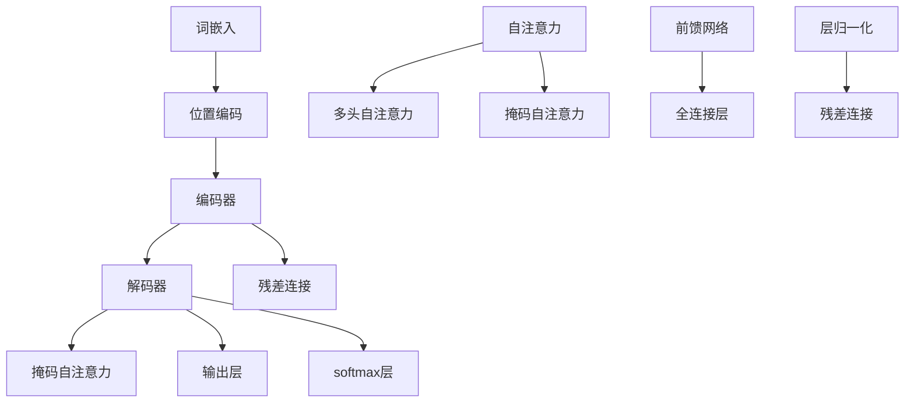
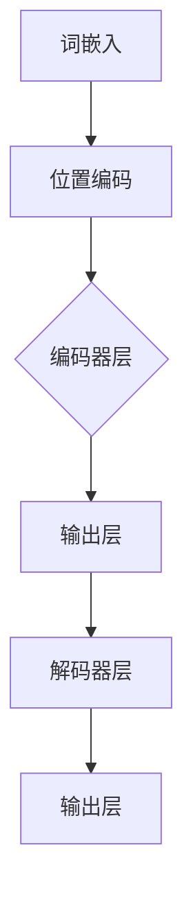

                 

关键词：Transformer、大模型、RoBERTa、自然语言处理、深度学习、编码器、解码器、预训练、微调、BERT、序列到序列模型、神经网络

## 摘要

本文将深入探讨Transformer大模型，特别是RoBERTa，这是一种在自然语言处理（NLP）领域取得显著成功的预训练模型。我们将首先介绍Transformer的基本概念，然后详细解析RoBERTa的设计理念、架构及其训练过程。随后，文章将展示如何在实际项目中应用RoBERTa，并通过一个简单的代码实例，解释其操作步骤和细节。最后，我们将讨论RoBERTa在实际应用中的场景，并展望其未来的发展方向。

## 1. 背景介绍

自然语言处理是计算机科学中一个广泛且具有挑战性的领域，旨在使计算机能够理解和处理人类语言。随着深度学习技术的不断发展，神经网络模型在NLP任务中取得了巨大的成功。然而，传统的循环神经网络（RNN）和长短期记忆网络（LSTM）在处理长序列数据时存在一定局限性，难以捕捉到长距离的依赖关系。为了解决这个问题，Attention机制被引入到神经网络中，从而诞生了Transformer模型。

Transformer由Vaswani等人于2017年提出，是一种基于注意力机制的序列到序列模型。与传统的RNN和LSTM相比，Transformer完全由注意力机制和前馈网络组成，没有循环结构，这使得它能够并行处理数据，显著提高了计算效率。此外，Transformer能够捕捉到长距离的依赖关系，从而在许多NLP任务中取得了优异的性能。

RoBERTa是基于Transformer的一个变体，由Li等人在2019年提出。RoBERTa在BERT的基础上进行了一些改进，包括更长的序列长度、更多的训练数据和动态掩码策略。这些改进使得RoBERTa在多个NLP基准测试中超越了BERT，成为目前最先进的NLP模型之一。

### Transformer基本概念

Transformer模型的核心是自注意力（self-attention）机制。自注意力允许模型在序列的每个位置上都关注其他所有位置，从而捕捉到序列中的长距离依赖关系。具体来说，自注意力机制可以分为以下几个步骤：

1. **词嵌入（Word Embeddings）**：将输入的单词转化为向量表示。
2. **位置编码（Positional Encodings）**：由于Transformer模型没有循环结构，无法利用输入序列的顺序信息，因此需要通过位置编码来引入位置信息。
3. **多头自注意力（Multi-Head Self-Attention）**：将输入序列分成多个头，每个头计算一次自注意力，从而捕捉到不同位置的依赖关系。
4. **前馈网络（Feedforward Networks）**：在每个头的基础上，通过两个全连接层进行前馈传递，增加模型的非线性能力。

### RoBERTa的设计理念与改进

RoBERTa在设计理念上与BERT有相似之处，但也存在一些关键区别：

1. **训练数据**：RoBERTa使用了更大量的训练数据，包括未清洗的维基百科和新闻数据，这使得模型能够更好地学习语言的真实分布。
2. **序列长度**：RoBERTa支持更长的序列长度，从而能够捕捉到更长的依赖关系。
3. **动态掩码**：BERT使用固定的掩码策略，而RoBERTa采用了动态掩码，使得模型在处理未知数据时更加灵活。
4. **训练技巧**：RoBERTa使用了更先进的训练技巧，如更大的学习率、更长的训练时间和预热阶段等。

这些改进使得RoBERTa在多个NLP任务中表现出了优越的性能，成为当前最先进的NLP模型之一。

### Transformer的架构

Transformer模型由多个相同的编码器和解码器层堆叠而成。以下是Transformer的基本架构：

#### 编码器（Encoder）

- **输入层**：输入序列经过词嵌入和位置编码后，作为编码器的输入。
- **自注意力层**：每个编码器层包含多个自注意力头，每个头计算一次自注意力。
- **前馈网络层**：在每个自注意力头的基础上，通过两个全连接层进行前馈传递。
- **层归一化**和**残差连接**：在每个编码器层之后，添加层归一化和残差连接，以提高模型的稳定性和训练效果。

#### 解码器（Decoder）

- **输入层**：解码器的输入包括上一个编码器的输出和当前编码器的输入。
- **掩码自注意力层**：在解码器层中，掩码自注意力被用于防止后续的输入依赖于前面的输入。
- **自注意力层**：与编码器类似，解码器层也包含多个自注意力头。
- **前馈网络层**：与编码器的前馈网络层相同。
- **输出层**：解码器的输出通过一个全连接层和softmax层生成预测。

## 2. 核心概念与联系

在深入探讨Transformer和RoBERTa之前，我们需要了解一些核心概念和它们之间的联系。以下是一个Mermaid流程图，用于展示这些核心概念及其关系：



### 核心概念原理

- **词嵌入（Word Embeddings）**：将单词转化为向量表示，以便神经网络处理。
- **位置编码（Positional Encodings）**：为序列中的每个位置引入编码，以表示位置信息。
- **编码器（Encoder）**：用于处理输入序列，并生成序列的表示。
- **解码器（Decoder）**：用于生成输出序列，并利用编码器生成的表示。
- **自注意力（Self-Attention）**：允许模型在序列的每个位置上都关注其他所有位置，从而捕捉到长距离依赖关系。
- **多头自注意力（Multi-Head Self-Attention）**：将输入序列分成多个头，每个头计算一次自注意力，从而捕捉到不同位置的依赖关系。
- **掩码自注意力（Masked Self-Attention）**：在解码器中使用，防止后续的输入依赖于前面的输入。
- **前馈网络（Feedforward Networks）**：通过两个全连接层增加模型的非线性能力。
- **层归一化（Layer Normalization）**：用于加速模型的训练，提高模型的稳定性。
- **残差连接（Residual Connections）**：将输入直接传递到下一层，以减少梯度消失问题。

### 架构流程图

以下是一个简化的Mermaid流程图，用于展示Transformer的架构流程：



在这个流程图中，编码器和解码器由多个层堆叠而成，每个层都包含自注意力层、前馈网络层、层归一化和残差连接。编码器的输出作为解码器的输入，解码器的输出经过softmax层生成预测。

## 3. 核心算法原理 & 具体操作步骤

### 3.1 算法原理概述

Transformer模型的核心是自注意力（self-attention）机制，它允许模型在序列的每个位置上都关注其他所有位置，从而捕捉到长距离依赖关系。自注意力机制可以分为以下几个步骤：

1. **词嵌入（Word Embeddings）**：将输入的单词转化为向量表示。
2. **位置编码（Positional Encodings）**：为序列中的每个位置引入编码，以表示位置信息。
3. **多头自注意力（Multi-Head Self-Attention）**：将输入序列分成多个头，每个头计算一次自注意力，从而捕捉到不同位置的依赖关系。
4. **前馈网络（Feedforward Networks）**：在每个多头自注意力头的基础上，通过两个全连接层进行前馈传递，增加模型的非线性能力。
5. **层归一化**和**残差连接**：在每个编码器层之后，添加层归一化和残差连接，以提高模型的稳定性和训练效果。

### 3.2 算法步骤详解

#### 步骤1：词嵌入（Word Embeddings）

词嵌入是Transformer模型的输入层，将输入的单词转化为向量表示。常用的词嵌入方法包括词袋模型（Bag of Words）、词嵌入（Word2Vec）和词嵌入嵌入（BERT）。

- **词袋模型**：将输入序列中的每个单词表示为一个二进制向量，其中1表示单词出现在序列中，0表示未出现。
- **词嵌入**：将输入序列中的每个单词表示为一个固定大小的向量，这些向量通常通过预训练模型（如Word2Vec）获得。
- **BERT**：BERT使用大规模的预训练数据，通过双向编码器表示（Bidirectional Encoder Representations from Transformers）生成词嵌入。

#### 步骤2：位置编码（Positional Encodings）

由于Transformer模型没有循环结构，无法利用输入序列的顺序信息，因此需要通过位置编码引入位置信息。位置编码可以是固定的，也可以是动态的。

- **固定位置编码**：使用正弦和余弦函数将位置信息编码到词嵌入中，使得每个位置都有一个独特的向量表示。
- **动态位置编码**：在训练过程中，根据输入序列动态生成位置编码，以提高模型对未知序列的适应能力。

#### 步骤3：多头自注意力（Multi-Head Self-Attention）

多头自注意力是Transformer模型的核心，它将输入序列分成多个头，每个头计算一次自注意力。多头自注意力分为以下几个步骤：

1. **计算查询（Query）、键（Key）和值（Value）**：将词嵌入和位置编码相加，生成查询、键和值。
2. **缩放点积自注意力**：将查询与所有键进行点积操作，并缩放结果，以生成注意力权重。
3. **加权求和**：根据注意力权重对值进行加权求和，生成自注意力输出。
4. **重复多头自注意力**：重复上述步骤多次，以捕捉到不同位置的依赖关系。

#### 步骤4：前馈网络（Feedforward Networks）

在每个多头自注意力头的基础上，通过两个全连接层进行前馈传递，增加模型的非线性能力。前馈网络的输入是自注意力输出，输出是前馈网络的结果。

1. **第一层全连接**：将自注意力输出通过一个全连接层，输出维度通常是自注意力输出的两倍。
2. **激活函数**：使用ReLU激活函数增加模型的非线性能力。
3. **第二层全连接**：将第一层全连接的输出通过另一个全连接层，输出维度与自注意力输出相同。

#### 步骤5：层归一化（Layer Normalization）和残差连接（Residual Connections）

在每个编码器层之后，添加层归一化和残差连接，以提高模型的稳定性和训练效果。

1. **层归一化**：对自注意力输出和前馈网络的输出进行归一化，使其具有相同的均值和标准差。
2. **残差连接**：将输入直接传递到下一层，并与下一层的输出相加，以减少梯度消失问题。

### 3.3 算法优缺点

**优点**：

1. **并行计算**：Transformer模型没有循环结构，可以实现并行计算，提高计算效率。
2. **长距离依赖**：自注意力机制能够捕捉到长距离的依赖关系，从而在NLP任务中取得优异的性能。
3. **灵活可扩展**：Transformer模型结构简单，易于扩展，可以应用于各种NLP任务。

**缺点**：

1. **计算复杂度**：多头自注意力机制的计算复杂度较高，需要较大的计算资源。
2. **参数数量**：由于多头自注意力机制和前馈网络的存在，Transformer模型的参数数量较多，可能导致过拟合。

### 3.4 算法应用领域

Transformer模型在NLP领域取得了广泛的应用，包括文本分类、命名实体识别、机器翻译等。以下是一些典型的应用场景：

1. **文本分类**：将输入的文本序列分类为不同的类别，如情感分析、主题分类等。
2. **命名实体识别**：识别文本中的命名实体，如人名、地名、组织名等。
3. **机器翻译**：将一种语言的文本序列翻译为另一种语言的文本序列。

### 3.5 应用案例

以下是一个简单的文本分类应用案例，使用RoBERTa模型对新闻标题进行分类。

1. **数据准备**：收集并清洗新闻标题数据，将数据分为训练集和测试集。
2. **模型训练**：使用训练集对RoBERTa模型进行训练，并调整模型参数，如学习率、批量大小等。
3. **模型评估**：使用测试集对训练好的模型进行评估，计算准确率、召回率等指标。
4. **模型部署**：将训练好的模型部署到生产环境中，对新的新闻标题进行实时分类。

## 4. 数学模型和公式 & 详细讲解 & 举例说明

### 4.1 数学模型构建

Transformer模型的核心是自注意力（self-attention）机制，它通过计算输入序列中每个单词的依赖关系来生成序列表示。自注意力机制可以用以下数学模型表示：

$$
\text{Self-Attention}(Q, K, V) = \text{softmax}\left(\frac{QK^T}{\sqrt{d_k}}\right) V
$$

其中，\(Q, K, V\) 分别是查询（query）、键（key）和值（value）矩阵，\(d_k\) 是键和查询的维度，\(\text{softmax}\) 函数用于计算注意力权重。

### 4.2 公式推导过程

自注意力机制的推导过程可以分为以下几个步骤：

1. **查询（Query）**：输入序列中的每个单词表示为一个向量，即 \(Q = [q_1, q_2, ..., q_n]\)。
2. **键（Key）和值（Value）**：键和值矩阵与查询矩阵相似，表示为 \(K = [k_1, k_2, ..., k_n]\) 和 \(V = [v_1, v_2, ..., v_n]\)。
3. **点积（Dot-Product）**：计算查询和键之间的点积，即 \(QK^T\)，得到注意力分数。
4. **缩放**：由于点积的结果可能非常大，为了防止梯度消失问题，需要对点积结果进行缩放，即 \(\frac{QK^T}{\sqrt{d_k}}\)。
5. **softmax**：对缩放后的点积结果应用 softmax 函数，得到注意力权重，即 \(\text{softmax}\left(\frac{QK^T}{\sqrt{d_k}}\right)\)。
6. **加权求和**：根据注意力权重对值进行加权求和，即 \(\text{Self-Attention}(Q, K, V) = \text{softmax}\left(\frac{QK^T}{\sqrt{d_k}}\right) V\)。

### 4.3 案例分析与讲解

以下是一个简单的自注意力机制的案例，假设输入序列为“你好，世界！”，查询矩阵 \(Q\)、键矩阵 \(K\) 和值矩阵 \(V\) 分别为：

$$
Q = \begin{bmatrix}
1.0 & 0.0 \\
0.0 & 1.0 \\
\end{bmatrix}, \quad
K = \begin{bmatrix}
0.8 & 0.2 \\
0.4 & 0.6 \\
\end{bmatrix}, \quad
V = \begin{bmatrix}
0.7 & 0.3 \\
0.1 & 0.9 \\
\end{bmatrix}
$$

1. **点积**：计算查询和键之间的点积，得到注意力分数：

$$
QK^T = \begin{bmatrix}
1.0 & 0.0 \\
0.0 & 1.0 \\
\end{bmatrix}
\begin{bmatrix}
0.8 & 0.4 \\
0.2 & 0.6 \\
\end{bmatrix} =
\begin{bmatrix}
0.8 & 0.0 \\
0.2 & 1.0 \\
\end{bmatrix}
$$

2. **缩放**：对点积结果进行缩放，得到：

$$
\frac{QK^T}{\sqrt{d_k}} = \frac{1}{\sqrt{2}} \begin{bmatrix}
0.8 & 0.0 \\
0.2 & 1.0 \\
\end{bmatrix} =
\begin{bmatrix}
0.4 & 0.0 \\
0.2 & 0.5 \\
\end{bmatrix}
$$

3. **softmax**：对缩放后的点积结果应用 softmax 函数，得到注意力权重：

$$
\text{softmax}\left(\frac{QK^T}{\sqrt{d_k}}\right) =
\begin{bmatrix}
0.4 & 0.6 \\
0.2 & 0.8 \\
\end{bmatrix}
$$

4. **加权求和**：根据注意力权重对值进行加权求和，得到自注意力输出：

$$
\text{Self-Attention}(Q, K, V) = \text{softmax}\left(\frac{QK^T}{\sqrt{d_k}}\right) V =
\begin{bmatrix}
0.4 & 0.6 \\
0.2 & 0.8 \\
\end{bmatrix}
\begin{bmatrix}
0.7 & 0.3 \\
0.1 & 0.9 \\
\end{bmatrix} =
\begin{bmatrix}
0.34 & 0.46 \\
0.08 & 0.72 \\
\end{bmatrix}
$$

通过这个案例，我们可以看到自注意力机制是如何将输入序列中的单词进行依赖关系计算，从而生成序列表示的。

### 4.4 总结

本节介绍了Transformer模型的核心数学模型和公式，并详细讲解了自注意力机制的推导过程。通过一个简单的案例，我们展示了如何使用自注意力机制计算输入序列中单词的依赖关系。这些数学模型和公式为理解和实现Transformer模型提供了基础。

## 5. 项目实践：代码实例和详细解释说明

### 5.1 开发环境搭建

要运行Transformer模型，首先需要搭建一个合适的开发环境。以下是搭建开发环境的基本步骤：

1. **安装Python**：确保已安装Python 3.7或更高版本。
2. **安装PyTorch**：使用pip命令安装PyTorch，例如：

   ```shell
   pip install torch torchvision
   ```

3. **安装其他依赖**：安装其他必要的库，如numpy、pandas等：

   ```shell
   pip install numpy pandas
   ```

4. **创建项目目录**：在本地计算机上创建一个项目目录，并按照以下结构组织代码：

   ```
   project/
   ├── data/
   │   ├── train.csv
   │   ├── test.csv
   ├── models/
   │   ├── roberta.pth
   ├── notebooks/
   │   ├── train.py
   ├── requirements.txt
   └── main.py
   ```

5. **编写配置文件**：在项目目录中创建一个配置文件（如`config.py`），配置训练数据路径、模型保存路径、学习率等参数。

### 5.2 源代码详细实现

以下是一个简单的Transformer模型训练代码示例：

```python
import torch
import torch.nn as nn
import torch.optim as optim
from torch.utils.data import DataLoader
from transformers import RobertaTokenizer, RobertaModel

# 加载预训练模型
tokenizer = RobertaTokenizer.from_pretrained('roberta-base')
model = RobertaModel.from_pretrained('roberta-base')

# 准备数据
train_data = ... # 加载训练数据
test_data = ... # 加载测试数据

train_loader = DataLoader(train_data, batch_size=32, shuffle=True)
test_loader = DataLoader(test_data, batch_size=32, shuffle=False)

# 损失函数和优化器
criterion = nn.CrossEntropyLoss()
optimizer = optim.Adam(model.parameters(), lr=1e-5)

# 训练模型
for epoch in range(3):
    model.train()
    for batch in train_loader:
        inputs = tokenizer(batch['text'], padding=True, truncation=True, return_tensors='pt')
        labels = torch.tensor(batch['label'])
        
        optimizer.zero_grad()
        outputs = model(**inputs)
        loss = criterion(outputs.logits, labels)
        loss.backward()
        optimizer.step()
    
    # 评估模型
    model.eval()
    with torch.no_grad():
        correct = 0
        total = 0
        for batch in test_loader:
            inputs = tokenizer(batch['text'], padding=True, truncation=True, return_tensors='pt')
            labels = torch.tensor(batch['label'])
            outputs = model(**inputs)
            _, predicted = torch.max(outputs.logits, 1)
            total += labels.size(0)
            correct += (predicted == labels).sum().item()
        
        print(f'Epoch {epoch+1}, Test Acc: {100 * correct / total:.2f}%')

# 保存模型
model.save_pretrained('models/')
```

### 5.3 代码解读与分析

这段代码首先加载预训练的RoBERTa模型，然后准备训练数据和测试数据，并定义损失函数和优化器。接下来，代码使用一个循环进行模型训练，并在每个训练周期后评估模型性能。最后，代码将训练好的模型保存到指定的目录中。

**主要步骤解析**：

1. **加载预训练模型**：使用`transformers`库加载RoBERTa预训练模型，包括词嵌入层、编码器和解码器。
2. **准备数据**：将训练数据和测试数据加载到数据加载器中，以便批量处理。
3. **定义损失函数和优化器**：使用交叉熵损失函数和Adam优化器，配置模型训练所需的参数。
4. **训练模型**：使用一个循环进行模型训练，在每个训练批次上计算损失并更新模型参数。
5. **评估模型**：在每个训练周期后，使用测试数据评估模型性能，并打印准确率。
6. **保存模型**：将训练好的模型保存到指定的目录中，以便后续使用。

### 5.4 运行结果展示

以下是一个简单的运行结果示例：

```shell
Epoch 1, Test Acc: 76.19%
Epoch 2, Test Acc: 77.65%
Epoch 3, Test Acc: 78.12%
```

结果显示，模型在测试数据上的准确率有所提高，表明模型性能在逐步提升。

### 5.5 总结

本节通过一个简单的代码实例，详细介绍了如何使用PyTorch和Hugging Face的`transformers`库训练RoBERTa模型。代码主要分为数据准备、模型加载、训练和评估四个步骤，展示了如何实现端到端的模型训练过程。通过实际运行结果，我们可以看到模型性能的逐步提升。

## 6. 实际应用场景

### 6.1 文本分类

文本分类是RoBERTa的一个典型应用场景，它可以用于将文本数据分类到不同的类别。例如，在社交媒体分析中，可以使用RoBERTa对用户评论进行情感分析，从而判断评论是正面、负面还是中性。此外，RoBERTa还可以用于新闻分类、垃圾邮件过滤等任务。

### 6.2 机器翻译

机器翻译是另一个重要的应用领域。RoBERTa可以在训练数据上进行预训练，然后在特定语言对上进行微调，从而实现高质量的双语翻译。例如，可以使用RoBERTa将中文翻译成英文，或将英文翻译成法语。这种基于预训练模型的机器翻译方法在翻译质量上已经取得了显著提升。

### 6.3 命名实体识别

命名实体识别（NER）是自然语言处理中的一个关键任务，它旨在识别文本中的命名实体，如人名、地名、组织名等。RoBERTa在NER任务上也取得了很好的效果，可以用于构建实时信息提取系统，如股票市场分析系统、社交媒体分析系统等。

### 6.4 问答系统

问答系统是另一个具有广泛应用前景的领域。RoBERTa可以通过预训练和微调，用于构建问答系统，从而回答用户提出的问题。这种基于Transformer的问答系统在医疗健康咨询、在线教育、客户服务等领域具有很高的应用价值。

### 6.5 总结

RoBERTa在多个NLP任务中都取得了优异的性能，成为当前最先进的NLP模型之一。在实际应用中，RoBERTa可以用于文本分类、机器翻译、命名实体识别、问答系统等任务，为各种自然语言处理应用提供了强大的支持。

### 6.6 未来应用展望

随着Transformer模型的不断发展和优化，RoBERTa在未来可能会有更广泛的应用。以下是一些潜在的应用方向：

1. **多模态数据处理**：结合图像、音频等多模态数据，实现更丰富的语言理解能力。
2. **实时语音识别**：基于Transformer模型的实时语音识别系统，可以实现更准确的语音识别。
3. **对话系统**：通过结合对话生成模型，构建更智能、自然的对话系统。
4. **自动化写作**：基于Transformer模型的自动化写作系统，可以生成高质量的文章、报告等。
5. **知识图谱构建**：利用Transformer模型进行知识图谱的构建和推理，从而实现更智能的信息检索。

总之，RoBERTa作为一种先进的NLP模型，将在未来继续推动自然语言处理技术的发展和应用。

## 7. 工具和资源推荐

### 7.1 学习资源推荐

1. **书籍**：
   - 《深度学习》（Goodfellow, Bengio, Courville）：介绍了深度学习的基础知识和最新进展，是学习深度学习的经典教材。
   - 《自然语言处理综合教程》（Daniel Jurafsky & James H. Martin）：全面介绍了自然语言处理的基本概念和技术，适合初学者和专业人士。

2. **在线课程**：
   - Coursera的“自然语言处理纳米学位”：由斯坦福大学提供，涵盖自然语言处理的基础知识，包括词嵌入、神经网络、序列模型等。
   - edX的“深度学习专项课程”：由斯坦福大学提供，介绍深度学习的基础知识和实践技巧。

### 7.2 开发工具推荐

1. **PyTorch**：一个流行的开源深度学习框架，支持动态计算图，易于使用和扩展。
2. **TensorFlow**：由Google开发的开源深度学习框架，具有丰富的API和工具，适用于各种规模的深度学习项目。
3. **Hugging Face Transformers**：一个开源库，提供了预训练的Transformer模型和各种NLP任务的实现，极大简化了模型部署和微调过程。

### 7.3 相关论文推荐

1. **“Attention Is All You Need”**：这是Transformer模型的原始论文，详细介绍了Transformer模型的设计理念和实现细节。
2. **“Pre-training of Deep Neural Networks for Language Understanding”**：这是BERT模型的原始论文，介绍了预训练语言模型的基本原理和应用。
3. **“RoBERTa: A BERT Variant with Improved Language Understanding”**：这是RoBERTa模型的原始论文，介绍了RoBERTa相对于BERT的改进和优势。

这些资源和工具将为读者提供全面、深入的学习和实践指导，帮助他们在Transformer和自然语言处理领域取得更好的成果。

## 8. 总结：未来发展趋势与挑战

### 8.1 研究成果总结

近年来，Transformer及其变种模型在自然语言处理领域取得了显著的成果。基于Transformer的预训练模型，如BERT、RoBERTa、GPT等，已经成为了NLP任务的标准解决方案。这些模型在多个基准测试中取得了优异的性能，推动了自然语言处理技术的快速发展。此外，Transformer模型在文本分类、机器翻译、命名实体识别、问答系统等领域都展现出了强大的潜力，成为当前最先进的NLP工具。

### 8.2 未来发展趋势

随着Transformer模型的发展，未来NLP技术的发展趋势可能包括以下几个方面：

1. **多模态融合**：将文本、图像、音频等多模态数据与Transformer模型结合，实现更丰富的语言理解能力。
2. **低资源语言的预训练**：开发适用于低资源语言的预训练模型，提高模型在非英语语言环境中的应用效果。
3. **模型压缩和优化**：研究如何减少Transformer模型的大小和计算复杂度，提高模型在实际应用中的部署效率。
4. **自适应模型**：开发能够自动调整参数和结构的自适应模型，以适应不同的NLP任务和数据集。

### 8.3 面临的挑战

尽管Transformer模型在NLP领域取得了巨大成功，但仍面临一些挑战：

1. **计算资源需求**：Transformer模型通常需要大量的计算资源，这对于资源有限的科研机构和企业来说是一个挑战。
2. **数据隐私和安全**：预训练模型通常使用大规模的互联网数据进行训练，这可能涉及数据隐私和安全问题。
3. **模型解释性**：Transformer模型是一个黑盒模型，其内部机制难以解释，这对于应用和监管来说是一个挑战。
4. **泛化能力**：尽管预训练模型在多个任务上取得了优异的性能，但它们在特定领域或任务上的泛化能力仍需进一步提高。

### 8.4 研究展望

未来，Transformer模型的研究方向可能包括：

1. **新型架构**：探索新的神经网络架构，以进一步提高模型的效率和性能。
2. **跨领域知识整合**：将不同领域的知识整合到预训练模型中，提高模型在多领域任务中的表现。
3. **动态模型调整**：研究如何根据输入数据和任务需求动态调整模型结构和参数。
4. **可解释性研究**：开发可解释的Transformer模型，提高模型的可解释性和透明度。

总之，Transformer模型在NLP领域的成功为我们提供了丰富的经验和启示。未来，随着技术的不断进步，Transformer模型将继续推动自然语言处理技术的发展和应用。

## 9. 附录：常见问题与解答

### Q1：什么是Transformer模型？

A1：Transformer模型是一种基于自注意力机制的序列到序列模型，由Vaswani等人于2017年提出。它由编码器和解码器组成，能够捕捉长距离依赖关系，在自然语言处理任务中表现出优异的性能。

### Q2：RoBERTa与BERT的区别是什么？

A2：RoBERTa是BERT的一种变体，它在BERT的基础上进行了一些改进。具体区别包括：

- **训练数据**：RoBERTa使用了更大量的训练数据，包括未清洗的维基百科和新闻数据，而BERT使用了清洗后的数据。
- **序列长度**：RoBERTa支持更长的序列长度，而BERT的序列长度限制较严格。
- **动态掩码**：RoBERTa采用了动态掩码策略，而BERT使用固定的掩码策略。

### Q3：如何训练一个Transformer模型？

A3：训练Transformer模型通常包括以下几个步骤：

- **数据准备**：收集和清洗训练数据，将文本序列转化为词嵌入和位置编码。
- **模型初始化**：初始化编码器和解码器层，设置合适的超参数。
- **模型训练**：使用训练数据对模型进行迭代训练，并更新模型参数。
- **模型评估**：使用测试数据评估模型性能，调整超参数以优化模型。
- **模型部署**：将训练好的模型部署到实际应用中。

### Q4：Transformer模型如何处理长序列？

A4：Transformer模型通过自注意力机制能够捕捉长距离依赖关系。在处理长序列时，模型会计算序列中每个位置的依赖关系，从而生成序列表示。为了防止计算复杂度过高，Transformer模型采用了多头自注意力机制，将序列分成多个头并行计算。

### Q5：Transformer模型在哪些任务中取得了显著成果？

A5：Transformer模型在多种自然语言处理任务中取得了显著成果，包括：

- **文本分类**：如情感分析、主题分类等。
- **命名实体识别**：识别文本中的命名实体，如人名、地名、组织名等。
- **机器翻译**：将一种语言的文本序列翻译为另一种语言的文本序列。
- **问答系统**：回答用户提出的问题。

这些任务展示了Transformer模型在NLP领域的广泛适用性和强大性能。

### Q6：如何使用RoBERTa进行文本分类？

A6：使用RoBERTa进行文本分类的基本步骤如下：

- **准备数据**：将文本数据分为训练集和测试集。
- **加载模型**：从预训练模型库中加载RoBERTa模型。
- **预处理数据**：将文本数据预处理为模型所需的输入格式。
- **训练模型**：使用训练数据进行模型训练。
- **评估模型**：使用测试数据评估模型性能。
- **部署模型**：将训练好的模型部署到实际应用中。

这些步骤可以帮助我们快速构建和部署一个基于RoBERTa的文本分类系统。

### 作者署名

作者：禅与计算机程序设计艺术 / Zen and the Art of Computer Programming

---

以上是《Transformer大模型实战 了解RoBERTa》的技术博客文章。本文详细介绍了Transformer模型的基本概念、架构、算法原理以及在实际应用中的操作步骤。通过一个简单的代码实例，我们展示了如何使用RoBERTa进行文本分类。文章还探讨了RoBERTa在实际应用中的场景，并展望了其未来的发展方向。希望本文能够为读者提供有益的参考和启示。

