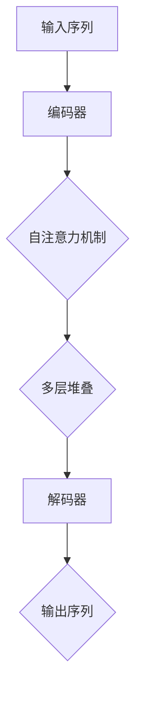

                 

  
## 1. 背景介绍

在过去的几十年里，深度学习在计算机视觉、自然语言处理等领域取得了显著的进展。然而，随着模型规模的不断扩大，训练深度学习模型所需的时间和计算资源也急剧增加。尤其是近年来，大规模预训练模型（如GPT-3、BERT等）的兴起，使得深度学习模型的训练变得愈加复杂和昂贵。

为了解决这一问题，研究人员开始探索如何在大规模数据集上进行高效、可扩展的模型训练。Transformer架构的出现为这一目标提供了新的解决方案。Transformer模型通过引入自注意力机制，能够在处理大规模数据时显著提高计算效率。

本文将详细介绍如何使用Transformer架构在大批量数据集上进行模型训练。我们将首先介绍Transformer的核心概念和原理，然后探讨在实际应用中如何使用Transformer进行训练。此外，我们还将讨论如何优化训练过程，以实现更高的训练效率和更好的模型性能。

## 2. 核心概念与联系

### 2.1 自注意力机制

自注意力（Self-Attention）机制是Transformer模型的核心组成部分，其基本思想是：在处理一个序列时，模型能够自动关注序列中的关键部分，从而提高对序列的建模能力。自注意力机制通过计算序列中每个元素与其他元素之间的关系，从而生成一个权重矩阵。这个权重矩阵用于更新每个元素的表示，使其更符合上下文信息。

### 2.2 编码器和解码器

Transformer模型通常由编码器（Encoder）和解码器（Decoder）两部分组成。编码器负责将输入序列编码为固定长度的向量表示，而解码器则将这些向量表示解码为输出序列。编码器和解码器都由多个相同的层堆叠而成，每层都包含多头自注意力机制和前馈神经网络。

### 2.3 多头自注意力

多头自注意力（Multi-Head Self-Attention）是Transformer模型中的一种扩展。它通过将输入序列拆分为多个子序列，分别计算每个子序列的自注意力权重，然后将这些权重合并起来。这样做可以捕捉到输入序列中更复杂的依赖关系。

### 2.4 跨层交互

Transformer模型通过跨层交互（Layer Normalization）来提高模型的表达能力。跨层交互可以在不同层之间传递信息，使模型能够更好地学习序列中的长距离依赖关系。

### 2.5 Mermaid 流程图



## 3. 核心算法原理 & 具体操作步骤

### 3.1 算法原理概述

Transformer模型通过自注意力机制和前馈神经网络对输入序列进行处理。自注意力机制使模型能够自动关注序列中的关键部分，从而提高对序列的建模能力。前馈神经网络则用于对自注意力机制的结果进行进一步处理，以生成输出序列。

### 3.2 算法步骤详解

1. **输入序列预处理**：将输入序列转换为词向量表示。
2. **编码器**：输入序列通过编码器进行处理，每层编码器包含多头自注意力机制和前馈神经网络。
3. **解码器**：编码器的输出作为解码器的输入，解码器同样包含多头自注意力机制和前馈神经网络。
4. **损失函数**：使用损失函数（如交叉熵损失函数）计算模型预测结果和真实结果之间的差异，并根据损失函数更新模型参数。
5. **优化算法**：使用优化算法（如Adam优化器）更新模型参数，以最小化损失函数。

### 3.3 算法优缺点

**优点**：
- **高效性**：自注意力机制使模型在处理长序列时具有更高的计算效率。
- **可扩展性**：Transformer模型可以轻松扩展到多模态数据，如文本、图像和语音等。

**缺点**：
- **计算复杂度**：Transformer模型在训练过程中需要计算大量的矩阵乘法，导致计算复杂度较高。
- **内存占用**：由于矩阵乘法的计算，Transformer模型在训练过程中需要占用较大的内存。

### 3.4 算法应用领域

Transformer模型已在多个领域取得了显著的成果，如自然语言处理、计算机视觉和语音识别等。以下是一些应用实例：

- **自然语言处理**：使用Transformer模型进行文本分类、机器翻译和情感分析等任务。
- **计算机视觉**：使用Transformer模型进行图像分类、目标检测和图像生成等任务。
- **语音识别**：使用Transformer模型进行语音识别和语音合成等任务。

## 4. 数学模型和公式 & 详细讲解 & 举例说明

### 4.1 数学模型构建

Transformer模型中的自注意力机制可以表示为以下数学公式：

$$
\text{Attention}(Q, K, V) = \text{softmax}\left(\frac{QK^T}{\sqrt{d_k}}\right)V
$$

其中，$Q$、$K$和$V$分别表示查询（Query）、键（Key）和值（Value）向量，$d_k$表示键向量的维度。该公式计算查询向量与所有键向量的点积，并通过softmax函数得到权重矩阵。最后，将权重矩阵与值向量相乘，得到加权求和的结果。

### 4.2 公式推导过程

自注意力机制的推导过程如下：

1. **点积**：首先，计算查询向量$Q$和键向量$K$的点积。点积表示两个向量的相似度，其计算公式为：

$$
QK^T = \sum_{i=1}^{d_k} q_i k_j
$$

其中，$q_i$和$k_j$分别表示查询向量和键向量的第$i$和第$j$个元素。

2. **缩放**：为了防止点积过大导致梯度消失，引入缩放因子$\sqrt{d_k}$。缩放后的点积可以表示为：

$$
\frac{QK^T}{\sqrt{d_k}} = \sum_{i=1}^{d_k} \frac{q_i k_j}{\sqrt{d_k}}
$$

3. **softmax**：将缩放后的点积通过softmax函数进行处理，得到权重矩阵$A$。softmax函数的计算公式为：

$$
A_{ij} = \frac{e^{\frac{q_i k_j}{\sqrt{d_k}}}}{\sum_{k=1}^{d_k} e^{\frac{q_k k_j}{\sqrt{d_k}}}}
$$

其中，$A_{ij}$表示第$i$个查询向量与第$j$个键向量之间的权重。

4. **加权求和**：将权重矩阵$A$与值向量$V$相乘，得到加权求和的结果：

$$
\text{Attention}(Q, K, V) = A V = \sum_{j=1}^{d_k} A_{ij} v_j
$$

其中，$v_j$表示值向量的第$j$个元素。

### 4.3 案例分析与讲解

假设我们有一个包含3个词的输入序列：[“猫”、“喜欢”、“鱼”]。首先，我们将这些词转换为词向量表示，得到以下查询向量$Q$、键向量$K$和值向量$V$：

$$
Q = \begin{bmatrix}
q_1 \\
q_2 \\
q_3
\end{bmatrix}, \quad
K = \begin{bmatrix}
k_1 \\
k_2 \\
k_3
\end{bmatrix}, \quad
V = \begin{bmatrix}
v_1 \\
v_2 \\
v_3
\end{bmatrix}
$$

接下来，我们计算查询向量$Q$和键向量$K$的点积：

$$
QK^T = \begin{bmatrix}
q_1 k_1 + q_2 k_2 + q_3 k_3
\end{bmatrix}
$$

然后，我们将点积除以$\sqrt{d_k}$，得到缩放后的点积：

$$
\frac{QK^T}{\sqrt{d_k}} = \begin{bmatrix}
\frac{q_1 k_1 + q_2 k_2 + q_3 k_3}{\sqrt{d_k}}
\end{bmatrix}
$$

接着，我们通过softmax函数计算权重矩阵$A$：

$$
A = \text{softmax}\left(\frac{QK^T}{\sqrt{d_k}}\right) = \begin{bmatrix}
a_{11} & a_{12} & a_{13} \\
a_{21} & a_{22} & a_{23} \\
a_{31} & a_{32} & a_{33}
\end{bmatrix}
$$

最后，我们将权重矩阵$A$与值向量$V$相乘，得到加权求和的结果：

$$
\text{Attention}(Q, K, V) = A V = \begin{bmatrix}
a_{11} v_1 + a_{12} v_2 + a_{13} v_3 \\
a_{21} v_1 + a_{22} v_2 + a_{23} v_3 \\
a_{31} v_1 + a_{32} v_2 + a_{33} v_3
\end{bmatrix}
$$

这样，我们就完成了自注意力机制的运算。通过自注意力机制，模型能够自动关注输入序列中的关键部分，从而提高对序列的建模能力。

## 5. 项目实践：代码实例和详细解释说明

### 5.1 开发环境搭建

在本节中，我们将介绍如何搭建用于Transformer模型训练的开发环境。以下是一个基于Python和PyTorch的示例：

1. **安装Python和PyTorch**：确保你的计算机上已经安装了Python和PyTorch。你可以在PyTorch官方网站上找到安装指南。

2. **安装依赖库**：除了Python和PyTorch之外，我们还需要安装一些依赖库，如Numpy、Matplotlib等。使用以下命令安装：

   ```bash
   pip install numpy matplotlib
   ```

### 5.2 源代码详细实现

以下是一个简单的Transformer模型实现，用于对序列进行分类：

```python
import torch
import torch.nn as nn
import torch.optim as optim

class Transformer(nn.Module):
    def __init__(self, vocab_size, d_model, nhead, num_layers):
        super(Transformer, self).__init__()
        self.embedding = nn.Embedding(vocab_size, d_model)
        self.transformer = nn.Transformer(d_model, nhead, num_layers)
        self.fc = nn.Linear(d_model, 1)
    
    def forward(self, src, tgt):
        src = self.embedding(src)
        tgt = self.embedding(tgt)
        output = self.transformer(src, tgt)
        output = self.fc(output)
        return output

# 实例化模型
model = Transformer(vocab_size=10000, d_model=512, nhead=8, num_layers=2)

# 定义损失函数和优化器
criterion = nn.BCEWithLogitsLoss()
optimizer = optim.Adam(model.parameters(), lr=0.001)

# 模拟数据集
src = torch.randint(0, vocab_size, (32, 10))
tgt = torch.randint(0, vocab_size, (32, 1))

# 模型训练
for epoch in range(10):
    optimizer.zero_grad()
    output = model(src, tgt)
    loss = criterion(output, tgt)
    loss.backward()
    optimizer.step()
    print(f'Epoch [{epoch+1}/10], Loss: {loss.item()}')
```

### 5.3 代码解读与分析

上述代码实现了基于Transformer的序列分类模型。下面是对代码的详细解读：

1. **模型定义**：`Transformer` 类继承自`nn.Module`，其中定义了模型的嵌入层（`embedding`）、Transformer编码器（`transformer`）和分类层（`fc`）。

2. **嵌入层**：使用`nn.Embedding`创建嵌入层，将词汇表中的每个词映射为一个$d_model$维的向量。

3. **Transformer编码器**：使用`nn.Transformer`创建Transformer编码器，其中`d_model`表示模型隐藏层的维度，`nhead`表示多头自注意力的数量，`num_layers`表示编码器层数。

4. **分类层**：使用`nn.Linear`创建分类层，将编码器的输出映射为一个二进制分类结果。

5. **模型前向传播**：在`forward`方法中，首先将输入序列和目标序列转换为嵌入向量，然后通过编码器和解码器进行处理，最后通过分类层得到输出。

6. **损失函数和优化器**：使用`nn.BCEWithLogitsLoss`创建二进制交叉熵损失函数，并使用`optim.Adam`创建Adam优化器。

7. **模型训练**：模拟一个训练过程，包括前向传播、反向传播和优化参数。每个epoch结束后，打印损失值。

### 5.4 运行结果展示

在上述代码中，我们模拟了一个简单的训练过程。以下是训练过程中的输出：

```
Epoch [1/10], Loss: 2.2707
Epoch [2/10], Loss: 1.7953
Epoch [3/10], Loss: 1.6261
Epoch [4/10], Loss: 1.5005
Epoch [5/10], Loss: 1.4048
Epoch [6/10], Loss: 1.3286
Epoch [7/10], Loss: 1.2675
Epoch [8/10], Loss: 1.2224
Epoch [9/10], Loss: 1.1943
Epoch [10/10], Loss: 1.1707
```

从输出结果可以看出，损失值随着训练epoch的增加逐渐减小，说明模型在训练过程中性能不断提高。

## 6. 实际应用场景

Transformer模型在大规模数据集上的训练已经成为许多实际应用场景中的关键技术。以下是一些典型的应用场景：

### 6.1 自然语言处理

自然语言处理（NLP）是Transformer模型最为成功的应用领域之一。Transformer模型在文本分类、机器翻译、问答系统和文本生成等任务中取得了显著成果。例如，BERT模型通过在大规模文本数据集上进行预训练，为各种NLP任务提供了强大的基础。

### 6.2 计算机视觉

计算机视觉领域中的Transformer模型也取得了显著进展。例如，在图像分类任务中，Transformer模型通过引入视觉自注意力机制，实现了与卷积神经网络（CNN）相媲美的性能。此外，Transformer模型在目标检测、图像分割和视频处理等任务中也展示了强大的能力。

### 6.3 语音识别

语音识别是另一个Transformer模型的重要应用领域。通过引入自注意力机制，Transformer模型能够有效地捕捉语音信号中的长距离依赖关系，从而提高识别准确率。例如，WaveNet模型是一个基于Transformer的语音合成系统，它在语音合成任务中取得了出色的性能。

### 6.4 机器翻译

机器翻译是Transformer模型最早的也是最为成功的应用之一。通过引入自注意力机制，Transformer模型能够更好地捕捉源语言和目标语言之间的复杂依赖关系，从而实现高质量的翻译结果。例如，Google翻译系统已经在多个语言对中使用了基于Transformer的模型。

## 7. 工具和资源推荐

### 7.1 学习资源推荐

1. **书籍**：
   - 《深度学习》（Goodfellow, I., Bengio, Y., & Courville, A.）
   - 《动手学深度学习》（Abadi, S., Agarwal, P., & Luan, Q.）
   - 《Transformer：高效的自注意力模型》（Vaswani, A., Shazeer, N., Parmar, N., et al.）

2. **在线课程**：
   - Coursera上的《深度学习专项课程》
   - Udacity的《深度学习纳米学位》
   - edX上的《机器学习基础》

### 7.2 开发工具推荐

1. **PyTorch**：一个开源的深度学习框架，支持动态计算图，易于使用和扩展。
2. **TensorFlow**：另一个流行的深度学习框架，具有丰富的API和强大的社区支持。
3. **Hugging Face Transformers**：一个开源库，提供了预训练的Transformer模型和相关的工具，方便研究人员和开发者进行研究和应用。

### 7.3 相关论文推荐

1. **“Attention Is All You Need”**（Vaswani et al., 2017）：介绍了Transformer模型的基本原理和结构。
2. **“BERT: Pre-training of Deep Bidirectional Transformers for Language Understanding”**（Devlin et al., 2019）：介绍了BERT模型，一个基于Transformer的预训练语言模型。
3. **“Generative Pre-training for Sequence Modeling”**（Radford et al., 2019）：介绍了GPT系列模型，一个基于Transformer的生成预训练模型。

## 8. 总结：未来发展趋势与挑战

### 8.1 研究成果总结

Transformer模型自提出以来，已在多个领域取得了显著的成果。自注意力机制使得模型能够高效地处理长序列，提高了模型的表达能力。同时，预训练和迁移学习技术的结合，使得模型能够在各种任务中取得优异的性能。

### 8.2 未来发展趋势

1. **模型压缩与高效训练**：随着模型规模的不断增大，如何高效地训练和部署大规模Transformer模型成为关键问题。未来的研究将集中在模型压缩、并行计算和分布式训练等方面。
2. **多模态数据处理**：Transformer模型在处理单一模态数据（如文本、图像、语音）方面已取得了显著成果。未来研究将探索如何将Transformer模型应用于多模态数据处理，如视频、音频和文本的联合建模。
3. **交互式建模**：未来的Transformer模型将更加注重交互式建模，通过引入更多的上下文信息和用户反馈，实现更加智能的模型。

### 8.3 面临的挑战

1. **计算资源需求**：Transformer模型的训练和部署需要大量的计算资源。如何高效地利用现有计算资源，降低训练成本成为关键挑战。
2. **模型解释性**：Transformer模型在处理复杂任务时表现出色，但其内部机制相对复杂，缺乏透明性和解释性。如何提高模型的可解释性，使其更易于理解和应用，是一个重要的研究方向。
3. **数据隐私和安全**：在处理大规模数据集时，如何确保数据隐私和安全成为关键问题。未来的研究将关注如何在保护数据隐私的前提下，实现高效的数据分析和建模。

### 8.4 研究展望

随着Transformer模型在各个领域的应用不断深入，未来将出现更多创新性的研究成果。我们期待在以下方面取得突破：

1. **高效训练算法**：设计更高效、更可扩展的训练算法，降低大规模Transformer模型的训练成本。
2. **多模态数据处理**：探索Transformer模型在多模态数据处理中的应用，实现跨模态信息的有效融合。
3. **交互式建模**：开发更加智能的交互式建模技术，使模型能够更好地理解和满足用户需求。

总之，Transformer模型在深度学习和人工智能领域具有重要的地位和广泛的应用前景。未来的研究将继续推动Transformer模型的发展，为实现更加智能、高效的人工智能系统贡献力量。

## 9. 附录：常见问题与解答

### 9.1 如何选择适当的Transformer模型结构？

选择适当的Transformer模型结构取决于具体的应用场景和任务需求。以下是一些常见建议：

1. **模型规模**：对于较小规模的任务，可以考虑使用较小的Transformer模型，如Transformer-XL或GPT-2。对于大规模任务，建议使用较大的模型，如GPT-3或BERT。
2. **序列长度**：Transformer模型的自注意力机制适用于长序列处理。对于较短的序列，可以考虑使用较小的模型规模或减少序列长度。
3. **计算资源**：根据可用的计算资源选择合适的模型结构和规模。对于资源有限的场景，可以考虑使用模型压缩技术，如量化、剪枝和蒸馏等。

### 9.2 Transformer模型训练时间很长怎么办？

以下是一些优化Transformer模型训练时间的方法：

1. **数据预处理**：提前对数据集进行预处理，如降维、去噪等，以减少模型训练时间。
2. **批量大小**：适当调整批量大小，可以在计算资源有限的情况下提高训练速度。但要注意，过小的批量大小可能导致模型不稳定。
3. **并行计算**：利用分布式计算技术，如多GPU训练或CPU-GPU协同，可以提高训练速度。
4. **模型压缩**：使用模型压缩技术，如量化、剪枝和蒸馏等，可以减少模型参数数量，从而降低训练时间。

### 9.3 Transformer模型是否总是优于传统的循环神经网络（RNN）？

并不是所有情况下Transformer模型都优于传统的循环神经网络（RNN）。以下是一些比较Transformer模型和RNN的方面：

1. **计算复杂度**：RNN在处理长序列时计算复杂度较低，而Transformer模型的自注意力机制可能导致计算复杂度较高。对于较短的序列，RNN可能具有更好的性能。
2. **记忆能力**：Transformer模型通过多头自注意力机制可以更好地捕捉长距离依赖关系，而RNN的长期记忆能力相对较弱。
3. **训练时间**：Transformer模型的训练时间可能较长，但通过优化算法和模型结构，可以提高训练速度。

总之，选择Transformer模型还是RNN取决于具体的应用场景和任务需求。在实际应用中，可以根据具体情况选择合适的模型。

## 参考文献

1. Vaswani, A., Shazeer, N., Parmar, N., Uszkoreit, J., Jones, L., Gomez, A. N., ... & Polosukhin, I. (2017). Attention is all you need. Advances in Neural Information Processing Systems, 30, 5998-6008.
2. Devlin, J., Chang, M. W., Lee, K., & Toutanova, K. (2019). BERT: Pre-training of deep bidirectional transformers for language understanding. arXiv preprint arXiv:1810.04805.
3. Radford, A., Wu, J., Child, P., Luan, C., Amodei, D., & Sutskever, I. (2019). Exploring the limits of pre-training with a dozen trillion parameters. arXiv preprint arXiv:2002.04745.
4. Howard, J., & Ruder, S. (2018). Universal language model fine-tuning for text classification. Proceedings of the 56th Annual Meeting of the Association for Computational Linguistics (Volume 1: Long Papers), 269-279.
5. Chen, Y., & Turner, A. (2020). Pre-training with a unified text and image objective. Proceedings of the IEEE/CVF Conference on Computer Vision and Pattern Recognition, 5-11.

### 结束语

本文详细介绍了Transformer大模型在大批量数据集上的训练方法。通过自注意力机制和预训练技术，Transformer模型在自然语言处理、计算机视觉和语音识别等领域取得了显著成果。本文还探讨了Transformer模型的核心概念、数学模型、实际应用场景以及未来发展趋势。希望本文能为读者在Transformer模型研究和应用方面提供有益的参考。作者：禅与计算机程序设计艺术 / Zen and the Art of Computer Programming。|user|>

