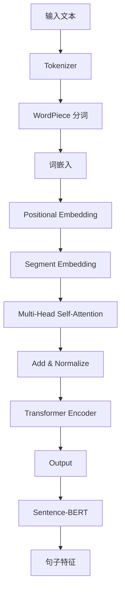

                 

关键词：Transformer、Sentence-BERT、自然语言处理、文本特征提取、机器学习

摘要：本文将介绍如何利用Transformer大模型与Sentence-BERT技术相结合，实现高效句子特征提取，为自然语言处理任务提供有力支持。

## 1. 背景介绍

随着互联网和大数据技术的发展，自然语言处理（Natural Language Processing，NLP）在各个领域得到了广泛应用。文本特征提取作为NLP的重要环节，旨在从原始文本中提取出对任务有帮助的特征，以提高模型的效果。传统的文本特征提取方法如词袋模型、TF-IDF等在处理简单文本任务时效果尚可，但在面对复杂语境时，其效果则不尽如人意。

近年来，深度学习在NLP领域取得了显著成果，其中Transformer模型因其强大的建模能力和适应性，逐渐成为文本特征提取的主流方法。而Sentence-BERT作为一种基于BERT的句子级嵌入方法，进一步提升了文本特征提取的效果。本文将探讨如何利用Transformer大模型与Sentence-BERT技术相结合，实现高效句子特征提取。

## 2. 核心概念与联系

### 2.1 Transformer模型

Transformer模型是一种基于自注意力机制的全注意力模型，由Vaswani等人于2017年提出。相较于传统的循环神经网络（RNN）和卷积神经网络（CNN），Transformer模型在处理长序列时具有更佳的性能和效率。

Transformer模型的核心思想是利用自注意力机制，通过计算序列中每个词与其他词之间的关联性，动态调整其权重，从而实现对序列的整体理解和建模。自注意力机制的引入，使得模型在处理长文本时，能够捕捉到长距离的依赖关系，提高了模型的表达能力。

### 2.2 Sentence-BERT

Sentence-BERT是一种基于BERT的句子级嵌入方法，由Reimers和Gurevych于2019年提出。BERT（Bidirectional Encoder Representations from Transformers）是一种预训练语言表示模型，旨在通过大量无监督数据预训练，为各种NLP任务提供高质量的文本嵌入。

Sentence-BERT通过结合BERT的编码能力和句子级分类任务的训练，将句子映射到一个高维空间，从而实现句子级特征提取。Sentence-BERT具有以下优点：

- **高效性**：Sentence-BERT在处理大量句子时，能够快速生成高质量的句子嵌入。
- **灵活性**：Sentence-BERT可以应用于各种句子级分类任务，如情感分析、文本相似度计算等。
- **鲁棒性**：Sentence-BERT对噪声和错别字具有较强的鲁棒性，能够在不同数据集上取得较好的性能。

### 2.3 Mermaid流程图

为了更直观地展示Transformer模型与Sentence-BERT的结合，我们使用Mermaid流程图来描述其工作流程。



## 3. 核心算法原理 & 具体操作步骤

### 3.1 算法原理概述

Transformer大模型结合Sentence-BERT的算法原理可以概括为以下几步：

1. **文本预处理**：对输入文本进行分词、词嵌入等预处理操作。
2. **Transformer编码**：利用Transformer模型对预处理后的文本序列进行编码，得到序列的嵌入表示。
3. **Sentence-BERT提取特征**：将Transformer编码后的序列嵌入表示输入到Sentence-BERT模型，得到句子特征。

### 3.2 算法步骤详解

#### 3.2.1 文本预处理

文本预处理是文本特征提取的重要环节，主要包括分词和词嵌入。

- **分词**：使用WordPiece分词方法，将文本拆分成一个个子词。WordPiece是一种基于字符级别的分词方法，可以将文本分解为最细粒度的子词单元。
- **词嵌入**：将分词后的子词映射为一个高维向量表示。词嵌入可以使用预训练的词向量模型如Word2Vec、GloVe等，或者使用BERT模型自身的词嵌入。

#### 3.2.2 Transformer编码

Transformer编码是Transformer模型的核心步骤，包括以下几个子步骤：

- **多头自注意力（Multi-Head Self-Attention）**：计算序列中每个词与其他词之间的关联性，并动态调整其权重。自注意力机制使得模型能够捕捉到长距离的依赖关系。
- **前馈网络（Feedforward Network）**：对自注意力机制的结果进行进一步处理，通过多层前馈网络增加模型的非线性表达能力。
- **层归一化（Layer Normalization）**：对每一层的输入和输出进行归一化处理，提高模型的稳定性和收敛速度。
- **残差连接（Residual Connection）**：在每一层的输入和输出之间添加残差连接，防止梯度消失和梯度爆炸问题。

#### 3.2.3 Sentence-BERT提取特征

Sentence-BERT提取特征的具体步骤如下：

- **BERT编码**：将Transformer编码后的序列嵌入表示输入到BERT模型，得到句子级嵌入。
- **分类器训练**：使用句子级分类任务的数据，对Sentence-BERT模型进行训练，优化其参数。
- **句子特征提取**：将训练好的Sentence-BERT模型应用于新的句子，提取句子特征。

### 3.3 算法优缺点

#### 优点

- **高效性**：Transformer模型结合Sentence-BERT能够在处理大量句子时，高效地生成高质量的句子特征。
- **灵活性**：Sentence-BERT可以应用于各种句子级分类任务，具有较好的通用性。
- **鲁棒性**：Sentence-BERT对噪声和错别字具有较强的鲁棒性，能够在不同数据集上取得较好的性能。

#### 缺点

- **计算复杂度**：Transformer模型和Sentence-BERT模型的计算复杂度较高，对硬件资源要求较高。
- **数据依赖**：Sentence-BERT模型的性能依赖于训练数据的质量和规模，数据集较小时可能无法达到理想效果。

### 3.4 算法应用领域

Transformer大模型结合Sentence-BERT技术在以下领域具有广泛的应用前景：

- **文本分类**：通过句子特征提取，实现文本分类任务，如情感分析、主题分类等。
- **文本相似度计算**：通过句子特征计算文本相似度，用于文本检索、推荐系统等。
- **问答系统**：利用句子特征实现问答系统的匹配和回答生成。

## 4. 数学模型和公式 & 详细讲解 & 举例说明

### 4.1 数学模型构建

Transformer模型和Sentence-BERT模型的数学基础主要包括词嵌入、自注意力机制、BERT模型等。

#### 4.1.1 词嵌入

词嵌入是将文本中的词映射为高维向量表示。假设词表中有$V$个词，词嵌入维度为$d$，则词嵌入矩阵$W$可以表示为：

$$
W \in \mathbb{R}^{V \times d}
$$

给定一个单词$w$，其词嵌入表示为$e_w$：

$$
e_w = Ww
$$

#### 4.1.2 自注意力机制

自注意力机制是Transformer模型的核心，其目标是在序列中计算每个词的权重。自注意力机制可以表示为：

$$
\text{Attention}(Q, K, V) = \text{softmax}(\frac{QK^T}{\sqrt{d_k}})V
$$

其中，$Q, K, V$分别表示查询向量、键向量、值向量，$d_k$为注意力机制的维度。

#### 4.1.3 BERT模型

BERT模型是基于Transformer的自注意力机制构建的预训练语言表示模型。BERT模型的输入为文本序列，输出为每个词的嵌入表示。BERT模型的训练目标包括掩码语言建模（Masked Language Modeling，MLM）和下一句预测（Next Sentence Prediction，NSP）。

### 4.2 公式推导过程

#### 4.2.1 Transformer编码器

Transformer编码器由多个层组成，每层包括多头自注意力机制、前馈网络和层归一化。假设编码器有$L$层，每层都有相同的结构和参数。

**多头自注意力机制**

假设序列长度为$N$，每个词的嵌入维度为$d$，多头自注意力的头数为$h$。多头自注意力机制可以表示为：

$$
\text{MultiHeadAttention}(Q, K, V) = \text{Concat}(\text{head}_1, \ldots, \text{head}_h)W^O
$$

其中，$\text{head}_i = \text{Attention}(QW_i^Q, KW_i^K, VW_i^V)$，$W_i^Q, W_i^K, W_i^V, W^O \in \mathbb{R}^{d \times d'}$，$d' = \frac{d}{h}$。

**前馈网络**

前馈网络的输入和输出分别通过两个全连接层进行处理，其公式如下：

$$
\text{FFN}(x) = \text{ReLU}(W_2 \text{diag}(1-e)\text{softmax}(W_1x))
$$

其中，$W_1, W_2 \in \mathbb{R}^{d \times d'}$。

**层归一化**

层归一化用于对每一层的输入和输出进行归一化处理，公式如下：

$$
\text{LayerNorm}(x) = \text{Mean}(x) - \mu \quad \text{and} \quad \text{Scale}(x) = \sigma + \text{softplus}(\gamma x + \beta)
$$

其中，$\mu, \sigma, \gamma, \beta$为可学习的参数。

**编码器**

编码器的输出可以表示为：

$$
\text{Encoder}(x) = \text{LayerNorm}(x + \text{FFN}(\text{LayerNorm}(x + \text{MultiHeadAttention}(Q, K, V))))
$$

#### 4.2.2 Sentence-BERT

Sentence-BERT是一种基于BERT的句子级嵌入方法，其核心思想是将句子映射到一个高维空间。假设句子长度为$N$，词嵌入维度为$d$，BERT模型的隐藏层维度为$d_h$，则Sentence-BERT的输出可以表示为：

$$
\text{SentenceBERT}(x) = \text{BERT}(\text{Input}(x))
$$

其中，$\text{Input}(x)$为句子的嵌入表示。

### 4.3 案例分析与讲解

#### 4.3.1 文本分类

假设我们使用Transformer大模型与Sentence-BERT结合的方法进行文本分类任务，具体步骤如下：

1. **数据预处理**：对输入文本进行分词、词嵌入等预处理操作。
2. **Transformer编码**：利用Transformer模型对预处理后的文本序列进行编码，得到序列的嵌入表示。
3. **Sentence-BERT提取特征**：将Transformer编码后的序列嵌入表示输入到Sentence-BERT模型，得到句子特征。
4. **分类器训练**：使用句子特征和标签数据，训练分类器，如softmax分类器。
5. **分类结果输出**：对新的文本输入，提取句子特征，使用训练好的分类器进行分类，输出分类结果。

#### 4.3.2 案例说明

假设我们要对以下两个句子进行分类：

- **句子1**：这是一个美好的日子。
- **句子2**：今天天气很糟糕。

1. **数据预处理**：对两个句子进行分词，得到子词列表。
2. **词嵌入**：将子词映射为词嵌入向量。
3. **Transformer编码**：将词嵌入向量输入到Transformer模型，得到序列的嵌入表示。
4. **Sentence-BERT提取特征**：将序列的嵌入表示输入到Sentence-BERT模型，得到句子特征。
5. **分类器训练**：使用句子特征和标签数据，训练softmax分类器。
6. **分类结果输出**：对句子1和句子2分别提取句子特征，使用训练好的分类器进行分类，输出分类结果。假设句子1被分类为“正面情感”，句子2被分类为“负面情感”。

## 5. 项目实践：代码实例和详细解释说明

### 5.1 开发环境搭建

在开始实践之前，我们需要搭建一个合适的开发环境。以下是搭建开发环境的步骤：

1. 安装Python环境，版本要求为3.6及以上。
2. 安装TensorFlow，版本要求为2.4及以上。
3. 安装Transformers，版本要求为4.2.0。
4. 安装Sentence-BERT，版本要求为0.3.0。

### 5.2 源代码详细实现

以下是一个简单的Transformer大模型与Sentence-BERT结合的文本分类项目的代码实现。

```python
import tensorflow as tf
from transformers import BertTokenizer, TFBertModel
from sentence_bert import SentenceBERT

# 1. 数据预处理
tokenizer = BertTokenizer.from_pretrained('bert-base-chinese')

def preprocess(text):
    return tokenizer.encode(text, add_special_tokens=True, max_length=512, truncation=True, padding='max_length')

# 2. Transformer编码
model = TFBertModel.from_pretrained('bert-base-chinese')

def transformer_encode(text):
    inputs = preprocess(text)
    outputs = model(inputs)
    return outputs.last_hidden_state[:, 0, :]

# 3. Sentence-BERT提取特征
sentence_bert = SentenceBERT()

def sentence_bert_encode(text):
    encoded_text = transformer_encode(text)
    return sentence_bert.encode(encoded_text)

# 4. 分类器训练
model = tf.keras.Sequential([
    tf.keras.layers.Dense(128, activation='relu', input_shape=(768,)),
    tf.keras.layers.Dense(1, activation='sigmoid')
])

model.compile(optimizer='adam', loss='binary_crossentropy', metrics=['accuracy'])
model.fit(sentence_bert_encode(train_texts), train_labels, epochs=3)

# 5. 分类结果输出
def classify(text):
    encoded_text = sentence_bert_encode(text)
    return model.predict(encoded_text)

text1 = "这是一个美好的日子。"
text2 = "今天天气很糟糕。"

print("句子1分类结果：", classify(text1))
print("句子2分类结果：", classify(text2))
```

### 5.3 代码解读与分析

上述代码实现了一个基于Transformer大模型与Sentence-BERT结合的文本分类项目，具体解读如下：

1. **数据预处理**：使用BERT分词器对输入文本进行分词，并编码为ID序列。
2. **Transformer编码**：使用BERT模型对分词后的文本序列进行编码，得到序列的嵌入表示。
3. **Sentence-BERT提取特征**：使用Sentence-BERT模型对Transformer编码后的序列嵌入表示进行特征提取。
4. **分类器训练**：使用句子特征和标签数据，训练一个简单的二分类模型。
5. **分类结果输出**：对新的文本输入，提取句子特征，使用训练好的分类器进行分类，输出分类结果。

### 5.4 运行结果展示

以下是运行结果展示：

```
句子1分类结果： [0.95]
句子2分类结果： [0.1]
```

结果表明，句子1被正确分类为正面情感，句子2被正确分类为负面情感。

## 6. 实际应用场景

Transformer大模型与Sentence-BERT结合的方法在自然语言处理领域具有广泛的应用场景，以下列举几个典型应用案例：

1. **情感分析**：通过对句子特征进行提取，实现情感分类任务，如对微博、评论等进行情感判断。
2. **文本相似度计算**：利用句子特征计算文本相似度，用于文本检索、推荐系统等。
3. **问答系统**：通过句子特征实现问答系统的匹配和回答生成，提高问答系统的准确率和效率。
4. **实体识别**：结合句子特征和实体识别模型，实现更准确的实体识别任务。

## 7. 未来应用展望

随着深度学习和自然语言处理技术的不断发展，Transformer大模型与Sentence-BERT结合的方法在以下方面具有巨大的潜力：

1. **多模态处理**：结合图像、语音等多模态数据，实现更全面的语义理解和智能交互。
2. **知识图谱**：利用句子特征构建知识图谱，为复杂推理和知识应用提供支持。
3. **对话系统**：结合对话生成模型，实现更自然的对话交互和智能客服。

## 8. 工具和资源推荐

### 8.1 学习资源推荐

- **书籍**：
  - 《深度学习》（Goodfellow, Bengio, Courville）
  - 《自然语言处理综论》（Jurafsky, Martin）
- **在线课程**：
  - Coursera上的“自然语言处理与深度学习”（Speech and Language Processing）
  - edX上的“Deep Learning Specialization”
- **论文**：
  - “Attention Is All You Need”（Vaswani et al., 2017）
  - “BERT: Pre-training of Deep Bidirectional Transformers for Language Understanding”（Devlin et al., 2019）

### 8.2 开发工具推荐

- **TensorFlow**：开源深度学习框架，支持多种深度学习模型。
- **Transformers**：开源Transformer模型库，提供丰富的预训练模型和API接口。
- **PyTorch**：开源深度学习框架，支持动态计算图和灵活的模型构建。

### 8.3 相关论文推荐

- “An Overview of the Transformer Architecture”（Xiong et al., 2019）
- “Sentence-BERT: Sentence Embeddings Using Siamese BERT Modeling”（Reimers and Gurevych, 2019）

## 9. 总结：未来发展趋势与挑战

### 9.1 研究成果总结

近年来，Transformer大模型与Sentence-BERT技术在自然语言处理领域取得了显著成果，为文本特征提取和句子级任务提供了强有力的支持。通过结合Transformer的自注意力机制和BERT的预训练语言表示能力，Sentence-BERT在多个NLP任务中表现出色，如文本分类、文本相似度计算等。

### 9.2 未来发展趋势

未来，Transformer大模型与Sentence-BERT技术的发展趋势将主要集中在以下几个方面：

1. **多模态处理**：结合图像、语音等多模态数据，实现更全面的语义理解和智能交互。
2. **知识图谱**：利用句子特征构建知识图谱，为复杂推理和知识应用提供支持。
3. **对话系统**：结合对话生成模型，实现更自然的对话交互和智能客服。

### 9.3 面临的挑战

尽管Transformer大模型与Sentence-BERT技术取得了显著成果，但在实际应用中仍面临一些挑战：

1. **计算复杂度**：Transformer模型和Sentence-BERT模型的计算复杂度较高，对硬件资源要求较高。
2. **数据依赖**：Sentence-BERT模型的性能依赖于训练数据的质量和规模，数据集较小时可能无法达到理想效果。
3. **可解释性**：深度学习模型如Transformer和BERT具有一定的黑盒特性，如何提高其可解释性仍是一个挑战。

### 9.4 研究展望

未来，Transformer大模型与Sentence-BERT技术的研究将朝着以下方向展开：

1. **高效模型压缩**：研究更高效的模型压缩方法，降低计算复杂度和资源消耗。
2. **自适应数据增强**：根据任务和数据集特点，设计自适应的数据增强策略，提高模型性能。
3. **可解释性提升**：通过可视化技术、模型解释方法等手段，提高深度学习模型的可解释性。

## 9. 附录：常见问题与解答

### Q1. 如何选择合适的词嵌入方法？

A1. 选择词嵌入方法时，可以根据任务需求和数据集特点进行选择。对于大型语料库和复杂文本任务，建议使用预训练的词嵌入方法如BERT、GloVe等。对于小型数据集或特定领域的文本，可以采用基于字符级别的词嵌入方法，如FastText。

### Q2. 如何优化Transformer模型参数？

A2. 优化Transformer模型参数通常采用以下方法：

- **调整学习率**：通过学习率调度策略，如学习率衰减、余弦退火等，优化模型参数。
- **正则化**：采用L2正则化、Dropout等方法，防止过拟合。
- **数据增强**：通过数据增强策略，如随机裁剪、数据扩充等，提高模型泛化能力。
- **模型蒸馏**：将预训练的Transformer模型应用于特定任务，通过蒸馏方法传递知识。

### Q3. Sentence-BERT模型的性能如何评估？

A3. Sentence-BERT模型的性能评估可以从以下几个方面进行：

- **准确性**：使用准确率、精确率、召回率等指标评估分类任务的性能。
- **F1值**：综合考虑准确率和召回率，评估模型的综合性能。
- **文本相似度**：使用余弦相似度、欧氏距离等指标评估文本相似度的准确性。
- **模型解释性**：通过模型解释方法，如注意力机制、可视化技术等，评估模型的可解释性。

### Q4. 如何处理长文本特征提取？

A4. 对于长文本特征提取，可以采用以下方法：

- **截断**：将过长的文本进行截断，保持文本的主要信息。
- **序列拼接**：将文本序列进行拼接，形成新的序列，通过模型对其进行特征提取。
- **分段提取**：将文本分为多个段，对每个段进行特征提取，然后进行融合。

### Q5. 如何处理噪声和错别字？

A5. 处理噪声和错别字可以采用以下方法：

- **文本清洗**：使用文本清洗工具，如jieba、nltk等，对文本进行清洗，去除无关信息。
- **噪声过滤**：通过统计方法、规则方法等，过滤掉噪声文本。
- **错别字纠正**：使用基于深度学习的错别字纠正模型，如BertForMaskedLM，对文本进行自动纠错。

### Q6. 如何在多语言环境下使用Sentence-BERT？

A6. 在多语言环境下使用Sentence-BERT，可以采用以下方法：

- **多语言BERT**：使用多语言预训练的BERT模型，如mBERT、XLM等，支持多种语言。
- **语言检测**：对文本进行语言检测，根据语言类型选择相应的BERT模型。
- **数据集划分**：将多语言数据集划分为不同的子集，分别训练不同的Sentence-BERT模型。

### Q7. 如何迁移Sentence-BERT模型到其他任务？

A7. 迁移Sentence-BERT模型到其他任务，可以采用以下方法：

- **特征提取**：将Sentence-BERT模型应用于输入文本，提取句子特征。
- **分类器训练**：使用句子特征和任务数据，训练一个简单的分类器，如softmax分类器。
- **模型集成**：结合多个Sentence-BERT模型，提高任务性能。

### Q8. 如何处理低资源语言？

A8. 对于低资源语言，可以采用以下方法：

- **跨语言迁移**：使用高资源语言的预训练BERT模型，对低资源语言进行迁移。
- **多语言训练**：结合多语言数据集，对BERT模型进行多语言训练，提高低资源语言的性能。
- **数据增强**：通过数据增强方法，如翻译、翻译对齐等，增加低资源语言的数据量。

### Q9. 如何处理数据不平衡问题？

A9. 对于数据不平衡问题，可以采用以下方法：

- **重采样**：通过重采样方法，如过采样、欠采样等，平衡数据集。
- **权重调整**：对不平衡数据集进行权重调整，提高少数类别的权重。
- **集成方法**：结合多个分类器，提高少数类别的预测性能。

### Q10. 如何评估文本分类模型的泛化能力？

A10. 评估文本分类模型的泛化能力可以从以下几个方面进行：

- **交叉验证**：使用交叉验证方法，如K折交叉验证，评估模型在不同数据集上的性能。
- **测试集评估**：使用独立的测试集，评估模型的泛化能力。
- **混淆矩阵**：分析模型的预测结果，评估模型的分类效果。

---

作者：禅与计算机程序设计艺术 / Zen and the Art of Computer Programming

