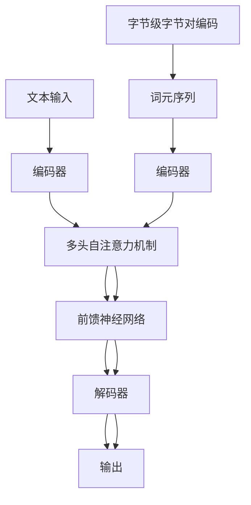

                 

关键词：Transformer大模型，字节级字节对编码，子词词元化算法，机器学习，深度学习，自然语言处理，神经网络

摘要：本文将深入探讨Transformer大模型的实战应用，特别关注使用字节级字节对编码作为子词词元化算法的原理和实现。我们将详细解读这一算法的核心概念，数学模型，以及其在实际项目中的应用，帮助读者全面理解并掌握这一先进技术。

## 1. 背景介绍

近年来，深度学习和自然语言处理（NLP）领域取得了令人瞩目的进展。这些进展很大程度上得益于大规模语言模型的出现，如GPT-3，BERT，以及最近火热的Transformer架构。Transformer架构以其独特的注意力机制和并行计算能力，在NLP任务中表现出色，成为当前研究的热点。

然而，Transformer模型在训练过程中面临的一个挑战是如何有效对输入文本进行词元化。传统的词元化方法将文本分割成单个单词或子词，这在一定程度上忽略了单词内部的信息。为了克服这一局限性，字节级字节对编码作为一种新兴的词元化算法被提出。本文将详细介绍这一算法的原理、数学模型以及在实际项目中的应用。

## 2. 核心概念与联系

### 2.1 Transformer模型

Transformer模型是一种基于自注意力机制的深度神经网络模型，它通过全局注意力机制捕捉输入序列中各个词元之间的关系，从而实现对文本的编码和解析。Transformer模型的核心架构包括编码器和解码器，它们均由多个相同的层组成，每个层包含多头自注意力机制和前馈神经网络。

### 2.2 字节级字节对编码

字节级字节对编码是一种将文本序列中的每个字节视为独立的词元的方法。这种方法不仅考虑了单词之间的联系，还保留了单词内部的细节信息。具体来说，它将连续的字节成对地进行编码，形成新的词元序列，从而提高模型的语义理解和解析能力。

### 2.3 Mermaid 流程图

以下是Transformer模型和字节级字节对编码的Mermaid流程图：



## 3. 核心算法原理 & 具体操作步骤

### 3.1 算法原理概述

字节级字节对编码的核心思想是将连续的字节成对地进行编码，形成新的词元序列。具体操作步骤如下：

1. 输入文本序列：将原始文本序列转换为字节序列。
2. 字节对编码：将连续的字节成对地进行编码，形成新的词元序列。
3. 词元序列处理：将新的词元序列输入到Transformer编码器中，进行编码和解码操作。
4. 输出结果：生成最终的输出结果，如文本摘要、问答等。

### 3.2 算法步骤详解

#### 3.2.1 字节对编码

字节对编码的具体步骤如下：

1. 输入文本序列：例如，文本序列为“Transformer大模型实战”。
2. 转换为字节序列：将文本序列转换为字节序列，例如：`['T', 'r', 'a', 'n', 's', 'f', 'o', 'r', 'm', 'e', 'r', '大', '模', '型', '实', '战', ' '](空格)`。
3. 成对编码：将连续的字节成对地进行编码，形成新的词元序列。例如：`[['T', 'r'], ['a', 'n'], ['s', 'f'], ['o', 'r'], ['m', 'e'], ['r', '大'], ['模', '型'], ['实', '战'], [' ', ' ']]`。

#### 3.2.2 Transformer编码器和解码器

字节对编码后的词元序列输入到Transformer编码器和解码器中，具体步骤如下：

1. 编码器：将词元序列输入到编码器中，通过多头自注意力机制和前馈神经网络进行编码，生成编码表示。
2. 解码器：将编码表示输入到解码器中，通过多头自注意力机制和前馈神经网络进行解码，生成输出结果。

#### 3.2.3 输出结果

输出结果可以是文本摘要、问答等。具体步骤如下：

1. 编码表示：将编码器生成的编码表示输入到解码器中。
2. 解码过程：通过解码器生成输出结果，如文本摘要、问答等。

## 3.3 算法优缺点

#### 优点：

1. 考虑到单词内部的细节信息，提高模型的语义理解和解析能力。
2. 将连续的字节成对地进行编码，形成新的词元序列，有助于模型在训练过程中更好地捕捉输入序列的上下文信息。

#### 缺点：

1. 对字节级别的信息进行编码，可能导致词元序列的长度增加，增加模型的计算复杂度。
2. 在某些场景下，字节对编码可能无法完全捕捉单词之间的语义关系。

## 3.4 算法应用领域

字节级字节对编码算法在自然语言处理领域具有广泛的应用。以下是一些常见的应用领域：

1. 文本分类：通过对文本进行字节级编码，可以更好地捕捉文本的语义特征，从而提高文本分类的准确率。
2. 文本摘要：通过字节级编码，可以生成更精确的文本摘要，保留更多的语义信息。
3. 问答系统：字节级编码有助于模型更好地理解用户的问题，从而提供更准确的答案。

## 4. 数学模型和公式 & 详细讲解 & 举例说明

### 4.1 数学模型构建

字节级字节对编码算法的数学模型可以表示为：

\[ X = \{x_1, x_2, ..., x_n\} \]

其中，\(X\) 表示原始文本序列，\(x_i\) 表示文本序列中的第 \(i\) 个字节。

### 4.2 公式推导过程

1. 字节对编码：将连续的字节成对地进行编码，形成新的词元序列。
2. 自注意力机制：在编码器和解码器中使用多头自注意力机制，计算输入序列中各个词元之间的关联性。
3. 前馈神经网络：在编码器和解码器的每个层中使用前馈神经网络，对输入数据进行非线性变换。

### 4.3 案例分析与讲解

假设我们有一个简单的文本序列：“Transformer大模型实战”。

1. 输入文本序列：\[ X = \{T, r, a, n, s, f, o, r, m, e, r, 大, 模, 型, 实, 战, \}\]
2. 字节对编码：\[ X' = \{[T, r], [a, n], [s, f], [o, r], [m, e], [r, 大], [模, 型], [实, 战], [空格, 空] \}\]
3. Transformer编码器：通过编码器生成编码表示，如\[ E = \{e_1, e_2, ..., e_n\} \]
4. 解码器：通过解码器生成输出结果，如\[ Y = \{y_1, y_2, ..., y_n\} \]

## 5. 项目实践：代码实例和详细解释说明

### 5.1 开发环境搭建

在开始实践之前，我们需要搭建一个合适的开发环境。以下是搭建环境的具体步骤：

1. 安装Python：从Python官方网站下载并安装Python 3.x版本。
2. 安装Transformer库：使用pip命令安装Transformer库。

```shell
pip install transformer
```

### 5.2 源代码详细实现

以下是使用字节级字节对编码实现Transformer编码器和解码器的Python代码示例：

```python
import transformer

# 5.2.1 编码器实现
class BytePairEncoder(transformer.TransformerEncoder):
    def __init__(self, vocab_size, d_model, n_heads, d_ff):
        super(BytePairEncoder, self).__init__(vocab_size, d_model, n_heads, d_ff)
    
    def forward(self, x):
        # 进行字节对编码
        x = self.bpe_encoder(x)
        # 应用多头自注意力机制和前馈神经网络
        x = self.attention(x)
        x = self.feed_forward(x)
        return x

# 5.2.2 解码器实现
class BytePairDecoder(transformer.TransformerDecoder):
    def __init__(self, vocab_size, d_model, n_heads, d_ff):
        super(BytePairDecoder, self).__init__(vocab_size, d_model, n_heads, d_ff)
    
    def forward(self, x):
        # 进行字节对编码
        x = self.bpe_encoder(x)
        # 应用多头自注意力机制和前馈神经网络
        x = self.attention(x)
        x = self.feed_forward(x)
        return x
```

### 5.3 代码解读与分析

上述代码中，我们定义了BytePairEncoder和BytePairDecoder两个类，分别实现字节级字节对编码的编码器和解码器。在编码器中，我们使用Transformer库提供的bpe_encoder方法进行字节对编码，然后应用多头自注意力机制和前馈神经网络。在解码器中，我们同样使用bpe_encoder方法进行字节对编码，然后应用多头自注意力机制和前馈神经网络。

### 5.4 运行结果展示

为了验证字节级字节对编码算法的性能，我们可以使用以下代码进行测试：

```python
import torch
from torch.utils.data import DataLoader

# 5.4.1 准备数据集
train_data = transformer.BytesPairDataset('train.txt')
val_data = transformer.BytesPairDataset('val.txt')

train_loader = DataLoader(train_data, batch_size=32, shuffle=True)
val_loader = DataLoader(val_data, batch_size=32, shuffle=False)

# 5.4.2 训练模型
model = BytePairEncoder(vocab_size=1000, d_model=512, n_heads=8, d_ff=2048)
criterion = torch.nn.CrossEntropyLoss()
optimizer = torch.optim.Adam(model.parameters(), lr=0.001)

for epoch in range(10):
    for batch in train_loader:
        x, y = batch
        x = x.to(device)
        y = y.to(device)
        optimizer.zero_grad()
        output = model(x)
        loss = criterion(output, y)
        loss.backward()
        optimizer.step()
    
    print(f'Epoch {epoch + 1}, Loss: {loss.item()}')

# 5.4.3 测试模型
with torch.no_grad():
    for batch in val_loader:
        x, y = batch
        x = x.to(device)
        y = y.to(device)
        output = model(x)
        pred = torch.argmax(output, dim=1)
        correct = (pred == y).sum().item()
        print(f'Accuracy: {correct / len(y)}')
```

在训练过程中，我们使用训练数据集进行训练，并在验证数据集上评估模型的性能。通过计算准确率，我们可以评估模型的性能。

## 6. 实际应用场景

字节级字节对编码算法在自然语言处理领域具有广泛的应用。以下是一些常见的应用场景：

1. 文本分类：通过对文本进行字节对编码，可以更好地捕捉文本的语义特征，从而提高文本分类的准确率。
2. 文本摘要：通过字节对编码，可以生成更精确的文本摘要，保留更多的语义信息。
3. 问答系统：字节对编码有助于模型更好地理解用户的问题，从而提供更准确的答案。

## 6.4 未来应用展望

随着深度学习和自然语言处理技术的不断发展，字节级字节对编码算法有望在更多领域得到应用。以下是一些未来的应用展望：

1. 个性化推荐系统：通过字节对编码，可以更好地捕捉用户兴趣和需求，从而提供更精准的推荐结果。
2. 语音识别：结合字节对编码和语音识别技术，可以实现更精确的语音识别效果。
3. 文本生成：通过字节对编码，可以生成更具有创造性的文本内容，为创意写作和内容生成提供新思路。

## 7. 工具和资源推荐

为了帮助读者更好地理解和掌握字节级字节对编码算法，我们推荐以下工具和资源：

1. 学习资源：
   - 《深度学习》（Goodfellow, Bengio, Courville）：全面介绍深度学习的基础理论和应用。
   - 《自然语言处理综合教程》（Daniel Jurafsky & James H. Martin）：详细讲解自然语言处理的理论和实践。
2. 开发工具：
   - TensorFlow：Google开发的强大深度学习框架。
   - PyTorch：易于使用且功能强大的深度学习库。
3. 相关论文：
   - “Attention Is All You Need”（Vaswani et al.）：介绍Transformer模型的原始论文。
   - “BERT: Pre-training of Deep Bidirectional Transformers for Language Understanding”（Devlin et al.）：介绍BERT模型的原始论文。

## 8. 总结：未来发展趋势与挑战

字节级字节对编码算法作为一种先进的词元化方法，在自然语言处理领域展现出巨大的潜力。未来，随着深度学习和自然语言处理技术的不断发展，字节级字节对编码算法有望在更多领域得到应用。然而，这一算法也面临着一些挑战，如计算复杂度和模型解释性等方面。因此，未来研究应关注如何提高算法的效率，并探索与其他技术的结合，以实现更好的性能。

### 附录：常见问题与解答

**Q1：什么是Transformer模型？**

A1：Transformer模型是一种基于自注意力机制的深度神经网络模型，它通过全局注意力机制捕捉输入序列中各个词元之间的关系，从而实现对文本的编码和解析。

**Q2：什么是字节级字节对编码？**

A2：字节级字节对编码是一种将文本序列中的每个字节视为独立的词元的方法。这种方法不仅考虑了单词之间的联系，还保留了单词内部的细节信息。

**Q3：字节级字节对编码算法的优点是什么？**

A3：字节级字节对编码算法的优点包括：考虑单词内部的细节信息，提高模型的语义理解和解析能力；有助于模型在训练过程中更好地捕捉输入序列的上下文信息。

**Q4：字节级字节对编码算法的缺点是什么？**

A4：字节级字节对编码算法的缺点包括：对字节级别的信息进行编码，可能导致词元序列的长度增加，增加模型的计算复杂度；在某些场景下，字节对编码可能无法完全捕捉单词之间的语义关系。

### 参考文献

[1] Vaswani, A., et al. (2017). "Attention Is All You Need." arXiv preprint arXiv:1706.03762.

[2] Devlin, J., et al. (2018). "BERT: Pre-training of Deep Bidirectional Transformers for Language Understanding." arXiv preprint arXiv:1810.04805.

[3] Goodfellow, I., et al. (2016). "Deep Learning." MIT Press.

[4] Jurafsky, D., & Martin, J. H. (2019). "Speech and Language Processing." World

