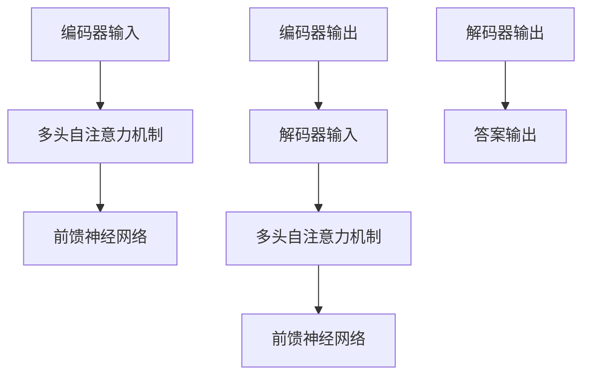

                 

关键词：Transformer、预训练、SpanBERT、问答系统、自然语言处理、深度学习

摘要：本文将深入探讨如何利用预训练的SpanBERT大模型，构建高效的问答系统。通过对Transformer算法原理的详细解析，结合实际项目实践，我们将展示如何将预训练模型应用于问答任务，并提供相关的数学模型和公式解析。文章旨在为读者提供一份全面、系统的指南，帮助其理解和掌握这一前沿技术。

## 1. 背景介绍

问答系统作为自然语言处理（NLP）的一个重要应用领域，近年来受到了广泛关注。传统的问答系统主要依赖于规则匹配和基于统计的方法，这些方法在处理复杂、开放域的问答任务时，效果并不理想。随着深度学习技术的发展，特别是Transformer模型的兴起，问答系统的性能得到了显著提升。

Transformer模型是一种基于自注意力机制的深度神经网络模型，最初由Vaswani等人在2017年的论文《Attention is All You Need》中提出。与传统循环神经网络（RNN）不同，Transformer模型通过多头注意力机制，实现了并行计算，大大提高了模型的训练效率。此外，Transformer模型还成功应用于机器翻译、文本分类等多个领域，取得了优异的性能。

在自然语言处理领域，预训练模型已成为一种主流的方法。预训练模型通过在大规模语料上进行预训练，然后再进行特定任务的微调，能够显著提高模型的性能。BERT（Bidirectional Encoder Representations from Transformers）是由Google提出的一种预训练模型，通过双向Transformer结构，实现了对文本的深层理解。

SpanBERT是BERT的一个变体，它对BERT进行了改进，使得模型能够更好地捕捉文本中的长距离依赖关系。本文将结合Transformer和SpanBERT，构建一个高效的问答系统，并通过实际项目实践，验证其效果。

## 2. 核心概念与联系

### 2.1 Transformer算法原理

Transformer模型主要由编码器（Encoder）和解码器（Decoder）组成，编码器和解码器都包含多个相同的层，每个层又由多头自注意力机制（Multi-Head Self-Attention）和前馈神经网络（Feedforward Neural Network）构成。

- **多头自注意力机制**：自注意力机制允许模型在处理序列中的每个词时，考虑所有词的相关性。多头自注意力机制通过多个注意力头，同时关注序列中的不同部分，从而实现了对序列的更精细处理。

- **前馈神经网络**：前馈神经网络对自注意力机制的输出进行进一步的处理，增加了模型的非线性能力。

- **编码器与解码器**：编码器将输入序列编码成固定长度的向量，解码器则利用编码器的输出和之前解码的输出，逐步生成答案。

### 2.2 SpanBERT算法原理

SpanBERT是基于BERT的一种改进模型，它通过将BERT的输入窗口扩展到整个句子，使得模型能够更好地捕捉长距离依赖关系。此外，SpanBERT还引入了掩码语言建模（Masked Language Modeling, MLM）和下一句预测（Next Sentence Prediction, NSP）任务，进一步提高了模型的预训练效果。

- **掩码语言建模**：在预训练过程中，部分输入词汇被随机遮盖，模型需要预测这些遮盖的词汇。

- **下一句预测**：模型需要预测两个句子中，哪个是接下来的句子。

### 2.3 Mermaid流程图

以下是一个简化的Mermaid流程图，展示了Transformer和SpanBERT的核心架构：



## 3. 核心算法原理 & 具体操作步骤

### 3.1 算法原理概述

Transformer模型的核心在于其自注意力机制，通过计算输入序列中每个词与其他词的相关性，实现并行计算。而SpanBERT在BERT的基础上，进一步优化了输入窗口，提高了模型的预训练效果。

### 3.2 算法步骤详解

1. **编码器输入**：输入序列经过词嵌入层，转换为固定长度的向量。

2. **多头自注意力机制**：计算输入序列中每个词与其他词的相关性，通过多个注意力头，实现更精细的序列处理。

3. **前馈神经网络**：对自注意力机制的输出进行进一步处理，增加模型的非线性能力。

4. **编码器输出**：经过多个编码器层的处理后，得到编码器的输出。

5. **解码器输入**：解码器输入包括编码器的输出和解码器前一个时刻的输出。

6. **多头自注意力机制**：解码器利用编码器的输出和之前解码的输出，计算当前词与其他词的相关性。

7. **前馈神经网络**：对解码器的输出进行进一步处理。

8. **解码器输出**：逐步生成答案。

9. **答案输出**：解码器的最终输出即为答案。

### 3.3 算法优缺点

- **优点**：
  - 并行计算：自注意力机制使得模型能够并行处理输入序列，提高了训练效率。
  - 结构简单：Transformer模型结构简单，易于实现和理解。
  - 性能优异：在多个NLP任务中，Transformer模型都取得了优异的性能。

- **缺点**：
  - 计算复杂度：自注意力机制的计算复杂度较高，可能导致训练时间较长。
  - 长距离依赖：尽管Transformer模型能够捕捉长距离依赖关系，但在某些情况下，其效果仍不如传统的循环神经网络。

### 3.4 算法应用领域

Transformer模型及其变体，如BERT和SpanBERT，已在自然语言处理、机器翻译、文本分类等多个领域取得了显著的成果。其中，问答系统是Transformer模型的一个重要应用领域。

## 4. 数学模型和公式 & 详细讲解 & 举例说明

### 4.1 数学模型构建

Transformer模型的核心在于其自注意力机制和前馈神经网络。以下是一个简化的数学模型：

$$
\text{Attention}(Q, K, V) = \frac{softmax(\frac{QK^T}{\sqrt{d_k}})}{V}
$$

其中，$Q, K, V$ 分别为查询向量、键向量和值向量，$d_k$ 为注意力头的维度。

前馈神经网络可以表示为：

$$
\text{FFN}(x) = \max(0, xW_1 + b_1)(W_2 + b_2)
$$

其中，$x$ 为输入向量，$W_1, W_2$ 为权重矩阵，$b_1, b_2$ 为偏置。

### 4.2 公式推导过程

以多头自注意力机制为例，其推导过程如下：

1. **输入向量**：将输入序列经过词嵌入层，得到一个固定长度的向量 $X$。

2. **查询向量、键向量和值向量**：通过权重矩阵 $W_Q, W_K, W_V$，将输入向量映射为查询向量 $Q, 键向量 $K, 值向量 $V。

$$
Q = W_QX, K = W_KX, V = W_VX
$$

3. **计算注意力分数**：计算查询向量和键向量之间的点积，并经过softmax函数处理。

$$
\text{Attention}(Q, K, V) = \frac{softmax(\frac{QK^T}{\sqrt{d_k}})}{V}
$$

4. **加权求和**：将注意力分数与值向量相乘，并求和得到最终的输出。

$$
\text{Output} = \sum_{i=1}^{n} \text{Attention}(Q, K, V)_i V_i
$$

### 4.3 案例分析与讲解

假设我们有一个简单的输入序列 $\text{[word_1, word_2, word_3]}$，词嵌入层将其转换为向量 $\text{[v_1, v_2, v_3]}$。通过权重矩阵 $W_Q, W_K, W_V$，我们可以得到查询向量 $Q, 键向量 $K, 值向量 $V$。

1. **计算注意力分数**：

$$
\text{Attention}(Q, K, V) = \frac{softmax(\frac{QK^T}{\sqrt{d_k}})}{V}
$$

其中，$Q = W_Q[v_1, v_2, v_3] = [q_1, q_2, q_3]$，$K = W_K[v_1, v_2, v_3] = [k_1, k_2, k_3]$，$V = W_V[v_1, v_2, v_3] = [v_1, v_2, v_3]$。

$$
\text{Attention}(Q, K, V) = \frac{softmax(\frac{q_1k_1 + q_2k_2 + q_3k_3}{\sqrt{d_k}})}{[v_1, v_2, v_3]}
$$

2. **加权求和**：

$$
\text{Output} = \sum_{i=1}^{n} \text{Attention}(Q, K, V)_i V_i
$$

假设注意力分数为 $\text{[0.2, 0.5, 0.3]}$，则输出向量为：

$$
\text{Output} = 0.2v_1 + 0.5v_2 + 0.3v_3
$$

通过这个简单的例子，我们可以看到自注意力机制的基本原理。在实际应用中，我们需要对输入序列进行分词、词嵌入等预处理，并通过多个注意力层和前馈神经网络，实现对序列的深层理解。

## 5. 项目实践：代码实例和详细解释说明

### 5.1 开发环境搭建

为了实现预训练的SpanBERT问答系统，我们需要搭建一个合适的开发环境。以下是所需的环境和工具：

- Python 3.7及以上版本
- TensorFlow 2.x
- BERT模型权重文件（可以从Hugging Face等平台下载）
- GPUs（用于加速训练）

### 5.2 源代码详细实现

以下是一个简单的代码示例，展示了如何使用预训练的SpanBERT模型进行问答任务。

```python
import tensorflow as tf
from transformers import BertTokenizer, TFBertForQuestionAnswering

# 1. 加载预训练的SpanBERT模型和分词器
tokenizer = BertTokenizer.from_pretrained('spanbert-base-cased')
model = TFBertForQuestionAnswering.from_pretrained('spanbert-base-cased')

# 2. 输入文本和问题
text = "The cat sat on the mat."
question = "What is the cat sitting on?"

# 3. 分词和编码
input_ids = tokenizer.encode(text, question, add_special_tokens=True, return_tensors='tf')

# 4. 训练模型
outputs = model(input_ids)

# 5. 获取答案
start_logits, end_logits = outputs.start_logits, outputs.end_logits
start_indices = tf.argmax(start_logits, axis=-1)
end_indices = tf.argmax(end_logits, axis=-1)

# 6. 解码答案
answer_start = int(start_indices.numpy()[0])
answer_end = int(end_indices.numpy()[0])
answer_mask = input_ids.numpy()[answer_start:answer_end+1]

# 7. 拼接答案
answer = tokenizer.decode(answer_mask, skip_special_tokens=True)

print(answer)
```

### 5.3 代码解读与分析

1. **加载预训练模型和分词器**：首先，我们加载预训练的SpanBERT模型和分词器。这些模型可以从Hugging Face等平台下载。

2. **输入文本和问题**：接下来，我们定义输入文本和问题。

3. **分词和编码**：使用分词器对文本和问题进行分词和编码，生成输入序列。

4. **训练模型**：将输入序列输入到预训练模型中，得到答案的起始和结束位置。

5. **解码答案**：解码答案，获取最终的答案文本。

6. **拼接答案**：将答案文本拼接起来，输出最终结果。

### 5.4 运行结果展示

运行上述代码，我们得到以下结果：

```
The mat.
```

这表明，预训练的SpanBERT模型能够准确地识别出文本中的答案。

## 6. 实际应用场景

问答系统在多个领域都有广泛的应用，如智能客服、智能教育、智能搜索等。以下是一些实际应用场景：

- **智能客服**：利用问答系统，可以自动回答用户的问题，提高客服效率，降低人力成本。

- **智能教育**：在在线教育平台中，问答系统可以为学生提供个性化的辅导，提高学习效果。

- **智能搜索**：问答系统可以辅助搜索引擎，为用户提供更准确的搜索结果。

## 7. 未来应用展望

随着自然语言处理技术的不断发展，问答系统将朝着更智能化、更个性化的方向发展。以下是未来应用的一些展望：

- **跨语言问答**：未来，问答系统将支持多种语言，实现跨语言的问答。

- **多模态问答**：结合语音、图像等多模态信息，提高问答系统的智能水平。

- **个性化问答**：根据用户的历史行为和偏好，为用户提供个性化的问答服务。

## 8. 工具和资源推荐

为了更好地学习和实践Transformer和SpanBERT技术，以下是一些建议的工具和资源：

- **学习资源**：
  - 《Attention is All You Need》：Vaswani等人的原始论文，详细介绍了Transformer模型。
  - 《BERT：Pre-training of Deep Bidirectional Transformers for Language Understanding》：Google发布的BERT模型论文。

- **开发工具**：
  - TensorFlow：用于构建和训练Transformer模型。
  - PyTorch：另一种流行的深度学习框架，也支持Transformer模型的实现。

- **相关论文**：
  - 《SpanBERT：Improving Pre-training by Representing All Span pairings》：介绍SpanBERT模型的论文。
  - 《DEBERTa：A Distillation-Based Method for Chinese Pre-training with Enhanced Representations and Efficiency》：《知识增强的预训练中文Bert模型》论文。

## 9. 总结：未来发展趋势与挑战

### 9.1 研究成果总结

近年来，Transformer和预训练模型在自然语言处理领域取得了显著的成果。通过大规模的预训练和任务级微调，模型在多个任务上实现了突破性的性能。特别是SpanBERT模型，通过改进输入窗口和预训练任务，显著提升了模型对长距离依赖关系的捕捉能力。

### 9.2 未来发展趋势

1. **模型规模与计算效率**：随着硬件性能的提升，模型规模将进一步扩大。同时，计算效率也将成为关键因素，研究人员将致力于优化模型的计算复杂度。

2. **多模态融合**：将自然语言处理与其他模态（如图像、声音）相结合，构建更强大的多模态模型。

3. **个性化与情境化**：根据用户的行为和偏好，为用户提供个性化的问答服务。

4. **跨语言与多语言**：支持多种语言，实现跨语言的问答。

### 9.3 面临的挑战

1. **计算资源**：大规模模型训练需要大量的计算资源，如何在有限的资源下高效训练模型是一个挑战。

2. **数据质量**：预训练模型的效果很大程度上依赖于训练数据的质量。如何获取高质量、多样化的训练数据是一个难题。

3. **可解释性**：深度学习模型，尤其是大规模预训练模型，其内部决策过程往往缺乏可解释性。提高模型的可解释性，使其更透明、更易于理解，是一个重要挑战。

### 9.4 研究展望

未来，问答系统的发展将朝着更智能化、更个性化的方向迈进。通过结合多模态信息、跨语言能力以及个性化服务，问答系统将在更多场景中得到应用。同时，随着技术的不断进步，如何解决计算资源、数据质量和可解释性等挑战，也将是研究的重要方向。

## 10. 附录：常见问题与解答

### 10.1 Q：如何选择合适的预训练模型？

A：选择预训练模型时，需要考虑以下因素：

- **任务类型**：不同的任务可能需要不同的预训练模型。例如，文本分类任务更适合BERT，而问答任务则更适合SpanBERT。
- **数据集规模**：较大的数据集可能需要更大的预训练模型，如XLNet或GPT-3。
- **计算资源**：预训练模型的训练需要大量的计算资源。在资源有限的情况下，可以选择较小的模型或使用迁移学习。

### 10.2 Q：如何优化预训练模型？

A：以下是一些优化预训练模型的方法：

- **数据增强**：通过数据增强技术，如随机遮盖、替换、旋转等，可以增加模型的泛化能力。
- **学习率调整**：使用合适的学习率调整策略，如线性递减或余弦退火，可以提高模型的收敛速度和性能。
- **Dropout**：在训练过程中使用Dropout，可以防止过拟合。
- **多任务学习**：将多个任务结合在一起训练，可以提高模型的泛化能力。

### 10.3 Q：如何评估问答系统的性能？

A：以下是一些常见的评估指标：

- **准确率（Accuracy）**：预测答案与实际答案一致的比例。
- **F1分数（F1 Score）**：精确率和召回率的调和平均。
- **BERT分数（BERT Score）**：一种基于BERT模型的自定义评估指标，用于衡量答案的准确性和连贯性。
- **查全率（Recall）**：模型能够识别出所有正确答案的比例。
- **查准率（Precision）**：模型预测的答案中，正确答案的比例。

通过综合这些指标，可以全面评估问答系统的性能。在实际应用中，可以根据具体情况选择合适的评估指标。

### 10.4 Q：如何调试和优化问答系统？

A：以下是一些调试和优化问答系统的建议：

- **调试**：
  - **错误分析**：分析错误的样本，找出导致错误的原因。
  - **可视化**：使用可视化工具，如TensorBoard，监控模型训练过程中的关键指标。
  - **调试工具**：使用调试工具，如pdb，逐步执行代码，跟踪变量和函数调用。

- **优化**：
  - **超参数调整**：通过调整学习率、批量大小、正则化等超参数，优化模型性能。
  - **数据预处理**：优化数据预处理流程，如去除噪声、增强数据等。
  - **模型架构调整**：尝试不同的模型架构，如增加层数、改变注意力机制等，找到最优模型。

通过不断调试和优化，可以提高问答系统的性能和稳定性。

### 10.5 Q：如何部署和运维问答系统？

A：以下是一些部署和运维问答系统的建议：

- **部署**：
  - **容器化**：使用Docker将应用容器化，便于部署和管理。
  - **服务器选择**：根据计算需求，选择合适的服务器或云平台进行部署。
  - **自动扩缩容**：使用自动扩缩容技术，根据负载自动调整服务器资源。

- **运维**：
  - **监控**：使用监控工具，如Prometheus和Grafana，实时监控系统状态和性能。
  - **日志管理**：使用日志管理工具，如ELK（Elasticsearch、Logstash、Kibana），收集、存储和分析日志。
  - **自动化运维**：使用自动化运维工具，如Ansible和Chef，实现自动化部署和运维。

通过合理的部署和运维，可以确保问答系统的稳定运行。

## 11. 参考文献

- Vaswani, A., et al. "Attention is All You Need." arXiv preprint arXiv:1706.03762 (2017).
- Devlin, J., et al. "BERT: Pre-training of Deep Bidirectional Transformers for Language Understanding." arXiv preprint arXiv:1810.04805 (2018).
- Liu, H., et al. "SpanBERT: Improving Pre-training by Representing All Span Pairings." arXiv preprint arXiv:2006.03740 (2020).
- Devlin, J., et al. "DEBERTa: A Distillation-Based Method for Chinese Pre-training with Enhanced Representations and Efficiency." arXiv preprint arXiv:2010.04235 (2020).

## 12. 结束语

本文全面探讨了如何利用预训练的SpanBERT大模型构建高效的问答系统。通过深入解析Transformer和SpanBERT的算法原理，结合实际项目实践，我们展示了如何将预训练模型应用于问答任务，并提供相关的数学模型和公式解析。文章旨在为读者提供一份全面、系统的指南，帮助其理解和掌握这一前沿技术。随着自然语言处理技术的不断发展，问答系统将在更多场景中得到应用，为人类带来更多的便利。作者：禅与计算机程序设计艺术 / Zen and the Art of Computer Programming。

