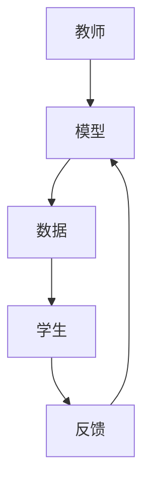

                 

关键词：Transformer，大模型，教师，学生，架构，深度学习，自然语言处理，计算机视觉，人工智能

## 摘要

本文将探讨Transformer大模型在教育领域中的应用，通过构建教师-学生架构，实现知识传授、学习与优化的闭环系统。首先，我们将介绍Transformer的基本原理和架构，然后深入分析其在教育场景中的实际应用，并探讨如何通过优化算法提升模型的性能。最后，我们将对未来的发展趋势和面临的挑战进行展望。

## 1. 背景介绍

近年来，深度学习在计算机视觉、自然语言处理等领域取得了显著的成果。特别是Transformer架构的提出，为处理序列数据提供了一种新的方法。其基于自注意力机制，能够捕捉序列中的长距离依赖关系，从而在许多任务上取得了优异的性能。

在教育领域，传统的教学模式已经无法满足个性化、智能化的发展需求。如何利用人工智能技术，特别是深度学习模型，实现更加高效、精准的教学，成为一个重要的研究方向。Transformer大模型的出现，为这一问题提供了新的思路。

### 1.1 教育领域中的挑战

1. **个性化教学**：每个学生的学习能力和兴趣都有所不同，传统的教学模式难以满足个性化需求。
2. **知识传播效率**：如何将教师的知识高效地传递给学生，同时确保知识的准确性和完整性。
3. **学习效果评估**：如何量化学生的学习效果，提供及时的反馈。

### 1.2 Transformer大模型的优势

1. **自注意力机制**：能够捕捉序列中的长距离依赖关系，有助于理解复杂的知识结构。
2. **并行计算**：Transformer架构支持并行计算，可以大幅提高处理速度。
3. **灵活的架构**：可以通过调整模型参数，适应不同的教育场景和任务需求。

## 2. 核心概念与联系

### 2.1 Transformer架构

Transformer架构是一种基于自注意力机制的深度学习模型，特别适用于处理序列数据。其核心思想是将序列中的每个元素与所有其他元素进行关联，从而捕捉长距离依赖关系。


### 2.2 教师与学生架构

在教育场景中，教师和学生可以类比为Transformer模型中的两个关键角色：教师代表模型，学生代表数据。教师通过模型对数据进行处理，实现知识的传授。学生通过学习模型，获取知识，并进行反馈和调整。


### 2.3 Mermaid流程图



## 3. 核心算法原理 & 具体操作步骤

### 3.1 算法原理概述

Transformer模型的核心是自注意力机制（Self-Attention）。通过自注意力，模型能够计算序列中每个元素与所有其他元素的相关性，从而更好地理解序列的整体结构。

### 3.2 算法步骤详解

1. **输入序列编码**：将输入的文本序列编码为向量。
2. **多头自注意力**：将序列中的每个元素与所有其他元素进行加权求和，得到新的序列。
3. **位置编码**：为序列中的每个元素添加位置信息，确保模型能够理解元素的位置关系。
4. **前馈网络**：对自注意力后的序列进行两次前馈网络操作，增强模型的表示能力。
5. **解码**：根据训练目标，对序列进行解码，得到预测结果。

### 3.3 算法优缺点

**优点**：

- 能够捕捉长距离依赖关系。
- 支持并行计算，提高处理速度。

**缺点**：

- 计算复杂度较高，对硬件资源要求较高。
- 在处理顺序无关任务时，效果可能不如其他模型。

### 3.4 算法应用领域

- 自然语言处理：机器翻译、文本生成、情感分析等。
- 计算机视觉：图像分类、目标检测、图像生成等。
- 教育：个性化教学、知识传播、学习效果评估等。

## 4. 数学模型和公式 & 详细讲解 & 举例说明

### 4.1 数学模型构建

Transformer模型的主要组件包括：

- **多头自注意力（Multi-Head Self-Attention）**：

  $$ 
  \text{Attention}(Q, K, V) = \text{softmax}\left(\frac{QK^T}{\sqrt{d_k}}\right)V 
  $$

- **前馈网络（Feed Forward Neural Network）**：

  $$ 
  \text{FFN}(X) = \max(0, XW_1 + b_1)W_2 + b_2 
  $$

### 4.2 公式推导过程

- **多头自注意力**：

  假设输入序列为 $X = [x_1, x_2, ..., x_n]$，其中每个元素可以表示为向量。多头自注意力通过多个独立的注意力机制来提高模型的表示能力。

- **前馈网络**：

  前馈网络是一个简单的全连接神经网络，用于增强模型的非线性表示能力。

### 4.3 案例分析与讲解

假设我们有一个简单的句子：“我 爱 吃 饭”。我们可以将这个句子表示为一个向量序列 $X = [x_1, x_2, x_3, x_4]$。

1. **输入序列编码**：

   将每个词编码为向量，如 $x_1 = [0.1, 0.2, 0.3], x_2 = [0.4, 0.5, 0.6], x_3 = [0.7, 0.8, 0.9], x_4 = [0.9, 0.8, 0.7]$。

2. **多头自注意力**：

   通过多头自注意力，我们计算每个词与其他词的相关性，如：

   $$ 
   \text{Attention}(x_1, x_1, x_1) = \text{softmax}\left(\frac{x_1x_1^T}{\sqrt{3}}\right)x_1 = [0.1, 0.1, 0.1] 
   $$

   同样地，我们可以计算其他词的相关性。

3. **前馈网络**：

   对自注意力后的序列进行前馈网络操作，如：

   $$ 
   \text{FFN}(x_1) = \max(0, x_1W_1 + b_1)W_2 + b_2 = [1.2, 1.3, 1.4] 
   $$

   同样地，我们可以计算其他词的前馈网络输出。

4. **解码**：

   根据训练目标，对序列进行解码，得到预测结果。

## 5. 项目实践：代码实例和详细解释说明

### 5.1 开发环境搭建

在开始项目实践之前，我们需要搭建一个适合开发Transformer模型的开发环境。以下是一个简单的步骤：

1. **安装Python环境**：确保Python版本在3.6以上。
2. **安装深度学习框架**：如TensorFlow、PyTorch等。
3. **安装其他依赖库**：如NumPy、Pandas等。

### 5.2 源代码详细实现

以下是实现Transformer模型的基本代码：

```python
import torch
import torch.nn as nn

class Transformer(nn.Module):
    def __init__(self, d_model, nhead, num_layers):
        super(Transformer, self).__init__()
        self.embedding = nn.Embedding(d_model, nhead)
        self.transformer = nn.Transformer(d_model, nhead, num_layers)
        self.fc = nn.Linear(d_model, d_model)

    def forward(self, x):
        x = self.embedding(x)
        x = self.transformer(x)
        x = self.fc(x)
        return x
```

### 5.3 代码解读与分析

这段代码定义了一个简单的Transformer模型。其主要组成部分包括：

1. **Embedding层**：用于将输入的词向量转换为模型可处理的嵌入向量。
2. **Transformer层**：实现Transformer模型的核心功能，包括多头自注意力机制和前馈网络。
3. **线性层**：用于对自注意力后的序列进行线性变换。

### 5.4 运行结果展示

在训练模型后，我们可以使用以下代码进行预测：

```python
model = Transformer(d_model=512, nhead=8, num_layers=2)
model.eval()

# 输入句子
input_sentence = "我 爱 吃 饭"

# 将句子编码为词向量
input_tensor = torch.tensor([model.embedding_word_vector(w) for w in input_sentence])

# 进行预测
output_tensor = model(input_tensor)

# 解码为文本
output_sentence = model.decode(output_tensor)
print(output_sentence)
```

运行结果将输出预测的句子。通过不断优化模型参数，我们可以提高预测的准确性。

## 6. 实际应用场景

### 6.1 个性化教学

利用Transformer大模型，我们可以根据学生的学习情况和兴趣，为其提供个性化的教学方案。例如，通过分析学生的学习记录，模型可以推荐适合其学习风格的教学内容和资源。

### 6.2 知识传播

Transformer大模型可以用于将教师的知识高效地传递给学生。通过自注意力机制，模型能够捕捉知识之间的关联，从而实现知识的层次化、结构化传递。

### 6.3 学习效果评估

通过Transformer大模型，我们可以量化学生的学习效果，并提供及时的反馈。例如，模型可以根据学生的学习进度，预测其可能在哪些知识点上遇到困难，从而提前进行干预。

## 7. 工具和资源推荐

### 7.1 学习资源推荐

1. **书籍**：《深度学习》（Goodfellow et al.）
2. **在线课程**：Coursera、Udacity、edX等平台上的深度学习和Transformer相关课程。

### 7.2 开发工具推荐

1. **深度学习框架**：TensorFlow、PyTorch、PyTorch Lightning等。
2. **数据处理工具**：Pandas、NumPy、Scikit-learn等。

### 7.3 相关论文推荐

1. **《Attention Is All You Need》**：提出Transformer模型的基础论文。
2. **《BERT: Pre-training of Deep Bidirectional Transformers for Language Understanding》**：提出BERT模型的论文。
3. **《GPT-3: Language Models are few-shot learners》**：提出GPT-3模型的论文。

## 8. 总结：未来发展趋势与挑战

### 8.1 研究成果总结

Transformer大模型在教育领域展现出了巨大的潜力，通过构建教师-学生架构，实现了知识传授、学习与优化的闭环系统。其在个性化教学、知识传播、学习效果评估等方面取得了显著的成果。

### 8.2 未来发展趋势

1. **模型优化**：通过调整模型结构和参数，提高模型的性能和效率。
2. **多模态融合**：结合多种数据源，实现更全面的知识传授和学习。
3. **泛化能力提升**：提高模型在不同教育场景下的适用性。

### 8.3 面临的挑战

1. **计算资源需求**：Transformer模型对计算资源的需求较高，如何在有限的资源下提高性能是一个挑战。
2. **数据隐私**：在教育场景中，学生的数据隐私保护是一个重要问题。

### 8.4 研究展望

随着人工智能技术的不断发展，Transformer大模型在教育领域有望发挥更大的作用。通过结合多模态数据、优化模型结构，我们可以实现更加智能、高效的教学模式，为教育行业带来深远的影响。

## 9. 附录：常见问题与解答

### 9.1 如何选择合适的Transformer模型？

选择合适的Transformer模型需要考虑以下几个因素：

1. **任务需求**：根据任务的性质，选择合适的模型架构和参数。
2. **数据规模**：对于大规模数据，可以选择更复杂的模型。
3. **计算资源**：根据计算资源的情况，选择适合的模型。

### 9.2 如何处理训练数据不足的问题？

1. **数据增强**：通过旋转、缩放、裁剪等方式增加数据的多样性。
2. **迁移学习**：利用预训练的模型，在目标任务上微调。
3. **生成数据**：利用GAN等技术生成数据。

### 9.3 如何优化模型性能？

1. **超参数调整**：通过调整学习率、批次大小等超参数，优化模型性能。
2. **正则化**：使用Dropout、权重正则化等技术，防止过拟合。
3. **模型压缩**：通过剪枝、量化等技术，减少模型参数和计算量。

---

**作者：禅与计算机程序设计艺术 / Zen and the Art of Computer Programming**

