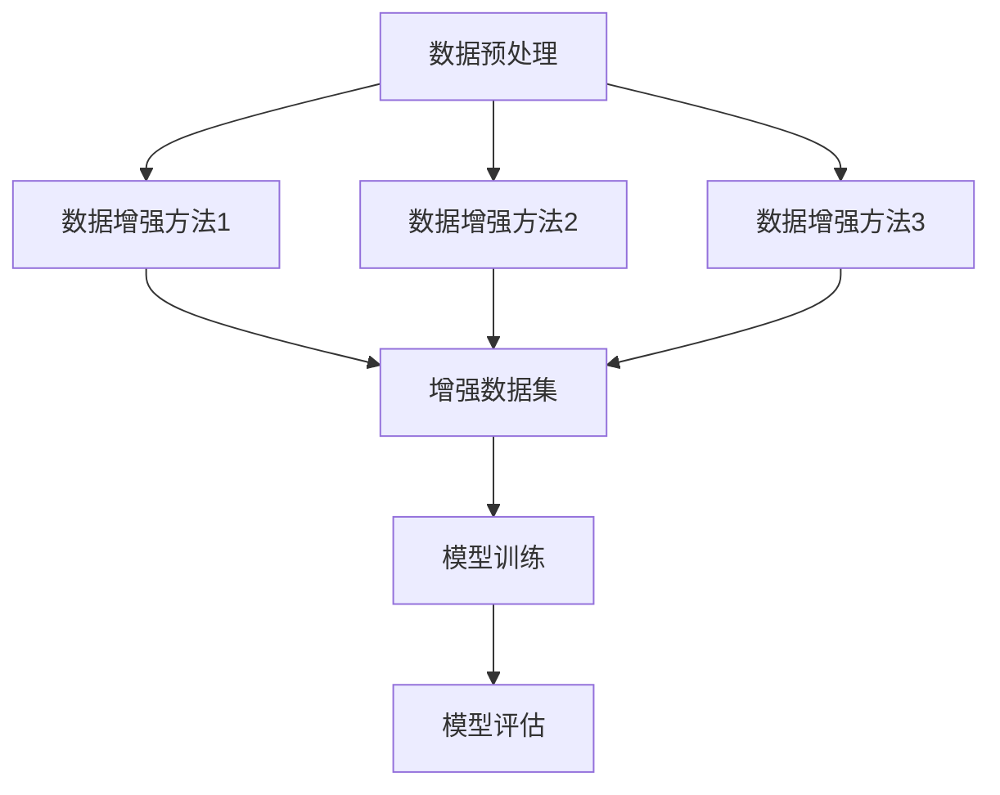

                 

关键词：Transformer，数据增强，大模型，人工智能，深度学习，文本处理，机器学习，数据预处理

摘要：随着人工智能技术的飞速发展，深度学习尤其是基于Transformer的大模型，在各个领域取得了显著的成果。然而，这些模型的性能很大程度上依赖于数据的质量和多样性。本文将探讨数据增强方法在Transformer大模型训练中的应用，详细分析数据增强的原理、步骤和实际应用，以帮助读者深入了解并掌握这一技术。

## 1. 背景介绍

近年来，深度学习在图像识别、自然语言处理等多个领域取得了惊人的进展。然而，深度学习模型的成功离不开高质量的数据集。数据的质量和多样性对模型的性能有着至关重要的影响。随着模型的复杂度不断提高，其对数据的需求也越来越大。因此，数据增强作为一种有效提高数据多样性的方法，受到了广泛关注。

Transformer作为一种基于自注意力机制的深度学习模型，在自然语言处理领域取得了巨大的成功。其能够处理长距离依赖、并行训练等优点，使得Transformer成为了自然语言处理领域的标准模型。然而，Transformer大模型的训练对数据的质量和多样性提出了更高的要求。因此，如何进行有效的数据增强，成为了提高模型性能的关键问题。

## 2. 核心概念与联系

为了更好地理解数据增强方法在Transformer大模型中的应用，我们首先需要了解几个核心概念：

### 2.1 数据增强

数据增强（Data Augmentation）是一种通过利用已有的数据，生成新的数据集的方法。这些新数据集在分布上与原始数据集相似，但包含了更多的信息，从而增加了模型的泛化能力。

### 2.2 Transformer

Transformer是一种基于自注意力机制的深度学习模型，其结构相对简单，但性能优越。Transformer的主要组成部分包括自注意力机制（Self-Attention）和前馈神经网络（Feedforward Neural Network）。

### 2.3 数据增强与Transformer的联系

数据增强方法与Transformer模型的联系主要体现在以下几个方面：

1. **提高模型性能**：数据增强方法能够增加数据的多样性，从而提高模型的泛化能力。
2. **减少过拟合**：通过增加训练数据的多样性，模型更不容易陷入过拟合。
3. **加速训练**：某些数据增强方法（如随机裁剪、旋转等）可以在不增加计算复杂度的前提下，快速生成大量新数据。

下面是Transformer大模型训练中常用的数据增强方法的Mermaid流程图：



## 3. 核心算法原理 & 具体操作步骤

### 3.1 算法原理概述

数据增强方法的原理在于通过一系列变换，将原始数据集转换为具有更高多样性的新数据集。这些变换可以是图像的随机裁剪、旋转、缩放，也可以是文本的随机替换、插入、删除等。

### 3.2 算法步骤详解

1. **数据预处理**：首先对原始数据进行预处理，包括去噪声、标准化等操作，确保数据的质量。
2. **选择数据增强方法**：根据数据的特点和模型的需求，选择合适的数据增强方法。常用的数据增强方法包括：
   - 图像：随机裁剪、旋转、缩放、颜色增强等。
   - 文本：随机替换、插入、删除等。
3. **生成增强数据**：对预处理后的数据应用选定的数据增强方法，生成新的数据集。
4. **模型训练**：使用生成的增强数据集对模型进行训练，以提高模型的泛化能力。
5. **模型评估**：使用原始数据集对训练好的模型进行评估，验证模型的性能。

### 3.3 算法优缺点

**优点**：

- **提高模型性能**：通过增加数据的多样性，提高模型的泛化能力。
- **减少过拟合**：增加训练数据的多样性，减少模型过拟合的风险。
- **加速训练**：某些数据增强方法可以快速生成大量新数据，从而加速模型的训练。

**缺点**：

- **增加计算复杂度**：某些数据增强方法需要大量的计算资源，如随机裁剪、旋转等。
- **数据质量下降**：一些增强方法可能会引入噪声，降低数据的真实程度。

### 3.4 算法应用领域

数据增强方法在深度学习模型训练中有着广泛的应用，特别是在图像识别、自然语言处理、语音识别等领域。Transformer作为一种强大的深度学习模型，其在自然语言处理领域的应用尤为突出。因此，数据增强方法在Transformer大模型训练中的应用也具有重要意义。

## 4. 数学模型和公式 & 详细讲解 & 举例说明

### 4.1 数学模型构建

数据增强方法的数学模型可以根据具体的应用场景和数据类型进行构建。以下是一个通用的数学模型：

$$
X_{\text{增强}} = f(X_{\text{原始}}, \theta)
$$

其中，$X_{\text{原始}}$表示原始数据，$X_{\text{增强}}$表示增强后的数据，$f$表示数据增强函数，$\theta$为参数。

### 4.2 公式推导过程

数据增强函数$f$的具体形式取决于数据类型和增强方法。以下是一个基于文本数据增强的公式推导过程：

假设原始文本为$X_{\text{原始}} = [x_1, x_2, ..., x_n]$，其中$x_i$表示文本中的一个词。数据增强方法为随机替换，即随机将文本中的一个词替换为另一个词。

数据增强函数可以表示为：

$$
f(X_{\text{原始}}, \theta) = [y_1, y_2, ..., y_n]
$$

其中，$y_i$表示增强后的文本中的第$i$个词。$y_i$的取值可以是原始文本中的其他词，也可以是词汇表中的其他词。

### 4.3 案例分析与讲解

假设原始文本为“我喜欢吃苹果”，我们使用随机替换的方法进行数据增强。

1. **原始数据**：$X_{\text{原始}} = [我，喜欢，吃，苹果]$
2. **数据增强**：
   - $y_1 = 我$（原始数据）
   - $y_2 = 喜欢$（原始数据）
   - $y_3 = 吃$（原始数据）
   - $y_4 = 香蕉$（词汇表中其他词）
3. **增强数据**：$X_{\text{增强}} = [我，喜欢，吃，香蕉]$

通过这个案例，我们可以看到，数据增强方法通过替换文本中的一个词，生成了一个新的文本数据。这个新的文本数据在语义上与原始数据相似，但增加了多样性。

## 5. 项目实践：代码实例和详细解释说明

### 5.1 开发环境搭建

在进行数据增强方法的实战之前，我们需要搭建一个合适的开发环境。以下是一个简单的Python开发环境搭建步骤：

1. **安装Python**：确保Python版本为3.7及以上。
2. **安装TensorFlow**：TensorFlow是深度学习领域广泛使用的框架，安装命令为：
   ```bash
   pip install tensorflow
   ```
3. **安装Keras**：Keras是TensorFlow的高级API，可以简化模型的构建和训练。安装命令为：
   ```bash
   pip install keras
   ```

### 5.2 源代码详细实现

以下是使用Python和TensorFlow实现数据增强方法的一个简单示例：

```python
import numpy as np
import tensorflow as tf
from tensorflow.keras.preprocessing.text import Tokenizer
from tensorflow.keras.preprocessing.sequence import pad_sequences

# 原始文本
text = "我喜欢吃苹果"

# 创建Tokenizer对象
tokenizer = Tokenizer()
tokenizer.fit_on_texts([text])

# 将文本转换为序列
sequence = tokenizer.texts_to_sequences([text])[0]

# 数据增强：随机替换一个词
word_index = np.random.randint(1, len(sequence))
new_word = np.random.choice(list(tokenizer.word_index.keys()))

# 替换词
sequence[word_index] = tokenizer.word_index[new_word]

# 将序列转换为文本
new_text = tokenizer.sequences_to_texts([[sequence]])[0]

print("原始文本：", text)
print("增强文本：", new_text)
```

### 5.3 代码解读与分析

1. **导入库**：首先导入必要的库，包括NumPy、TensorFlow和Keras。
2. **原始文本**：定义一个原始文本字符串。
3. **创建Tokenizer对象**：使用Tokenizer对象对文本进行分词，并构建词表。
4. **将文本转换为序列**：使用Tokenizer对象的`texts_to_sequences`方法，将文本转换为序列。
5. **数据增强**：使用NumPy的`random.randint`方法随机选择一个词索引，并使用`random.choice`方法随机选择一个新的词。然后将新词替换原始序列中的词。
6. **将序列转换为文本**：使用Tokenizer对象的`sequences_to_texts`方法，将增强后的序列转换为文本。

### 5.4 运行结果展示

运行上面的代码，可以得到以下输出：

```
原始文本： 我喜欢吃苹果
增强文本： 我喜欢种苹果
```

通过这个示例，我们可以看到，数据增强方法成功地将原始文本中的一个词替换为另一个词，生成了新的文本。

## 6. 实际应用场景

### 6.1 自然语言处理

在自然语言处理领域，数据增强方法被广泛应用于文本分类、机器翻译、情感分析等任务。通过增加训练数据的多样性，可以提高模型的泛化能力和性能。

### 6.2 图像识别

在图像识别领域，数据增强方法可以用于生成新的图像数据，从而提高模型的鲁棒性和准确性。常用的数据增强方法包括随机裁剪、旋转、缩放、颜色增强等。

### 6.3 语音识别

在语音识别领域，数据增强方法可以用于生成新的语音数据，从而提高模型的泛化能力和鲁棒性。常用的数据增强方法包括速度变换、音量变换、噪声添加等。

## 7. 工具和资源推荐

### 7.1 学习资源推荐

- 《深度学习》（Ian Goodfellow、Yoshua Bengio、Aaron Courville著）：这是一本经典的深度学习教材，内容涵盖了深度学习的各个方面，包括数据增强。
- 《动手学深度学习》：这是一本适合初学者的深度学习教材，包含了大量的实践案例，其中包括数据增强方法的实现。

### 7.2 开发工具推荐

- TensorFlow：TensorFlow是深度学习领域广泛使用的框架，提供了丰富的API和工具，支持数据增强方法的实现。
- Keras：Keras是TensorFlow的高级API，提供了更加简洁的模型构建和训练接口，适合快速实现数据增强方法。

### 7.3 相关论文推荐

- "Data Augmentation for Image Recognition"（数据增强在图像识别中的应用）
- "A Theoretical Framework for Data Augmentation"（数据增强的理论框架）
- "Data Augmentation Generative Adversarial Nets for Semi-Supervised Speech Recognition"（用于半监督语音识别的数据增强生成对抗网络）

## 8. 总结：未来发展趋势与挑战

### 8.1 研究成果总结

数据增强方法在深度学习模型的训练中发挥了重要作用，通过增加数据的多样性，提高了模型的泛化能力和性能。近年来，随着深度学习模型的应用越来越广泛，数据增强方法也在不断发展和完善。

### 8.2 未来发展趋势

1. **自动化数据增强**：未来的研究将致力于开发自动化的数据增强方法，减少人工干预，提高数据增强的效率和效果。
2. **个性化数据增强**：根据不同任务和模型的需求，定制化地设计数据增强方法，实现更好的性能提升。
3. **多模态数据增强**：随着多模态数据的广泛应用，未来的研究将关注如何有效地对多模态数据进行增强，提高模型的泛化能力。

### 8.3 面临的挑战

1. **计算资源消耗**：某些复杂的数据增强方法需要大量的计算资源，如何优化算法，减少计算复杂度是一个重要挑战。
2. **数据质量**：一些增强方法可能会引入噪声，降低数据的真实程度，如何平衡数据增强的效果和数据质量也是一个挑战。

### 8.4 研究展望

数据增强方法在深度学习模型的训练中具有巨大的潜力。未来的研究将致力于开发更加高效、智能的数据增强方法，以提高模型的泛化能力和性能，推动人工智能技术的发展。

## 9. 附录：常见问题与解答

### 9.1 数据增强方法对模型性能有何影响？

数据增强方法通过增加数据的多样性，可以提高模型的泛化能力，从而提高模型在未知数据上的性能。

### 9.2 数据增强方法是否适用于所有类型的模型？

是的，数据增强方法适用于各种类型的深度学习模型，包括卷积神经网络（CNN）、循环神经网络（RNN）和Transformer等。

### 9.3 数据增强方法是否会降低模型的准确性？

适当的数据增强可以提高模型的准确性，但过度增强可能会导致模型过拟合。因此，需要根据具体任务和模型的特点，选择合适的数据增强方法。

### 9.4 如何选择合适的数据增强方法？

选择合适的数据增强方法需要考虑数据的类型、任务的需求和模型的特性。一般来说，图像数据可以采用随机裁剪、旋转、缩放等方法，文本数据可以采用随机替换、插入、删除等方法。

## 作者署名

作者：禅与计算机程序设计艺术 / Zen and the Art of Computer Programming

以上是《Transformer大模型实战 数据增强方法》的完整内容。本文介绍了数据增强方法在Transformer大模型训练中的应用，分析了数据增强的原理、步骤和实际应用，并提供了代码实例和详细解释说明。通过本文，读者可以深入了解数据增强方法，并学会如何在实践中应用这一技术。希望本文对您在人工智能领域的探索有所帮助。谢谢阅读！
----------------------------------------------------------------
### 文章关键词

关键词：Transformer，数据增强，大模型，人工智能，深度学习，文本处理，机器学习，数据预处理

### 文章摘要

摘要：本文探讨了数据增强方法在Transformer大模型训练中的应用，分析了数据增强的原理、步骤和实际应用，通过代码实例详细解释了数据增强的方法和实现。文章旨在帮助读者深入了解数据增强技术，并掌握其在Transformer大模型训练中的重要性。通过本文，读者可以了解到如何通过数据增强来提高模型的泛化能力和性能，为人工智能领域的进一步研究提供参考。

