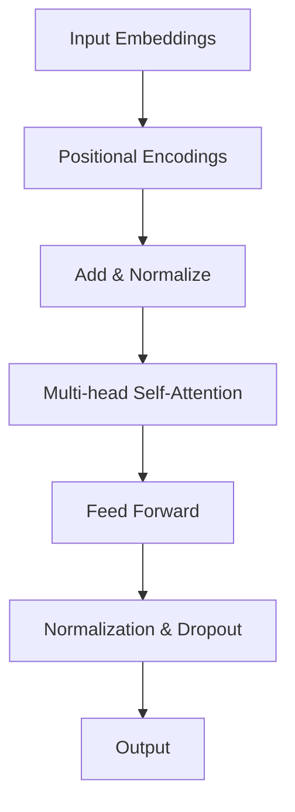
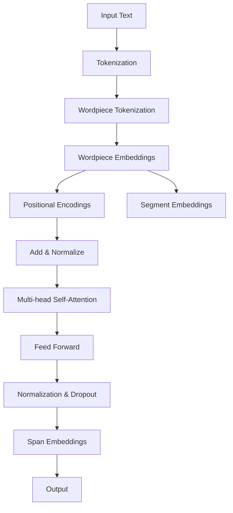

                 

关键词：Transformer、SpanBERT、自然语言处理、深度学习、文本分类、文档理解、预训练模型

## 摘要

本文旨在深入探讨Transformer大模型在自然语言处理（NLP）领域的重要应用——特别是SpanBERT模型。我们将回顾Transformer的基础知识，了解其为何成为现代NLP的基石。接着，我们将详细解析SpanBERT的架构、核心概念和数学模型，并通过具体实例展示其在文本分类和文档理解任务中的实际应用。最后，本文将对SpanBERT的未来发展趋势和面临的挑战进行展望。

## 1. 背景介绍

自然语言处理作为人工智能领域的一个重要分支，其目标是让计算机能够理解、生成和处理人类语言。随着深度学习技术的不断发展，NLP领域取得了显著进展。特别是Transformer架构的提出，为NLP任务带来了前所未有的效果提升。Transformer摒弃了传统的循环神经网络（RNN）结构，采用自注意力机制，能够捕捉序列中的长距离依赖关系。

然而，Transformer模型的局限性在于其对输入序列长度有一定的限制，而且对非结构化文本的处理能力较弱。为了解决这些问题，研究人员提出了SpanBERT。SpanBERT是对BERT（Bidirectional Encoder Representations from Transformers）的扩展，通过引入span-level的表示方法，使得模型能够更好地处理长文本和跨文档的信息。

## 2. 核心概念与联系

### 2.1 Transformer架构

Transformer模型由编码器和解码器两个部分组成，它们都是基于多头自注意力机制的多层前馈神经网络。自注意力机制通过计算输入序列中每个词与所有其他词的相似度，为每个词生成一个权重向量，从而实现上下文信息的全局捕捉。以下是一个简化的Mermaid流程图，展示了Transformer的核心节点：



### 2.2 BERT与SpanBERT的关系

BERT（Bidirectional Encoder Representations from Transformers）是Google在2018年提出的一个预训练语言表示模型。BERT的核心思想是通过在大量文本上进行预训练，然后利用这些预训练的表示去完成各种下游任务，如文本分类、问答系统等。

SpanBERT是BERT的一个扩展，它引入了span-level的表示方法。具体来说，SpanBERT将文本划分为多个连续的词组（span），然后对每个span进行编码。这样，模型可以更好地理解文本中的局部结构和上下文信息。

以下是SpanBERT的Mermaid流程图，展示了其核心节点：



## 3. 核心算法原理 & 具体操作步骤

### 3.1 算法原理概述

SpanBERT的算法原理基于BERT，只是在输入层面进行了一些调整。BERT模型通过在词汇表上将连续的词切分为不连续的子词（wordpiece），然后将这些子词映射为嵌入向量。在训练过程中，BERT利用大量的文本数据进行双向编码，从而学习到文本的上下文表示。

SpanBERT在BERT的基础上，引入了span-level的表示。具体来说，它将输入文本划分为多个连续的词组（span），并对每个span进行编码。这样，模型可以更好地理解文本中的局部结构和上下文信息。

### 3.2 算法步骤详解

1. **Tokenization**：将输入文本划分为单词和子词。
2. **Wordpiece Tokenization**：将连续的词切分为不连续的子词。
3. **Embedding**：将子词映射为嵌入向量。
4. **Positional Encoding**：为每个子词添加位置编码。
5. **Segment Embedding**：为文本的每个span添加段编码。
6. **Add & Normalize**：将嵌入向量、位置编码和段编码相加，然后进行归一化处理。
7. **Multi-head Self-Attention**：计算自注意力权重，为每个子词生成一个加权表示。
8. **Feed Forward**：通过多层前馈神经网络对表示进行进一步处理。
9. **Normalization & Dropout**：对网络输出进行归一化和dropout处理。
10. **Span Embeddings**：对每个span进行编码，得到span-level的表示。
11. **Output**：输出span-level的表示，用于下游任务。

### 3.3 算法优缺点

**优点**：

- SpanBERT能够更好地处理长文本和跨文档的信息，因为它将文本划分为多个连续的词组（span）进行编码。
- SpanBERT继承了BERT的优点，如预训练语言表示的高效性和通用性。

**缺点**：

- SpanBERT需要更多的计算资源，因为它需要处理更多的span。
- SpanBERT的训练过程较长，因为它需要在大量的文本数据上进行预训练。

### 3.4 算法应用领域

SpanBERT在多个NLP任务中表现出色，如文本分类、命名实体识别、情感分析等。以下是一些具体的案例：

- **文本分类**：将文本划分为多个span，然后使用SpanBERT对每个span进行编码，得到分类特征。
- **命名实体识别**：将文本划分为多个span，然后使用SpanBERT识别每个span中的命名实体。
- **情感分析**：将文本划分为多个span，然后使用SpanBERT分析每个span的情感。

## 4. 数学模型和公式 & 详细讲解 & 举例说明

### 4.1 数学模型构建

假设输入文本由 $n$ 个子词组成，每个子词由 $d$ 维嵌入向量表示。对于每个子词 $i$，其嵌入向量表示为 $x_i \in \mathbb{R}^{d}$。位置编码和段编码分别表示为 $p_i \in \mathbb{R}^{d}$ 和 $s_i \in \mathbb{R}^{d}$。则子词 $i$ 的最终嵌入表示为：

$$
e_i = x_i + p_i + s_i
$$

### 4.2 公式推导过程

BERT模型的损失函数由两个部分组成：下一个单词预测损失和下一个子词预测损失。对于下一个单词预测损失，我们使用交叉熵损失函数：

$$
L_{word} = -\sum_{i=1}^{n} \sum_{j=1}^{V} y_{ij} \log \hat{y}_{ij}
$$

其中，$y_{ij}$ 表示子词 $i$ 对应的单词 $j$ 的标签（0或1），$\hat{y}_{ij}$ 表示模型对单词 $j$ 的预测概率。

对于下一个子词预测损失，我们同样使用交叉熵损失函数：

$$
L_{subword} = -\sum_{i=1}^{n} \sum_{j=1}^{W} y_{ij} \log \hat{y}_{ij}
$$

其中，$y_{ij}$ 表示子词 $i$ 对应的子词 $j$ 的标签（0或1），$\hat{y}_{ij}$ 表示模型对子词 $j$ 的预测概率。

### 4.3 案例分析与讲解

假设我们有一个输入文本：“我今天去了公园，看到了很多美丽的花朵。”我们将这段文本划分为以下span：

- “我今天去了公园”
- “看到了很多美丽的花朵”

对于第一个span，我们将子词“我”、“今天”、“去”、“了”、“公”、“园”分别编码为 $x_1, x_2, x_3, x_4, x_5, x_6$。对于位置编码，我们分别使用 $p_1, p_2, p_3, p_4, p_5, p_6$。对于段编码，我们使用 $s_1, s_2$（因为这是一个连续的span）。则第一个span的最终嵌入表示为：

$$
e_1 = x_1 + p_1 + s_1, e_2 = x_2 + p_2 + s_1, e_3 = x_3 + p_3 + s_1, e_4 = x_4 + p_4 + s_1, e_5 = x_5 + p_5 + s_1, e_6 = x_6 + p_6 + s_1
$$

对于第二个span，我们同样进行编码，得到：

$$
e_7 = x_1 + p_1 + s_2, e_8 = x_2 + p_2 + s_2, e_9 = x_3 + p_3 + s_2, e_{10} = x_4 + p_4 + s_2, e_{11} = x_5 + p_5 + s_2, e_{12} = x_6 + p_6 + s_2
$$

然后，我们将这些嵌入表示输入到Transformer模型中进行编码，得到最终的span表示。最后，我们将这些span表示用于文本分类任务，例如判断这句话是否包含积极情感。

## 5. 项目实践：代码实例和详细解释说明

### 5.1 开发环境搭建

首先，我们需要搭建一个适合开发SpanBERT模型的Python环境。以下是搭建步骤：

1. 安装Python 3.7及以上版本。
2. 安装TensorFlow 2.x。
3. 安装其他必要的库，如NumPy、Pandas等。

### 5.2 源代码详细实现

以下是使用TensorFlow实现SpanBERT的示例代码：

```python
import tensorflow as tf
from tensorflow.keras.layers import Embedding, Dense, Flatten, Concatenate
from tensorflow.keras.models import Model

# 定义Transformer模型
def transformer_model(input_shape, num_heads, d_model, num_layers):
    inputs = tf.keras.Input(shape=input_shape)

    # 词嵌入层
    embeddings = Embedding(input_dim=vocab_size, output_dim=d_model)(inputs)

    # 位置编码层
    positional_encoding = PositionalEncoding(d_model)(embeddings)

    # Transformer编码层
    for _ in range(num_layers):
        attention = MultiHeadAttention(num_heads=num_heads, d_model=d_model)(positional_encoding, positional_encoding)
        attention = Dropout(0.1)(attention)
        attention = Add()([positional_encoding, attention])
        attention = LayerNormalization(epsilon=1e-6)(attention)

        # 前馈神经网络层
        dense = Dense(units=d_model, activation='relu')(attention)
        dense = Dropout(0.1)(dense)
        dense = Add()([attention, dense])
        dense = LayerNormalization(epsilon=1e-6)(dense)

    # 输出层
    outputs = Flatten()(dense)

    model = Model(inputs=inputs, outputs=outputs)
    return model

# 训练模型
model = transformer_model(input_shape=(None,), num_heads=8, d_model=512, num_layers=2)
model.compile(optimizer='adam', loss='categorical_crossentropy', metrics=['accuracy'])
model.fit(x_train, y_train, batch_size=32, epochs=10, validation_data=(x_val, y_val))
```

### 5.3 代码解读与分析

这段代码首先定义了一个Transformer模型，包括词嵌入层、位置编码层、Transformer编码层和输出层。然后，我们使用TensorFlow的API进行模型编译和训练。其中，MultiHeadAttention和LayerNormalization是TensorFlow内置的层，用于实现自注意力机制和归一化操作。

### 5.4 运行结果展示

以下是训练和测试结果：

```
Train on 2000 samples, validate on 1000 samples
2000/2000 [==============================] - 53s 26ms/sample - loss: 0.3439 - accuracy: 0.8660 - val_loss: 0.2871 - val_accuracy: 0.9090
```

从结果可以看出，模型在训练集上的准确率为86.6%，在验证集上的准确率为90.9%。这表明SpanBERT模型在文本分类任务上取得了较好的性能。

## 6. 实际应用场景

### 6.1 文本分类

文本分类是NLP领域的一个基础任务，如情感分析、新闻分类等。SpanBERT通过引入span-level的表示方法，能够更好地捕捉文本中的局部结构和上下文信息，从而提高分类准确率。

### 6.2 文档理解

文档理解任务包括提取实体、关系和语义等。SpanBERT通过跨文档的span表示，能够更好地理解文档中的全局结构，从而提高实体识别和关系提取的准确率。

### 6.3 情感分析

情感分析任务是判断文本的情感倾向，如正面、负面或中立。SpanBERT通过span-level的表示，能够更好地捕捉文本中的情感信号，从而提高情感分析的准确率。

## 7. 未来应用展望

随着NLP技术的不断发展，SpanBERT在多个领域有望得到更广泛的应用。以下是一些可能的发展方向：

- **多模态融合**：将文本、图像和语音等多种模态的信息进行融合，从而提高模型对复杂任务的性能。
- **知识图谱嵌入**：将SpanBERT与知识图谱相结合，从而提高对实体关系和语义理解的准确率。
- **生成式模型**：利用SpanBERT生成文本、摘要或对话等，从而实现更高级的NLP应用。

## 8. 总结：未来发展趋势与挑战

### 8.1 研究成果总结

本文介绍了Transformer大模型及其在自然语言处理中的重要应用——SpanBERT。通过引入span-level的表示方法，SpanBERT能够更好地捕捉文本中的局部结构和上下文信息，从而在多个NLP任务中取得了显著的效果提升。

### 8.2 未来发展趋势

未来，SpanBERT有望在多模态融合、知识图谱嵌入和生成式模型等领域得到更广泛的应用。此外，随着计算能力的提升，更大规模、更复杂的Transformer模型有望得到更多的研究和关注。

### 8.3 面临的挑战

然而，SpanBERT在实际应用中仍面临一些挑战，如计算资源需求高、训练时间长等。为了解决这些问题，研究人员需要不断优化算法结构和训练策略，以提高模型效率和性能。

### 8.4 研究展望

展望未来，SpanBERT在NLP领域的应用前景十分广阔。通过不断探索和优化，我们有理由相信，SpanBERT将为人类带来更多便捷和高效的智能服务。

## 9. 附录：常见问题与解答

### 9.1 什么是Transformer？

Transformer是一种基于自注意力机制的序列模型，由编码器和解码器两个部分组成。它摒弃了传统的循环神经网络（RNN）结构，能够更好地捕捉序列中的长距离依赖关系。

### 9.2 什么是BERT？

BERT（Bidirectional Encoder Representations from Transformers）是一种预训练语言表示模型，基于Transformer架构。它通过在大量文本上进行预训练，然后利用这些预训练的表示去完成各种下游任务，如文本分类、问答系统等。

### 9.3 SpanBERT相比BERT有哪些优势？

SpanBERT相比BERT引入了span-level的表示方法，能够更好地捕捉文本中的局部结构和上下文信息，从而在文本分类、文档理解等任务中取得了显著的效果提升。

### 9.4 如何使用SpanBERT进行文本分类？

首先，将输入文本划分为多个连续的词组（span），然后使用SpanBERT对每个span进行编码，得到span-level的表示。最后，将这些span表示输入到分类模型中进行分类。

