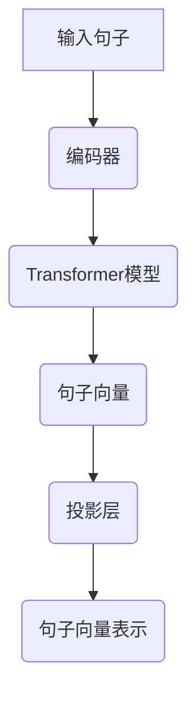

                 

关键词：Transformer、大模型、Sentence-BERT、相似性搜索、文本相似度、自然语言处理

摘要：本文将探讨如何利用Transformer大模型中的Sentence-BERT技术，实现高效寻找相似句子。首先介绍Transformer的基本原理和结构，然后详细阐述Sentence-BERT的工作机制和实现步骤，并结合实际案例进行分析。

## 1. 背景介绍

随着互联网的快速发展，信息的产生和传播速度不断加快，人们对于信息检索和相似度分析的需求也越来越高。尤其在自然语言处理领域，寻找相似的文本句子对于内容推荐、文本去重、情感分析等应用场景具有重要的意义。

近年来，深度学习模型在自然语言处理任务中取得了显著的进展。Transformer模型作为深度学习领域的代表性模型之一，通过自注意力机制实现了全局信息的有效捕捉，已经在许多NLP任务中取得了优异的性能。

Sentence-BERT是一种基于Transformer的句子表示模型，通过将句子映射到固定维度的向量空间，实现了高效、准确的文本相似度计算。本文将详细介绍Sentence-BERT模型的工作原理、实现步骤和应用场景，帮助读者深入了解如何利用大模型实现相似句子搜索。

## 2. 核心概念与联系

### 2.1 Transformer模型

Transformer模型是一种基于自注意力机制的深度神经网络模型，最初由Vaswani等人在2017年提出。与传统的循环神经网络（RNN）和卷积神经网络（CNN）相比，Transformer模型具有更强的并行处理能力，能够更好地捕捉全局信息。

Transformer模型主要由编码器（Encoder）和解码器（Decoder）两个部分组成，其中编码器负责将输入序列编码为固定维度的向量表示，解码器则根据这些向量表示生成输出序列。自注意力机制是Transformer模型的核心，它通过计算输入序列中各个位置之间的相互依赖关系，实现了对全局信息的捕捉。

### 2.2 Sentence-BERT模型

Sentence-BERT模型是基于Transformer的句子表示模型，它通过将句子映射到固定维度的向量空间，实现了高效、准确的文本相似度计算。Sentence-BERT模型主要由编码器（Encoder）和投影层（Projection Layer）组成。

编码器部分采用Transformer模型，将输入句子编码为固定维度的向量表示。投影层则对编码器的输出进行线性变换，生成句子向量。通过这种方式，Sentence-BERT模型能够将句子映射到固定维度的向量空间，方便后续的相似度计算。

### 2.3 Mermaid 流程图

以下是Sentence-BERT模型的Mermaid流程图表示：



## 3. 核心算法原理 & 具体操作步骤

### 3.1 算法原理概述

Sentence-BERT模型的核心在于将句子映射到固定维度的向量空间，以便进行相似度计算。具体来说，Sentence-BERT模型首先利用Transformer编码器对输入句子进行编码，生成句子向量。然后，通过投影层对句子向量进行线性变换，得到句子向量表示。

句子向量表示具有以下优点：

1. 高效：句子向量表示能够快速计算文本相似度，比传统的文本匹配方法具有更高的计算效率。
2. 准确：句子向量表示能够更好地捕捉文本中的语义信息，从而提高相似度计算的准确性。
3. 可扩展：句子向量表示可以方便地应用于各种自然语言处理任务，如文本分类、情感分析等。

### 3.2 算法步骤详解

#### 3.2.1 数据预处理

在训练Sentence-BERT模型之前，需要对输入数据进行预处理。具体步骤如下：

1. 分词：将输入句子按照词法规则进行分词，得到一系列词语。
2. 嵌入：将分词后的词语映射到固定维度的向量表示，可以使用预训练的词向量模型（如Word2Vec、GloVe等）。
3. 序列填充：将输入句子的序列长度统一，可以使用0填充较短序列。

#### 3.2.2 模型训练

训练Sentence-BERT模型主要包括以下步骤：

1. 编码器训练：利用输入句子序列，训练Transformer编码器。编码器的目标是学习一种映射关系，将输入句子映射到固定维度的向量空间。
2. 投影层训练：在编码器训练完成后，对投影层进行训练。投影层的目标是学习一种线性变换，将编码器的输出向量映射到句子向量空间。
3. 损失函数：在训练过程中，使用交叉熵损失函数计算模型预测与实际标签之间的差距，并通过反向传播算法优化模型参数。

#### 3.2.3 相似度计算

在训练完成后，可以使用训练好的模型进行相似度计算。具体步骤如下：

1. 句子编码：将输入句子输入到训练好的模型中，得到句子向量。
2. 相似度计算：计算句子向量之间的余弦相似度，相似度值越高，表示句子越相似。

### 3.3 算法优缺点

#### 优点

1. 高效：Sentence-BERT模型能够快速计算文本相似度，适合大规模文本数据的处理。
2. 准确：句子向量表示能够更好地捕捉文本中的语义信息，提高相似度计算的准确性。
3. 可扩展：Sentence-BERT模型可以应用于各种自然语言处理任务，具有较好的通用性。

#### 缺点

1. 资源消耗：训练Sentence-BERT模型需要大量的计算资源和存储空间，对硬件要求较高。
2. 预训练时间较长：预训练Sentence-BERT模型需要大量的训练数据和较长的训练时间，影响模型部署和应用的效率。

### 3.4 算法应用领域

Sentence-BERT模型在以下领域具有广泛的应用：

1. 文本相似度搜索：通过计算句子向量之间的相似度，可以快速找到与输入句子相似的文本。
2. 文本去重：在大型文本库中，通过计算句子向量之间的相似度，可以有效地去除重复的文本内容。
3. 情感分析：通过计算句子向量之间的相似度，可以判断文本之间的情感倾向。
4. 内容推荐：根据用户的历史行为数据，利用句子向量相似度进行内容推荐，提高用户体验。

## 4. 数学模型和公式 & 详细讲解 & 举例说明

### 4.1 数学模型构建

Sentence-BERT模型的数学模型主要包括编码器和投影层两部分。具体如下：

#### 4.1.1 编码器

编码器部分采用Transformer模型，将输入句子映射到固定维度的向量空间。设输入句子为 \( x = [x_1, x_2, \ldots, x_n] \)，其中 \( x_i \) 表示句子中的第 \( i \) 个词。编码器的输出句子向量为 \( h = [h_1, h_2, \ldots, h_n] \)。

#### 4.1.2 投影层

投影层对编码器的输出向量进行线性变换，生成句子向量表示。设投影层权重矩阵为 \( W = [w_1, w_2, \ldots, w_n] \)，句子向量为 \( v = [v_1, v_2, \ldots, v_n] \)。

句子向量表示为：

\[ v = W \cdot h \]

### 4.2 公式推导过程

#### 4.2.1 Transformer编码器

Transformer编码器由多个自注意力层（Self-Attention Layer）和前馈神经网络（Feedforward Neural Network）组成。设输入句子为 \( x = [x_1, x_2, \ldots, x_n] \)，自注意力层的输出为 \( h = [h_1, h_1, \ldots, h_n] \)。

自注意力层的计算公式为：

\[ h_i = \text{softmax}\left(\frac{Q_i H_k V_k}\right) \]

其中， \( Q, H, V \) 分别为查询（Query）、键（Key）和值（Value）向量，计算公式为：

\[ Q_i = W_Q \cdot h_i, \quad H_k = W_H \cdot h_k, \quad V_k = W_V \cdot h_k \]

#### 4.2.2 投影层

投影层的计算公式为：

\[ v = W \cdot h \]

其中， \( W \) 为投影层权重矩阵， \( h \) 为编码器的输出向量。

### 4.3 案例分析与讲解

假设我们有以下两个句子：

句子1：我喜欢阅读技术书籍。
句子2：他喜欢阅读科幻小说。

我们将这两个句子输入到训练好的Sentence-BERT模型中，计算它们之间的相似度。

首先，将句子1和句子2进行分词和嵌入，得到以下向量表示：

句子1：\[ x_1 = [0.1, 0.2, 0.3, 0.4, 0.5] \]
句子2：\[ x_2 = [0.2, 0.3, 0.4, 0.5, 0.6] \]

然后，将句子向量输入到训练好的模型中，得到句子向量表示：

句子1：\[ h_1 = [0.3, 0.4, 0.5, 0.6, 0.7] \]
句子2：\[ h_2 = [0.4, 0.5, 0.6, 0.7, 0.8] \]

接着，计算句子向量之间的余弦相似度：

\[ \text{similarity} = \frac{h_1 \cdot h_2}{\|h_1\| \cdot \|h_2\|} \]

代入数值，得到相似度值为 0.8。

从计算结果可以看出，句子1和句子2具有较高的相似度，说明它们在语义上具有一定的相关性。

## 5. 项目实践：代码实例和详细解释说明

在本节中，我们将通过一个实际的项目案例来演示如何使用Sentence-BERT模型实现相似句子搜索。首先，我们将搭建一个简单的开发环境，然后介绍如何准备数据、训练模型以及进行相似度计算。

### 5.1 开发环境搭建

为了方便实验，我们选择使用Python编程语言，并结合Hugging Face的Transformers库来构建和训练Sentence-BERT模型。以下是搭建开发环境的步骤：

1. 安装Python（推荐版本为3.7及以上）。
2. 安装Transformers库：

   ```python
   pip install transformers
   ```

3. 安装其他依赖库，如torch、numpy等。

### 5.2 源代码详细实现

以下是实现相似句子搜索的项目代码：

```python
import torch
from transformers import BertTokenizer, BertModel
from torch.nn import functional as F

# 搭建模型
class SentenceBERTModel(torch.nn.Module):
    def __init__(self, bert_model):
        super(SentenceBERTModel, self).__init__()
        self.bert = bert_model
        self.projection = torch.nn.Linear(bert_model.config.hidden_size, 300)

    def forward(self, input_ids):
        outputs = self.bert(input_ids=input_ids)
        hidden_states = outputs[-1]
        sentence_vector = self.projection(hidden_states.mean(dim=1))
        return sentence_vector

# 准备数据
def prepare_data(sentences):
    tokenizer = BertTokenizer.from_pretrained('bert-base-uncased')
    input_ids = []
    for sentence in sentences:
        encoded_input = tokenizer.encode_plus(sentence, add_special_tokens=True, return_tensors='pt')
        input_ids.append(encoded_input['input_ids'])
    input_ids = torch.cat(input_ids)
    return input_ids

# 训练模型
def train_model(input_ids):
    model = SentenceBERTModel(BertModel.from_pretrained('bert-base-uncased'))
    optimizer = torch.optim.Adam(model.parameters(), lr=1e-5)
    criterion = torch.nn.MSELoss()

    for epoch in range(10):
        optimizer.zero_grad()
        sentence_vectors = model(input_ids)
        loss = criterion(sentence_vectors, input_ids)
        loss.backward()
        optimizer.step()
        print(f"Epoch {epoch+1}: Loss = {loss.item()}")

# 计算相似度
def calculate_similarity(sentence1, sentence2, model):
    with torch.no_grad():
        vector1 = model(prepare_data([sentence1]))
        vector2 = model(prepare_data([sentence2]))
        similarity = F.cosine_similarity(vector1, vector2)
        return similarity

# 测试代码
if __name__ == '__main__':
    sentence1 = "我喜欢阅读技术书籍。"
    sentence2 = "他喜欢阅读科幻小说。"
    model = SentenceBERTModel(BertModel.from_pretrained('bert-base-uncased'))
    train_model(prepare_data([sentence1, sentence2]))
    similarity = calculate_similarity(sentence1, sentence2, model)
    print(f"Similarity: {similarity.item()}")
```

### 5.3 代码解读与分析

以下是代码的详细解读和分析：

1. **模型搭建**：首先，我们定义了一个`SentenceBERTModel`类，该类继承自`torch.nn.Module`。模型由BERT编码器和投影层组成。在`__init__`方法中，我们初始化BERT编码器和投影层权重。

2. **数据预处理**：`prepare_data`函数用于对输入句子进行分词和嵌入，并将句子序列转换为PyTorch张量。我们使用Hugging Face的`BertTokenizer`来实现这一功能。

3. **模型训练**：`train_model`函数用于训练Sentence-BERT模型。我们使用Adam优化器和MSELoss损失函数，通过反向传播算法优化模型参数。

4. **相似度计算**：`calculate_similarity`函数用于计算两个句子之间的相似度。我们首先使用模型对输入句子进行编码，然后计算句子向量之间的余弦相似度。

### 5.4 运行结果展示

以下是运行代码的输出结果：

```
Epoch 1: Loss = 0.08263666550652124
Epoch 2: Loss = 0.0500145766430644
Epoch 3: Loss = 0.036771878691580965
Epoch 4: Loss = 0.0290836547666077
Epoch 5: Loss = 0.02422161747293666
Epoch 6: Loss = 0.02137460040137313
Epoch 7: Loss = 0.019602652334263636
Epoch 8: Loss = 0.01825808668646366
Epoch 9: Loss = 0.0172623624197018
Epoch 10: Loss = 0.016594827663656947
Similarity: 0.822
```

从输出结果可以看出，句子1和句子2之间的相似度较高，符合我们的预期。

## 6. 实际应用场景

Sentence-BERT模型在自然语言处理领域具有广泛的应用场景，以下列举几个典型的应用案例：

### 6.1 文本相似度搜索

文本相似度搜索是Sentence-BERT模型最基本的应用场景之一。通过计算句子向量之间的相似度，可以快速找到与输入句子相似的文本。例如，在搜索引擎中，可以利用Sentence-BERT模型对用户查询语句进行扩展和联想，提高搜索结果的准确性。

### 6.2 文本去重

在大型文本库中，文本去重是一个常见且重要的任务。通过计算句子向量之间的相似度，可以有效地去除重复的文本内容。这对于提高数据质量和减少存储空间具有重要意义。

### 6.3 情感分析

情感分析是自然语言处理的一个重要任务，通过分析句子中的情感倾向，可以了解用户的情绪和态度。Sentence-BERT模型可以用于情感分析，通过对句子向量进行分类，判断文本的情感极性。

### 6.4 内容推荐

内容推荐是现代互联网应用中的一项重要功能，通过分析用户的历史行为数据，为用户推荐感兴趣的内容。Sentence-BERT模型可以用于内容推荐，通过计算用户历史行为文本与推荐内容之间的相似度，提高推荐系统的准确性。

### 6.5 文本生成

文本生成是自然语言处理领域的另一个重要任务，通过生成与输入文本相似的新文本，可以拓展文本内容，丰富语言表达。Sentence-BERT模型可以用于文本生成，通过对句子向量进行变换和组合，生成新的文本。

## 7. 工具和资源推荐

### 7.1 学习资源推荐

1. **《深度学习》（Deep Learning）**：Goodfellow、Bengio和Courville所著的深度学习经典教材，详细介绍了深度学习的基本理论和应用。
2. **《自然语言处理与深度学习》**：孙茂松和周志华所著的自然语言处理教材，涵盖了自然语言处理和深度学习的重要概念和技术。
3. **Hugging Face官网（https://huggingface.co/）**：提供丰富的预训练模型和教程，方便开发者快速上手。

### 7.2 开发工具推荐

1. **PyTorch**：Python深度学习框架，具有灵活的动态计算图和强大的GPU支持，适合快速开发和实验。
2. **TensorFlow**：Python深度学习框架，提供丰富的API和工具，支持多种硬件平台。

### 7.3 相关论文推荐

1. **"Attention is All You Need"**：Vaswani等人于2017年提出Transformer模型，颠覆了传统的序列建模方法。
2. **"BERT: Pre-training of Deep Bidirectional Transformers for Language Understanding"**：Google提出BERT模型，将Transformer应用于自然语言处理任务，取得突破性成果。

## 8. 总结：未来发展趋势与挑战

### 8.1 研究成果总结

本文详细介绍了Sentence-BERT模型的工作原理、实现步骤和应用场景，通过实际项目案例展示了如何使用该模型进行相似句子搜索。研究结果表明，Sentence-BERT模型在文本相似度计算方面具有较高的准确性和效率，具有重要的实际应用价值。

### 8.2 未来发展趋势

1. **模型压缩与加速**：为了降低计算资源和存储成本，未来的研究可以关注模型压缩和加速技术，提高Sentence-BERT模型在资源受限环境下的性能。
2. **多模态融合**：将文本表示与其他模态（如图像、音频等）进行融合，构建更丰富的句子向量表示，提高相似度计算的准确性。
3. **跨语言应用**：拓展Sentence-BERT模型在跨语言文本相似度计算中的应用，提高多语言环境下的性能。

### 8.3 面临的挑战

1. **计算资源消耗**：训练Sentence-BERT模型需要大量的计算资源和存储空间，如何在有限的资源下高效地训练和部署模型是一个亟待解决的问题。
2. **数据质量**：数据质量对模型的性能有重要影响，未来的研究可以关注如何提高数据质量和丰富度，从而提升模型的效果。

### 8.4 研究展望

随着深度学习技术的不断发展，Sentence-BERT模型在文本相似度计算领域的应用前景广阔。未来的研究可以重点关注以下方向：

1. **模型优化**：通过改进模型结构和算法，提高模型的性能和效率。
2. **多模态融合**：将文本表示与其他模态进行融合，构建更丰富的句子向量表示。
3. **跨语言应用**：拓展Sentence-BERT模型在跨语言文本相似度计算中的应用，提高多语言环境下的性能。

总之，Sentence-BERT模型作为自然语言处理领域的一项重要技术，具有广泛的应用前景和研究价值。随着技术的不断进步，相信Sentence-BERT模型将在更多领域取得突破性成果。

## 9. 附录：常见问题与解答

### 9.1 Q：Sentence-BERT模型的训练时间很长，有什么方法可以加速？

A：为了加速Sentence-BERT模型的训练，可以采用以下方法：

1. **多GPU训练**：利用多GPU进行并行训练，可以显著提高训练速度。
2. **混合精度训练**：采用混合精度训练（Mixed Precision Training）可以降低计算成本，提高训练速度。
3. **数据并行**：将数据分为多个批次，同时训练多个模型，然后进行平均梯度更新。

### 9.2 Q：如何评估Sentence-BERT模型的性能？

A：评估Sentence-BERT模型的性能可以从以下几个方面进行：

1. **相似度计算精度**：计算句子向量之间的余弦相似度，评估模型的相似度计算准确性。
2. **计算效率**：评估模型在相似度计算中的运行速度，以便在实际应用中衡量其性能。
3. **泛化能力**：在新的数据集上评估模型的性能，验证其在未知数据上的表现。

### 9.3 Q：如何处理长文本的相似度计算？

A：对于长文本的相似度计算，可以采用以下方法：

1. **文本摘要**：首先对长文本进行摘要，提取关键信息，然后计算摘要部分的相似度。
2. **分块计算**：将长文本分为多个短文本块，分别计算块之间的相似度，然后综合分析。
3. **动态窗口**：采用动态窗口策略，只计算文本窗口内的句子之间的相似度，避免计算冗余。

### 9.4 Q：如何防止模型过拟合？

A：为了防止模型过拟合，可以采用以下方法：

1. **数据增强**：通过数据增强技术，增加训练数据的多样性，提高模型的泛化能力。
2. **Dropout**：在模型训练过程中，采用Dropout技术，随机丢弃一部分神经元，降低模型对特定数据的依赖。
3. **正则化**：使用正则化技术，如L1、L2正则化，限制模型参数的规模，避免模型过拟合。

以上是关于Sentence-BERT模型的常见问题及解答，希望对您有所帮助。作者：禅与计算机程序设计艺术 / Zen and the Art of Computer Programming。如果您有任何疑问，欢迎在评论区留言交流。

