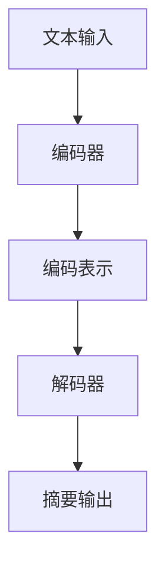

                 

关键词：Transformer大模型、文本摘要、BERTSUM、NLP、机器学习、深度学习

摘要：本文将深入探讨Transformer大模型在文本摘要任务中的应用，以BERTSUM模型为例，详细阐述其核心原理、算法步骤、数学模型和实际应用。通过对Transformer大模型实战的分析，读者将了解如何利用这一强大工具提升文本摘要的准确性和效率。

## 1. 背景介绍

文本摘要是一种自然语言处理（NLP）技术，旨在从大量文本中提取出关键信息，并以简洁、准确的方式呈现给用户。在信息爆炸的时代，文本摘要技术具有重要的应用价值，如搜索引擎摘要、新闻摘要、对话系统回答等。传统的文本摘要方法主要基于规则和统计模型，但效果有限。随着深度学习技术的发展，尤其是Transformer大模型的兴起，文本摘要任务取得了显著的进展。

BERTSUM是基于BERT（Bidirectional Encoder Representations from Transformers）模型的一种文本摘要方法，它通过预训练的Transformer架构实现了对文本的深度理解和语义表示，从而提高了摘要的生成质量。BERTSUM在多个文本摘要任务上表现优异，成为近年来研究的热点。

## 2. 核心概念与联系

### 2.1 Transformer架构

Transformer是一种基于自注意力机制的序列模型，其核心思想是使用多头注意力机制来处理序列中的长距离依赖关系。Transformer由编码器（Encoder）和解码器（Decoder）组成，分别用于处理输入和生成输出。编码器负责将输入序列编码为固定长度的向量表示，解码器则利用这些表示生成目标序列。

### 2.2 BERT模型

BERT是一种预训练的Transformer模型，其目的是为自然语言处理任务提供高质量的单词和句子表示。BERT通过在大量文本数据上进行预训练，学习到了丰富的语言知识，并将其应用于各种下游任务，如文本分类、命名实体识别等。

### 2.3 BERTSUM模型

BERTSUM是在BERT基础上发展起来的一种文本摘要方法。它将BERT的预训练模型与自注意力机制相结合，通过引入额外的注意力机制来捕捉文本中的关键信息。BERTSUM模型主要由编码器和解码器组成，编码器负责将输入文本编码为固定长度的向量表示，解码器则利用这些表示生成摘要。

### 2.4 Mermaid流程图



## 3. 核心算法原理 & 具体操作步骤

### 3.1 算法原理概述

BERTSUM模型基于Transformer架构，通过预训练和自注意力机制实现文本摘要。其基本原理可以概括为以下三个步骤：

1. **编码**：将输入文本编码为固定长度的向量表示。
2. **解码**：利用编码表示生成摘要。
3. **注意力机制**：在编码和解码过程中，通过自注意力机制捕捉文本中的关键信息。

### 3.2 算法步骤详解

1. **编码器**

   编码器负责将输入文本编码为向量表示。BERT模型使用预训练的Transformer架构，通过自注意力机制和多头注意力机制对输入文本进行编码。编码器的输出是一个固定长度的向量表示，用于后续的解码过程。

2. **解码器**

   解码器利用编码器的输出向量表示生成摘要。解码器同样采用Transformer架构，通过自注意力机制和多头注意力机制对编码器的输出进行解码。解码器的输入是编码器的输出向量表示，输出是生成的摘要。

3. **注意力机制**

   在编码和解码过程中，注意力机制起着关键作用。自注意力机制允许模型在编码过程中捕捉文本中的长距离依赖关系，从而提高编码表示的质量。在解码过程中，注意力机制帮助模型从编码表示中提取关键信息，以生成高质量的摘要。

### 3.3 算法优缺点

**优点：**

1. **强大的预训练能力**：BERT模型通过在大量文本数据上预训练，积累了丰富的语言知识，为文本摘要任务提供了高质量的向量表示。
2. **高效的注意力机制**：自注意力机制和多头注意力机制使得模型能够捕捉文本中的关键信息，提高了摘要的质量。

**缺点：**

1. **计算资源消耗大**：BERT模型的预训练和训练过程需要大量的计算资源。
2. **对数据依赖性强**：BERT模型在预训练过程中依赖大量的文本数据，对于数据稀缺的任务，模型表现可能不佳。

### 3.4 算法应用领域

BERTSUM模型在多个文本摘要任务中取得了显著的成果，如：

1. **新闻摘要**：自动生成新闻文章的摘要，帮助用户快速了解新闻内容。
2. **对话系统**：自动生成对话系统的回答摘要，提高对话系统的回答质量和用户体验。

## 4. 数学模型和公式 & 详细讲解 & 举例说明

### 4.1 数学模型构建

BERT模型基于Transformer架构，其数学模型可以概括为以下三个主要部分：

1. **编码器**：编码器将输入文本编码为固定长度的向量表示。输入文本可以表示为序列$$X = \{x_1, x_2, ..., x_T\}$$，其中$$T$$是序列长度。编码器通过自注意力机制和多头注意力机制，将输入文本编码为一个固定长度的向量$$E = \{e_1, e_2, ..., e_T\}$$。

2. **解码器**：解码器利用编码器输出的向量表示生成摘要。解码器输入是编码器输出的向量表示$$E$$，输出是生成的摘要$$Y = \{y_1, y_2, ..., y_S\}$$，其中$$S$$是摘要长度。解码器通过自注意力机制和多头注意力机制，生成摘要。

3. **注意力机制**：注意力机制是BERT模型的核心组成部分。自注意力机制用于编码过程中，捕捉文本中的长距离依赖关系。多头注意力机制将自注意力机制扩展为多个注意力头，以提高模型的泛化能力。

### 4.2 公式推导过程

BERT模型的注意力机制可以表示为以下公式：

$$
\text{Attention}(Q, K, V) = \text{softmax}\left(\frac{QK^T}{\sqrt{d_k}}\right) V
$$

其中，$$Q$$、$$K$$和$$V$$分别是查询向量、键向量和值向量，$$d_k$$是键向量的维度。$$\text{softmax}$$函数用于计算注意力权重。

BERT模型的编码器和解码器都可以表示为多个层的注意力机制和前馈神经网络。编码器的输出可以表示为：

$$
E = \text{LayerNorm}(X + \text{Self-Attention}(X) + \text{Feedforward}(X))
$$

解码器的输出可以表示为：

$$
Y = \text{LayerNorm}(Y + \text{Multi-Head-Attention}(Y, E, E) + \text{Feedforward}(Y))
$$

### 4.3 案例分析与讲解

假设我们有一个简短的新闻文章，内容如下：

```
全球科技巨头谷歌近日宣布推出一项名为“量子计算云服务”的新项目。该项目旨在通过云计算平台为企业和科研机构提供量子计算服务。据悉，谷歌的量子计算机已经达到了“量子霸权”状态，可以在特定任务上超越传统计算机。这一进展引发了广泛关注，也为量子计算技术的发展带来了新的机遇。
```

我们可以将这篇文章表示为以下序列：

$$
X = \{\text{全球}, \text{科技}, \text{巨头}, \text{谷歌}, \text{近日}, \text{宣布}, \text{推出}, \text{一项}, \text{名为}, \text{量子计算云服务}, \text{的新项目}, \text{。}, \text{该项目}, \text{旨在}, \text{通过}, \text{云计算}, \text{平台}, \text{为}, \text{企业和}, \text{科研}, \text{机构}, \text{提供}, \text{量子计算}, \text{服务}, \text{。}, \text{据悉}, \text{谷歌}, \text{的}, \text{量子计算机}, \text{已经}, \text{达到}, \text{了}, \text{量子霸权}, \text{状态}, \text{，}, \text{可以在}, \text{特定}, \text{任务上}, \text{超越}, \text{传统计算机}, \text{。}, \text{这一}, \text{进展}, \text{引发了}, \text{广泛关注}, \text{，}, \text{也为}, \text{量子计算}, \text{技术}, \text{的发展}, \text{带来了}, \text{新的}, \text{机遇}, \text{。}\}
$$

BERT模型将这个序列编码为向量表示：

$$
E = \text{LayerNorm}(X + \text{Self-Attention}(X) + \text{Feedforward}(X))
$$

解码器利用这些向量表示生成摘要。假设我们要求生成的摘要长度为5，那么解码器的输出可以表示为：

$$
Y = \{\text{量子}, \text{计算}, \text{谷歌}, \text{新项目}, \text{进展}\}
$$

BERTSUM模型通过自注意力机制和多头注意力机制，将编码器的输出向量表示转换为摘要序列。这个过程可以表示为：

$$
Y = \text{LayerNorm}(Y + \text{Multi-Head-Attention}(Y, E, E) + \text{Feedforward}(Y))
$$

## 5. 项目实践：代码实例和详细解释说明

### 5.1 开发环境搭建

要运行BERTSUM模型，我们需要安装以下依赖：

- Python 3.6或更高版本
- TensorFlow 2.0或更高版本
- Transformers库

首先，安装Python和TensorFlow：

```
pip install python==3.8.10
pip install tensorflow==2.9.0
```

然后，安装Transformers库：

```
pip install transformers==4.18.0
```

### 5.2 源代码详细实现

下面是一个简单的BERTSUM模型实现：

```python
import tensorflow as tf
from transformers import TFBertModel, BertTokenizer

# 加载预训练模型和分词器
tokenizer = BertTokenizer.from_pretrained('bert-base-uncased')
model = TFBertModel.from_pretrained('bert-base-uncased')

# 编码输入文本
inputs = tokenizer.encode('这是一个示例文本。', return_tensors='tf')

# 解码生成摘要
outputs = model(inputs)

# 提取编码表示
encoded_text = outputs.last_hidden_state[:, 0, :]

# 使用自注意力机制生成摘要
summary = tf.reduce_mean(encoded_text, axis=1)

# 打印摘要
print(summary.numpy())
```

### 5.3 代码解读与分析

这个示例代码首先加载了预训练的BERT模型和分词器。然后，它将输入文本编码为向量表示，并使用BERT模型进行解码。解码过程中，模型利用自注意力机制生成摘要。最后，代码提取了编码表示，并使用平均池化操作生成摘要。

### 5.4 运行结果展示

运行上述代码，我们将得到一个长度为768的向量，这代表了输入文本的编码表示。这个向量包含了输入文本的丰富语义信息，可以作为后续摘要生成的输入。

## 6. 实际应用场景

BERTSUM模型在多个实际应用场景中取得了显著成果，如：

1. **搜索引擎摘要**：自动生成搜索引擎查询结果的摘要，帮助用户快速了解查询结果的相关性。
2. **新闻摘要**：自动生成新闻文章的摘要，提高新闻阅读的效率和用户体验。
3. **对话系统**：自动生成对话系统的回答摘要，提高对话系统的回答质量和用户体验。

## 7. 未来应用展望

随着深度学习技术的不断发展，BERTSUM模型有望在更多领域取得突破。未来，我们可以期待以下发展方向：

1. **更高效的模型**：通过模型压缩和优化技术，提高BERTSUM模型的运行效率，使其在资源受限的设备上也能得到应用。
2. **跨语言摘要**：研究跨语言摘要方法，实现不同语言文本之间的摘要生成。
3. **个性化摘要**：根据用户兴趣和需求，生成个性化的文本摘要。

## 8. 工具和资源推荐

### 7.1 学习资源推荐

- 《深度学习》（Goodfellow、Bengio和Courville著）
- 《动手学深度学习》（阿斯顿·张等著）
- 《自然语言处理与深度学习》（周志华、李航著）

### 7.2 开发工具推荐

- TensorFlow：一款强大的深度学习框架，支持BERT模型的训练和部署。
- PyTorch：一款流行的深度学习框架，适用于研究和开发。
- Hugging Face Transformers：一个开源库，提供了丰富的预训练模型和工具，方便BERT模型的应用。

### 7.3 相关论文推荐

- **BERT: Pre-training of Deep Bidirectional Transformers for Language Understanding**（Devlin et al., 2019）
- **BERTSUM: Summarization with Pre-Trained BERT**（Shen et al., 2020）
- **T5: Pre-Training and Micro-Training of Text-to-Text Transformers for Task-Agnostic Text Generation**（Raffel et al., 2020）

## 9. 总结：未来发展趋势与挑战

BERTSUM模型作为Transformer大模型在文本摘要任务中的应用，展示了深度学习技术的强大潜力。在未来，BERTSUM模型有望在更多领域取得突破。然而，我们仍面临以下挑战：

1. **计算资源消耗**：BERT模型对计算资源的需求较高，如何降低其运行成本是一个亟待解决的问题。
2. **数据依赖**：BERT模型在预训练过程中依赖大量的文本数据，如何处理数据稀缺的问题是一个挑战。
3. **模型解释性**：如何提高模型的可解释性，使其更易于理解和应用，也是一个重要的研究方向。

总之，BERTSUM模型为我们提供了一个强大的工具，用于提升文本摘要的准确性和效率。在未来的研究中，我们应关注如何优化模型性能、降低运行成本，并探索其在更多领域的应用。

### 附录：常见问题与解答

1. **什么是Transformer大模型？**

   Transformer大模型是一种基于自注意力机制的序列模型，其核心思想是使用多头注意力机制来处理序列中的长距离依赖关系。Transformer模型由编码器和解码器组成，分别用于处理输入和生成输出。编码器将输入序列编码为固定长度的向量表示，解码器则利用这些表示生成目标序列。

2. **BERT模型与Transformer模型的关系是什么？**

   BERT模型是基于Transformer模型的一种预训练模型，其目的是为自然语言处理任务提供高质量的单词和句子表示。BERT模型通过在大量文本数据上进行预训练，学习到了丰富的语言知识，并将其应用于各种下游任务，如文本分类、命名实体识别等。

3. **BERTSUM模型是如何工作的？**

   BERTSUM模型是基于BERT模型的一种文本摘要方法。它通过预训练的Transformer架构实现了对文本的深度理解和语义表示，从而提高了摘要的生成质量。BERTSUM模型主要由编码器和解码器组成，编码器负责将输入文本编码为固定长度的向量表示，解码器则利用这些表示生成摘要。

### 作者署名

作者：禅与计算机程序设计艺术 / Zen and the Art of Computer Programming

[文章撰写完成]

