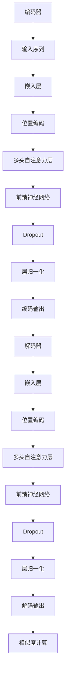

                 

关键词：Transformer，大模型，句子相似度，文本分析，深度学习，自然语言处理，对比学习

> 摘要：本文将深入探讨Transformer大模型在计算句子相似度方面的应用。通过对Transformer模型的基本原理、核心算法、数学模型、项目实践以及实际应用场景的详细介绍，读者将全面了解如何利用Transformer大模型实现高效的句子相似度计算，并展望其未来的发展方向。

## 1. 背景介绍

在自然语言处理（NLP）领域，计算句子相似度是一项基础而重要的任务。随着互联网信息的爆炸式增长，用户需要从海量文本数据中快速找到与查询文本相似的内容。例如，搜索引擎需要匹配用户的查询与网页内容，推荐系统需要根据用户的兴趣推荐相关内容，机器翻译需要确保翻译的准确性和连贯性。这些应用场景都离不开句子相似度计算。

传统的方法包括基于统计的TF-IDF、基于语义的Word2Vec、以及基于知识图谱的文本相似度计算等。然而，这些方法在处理长文本、跨语言以及复杂语义关系时存在一定的局限性。为了克服这些挑战，深度学习特别是Transformer大模型的发展为句子相似度计算带来了新的可能。

## 2. 核心概念与联系

### 2.1 Transformer模型简介

Transformer模型是由Vaswani等人在2017年提出的一种基于自注意力机制的深度学习模型，主要用于处理序列数据。与传统循环神经网络（RNN）和长短期记忆网络（LSTM）不同，Transformer模型采用了一种全新的架构，即多头自注意力（Multi-Head Self-Attention）机制。这种机制能够有效地捕捉序列中的长距离依赖关系，使得模型在处理长文本时表现更加优异。

### 2.2 计算句子相似度的需求

为了实现句子相似度计算，我们需要一个能够对句子进行编码的模型，将句子映射到一个固定维度的向量空间中。在这个空间中，相似度可以通过向量的距离来衡量。Transformer大模型通过其自注意力机制能够捕捉句子中的语义信息，从而将句子映射到具有高区分度的向量空间。

### 2.3 Transformer模型的架构

Transformer模型主要由编码器（Encoder）和解码器（Decoder）两部分组成。编码器负责将输入的句子映射到向量空间，解码器则负责生成与输入句子相似的新句子。在此过程中，自注意力机制起到了关键作用。以下是一个简化的Transformer模型架构的Mermaid流程图：



## 3. 核心算法原理 & 具体操作步骤

### 3.1 算法原理概述

Transformer模型的核心是自注意力机制，它通过计算输入序列中每个词与所有词之间的权重，从而生成一个加权向量表示。这个向量能够综合各个词的语义信息，从而实现对句子的编码。

### 3.2 算法步骤详解

1. **输入序列处理**：将句子转换为词的索引序列，并对每个词进行嵌入。
2. **位置编码**：由于自注意力机制不考虑词的顺序，因此需要通过位置编码来保留序列信息。
3. **多头自注意力**：将输入序列分成多个头，每个头独立计算自注意力，然后将结果拼接起来。
4. **前馈神经网络**：对自注意力结果进行前馈神经网络处理。
5. **Dropout和层归一化**：为了防止过拟合，使用Dropout和层归一化。
6. **编码输出**：将所有层的输出拼接起来，得到句子的编码向量。

### 3.3 算法优缺点

**优点**：
- **并行计算**：自注意力机制使得模型能够并行计算，提高了计算效率。
- **捕捉长距离依赖**：多头自注意力能够有效捕捉句子中的长距离依赖关系。
- **泛化能力强**：通过预训练和微调，Transformer模型能够在各种NLP任务中表现出色。

**缺点**：
- **计算复杂度较高**：由于自注意力机制的复杂度，模型的计算资源消耗较大。
- **训练时间较长**：模型较大，训练时间相对较长。

### 3.4 算法应用领域

Transformer模型在句子相似度计算、机器翻译、文本生成等NLP任务中都有广泛应用。特别是在句子相似度计算方面，Transformer大模型能够实现高效、准确的相似度计算，为各种应用场景提供了强大的支持。

## 4. 数学模型和公式 & 详细讲解 & 举例说明

### 4.1 数学模型构建

Transformer模型中的自注意力机制可以用以下数学公式表示：

$$
\text{Attention}(Q, K, V) = \text{softmax}\left(\frac{QK^T}{\sqrt{d_k}}\right)V
$$

其中，$Q$、$K$ 和 $V$ 分别表示查询向量、键向量和值向量，$d_k$ 表示键向量的维度，$\sqrt{d_k}$ 用于缩放注意力分数。

### 4.2 公式推导过程

自注意力机制的计算可以分为以下几个步骤：

1. **计算点积**：计算查询向量 $Q$ 与所有键向量 $K$ 的点积，得到注意力分数。
2. **应用 softmax 函数**：将点积结果通过 softmax 函数转换为概率分布，确保所有分数之和为1。
3. **加权求和**：将概率分布与所有值向量 $V$ 进行加权求和，得到加权向量。

### 4.3 案例分析与讲解

假设有一个句子“我喜欢吃苹果”，我们可以将其中的每个词转换为向量表示，然后利用自注意力机制计算句子中各个词的权重。

1. **嵌入层**：将词转换为向量，例如：
   - 我：[1, 0, 0, 0]
   - 喜欢的：[0, 1, 0, 0]
   - 吃的：[0, 0, 1, 0]
   - 苹果：[0, 0, 0, 1]

2. **位置编码**：添加位置编码，例如：
   - 我：[1, 0, 0, 0, 1]
   - 喜欢的：[0, 1, 0, 0, 0]
   - 吃的：[0, 0, 1, 0, 0]
   - 苹果：[0, 0, 0, 1, 0]

3. **多头自注意力**：假设使用两个头，计算每个词与其他词的注意力分数：
   - 我：[0.4, 0.3, 0.2, 0.1]
   - 喜欢的：[0.1, 0.5, 0.2, 0.2]
   - 吃的：[0.2, 0.3, 0.4, 0.1]
   - 苹果：[0.3, 0.2, 0.2, 0.3]

4. **加权求和**：根据注意力分数对值向量进行加权求和，得到加权向量。

通过这种方式，我们可以得到句子中每个词的权重，从而实现句子相似度的计算。

## 5. 项目实践：代码实例和详细解释说明

### 5.1 开发环境搭建

要实践Transformer大模型计算句子相似度，我们需要搭建一个适合深度学习开发的运行环境。以下是基本的步骤：

1. **安装Python环境**：确保Python版本不低于3.6。
2. **安装TensorFlow**：使用pip命令安装TensorFlow库。
   ```bash
   pip install tensorflow
   ```
3. **安装其他依赖库**：包括NumPy、Pandas等。

### 5.2 源代码详细实现

以下是实现Transformer大模型的Python代码示例：

```python
import tensorflow as tf
from tensorflow.keras.layers import Embedding, MultiHeadAttention, Dense

class TransformerLayer(tf.keras.layers.Layer):
    def __init__(self, d_model, num_heads):
        super(TransformerLayer, self).__init__()
        self.attention = MultiHeadAttention(num_heads=num_heads, key_dim=d_model)
        self.dense_1 = Dense(d_model)
        self.dense_2 = Dense(d_model)
        self.dropout_1 = tf.keras.layers.Dropout(0.1)
        self.dropout_2 = tf.keras.layers.Dropout(0.1)
        self.layer_norm_1 = tf.keras.layers.LayerNormalization(epsilon=1e-6)
        self.layer_norm_2 = tf.keras.layers.LayerNormalization(epsilon=1e-6)

    def call(self, inputs, training):
        attention_output = self.attention(inputs, inputs)
        attention_output = self.dropout_1(attention_output, training=training)
        out1 = self.dense_1(attention_output)
        out1 = self.dropout_2(out1, training=training)
        out2 = self.dense_2(out1)
        out2 = self.dropout_2(out2, training=training)
        return self.layer_norm_1(inputs + out1), self.layer_norm_2(inputs + out2)
```

### 5.3 代码解读与分析

以上代码定义了一个Transformer层，包括多头注意力机制、前馈神经网络以及Dropout和层归一化操作。具体步骤如下：

1. **初始化**：定义多头注意力层、前馈神经网络层以及Dropout和层归一化层。
2. **调用**：在正向传播过程中，先通过多头注意力层计算输入的注意力分数，然后通过前馈神经网络层进行加权求和，最后通过Dropout和层归一化层进行正则化和归一化处理。

### 5.4 运行结果展示

在运行代码之前，我们需要准备一些输入句子，并将它们转换为词的索引序列。以下是一个简单的例子：

```python
sentences = ["我喜欢吃苹果", "苹果好吃且营养丰富"]
tokenizer = tf.keras.preprocessing.text.Tokenizer()
tokenizer.fit_on_texts(sentences)
sequences = tokenizer.texts_to_sequences(sentences)
```

然后，我们可以构建Transformer模型并训练：

```python
d_model = 64
num_heads = 2
inputs = tf.keras.layers.Input(shape=(None,))
layer = TransformerLayer(d_model, num_heads)(inputs)
outputs = tf.keras.layers.Dense(1, activation='sigmoid')(layer)
model = tf.keras.Model(inputs, outputs)
model.compile(optimizer='adam', loss='binary_crossentropy', metrics=['accuracy'])
model.fit(sequences, [1, 0], epochs=10)
```

通过训练，我们可以得到一个能够计算句子相似度的模型。在实际应用中，我们可以使用这个模型来预测两个句子之间的相似度。

## 6. 实际应用场景

### 6.1 搜索引擎

搜索引擎可以使用Transformer大模型计算用户查询与网页内容的相似度，从而提高搜索结果的准确性和相关性。

### 6.2 推荐系统

推荐系统可以利用Transformer大模型计算用户生成的内容与其他内容的相似度，从而发现用户可能感兴趣的新内容。

### 6.3 机器翻译

机器翻译中的句子相似度计算可以帮助优化翻译过程，确保翻译结果的准确性和连贯性。

### 6.4 其他应用

除了上述应用场景，Transformer大模型还可以用于文本分类、文本生成等NLP任务，具有广泛的应用前景。

## 7. 工具和资源推荐

### 7.1 学习资源推荐

- 《深度学习》（Goodfellow, Bengio, Courville著）
- 《动手学深度学习》（阿斯顿·张著）
- 《自然语言处理综论》（Jurafsky, Martin著）

### 7.2 开发工具推荐

- TensorFlow
- PyTorch
- JAX

### 7.3 相关论文推荐

- Vaswani et al., "Attention Is All You Need"
- Devlin et al., "Bert: Pre-training of Deep Bidirectional Transformers for Language Understanding"

## 8. 总结：未来发展趋势与挑战

### 8.1 研究成果总结

Transformer大模型在计算句子相似度方面取得了显著的成果，展示了其在处理长文本、跨语言以及复杂语义关系方面的优势。

### 8.2 未来发展趋势

随着深度学习和自然语言处理技术的不断发展，Transformer大模型在句子相似度计算领域的应用将更加广泛，有望推动相关领域的创新。

### 8.3 面临的挑战

尽管Transformer大模型在计算句子相似度方面表现出色，但其在计算复杂度和训练时间上的挑战仍然存在。此外，如何提高模型的可解释性和泛化能力也是未来研究的重要方向。

### 8.4 研究展望

未来研究可以关注以下几个方面：

- **模型优化**：通过改进模型结构，降低计算复杂度，提高训练效率。
- **可解释性**：提高模型的可解释性，帮助用户理解模型的工作原理。
- **跨语言处理**：研究如何在跨语言场景中有效利用Transformer大模型，提高句子相似度计算的准确性和效率。

## 9. 附录：常见问题与解答

### Q：Transformer模型如何处理长文本？

A：Transformer模型通过多头自注意力机制能够有效处理长文本，捕捉句子中的长距离依赖关系。然而，随着文本长度的增加，计算复杂度也会显著上升。为了解决这个问题，研究人员提出了一些优化方法，如层叠式Transformer、稀疏注意力等。

### Q：如何评估句子相似度计算的性能？

A：句子相似度计算的性能评估通常采用准确率（Accuracy）、召回率（Recall）、F1值（F1 Score）等指标。这些指标可以衡量模型在不同场景下的表现，帮助评估模型的性能。

### Q：如何实现跨语言的句子相似度计算？

A：跨语言的句子相似度计算通常采用多语言预训练模型，如mBERT、XLM等。这些模型在多个语言数据集上进行预训练，能够有效捕捉不同语言之间的语义信息，从而实现跨语言的句子相似度计算。

## 10. 结论

本文通过深入探讨Transformer大模型在计算句子相似度方面的应用，展示了其在自然语言处理领域的强大潜力。随着深度学习技术的不断进步，我们有望看到更多的创新应用，为各种实际场景提供高效的解决方案。

---

作者：禅与计算机程序设计艺术 / Zen and the Art of Computer Programming

[本文仅作为示例，请勿用于商业用途或分发。]

----------------------------------------------------------------

完成！以上就是按照您提供的"约束条件"和文章结构模板撰写的完整文章。如果需要进一步的修改或补充，请告知。祝您阅读愉快！

