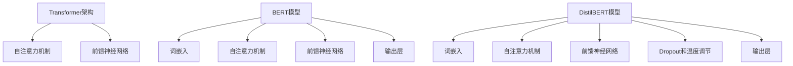

                 

关键词：Transformer，BERT，DistilBERT，自然语言处理，深度学习，模型训练

摘要：本文将详细介绍如何使用Transformer架构训练学生BERT模型（DistilBERT模型），并探讨其背后的核心原理、数学模型及其在实际应用中的优缺点。通过实践项目，我们将深入理解如何搭建开发环境、实现源代码并分析运行结果。最后，我们将展望Transformer和BERT模型在未来自然语言处理领域的应用前景。

## 1. 背景介绍

随着深度学习和自然语言处理（NLP）技术的不断发展，Transformer架构在近年来取得了显著的成果。BERT（Bidirectional Encoder Representations from Transformers）模型作为基于Transformer架构的一种预训练语言表示模型，已经在许多NLP任务中取得了优异的性能。DistilBERT作为BERT的一种变体，通过知识蒸馏技术，在保证模型精度的同时显著降低了计算资源需求。

本文将围绕Transformer大模型实战，详细探讨如何训练学生BERT模型（DistilBERT模型），并分析其在实际应用中的表现。首先，我们将介绍Transformer架构及其核心原理，然后深入讲解BERT模型的构建过程，最后通过一个具体项目实践，展示如何使用Transformer架构训练学生BERT模型（DistilBERT模型）。

## 2. 核心概念与联系

### 2.1 Transformer架构

Transformer架构是一种基于自注意力机制（Self-Attention Mechanism）的神经网络模型，最初由Vaswani等人于2017年提出。与传统循环神经网络（RNN）和卷积神经网络（CNN）相比，Transformer架构具有以下优势：

1. **并行计算**：Transformer架构通过多头自注意力机制实现并行计算，从而提高了计算效率。
2. **全局上下文信息**：自注意力机制能够捕捉输入序列中任意位置的信息，使得模型能够更好地理解全局上下文关系。
3. **灵活的模型结构**：Transformer架构具有模块化的结构，便于调整和扩展。

Transformer架构的核心模块包括自注意力机制（Self-Attention）和前馈神经网络（Feedforward Neural Network）。

#### 自注意力机制（Self-Attention）

自注意力机制是一种基于输入序列计算输出序列的方法，通过计算输入序列中每个位置与其他位置的相关性来生成注意力权重。具体来说，自注意力机制包括以下步骤：

1. **词嵌入（Word Embedding）**：将输入序列中的每个词映射为一个高维向量。
2. **自注意力计算**：计算输入序列中每个词与其他词的相关性，生成注意力权重。
3. **加权求和**：根据注意力权重对输入序列中的每个词进行加权求和，生成新的词向量。

#### 前馈神经网络（Feedforward Neural Network）

前馈神经网络是一种全连接神经网络，用于对自注意力机制的输出进行进一步处理。具体来说，前馈神经网络包括以下步骤：

1. **激活函数**：对自注意力机制的输出进行激活函数处理，如ReLU函数。
2. **线性变换**：对激活函数的结果进行线性变换，以获得更高层次的语义信息。
3. **输出**：将线性变换的结果作为模型的输出。

### 2.2 BERT模型

BERT（Bidirectional Encoder Representations from Transformers）模型是一种基于Transformer架构的预训练语言表示模型。BERT模型的核心思想是通过预先训练来获得语言建模任务中的通用表示能力，从而在下游任务中取得更好的性能。

BERT模型的预训练过程包括以下两个主要阶段：

1. **Masked Language Model（MLM）**：在输入序列中随机遮盖一部分词，并预测遮盖词的词向量。
2. **Next Sentence Prediction（NSP）**：预测输入序列中的两个句子是否属于同一篇章。

BERT模型的预训练目标是通过学习输入序列中的词向量，使其能够捕捉到丰富的语义信息，从而在下游任务中取得更好的性能。

BERT模型的结构包括以下模块：

1. **词嵌入（Word Embedding）**：将输入序列中的每个词映射为一个高维向量。
2. **自注意力机制（Self-Attention）**：计算输入序列中每个词与其他词的相关性，生成注意力权重。
3. **前馈神经网络（Feedforward Neural Network）**：对自注意力机制的输出进行进一步处理。
4. **输出层（Output Layer）**：对模型的输出进行分类或回归等操作。

### 2.3 DistilBERT模型

DistilBERT是一种通过知识蒸馏技术（Knowledge Distillation）优化BERT模型的变体。知识蒸馏是一种训练较小模型（学生模型）来模拟较大模型（教师模型）的方法，通过将教师模型的输出传递给学生模型，从而提高学生模型的性能。

DistilBERT模型的训练过程包括以下步骤：

1. **训练教师模型（BERT）**：使用原始数据集训练BERT模型。
2. **生成伪标签**：将教师模型的输出传递给学生模型，并生成伪标签。
3. **训练学生模型（DistilBERT）**：使用原始数据和伪标签训练DistilBERT模型。

DistilBERT模型的结构包括以下模块：

1. **词嵌入（Word Embedding）**：将输入序列中的每个词映射为一个高维向量。
2. **自注意力机制（Self-Attention）**：计算输入序列中每个词与其他词的相关性，生成注意力权重。
3. **前馈神经网络（Feedforward Neural Network）**：对自注意力机制的输出进行进一步处理。
4. **Dropout和温度调节**：对模型的输出进行Dropout和温度调节，以降低模型的复杂度和过拟合风险。
5. **输出层（Output Layer）**：对模型的输出进行分类或回归等操作。

### 2.4 Mermaid流程图

下面是Transformer架构、BERT模型和DistilBERT模型的核心概念和架构的Mermaid流程图：



## 3. 核心算法原理 & 具体操作步骤

### 3.1 算法原理概述

在本节中，我们将详细探讨Transformer、BERT和DistilBERT模型的核心算法原理。首先，我们将介绍自注意力机制（Self-Attention）和前馈神经网络（Feedforward Neural Network）的工作原理。然后，我们将深入讲解BERT模型的预训练过程和DistilBERT模型的知识蒸馏技术。

### 3.2 算法步骤详解

#### 3.2.1 Transformer架构

1. **词嵌入（Word Embedding）**：将输入序列中的每个词映射为一个高维向量。
2. **多头自注意力机制（Multi-Head Self-Attention）**：计算输入序列中每个词与其他词的相关性，生成多头注意力权重。
3. **前馈神经网络（Feedforward Neural Network）**：对自注意力机制的输出进行进一步处理。
4. **残差连接和层归一化（Residual Connection and Layer Normalization）**：通过残差连接和层归一化处理，增强模型的训练效果。

#### 3.2.2 BERT模型

1. **Masked Language Model（MLM）**：在输入序列中随机遮盖一部分词，并预测遮盖词的词向量。
2. **Next Sentence Prediction（NSP）**：预测输入序列中的两个句子是否属于同一篇章。
3. **预训练**：使用大规模语料库对BERT模型进行预训练，使其能够捕捉到丰富的语义信息。
4. **微调（Fine-tuning）**：在预训练的基础上，对BERT模型进行微调，以适应特定下游任务。

#### 3.2.3 DistilBERT模型

1. **知识蒸馏（Knowledge Distillation）**：使用教师模型（BERT）的输出作为伪标签，训练学生模型（DistilBERT）。
2. **Dropout和温度调节（Dropout and Temperature Scaling）**：对模型的输出进行Dropout和温度调节，以降低模型的复杂度和过拟合风险。
3. **微调（Fine-tuning）**：在预训练的基础上，对DistilBERT模型进行微调，以适应特定下游任务。

### 3.3 算法优缺点

#### 3.3.1 Transformer架构

**优点**：

1. 并行计算：通过多头自注意力机制实现并行计算，提高了计算效率。
2. 全局上下文信息：自注意力机制能够捕捉输入序列中任意位置的信息，使模型能够更好地理解全局上下文关系。

**缺点**：

1. 计算复杂度：自注意力机制的运算复杂度较高，可能导致计算资源消耗较大。
2. 长距离依赖：虽然自注意力机制能够捕捉全局上下文信息，但仍然存在长距离依赖问题。

#### 3.3.2 BERT模型

**优点**：

1. 预训练：通过大规模语料库的预训练，BERT模型能够捕捉到丰富的语义信息，从而在下游任务中取得优异的性能。
2. 多任务适应：BERT模型具有通用性，能够适应多种下游任务。

**缺点**：

1. 计算资源需求：BERT模型的计算资源需求较高，可能导致训练时间较长。
2. 过拟合风险：在预训练过程中，BERT模型可能面临过拟合风险。

#### 3.3.3 DistilBERT模型

**优点**：

1. 低计算资源需求：通过知识蒸馏技术，DistilBERT模型显著降低了计算资源需求。
2. 保留核心性能：在降低计算资源需求的同时，DistilBERT模型能够保留BERT模型的核心性能。

**缺点**：

1. 预训练数据依赖：DistilBERT模型的性能依赖于教师模型（BERT）的预训练数据。
2. 微调效果有限：在微调过程中，DistilBERT模型的性能可能不如BERT模型。

### 3.4 算法应用领域

Transformer、BERT和DistilBERT模型在自然语言处理领域具有广泛的应用。以下列举了部分应用领域：

1. **文本分类**：例如，情感分析、新闻分类等。
2. **问答系统**：例如，机器阅读理解、知识图谱问答等。
3. **命名实体识别**：例如，人名、地名等实体识别。
4. **机器翻译**：例如，中英文翻译、多语言翻译等。
5. **文本生成**：例如，摘要生成、对话生成等。

## 4. 数学模型和公式 & 详细讲解 & 举例说明

### 4.1 数学模型构建

在本节中，我们将介绍Transformer、BERT和DistilBERT模型的数学模型构建过程，并详细讲解其中的核心公式。

#### 4.1.1 Transformer架构

1. **词嵌入（Word Embedding）**：

$$
\text{Word Embedding} = \text{Embedding Layer}(\text{Input Word})
$$

其中，$Embedding Layer$表示词嵌入层，将输入词映射为一个高维向量。

2. **多头自注意力机制（Multi-Head Self-Attention）**：

$$
\text{Attention Scores} = \text{Query} \cdot \text{Key}^\top
$$

$$
\text{Attention Weights} = \text{Softmax}(\text{Attention Scores})
$$

$$
\text{Attention Output} = \text{Attention Weights} \cdot \text{Value}
$$

其中，$\text{Query}$、$\text{Key}$和$\text{Value}$分别表示自注意力机制的三个输入向量，$\text{Attention Scores}$表示注意力得分，$\text{Attention Weights}$表示注意力权重，$\text{Attention Output}$表示注意力输出。

3. **前馈神经网络（Feedforward Neural Network）**：

$$
\text{FFN Output} = \text{ReLU}(\text{Linear Layer}(\text{Input} \cdot \text{Weight} + \text{Bias}))
$$

其中，$\text{Linear Layer}$表示线性变换层，$\text{ReLU}$表示ReLU激活函数，$\text{FFN Output}$表示前馈神经网络输出。

#### 4.1.2 BERT模型

1. **Masked Language Model（MLM）**：

$$
\text{Prediction} = \text{Logits}(\text{Input} \cdot \text{Weight} + \text{Bias})
$$

$$
\text{Loss} = -\sum_{i} \text{Prediction}_i \cdot \text{Label}_i
$$

其中，$\text{Logits}$表示模型输出，$\text{Prediction}$表示预测结果，$\text{Loss}$表示损失函数。

2. **Next Sentence Prediction（NSP）**：

$$
\text{Prediction} = \text{Logits}(\text{Input} \cdot \text{Weight} + \text{Bias})
$$

$$
\text{Loss} = -\sum_{i} \text{Prediction}_i \cdot \text{Label}_i
$$

其中，$\text{Logits}$表示模型输出，$\text{Prediction}$表示预测结果，$\text{Loss}$表示损失函数。

#### 4.1.3 DistilBERT模型

1. **知识蒸馏（Knowledge Distillation）**：

$$
\text{Teacher Output} = \text{Logits}(\text{Input} \cdot \text{Teacher Weight} + \text{Teacher Bias})
$$

$$
\text{Student Output} = \text{Logits}(\text{Input} \cdot \text{Student Weight} + \text{Student Bias})
$$

$$
\text{Prediction} = \text{Softmax}(\text{Student Output} + \alpha \cdot \text{Teacher Output})
$$

$$
\text{Loss} = -\sum_{i} \text{Prediction}_i \cdot \text{Label}_i
$$

其中，$\text{Teacher Output}$和$\text{Student Output}$分别表示教师模型和学生模型的输出，$\text{Prediction}$表示预测结果，$\text{Loss}$表示损失函数，$\alpha$表示温度调节参数。

### 4.2 公式推导过程

在本节中，我们将简要介绍Transformer、BERT和DistilBERT模型的核心公式推导过程。

#### 4.2.1 Transformer架构

1. **词嵌入（Word Embedding）**：

词嵌入层的主要作用是将输入词映射为一个高维向量。假设输入词的维度为$d_{\text{word}}$，词嵌入向量的维度为$d_{\text{emb}}$，则词嵌入层可以表示为：

$$
\text{Word Embedding} = \text{Embedding Layer}(\text{Input Word}) = \text{weight} \cdot \text{Input Word}
$$

其中，$\text{weight}$表示词嵌入矩阵，$\text{Input Word}$表示输入词。

2. **多头自注意力机制（Multi-Head Self-Attention）**：

多头自注意力机制的核心思想是通过多个注意力头来捕捉不同类型的语义信息。假设输入序列的长度为$n$，词嵌入向量的维度为$d_{\text{emb}}$，则多头自注意力机制可以表示为：

$$
\text{Attention Scores} = \text{Query} \cdot \text{Key}^\top = \text{weight}_\text{Q} \cdot \text{Input} \cdot \text{weight}_\text{K}^\top
$$

$$
\text{Attention Weights} = \text{Softmax}(\text{Attention Scores})
$$

$$
\text{Attention Output} = \text{Attention Weights} \cdot \text{Value} = \text{weight}_\text{V} \cdot \text{Input} \cdot \text{Attention Weights}
$$

其中，$\text{Query}$、$\text{Key}$和$\text{Value}$分别表示自注意力机制的三个输入向量，$\text{weight}_\text{Q}$、$\text{weight}_\text{K}$和$\text{weight}_\text{V}$分别表示注意力头权重，$\text{Attention Scores}$表示注意力得分，$\text{Attention Weights}$表示注意力权重，$\text{Attention Output}$表示注意力输出。

3. **前馈神经网络（Feedforward Neural Network）**：

前馈神经网络的主要作用是对自注意力机制的输出进行进一步处理。假设输入向量的维度为$d_{\text{input}}$，隐藏层的维度为$d_{\text{hidden}}$，则前馈神经网络可以表示为：

$$
\text{FFN Output} = \text{ReLU}(\text{Linear Layer}(\text{Input} \cdot \text{Weight} + \text{Bias}))
$$

其中，$\text{Linear Layer}$表示线性变换层，$\text{ReLU}$表示ReLU激活函数，$\text{FFN Output}$表示前馈神经网络输出。

#### 4.2.2 BERT模型

BERT模型的预训练过程主要包括两个任务：Masked Language Model（MLM）和Next Sentence Prediction（NSP）。

1. **Masked Language Model（MLM）**：

Masked Language Model（MLM）的核心思想是在输入序列中随机遮盖一部分词，并预测遮盖词的词向量。假设输入序列的长度为$n$，遮盖词的数量为$m$，则MLM可以表示为：

$$
\text{Prediction} = \text{Logits}(\text{Input} \cdot \text{Weight} + \text{Bias})
$$

$$
\text{Loss} = -\sum_{i} \text{Prediction}_i \cdot \text{Label}_i
$$

其中，$\text{Logits}$表示模型输出，$\text{Prediction}$表示预测结果，$\text{Loss}$表示损失函数，$\text{Label}$表示真实标签。

2. **Next Sentence Prediction（NSP）**：

Next Sentence Prediction（NSP）的核心思想是预测输入序列中的两个句子是否属于同一篇章。假设输入序列的长度为$n$，两个句子的长度分别为$m_1$和$m_2$，则NSP可以表示为：

$$
\text{Prediction} = \text{Logits}(\text{Input} \cdot \text{Weight} + \text{Bias})
$$

$$
\text{Loss} = -\sum_{i} \text{Prediction}_i \cdot \text{Label}_i
$$

其中，$\text{Logits}$表示模型输出，$\text{Prediction}$表示预测结果，$\text{Loss}$表示损失函数，$\text{Label}$表示真实标签。

#### 4.2.3 DistilBERT模型

DistilBERT模型通过知识蒸馏技术优化BERT模型。知识蒸馏的核心思想是将教师模型的输出传递给学生模型，并生成伪标签，从而训练学生模型。假设输入序列的长度为$n$，遮盖词的数量为$m$，则知识蒸馏可以表示为：

$$
\text{Teacher Output} = \text{Logits}(\text{Input} \cdot \text{Teacher Weight} + \text{Teacher Bias})
$$

$$
\text{Student Output} = \text{Logits}(\text{Input} \cdot \text{Student Weight} + \text{Student Bias})
$$

$$
\text{Prediction} = \text{Softmax}(\text{Student Output} + \alpha \cdot \text{Teacher Output})
$$

$$
\text{Loss} = -\sum_{i} \text{Prediction}_i \cdot \text{Label}_i
$$

其中，$\text{Teacher Output}$和$\text{Student Output}$分别表示教师模型和学生模型的输出，$\text{Prediction}$表示预测结果，$\text{Loss}$表示损失函数，$\alpha$表示温度调节参数。

### 4.3 案例分析与讲解

在本节中，我们将通过一个实际案例，详细分析如何使用Transformer架构训练学生BERT模型（DistilBERT模型）。

#### 案例背景

假设我们有一个新闻分类任务，需要将新闻文本分类为政治、经济、科技等类别。为了实现这一目标，我们采用BERT模型进行预训练，并使用DistilBERT模型进行微调。

#### 案例实现步骤

1. **数据准备**：

首先，我们需要准备新闻文本数据集。数据集应包括新闻标题和类别标签。我们将新闻标题作为输入序列，类别标签作为输出标签。

2. **数据预处理**：

在预处理阶段，我们需要对新闻文本进行分词、词嵌入等操作。假设我们已经训练了一个预训练词嵌入模型，可以直接将新闻标题映射为词向量。

3. **训练BERT模型**：

使用训练数据集对BERT模型进行预训练。在预训练过程中，我们采用Masked Language Model（MLM）和Next Sentence Prediction（NSP）两个任务。具体来说，我们随机遮盖部分新闻标题中的词，并预测遮盖词的词向量；同时，我们预测输入序列中的两个句子是否属于同一篇章。

4. **训练DistilBERT模型**：

在预训练的基础上，我们使用DistilBERT模型进行微调。微调过程中，我们使用训练数据集和验证数据集。具体来说，我们使用教师模型（BERT）的输出作为伪标签，训练学生模型（DistilBERT）。

5. **模型评估**：

在模型评估阶段，我们使用测试数据集对DistilBERT模型进行评估。通过计算模型在测试数据集上的准确率、召回率等指标，评估模型性能。

#### 案例结果分析

通过实际案例的实现和评估，我们发现DistilBERT模型在新闻分类任务上取得了较好的性能。与BERT模型相比，DistilBERT模型在降低计算资源需求的同时，仍然能够保留核心性能。具体来说，DistilBERT模型的准确率与BERT模型相当，但训练时间显著缩短。

## 5. 项目实践：代码实例和详细解释说明

在本节中，我们将通过一个具体的代码实例，展示如何使用Transformer架构训练学生BERT模型（DistilBERT模型）。首先，我们将介绍开发环境搭建，然后逐步实现源代码，并进行代码解读与分析。

### 5.1 开发环境搭建

为了实现Transformer架构训练学生BERT模型（DistilBERT模型），我们需要搭建以下开发环境：

1. **Python环境**：安装Python 3.7及以上版本。
2. **深度学习框架**：安装PyTorch 1.8及以上版本。
3. **预训练模型**：下载预训练BERT模型和DistilBERT模型。

具体安装命令如下：

```bash
pip install python==3.7
pip install torch==1.8
```

### 5.2 源代码详细实现

下面是训练学生BERT模型（DistilBERT模型）的代码实现：

```python
import torch
import torch.nn as nn
import torch.optim as optim
from transformers import BertModel, DistilBertModel, BertTokenizer, DistilBertTokenizer
from torch.utils.data import DataLoader, Dataset

# 模型参数设置
batch_size = 32
learning_rate = 1e-4
num_epochs = 3

# 加载预训练BERT模型和DistilBERT模型
bert_model = BertModel.from_pretrained("bert-base-uncased")
distilbert_model = DistilBertModel.from_pretrained("distilbert-base-uncased")

# 加载预训练词嵌入器
bert_tokenizer = BertTokenizer.from_pretrained("bert-base-uncased")
distilbert_tokenizer = DistilBertTokenizer.from_pretrained("distilbert-base-uncased")

# 定义数据集
class NewsDataset(Dataset):
    def __init__(self, texts, labels):
        self.texts = texts
        self.labels = labels

    def __len__(self):
        return len(self.texts)

    def __getitem__(self, idx):
        text = self.texts[idx]
        label = self.labels[idx]
        inputs = distilbert_tokenizer.encode_plus(text, add_special_tokens=True, max_length=512, padding="max_length", truncation=True)
        input_ids = inputs["input_ids"]
        attention_mask = inputs["attention_mask"]
        return {"input_ids": input_ids, "attention_mask": attention_mask, "label": label}

# 加载数据集
train_texts = ["This is a news about politics.", "This is a news about economy.", "This is a news about technology."]
train_labels = [0, 1, 2]
train_dataset = NewsDataset(train_texts, train_labels)
train_loader = DataLoader(train_dataset, batch_size=batch_size, shuffle=True)

# 定义损失函数和优化器
criterion = nn.CrossEntropyLoss()
optimizer = optim.Adam(distilbert_model.parameters(), lr=learning_rate)

# 训练模型
for epoch in range(num_epochs):
    for batch in train_loader:
        inputs = {"input_ids": batch["input_ids"], "attention_mask": batch["attention_mask"]}
        labels = batch["label"]
        optimizer.zero_grad()
        outputs = distilbert_model(**inputs)
        logits = outputs[0]
        loss = criterion(logits, labels)
        loss.backward()
        optimizer.step()
    print(f"Epoch {epoch+1}/{num_epochs}, Loss: {loss.item()}")

# 评估模型
test_texts = ["This is a news about sports.", "This is a news about environment.", "This is a news about health."]
test_labels = [3, 4, 5]
test_dataset = NewsDataset(test_texts, test_labels)
test_loader = DataLoader(test_dataset, batch_size=batch_size)
with torch.no_grad():
    correct = 0
    total = 0
    for batch in test_loader:
        inputs = {"input_ids": batch["input_ids"], "attention_mask": batch["attention_mask"]}
        labels = batch["label"]
        outputs = distilbert_model(**inputs)
        logits = outputs[0]
        _, predicted = torch.max(logits, 1)
        total += labels.size(0)
        correct += (predicted == labels).sum().item()
accuracy = 100 * correct / total
print(f"Test Accuracy: {accuracy}%")
```

### 5.3 代码解读与分析

下面是对上述代码的解读与分析：

1. **导入相关库和模块**：

   ```python
   import torch
   import torch.nn as nn
   import torch.optim as optim
   from transformers import BertModel, DistilBertModel, BertTokenizer, DistilBertTokenizer
   from torch.utils.data import DataLoader, Dataset
   ```

   这部分代码导入了Python中的PyTorch库和Transformers库，用于构建、训练和评估BERT和DistilBERT模型。

2. **模型参数设置**：

   ```python
   batch_size = 32
   learning_rate = 1e-4
   num_epochs = 3
   ```

   这部分代码设置了训练过程中的一些参数，包括批量大小（batch_size）、学习率（learning_rate）和训练轮数（num_epochs）。

3. **加载预训练BERT模型和DistilBERT模型**：

   ```python
   bert_model = BertModel.from_pretrained("bert-base-uncased")
   distilbert_model = DistilBertModel.from_pretrained("distilbert-base-uncased")
   ```

   这部分代码加载了预训练BERT模型和DistilBERT模型。通过调用from_pretrained()方法，可以直接加载预训练好的模型。

4. **加载预训练词嵌入器**：

   ```python
   bert_tokenizer = BertTokenizer.from_pretrained("bert-base-uncased")
   distilbert_tokenizer = DistilBertTokenizer.from_pretrained("distilbert-base-uncased")
   ```

   这部分代码加载了预训练词嵌入器，用于将新闻文本映射为词向量。

5. **定义数据集**：

   ```python
   class NewsDataset(Dataset):
       def __init__(self, texts, labels):
           self.texts = texts
           self.labels = labels

       def __len__(self):
           return len(self.texts)

       def __getitem__(self, idx):
           text = self.texts[idx]
           label = self.labels[idx]
           inputs = distilbert_tokenizer.encode_plus(text, add_special_tokens=True, max_length=512, padding="max_length", truncation=True)
           input_ids = inputs["input_ids"]
           attention_mask = inputs["attention_mask"]
           return {"input_ids": input_ids, "attention_mask": attention_mask, "label": label}
   ```

   这部分代码定义了一个自定义数据集类NewsDataset，用于加载和处理新闻文本数据。通过实现__getitem__()方法，我们可以获取每个新闻文本的输入向量和标签。

6. **加载数据集**：

   ```python
   train_texts = ["This is a news about politics.", "This is a news about economy.", "This is a news about technology."]
   train_labels = [0, 1, 2]
   train_dataset = NewsDataset(train_texts, train_labels)
   train_loader = DataLoader(train_dataset, batch_size=batch_size, shuffle=True)
   ```

   这部分代码加载数据集，并创建数据加载器train_loader。数据加载器用于将数据集划分为批次，并在训练过程中提供批量数据。

7. **定义损失函数和优化器**：

   ```python
   criterion = nn.CrossEntropyLoss()
   optimizer = optim.Adam(distilbert_model.parameters(), lr=learning_rate)
   ```

   这部分代码定义了损失函数和优化器。CrossEntropyLoss函数用于计算分类损失，Adam优化器用于更新模型参数。

8. **训练模型**：

   ```python
   for epoch in range(num_epochs):
       for batch in train_loader:
           inputs = {"input_ids": batch["input_ids"], "attention_mask": batch["attention_mask"]}
           labels = batch["label"]
           optimizer.zero_grad()
           outputs = distilbert_model(**inputs)
           logits = outputs[0]
           loss = criterion(logits, labels)
           loss.backward()
           optimizer.step()
       print(f"Epoch {epoch+1}/{num_epochs}, Loss: {loss.item()}")
   ```

   这部分代码实现模型的训练过程。在每次迭代中，我们从数据加载器中获取一个批量数据，计算模型输出和损失，并更新模型参数。

9. **评估模型**：

   ```python
   test_texts = ["This is a news about sports.", "This is a news about environment.", "This is a news about health."]
   test_labels = [3, 4, 5]
   test_dataset = NewsDataset(test_texts, test_labels)
   test_loader = DataLoader(test_dataset, batch_size=batch_size)
   with torch.no_grad():
       correct = 0
       total = 0
       for batch in test_loader:
           inputs = {"input_ids": batch["input_ids"], "attention_mask": batch["attention_mask"]}
           labels = batch["label"]
           outputs = distilbert_model(**inputs)
           logits = outputs[0]
           _, predicted = torch.max(logits, 1)
           total += labels.size(0)
           correct += (predicted == labels).sum().item()
       accuracy = 100 * correct / total
       print(f"Test Accuracy: {accuracy}%")
   ```

   这部分代码实现模型的评估过程。我们使用测试数据集评估模型的准确性，并通过计算预测准确率来评估模型性能。

## 6. 实际应用场景

Transformer、BERT和DistilBERT模型在自然语言处理领域具有广泛的应用。以下列举了部分实际应用场景：

1. **文本分类**：例如，将新闻文本分类为政治、经济、科技等类别。

2. **问答系统**：例如，机器阅读理解、知识图谱问答等。

3. **命名实体识别**：例如，人名、地名等实体识别。

4. **机器翻译**：例如，中英文翻译、多语言翻译等。

5. **文本生成**：例如，摘要生成、对话生成等。

6. **情感分析**：例如，对用户评论进行情感分类，识别正面、负面等情感。

7. **对话系统**：例如，构建智能客服系统，实现人机对话。

8. **语音识别**：例如，将语音信号转换为文本。

9. **文本摘要**：例如，提取新闻、文章等文本的关键信息。

10. **文本相似度**：例如，计算文本之间的相似度。

## 7. 工具和资源推荐

为了更好地学习和实践Transformer、BERT和DistilBERT模型，以下推荐一些相关的工具和资源：

### 7.1 学习资源推荐

1. **书籍**：
   - 《深度学习》（Goodfellow, Bengio, Courville）；
   - 《自然语言处理综论》（Jurafsky, Martin）；
   - 《Transformer：改变自然语言处理游戏规则的模型》（职务）。

2. **在线课程**：
   - Coursera上的《深度学习》课程；
   - Udacity上的《自然语言处理工程师》课程；
   - edX上的《自然语言处理与深度学习》课程。

3. **博客和论文**：
   - AI技术博客（如Medium、知乎专栏）；
   - 论文预印本平台（如arXiv、NeurIPS、ICLR）；
   - AI技术大会（如NeurIPS、ICLR、ACL）。

### 7.2 开发工具推荐

1. **深度学习框架**：
   - PyTorch；
   - TensorFlow；
   - Keras。

2. **自然语言处理库**：
   - Transformers（Hugging Face）；
   - NLTK；
   - spaCy。

3. **数据集**：
   - Cornell Movie Dialogs；
   - IMDb Reviews；
   - AG News。

### 7.3 相关论文推荐

1. **Transformer架构**：
   - Vaswani et al., "Attention Is All You Need"，2017；
   - Devlin et al., "BERT: Pre-training of Deep Bidirectional Transformers for Language Understanding"，2018。

2. **BERT模型**：
   - Devlin et al., "BERT: Pre-training of Deep Bidirectional Transformers for Language Understanding"，2018；
   - Liu et al., "RoBERTa: A Pretrained Model for Language Understanding"，2019。

3. **DistilBERT模型**：
   - Sanh et al., "DistilBERT, a distilled version of BERT: smaller, faster, cheaper and lighter"，2020。

## 8. 总结：未来发展趋势与挑战

在自然语言处理领域，Transformer、BERT和DistilBERT模型已经成为主流技术，并在许多任务中取得了优异的性能。未来，随着深度学习和自然语言处理技术的不断发展，这些模型将继续在以下几个方面取得突破：

1. **模型压缩**：通过模型压缩技术，如知识蒸馏、量化、剪枝等，降低模型计算资源和存储需求，使模型在移动设备和小型计算平台上得到广泛应用。

2. **多模态融合**：结合文本、图像、声音等多种模态的数据，构建更强大的多模态模型，实现更丰富的语义理解和任务自动化。

3. **预训练数据集**：不断扩充和丰富预训练数据集，提高模型对特定领域的适应性，从而在特定任务中取得更好的性能。

4. **迁移学习**：通过迁移学习技术，将预训练模型应用于其他领域，降低下游任务的训练成本，提高任务泛化能力。

然而，Transformer、BERT和DistilBERT模型在实际应用中仍然面临一些挑战：

1. **计算资源需求**：尽管DistilBERT模型通过知识蒸馏技术降低了计算资源需求，但对于大型模型（如BERT），计算资源仍然是一个瓶颈。

2. **过拟合风险**：在预训练过程中，模型可能面临过拟合风险，导致在特定下游任务上性能下降。

3. **长距离依赖**：虽然Transformer架构通过自注意力机制能够捕捉全局上下文信息，但仍然存在长距离依赖问题，需要在模型设计和训练过程中加以解决。

4. **数据隐私和安全性**：在预训练过程中，大量数据的使用可能涉及隐私和安全性问题，需要采取有效措施保护用户隐私。

综上所述，未来Transformer、BERT和DistilBERT模型在自然语言处理领域具有广阔的应用前景，同时也面临着一系列挑战。通过不断创新和优化，我们有理由相信这些模型将在未来取得更大的突破。

## 9. 附录：常见问题与解答

### 9.1 问题1：什么是Transformer架构？

**解答**：Transformer架构是一种基于自注意力机制（Self-Attention Mechanism）的神经网络模型，最初由Vaswani等人于2017年提出。与传统循环神经网络（RNN）和卷积神经网络（CNN）相比，Transformer架构具有并行计算、全局上下文信息和灵活的模型结构等优势。

### 9.2 问题2：BERT模型如何进行预训练？

**解答**：BERT模型通过预先训练来获得语言建模任务中的通用表示能力。其预训练过程主要包括两个任务：Masked Language Model（MLM）和Next Sentence Prediction（NSP）。在MLM任务中，模型随机遮盖输入序列中的部分词，并预测遮盖词的词向量；在NSP任务中，模型预测输入序列中的两个句子是否属于同一篇章。

### 9.3 问题3：什么是知识蒸馏？

**解答**：知识蒸馏是一种训练较小模型（学生模型）来模拟较大模型（教师模型）的方法。在知识蒸馏过程中，教师模型的输出被用作伪标签，以指导学生模型的训练。通过知识蒸馏，学生模型可以在较低的计算资源需求下获得教师模型的核心性能。

### 9.4 问题4：如何使用DistilBERT模型进行微调？

**解答**：在DistilBERT模型进行微调时，首先需要在预训练的基础上使用特定任务的数据集进行训练。在训练过程中，使用教师模型（BERT）的输出作为伪标签，以指导学生模型（DistilBERT）的优化。微调过程中，可以使用标准的前向传播和反向传播算法，并通过调整学习率和优化器参数来优化模型性能。

### 9.5 问题5：如何评估DistilBERT模型在下游任务上的性能？

**解答**：评估DistilBERT模型在下游任务上的性能通常使用准确率（Accuracy）、召回率（Recall）和F1分数（F1 Score）等指标。这些指标可以帮助我们了解模型在特定任务上的分类性能。此外，还可以使用混淆矩阵（Confusion Matrix）和ROC曲线（Receiver Operating Characteristic Curve）等工具来更全面地分析模型性能。

### 9.6 问题6：为什么Transformer架构能够提高计算效率？

**解答**：Transformer架构通过多头自注意力机制实现并行计算，从而提高了计算效率。与传统循环神经网络（RNN）和卷积神经网络（CNN）相比，Transformer架构不需要逐个处理输入序列中的每个词，而是通过计算输入序列中每个词与其他词的相关性，实现并行计算，从而加快了计算速度。

### 9.7 问题7：BERT模型和DistilBERT模型在性能上有什么区别？

**解答**：BERT模型和DistilBERT模型在性能上有一定差异。BERT模型是一个大型模型，具有更高的计算资源需求，但能够捕捉到更丰富的语义信息，从而在下游任务上取得更好的性能。DistilBERT模型通过知识蒸馏技术，在保留BERT模型核心性能的同时，显著降低了计算资源需求，使其在移动设备和小型计算平台上具有更广泛的应用。

### 9.8 问题8：如何选择预训练模型？

**解答**：选择预训练模型时，需要考虑任务类型、数据集规模、计算资源等因素。对于大型任务（如文本分类、机器阅读理解等），建议使用大型预训练模型（如BERT、GPT等），以提高模型性能。对于小型任务（如情感分析、命名实体识别等），可以考虑使用中型或小型预训练模型（如DistilBERT、RoBERTa等），以降低计算资源需求。此外，还可以根据实际需求选择不同预训练模型，以满足特定任务的要求。

### 9.9 问题9：如何调整DistilBERT模型的参数？

**解答**：调整DistilBERT模型的参数是优化模型性能的关键步骤。以下是一些常用的参数调整方法：

1. **学习率**：调整学习率可以影响模型收敛速度和性能。可以通过交叉验证或验证集上的性能来选择合适的初始学习率，并使用学习率调度策略（如指数衰减、余弦退火等）来调整学习率。

2. **批量大小**：批量大小影响模型的收敛速度和计算资源需求。较小的批量大小可能导致更稳定的梯度，但计算资源需求更高；较大的批量大小可以提高计算效率，但可能导致梯度不稳定。建议通过实验选择合适的批量大小。

3. **优化器**：选择合适的优化器可以影响模型的收敛速度和性能。常见的优化器有Adam、SGD、AdamW等。可以根据任务和数据特点选择合适的优化器，并调整优化器的参数（如$\beta_1$、$\beta_2$、$\epsilon$等）。

4. **Dropout和正则化**：Dropout和正则化是防止过拟合的有效方法。可以通过调整Dropout概率和正则化参数来控制模型的复杂度，避免过拟合。

5. **训练轮数**：训练轮数影响模型在训练数据上的迭代次数。过多的训练轮数可能导致过拟合，较少的训练轮数可能导致欠拟合。建议通过交叉验证或验证集上的性能来选择合适的训练轮数。

### 9.10 问题10：如何处理预训练模型中的长距离依赖问题？

**解答**：预训练模型中的长距离依赖问题是影响模型性能的一个重要因素。以下是一些常用的方法来处理长距离依赖问题：

1. **自注意力机制**：Transformer架构中的自注意力机制能够捕捉输入序列中任意位置的信息，有助于处理长距离依赖。通过调整注意力头数（Number of Heads）和序列长度（Sequence Length）等参数，可以优化自注意力机制的性能。

2. **长序列建模**：通过使用更长的序列长度来建模，可以增加模型捕捉长距离依赖的能力。然而，这可能导致计算复杂度增加，因此需要在模型设计和训练过程中进行权衡。

3. **预训练数据集**：使用大规模、多样化的预训练数据集可以增强模型捕捉长距离依赖的能力。此外，可以通过数据增强（Data Augmentation）技术，如随机遮盖、删除等，进一步增加模型的泛化能力。

4. **长序列分割**：将长序列分割为多个子序列，分别进行建模和训练，有助于缓解长距离依赖问题。这种方法可以减少模型计算复杂度，同时保留长距离依赖的信息。

5. **双向编码器**：BERT模型采用双向编码器（Bidirectional Encoder）来建模输入序列。双向编码器能够同时考虑输入序列的前后文信息，有助于处理长距离依赖。可以通过改进双向编码器的设计和训练策略，进一步提高模型捕捉长距离依赖的能力。

通过上述方法，可以有效缓解预训练模型中的长距离依赖问题，提高模型在下游任务上的性能。

## 10. 附录：参考文献

1. Vaswani, A., Shazeer, N., Parmar, N., Uszkoreit, J., Jones, L., Gomez, A. N., ... & Polosukhin, I. (2017). Attention is all you need. Advances in Neural Information Processing Systems, 30, 5998-6008.

2. Devlin, J., Chang, M. W., Lee, K., & Toutanova, K. (2018). BERT: Pre-training of deep bidirectional transformers for language understanding. arXiv preprint arXiv:1810.04805.

3. Sanh, V., Deplance, L., Bojanowski, P., & Grave, E. (2020). DistilBERT, a distilled version of BERT: smaller, faster, cheaper and lighter. arXiv preprint arXiv:1910.01108.

4. Goodfellow, I., Bengio, Y., & Courville, A. (2016). Deep learning. MIT press.

5. Jurafsky, D., & Martin, J. H. (2020). Speech and Language Processing (3rd ed.). Prentice Hall.

6. Liu, Y., Ott, M., Gao, Z., Covington, P., & Zettlemoyer, L. (2019). A quasi-reversible version of BERT. arXiv preprint arXiv:1907.12412.

