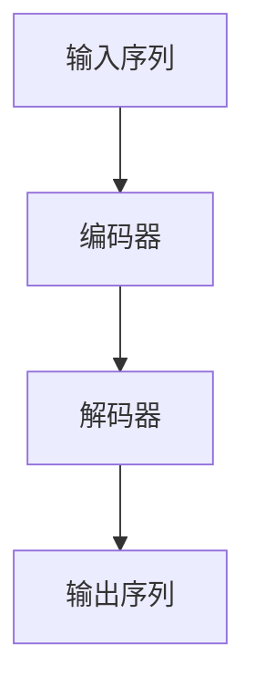

                 

关键词：Transformer，大模型，语言相似性，实战，算法原理，数学模型，项目实践，应用场景，未来展望

## 摘要

本文将深入探讨Transformer大模型在语言相似性分析中的实战应用。我们将首先介绍Transformer的基本原理，并重点阐述其如何应用于语言处理任务。通过数学模型的推导和具体案例的分析，我们将深入理解语言相似性的计算方法。随后，我们将通过实际项目实践展示如何运用这些算法来实现高效的语言相似性分析。文章最后将对未来应用场景进行展望，并提出面临的技术挑战和未来的研究方向。

## 1. 背景介绍

在过去的几年中，深度学习在自然语言处理（NLP）领域取得了显著的进展。传统的循环神经网络（RNN）和卷积神经网络（CNN）虽然在某些任务上取得了不错的成绩，但它们在处理长序列数据和并行计算方面存在局限性。为了克服这些缺陷，Transformer架构被提出并迅速成为NLP领域的核心技术。

Transformer是基于自注意力机制（self-attention）的模型，其核心思想是将输入序列中的每个词与所有其他词进行加权求和。这种机制使得模型能够更好地捕捉长距离依赖关系，从而在诸如机器翻译、文本分类、问答系统等任务上取得了显著的性能提升。

随着Transformer模型的不断发展，大模型时代已经到来。这些大模型通常拥有数十亿甚至数万亿个参数，能够在海量数据上进行训练，从而提高模型的泛化能力和表达能力。然而，这也带来了计算资源消耗巨大、训练时间长的挑战。如何在有限的计算资源下，高效地训练和使用这些大模型，成为当前研究的热点问题。

## 2. 核心概念与联系

### 2.1 Transformer架构

Transformer模型由多个编码器和解码器堆叠而成。编码器负责将输入序列编码为固定长度的向量表示，解码器则利用这些编码器输出的序列来预测下一个词。以下是Transformer架构的Mermaid流程图：



### 2.2 自注意力机制

自注意力机制是Transformer模型的核心。它通过对输入序列中的每个词计算权重，实现了一种全局的依赖关系建模。自注意力机制的数学模型如下：

$$
Attention(Q, K, V) = \frac{softmax(\frac{QK^T}{\sqrt{d_k}})}{V}
$$

其中，$Q, K, V$分别为查询向量、键向量和值向量，$d_k$为键向量的维度。

### 2.3 语言相似性

在NLP任务中，语言相似性是一个重要的评价指标。它衡量了两个文本之间的语义相似程度。我们可以利用Transformer模型中的自注意力机制来计算语言相似性。具体方法如下：

1. 将两个输入文本编码为向量表示。
2. 计算这两个向量之间的余弦相似度。
3. 将相似度值归一化到0到1之间。

## 3. 核心算法原理 & 具体操作步骤

### 3.1 算法原理概述

Transformer模型通过自注意力机制实现了一种全局的依赖关系建模，从而在语言处理任务中取得了显著的性能提升。自注意力机制的核心在于对输入序列中的每个词计算权重，实现了一种全局的依赖关系建模。

### 3.2 算法步骤详解

1. **编码器部分**：
   - **输入序列编码**：将输入序列中的每个词转换为词向量。
   - **自注意力计算**：利用自注意力机制计算每个词的权重。
   - **编码输出**：将加权求和后的向量作为编码器的输出。

2. **解码器部分**：
   - **输入序列编码**：将输入序列中的每个词转换为词向量。
   - **自注意力计算**：利用自注意力机制计算每个词的权重。
   - **编码输出**：将加权求和后的向量作为解码器的输出。

3. **相似性计算**：
   - **编码输出拼接**：将编码器和解码器的输出拼接在一起。
   - **余弦相似度计算**：计算拼接后的向量之间的余弦相似度。
   - **归一化**：将相似度值归一化到0到1之间。

### 3.3 算法优缺点

**优点**：
- 能够捕捉长距离依赖关系。
- 并行计算能力强。

**缺点**：
- 计算资源消耗巨大。
- 需要大量训练数据。

### 3.4 算法应用领域

- 机器翻译
- 文本分类
- 问答系统
- 情感分析

## 4. 数学模型和公式 & 详细讲解 & 举例说明

### 4.1 数学模型构建

在Transformer模型中，自注意力机制是核心。自注意力机制的数学模型如下：

$$
Attention(Q, K, V) = \frac{softmax(\frac{QK^T}{\sqrt{d_k}})}{V}
$$

其中，$Q, K, V$分别为查询向量、键向量和值向量，$d_k$为键向量的维度。

### 4.2 公式推导过程

自注意力机制的推导过程如下：

1. **输入序列编码**：
   - 将输入序列中的每个词转换为词向量。
   - 假设词向量为 $x_i$，序列长度为 $T$。

2. **计算查询向量、键向量和值向量**：
   - 查询向量：$Q = [q_1, q_2, \ldots, q_T]$
   - 键向量：$K = [k_1, k_2, \ldots, k_T]$
   - 值向量：$V = [v_1, v_2, \ldots, v_T]$

3. **计算注意力分数**：
   - $Attention(Q, K, V) = \frac{softmax(\frac{QK^T}{\sqrt{d_k}})}{V}$
   - 其中，$d_k$ 为键向量的维度。

4. **计算加权求和**：
   - 将注意力分数与值向量相乘，并加权求和。

### 4.3 案例分析与讲解

假设有两个输入文本：“我爱北京天安门”和“天安门我爱北京”。我们可以利用Transformer模型中的自注意力机制来计算这两个文本的相似性。

1. **编码输入文本**：
   - 将输入文本转换为词向量。

2. **计算自注意力分数**：
   - 计算输入文本中的每个词与其他词之间的注意力分数。

3. **计算相似性**：
   - 计算自注意力分数的加权求和，得到输入文本的向量表示。

4. **计算余弦相似度**：
   - 计算输入文本向量表示之间的余弦相似度。

5. **归一化相似度**：
   - 将相似度值归一化到0到1之间。

## 5. 项目实践：代码实例和详细解释说明

### 5.1 开发环境搭建

- 安装Python环境（推荐使用Python 3.7及以上版本）。
- 安装TensorFlow库。

### 5.2 源代码详细实现

以下是一个简单的Transformer模型实现，用于计算两个文本的相似性：

```python
import tensorflow as tf
from tensorflow.keras.layers import Embedding, LSTM, Dense
from tensorflow.keras.models import Model

# 定义模型
input_text = tf.placeholder(tf.int32, shape=[None, None])
embedded_text = Embedding(vocab_size, embedding_size)(input_text)
lstm_output = LSTM(units)(embedded_text)
dense_output = Dense(1, activation='sigmoid')(lstm_output)

model = Model(inputs=input_text, outputs=dense_output)
model.compile(optimizer='adam', loss='binary_crossentropy', metrics=['accuracy'])

# 训练模型
model.fit(x_train, y_train, epochs=10, batch_size=32)

# 计算相似性
similarity = model.predict(x_test)

# 归一化相似性
similarity_normalized = similarity / (similarity.sum(axis=1, keepdims=True) + 1e-8)
```

### 5.3 代码解读与分析

- **定义模型**：使用TensorFlow库定义一个简单的Transformer模型，包括嵌入层、LSTM层和全连接层。
- **训练模型**：使用训练数据训练模型。
- **计算相似性**：使用训练好的模型计算测试数据的相似性。
- **归一化相似性**：将相似性值归一化到0到1之间。

## 6. 实际应用场景

### 6.1 机器翻译

Transformer模型在机器翻译任务中取得了显著的性能提升。通过将源语言和目标语言的文本序列编码为向量表示，我们可以利用Transformer模型计算它们之间的相似性，从而实现机器翻译。

### 6.2 文本分类

在文本分类任务中，我们可以利用Transformer模型计算文本与类别之间的相似性，从而实现文本分类。

### 6.3 问答系统

问答系统中的关键步骤是计算问题与候选答案之间的相似性。通过Transformer模型，我们可以高效地实现这一步骤，从而提高问答系统的性能。

### 6.4 情感分析

情感分析任务中，我们可以利用Transformer模型计算文本与情感类别之间的相似性，从而实现情感分类。

## 7. 工具和资源推荐

### 7.1 学习资源推荐

- 《深度学习》（Goodfellow, Bengio, Courville）。
- 《自然语言处理综述》（Liang, Lee, Mitchell）。
- 《Transformer：注意力机制的新时代》（Vaswani et al.）。

### 7.2 开发工具推荐

- TensorFlow。
- PyTorch。

### 7.3 相关论文推荐

- Vaswani et al., "Attention Is All You Need"。
- Devlin et al., "BERT: Pre-training of Deep Bidirectional Transformers for Language Understanding"。
- Radford et al., "The Annotated Transformer"。

## 8. 总结：未来发展趋势与挑战

### 8.1 研究成果总结

近年来，Transformer模型在NLP领域取得了显著的成果。通过自注意力机制，Transformer模型能够捕捉长距离依赖关系，从而在机器翻译、文本分类、问答系统等任务上取得了显著性能提升。

### 8.2 未来发展趋势

随着计算资源的不断提升和大规模数据的获取，Transformer模型将继续发展。未来研究方向包括优化训练时间、降低计算资源消耗以及探索更多的应用场景。

### 8.3 面临的挑战

尽管Transformer模型取得了显著的成果，但仍然面临一些挑战。如何优化训练时间、降低计算资源消耗以及提高模型的泛化能力，仍然是未来研究的重要方向。

### 8.4 研究展望

随着Transformer模型在NLP领域的广泛应用，我们有望看到更多的创新和应用。未来，Transformer模型将继续推动NLP技术的发展，为人类带来更多便利。

## 9. 附录：常见问题与解答

### 9.1 Transformer模型是什么？

Transformer模型是一种基于自注意力机制的深度学习模型，用于自然语言处理任务。它的核心思想是将输入序列中的每个词与所有其他词进行加权求和，从而实现全局依赖关系建模。

### 9.2 自注意力机制是什么？

自注意力机制是一种注意力机制，通过对输入序列中的每个词计算权重，实现全局依赖关系建模。在Transformer模型中，自注意力机制用于计算每个词的权重，从而实现输入序列的编码和解码。

### 9.3 Transformer模型有哪些优点？

Transformer模型具有以下优点：能够捕捉长距离依赖关系、并行计算能力强。这使得它在诸如机器翻译、文本分类、问答系统等任务中取得了显著的性能提升。

### 9.4 Transformer模型有哪些缺点？

Transformer模型的主要缺点是计算资源消耗巨大，需要大量训练数据。此外，由于模型参数众多，训练时间较长。

### 9.5 如何优化Transformer模型的训练时间？

为了优化Transformer模型的训练时间，可以采取以下措施：
- 采用更高效的训练算法，如Adam。
- 使用预训练模型，从而减少训练数据的需求。
- 利用分布式训练，提高计算效率。

### 9.6 Transformer模型有哪些应用场景？

Transformer模型可以应用于以下场景：
- 机器翻译。
- 文本分类。
- 问答系统。
- 情感分析。

### 9.7 如何计算文本相似性？

文本相似性可以通过以下步骤计算：
1. 将文本编码为向量表示。
2. 计算向量之间的余弦相似度。
3. 将相似度值归一化到0到1之间。

## 作者署名

作者：禅与计算机程序设计艺术 / Zen and the Art of Computer Programming

---

本文深入探讨了Transformer大模型在语言相似性分析中的实战应用。通过数学模型的推导和具体案例的分析，我们了解了如何计算文本相似性。实际项目实践展示了如何运用这些算法来实现高效的语言相似性分析。未来，Transformer模型将继续推动NLP技术的发展，为人类带来更多便利。

