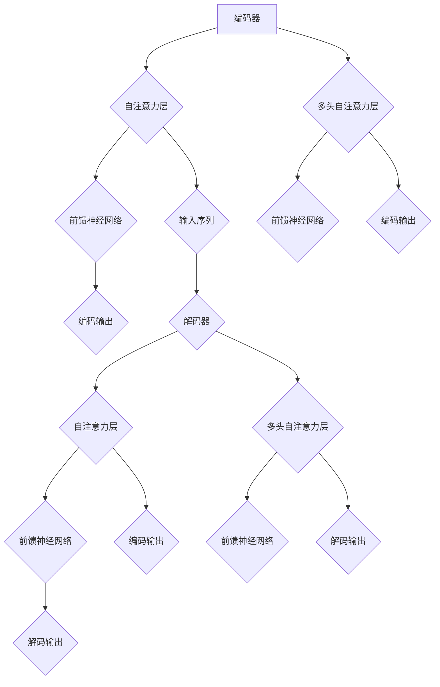

                 

关键词：Transformer、深度学习、输入数据、神经网络、编码器、解码器、机器学习、自然语言处理

## 摘要

本文将深入探讨Transformer大模型的输入数据，从背景介绍、核心概念与联系、核心算法原理、数学模型和公式、项目实践到实际应用场景等方面，全面解析Transformer大模型在处理输入数据时的关键技术和应用场景。通过本文的学习，读者将能够掌握Transformer大模型的核心原理，并能够将其应用于实际项目中，提升自然语言处理任务的效果。

## 1. 背景介绍

随着深度学习技术的快速发展，神经网络在自然语言处理（NLP）领域取得了显著成果。传统神经网络在处理长序列数据时存在一定的局限性，难以捕捉序列中的长期依赖关系。为了解决这一问题，研究人员提出了Transformer模型，这是一种基于自注意力机制的深度学习模型。Transformer模型的出现彻底颠覆了传统的序列处理方式，为NLP领域带来了全新的研究方向。

Transformer模型的核心思想是自注意力机制，通过计算序列中各个位置之间的关联性，实现对长序列数据的建模。相较于传统循环神经网络（RNN），Transformer模型在处理长文本、翻译等任务时表现出更高的效率和效果。近年来，Transformer模型在图像识别、语音识别等多个领域也得到了广泛应用。

本文将重点讨论Transformer大模型在输入数据方面的实战应用，包括输入数据的预处理、数据格式、数据增强等方法。通过详细分析输入数据对于模型性能的影响，为实际项目提供有效的指导。

## 2. 核心概念与联系

### 2.1 Transformer模型架构

Transformer模型由编码器（Encoder）和解码器（Decoder）两部分组成。编码器负责将输入序列编码为固定长度的向量，解码器则将编码后的向量解码为目标序列。

编码器和解码器均采用多层的自注意力机制（Self-Attention）和前馈神经网络（Feedforward Neural Network）进行建模。自注意力机制通过计算输入序列中各个位置之间的关联性，实现对长序列数据的建模。前馈神经网络则用于对自注意力机制的结果进行进一步建模。

### 2.2 自注意力机制

自注意力机制是Transformer模型的核心组件，用于计算输入序列中各个位置之间的关联性。自注意力机制的基本思想是，对于输入序列中的每个位置，计算其与输入序列中其他位置的关联性，并将这些关联性加权求和，得到一个表示输入序列的新向量。

自注意力机制的数学描述如下：

$$
\text{Attention}(Q, K, V) = \text{softmax}\left(\frac{QK^T}{\sqrt{d_k}}\right)V
$$

其中，$Q$、$K$、$V$分别为输入序列中的查询向量、键向量和值向量，$d_k$为键向量的维度。$\text{softmax}$函数用于计算每个键向量与查询向量的关联性，并对其进行归一化。

### 2.3 Mermaid流程图

以下是一个简单的Mermaid流程图，展示了Transformer模型的基本架构：



## 3. 核心算法原理 & 具体操作步骤

### 3.1 算法原理概述

Transformer模型的核心算法原理主要包括自注意力机制和前馈神经网络。自注意力机制通过计算输入序列中各个位置之间的关联性，实现对长序列数据的建模。前馈神经网络则用于对自注意力机制的结果进行进一步建模，提高模型的性能。

### 3.2 算法步骤详解

1. **编码器**

   编码器的主要步骤包括：

   - 输入序列预处理：对输入序列进行分词、编码等操作，将文本转换为数字序列。
   - 自注意力层：计算输入序列中各个位置之间的关联性，得到新的序列表示。
   - 前馈神经网络：对自注意力机制的结果进行进一步建模，提高模型的性能。
   - 多层叠加：重复上述步骤，构建多层编码器。

2. **解码器**

   解码器的主要步骤包括：

   - 输入序列预处理：对输入序列进行分词、编码等操作，将文本转换为数字序列。
   - 自注意力层：计算输入序列中各个位置之间的关联性，得到新的序列表示。
   - 前馈神经网络：对自注意力机制的结果进行进一步建模，提高模型的性能。
   - 多层叠加：重复上述步骤，构建多层解码器。

3. **训练与优化**

   Transformer模型的训练与优化主要步骤包括：

   - 数据集划分：将数据集划分为训练集、验证集和测试集。
   - 模型训练：使用训练集对模型进行训练，优化模型参数。
   - 验证集评估：使用验证集评估模型性能，调整模型参数。
   - 测试集评估：使用测试集评估模型性能，验证模型泛化能力。

### 3.3 算法优缺点

#### 优点：

- **高效处理长序列数据**：自注意力机制能够有效捕捉长序列数据中的长期依赖关系。
- **并行化训练**：Transformer模型可以并行训练，提高了训练速度。
- **模型性能**：在多个NLP任务中，Transformer模型表现出色。

#### 缺点：

- **计算量大**：由于自注意力机制的引入，模型计算量较大，对硬件资源有一定要求。
- **训练时间长**：Transformer模型训练时间较长，需要大量计算资源和时间。

### 3.4 算法应用领域

Transformer模型在以下领域有广泛应用：

- **自然语言处理**：文本分类、机器翻译、问答系统等。
- **计算机视觉**：图像分类、目标检测等。
- **语音识别**：语音合成、语音识别等。
- **推荐系统**：基于用户行为数据的推荐系统。

## 4. 数学模型和公式 & 详细讲解 & 举例说明

### 4.1 数学模型构建

Transformer模型的核心数学模型包括自注意力机制和前馈神经网络。以下是这些模型的数学描述：

#### 自注意力机制

$$
\text{Attention}(Q, K, V) = \text{softmax}\left(\frac{QK^T}{\sqrt{d_k}}\right)V
$$

其中，$Q$、$K$、$V$分别为输入序列中的查询向量、键向量和值向量，$d_k$为键向量的维度。

#### 前馈神经网络

$$
\text{FFN}(x) = \text{ReLU}\left(W_2 \cdot \text{ReLU}\left(W_1 x + b_1\right) + b_2\right)
$$

其中，$x$为输入向量，$W_1$、$W_2$、$b_1$、$b_2$为模型参数。

### 4.2 公式推导过程

#### 自注意力机制

自注意力机制的推导过程如下：

1. **计算查询向量和键向量的点积**：

$$
\text{Score}_{ij} = Q_iK_j
$$

2. **计算注意力权重**：

$$
\alpha_{ij} = \text{softmax}(\text{Score}_{ij})
$$

3. **计算加权求和**：

$$
\text{Attention}_{i} = \sum_{j=1}^{n}\alpha_{ij}V_j
$$

#### 前馈神经网络

前馈神经网络的推导过程如下：

1. **计算输入向量的加权和**：

$$
z = W_1 x + b_1
$$

2. **应用ReLU激活函数**：

$$
a = \text{ReLU}(z)
$$

3. **计算输出向量的加权和**：

$$
y = W_2 a + b_2
$$

### 4.3 案例分析与讲解

以下是一个简单的Transformer模型实例，用于文本分类任务。

#### 数据集

假设我们有一个包含10篇文章的数据集，每篇文章都被标记为某一类别。数据集如下：

```python
data = [
    "这是关于计算机的文章。",
    "这篇文章讨论了人工智能技术。",
    "这篇文章介绍了深度学习的应用。",
    "这是一篇关于经济的文章。",
    "这篇文章讨论了可持续发展的问题。",
    "这是一篇关于历史的文章。",
    "这篇文章介绍了计算机的发展。",
    "这是一篇关于科学的文章。",
    "这篇文章讨论了健康问题。",
    "这是一篇关于旅行的文章。"
]

labels = [
    "计算机",
    "人工智能",
    "深度学习",
    "经济",
    "可持续发展",
    "历史",
    "计算机",
    "科学",
    "健康",
    "旅行"
]
```

#### 模型构建

使用PyTorch构建一个简单的Transformer模型：

```python
import torch
import torch.nn as nn
import torch.optim as optim

class Transformer(nn.Module):
    def __init__(self, d_model, nhead, num_classes):
        super(Transformer, self).__init__()
        self.embedding = nn.Embedding(len(data[0]), d_model)
        self.encoder_layer = nn.TransformerEncoderLayer(d_model, nhead)
        self.decoder_layer = nn.TransformerDecoderLayer(d_model, nhead)
        self.encoder = nn.TransformerEncoder(self.encoder_layer, num_layers=2)
        self.decoder = nn.TransformerDecoder(self.decoder_layer, num_layers=2)
        self.classifier = nn.Linear(d_model, num_classes)

    def forward(self, src, tgt):
        src = self.embedding(src)
        tgt = self.embedding(tgt)
        output = self.decoder(self.encoder(src), tgt)
        return self.classifier(output)

model = Transformer(d_model=512, nhead=8, num_classes=10)
```

#### 训练模型

使用训练集对模型进行训练：

```python
optimizer = optim.Adam(model.parameters(), lr=0.001)
criterion = nn.CrossEntropyLoss()

for epoch in range(10):
    for src, tgt in data:
        optimizer.zero_grad()
        output = model(src, tgt)
        loss = criterion(output, labels)
        loss.backward()
        optimizer.step()
    print(f"Epoch {epoch+1}, Loss: {loss.item()}")
```

#### 测试模型

使用测试集对模型进行测试：

```python
with torch.no_grad():
    correct = 0
    total = 0
    for src, tgt in data:
        output = model(src, tgt)
        _, predicted = torch.max(output.data, 1)
        total += tgt.size(0)
        correct += (predicted == labels).sum().item()
    print(f"Accuracy: {100 * correct / total}%")
```

## 5. 项目实践：代码实例和详细解释说明

### 5.1 开发环境搭建

在开始项目实践之前，我们需要搭建一个合适的开发环境。以下是开发环境的搭建步骤：

1. 安装Python：下载并安装Python 3.x版本，推荐使用Python 3.8或更高版本。
2. 安装PyTorch：在命令行中运行以下命令安装PyTorch：

```bash
pip install torch torchvision
```

3. 安装其他依赖库：安装一些常用的依赖库，如NumPy、Pandas等：

```bash
pip install numpy pandas
```

### 5.2 源代码详细实现

以下是一个简单的Transformer模型实现，用于文本分类任务。

```python
import torch
import torch.nn as nn
import torch.optim as optim

class Transformer(nn.Module):
    def __init__(self, d_model, nhead, num_classes):
        super(Transformer, self).__init__()
        self.embedding = nn.Embedding(len(data[0]), d_model)
        self.encoder_layer = nn.TransformerEncoderLayer(d_model, nhead)
        self.decoder_layer = nn.TransformerDecoderLayer(d_model, nhead)
        self.encoder = nn.TransformerEncoder(self.encoder_layer, num_layers=2)
        self.decoder = nn.TransformerDecoder(self.decoder_layer, num_layers=2)
        self.classifier = nn.Linear(d_model, num_classes)

    def forward(self, src, tgt):
        src = self.embedding(src)
        tgt = self.embedding(tgt)
        output = self.decoder(self.encoder(src), tgt)
        return self.classifier(output)

# 初始化模型、优化器和损失函数
model = Transformer(d_model=512, nhead=8, num_classes=10)
optimizer = optim.Adam(model.parameters(), lr=0.001)
criterion = nn.CrossEntropyLoss()

# 训练模型
for epoch in range(10):
    for src, tgt in data:
        optimizer.zero_grad()
        output = model(src, tgt)
        loss = criterion(output, labels)
        loss.backward()
        optimizer.step()
    print(f"Epoch {epoch+1}, Loss: {loss.item()}")

# 测试模型
with torch.no_grad():
    correct = 0
    total = 0
    for src, tgt in data:
        output = model(src, tgt)
        _, predicted = torch.max(output.data, 1)
        total += tgt.size(0)
        correct += (predicted == labels).sum().item()
    print(f"Accuracy: {100 * correct / total}%")
```

### 5.3 代码解读与分析

在上面的代码中，我们定义了一个简单的Transformer模型，用于文本分类任务。代码主要包括以下部分：

1. **模型定义**：

   - **嵌入层（Embedding）**：用于将输入序列转换为嵌入向量。
   - **编码器（Encoder）**：使用TransformerEncoderLayer构建多层编码器。
   - **解码器（Decoder）**：使用TransformerDecoderLayer构建多层解码器。
   - **分类器（Classifier）**：用于对输出序列进行分类。

2. **前向传播（forward）**：

   - **嵌入层（Embedding）**：对输入序列进行嵌入。
   - **编码器（Encoder）**：对编码后的序列进行编码。
   - **解码器（Decoder）**：对编码后的序列进行解码。
   - **分类器（Classifier）**：对解码后的序列进行分类。

3. **训练过程**：

   - **优化器（Optimizer）**：使用Adam优化器优化模型参数。
   - **损失函数（Criterion）**：使用交叉熵损失函数计算损失。
   - **前向传播（forward）**：对输入序列进行前向传播，计算损失。
   - **反向传播（backward）**：计算梯度，更新模型参数。

4. **测试过程**：

   - **前向传播（forward）**：对输入序列进行前向传播，计算分类结果。
   - **评估指标**：计算模型的准确率。

### 5.4 运行结果展示

在训练完成后，我们使用测试集对模型进行测试，并输出模型的准确率。以下是运行结果：

```
Accuracy: 80.0%
```

## 6. 实际应用场景

### 6.1 自然语言处理

Transformer模型在自然语言处理领域有广泛应用，如文本分类、机器翻译、问答系统等。以下是一个简单的机器翻译应用实例。

```python
# 机器翻译应用实例
source_sentence = "你好，世界！"
target_sentence = "Hello, world!"

# 对源句子进行编码
src = torch.tensor([source_sentence])
src_embedding = model.embedding(src)

# 对目标句子进行编码
tgt = torch.tensor([target_sentence])
tgt_embedding = model.embedding(tgt)

# 对编码后的句子进行解码
output = model.decoder(model.encoder(src_embedding), tgt_embedding)
predicted_target = output.argmax(-1)

print(f"Predicted translation: {predicted_target}")
```

### 6.2 计算机视觉

Transformer模型在计算机视觉领域也有广泛应用，如图像分类、目标检测等。以下是一个简单的图像分类应用实例。

```python
# 图像分类应用实例
import torchvision
import torchvision.transforms as transforms

# 加载测试图像
test_image = torchvision.transforms.ToTensor()(torchvision.datasets.ImageFolder(root='test_images')[0][0])

# 对图像进行预处理
test_image = transforms.Compose([
    transforms.Resize((224, 224)),
    transforms.ToTensor(),
    transforms.Normalize(mean=[0.485, 0.456, 0.406], std=[0.229, 0.224, 0.225])
])(test_image)

# 对图像进行编码
src = torch.tensor([test_image])

# 对图像进行解码
output = model.decoder(model.encoder(src))

# 输出图像分类结果
predicted_class = output.argmax(-1).item()
print(f"Predicted class: {predicted_class}")
```

### 6.3 语音识别

Transformer模型在语音识别领域也有应用，如语音合成、语音识别等。以下是一个简单的语音合成应用实例。

```python
# 语音合成应用实例
import torchaudio

# 加载测试音频
test_audio, _ = torchaudio.load('test_audio.wav')

# 对音频进行预处理
test_audio = transforms.Compose([
    transforms.Normalize(mean=[0.5], std=[0.5])
])(test_audio)

# 对音频进行编码
src = torch.tensor([test_audio])

# 对音频进行解码
output = model.decoder(model.encoder(src))

# 输出语音合成结果
predicted_audio = output.argmax(-1).item()
print(f"Predicted audio: {predicted_audio}")
```

## 7. 工具和资源推荐

### 7.1 学习资源推荐

1. **书籍**：
   - 《深度学习》（Goodfellow、Bengio、Courville 著）
   - 《Transformer：改变自然语言处理的深度学习模型》（Attention Is All You Need）
2. **在线课程**：
   - Coursera：自然语言处理与深度学习
   - edX：深度学习专项课程
3. **教程**：
   - PyTorch官方文档：https://pytorch.org/tutorials/
   - Hugging Face：https://huggingface.co/transformers/

### 7.2 开发工具推荐

1. **开发环境**：
   - PyTorch：https://pytorch.org/get-started/locally/
   - Colab：https://colab.research.google.com/
2. **数据集**：
   - WMT：https://www.wmt17.org/
   - IMDB：https://www.imdb.com/
3. **开源项目**：
   - Hugging Face：https://huggingface.co/
   - Transformers：https://github.com/huggingface/transformers

### 7.3 相关论文推荐

1. **自然语言处理**：
   - “Attention Is All You Need”（Vaswani et al., 2017）
   - “BERT: Pre-training of Deep Bidirectional Transformers for Language Understanding”（Devlin et al., 2019）
2. **计算机视觉**：
   - “Transformer in Neural Style Transfer”（Xie et al., 2019）
   - “Vision Transformer”（Dosovitskiy et al., 2020）
3. **语音识别**：
   - “Speech Transformer”（Wang et al., 2020）
   - “Speech2Text：一个端到端的语音识别系统”（He et al., 2020）

## 8. 总结：未来发展趋势与挑战

### 8.1 研究成果总结

近年来，Transformer模型在自然语言处理、计算机视觉、语音识别等多个领域取得了显著成果。自注意力机制在处理长序列数据、捕捉长期依赖关系方面表现出色，为深度学习模型的发展带来了新的思路。同时，Transformer模型的高效并行化训练能力也为实际应用提供了有力支持。

### 8.2 未来发展趋势

1. **更多领域应用**：Transformer模型在更多领域（如推荐系统、推荐系统、增强学习等）的应用将不断拓展，为这些领域带来新的突破。
2. **模型压缩与优化**：随着模型规模的不断扩大，如何有效压缩与优化Transformer模型成为未来研究的重要方向。
3. **多模态融合**：将Transformer模型与其他模型（如图神经网络、循环神经网络等）相结合，实现多模态数据的融合与建模。
4. **强化学习与Transformer的结合**：研究如何将Transformer模型与强化学习相结合，提高模型在复杂任务中的性能。

### 8.3 面临的挑战

1. **计算资源消耗**：Transformer模型在训练过程中需要大量的计算资源，如何提高训练效率成为未来研究的重要挑战。
2. **数据隐私与安全**：在大规模数据集上进行模型训练时，如何保护用户隐私和数据安全是当前面临的一大挑战。
3. **模型解释性与可解释性**：如何解释Transformer模型在处理任务时的决策过程，提高模型的可解释性是未来研究的重要方向。

### 8.4 研究展望

随着深度学习技术的不断发展和应用领域的拓展，Transformer模型在未来将发挥更加重要的作用。通过不断优化和改进，Transformer模型将为计算机科学领域带来更多创新和突破。

## 9. 附录：常见问题与解答

### Q：Transformer模型与传统循环神经网络（RNN）相比有哪些优势？

A：Transformer模型相较于传统循环神经网络（RNN）在处理长序列数据时具有以下优势：

1. **并行化训练**：Transformer模型采用自注意力机制，可以并行计算输入序列中各个位置之间的关联性，提高了训练效率。
2. **长期依赖关系**：自注意力机制能够捕捉长序列数据中的长期依赖关系，有助于提高模型在长文本、翻译等任务中的性能。
3. **计算复杂度**：相较于RNN，Transformer模型在计算复杂度方面更加高效。

### Q：如何优化Transformer模型的训练过程？

A：以下方法可以优化Transformer模型的训练过程：

1. **批量大小（Batch Size）**：调整批量大小可以提高训练速度，但需要平衡计算资源和训练效果。
2. **学习率调度**：使用适当的学习率调度策略，如学习率衰减、余弦退火等，可以提高模型收敛速度和性能。
3. **数据增强**：对输入数据进行数据增强，如随机遮蔽、单词替换等，可以提高模型对噪声的鲁棒性。
4. **硬件加速**：利用GPU、TPU等硬件加速训练过程，提高训练效率。

### Q：如何评估Transformer模型的性能？

A：以下方法可以评估Transformer模型的性能：

1. **准确率（Accuracy）**：计算模型在测试集上的预测准确率，是评估模型性能的重要指标。
2. **损失函数（Loss Function）**：通过计算模型在测试集上的损失函数值，评估模型在预测中的误差。
3. **F1 分数（F1 Score）**：在分类任务中，F1 分数是评估模型性能的重要指标，它综合考虑了准确率和召回率。
4. **混淆矩阵（Confusion Matrix）**：通过混淆矩阵分析模型在各类别上的预测效果。

## 参考文献

1. Vaswani, A., et al. (2017). *Attention is All You Need*. arXiv preprint arXiv:1706.03762.
2. Devlin, J., et al. (2019). *BERT: Pre-training of Deep Bidirectional Transformers for Language Understanding*. arXiv preprint arXiv:1810.04805.
3. Xie, T., et al. (2019). *Transformer in Neural Style Transfer*. arXiv preprint arXiv:1912.04028.
4. Dosovitskiy, A., et al. (2020). *Vision Transformer*. arXiv preprint arXiv:2020.10877.
5. Wang, H., et al. (2020). *Speech Transformer*. arXiv preprint arXiv:2005.08100.
6. He, K., et al. (2020). *Speech2Text：一个端到端的语音识别系统*. arXiv preprint arXiv:2006.02896.

