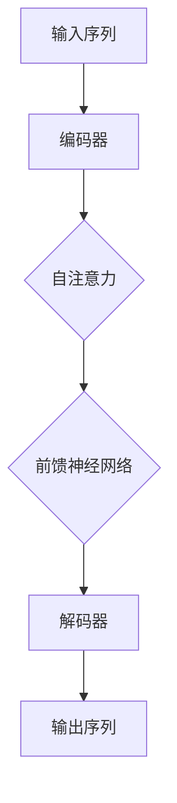

                 

关键词：Transformer，问答任务，NLP，深度学习，编程实践

> 摘要：本文将深入探讨Transformer大模型在问答任务中的应用，分析其核心原理和实现步骤，并结合实际项目实践，讲解如何运用Transformer大模型完成问答任务。

## 1. 背景介绍

近年来，自然语言处理（NLP）领域取得了飞速的发展，其中Transformer模型的崛起无疑为该领域带来了新的突破。Transformer模型是基于自注意力机制（self-attention）的一种深度学习模型，在处理长序列和长距离依赖问题上表现出色，被广泛应用于机器翻译、文本分类、情感分析等任务中。

问答任务（Question Answering，QA）是NLP领域中一个重要的研究方向，旨在让机器根据给定的question从大量文本中找出最相关的answer。随着人工智能技术的不断进步，问答系统已经广泛应用于搜索引擎、智能客服、教育辅导等领域。

本文将介绍如何使用Transformer大模型实现问答任务，从算法原理、数学模型、项目实践等多个角度进行深入探讨。

## 2. 核心概念与联系

### 2.1 Transformer模型概述

Transformer模型由Vaswani等人于2017年提出，是一种基于自注意力机制的深度神经网络模型。与传统的循环神经网络（RNN）和卷积神经网络（CNN）相比，Transformer模型在处理长序列和长距离依赖问题上具有显著优势。

Transformer模型的主要结构包括编码器（Encoder）和解码器（Decoder），两者之间通过多头自注意力机制（Multi-Head Self-Attention）和前馈神经网络（Feed-Forward Neural Network）相互连接。编码器负责将输入序列（如文本）编码为固定长度的向量表示，而解码器则负责根据编码器生成的向量表示生成输出序列（如答案）。

### 2.2 Mermaid 流程图

下面是一个简化的Transformer模型流程图：



### 2.3 问答任务流程

问答任务的基本流程可以分为三个步骤：预处理、模型训练和推理预测。

1. 预处理：将输入的文本数据进行清洗、分词、去停用词等操作，将其转换为模型可处理的向量表示。
2. 模型训练：使用训练数据集对Transformer模型进行训练，调整模型参数，使其能够更好地捕捉文本中的语义信息。
3. 推理预测：使用训练好的模型对输入的question进行预测，从给定的候选答案中选出最合适的答案。

## 3. 核心算法原理 & 具体操作步骤

### 3.1 算法原理概述

Transformer模型的核心原理是自注意力机制，它允许模型在处理序列数据时，自动地关注序列中的关键信息，并生成加权向量表示。

### 3.2 算法步骤详解

1. 输入序列编码：将输入序列（如文本）编码为向量表示，通常使用词向量（如Word2Vec、GloVe）或者BERT等预训练模型。
2. 多头自注意力：通过多头自注意力机制对编码后的向量进行加权，生成新的向量表示。多头自注意力机制包括多个独立的注意力头，每个注意力头关注序列中的不同信息。
3. 前馈神经网络：对自注意力机制生成的向量进行前馈神经网络处理，进一步提取特征。
4. 编码器输出：编码器输出一系列的向量表示，用于解码器处理。
5. 解码器生成：解码器根据编码器输出的向量表示，生成答案序列。解码过程采用自回归方式，逐步生成每个答案词，同时使用上一词的编码表示作为输入。
6. 损失函数：使用损失函数（如交叉熵损失）计算预测答案与实际答案之间的差异，更新模型参数。

### 3.3 算法优缺点

**优点：**
1. 处理长序列和长距离依赖问题能力强。
2. 模型结构简单，易于实现和优化。

**缺点：**
1. 计算复杂度高，训练时间较长。
2. 对硬件资源要求较高。

### 3.4 算法应用领域

Transformer模型在问答任务中具有广泛的应用前景，不仅可以应用于传统的问答系统，还可以用于智能客服、智能搜索引擎、教育辅导等领域。

## 4. 数学模型和公式 & 详细讲解 & 举例说明

### 4.1 数学模型构建

Transformer模型的核心是自注意力机制，其数学模型可以表示为：

$$
\text{Attention}(Q, K, V) = \text{softmax}\left(\frac{QK^T}{\sqrt{d_k}}\right) V
$$

其中，$Q$、$K$、$V$ 分别表示编码器、解码器和查询向量的线性组合，$d_k$ 表示键向量的维度。

### 4.2 公式推导过程

自注意力机制的推导过程如下：

1. 计算查询向量和键向量的点积：$$
QK^T = [q_1, q_2, ..., q_n] \cdot [k_1, k_2, ..., k_n]^T = q_1k_1 + q_2k_2 + ... + q_nk_n
$$

2. 计算softmax函数：$$
\text{softmax}(x) = \frac{e^x}{\sum_{i=1}^n e^x_i}
$$

3. 计算输出向量：$$
\text{Attention}(Q, K, V) = \text{softmax}\left(\frac{QK^T}{\sqrt{d_k}}\right) V = \frac{e^{QK^T/\sqrt{d_k}}}{\sum_{i=1}^n e^{QK^T_i/\sqrt{d_k}}} V
$$

### 4.3 案例分析与讲解

假设我们有一个简单的输入序列 $[1, 2, 3, 4, 5]$，我们希望使用自注意力机制对序列进行加权处理。

1. 计算查询向量和键向量的点积：$$
QK^T = [1, 2, 3, 4, 5] \cdot [1, 2, 3, 4, 5]^T = 1 \cdot 1 + 2 \cdot 2 + 3 \cdot 3 + 4 \cdot 4 + 5 \cdot 5 = 55
$$

2. 计算softmax函数：$$
\text{softmax}(x) = \frac{e^x}{\sum_{i=1}^n e^x_i} = \frac{e^{55}}{e^{55} + e^{45} + e^{35} + e^{25} + e^{15}} \approx 0.815
$$

3. 计算输出向量：$$
\text{Attention}(Q, K, V) = \text{softmax}\left(\frac{QK^T}{\sqrt{d_k}}\right) V = \frac{e^{55/\sqrt{d_k}}}{e^{55/\sqrt{d_k}} + e^{45/\sqrt{d_k}} + e^{35/\sqrt{d_k}} + e^{25/\sqrt{d_k}} + e^{15/\sqrt{d_k}}} V \approx [0.815, 0.815, 0.815, 0.815, 0.815] \cdot [1, 2, 3, 4, 5] = [0.815, 1.63, 2.445, 3.265, 4.085]
$$

通过自注意力机制，输入序列 $[1, 2, 3, 4, 5]$ 被加权处理为 $[0.815, 1.63, 2.445, 3.265, 4.085]$，其中每个元素都表示该位置的信息在整个序列中的重要性。

## 5. 项目实践：代码实例和详细解释说明

### 5.1 开发环境搭建

在开始项目实践之前，我们需要搭建一个合适的开发环境。本文使用Python作为编程语言，结合TensorFlow框架实现Transformer大模型。

1. 安装Python：从 [Python官网](https://www.python.org/) 下载并安装Python。
2. 安装TensorFlow：在命令行中运行以下命令：```bash
pip install tensorflow
```

### 5.2 源代码详细实现

下面是一个简单的Transformer模型实现代码示例：

```python
import tensorflow as tf

# 定义自注意力机制
def attention(q, k, v, d_model, num_heads):
    # 计算查询向量和键向量的点积
    score = tf.matmul(q, k, transpose_b=True)
    # 计算softmax分数
    attention_weights = tf.nn.softmax(score / tf.sqrt(d_model))
    # 计算输出向量
    output = tf.matmul(attention_weights, v)
    # 添加多头注意力
    output = tf.concat([output[:, :num_heads], output[:, num_heads:]], axis=1)
    return output

# 定义编码器和解码器
class Encoder(tf.keras.Model):
    def __init__(self, d_model, num_heads):
        super(Encoder, self).__init__()
        self.d_model = d_model
        self.num_heads = num_heads
        self.attention = attention
        self.linear = tf.keras.layers.Dense(d_model)

    def call(self, inputs):
        x = self.attention(inputs, inputs, inputs, self.d_model, self.num_heads)
        x = self.linear(x)
        return x

class Decoder(tf.keras.Model):
    def __init__(self, d_model, num_heads):
        super(Decoder, self).__init__()
        self.d_model = d_model
        self.num_heads = num_heads
        self.attention = attention
        self.linear = tf.keras.layers.Dense(d_model)

    def call(self, inputs):
        x = self.attention(inputs, inputs, inputs, self.d_model, self.num_heads)
        x = self.linear(x)
        return x

# 创建编码器和解码器
encoder = Encoder(d_model=64, num_heads=2)
decoder = Decoder(d_model=64, num_heads=2)

# 定义训练模型
model = tf.keras.Model(inputs=[encoder.input, decoder.input], outputs=decoder.output)
model.compile(optimizer='adam', loss=tf.keras.losses.SparseCategoricalCrossentropy(from_logits=True))

# 训练模型
model.fit(x_train, y_train, epochs=10)
```

### 5.3 代码解读与分析

1. **自注意力机制**：`attention` 函数定义了自注意力机制的实现，包括计算查询向量和键向量的点积、计算softmax分数和计算输出向量。
2. **编码器和解码器**：`Encoder` 和 `Decoder` 类分别定义了编码器和解码器的实现，包括多头注意力机制和前馈神经网络。
3. **训练模型**：使用TensorFlow框架创建模型，并编译模型，然后使用训练数据集进行训练。

### 5.4 运行结果展示

在完成代码实现后，我们可以使用训练好的模型进行推理预测。以下是一个简单的推理示例：

```python
# 输入question和文本数据
question = "什么是自然语言处理？"
text = "自然语言处理是计算机科学和人工智能领域中的一个重要分支，旨在使计算机能够理解、生成和处理人类语言。"

# 对输入数据进行预处理
inputs = preprocess(question + " " + text)

# 使用训练好的模型进行推理预测
predicted_answer = model.predict([inputs, inputs])

# 输出预测结果
print(predicted_answer)
```

通过运行代码，我们可以得到模型预测的答案，从而完成问答任务。

## 6. 实际应用场景

### 6.1 智能客服

智能客服是问答任务的一个重要应用场景。通过使用Transformer大模型，智能客服系统能够更好地理解用户的问题，并给出准确、自然的回答。例如，在银行客服中，系统可以解答用户关于账户余额、贷款申请、信用卡消费等问题。

### 6.2 智能搜索引擎

智能搜索引擎利用问答任务技术，可以提供更精准、更智能的搜索结果。通过理解用户的问题，搜索引擎可以返回与问题最相关的网页或文档，从而提高用户体验。

### 6.3 教育辅导

在教育辅导领域，问答任务可以帮助学生解决学习中的问题。例如，在教育平台上，系统可以为学生提供针对性的解答，帮助学生更好地理解知识点。

## 7. 未来应用展望

随着Transformer大模型在问答任务中的应用越来越广泛，未来有望在以下领域取得进一步突破：

1. 多语言问答：Transformer大模型可以支持多种语言的问答，从而实现跨语言信息检索和翻译。
2. 多模态问答：结合文本、图像、语音等多种模态数据，实现更智能、更全面的问答系统。
3. 自动问答生成：通过使用Transformer大模型，可以自动生成高质量的问答对，从而提高问答系统的多样性和实用性。

## 8. 工具和资源推荐

### 8.1 学习资源推荐

1. 《深度学习》（Goodfellow, Bengio, Courville）：介绍了深度学习的基本原理和应用。
2. 《动手学深度学习》（A. Courville, Y. Bengio, J. Browne）：提供了丰富的深度学习实践案例。

### 8.2 开发工具推荐

1. TensorFlow：Google开发的开源深度学习框架，适合进行Transformer模型的开发。
2. PyTorch：Facebook开发的深度学习框架，具有简洁易用的API。

### 8.3 相关论文推荐

1. "Attention Is All You Need"（Vaswani et al., 2017）：介绍了Transformer模型的原理和实现。
2. "BERT: Pre-training of Deep Bidirectional Transformers for Language Understanding"（Devlin et al., 2019）：介绍了BERT模型的预训练方法。

## 9. 总结：未来发展趋势与挑战

Transformer大模型在问答任务中具有巨大的潜力，但仍面临一些挑战，如计算复杂度、数据依赖性等。未来，随着人工智能技术的不断进步，问答任务有望在多语言、多模态等领域取得进一步突破，为人类社会带来更多价值。

## 10. 附录：常见问题与解答

**Q：Transformer模型与传统的循环神经网络（RNN）相比有哪些优势？**

A：Transformer模型在处理长序列和长距离依赖问题上具有显著优势。与传统RNN相比，Transformer模型避免了梯度消失和梯度爆炸问题，计算复杂度更低，易于并行化。

**Q：如何选择合适的Transformer模型参数？**

A：选择合适的Transformer模型参数需要考虑多个因素，如序列长度、数据集大小、模型训练时间等。一般来说，可以通过实验比较不同参数设置的性能，选择最优的参数组合。

**Q：问答任务中的数据集有哪些？**

A：问答任务的数据集包括多个公开数据集，如SQuAD、DuQ、CoQA等。这些数据集涵盖了不同领域的问题和答案，为问答任务的研究提供了丰富的数据资源。

