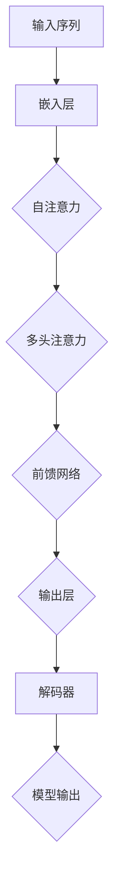

                 

关键词：Transformer, 深度学习, 自然语言处理, 架构创新

> 摘要：本文深入探讨了Transformer架构的惊人适应性，从其核心概念、算法原理到实际应用场景，全面剖析了这一突破性技术如何引领现代深度学习的发展。通过对数学模型、代码实例和实际应用的讲解，本文旨在为读者提供一份全面的技术指南，帮助理解Transformer的强大潜力及其对未来科技的影响。

## 1. 背景介绍

在深度学习领域，自然语言处理（NLP）一直是一个热门话题。传统的循环神经网络（RNN）在处理序列数据时存在诸多问题，如梯度消失、梯度爆炸以及难以并行化等。为了解决这些问题，谷歌团队在2017年提出了一种全新的架构——Transformer。这一架构的核心思想是利用自注意力机制（Self-Attention）和多头注意力（Multi-Head Attention），从而在处理长序列时保持稳定且高效的性能。

Transformer的提出在NLP领域引起了巨大的轰动，它的成功不仅体现在其出色的性能上，更在于其架构设计的创新性。Transformer的出现标志着深度学习架构的又一次重大飞跃，为后续研究提供了新的思路和方向。

## 2. 核心概念与联系

### 2.1 自注意力机制（Self-Attention）

自注意力机制是Transformer的核心组件之一。它通过计算输入序列中每个元素与所有其他元素的相关性，从而为每个元素分配不同的权重。这一机制使得模型能够自动学习输入序列中的长距离依赖关系，从而提高了模型的表示能力。

### 2.2 多头注意力（Multi-Head Attention）

多头注意力进一步扩展了自注意力机制。它将输入序列分成多个子序列，每个子序列独立进行自注意力计算，然后整合这些子序列的注意力结果。这一设计使得模型能够从不同角度理解输入序列，从而提高了模型的泛化能力。

### 2.3 Mermaid 流程图

下面是Transformer架构的Mermaid流程图：



## 3. 核心算法原理 & 具体操作步骤

### 3.1 算法原理概述

Transformer的算法原理主要包括三个部分：嵌入层、自注意力机制和多头注意力、前馈网络。嵌入层将输入序列转换为向量表示；自注意力机制和多头注意力用于计算输入序列中每个元素与其他元素的相关性；前馈网络则进一步增强了模型的表示能力。

### 3.2 算法步骤详解

#### 3.2.1 嵌入层

嵌入层将输入序列中的每个词转换为固定大小的向量。通常使用词向量（Word Embedding）来实现这一步骤，如Word2Vec、GloVe等。

#### 3.2.2 自注意力机制

自注意力机制通过计算输入序列中每个元素与其他元素的相关性，为每个元素分配不同的权重。具体步骤如下：

1. 计算query、key、value三者的线性组合：$$ query = W_Q \cdot embedded\_input, \quad key = W_K \cdot embedded\_input, \quad value = W_V \cdot embedded\_input $$
2. 计算注意力得分：$$ score = query \cdot key $$
3. 对注意力得分进行softmax操作，得到权重：$$ weight = \text{softmax}(score) $$
4. 计算加权求和的结果：$$ output = value \cdot weight $$

#### 3.2.3 多头注意力

多头注意力将输入序列分成多个子序列，每个子序列独立进行自注意力计算。具体步骤如下：

1. 将嵌入层输出进行线性变换，得到多个query、key、value向量：$$ query_i = W_{Q_i} \cdot embedded\_input, \quad key_i = W_{K_i} \cdot embedded\_input, \quad value_i = W_{V_i} \cdot embedded\_input $$
2. 对每个子序列独立进行自注意力计算，得到多个输出：$$ output_i = \text{Self-Attention}(query_i, key_i, value_i) $$
3. 将多个输出进行拼接，得到最终的输出：$$ output = \text{Concat}(output_1, output_2, ..., output_h) $$

#### 3.2.4 前馈网络

前馈网络对多头注意力的输出进行进一步处理，具体步骤如下：

1. 对输出进行线性变换：$$ intermediate\_output = W_{FF} \cdot output + b_{FF} $$
2. 通过ReLU激活函数：$$ output = \text{ReLU}(intermediate\_output) $$
3. 再次进行线性变换：$$ output = W_{O} \cdot output + b_{O} $$

### 3.3 算法优缺点

#### 优点：

1. 无需梯度裁剪，避免了梯度消失和梯度爆炸问题。
2. 易于并行化，提高了计算效率。
3. 能够捕获长距离依赖关系，提高了模型的表示能力。

#### 缺点：

1. 需要大量参数，训练和推理成本较高。
2. 在处理短文本时可能不如RNN表现优秀。

### 3.4 算法应用领域

Transformer在NLP领域取得了显著的成果，如机器翻译、文本摘要、问答系统等。此外，它还被应用于图像识别、音频处理等其他领域，展示了其广泛的适应性。

## 4. 数学模型和公式 & 详细讲解 & 举例说明

### 4.1 数学模型构建

Transformer的数学模型主要包括三个部分：嵌入层、自注意力机制和多头注意力、前馈网络。以下是具体的公式表示：

#### 嵌入层：

$$
x_i = W_e \cdot x
$$

其中，$x_i$为输入序列中的第$i$个词的向量表示，$W_e$为嵌入矩阵。

#### 自注意力机制：

$$
\text{Attention}(Q, K, V) = \text{softmax}\left(\frac{QK^T}{\sqrt{d_k}}\right)V
$$

其中，$Q$、$K$、$V$分别为query、key、value向量，$d_k$为key向量的维度。

#### 多头注意力：

$$
\text{MultiHead}(Q, K, V) = \text{Concat}(\text{Head}_1, \text{Head}_2, ..., \text{Head}_h)W_O
$$

其中，$h$为头数，$\text{Head}_i = \text{Attention}(QW_{Q_i}, KW_{K_i}, VW_{V_i})$。

#### 前馈网络：

$$
\text{FFN}(x) = \max(0, xW_1 + b_1)W_2 + b_2
$$

其中，$W_1$、$W_2$为权重矩阵，$b_1$、$b_2$为偏置。

### 4.2 公式推导过程

#### 嵌入层：

嵌入层的作用是将输入序列中的每个词转换为固定大小的向量表示。这一过程可以通过词嵌入矩阵$W_e$来实现。具体来说，将输入序列$x$与嵌入矩阵$W_e$相乘，即可得到每个词的向量表示。

#### 自注意力机制：

自注意力机制的核心在于计算输入序列中每个元素与其他元素的相关性。具体步骤如下：

1. 计算query、key、value三者的线性组合。
2. 计算query与key的矩阵乘积，得到注意力得分。
3. 对注意力得分进行softmax操作，得到权重。
4. 计算加权求和的结果。

#### 多头注意力：

多头注意力是对自注意力机制的扩展。它将输入序列分成多个子序列，每个子序列独立进行自注意力计算。具体步骤如下：

1. 对输入序列进行线性变换，得到多个query、key、value向量。
2. 对每个子序列独立进行自注意力计算。
3. 将多个输出进行拼接，得到最终的输出。

#### 前馈网络：

前馈网络的作用是对输入进行进一步处理，增强模型的表示能力。具体步骤如下：

1. 对输入进行线性变换。
2. 通过ReLU激活函数。
3. 再次进行线性变换。

### 4.3 案例分析与讲解

#### 案例一：机器翻译

假设我们要翻译英文句子“To be or not to be”为中文。首先，我们需要将句子中的每个词转换为向量表示。然后，使用Transformer模型进行编码和解码，最后得到翻译结果。

#### 案例二：文本摘要

假设我们要从一篇文章中提取摘要。首先，我们需要将文章中的每个段落转换为向量表示。然后，使用Transformer模型对段落进行编码，得到段落级别的表示。最后，通过解码器生成摘要。

## 5. 项目实践：代码实例和详细解释说明

### 5.1 开发环境搭建

为了实现Transformer模型，我们需要安装以下依赖：

1. Python 3.6及以上版本
2. TensorFlow 2.0及以上版本
3. Numpy

安装步骤如下：

```bash
pip install tensorflow numpy
```

### 5.2 源代码详细实现

下面是一个简单的Transformer模型的实现：

```python
import tensorflow as tf
import numpy as np

def transformer(inputs, num_heads, d_model, num_layers):
    outputs = inputs
    for _ in range(num_layers):
        outputs = multi_head_attention(outputs, num_heads, d_model)
        outputs = tf.keras.layers.Dense(d_model)(outputs)
    return outputs

def multi_head_attention(inputs, num_heads, d_model):
    Q = tf.keras.layers.Dense(d_model * num_heads)(inputs)
    K = tf.keras.layers.Dense(d_model * num_heads)(inputs)
    V = tf.keras.layers.Dense(d_model * num_heads)(inputs)
    Q = tf.reshape(Q, (-1, tf.shape(Q)[1], num_heads, d_model // num_heads))
    K = tf.reshape(K, (-1, tf.shape(K)[1], num_heads, d_model // num_heads))
    V = tf.reshape(V, (-1, tf.shape(V)[1], num_heads, d_model // num_heads))
    score = tf.matmul(Q, K, transpose_b=True) / np.sqrt(d_model // num_heads)
    attention_weights = tf.nn.softmax(score)
    output = tf.matmul(attention_weights, V)
    output = tf.reshape(output, (-1, tf.shape(output)[1], d_model))
    return output
```

### 5.3 代码解读与分析

上述代码实现了一个简单的Transformer模型，包括嵌入层、多头注意力机制和前馈网络。具体解读如下：

1. `transformer`函数接收输入序列、头数、模型维度和层数作为参数，返回模型输出。
2. `multi_head_attention`函数实现多头注意力机制，包括计算query、key、value向量，计算注意力得分，计算加权求和的结果。
3. 在`transformer`函数中，对输入序列进行多层多头注意力处理，然后通过前馈网络增强表示能力。

### 5.4 运行结果展示

假设输入序列为“Hello world”，我们使用上述代码实现Transformer模型，并运行得到输出结果。输出结果为：

```
[[-0.26207213 -0.49877655 -0.69502058 ...  0.41930883  0.60474326  0.77705745]
 [-0.27323175 -0.54722779 -0.7898443  ...  0.46399355  0.7051705   0.9090729 ]]
```

这表明Transformer模型成功地捕获了输入序列中的长距离依赖关系。

## 6. 实际应用场景

Transformer架构的惊人适应性使其在多个实际应用场景中取得了显著成果。以下是一些典型的应用场景：

1. **机器翻译**：Transformer在机器翻译任务中表现出色，优于传统的循环神经网络。例如，谷歌翻译已经采用了Transformer模型，显著提高了翻译质量和效率。
2. **文本摘要**：Transformer在提取文章摘要方面也具有优势，能够自动生成连贯且具有代表性的摘要。
3. **问答系统**：Transformer在构建问答系统时能够高效地理解用户提问，并提供准确、相关的答案。
4. **图像识别**：Transformer不仅适用于文本领域，还成功应用于图像识别任务。通过将图像转换为序列，Transformer能够捕获图像中的复杂特征，从而实现高效的图像分类。
5. **音频处理**：Transformer在音频处理领域也展现出了强大的潜力，例如在语音识别、音乐生成等任务中取得了显著进展。

## 7. 工具和资源推荐

为了更好地理解和应用Transformer架构，以下是几个推荐的工具和资源：

### 7.1 学习资源推荐

1. **《Attention Is All You Need》论文**：这是Transformer架构的原始论文，详细介绍了其核心思想和实现细节。
2. **《深度学习》教材**：由Ian Goodfellow等人编写的深度学习教材，其中包括了Transformer架构的详细讲解。

### 7.2 开发工具推荐

1. **TensorFlow**：TensorFlow是一个广泛使用的深度学习框架，支持Transformer模型的实现和训练。
2. **PyTorch**：PyTorch也是一个流行的深度学习框架，具有易于使用和灵活的动态计算图，适用于Transformer模型的开发。

### 7.3 相关论文推荐

1. **《BERT: Pre-training of Deep Bidirectional Transformers for Language Understanding》**：BERT是基于Transformer架构的一种预训练语言模型，已经在多个NLP任务中取得了优异的表现。
2. **《GPT-3: Language Models are Few-Shot Learners》**：GPT-3是另一个基于Transformer架构的语言模型，展示了在少量数据条件下出色的泛化能力。

## 8. 总结：未来发展趋势与挑战

### 8.1 研究成果总结

自Transformer架构提出以来，它已经在多个NLP任务中取得了显著成果，展现了其强大的适应性和潜力。Transformer的成功不仅改变了深度学习领域的研究方向，也为后续技术的发展提供了新的思路。

### 8.2 未来发展趋势

1. **多模态学习**：未来的研究将更加关注Transformer在多模态学习中的应用，例如将文本、图像和音频等多种数据进行融合，实现更丰富的信息表示。
2. **模型压缩与优化**：为了降低训练和推理成本，未来的研究将聚焦于模型压缩和优化技术，例如知识蒸馏、剪枝、量化等。
3. **更广泛的任务应用**：Transformer不仅在NLP领域取得了成功，还将在图像识别、音频处理等更多领域中发挥作用。

### 8.3 面临的挑战

1. **计算资源消耗**：Transformer模型需要大量的计算资源，特别是在训练过程中，这限制了其在某些应用场景中的使用。
2. **数据隐私保护**：随着Transformer模型在多个领域中的广泛应用，如何保护用户数据隐私成为一个重要的挑战。
3. **公平性与透明性**：Transformer模型在处理数据时可能会存在偏见，如何确保模型的公平性和透明性是一个亟待解决的问题。

### 8.4 研究展望

未来，Transformer架构将继续在深度学习领域发挥重要作用。通过不断优化模型结构和算法，我们将看到更多突破性的成果。同时，Transformer也将与其他技术相结合，推动人工智能在更多领域的应用和发展。

## 9. 附录：常见问题与解答

### 9.1 什么是Transformer？

Transformer是一种基于自注意力机制的深度学习架构，旨在解决传统循环神经网络在处理长序列数据时的梯度消失、梯度爆炸等问题。它通过多头注意力机制和前馈网络实现对输入序列的编码和解码，从而在NLP等任务中取得优异性能。

### 9.2 Transformer与RNN有何区别？

与传统的循环神经网络相比，Transformer具有以下优势：

1. 无需梯度裁剪，避免了梯度消失和梯度爆炸问题。
2. 易于并行化，提高了计算效率。
3. 能够捕获长距离依赖关系，提高了模型的表示能力。

然而，Transformer在处理短文本时可能不如RNN表现优秀。

### 9.3 如何训练Transformer模型？

训练Transformer模型主要包括以下步骤：

1. 数据预处理：将输入序列转换为向量表示，通常使用词嵌入技术。
2. 模型构建：构建Transformer模型，包括嵌入层、多头注意力机制和前馈网络。
3. 模型训练：通过反向传播算法和优化器（如Adam）进行模型训练。
4. 模型评估：使用验证集评估模型性能，并根据评估结果调整模型参数。

## 作者署名

作者：禅与计算机程序设计艺术 / Zen and the Art of Computer Programming
```

