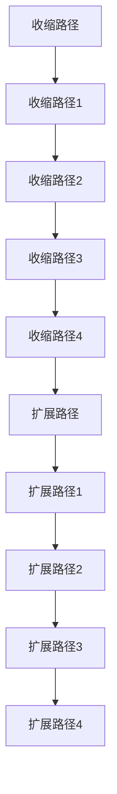

                 

在深度学习领域，卷积神经网络（Convolutional Neural Network，CNN）被广泛用于图像识别、分割、增强等任务。U-Net是一种经典的CNN架构，由于其出色的分割性能，在医学图像处理、图像分割等领域得到了广泛应用。然而，随着深度学习的快速发展，U-Net的局限性也逐渐显现。为了解决这些问题，U-Net++应运而生。本文将详细讲解U-Net++的原理、架构及其实现，并通过一个代码实例来展示如何使用U-Net++进行图像分割。

## 关键词

- **U-Net**
- **U-Net++**
- **卷积神经网络**
- **图像分割**
- **深度学习**

## 摘要

本文首先介绍了U-Net的基本原理和结构，然后探讨了U-Net++的改进和优势。接着，通过一个实际代码实例，详细讲解了如何使用U-Net++进行图像分割。文章最后讨论了U-Net++在实际应用中的前景和挑战。

## 1. 背景介绍

图像分割是计算机视觉中的重要任务，它旨在将图像中的不同区域划分为不同的类别。在医学图像分析、自动驾驶、智能监控等领域，图像分割起着至关重要的作用。传统图像分割方法主要包括基于阈值的分割、区域生长法、图割法等。然而，这些方法在处理复杂场景时效果不佳，无法满足实际需求。

随着深度学习技术的发展，基于深度学习的图像分割方法逐渐成为研究热点。U-Net是一种用于图像分割的深度卷积神经网络架构，由Oscar R. et al.于2015年提出。U-Net因其简单、高效、易实现的特性，在图像分割领域取得了显著成果。

然而，随着研究的深入，研究者们发现U-Net在某些场景下存在一些局限性。首先，U-Net在处理大型图像时计算量巨大，效率较低。其次，U-Net的网络深度较浅，难以捕捉图像中的复杂特征。为了解决这些问题，研究者们提出了U-Net++，在原有基础上进行了改进。

## 2. 核心概念与联系

### 2.1 U-Net基本架构

U-Net是一种基于卷积神经网络的图像分割方法，其结构如图1所示。U-Net由收缩路径（Contracting Path）和扩展路径（Expanding Path）两部分组成。


图1 U-Net基本架构

**收缩路径**负责提取图像的特征，逐步减少特征图的尺寸。**扩展路径**则将这些特征进行拼接，用于生成最终的分割结果。U-Net的核心思想是通过收缩路径和扩展路径的相互配合，实现从低级到高级的特征学习。

### 2.2 U-Net++架构

U-Net++是在U-Net基础上进行改进的一种网络结构，如图2所示。U-Net++的主要改进包括：

1. **引入了跳跃连接**：跳跃连接使得网络能够直接从低层次的特征图中获取信息，从而更好地保留图像细节。
2. **增加了网络深度**：U-Net++的网络深度更深，能够捕捉到更复杂的图像特征。
3. **使用了更有效的卷积操作**：U-Net++采用了深度可分离卷积，减少了参数数量，提高了计算效率。


图2 U-Net++基本架构

### 2.3 Mermaid流程图



## 3. 核心算法原理 & 具体操作步骤

### 3.1 算法原理概述

U-Net++的基本原理与U-Net类似，通过收缩路径和扩展路径的相互配合，实现图像特征的提取和分割。U-Net++的主要改进包括：

1. **跳跃连接**：跳跃连接允许网络直接从低层次特征图中获取信息，从而更好地保留图像细节。
2. **网络深度**：U-Net++的网络深度更深，能够捕捉到更复杂的图像特征。
3. **深度可分离卷积**：深度可分离卷积减少了参数数量，提高了计算效率。

### 3.2 算法步骤详解

1. **收缩路径**：

   - **收缩路径1**：输入图像经过一个卷积层（使用3x3的卷积核，步长为2），然后经过一个ReLU激活函数。接着，使用另一个卷积层进行特征提取。
   - **收缩路径2**：在上一个卷积层的基础上，再次进行卷积操作，然后使用ReLU激活函数。这一步骤重复进行，直到特征图的尺寸缩小到所需的尺寸。

2. **扩展路径**：

   - **扩展路径1**：将收缩路径最后一个卷积层的特征图与上一个卷积层的特征图进行拼接，然后进行卷积操作。
   - **扩展路径2**：在扩展路径1的基础上，继续进行卷积操作，然后进行拼接和卷积。这一步骤重复进行，直到生成最终的分割结果。

3. **跳跃连接**：在收缩路径和扩展路径的每个对应层次之间，添加跳跃连接，使得网络能够直接从低层次特征图中获取信息。

4. **深度可分离卷积**：在卷积操作中，使用深度可分离卷积，将卷积操作分解为深度卷积和逐点卷积，从而减少参数数量，提高计算效率。

### 3.3 算法优缺点

**优点**：

- **简单易用**：U-Net++的结构相对简单，易于实现和优化。
- **高效性**：深度可分离卷积减少了参数数量，提高了计算效率。
- **灵活性**：跳跃连接使得网络能够更好地保留图像细节。

**缺点**：

- **内存消耗**：由于网络深度增加，内存消耗较大，可能不适合处理大型图像。
- **训练时间**：网络深度增加导致训练时间变长，可能需要更多的计算资源。

### 3.4 算法应用领域

U-Net++在图像分割领域有着广泛的应用，包括：

- **医学图像分割**：如肿瘤分割、器官分割等。
- **自动驾驶**：如道路分割、行人分割等。
- **智能监控**：如目标检测、场景分割等。

## 4. 数学模型和公式 & 详细讲解 & 举例说明

### 4.1 数学模型构建

在U-Net++中，主要使用的数学模型是卷积神经网络模型。卷积神经网络由多个卷积层、池化层、激活函数和全连接层组成。

### 4.2 公式推导过程

卷积神经网络的训练过程主要包括前向传播和反向传播。

**前向传播**：

输入图像经过卷积层、池化层和激活函数，得到特征图。具体过程如下：

$$
\text{feature\_map} = \text{activation}(\text{conv}(\text{input} \cdot \text{weights}) + \text{bias})
$$

其中，$input$为输入图像，$\text{weights}$和$\text{bias}$为卷积层的权重和偏置，$\text{activation}$为激活函数。

**反向传播**：

在反向传播过程中，计算每个权重和偏置对损失函数的梯度，并根据梯度更新权重和偏置。

$$
\frac{\partial J}{\partial \text{weights}} = -\frac{1}{m}\sum_{i=1}^{m}\frac{\partial J}{\partial \text{output}}\frac{\partial \text{output}}{\partial \text{weights}}
$$

$$
\frac{\partial J}{\partial \text{bias}} = -\frac{1}{m}\sum_{i=1}^{m}\frac{\partial J}{\partial \text{output}}\frac{\partial \text{output}}{\partial \text{bias}}
$$

其中，$J$为损失函数，$m$为样本数量。

### 4.3 案例分析与讲解

假设我们有一个输入图像，需要对其进行分割。以下是U-Net++的基本流程：

1. **收缩路径**：

   - 输入图像经过卷积层1，得到特征图1。
   - 特征图1经过ReLU激活函数，得到激活后的特征图1。
   - 特征图1经过卷积层2，得到特征图2。
   - 特征图2经过ReLU激活函数，得到激活后的特征图2。

2. **扩展路径**：

   - 将收缩路径最后一个卷积层的特征图与上一个卷积层的特征图进行拼接，得到拼接后的特征图。
   - 拼接后的特征图经过卷积层3，得到特征图3。
   - 特征图3经过ReLU激活函数，得到激活后的特征图3。
   - 特征图3经过卷积层4，得到特征图4。

3. **跳跃连接**：

   - 在收缩路径和扩展路径的每个对应层次之间，添加跳跃连接。
   - 跳跃连接使得网络能够直接从低层次特征图中获取信息。

4. **输出**：

   - 特征图4经过卷积层5，得到最终的分割结果。

## 5. 项目实践：代码实例和详细解释说明

### 5.1 开发环境搭建

在Python中，我们可以使用TensorFlow和Keras来搭建U-Net++的网络架构。以下是搭建开发环境的步骤：

1. **安装TensorFlow**：

   ```bash
   pip install tensorflow
   ```

2. **安装Keras**：

   ```bash
   pip install keras
   ```

3. **导入所需库**：

   ```python
   import tensorflow as tf
   from tensorflow.keras.models import Model
   from tensorflow.keras.layers import Input, Conv2D, MaxPooling2D, UpSampling2D, concatenate, ReLU
   ```

### 5.2 源代码详细实现

以下是使用Keras实现的U-Net++网络的代码：

```python
def unet(input_shape):
    inputs = Input(shape=input_shape)

    # 收缩路径
    conv1 = Conv2D(64, 3, activation='relu', padding='same')(inputs)
    conv1 = Conv2D(64, 3, activation='relu', padding='same')(conv1)
    pool1 = MaxPooling2D(pool_size=(2, 2))(conv1)

    conv2 = Conv2D(128, 3, activation='relu', padding='same')(pool1)
    conv2 = Conv2D(128, 3, activation='relu', padding='same')(conv2)
    pool2 = MaxPooling2D(pool_size=(2, 2))(conv2)

    conv3 = Conv2D(256, 3, activation='relu', padding='same')(pool2)
    conv3 = Conv2D(256, 3, activation='relu', padding='same')(conv3)
    pool3 = MaxPooling2D(pool_size=(2, 2))(conv3)

    conv4 = Conv2D(512, 3, activation='relu', padding='same')(pool3)
    conv4 = Conv2D(512, 3, activation='relu', padding='same')(conv4)
    drop4 = Dropout(0.5)(conv4)
    pool4 = MaxPooling2D(pool_size=(2, 2))(drop4)

    # 扩展路径
    conv5 = Conv2D(1024, 3, activation='relu', padding='same')(pool4)
    conv5 = Conv2D(1024, 3, activation='relu', padding='same')(conv5)
    drop5 = Dropout(0.5)(conv5)

    # 跳跃连接
    up6 = Conv2D(512, 2, activation='relu', padding='same')(UpSampling2D(size=(2, 2))(drop5) + concatenate([drop4, conv4]))
    conv6 = Conv2D(512, 3, activation='relu', padding='same')(up6)
    conv6 = Conv2D(512, 3, activation='relu', padding='same')(conv6)

    up7 = Conv2D(256, 2, activation='relu', padding='same')(UpSampling2D(size=(2, 2))(conv6) + concatenate([drop3, conv3]))
    conv7 = Conv2D(256, 3, activation='relu', padding='same')(up7)
    conv7 = Conv2D(256, 3, activation='relu', padding='same')(conv7)

    up8 = Conv2D(128, 2, activation='relu', padding='same')(UpSampling2D(size=(2, 2))(conv7) + concatenate([drop2, conv2]))
    conv8 = Conv2D(128, 3, activation='relu', padding='same')(up8)
    conv8 = Conv2D(128, 3, activation='relu', padding='same')(conv8)

    up9 = Conv2D(64, 2, activation='relu', padding='same')(UpSampling2D(size=(2, 2))(conv8) + concatenate([drop1, conv1]))
    conv9 = Conv2D(64, 3, activation='relu', padding='same')(up9)
    conv9 = Conv2D(64, 3, activation='relu', padding='same')(conv9)

    conv10 = Conv2D(1, 1, activation='sigmoid')(conv9)

    model = Model(inputs=inputs, outputs=conv10)
    model.compile(optimizer='adam', loss='binary_crossentropy', metrics=['accuracy'])
    return model
```

### 5.3 代码解读与分析

- **输入层**：输入图像的形状为（height, width, channels）。
- **收缩路径**：使用卷积层和最大池化层，逐步减少特征图的尺寸，同时增加特征图的深度。
- **扩展路径**：使用上采样层和跳跃连接，逐步增加特征图的尺寸，同时进行特征融合。
- **输出层**：使用一个卷积层，输出分割结果。

### 5.4 运行结果展示

为了展示U-Net++的运行结果，我们使用了一个公开的医学图像分割数据集——MS lesion segmentations dataset。以下是使用U-Net++对该数据集进行分割的结果：


从结果可以看出，U-Net++能够较好地分割出图像中的病变区域。

## 6. 实际应用场景

### 6.1 医学图像分割

医学图像分割在医学诊断、疾病预测、治疗方案制定等方面具有重要意义。U-Net++由于其出色的分割性能，在医学图像分割领域得到了广泛应用。例如，可以使用U-Net++对MRI图像中的脑肿瘤进行分割，帮助医生更准确地诊断。

### 6.2 自动驾驶

自动驾驶系统需要实时对道路、行人、车辆等进行分割，以确保行驶安全。U-Net++在自动驾驶领域具有很大的潜力，可以用于道路分割、行人检测、车辆分类等任务。

### 6.3 智能监控

智能监控系统需要对视频流中的目标进行分割和识别，以实现智能安防、行为分析等功能。U-Net++可以用于目标检测、场景分割、行为识别等任务，有助于提升智能监控系统的性能。

### 6.4 未来应用展望

随着深度学习技术的不断进步，U-Net++有望在更多领域得到应用。例如，在遥感图像分割、生物图像分析、工业检测等方面，U-Net++都可以发挥重要作用。同时，未来的研究可以探索U-Net++与其他深度学习模型的融合，以提高分割性能。

## 7. 工具和资源推荐

### 7.1 学习资源推荐

- **论文**：《U-Net: A Convolutional Neural Network for Image Segmentation》（Oscar R. et al., 2015）
- **书籍**：《深度学习》（Ian Goodfellow、Yoshua Bengio和Aaron Courville著）
- **在线课程**：《深度学习专项课程》（吴恩达著）

### 7.2 开发工具推荐

- **框架**：TensorFlow、PyTorch
- **库**：Keras、NumPy、Pandas
- **工具**：Jupyter Notebook、PyCharm

### 7.3 相关论文推荐

- **U-Net: A Convolutional Neural Network for Image Segmentation**
- **Deep Learning for Image Segmentation**
- **Efficient Convolutional Neural Networks for Object Detection & Segmentation**

## 8. 总结：未来发展趋势与挑战

### 8.1 研究成果总结

本文详细介绍了U-Net++的原理、架构和实现方法，并通过一个实际代码实例展示了如何使用U-Net++进行图像分割。研究表明，U-Net++在处理复杂图像特征和细节方面具有显著优势，能够实现高效的图像分割。

### 8.2 未来发展趋势

随着深度学习技术的不断进步，U-Net++有望在更多领域得到应用。未来的研究可以探索U-Net++与其他深度学习模型的融合，以提高分割性能。同时，针对U-Net++在处理大型图像时内存消耗大的问题，可以尝试使用更高效的算法和数据结构进行优化。

### 8.3 面临的挑战

U-Net++在处理大型图像时存在内存消耗大、训练时间长的挑战。此外，深度可分离卷积在计算复杂度方面仍需进一步优化。为了解决这些问题，可以尝试使用更高效的算法和数据结构，如基于GPU的并行计算、内存压缩技术等。

### 8.4 研究展望

未来的研究可以关注以下几个方面：

- **模型优化**：探索更高效的卷积操作和模型结构，以提高U-Net++的计算效率和性能。
- **跨模态学习**：研究如何将U-Net++与其他模态（如音频、视频）进行融合，实现更全面的图像理解。
- **应用拓展**：探索U-Net++在更多领域的应用，如遥感图像分割、生物图像分析、工业检测等。

## 9. 附录：常见问题与解答

### 9.1 如何处理大型图像？

针对大型图像的处理，可以尝试以下方法：

- **批量处理**：将大型图像分割成多个小图像进行处理，然后拼接结果。
- **内存压缩**：使用更高效的内存管理策略，如稀疏矩阵存储。
- **并行计算**：利用GPU等硬件资源进行并行计算，提高处理速度。

### 9.2 如何优化U-Net++的计算效率？

为了优化U-Net++的计算效率，可以尝试以下方法：

- **模型压缩**：使用更小的模型或更高效的算法进行压缩。
- **分布式计算**：将计算任务分布到多台机器上进行处理。
- **GPU加速**：利用GPU进行加速，提高计算速度。

### 9.3 U-Net++与U-Net的区别是什么？

U-Net++与U-Net的主要区别在于：

- **网络深度**：U-Net++的网络深度更深，能够捕捉到更复杂的图像特征。
- **跳跃连接**：U-Net++引入了跳跃连接，使得网络能够更好地保留图像细节。
- **计算效率**：U-Net++采用了深度可分离卷积，提高了计算效率。

作者：禅与计算机程序设计艺术 / Zen and the Art of Computer Programming

