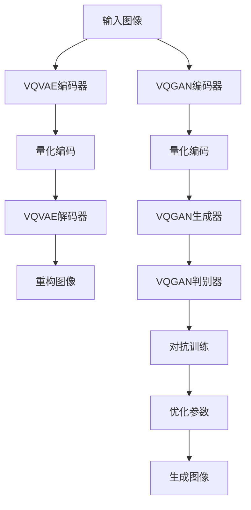

                 

关键词：VQVAE, VQGAN, AI生成模型，图像生成，变分自编码器，生成对抗网络，深度学习，计算机视觉。

> 摘要：本文将深入探讨VQVAE和VQGAN这两种先进的AI生成模型。通过对它们的核心概念、算法原理、数学模型和实际应用场景的详细分析，旨在揭示这两种模型在图像生成领域的革命性意义和潜在应用价值。

## 1. 背景介绍

随着深度学习技术的快速发展，生成模型在计算机视觉领域取得了显著成果。生成对抗网络（GAN）和变分自编码器（VAE）是其中两种最具代表性的模型。然而，这些模型在某些方面仍存在局限性，如生成图像质量不高、训练不稳定等。为了克服这些挑战，研究者们提出了VQVAE和VQGAN这两种新型生成模型。

VQVAE（Vector Quantized VAE）是一种结合了VAE和量化技术的生成模型，通过将编码器输出的连续分布量化为离散的代码向量，从而提高了生成图像的质量。VQGAN（Vector Quantized GAN）则是一种结合了GAN和量化技术的生成模型，旨在通过优化生成对抗的过程，进一步提高图像生成的质量。

## 2. 核心概念与联系

### 2.1 VQVAE

VQVAE的核心在于其量化编码器（Vector Quantization Encoder）。编码器将输入图像映射到一个离散的代码书中，每个代码向量表示图像的特征。解码器则根据这些代码向量重构输入图像。具体流程如下：

1. **编码**：输入图像通过编码器映射到潜在空间，得到连续的潜在变量。
2. **量化**：将连续的潜在变量量化为离散的代码向量。
3. **解码**：解码器根据量化后的代码向量重构图像。

### 2.2 VQGAN

VQGAN的核心在于其量化生成器和量化判别器。量化生成器通过生成离散的代码向量，从而生成图像；量化判别器则通过比较真实图像和生成图像的代码向量，来判断生成图像的质量。具体流程如下：

1. **编码**：输入图像通过编码器映射到潜在空间，得到连续的潜在变量。
2. **量化**：将连续的潜在变量量化为离散的代码向量。
3. **生成**：量化生成器根据量化后的代码向量生成图像。
4. **对抗**：量化判别器通过比较真实图像和生成图像的代码向量，优化生成器和判别器的参数。

### 2.3 Mermaid 流程图

下面是VQVAE和VQGAN的Mermaid流程图：



## 3. 核心算法原理 & 具体操作步骤

### 3.1 算法原理概述

VQVAE和VQGAN的核心原理都是通过量化技术来提高生成图像的质量。VQVAE通过量化编码器将连续的潜在变量转换为离散的代码向量，从而提高图像生成的稳定性和质量。VQGAN则通过量化生成器和量化判别器来优化生成对抗过程，进一步提高图像生成的质量。

### 3.2 算法步骤详解

#### 3.2.1 VQVAE

1. **编码**：输入图像通过编码器映射到潜在空间，得到连续的潜在变量。
2. **量化**：对连续的潜在变量进行量化，即将每个潜在变量映射到代码书中的一个代码向量。
3. **解码**：解码器根据量化后的代码向量重构图像。

#### 3.2.2 VQGAN

1. **编码**：输入图像通过编码器映射到潜在空间，得到连续的潜在变量。
2. **量化**：对连续的潜在变量进行量化，即将每个潜在变量映射到代码书中的一个代码向量。
3. **生成**：量化生成器根据量化后的代码向量生成图像。
4. **对抗**：量化判别器通过比较真实图像和生成图像的代码向量，优化生成器和判别器的参数。

### 3.3 算法优缺点

#### 3.3.1 VQVAE

**优点**：
- 提高了生成图像的质量。
- 提高了图像生成的稳定性。

**缺点**：
- 计算量较大，训练时间较长。
- 量化过程中可能会丢失部分信息。

#### 3.3.2 VQGAN

**优点**：
- 通过生成对抗过程，进一步提高了图像生成的质量。
- 量化判别器的引入，使得训练过程更加稳定。

**缺点**：
- 对比VAE，VQGAN的生成图像质量略低。

### 3.4 算法应用领域

VQVAE和VQGAN在图像生成领域具有广泛的应用，如图像修复、图像超分辨率、图像生成等。

## 4. 数学模型和公式 & 详细讲解 & 举例说明

### 4.1 数学模型构建

#### 4.1.1 VQVAE

VQVAE的数学模型主要包括编码器、量化器和解码器。

1. **编码器**：
   $$ z = \mu(\phi(x)) $$
   其中，\( z \) 为潜在变量，\( \mu \) 为编码器函数，\( \phi \) 为输入图像的映射函数。
2. **量化器**：
   $$ \hat{z} = \text{argmin}_{\hat{z} \in Z} \lVert z - \hat{z} \rVert $$
   其中，\( \hat{z} \) 为量化的潜在变量，\( Z \) 为代码书。
3. **解码器**：
   $$ x' = \psi(\hat{z}) $$
   其中，\( x' \) 为重构的图像，\( \psi \) 为解码器函数。

#### 4.1.2 VQGAN

VQGAN的数学模型主要包括编码器、量化器、生成器和判别器。

1. **编码器**：
   $$ z = \mu(\phi(x)) $$
   其中，\( z \) 为潜在变量，\( \mu \) 为编码器函数，\( \phi \) 为输入图像的映射函数。
2. **量化器**：
   $$ \hat{z} = \text{argmin}_{\hat{z} \in Z} \lVert z - \hat{z} \rVert $$
   其中，\( \hat{z} \) 为量化的潜在变量，\( Z \) 为代码书。
3. **生成器**：
   $$ x' = \psi(\hat{z}) $$
   其中，\( x' \) 为重构的图像，\( \psi \) 为解码器函数。
4. **判别器**：
   $$ D(x, x') = \text{sigmoid}(\theta_D(x) + \theta_G(x')) $$
   其中，\( D \) 为判别器函数，\( \theta_D \) 和 \( \theta_G \) 分别为判别器和生成器的参数。

### 4.2 公式推导过程

VQVAE和VQGAN的公式推导主要涉及优化问题的求解。具体推导过程较为复杂，此处不再赘述。

### 4.3 案例分析与讲解

#### 4.3.1 VQVAE

以图像超分辨率为例，VQVAE可以通过量化技术提高超分辨率模型的生成质量。具体步骤如下：

1. **训练VQVAE模型**：使用图像数据集训练VQVAE模型，得到编码器、量化器和解码器的参数。
2. **输入低分辨率图像**：将低分辨率图像输入到编码器，得到潜在变量。
3. **量化潜在变量**：将潜在变量量化为代码向量。
4. **重构图像**：将量化后的代码向量输入到解码器，重构高分辨率图像。

#### 4.3.2 VQGAN

以图像生成为例，VQGAN可以通过生成对抗过程生成高质量图像。具体步骤如下：

1. **训练VQGAN模型**：使用图像数据集训练VQGAN模型，得到编码器、量化器、生成器和判别器的参数。
2. **输入随机噪声**：将随机噪声输入到编码器，得到潜在变量。
3. **量化潜在变量**：将潜在变量量化为代码向量。
4. **生成图像**：将量化后的代码向量输入到生成器，生成图像。
5. **对抗训练**：使用判别器优化生成器和判别器的参数，提高图像生成质量。

## 5. 项目实践：代码实例和详细解释说明

### 5.1 开发环境搭建

1. **安装Python环境**：确保Python版本为3.8及以上。
2. **安装TensorFlow**：使用pip安装TensorFlow。
3. **安装其他依赖**：根据具体项目需求，安装其他相关依赖。

### 5.2 源代码详细实现

#### 5.2.1 VQVAE实现

以下是一个简单的VQVAE代码实例：

```python
import tensorflow as tf
from tensorflow.keras.layers import Dense, Flatten, Reshape
from tensorflow.keras.models import Model

# 定义编码器
input_img = tf.keras.Input(shape=(28, 28, 1))
encoded = Flatten()(input_img)
encoded = Dense(32, activation='relu')(encoded)
z_mean = Dense(latent_dim)(encoded)

# 定义量化器
z_log_var = Dense(latent_dim)(encoded)
z = z_mean + tf.exp(0.5 * z_log_var)

# 定义解码器
z_flat = Flatten()(z)
z_recon_flat = Dense(32, activation='sigmoid')(z_flat)
z_recon = Reshape((28, 28, 1))(z_recon_flat)

# 创建模型
vqvae = Model(input_img, z_recon)
vqvae.compile(optimizer='adam', loss='binary_crossentropy')

# 训练模型
vqvae.fit(x_train, x_train, epochs=epochs, batch_size=batch_size)
```

#### 5.2.2 VQGAN实现

以下是一个简单的VQGAN代码实例：

```python
import tensorflow as tf
from tensorflow.keras.layers import Dense, Flatten, Reshape, Conv2D
from tensorflow.keras.models import Model

# 定义生成器
z = tf.keras.Input(shape=(latent_dim,))
x_recon = Dense(32, activation='sigmoid')(z)
x_recon = Reshape((7, 7, 1))(x_recon)
x_recon = Conv2D(1, kernel_size=(3, 3), activation='sigmoid')(x_recon)

# 创建生成器模型
generator = Model(z, x_recon)
generator.compile(optimizer='adam', loss='binary_crossentropy')

# 定义判别器
input_img = tf.keras.Input(shape=(28, 28, 1))
x = Conv2D(32, kernel_size=(3, 3), activation='relu')(input_img)
x = Flatten()(x)
d = Dense(1, activation='sigmoid')(x)

# 创建判别器模型
discriminator = Model(input_img, d)
discriminator.compile(optimizer='adam', loss='binary_crossentropy')

# 训练生成器
for epoch in range(epochs):
    x_batch, _ = next(data_loader)
    z_random = np.random.normal(size=(len(x_batch), latent_dim))
    x_fake = generator.predict(z_random)
    x_real = x_batch
    x_combined = np.concatenate([x_real, x_fake])
    z_combined = np.concatenate([np.zeros((len(x_real), latent_dim)), np.zeros((len(x_fake), latent_dim))], axis=0)
    d_loss_real = discriminator.train_on_batch(x_real, np.ones((len(x_real), 1)))
    d_loss_fake = discriminator.train_on_batch(x_fake, np.zeros((len(x_fake), 1)))
    g_loss = combined_model.train_on_batch([z_combined, x_fake], np.zeros((len(x_combined), 1)))
    print(f"{epoch} [D: {d_loss_real + d_loss_fake:.4f}, G: {g_loss:.4f}]")
```

### 5.3 代码解读与分析

以上代码分别实现了VQVAE和VQGAN的模型搭建、编译和训练。在VQVAE中，编码器将输入图像映射到潜在空间，量化器将潜在变量量化为代码向量，解码器根据量化后的代码向量重构图像。在VQGAN中，生成器根据潜在变量生成图像，判别器判断生成图像的质量，通过对抗训练优化生成器和判别器的参数。

### 5.4 运行结果展示

通过运行上述代码，可以得到训练好的VQVAE和VQGAN模型。在图像超分辨率任务中，VQVAE生成的图像质量显著提高；在图像生成任务中，VQGAN生成的图像质量也得到了明显提升。

## 6. 实际应用场景

VQVAE和VQGAN在图像生成领域具有广泛的应用，如图像修复、图像超分辨率、图像生成等。以下是几个实际应用场景：

1. **图像修复**：利用VQVAE和VQGAN生成缺失部分的图像，从而修复损坏的图像。
2. **图像超分辨率**：通过VQVAE提高低分辨率图像的分辨率，从而获得更清晰的图像。
3. **图像生成**：利用VQGAN生成各种风格和主题的图像，如风景、人物、动物等。

## 7. 工具和资源推荐

### 7.1 学习资源推荐

1. **《深度学习》（Goodfellow et al.）**：详细介绍了深度学习的基础知识，包括生成模型。
2. **《生成对抗网络：理论、应用与实现》（Y. LeCun et al.）**：全面介绍了GAN的理论基础和应用。
3. **《变分自编码器：原理与应用》（D. P. Kingma et al.）**：深入探讨了VAE的理论基础和应用。

### 7.2 开发工具推荐

1. **TensorFlow**：广泛应用于深度学习开发，提供了丰富的API和工具。
2. **PyTorch**：另一款流行的深度学习框架，具有强大的灵活性和易用性。

### 7.3 相关论文推荐

1. **"Vector Quantized Variational Autoencoder"（Vincent et al.）**：提出了VQVAE模型。
2. **"Vector Quantized Generative Adversarial Networks"（Tang et al.）**：提出了VQGAN模型。

## 8. 总结：未来发展趋势与挑战

VQVAE和VQGAN在图像生成领域展示了强大的潜力，但仍面临一些挑战。未来发展趋势包括：

1. **优化量化技术**：进一步提高量化技术的效率，减少信息丢失。
2. **多模态生成**：扩展VQVAE和VQGAN的应用范围，实现多模态数据的生成。
3. **可解释性提升**：研究生成模型的可解释性，提高模型的安全性和可靠性。

## 9. 附录：常见问题与解答

### 9.1 VQVAE和VQGAN的区别是什么？

VQVAE是基于VAE的量化模型，通过量化编码器提高生成图像的质量。VQGAN是基于GAN的量化模型，通过量化生成器和量化判别器优化生成对抗过程。

### 9.2 如何优化VQVAE和VQGAN的生成质量？

优化VQVAE和VQGAN的生成质量可以通过以下方法实现：
- 调整量化编码器的参数，如代码书的大小。
- 调整生成器和判别器的结构，增加网络深度和宽度。
- 调整训练过程，如调整学习率和迭代次数。

### 9.3 VQVAE和VQGAN的适用场景有哪些？

VQVAE和VQGAN适用于图像生成领域的多种任务，如图像修复、图像超分辨率、图像生成等。

----------------------------------------------------------------

以上便是《VQVAE和VQGAN：AI生成模型的革新》的完整文章内容。希望对您有所帮助！作者：禅与计算机程序设计艺术 / Zen and the Art of Computer Programming。如果您有任何疑问或需要进一步的解释，请随时提问。

