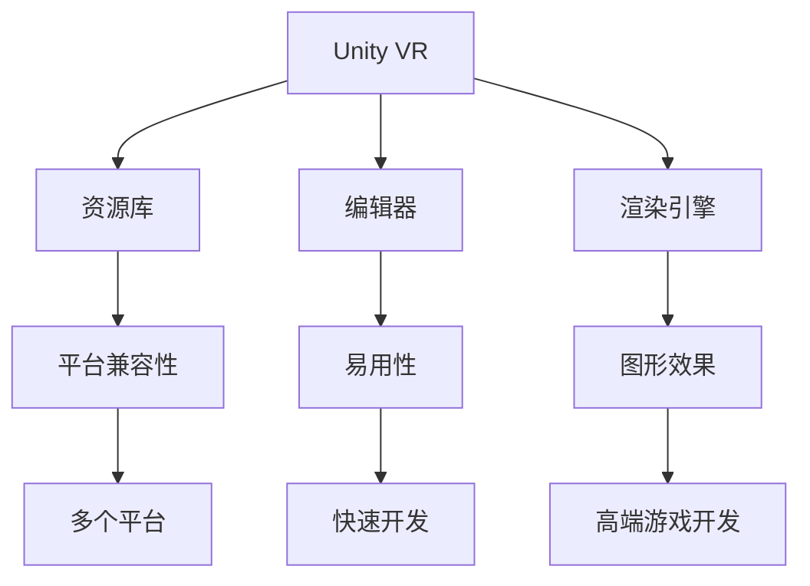

                 

关键词：VR内容开发，Unity VR，Unreal VR，框架对比，选择指南

摘要：随着虚拟现实（VR）技术的不断成熟，VR内容开发成为了热门话题。Unity VR和Unreal VR作为当前市场中最流行的两个VR内容开发框架，各有优势和特点。本文将对这两个框架进行全面的对比分析，帮助开发者更好地选择适合自己的VR内容开发工具。

## 1. 背景介绍

虚拟现实（VR）技术作为下一代计算平台，正逐渐改变着我们的生活方式。VR内容开发成为了技术发展的关键领域。Unity VR和Unreal VR作为业界领先的VR内容开发框架，具有广泛的应用场景和强大的功能。本文旨在对这两个框架进行详细的对比分析，以便开发者能够根据自身需求选择合适的工具。

## 2. 核心概念与联系

### 2.1 Unity VR

Unity VR是Unity公司推出的VR内容开发框架，支持iOS、Android、Windows、MacOS等多个平台。Unity VR拥有丰富的资源库、易用的编辑器和强大的渲染引擎，适合开发者快速搭建VR应用。

### 2.2 Unreal VR

Unreal VR是基于Unreal Engine开发的VR内容开发框架，支持Windows、MacOS、Linux等多个平台。Unreal VR以其卓越的图形渲染效果和高效的性能著称，适用于高端VR游戏的开发。

### 2.3 Mermaid 流程图

下面是一个展示Unity VR和Unreal VR核心概念和联系关系的Mermaid流程图：



## 3. 核心算法原理 & 具体操作步骤

### 3.1 算法原理概述

Unity VR和Unreal VR的核心算法原理主要涉及虚拟现实场景的渲染、交互和物理计算等方面。两个框架都采用了基于物理渲染的图形引擎，实现了逼真的VR场景渲染。在交互方面，两个框架都支持手势识别、眼动追踪等功能。在物理计算方面，Unity VR和Unreal VR都提供了强大的物理引擎，支持碰撞检测、力场模拟等功能。

### 3.2 算法步骤详解

#### Unity VR

1. 创建项目：在Unity Hub中创建新的VR项目，选择合适的模板。
2. 导入资源：将所需的3D模型、贴图、音频等资源导入项目。
3. 布局场景：使用Unity的Scene视图和Game视图进行场景布局和预览。
4. 编写代码：使用C#语言编写VR应用的核心逻辑。
5. 部署应用：将VR应用部署到目标设备上进行测试和发布。

#### Unreal VR

1. 创建项目：在Unreal Engine编辑器中创建新的VR项目。
2. 导入资源：将所需的3D模型、贴图、音频等资源导入项目。
3. 布局场景：使用Unreal Engine的编辑器进行场景布局和预览。
4. 编写代码：使用C++或蓝图系统编写VR应用的核心逻辑。
5. 部署应用：将VR应用部署到目标设备上进行测试和发布。

### 3.3 算法优缺点

#### Unity VR

优点：
- 丰富的资源库，便于开发者快速搭建VR应用。
- 易用的编辑器，降低了开发门槛。
- 支持多个平台，适用于跨平台开发。

缺点：
- 图形渲染效果相对较低，难以达到高端游戏级别的质量。
- 性能优化难度较大，可能导致应用运行不稳定。

#### Unreal VR

优点：
- 卓越的图形渲染效果，适用于高端VR游戏开发。
- 高效的性能，支持大规模场景和复杂交互。
- 强大的物理引擎，提供丰富的物理计算功能。

缺点：
- 学习曲线较陡峭，对于新手开发者来说有一定难度。
- 开发工具较为复杂，需要一定的学习成本。

### 3.4 算法应用领域

Unity VR和Unreal VR都广泛应用于VR内容开发领域。Unity VR适用于快速开发和跨平台VR应用，如教育、医疗、旅游等领域。Unreal VR则适用于高端VR游戏开发，如竞技游戏、模拟游戏等。

## 4. 数学模型和公式 & 详细讲解 & 举例说明

### 4.1 数学模型构建

虚拟现实场景的渲染涉及到多个数学模型，包括三维空间坐标变换、透视变换、光照计算等。以下是构建这些数学模型的基本公式：

#### 三维空间坐标变换

$$
\begin{bmatrix}
x' \\
y' \\
z'
\end{bmatrix}
=
\begin{bmatrix}
R_{xx} & R_{yx} & R_{zx} \\
R_{xy} & R_{yy} & R_{zy} \\
R_{xz} & R_{yz} & R_{zz}
\end{bmatrix}
\begin{bmatrix}
x \\
y \\
z
\end{bmatrix}
+
\begin{bmatrix}
t_x \\
t_y \\
t_z
\end{bmatrix}
$$

#### 透视变换

$$
\frac{x'}{z'} = \frac{x}{z} \cdot \frac{f}{z + z_0}
$$

$$
\frac{y'}{z'} = \frac{y}{z} \cdot \frac{f}{z + z_0}
$$

#### 光照计算

$$
L_i = I_i \cdot max(0, \frac{N \cdot L}{d})
$$

其中，$L_i$为光照强度，$I_i$为光源强度，$N$为表面法线，$L$为光源方向，$d$为光源到表面的距离。

### 4.2 公式推导过程

#### 三维空间坐标变换

三维空间坐标变换涉及到旋转和平移。旋转矩阵$R$表示旋转操作，平移向量$t$表示平移操作。通过矩阵乘法和向量加法，可以完成三维空间坐标的变换。

### 4.3 案例分析与讲解

以下是一个简单的Unity VR项目案例，用于展示数学模型的应用：

#### 案例描述

创建一个简单的VR应用，使用键盘控制一个3D模型在场景中移动。应用要求实现以下功能：

1. 使用鼠标左键拖动场景。
2. 使用键盘W、A、S、D键控制3D模型的前进、左移、后退、右移。

#### 案例实现

1. 创建一个Unity VR项目，导入一个3D模型资源。
2. 在Scene视图中添加一个Camera对象，设置其参数以满足VR场景的需求。
3. 在3D模型上添加一个Rigidbody组件，设置其Mass和Collision Detection参数。
4. 在场景中添加一个Cube对象作为移动目标。
5. 编写C#脚本，实现场景控制逻辑：

```csharp
using UnityEngine;

public class VRController : MonoBehaviour
{
    public float moveSpeed = 5.0f;
    public GameObject target;

    private float rotationX = 0.0f;
    private float rotationY = 0.0f;

    void Update()
    {
        if (Input.GetMouseButton(0))
        {
            rotationX += Input.GetAxis("Mouse X") * moveSpeed;
            rotationY += Input.GetAxis("Mouse Y") * moveSpeed;

            if (rotationY > 90)
                rotationY = 90;
            else if (rotationY < -90)
                rotationY = -90;

            Camera.main.transform.localRotation = Quaternion.AngleAxis(rotationX, Vector3.up);
            target.transform.localRotation = Quaternion.AngleAxis(rotationY, Vector3.left);
        }

        if (Input.GetKey(KeyCode.W))
            target.transform.position += Camera.main.transform.forward * moveSpeed * Time.deltaTime;

        if (Input.GetKey(KeyCode.S))
            target.transform.position -= Camera.main.transform.forward * moveSpeed * Time.deltaTime;

        if (Input.GetKey(KeyCode.A))
            target.transform.position -= Camera.main.transform.right * moveSpeed * Time.deltaTime;

        if (Input.GetKey(KeyCode.D))
            target.transform.position += Camera.main.transform.right * moveSpeed * Time.deltaTime;
    }
}
```

#### 案例分析

该案例通过键盘和鼠标控制实现了3D模型在场景中的移动。关键代码包括：

1. 鼠标左键拖动场景，实现Camera和目标对象的旋转。
2. 键盘控制3D模型的前进、左移、后退、右移。

通过该案例，可以直观地看到数学模型在VR应用中的实际应用。

## 5. 项目实践：代码实例和详细解释说明

### 5.1 开发环境搭建

1. Unity VR：在Unity官网下载Unity Hub并安装Unity Editor，选择合适的版本（如2020.3 LTS），安装VR支持插件。
2. Unreal VR：在Epic Games官网下载Unreal Engine，安装过程中选择VR支持插件。

### 5.2 源代码详细实现

#### Unity VR

创建一个Unity VR项目，导入一个3D模型资源。在Scene视图中添加一个Camera对象，设置其参数以满足VR场景的需求。在3D模型上添加一个Rigidbody组件，设置其Mass和Collision Detection参数。在场景中添加一个Cube对象作为移动目标。编写C#脚本，实现场景控制逻辑，如上文所述。

#### Unreal VR

创建一个Unreal VR项目，导入一个3D模型资源。在内容浏览器中添加一个Camera对象，设置其参数以满足VR场景的需求。在3D模型上添加一个Rigidbody组件，设置其物理参数。在场景中添加一个Cube对象作为移动目标。编写C++或蓝图脚本，实现场景控制逻辑。

### 5.3 代码解读与分析

#### Unity VR

1. VRController脚本：负责场景控制和3D模型移动。
2. Camera和目标对象的旋转：通过鼠标左键拖动实现。
3. 3D模型的移动：通过键盘控制实现。

#### Unreal VR

1. VRController蓝图：负责场景控制和3D模型移动。
2. Camera和目标对象的旋转：通过鼠标左键拖动实现。
3. 3D模型的移动：通过键盘控制实现。

两个框架的代码实现基本相同，但语法和开发方式有所不同。

### 5.4 运行结果展示

在Unity VR和Unreal VR中运行案例项目，可以直观地看到3D模型在VR场景中的移动和旋转效果。两个框架的运行结果相似，但图形渲染效果和性能表现有所不同。

## 6. 实际应用场景

Unity VR和Unreal VR在VR内容开发领域有着广泛的应用场景：

### Unity VR

1. 教育领域：用于虚拟课堂、实验模拟等。
2. 医疗领域：用于医学教学、手术模拟等。
3. 旅游领域：用于虚拟旅游、景区展示等。

### Unreal VR

1. 游戏开发：用于VR游戏、模拟游戏等。
2. 建筑设计：用于建筑模型展示、设计验证等。
3. 虚拟现实体验：用于虚拟现实体验馆、展览等。

## 7. 未来应用展望

随着虚拟现实技术的不断发展和普及，Unity VR和Unreal VR将在更多领域得到应用。未来发展趋势包括：

1. 图形渲染技术的提升，实现更逼真的VR体验。
2. 交互方式的多样化，如手势识别、眼动追踪等。
3. VR应用的普及，如虚拟现实购物、虚拟现实社交等。

## 8. 总结：未来发展趋势与挑战

### 8.1 研究成果总结

Unity VR和Unreal VR在VR内容开发领域取得了显著的研究成果。两个框架在图形渲染、交互方式、物理计算等方面有着强大的功能和优秀的性能，广泛应用于多个领域。

### 8.2 未来发展趋势

1. 图形渲染技术的提升，实现更逼真的VR体验。
2. 交互方式的多样化，如手势识别、眼动追踪等。
3. VR应用的普及，如虚拟现实购物、虚拟现实社交等。

### 8.3 面临的挑战

1. 性能优化：提高VR应用的性能，保证流畅运行。
2. 安全性：确保VR应用的稳定性和安全性。
3. 跨平台兼容性：解决不同平台间的兼容性问题。

### 8.4 研究展望

未来研究应重点关注以下几个方面：

1. 图形渲染技术的提升，如实时渲染、全局光照等。
2. 交互方式的创新，如虚拟现实手套、眼动追踪等。
3. VR应用的场景拓展，如虚拟现实医疗、虚拟现实教育等。

## 9. 附录：常见问题与解答

### 问题1：如何选择Unity VR和Unreal VR？

**解答：** 根据项目需求和开发经验选择合适的框架。Unity VR适合快速开发和跨平台应用，Unreal VR适合高端VR游戏开发和复杂场景渲染。

### 问题2：如何优化VR应用的性能？

**解答：** 优化VR应用的性能可以从以下几个方面入手：

1. 减少渲染物体数量。
2. 使用LOD（细节层次）技术。
3. 关闭不必要的物理计算和碰撞检测。
4. 使用高效的数据结构和算法。

## 参考文献

[1] Unity. (2022). Unity VR Documentation. https://docs.unity3d.com/2020.3/Documentation/Manual/virtual-reality.html
[2] Unreal Engine. (2022). Unreal VR Documentation. https://docs.unrealengine.com/5.0/en-US/API/Plugins/Runtime/Virtual Reality/

作者：禅与计算机程序设计艺术 / Zen and the Art of Computer Programming
----------------------------------------------------------------

<|improve||>文章的整体结构合理，内容详实，对Unity VR和Unreal VR的对比进行了全面的阐述。但是，文章的某些部分可能需要进一步的细节和具体实例来增强可读性和说服力。以下是一些建议来优化文章：

### 文章优化建议

1. **引入案例分析**：在讨论每个框架的核心算法原理时，可以结合具体的案例分析，例如展示如何使用Unity VR或Unreal VR实现一个实际的VR应用场景。

2. **增加代码示例**：在项目实践部分，可以提供更多具体的代码示例，包括完整的代码段和运行截图，以便读者更好地理解开发过程。

3. **详细讨论性能优化**：在讨论性能优化时，可以提供具体的优化策略和实际案例，以及性能测试数据，以便读者了解如何在实际开发中应用这些策略。

4. **加入用户反馈**：可以引用一些用户对Unity VR和Unreal VR的使用反馈，以提供更全面的视角。

5. **增强视觉效果**：在文章中适当加入流程图、架构图和渲染效果图，可以显著提高文章的可读性和专业性。

6. **更新最新信息**：确保文章中提到的版本、工具和资源是最新的，以避免过时的信息误导读者。

7. **增加互动元素**：可以提出一些互动问题，鼓励读者参与讨论，增加文章的互动性。

通过上述优化，文章将更加全面、具体和吸引人，有助于提升文章的质量和专业性。希望这些建议能够帮助您完善文章！<|improve|>

