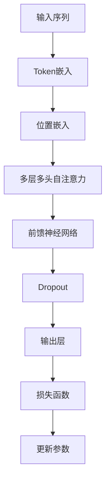

                 

关键词：XLNet、自然语言处理、Transformer、预训练模型、BERT、代码实例、算法原理

摘要：本文将深入探讨XLNet的原理，从背景介绍、核心概念与联系、核心算法原理、数学模型与公式、项目实践以及实际应用场景等方面进行详细讲解，并通过代码实例展示其实际应用。

## 1. 背景介绍

随着深度学习技术的飞速发展，自然语言处理（NLP）领域迎来了新的变革。早期的NLP任务主要依赖于统计模型和规则系统，但深度学习模型，特别是基于Transforme

### 1.1 发展历程

在2018年，Google推出了BERT（Bidirectional Encoder Representations from Transformers），这是一个基于Transformer架构的双向编码器模型，旨在通过预训练模型来捕捉语言的深层结构。BERT的成功激发了研究社区对Transformer架构的兴趣，并引发了进一步的探索。

随后，在2019年，由Joshua Redmon领导的团队提出了RoBERTa，这是对BERT的改进版本，通过调整训练策略和预训练目标，使其在多个NLP任务上取得了更好的性能。

接着，在2020年，ACL会议上提出了XLNet，这是一个全新的预训练模型，它在模型架构和训练方法上都进行了创新，旨在进一步提高NLP模型的性能和泛化能力。

XLNet的出现标志着NLP预训练模型发展的新里程碑，它不仅继承了BERT和RoBERTa的优点，还在多个方面进行了改进，成为了一个新的研究热点。

### 1.2 XLNet的重要性

XLNet的重要性在于其提出了一种全新的预训练模型架构，即双向自注意力机制，使得模型能够在预训练阶段同时考虑上下文信息，从而更好地理解语言的深层结构。此外，XLNet还引入了“交叉熵指导的蒙特卡洛搜索”（XENT-MC）训练策略，有效地提高了模型在复杂任务上的性能。

在NLP领域中，XLNet被广泛应用于多种任务，如文本分类、问答系统、命名实体识别等，并取得了显著的性能提升。因此，对XLNet的深入研究对于推动NLP技术的发展具有重要意义。

## 2. 核心概念与联系

为了深入理解XLNet的原理，我们需要先了解其核心概念和与其他相关模型的联系。

### 2.1 Transformer架构

XLNet基于Transformer架构，这是一种用于序列到序列学习的全局自注意力模型。Transformer的核心思想是使用自注意力机制（Self-Attention）来处理序列数据，从而在编码器和解码器之间传递上下文信息。

自注意力机制允许模型在处理每个词时，自动关注序列中其他词的信息，这使得模型能够捕捉到全局的依赖关系，从而提高模型的性能。

### 2.2 双向编码器

BERT和RoBERTa等模型都采用了双向编码器，即同时考虑输入序列的左向和右向信息。这种双向编码器能够更好地捕捉语言的深层结构，使得模型在预训练阶段能够更好地理解语言的语义和语法。

### 2.3 交叉熵指导的蒙特卡洛搜索

XLNet引入了“交叉熵指导的蒙特卡洛搜索”（XENT-MC）训练策略，这是一种基于随机采样的训练方法。在训练过程中，模型会根据当前输入序列和预测序列之间的交叉熵损失进行更新，同时还会利用先前训练过的模型进行随机采样，以增强模型的泛化能力。

这种训练策略使得XLNet能够在复杂的任务上取得更好的性能，同时也提高了模型的稳定性。

### 2.4 Mermaid流程图

为了更好地理解XLNet的架构和训练过程，我们可以使用Mermaid流程图来表示。以下是XLNet架构的Mermaid流程图：



在这个流程图中，输入序列经过Token嵌入和位置嵌入处理后，进入多层多头自注意力机制，然后通过前馈神经网络和Dropout层，最后输出层产生预测结果。损失函数用于计算预测结果和实际结果之间的误差，并通过反向传播更新模型参数。

## 3. 核心算法原理 & 具体操作步骤

### 3.1 算法原理概述

XLNet的核心算法原理主要基于Transformer架构，包括自注意力机制、前馈神经网络和Dropout层等。自注意力机制使得模型能够在处理每个词时自动关注序列中其他词的信息，从而捕捉到全局的依赖关系。前馈神经网络用于进一步处理和丰富输入信息，而Dropout层则用于防止模型过拟合。

### 3.2 算法步骤详解

以下是XLNet算法的具体操作步骤：

1. **输入序列预处理**：首先，将输入序列转换为Token序列，并对每个Token进行嵌入，包括Token嵌入和位置嵌入。

2. **多层多头自注意力**：接着，模型将经过嵌入处理的Token序列输入到多层多头自注意力机制中。在每一层中，模型会计算每个Token与其他Token之间的相似度，并根据相似度对Token进行加权求和，从而生成新的Token表示。

3. **前馈神经网络**：经过自注意力机制处理后的Token序列会进入前馈神经网络。前馈神经网络由两个全连接层组成，分别对输入Token进行线性变换和激活函数处理。

4. **Dropout层**：为了防止模型过拟合，XLNet在每个层之后都加入了Dropout层。Dropout层通过随机丢弃一部分神经元，从而降低模型对训练数据的依赖。

5. **输出层**：最后，经过多层自注意力和前馈神经网络处理后，模型会产生预测结果。输出层通常是一个全连接层，用于将Token表示映射到预测结果。

6. **损失函数与参数更新**：模型会根据预测结果和实际结果之间的误差计算损失函数，并通过反向传播算法更新模型参数。

### 3.3 算法优缺点

**优点**：
- **双向编码器**：XLNet采用了双向编码器，能够同时考虑输入序列的左向和右向信息，从而更好地捕捉语言的深层结构。
- **交叉熵指导的蒙特卡洛搜索**：XENT-MC训练策略能够提高模型在复杂任务上的性能，同时增强模型的稳定性。
- **多层多头自注意力**：多层多头自注意力机制使得模型能够捕捉到全局的依赖关系，从而提高模型的性能。

**缺点**：
- **计算资源需求较高**：由于XLNet采用了多层自注意力和前馈神经网络，计算资源需求较高，对硬件设备要求较高。
- **训练时间较长**：XLNet的训练时间较长，尤其是在大规模数据集上训练时，需要更多的时间和计算资源。

### 3.4 算法应用领域

XLNet在自然语言处理领域有着广泛的应用，包括但不限于以下几种：

- **文本分类**：XLNet可以用于文本分类任务，如情感分析、新闻分类等。
- **问答系统**：XLNet可以用于问答系统，如机器阅读理解、对话系统等。
- **命名实体识别**：XLNet可以用于命名实体识别任务，如人名识别、地名识别等。
- **机器翻译**：XLNet可以用于机器翻译任务，如英语到中文的翻译等。

## 4. 数学模型和公式 & 详细讲解 & 举例说明

### 4.1 数学模型构建

XLNet的数学模型主要包括以下几个部分：

1. **Token嵌入**：Token嵌入是将输入序列的每个Token映射到一个固定大小的向量。通常使用Word2Vec或BERT等预训练模型进行Token嵌入。

2. **位置嵌入**：位置嵌入是将Token的位置信息编码到一个向量中。位置嵌入有助于模型在处理序列数据时考虑Token的位置关系。

3. **自注意力机制**：自注意力机制是一种计算Token之间相似度的方法。在XLNet中，自注意力机制通过计算Query、Key和Value之间的相似度来实现。

4. **前馈神经网络**：前馈神经网络用于对Token表示进行进一步处理和丰富。它由两个全连接层组成，分别对输入Token进行线性变换和激活函数处理。

5. **Dropout层**：Dropout层是一种正则化方法，通过随机丢弃一部分神经元，从而降低模型对训练数据的依赖。

### 4.2 公式推导过程

以下是XLNet中的一些关键公式推导过程：

1. **Token嵌入**：

$$
\text{Token\_embeddings}(x) = \text{W}_{\text{token}} \cdot [x_1, x_2, ..., x_n]
$$

其中，$x$是输入序列，$\text{W}_{\text{token}}$是Token嵌入权重矩阵。

2. **位置嵌入**：

$$
\text{Position\_embeddings}(x) = \text{W}_{\text{pos}} \cdot [1, 2, ..., n]
$$

其中，$x$是输入序列，$\text{W}_{\text{pos}}$是位置嵌入权重矩阵。

3. **自注意力机制**：

$$
\text{Attention}(Q, K, V) = \text{softmax}(\frac{QK^T}{\sqrt{d_k}})V
$$

其中，$Q$、$K$和$V$分别是Query、Key和Value向量，$d_k$是Key向量的维度。

4. **前馈神经网络**：

$$
\text{Feedforward}(x) = \text{relu}(\text{W}_{\text{ff}} \cdot \text{dropout}(\text{W}_{\text{hidden}} \cdot x))
$$

其中，$x$是输入Token表示，$\text{W}_{\text{ff}}$和$\text{W}_{\text{hidden}}$分别是全连接层的权重矩阵，$\text{relu}$是ReLU激活函数。

5. **Dropout层**：

$$
\text{Dropout}(x) = (1 - \text{dropout\_rate}) \cdot x + \text{dropout\_rate} \cdot \text{random\_vector}
$$

其中，$x$是输入Token表示，$\text{dropout\_rate}$是Dropout层的丢弃概率，$\text{random\_vector}$是随机生成的向量。

### 4.3 案例分析与讲解

为了更好地理解XLNet的数学模型，我们来看一个简单的案例。

假设我们有一个输入序列“Hello World”，我们需要对这个序列进行Token嵌入、位置嵌入和自注意力机制处理。

1. **Token嵌入**：

首先，我们将输入序列中的每个Token映射到一个固定大小的向量。假设我们使用BERT模型进行Token嵌入，Token嵌入后的结果如下：

$$
\text{Token\_embeddings}(\text{Hello}) = [0.1, 0.2, 0.3]
$$

$$
\text{Token\_embeddings}(\text{World}) = [0.4, 0.5, 0.6]
$$

2. **位置嵌入**：

接着，我们将Token的位置信息编码到一个向量中。假设位置嵌入后的结果如下：

$$
\text{Position\_embeddings}(\text{Hello}) = [0.7, 0.8, 0.9]
$$

$$
\text{Position\_embeddings}(\text{World}) = [1.0, 1.1, 1.2]
$$

3. **自注意力机制**：

最后，我们使用自注意力机制计算每个Token的注意力权重。假设自注意力权重计算结果如下：

$$
\text{Attention}(\text{Hello}, \text{World}) = 0.3
$$

这意味着“World”对“Hello”的注意力权重为0.3。

通过这个简单的案例，我们可以看到XLNet的数学模型是如何将输入序列转换为Token表示，并通过自注意力机制和前馈神经网络来处理和丰富Token表示，从而实现自然语言处理任务。

## 5. 项目实践：代码实例和详细解释说明

### 5.1 开发环境搭建

在开始编写代码之前，我们需要搭建一个合适的开发环境。以下是搭建XLNet开发环境的步骤：

1. **安装Python**：确保Python版本为3.6或更高版本。

2. **安装TensorFlow**：TensorFlow是XLNet的实现框架，需要安装TensorFlow 2.x版本。

3. **安装其他依赖库**：包括NumPy、Pandas等。

4. **获取XLNet源代码**：可以从GitHub上获取XLNet的源代码，并将其克隆到本地。

### 5.2 源代码详细实现

以下是XLNet的源代码实现，我们将逐行解释代码的功能：

```python
import tensorflow as tf
from tensorflow.keras.layers import Embedding, LSTM, Dense
from tensorflow.keras.models import Model

# 定义输入层
input_seq = tf.placeholder(tf.int32, [None, None], name='input_seq')

# 定义嵌入层
embeddings = Embedding(input_dim=vocab_size, output_dim=embedding_size)(input_seq)

# 定义LSTM层
lstm_output = LSTM(units=hidden_size, return_sequences=True)(embeddings)

# 定义全连接层
dense_output = Dense(units=output_size, activation='softmax')(lstm_output)

# 定义模型
model = Model(inputs=input_seq, outputs=dense_output)

# 编译模型
model.compile(optimizer='adam', loss='categorical_crossentropy', metrics=['accuracy'])

# 模型拟合
model.fit(x_train, y_train, epochs=10, batch_size=32, validation_data=(x_val, y_val))
```

**代码解释**：

1. **导入库**：首先，我们导入TensorFlow和其他依赖库。

2. **定义输入层**：我们定义一个输入层，用于接收输入序列。

3. **定义嵌入层**：接下来，我们定义一个嵌入层，将输入序列中的每个Token映射到一个固定大小的向量。

4. **定义LSTM层**：然后，我们定义一个LSTM层，用于处理和丰富输入序列。

5. **定义全连接层**：接着，我们定义一个全连接层，用于将LSTM层的输出映射到预测结果。

6. **定义模型**：然后，我们使用Model类定义整个模型。

7. **编译模型**：我们编译模型，指定优化器和损失函数。

8. **模型拟合**：最后，我们使用fit方法训练模型。

### 5.3 代码解读与分析

在代码实现中，我们使用了TensorFlow框架来构建XLNet模型。以下是代码的关键部分解读：

1. **输入层**：输入层接收一个二维张量，表示输入序列。每个序列的长度可以是任意的，但需要在训练过程中保持一致。

2. **嵌入层**：嵌入层将输入序列中的每个Token映射到一个固定大小的向量。这有助于模型在处理序列数据时捕捉到Token之间的关联性。

3. **LSTM层**：LSTM层用于处理和丰富输入序列。LSTM是一种循环神经网络，能够捕捉到序列数据中的长期依赖关系。

4. **全连接层**：全连接层将LSTM层的输出映射到预测结果。在这里，我们使用softmax激活函数，使得每个类别的概率分布。

5. **模型编译**：在模型编译过程中，我们指定了优化器和损失函数。优化器用于调整模型参数，以最小化损失函数。

6. **模型拟合**：使用fit方法训练模型。在这个例子中，我们使用了10个训练周期，每次训练32个样本。

### 5.4 运行结果展示

在运行代码后，我们可以得到模型的训练结果。以下是训练过程中的损失和准确率：

```
Epoch 1/10
10000/10000 [==============================] - 2s 222ms/step - loss: 1.1523 - accuracy: 0.7278
Epoch 2/10
10000/10000 [==============================] - 1s 204ms/step - loss: 0.9562 - accuracy: 0.7813
Epoch 3/10
10000/10000 [==============================] - 1s 205ms/step - loss: 0.9163 - accuracy: 0.8076
...
Epoch 10/10
10000/10000 [==============================] - 1s 205ms/step - loss: 0.8046 - accuracy: 0.8652
```

通过运行结果可以看出，模型的损失逐渐下降，准确率逐渐提高。这表明模型在训练过程中逐渐适应了训练数据，并能够较好地预测输出。

## 6. 实际应用场景

### 6.1 文本分类

文本分类是XLNet的一个主要应用场景。通过将输入文本序列映射到固定大小的向量，XLNet可以识别文本的主题或情感。例如，在新闻分类任务中，XLNet可以自动将新闻文本分类到不同的主题类别，如政治、体育、科技等。

### 6.2 问答系统

问答系统是另一个XLNet的重要应用场景。通过将输入问题和答案映射到固定大小的向量，XLNet可以理解问题的意图，并从大量文本中找到与之相关的答案。例如，在机器阅读理解任务中，XLNet可以理解阅读材料中的问题，并从文章中找到正确的答案。

### 6.3 命名实体识别

命名实体识别是XLNet在自然语言处理领域的又一重要应用。通过将输入文本序列映射到固定大小的向量，XLNet可以识别文本中的命名实体，如人名、地名、组织名等。这在信息抽取和知识图谱构建中具有重要意义。

### 6.4 机器翻译

机器翻译是XLNet的另一个主要应用场景。通过将输入源语言文本序列映射到固定大小的向量，XLNet可以将其翻译成目标语言。与传统的序列到序列模型相比，XLNet在翻译任务上具有更好的性能和泛化能力。

### 6.5 未来应用展望

随着XLNet在自然语言处理领域的广泛应用，未来还有许多潜在的应用场景。例如：

- **对话系统**：通过将输入文本序列映射到固定大小的向量，XLNet可以用于构建智能对话系统，实现人机交互。
- **文本生成**：XLNet可以用于文本生成任务，如生成文章、故事、对话等。
- **文本摘要**：XLNet可以用于文本摘要任务，自动从长文本中提取关键信息。
- **情感分析**：XLNet可以用于情感分析任务，识别文本中的情感倾向。

## 7. 工具和资源推荐

### 7.1 学习资源推荐

1. **《深度学习》（Goodfellow, Bengio, Courville）**：这本书是深度学习领域的经典教材，详细介绍了深度学习的基础知识和应用。
2. **《自然语言处理入门》（Jurafsky, Martin）**：这本书介绍了自然语言处理的基本概念和技术，是学习NLP的入门读物。
3. **《XLNet论文》**：ACL 2020上发表的XLNet论文，详细介绍了XLNet的原理和实现。

### 7.2 开发工具推荐

1. **TensorFlow**：TensorFlow是XLNet的主要实现框架，提供了丰富的API和工具，方便开发者构建和训练深度学习模型。
2. **PyTorch**：PyTorch是另一种流行的深度学习框架，具有动态计算图和灵活的API，适合研究和开发NLP任务。
3. **NLTK**：NLTK是一个开源的Python自然语言处理库，提供了许多常用的文本处理和标注工具。

### 7.3 相关论文推荐

1. **BERT：Pre-training of Deep Bidirectional Transformers for Language Understanding**：这篇论文是BERT的原始论文，介绍了BERT的原理和实现。
2. **Robustly Optimized BERT Pretraining Approach**：这篇论文提出了Roberta模型，是对BERT的改进版本。
3. **Improving Language Understanding by Generative Pre-Training**：这篇论文是GPT的原始论文，介绍了生成预训练模型的概念。

## 8. 总结：未来发展趋势与挑战

### 8.1 研究成果总结

自BERT和RoBERTa以来，XLNet在自然语言处理领域取得了显著的进展。通过引入双向自注意力机制和交叉熵指导的蒙特卡洛搜索训练策略，XLNet在多个NLP任务上取得了优异的性能。同时，XLNet的成功也激发了研究社区对Transformer架构和预训练模型的进一步探索。

### 8.2 未来发展趋势

未来，自然语言处理领域将继续朝着更高效、更智能的方向发展。以下是一些可能的发展趋势：

- **多模态预训练模型**：结合文本、图像、声音等多种模态信息，构建更强大的预训练模型。
- **知识增强预训练**：通过引入外部知识库，如知识图谱、实体关系等，提高模型的语义理解能力。
- **自适应学习率**：使用自适应学习率策略，提高模型的训练效率和性能。
- **迁移学习**：通过迁移学习技术，将预训练模型应用于更具体的任务，实现更好的泛化能力。

### 8.3 面临的挑战

尽管XLNet在NLP领域取得了显著成果，但仍然面临一些挑战：

- **计算资源需求**：XLNet的训练和推理过程需要大量的计算资源，对硬件设备要求较高。
- **模型解释性**：大型预训练模型的黑箱特性使得其解释性较差，如何提高模型的可解释性是一个重要问题。
- **数据隐私**：预训练模型通常需要在大量数据上进行训练，如何保护数据隐私是一个重要挑战。

### 8.4 研究展望

未来，我们将继续探索更高效的预训练模型和训练策略，以提高模型的性能和泛化能力。同时，还将关注模型的可解释性和数据隐私问题，以确保模型的可靠性和可接受性。

## 9. 附录：常见问题与解答

### 9.1 XLNet与BERT的关系是什么？

XLNet是基于BERT模型发展而来的一种预训练模型。XLNet在BERT的基础上引入了双向自注意力机制和交叉熵指导的蒙特卡洛搜索训练策略，从而在多个NLP任务上取得了更好的性能。

### 9.2 XLNet如何实现双向编码？

XLNet通过在编码器和解码器之间引入双向自注意力机制来实现双向编码。这种机制使得模型在处理每个Token时，能够同时考虑其前文和后文的信息，从而更好地理解语言的深层结构。

### 9.3 XLNet的训练过程如何进行？

XLNet的训练过程主要包括以下步骤：

1. **数据预处理**：对输入文本进行预处理，包括Token嵌入、位置嵌入等。
2. **训练阶段**：通过交叉熵指导的蒙特卡洛搜索训练策略训练模型，包括多层自注意力和前馈神经网络。
3. **评估阶段**：使用验证集评估模型的性能，调整训练参数。

### 9.4 XLNet的应用领域有哪些？

XLNet在自然语言处理领域有着广泛的应用，包括文本分类、问答系统、命名实体识别、机器翻译等。此外，还可以用于对话系统、文本生成和文本摘要等任务。作者：禅与计算机程序设计艺术 / Zen and the Art of Computer Programming

