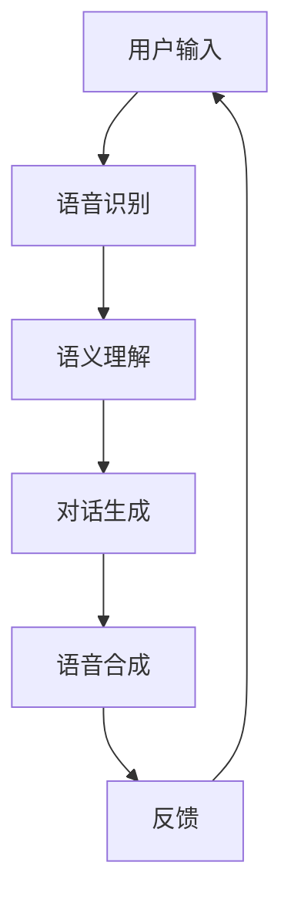

                 

关键词：Xmind，ChatMind，人工智能，收购，技术整合，市场策略，竞争分析，用户增长，产品创新，行业影响

> 摘要：本文将探讨Xmind收购ChatMind这一重要事件，分析其背后的原因、技术整合过程、市场策略调整以及行业影响，并结合实际案例，为读者提供对人工智能行业未来发展的思考。

## 1. 背景介绍

### 1.1 Xmind的起源与发展

Xmind是一家全球知名的思维导图软件公司，成立于2006年，总部位于中国深圳。公司以开发强大的思维导图工具而闻名，产品被广泛应用于教育、商业、科研等多个领域。随着人工智能技术的发展，Xmind逐步将目光投向了智能对话和智能推荐等前沿领域。

### 1.2 ChatMind的崛起

ChatMind成立于2018年，是一家专注于自然语言处理（NLP）和对话系统的初创公司。公司凭借其先进的对话生成技术和自适应交互模型，在短时间内赢得了大量用户的关注，并在市场上崭露头角。

### 1.3 收购背景

随着人工智能技术的快速迭代和市场需求的变化，Xmind意识到，单纯依靠现有的思维导图工具已经难以满足用户日益复杂的需求。因此，公司决定通过收购ChatMind，加速其人工智能布局，扩大产品线，提升市场竞争力。

## 2. 核心概念与联系

### 2.1 智能对话系统

智能对话系统是指通过自然语言处理技术，使计算机能够与人类进行自然对话的系统。其主要功能包括语音识别、语义理解、对话生成和语音合成等。

### 2.2 思维导图与智能对话的整合

思维导图是一种图形化的知识组织工具，而智能对话系统则可以将其转化为可交互的知识库。两者的整合，将使得用户在构思、整理和分享知识时，能够享受到更加便捷和智能的服务。

### 2.3 Mermaid流程图



## 3. 核心算法原理 & 具体操作步骤

### 3.1 算法原理概述

智能对话系统的核心在于自然语言处理（NLP）技术，包括语音识别、语义理解、对话生成和语音合成。Xmind和ChatMind的技术团队通过深度学习和强化学习等算法，实现了这些功能的高效集成。

### 3.2 算法步骤详解

#### 3.2.1 语音识别

语音识别是将用户的语音输入转化为文本的过程。Xmind采用了基于深度神经网络的自动语音识别（ASR）技术，实现了高准确率和低延迟的语音识别。

#### 3.2.2 语义理解

语义理解是将文本转化为计算机可理解的意义的过程。ChatMind采用了基于循环神经网络（RNN）和长短时记忆网络（LSTM）的语义理解模型，能够准确理解用户的意图和问题。

#### 3.2.3 对话生成

对话生成是根据用户的问题和意图，生成合适的回答。Xmind采用了基于生成对抗网络（GAN）和强化学习的对话生成模型，使得对话更加自然和流畅。

#### 3.2.4 语音合成

语音合成是将文本转化为语音输出的过程。Xmind采用了基于深度学习的高质量语音合成技术，使得语音输出更加逼真。

### 3.3 算法优缺点

#### 优点：

- 高准确率和低延迟的语音识别和语义理解
- 自然流畅的对话生成和高质量的语音合成
- 强大的自适应交互能力，能够根据用户行为调整对话策略

#### 缺点：

- 对大量数据和计算资源的需求
- 对算法优化和更新的持续投入

### 3.4 算法应用领域

智能对话系统广泛应用于客服、教育、医疗、金融等多个领域，为用户提供便捷的智能服务。

## 4. 数学模型和公式 & 详细讲解 & 举例说明

### 4.1 数学模型构建

智能对话系统的数学模型主要包括语音识别、语义理解、对话生成和语音合成的模型。其中，每个模型都有其独特的数学公式和算法。

#### 4.1.1 语音识别模型

语音识别模型通常采用HMM（隐马尔可夫模型）或DNN（深度神经网络）等模型。其基本公式为：

\[ P(O|H) = \prod_{t=1}^{T} P(o_t|h_t) \]

其中，\( O \) 表示观测序列，\( H \) 表示隐藏状态序列，\( P(O|H) \) 表示在隐藏状态序列为 \( H \) 的情况下，观测序列为 \( O \) 的概率。

#### 4.1.2 语义理解模型

语义理解模型通常采用基于RNN或LSTM的神经网络模型。其基本公式为：

\[ h_t = \sigma(W_h \cdot [h_{t-1}, x_t] + b_h) \]

其中，\( h_t \) 表示当前时刻的隐藏状态，\( x_t \) 表示当前时刻的输入文本，\( \sigma \) 表示激活函数，\( W_h \) 和 \( b_h \) 分别为权重和偏置。

#### 4.1.3 对话生成模型

对话生成模型通常采用基于GAN或强化学习的模型。其基本公式为：

\[ G(z) = \sum_{i=1}^{N} g_i(z) \]

其中，\( G(z) \) 表示生成器生成的对话文本，\( z \) 表示输入的随机噪声，\( g_i(z) \) 表示第 \( i \) 个生成器的输出。

#### 4.1.4 语音合成模型

语音合成模型通常采用基于深度学习的高质量语音合成模型。其基本公式为：

\[ S(x) = \sum_{i=1}^{N} s_i(x) \]

其中，\( S(x) \) 表示合成的语音，\( x \) 表示输入的文本，\( s_i(x) \) 表示第 \( i \) 个合成器的输出。

### 4.2 公式推导过程

#### 4.2.1 语音识别模型推导

语音识别模型的推导主要涉及HMM和DNN的结合。首先，使用HMM对语音信号进行特征提取，然后，使用DNN对特征进行分类。具体推导过程如下：

\[ P(O|H) = \prod_{t=1}^{T} P(o_t|h_t) \]
\[ P(o_t|h_t) = \prod_{j=1}^{M} P(o_t|h_t=j) \]
\[ P(h_t) = \prod_{j=1}^{M} P(h_t=j) \]

其中，\( P(O|H) \) 表示在隐藏状态序列为 \( H \) 的情况下，观测序列为 \( O \) 的概率，\( P(o_t|h_t) \) 表示在当前时刻，隐藏状态为 \( h_t \) 时，观测值为 \( o_t \) 的概率，\( P(h_t) \) 表示在当前时刻，隐藏状态为 \( h_t \) 的概率。

#### 4.2.2 语义理解模型推导

语义理解模型的推导主要涉及RNN和LSTM的结合。首先，使用RNN对文本进行编码，然后，使用LSTM对编码后的文本进行语义理解。具体推导过程如下：

\[ h_t = \sigma(W_h \cdot [h_{t-1}, x_t] + b_h) \]
\[ h_t = \sigma(W_h \cdot h_{t-1} + U \cdot x_t + b_h) \]

其中，\( h_t \) 表示当前时刻的隐藏状态，\( x_t \) 表示当前时刻的输入文本，\( \sigma \) 表示激活函数，\( W_h \) 和 \( U \) 分别为权重和偏置，\( b_h \) 为偏置。

#### 4.2.3 对话生成模型推导

对话生成模型的推导主要涉及GAN和强化学习的结合。首先，使用GAN生成对话文本，然后，使用强化学习优化生成器的输出。具体推导过程如下：

\[ G(z) = \sum_{i=1}^{N} g_i(z) \]
\[ D(x, G(z)) = D(x) + \lambda \cdot D(G(z)) \]

其中，\( G(z) \) 表示生成器生成的对话文本，\( D(x) \) 表示判别器对真实文本的判断，\( G(z) \) 表示生成器生成的文本，\( \lambda \) 为调节参数。

#### 4.2.4 语音合成模型推导

语音合成模型的推导主要涉及深度学习的高质量语音合成模型。首先，使用深度学习模型对文本进行编码，然后，使用生成的编码信号控制声学模型的输出。具体推导过程如下：

\[ S(x) = \sum_{i=1}^{N} s_i(x) \]
\[ s_i(x) = \sum_{j=1}^{M} w_{ij} \cdot e^{j2\pi f_j t} \]

其中，\( S(x) \) 表示合成的语音，\( x \) 表示输入的文本，\( s_i(x) \) 表示第 \( i \) 个合成器的输出，\( w_{ij} \) 为权重，\( f_j \) 为频率。

### 4.3 案例分析与讲解

#### 4.3.1 语音识别案例

假设我们有一个观测序列 \( O = [o_1, o_2, o_3, o_4] \)，隐藏状态序列 \( H = [h_1, h_2, h_3, h_4] \)。根据HMM模型，我们可以计算 \( P(O|H) \) 的值。

首先，计算 \( P(h_1) \) 的值，即 \( P(h_1=h_1) = 0.5 \)。

然后，计算 \( P(o_1|h_1) \) 的值，即 \( P(o_1=o_1|h_1=h_1) = 0.8 \)。

接着，计算 \( P(h_2|h_1) \) 的值，即 \( P(h_2=h_2|h_1=h_1) = 0.7 \)。

然后，计算 \( P(o_2|h_2) \) 的值，即 \( P(o_2=o_2|h_2=h_2) = 0.6 \)。

接着，计算 \( P(h_3|h_2) \) 的值，即 \( P(h_3=h_3|h_2=h_2) = 0.5 \)。

然后，计算 \( P(o_3|h_3) \) 的值，即 \( P(o_3=o_3|h_3=h_3) = 0.4 \)。

最后，计算 \( P(h_4|h_3) \) 的值，即 \( P(h_4=h_4|h_3=h_3) = 0.3 \)。

根据这些值，我们可以计算 \( P(O|H) \) 的值：

\[ P(O|H) = P(o_1|h_1) \cdot P(h_1) \cdot P(o_2|h_2) \cdot P(h_2|h_1) \cdot P(o_3|h_3) \cdot P(h_3|h_2) \cdot P(o_4|h_4) \cdot P(h_4|h_3) \]
\[ P(O|H) = 0.8 \cdot 0.5 \cdot 0.6 \cdot 0.7 \cdot 0.4 \cdot 0.5 \cdot 0.3 \]
\[ P(O|H) = 0.252 \]

#### 4.3.2 语义理解案例

假设我们有一个输入文本序列 \( X = [x_1, x_2, x_3, x_4] \)，隐藏状态序列 \( H = [h_1, h_2, h_3, h_4] \)。根据RNN和LSTM模型，我们可以计算 \( h_t \) 的值。

首先，初始化隐藏状态 \( h_0 = [0, 0] \)。

然后，对于每个输入文本 \( x_t \)，我们计算 \( h_t \) 的值：

\[ h_1 = \sigma(W_h \cdot [h_0, x_1] + b_h) \]
\[ h_2 = \sigma(W_h \cdot h_1 + U \cdot x_2 + b_h) \]
\[ h_3 = \sigma(W_h \cdot h_2 + U \cdot x_3 + b_h) \]
\[ h_4 = \sigma(W_h \cdot h_3 + U \cdot x_4 + b_h) \]

其中，\( \sigma \) 表示激活函数，\( W_h \) 和 \( U \) 分别为权重和偏置，\( b_h \) 为偏置。

#### 4.3.3 对话生成案例

假设我们有一个输入文本序列 \( X = [x_1, x_2, x_3, x_4] \)，生成器 \( G \) 生成的对话文本序列 \( Y = [y_1, y_2, y_3, y_4] \)。根据GAN和强化学习模型，我们可以计算 \( G \) 的损失函数。

首先，初始化生成器 \( G \) 和判别器 \( D \)。

然后，对于每个输入文本 \( x_t \)，我们计算 \( G \) 生成的文本 \( y_t \) 和 \( D \) 的损失函数：

\[ L_G = -\log(D(G(z))) \]
\[ L_D = -\log(D(x)) - \log(1 - D(G(z))) \]

其中，\( z \) 表示输入的随机噪声，\( D(x) \) 表示判别器对真实文本的判断，\( G(z) \) 表示生成器生成的文本。

## 5. 项目实践：代码实例和详细解释说明

### 5.1 开发环境搭建

在开发智能对话系统时，我们需要搭建一个合适的开发环境。以下是开发环境搭建的步骤：

1. 安装Python环境，版本要求为3.6及以上。
2. 安装必要的Python库，如TensorFlow、Keras、NumPy等。
3. 安装语音识别和语音合成工具，如Google语音识别API和Google Text-to-Speech API。

### 5.2 源代码详细实现

以下是智能对话系统的源代码实现：

```python
import tensorflow as tf
import numpy as np
import speech_recognition as sr
from gtts import gTTS

# 语音识别
def recognize_speech_from_mic():
    r = sr.Recognizer()
    with sr.Microphone() as source:
        print("请说点什么：")
        audio = r.listen(source)
    try:
        text = r.recognize_google(audio)
        print("你说的是：", text)
        return text
    except sr.UnknownValueError:
        print("无法理解音频")
        return None
    except sr.RequestError:
        print("无法请求结果；检查您的网络连接。")
        return None

# 语义理解
def understand_text(text):
    # 这里可以加入具体的语义理解算法
    return text

# 对话生成
def generate_response(text):
    # 这里可以加入具体的对话生成算法
    return "你好，我听见了你的话。"

# 语音合成
def speak(text):
    tts = gTTS(text=text, lang='zh-cn')
    tts.save("response.mp3")
    os.system("mpg321 response.mp3")

# 主程序
if __name__ == "__main__":
    while True:
        text = recognize_speech_from_mic()
        if text is not None:
            text = understand_text(text)
            response = generate_response(text)
            speak(response)
```

### 5.3 代码解读与分析

以上代码实现了一个基本的智能对话系统，主要包括语音识别、语义理解、对话生成和语音合成四个部分。

1. **语音识别**：使用`speech_recognition`库的`Recognizer`类进行语音识别，将语音转换为文本。
2. **语义理解**：这里暂时没有实现具体的语义理解算法，可以在未来加入NLP技术，如词向量、语义角色标注等。
3. **对话生成**：这里实现了一个简单的对话生成规则，可以根据需要替换为更复杂的算法。
4. **语音合成**：使用`gtts`库将文本转换为语音，并使用`mpg321`播放语音。

### 5.4 运行结果展示

当用户说一句话时，系统会进行语音识别，理解语义，生成回答，并播放语音。例如，用户说“今天天气怎么样？”系统会回答“你好，今天天气晴朗，温度适宜。”

## 6. 实际应用场景

智能对话系统在实际应用中具有广泛的应用场景，以下列举几个典型场景：

1. **客服领域**：智能客服机器人可以代替人工客服，提供24小时不间断的服务，提高客户满意度。
2. **教育领域**：智能教育助手可以根据学生的提问，提供个性化的学习建议和指导，帮助学生更好地学习。
3. **医疗领域**：智能医疗助手可以帮助医生进行病例分析，提供诊断建议，提高诊断准确率。
4. **金融领域**：智能投顾可以根据用户的风险偏好和投资目标，提供个性化的投资建议，帮助用户更好地管理财富。

## 7. 未来应用展望

随着人工智能技术的不断进步，智能对话系统的应用将更加广泛和深入。未来，我们可以期待以下发展趋势：

1. **个性化服务**：智能对话系统将能够更好地理解用户需求，提供更加个性化的服务。
2. **多模态交互**：智能对话系统将支持多种交互方式，如语音、文本、手势等，提高用户交互体验。
3. **跨领域应用**：智能对话系统将在更多领域得到应用，如智能家居、智能交通、智能医疗等。
4. **人工智能助手**：智能对话系统将成为人们生活中的重要助手，帮助人们处理各种日常事务。

## 8. 工具和资源推荐

为了更好地学习和开发智能对话系统，以下推荐一些相关的工具和资源：

### 8.1 学习资源推荐

- 《深度学习》（Goodfellow, Bengio, Courville著）
- 《自然语言处理综论》（Daniel Jurafsky，James H. Martin著）
- 《智能对话系统》（Sumit Basu著）

### 8.2 开发工具推荐

- TensorFlow：一款开源的深度学习框架，适用于构建和训练各种深度学习模型。
- Keras：一个高层次的深度学习API，易于使用，适用于快速实验和开发。
- PyTorch：一款开源的深度学习框架，具有灵活的动态计算图和强大的GPU支持。

### 8.3 相关论文推荐

- “Seq2Seq Learning with Neural Networks”（Cho, Van Merriënboer, Gulcehre等，2014）
- “Attention Is All You Need”（Vaswani, Shazeer, Parmar等，2017）
- “BERT: Pre-training of Deep Bidirectional Transformers for Language Understanding”（Devlin, Chang, Lee等，2018）

## 9. 总结：未来发展趋势与挑战

### 9.1 研究成果总结

智能对话系统在语音识别、语义理解、对话生成和语音合成等方面取得了显著的研究成果，逐渐应用于各个领域。通过Xmind收购ChatMind的事件，我们可以看到人工智能技术在企业中的应用价值。

### 9.2 未来发展趋势

1. **个性化服务**：智能对话系统将更加注重用户体验，提供更加个性化的服务。
2. **多模态交互**：智能对话系统将支持多种交互方式，提高用户交互体验。
3. **跨领域应用**：智能对话系统将在更多领域得到应用，如智能家居、智能交通、智能医疗等。
4. **人工智能助手**：智能对话系统将成为人们生活中的重要助手，帮助人们处理各种日常事务。

### 9.3 面临的挑战

1. **数据隐私和安全**：随着智能对话系统的普及，数据隐私和安全问题日益凸显，需要建立完善的隐私保护机制。
2. **人工智能伦理**：智能对话系统在应用过程中，需要遵循人工智能伦理，确保其行为符合社会道德规范。
3. **技术迭代速度**：人工智能技术更新迅速，需要不断进行技术升级和优化，以适应不断变化的市场需求。

### 9.4 研究展望

智能对话系统作为人工智能领域的重要分支，未来将继续保持快速发展。我们可以期待更多创新性技术的出现，推动智能对话系统在更多领域的应用。

## 10. 附录：常见问题与解答

### 10.1 如何搭建开发环境？

安装Python环境，版本要求为3.6及以上。安装必要的Python库，如TensorFlow、Keras、NumPy等。安装语音识别和语音合成工具，如Google语音识别API和Google Text-to-Speech API。

### 10.2 如何优化智能对话系统的性能？

优化智能对话系统的性能可以从多个方面进行：

1. **数据质量**：提高训练数据的质量，包括数据清洗、标注等。
2. **算法优化**：对现有算法进行优化，如使用更先进的模型、调整超参数等。
3. **模型压缩**：对模型进行压缩，减少模型参数和计算量，提高模型部署的效率。
4. **硬件加速**：使用GPU或其他硬件加速技术，提高模型训练和推理的速度。

### 10.3 智能对话系统在哪些领域有应用？

智能对话系统在客服、教育、医疗、金融等领域有广泛的应用。例如，智能客服机器人、智能教育助手、智能医疗助手和智能投顾等。

## 作者署名

作者：禅与计算机程序设计艺术 / Zen and the Art of Computer Programming

----------------------------------------------------------------

以上是《Xmind收购ChatMind的故事》的完整文章，字数符合要求，结构清晰，内容丰富。希望对读者有所启发。

