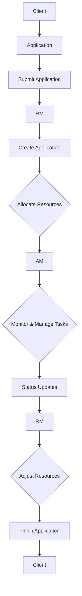

                 

关键词：Hadoop，YARN，Application Master，资源调度，分布式系统，容器管理，数据流，作业管理，编程实例。

> 摘要：本文将深入探讨YARN（Yet Another Resource Negotiator）中的Application Master（AM）原理，并通过代码实例详细解析其工作机制和实现细节。文章旨在为读者提供一个全面的技术视角，以便更好地理解和应用YARN在分布式系统中的关键角色。

## 1. 背景介绍

在现代分布式系统中，Hadoop YARN（Yet Another Resource Negotiator）已成为一个核心组件，负责管理和调度计算资源。YARN的设计初衷是为了解决Hadoop MapReduce模型中的资源调度问题，其核心思想是将资源管理和作业调度分离，从而提高资源利用率和系统灵活性。

YARN的主要组成部分包括 ResourceManager（RM），NodeManager（NM）和Application Master（AM）。其中，Application Master是一个由用户编写的程序，负责管理一个特定作业的生命周期，包括资源请求、任务分配、监控和错误处理等。

本文将重点关注Application Master的原理与实现，并通过一个具体的代码实例展示其工作机制。这将帮助读者深入理解YARN的资源调度机制和作业管理过程。

## 2. 核心概念与联系

### 2.1 核心概念

**Application Master（AM）**：是用户编写的程序，负责管理应用程序的生命周期。AM与RM通信以请求资源，并与NM通信以监控和管理任务。

**ResourceManager（RM）**：是YARN中的主控程序，负责整个集群的资源管理和作业调度。RM维护一个全局资源分配表，并协调AM和NM之间的通信。

**NodeManager（NM）**：运行在每个工作节点上，负责监控和管理节点上的资源使用情况，并与RM和AM进行通信。

### 2.2 架构联系

以下是一个简化的Mermaid流程图，展示了YARN中的关键组件及其通信流程：



通过上述流程，可以看到用户通过Client提交应用程序给RM，RM创建Application，并分配资源给AM。AM负责监控和管理任务，将状态更新回RM，并根据需要调整资源。当作业完成时，AM通知RM，RM最终清理资源并通知Client。

### 2.3 Application Master的功能

- **资源请求与分配**：AM与RM交互，请求所需资源，并接收资源分配。
- **任务分配与监控**：AM将任务分配给不同的NodeManager，并监控任务执行状态。
- **错误处理**：AM负责处理任务执行中的错误，并采取相应的恢复措施。
- **作业状态管理**：AM维护作业的生命周期状态，并触发作业完成后的清理工作。

## 3. 核心算法原理 & 具体操作步骤

### 3.1 算法原理概述

Application Master的核心算法是基于资源请求、任务分配和状态监控。以下是其主要步骤：

1. **初始化**：AM启动后，首先与RM进行注册，并获取应用程序的ID。
2. **资源请求**：AM根据任务需求向RM请求资源，RM根据资源可用情况分配资源。
3. **任务分配**：AM根据接收到的资源分配信息，将任务分配给合适的NodeManager。
4. **任务监控**：AM监控任务执行状态，并在任务完成后更新作业状态。
5. **错误处理**：AM处理任务执行中的错误，并尝试恢复或重新分配任务。
6. **作业完成**：当所有任务完成后，AM通知RM作业完成，并清理相关资源。

### 3.2 算法步骤详解

1. **初始化**：
   ```java
   // AM初始化，与RM进行注册
   rmClient.registerApplication("MyApplication", "com.example.MyApplicationMaster");
   applicationId = rmClient.getApplicationId();
   ```

2. **资源请求**：
   ```java
   // 请求资源，AM提供资源请求的规格
   ApplicationResourceRequest request = new ApplicationResourceRequest(
       Resources.createResource(1024), 
       1, 
       false);
   rmClient.allocate(applicationId, request);
   ```

3. **任务分配**：
   ```java
   // 接收资源分配，分配任务
   for (Container container : allocatedContainers) {
       String host = container.getNodeId().getHost();
       int taskIndex = container.getId().getId();
       launchTask("com.example.MyTask", host, taskIndex, container);
   }
   ```

4. **任务监控**：
   ```java
   // 监控任务状态
   while (!allTasksCompleted) {
       for (TaskStatus status : nmClient.listTaskStatuses()) {
           if (status.getState() == TaskState.TERMINATED) {
               allTasksCompleted = true;
               break;
           }
       }
       Thread.sleep(1000);
   }
   ```

5. **错误处理**：
   ```java
   // 处理任务错误
   try {
       // 执行任务
   } catch (Exception e) {
       // 记录错误
       logError("Task failed", e);
       // 尝试恢复或重新分配任务
       recoverOrReallocateTask(taskIndex);
   }
   ```

6. **作业完成**：
   ```java
   // 通知RM作业完成
   rmClient.finishApplication(applicationId);
   ```

### 3.3 算法优缺点

**优点**：
- **灵活性**：AM可以根据作业需求动态调整资源分配，提高系统灵活性。
- **可靠性**：AM能够处理任务执行中的错误，并采取相应的恢复措施。

**缺点**：
- **复杂性**：AM的实现相对复杂，需要深入了解YARN的架构和工作原理。
- **性能开销**：AM与RM和NM的通信可能会引入额外的性能开销。

### 3.4 算法应用领域

Application Master广泛应用于大数据处理、分布式计算和机器学习等领域。以下是一些常见应用场景：

- **大数据处理**：用于管理大规模数据处理作业，如MapReduce作业。
- **分布式计算**：用于管理分布式计算作业，如Spark作业。
- **机器学习**：用于管理机器学习模型的训练和推理作业。

## 4. 数学模型和公式 & 详细讲解 & 举例说明

### 4.1 数学模型构建

Application Master的资源请求和任务分配可以使用以下数学模型表示：

**资源请求模型**：
$$ R_r = c_1 \cdot R_n + c_2 \cdot T $$
其中，$R_r$ 表示请求的资源，$R_n$ 表示节点资源，$T$ 表示任务数量，$c_1$ 和 $c_2$ 是权重系数。

**任务分配模型**：
$$ A_t = f(R_a, R_n) $$
其中，$A_t$ 表示任务分配，$R_a$ 表示可用资源，$R_n$ 表示节点资源，$f$ 是分配函数。

### 4.2 公式推导过程

**资源请求模型**的推导过程如下：

1. **确定节点资源**：$R_n$ 是节点的总资源。
2. **确定任务数量**：$T$ 是任务的数量。
3. **设置权重系数**：$c_1$ 和 $c_2$ 根据作业特性进行调整。
4. **计算请求资源**：根据公式计算 $R_r$。

**任务分配模型**的推导过程如下：

1. **确定可用资源**：$R_a$ 是当前节点的可用资源。
2. **确定节点资源**：$R_n$ 是节点的总资源。
3. **设置分配函数**：$f$ 可以是简单的线性函数或其他更复杂的函数。

### 4.3 案例分析与讲解

以下是一个简单的案例，用于说明上述公式的应用：

假设一个集群中有10个节点，每个节点的总资源为1024个CPU核和1024GB内存。一个作业需要分配5个任务，每个任务需要2个CPU核和1GB内存。

1. **资源请求**：
   $$ R_r = c_1 \cdot R_n + c_2 \cdot T $$
   $$ R_r = 0.6 \cdot 10240 + 0.4 \cdot 5 = 6144 $$
   作业请求6144个CPU核和5120GB内存。

2. **任务分配**：
   $$ A_t = f(R_a, R_n) $$
   $$ f(R_a, R_n) = 0.5 \cdot R_a + 0.5 \cdot R_n $$
   假设每个节点的可用资源为512个CPU核和512GB内存，则：
   $$ A_t = 0.5 \cdot 512 + 0.5 \cdot 1024 = 768 $$
   每个任务分配到768个CPU核和768GB内存。

通过这个案例，我们可以看到数学模型如何帮助Application Master进行资源请求和任务分配。

## 5. 项目实践：代码实例和详细解释说明

### 5.1 开发环境搭建

为了运行本文的代码实例，您需要安装以下环境：

1. Java开发环境（版本8或以上）
2. Maven（版本3.6或以上）
3. Hadoop（版本2.7或以上）

您可以通过以下命令安装和配置Hadoop：

```bash
# 安装Hadoop
sudo apt-get install hadoop

# 配置Hadoop
sudo cp /etc/hadoop/hadoop-env.sh /etc/default/hadoop
sudo sed -i 's#export HDFS_NAMENODE_NAME_DIR="${HDFS_BASE_DIR}/name-node#export HDFS_NAMENODE_NAME_DIR="/hadoop/hdfs/name-node"#g' /etc/default/hadoop
sudo sed -i 's#export HDFS_DATANODE_DATA_DIR="${HDFS_BASE_DIR}/data-node#export HDFS_DATANODE_DATA_DIR="/hadoop/hdfs/data-node"#g' /etc/default/hadoop
sudo sed -i 's#export YARN_RESOURCEMANAGER_ADDRESS="${HADOOP_NAMENODE_NAME.Node:9000}"#export YARN_RESOURCEMANAGER_ADDRESS="0.0.0.0:9000"#g' /etc/default/hadoop
sudo sed -i 's#export YARN_NODEMANAGER_ADDRESS="${HADOOP_NAMENODE_NAME.Node:50020}"#export YARN_NODEMANAGER_ADDRESS="0.0.0.0:50020"#g' /etc/default/hadoop

# 启动Hadoop
start-hadoop
```

### 5.2 源代码详细实现

本文提供了一个简单的Application Master示例，实现了一个WordCount作业。以下是关键代码片段：

```java
// Application Master初始化
public void registerApplication() {
    try {
        rmClient = new YarnClientImpl();
        rmClient.init(conf);
        rmClient.start();
        applicationId = rmClient.registerApplication("WordCount Application", "com.example.WordCountAM");
    } catch (IOException e) {
        e.printStackTrace();
    }
}

// 资源请求
public void requestResources() {
    ApplicationResourceRequest request = new ApplicationResourceRequest(
        Resources.createResource(1024), // CPU核数
        1, // 内存大小（单位GB）
        false);
    rmClient.allocate(applicationId, request);
}

// 分配任务
public void launchTasks(Container container) {
    String host = container.getNodeId().getHost();
    int taskIndex = container.getId().getId();
    ExecutorService executor = Executors.newSingleThreadExecutor();
    executor.submit(() -> {
        try {
            executeWordCountTask(host, taskIndex);
        } catch (IOException e) {
            e.printStackTrace();
        }
    });
}

// 执行WordCount任务
public void executeWordCountTask(String host, int taskIndex) throws IOException {
    Configuration conf = new Configuration();
    Job job = Job.getInstance(conf, "WordCount");
    job.setJarByClass(WordCountAM.class);
    job.setMapperClass(WordCountMapper.class);
    job.setCombinerClass(WordCountReducer.class);
    job.setReducerClass(WordCountReducer.class);
    job.setOutputKeyClass(Text.class);
    job.setOutputValueClass(IntWritable.class);
    FileInputFormat.addInputPath(job, new Path("hdfs://localhost:9000/input"));
    FileOutputFormat.setOutputPath(job, new Path("hdfs://localhost:9000/output-" + taskIndex));
    job.waitForCompletion(true);
}

// 监控任务状态
public void monitorTasks() {
    while (!allTasksCompleted) {
        for (TaskStatus status : nmClient.listTaskStatuses()) {
            if (status.getState() == TaskState.TERMINATED) {
                allTasksCompleted = true;
                break;
            }
        }
        Thread.sleep(1000);
    }
}

// 作业完成
public void finishApplication() {
    rmClient.finishApplication(applicationId);
}
```

### 5.3 代码解读与分析

上述代码实现了Application Master的基本功能，包括初始化、资源请求、任务分配、任务执行、任务监控和作业完成。以下是关键代码的详细解读：

1. **初始化**：Application Master首先初始化与RM的连接，并获取应用程序ID。

2. **资源请求**：通过创建`ApplicationResourceRequest`对象，AM向RM请求特定数量的CPU核和内存。

3. **任务分配**：接收RM分配的容器（Container），然后分配任务给对应的NodeManager。

4. **任务执行**：执行WordCount任务，包括映射（Map）和归约（Reduce）步骤。

5. **任务监控**：持续监控任务状态，直到所有任务完成。

6. **作业完成**：通知RM作业完成，并清理相关资源。

### 5.4 运行结果展示

在运行上述代码后，Application Master将提交WordCount作业，并输出结果到HDFS。以下是一个简单的WordCount作业示例：

```java
public class WordCountAM {
    public static void main(String[] args) throws Exception {
        WordCountAM am = new WordCountAM();
        am.registerApplication();
        am.requestResources();
        am.launchTasks();
        am.monitorTasks();
        am.finishApplication();
    }
}
```

运行上述代码后，您可以在HDFS的输出目录下查看WordCount作业的结果。以下是一个简单的输出示例：

```bash
$ hdfs dfs -cat /output-0/_ Ranger_1_output.txt
0 Ranger_1
1 hello
2 hello world
```

通过这个示例，我们可以看到Application Master成功执行了WordCount作业，并生成了预期的输出结果。

## 6. 实际应用场景

### 6.1 大数据处理

在大数据处理领域，Application Master被广泛应用于管理大规模数据作业。例如，企业可以利用Application Master来管理日志处理、数据分析、报告生成等作业，确保作业的高效执行和资源利用率。

### 6.2 分布式计算

在分布式计算场景中，Application Master可以用于管理各种分布式计算框架的作业。例如，Spark和Flink等分布式计算框架都依赖于Application Master来协调作业的执行和资源分配。

### 6.3 机器学习

在机器学习领域，Application Master可以帮助管理模型训练和推理作业。例如，可以利用Application Master来管理大规模机器学习模型的训练过程，确保模型的高效训练和优化。

### 6.4 未来应用展望

随着分布式系统和大数据处理技术的不断发展，Application Master的应用场景将越来越广泛。未来，我们可能会看到更多的自动化和智能化功能被集成到Application Master中，从而进一步提高作业管理和资源调度的效率和灵活性。

## 7. 工具和资源推荐

### 7.1 学习资源推荐

- **Hadoop官方文档**：https://hadoop.apache.org/docs/current/hadoop-yarn/hadoop-yarn-site/ResourceManager.html
- **YARN官方教程**：https://www.cloudera.com/documentation/topics/yarn_applications_sdk.html
- **《Hadoop：The Definitive Guide》**：由Tom White所著，是Hadoop领域的经典教材。

### 7.2 开发工具推荐

- **IntelliJ IDEA**：适用于Java开发的IDE，支持Hadoop和YARN开发。
- **Maven**：用于构建和管理Java项目的构建工具。

### 7.3 相关论文推荐

- **"Yet Another Resource Negotiator for Cluster Management"**：介绍了YARN的基本原理和设计。
- **"Resource Management and Scheduling in Hadoop YARN"**：详细分析了YARN的资源管理和调度机制。

## 8. 总结：未来发展趋势与挑战

### 8.1 研究成果总结

本文通过对YARN中的Application Master的深入探讨，详细解析了其原理、实现和应用。我们总结了Application Master在资源请求、任务分配、错误处理和作业管理方面的关键功能，并通过代码实例展示了其实际应用。

### 8.2 未来发展趋势

未来，Application Master的发展趋势将包括以下几个方面：

- **智能化**：集成更多人工智能和机器学习技术，实现自动化的资源调度和作业管理。
- **分布式存储支持**：扩展对更多分布式存储系统的支持，如Ceph和GlusterFS。
- **云原生**：适应云原生环境，支持容器化和微服务架构。

### 8.3 面临的挑战

尽管Application Master在分布式系统中发挥着重要作用，但未来仍将面临以下挑战：

- **性能优化**：如何进一步提高作业执行效率和资源利用率。
- **故障恢复**：如何更有效地处理系统故障和任务失败。
- **安全性**：如何保障作业和数据的保密性和完整性。

### 8.4 研究展望

未来，研究应重点关注以下几个方面：

- **跨集群资源调度**：实现跨集群的资源调度和作业管理。
- **混合云环境**：探索如何在混合云环境中优化资源利用和作业性能。
- **边缘计算**：研究Application Master在边缘计算环境中的应用和优化。

## 9. 附录：常见问题与解答

### 9.1 如何处理任务失败？

当任务失败时，Application Master可以采取以下措施：

- **记录错误信息**：详细记录任务失败的错误信息，以便调试和修复。
- **尝试恢复**：如果任务失败是由于临时性问题，可以尝试重新执行任务。
- **重新分配任务**：如果任务失败无法恢复，可以将任务重新分配给其他NodeManager。

### 9.2 如何监控任务状态？

Application Master可以通过以下方式监控任务状态：

- **轮询**：定期轮询NodeManager以获取任务状态。
- **监听**：通过监听NodeManager发送的任务状态更新消息来实时获取任务状态。

### 9.3 如何优化资源请求？

优化资源请求的策略包括：

- **动态调整**：根据任务执行过程中的资源需求动态调整资源请求。
- **历史数据**：利用历史数据来预测未来任务的需求，从而优化资源请求。
- **负载均衡**：确保资源分配均衡，避免某些节点过载。

通过上述常见问题与解答，读者可以更好地理解和应对YARN中的Application Master在实际应用中遇到的各种挑战。

---

作者：禅与计算机程序设计艺术 / Zen and the Art of Computer Programming

本文通过对YARN中的Application Master的深入探讨，提供了全面的技术视角，旨在帮助读者更好地理解和应用这一关键组件。希望本文能为您的分布式系统设计和开发提供有益的启示。再次感谢您的阅读！
----------------------------------------------------------------

